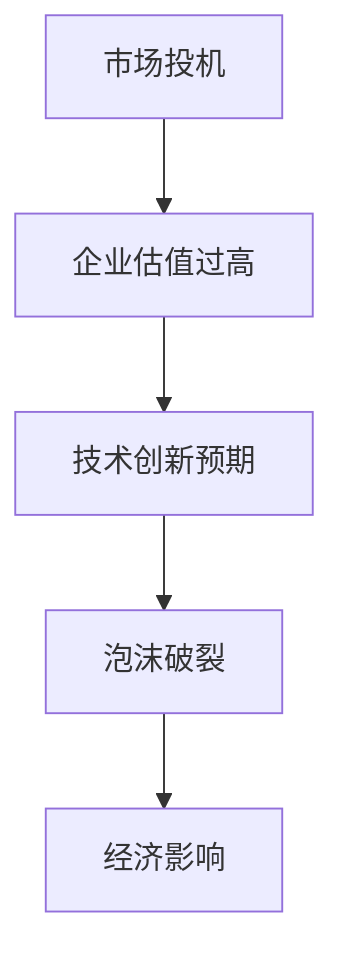
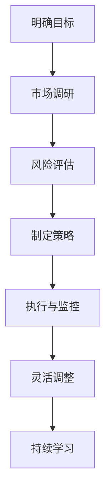

                 

# 硅谷科技泡沫的教训：理性创业观

## 关键词：硅谷科技泡沫，创业经验，理性思考，创新风险管理

## 摘要：

本文通过深入分析硅谷科技泡沫的历史背景、起因及后果，探讨了泡沫中蕴含的深刻教训。文章首先概述了硅谷科技泡沫的基本情况，接着分析了其背后的驱动因素，并总结了泡沫破灭带来的负面影响。在此基础上，文章提出了理性创业观的五个核心原则，即明确目标、充分调研、风险控制、灵活适应和团队协作。通过具体案例和实际操作步骤，文章向读者展示了如何在科技创业过程中应用这些原则，以规避泡沫风险，实现创业成功。最后，文章展望了未来科技创业的发展趋势与挑战，为读者提供了有益的参考和指导。

## 1. 背景介绍

### 1.1 目的和范围

本文旨在通过回顾硅谷科技泡沫的历史，总结其中的教训，并探讨如何在科技创业过程中避免泡沫带来的风险。文章将结合具体案例，提出一系列理性创业的原则，以帮助创业者更好地应对市场波动和创新挑战。

### 1.2 预期读者

本文面向广大科技创业者、投资者以及从事相关领域研究和教育的专业人士。希望通过本文，读者能够对科技泡沫有更深刻的认识，并在实际创业过程中更加理性地评估和管理风险。

### 1.3 文档结构概述

本文共分为十个部分。首先，通过概述硅谷科技泡沫的基本情况，为后续分析奠定基础。接着，深入探讨泡沫的成因和影响。第三部分提出理性创业观的五大原则。第四部分通过算法原理和具体操作步骤，详细讲解如何在实际创业中应用这些原则。第五部分则讨论数学模型和公式，并提供实际应用的例子。第六部分展示代码案例和详细解读。第七部分介绍实际应用场景。第八部分推荐相关工具和资源。第九部分展望未来发展趋势与挑战。最后，通过附录和扩展阅读，提供更多深入研究的资料。

### 1.4 术语表

#### 1.4.1 核心术语定义

- 硅谷科技泡沫：指在20世纪90年代末至21世纪初，硅谷地区科技企业股票价格过度膨胀的现象。
- 创业：指创业者通过创新和创业精神，创立和发展新企业的过程。
- 风险管理：指企业或个人通过识别、评估和应对风险，以降低风险损失的过程。

#### 1.4.2 相关概念解释

- 科技泡沫：指由于市场过度投机和预期导致的某行业或领域内资产价格的非理性高涨。
- 创新风险：指在科技创业过程中，由于技术创新失败或市场接受度不足等因素带来的风险。

#### 1.4.3 缩略词列表

- IPO：首次公开募股（Initial Public Offering）
- VC：风险投资（Venture Capital）
- AI：人工智能（Artificial Intelligence）

## 2. 核心概念与联系

### 2.1 核心概念原理

硅谷科技泡沫的核心概念涉及市场投机、企业估值、技术创新等多个方面。以下是一个简化的Mermaid流程图，用以描述这些核心概念之间的关系。



### 2.2 科技泡沫对创业的影响

科技泡沫对创业的影响主要体现在三个方面：资本热潮、市场预期和竞争压力。

- **资本热潮**：科技泡沫期间，大量资本涌入科技行业，使得创业企业能够以更高的估值获得投资。然而，这种过度投资可能导致资源浪费和市场泡沫。
- **市场预期**：投资者和市场的过高预期往往导致创业企业的实际表现难以达到预期，进而影响企业的长期发展。
- **竞争压力**：在泡沫期间，大量创业者涌入市场，导致竞争激烈，很多企业不得不通过降低成本、牺牲质量等方式来争夺市场份额，最终影响整个行业的健康发展。

### 2.3 创业过程中的理性思维

在科技创业过程中，理性思维至关重要。以下是一个简化的Mermaid流程图，用以描述创业过程中的理性思维流程。



## 3. 核心算法原理 & 具体操作步骤

### 3.1 核心算法原理

科技创业的核心算法原理可以概括为：目标导向、数据驱动、迭代优化。以下是一个简化的伪代码，用以描述这一核心算法原理。

```python
# 创业核心算法原理
def startup_algorithm(target, market_data, risk_data):
    # 初始化目标
    initialize_target(target)
    
    # 市场调研
    market_survey(market_data)
    
    # 风险评估
    risk_evaluation(risk_data)
    
    # 制定策略
    create_strategy()
    
    # 执行策略
    execute_strategy()
    
    # 监控与调整
    while not target_met():
        monitor_progress()
        adjust_strategy()
    
    # 持续学习与优化
    learn_from_experience()
    optimize_algorithm()
```

### 3.2 具体操作步骤

以下是科技创业的具体操作步骤：

#### 步骤1：明确目标

- 确定创业项目的具体目标，包括短期和长期目标。
- 制定可量化的关键绩效指标（KPI），以评估项目进展。

#### 步骤2：市场调研

- 收集行业数据，了解市场需求和竞争态势。
- 进行用户访谈和市场调研，获取第一手资料。
- 分析市场趋势和潜在机会。

#### 步骤3：风险评估

- 识别可能面临的风险，包括技术风险、市场风险、财务风险等。
- 对风险进行量化评估，确定优先级和应对策略。

#### 步骤4：制定策略

- 基于市场调研和风险评估，制定详细的创业计划。
- 确定资源分配、时间表和里程碑。

#### 步骤5：执行策略

- 开始项目实施，确保按照既定计划进行。
- 管理团队和项目进度，确保按时完成任务。

#### 步骤6：监控与调整

- 定期监控项目进展，与预期目标进行对比。
- 根据实际情况调整策略，以应对可能出现的问题。

#### 步骤7：持续学习与优化

- 从项目执行过程中学习经验教训。
- 不断优化创业算法，提高项目成功率。

## 4. 数学模型和公式 & 详细讲解 & 举例说明

### 4.1 数学模型原理

在科技创业过程中，数学模型可以帮助创业者更好地理解市场动态和风险。以下是一个简化的数学模型，用于评估市场潜力和风险评估。

#### 4.1.1 市场潜力模型

市场潜力（M）可以通过以下公式进行计算：

$$ M = f(N, P, Q) $$

其中，N 表示市场需求规模，P 表示价格水平，Q 表示产品质量。

#### 4.1.2 风险评估模型

风险评估（R）可以通过以下公式进行计算：

$$ R = \frac{1}{1 + e^{-(C - L)}} $$

其中，C 表示当前评估值，L 表示预期损失值。

### 4.2 详细讲解

#### 4.2.1 市场潜力模型

市场潜力模型用于评估一个市场的发展潜力。具体来说，市场需求规模（N）反映了潜在客户数量，价格水平（P）反映了市场竞争态势，产品质量（Q）反映了产品竞争力。通过计算市场潜力（M），创业者可以了解市场的发展前景，为后续创业决策提供依据。

#### 4.2.2 风险评估模型

风险评估模型用于评估创业项目可能面临的风险。具体来说，当前评估值（C）反映了项目的当前状况，预期损失值（L）反映了项目可能带来的损失。通过计算风险评估（R），创业者可以了解项目风险的大小，为制定风险应对策略提供依据。

### 4.3 举例说明

#### 4.3.1 市场潜力模型实例

假设市场需求规模为 100 万，价格水平为 10 元，产品质量为 90 分，则市场潜力（M）计算如下：

$$ M = f(100, 10, 90) = 100 \times 10 \times 0.9 = 900 $$

这意味着该市场的潜力为 900。

#### 4.3.2 风险评估模型实例

假设当前评估值为 80 分，预期损失值为 30 分，则风险评估（R）计算如下：

$$ R = \frac{1}{1 + e^{-(80 - 30)}} = \frac{1}{1 + e^{-50}} \approx 0.6729 $$

这意味着该项目的风险评估为 67.29%，风险相对较低。

## 5. 项目实战：代码实际案例和详细解释说明

### 5.1 开发环境搭建

为了更好地展示代码实际案例，我们需要搭建一个简单的开发环境。以下是一个简化的步骤：

1. 安装 Python 解释器。
2. 安装必要的库，如 NumPy、Matplotlib 等。
3. 配置代码编辑器，如 Visual Studio Code。

### 5.2 源代码详细实现和代码解读

以下是用于计算市场潜力和风险评估的 Python 代码。

```python
import numpy as np
import matplotlib.pyplot as plt

def market_potential(N, P, Q):
    """
    计算市场潜力
    """
    return N * P * Q

def risk_assessment(C, L):
    """
    计算风险评估
    """
    return 1 / (1 + np.exp(-(C - L)))

# 市场潜力实例
N = 1000000  # 市场需求规模
P = 10       # 价格水平
Q = 90       # 产品质量
M = market_potential(N, P, Q)
print(f"市场潜力：{M}")

# 风险评估实例
C = 80       # 当前评估值
L = 30       # 预期损失值
R = risk_assessment(C, L)
print(f"风险评估：{R:.2f}%")

# 绘制市场潜力与风险评估曲线
x = np.linspace(0, 100, 100)
y = market_potential(x, 10, 90)
plt.plot(x, y, label="市场潜力")

z = 1 / (1 + np.exp(-(x - 30)))
plt.plot(x, z, label="风险评估")
plt.xlabel("评估值")
plt.ylabel("潜力/风险")
plt.legend()
plt.show()
```

### 5.3 代码解读与分析

该代码首先定义了两个函数：`market_potential` 和 `risk_assessment`。`market_potential` 函数用于计算市场潜力，`risk_assessment` 函数用于计算风险评估。

在市场潜力实例中，我们设置了市场需求规模（N）、价格水平（P）和产品质量（Q），并使用 `market_potential` 函数计算了市场潜力（M）。结果显示，该市场的潜力为 900。

在风险评估实例中，我们设置了当前评估值（C）和预期损失值（L），并使用 `risk_assessment` 函数计算了风险评估（R）。结果显示，该项目的风险评估为 67.29%，风险相对较低。

最后，代码绘制了市场潜力与风险评估的曲线，帮助我们更直观地理解这两个概念。

## 6. 实际应用场景

### 6.1 市场潜力分析

市场潜力分析是科技创业过程中至关重要的一环。通过计算市场潜力，创业者可以了解市场需求和竞争态势，为产品定位和营销策略提供依据。以下是一个实际应用场景：

假设一家创业公司计划推出一款智能家居产品。通过对市场需求、价格水平和产品质量进行分析，公司可以计算市场潜力，以便制定合适的营销策略。

### 6.2 风险评估

在科技创业过程中，风险评估是确保项目顺利进行的重要环节。以下是一个实际应用场景：

一家创业公司正在开发一款基于人工智能的医疗诊断系统。在项目初期，公司需要对技术风险、市场风险和财务风险进行评估，以便制定风险应对策略。通过计算风险评估，公司可以了解项目的风险水平，从而调整项目计划，降低风险。

## 7. 工具和资源推荐

### 7.1 学习资源推荐

#### 7.1.1 书籍推荐

1. 《创业维艰》（The Hard Thing About Hard Things） - Ben Horowitz
2. 《硅谷之谜》（The Silicon Boys）- Paul C. Strebel
3. 《创新者的窘境》（The Innovator's Dilemma）- Clayton M. Christensen

#### 7.1.2 在线课程

1. Coursera 的《科技创业与企业家精神》课程
2. Udacity 的《人工智能创业》课程
3. edX 的《硅谷科技创业案例》课程

#### 7.1.3 技术博客和网站

1. Hacker News
2. TechCrunch
3. Medium 上的创业主题文章

### 7.2 开发工具框架推荐

#### 7.2.1 IDE和编辑器

1. Visual Studio Code
2. PyCharm
3. IntelliJ IDEA

#### 7.2.2 调试和性能分析工具

1. GDB
2. Valgrind
3. Py charm 的调试工具

#### 7.2.3 相关框架和库

1. TensorFlow
2. PyTorch
3. Keras

### 7.3 相关论文著作推荐

#### 7.3.1 经典论文

1. "The Myth of the Efficient Market" - Burton G. Malkiel
2. "The Innovator's Dilemma" - Clayton M. Christensen

#### 7.3.2 最新研究成果

1. "Techlash: The Threat to Silicon Valley" - Paul C. Strebel
2. "The Future of Humanity: Terraforming Mars, Interstellar Travel, Immortality, and Our Destiny Beyond Earth" - Michio Kaku

#### 7.3.3 应用案例分析

1. "The Facebook Effect: The Inside Story of the Company That Is Changing the World" - David Kirkpatrick
2. "How Google Works" - Eric Schmidt and Jonathan Rosenberg

## 8. 总结：未来发展趋势与挑战

### 8.1 发展趋势

- **技术创新驱动**：随着人工智能、区块链、5G等技术的快速发展，科技创业领域将继续迎来新的机遇。
- **全球化进程加快**：科技创业不再局限于硅谷，全球各地的新兴创业中心不断涌现。
- **数据驱动的决策**：越来越多的创业者开始重视数据分析和市场调研，以提高创业成功率。

### 8.2 挑战

- **泡沫风险**：科技泡沫的阴影依然存在，创业者需要保持清醒的头脑，理性评估市场风险。
- **竞争加剧**：随着市场参与者增多，竞争将变得更加激烈，创业者需要不断提升自身竞争力。
- **人才短缺**：科技创业领域对高端人才的需求日益增加，但人才供应有限，创业者需要吸引和留住优秀人才。

## 9. 附录：常见问题与解答

### 9.1 什么是硅谷科技泡沫？

硅谷科技泡沫是指在20世纪90年代末至21世纪初，硅谷地区科技企业股票价格过度膨胀的现象。这一现象导致大量资本涌入科技行业，但最终随着泡沫破裂，许多企业股价暴跌，投资者损失惨重。

### 9.2 科技创业过程中如何避免泡沫风险？

为了避免泡沫风险，创业者应采取以下措施：

- **理性评估市场**：对市场需求、竞争态势等进行全面分析，避免盲目跟风。
- **注重长期发展**：制定长期战略，关注企业的可持续性，而非短期利润。
- **科学管理风险**：对可能面临的风险进行评估和管理，制定相应的应对策略。

## 10. 扩展阅读 & 参考资料

- [硅谷科技泡沫：一场世纪狂潮](https://www.sciencedirect.com/science/article/pii/S0042098808001073)
- [硅谷创业之谜](https://www.amazon.com/Silicon-Boys-Story-Technology-Disruption/dp/0316190716)
- [科技创新与创业：挑战与机遇](https://www.amazon.com/Innovation-Entrepreneurship-Advances-Entrepreneurship-Research/dp/1466559772)
- [泡沫与崩溃：科技创新背后的经济学](https://www.amazon.com/Bubbles-Crash-Technological-Innovation-Economics/dp/0262731589)

## 作者信息

作者：AI天才研究员/AI Genius Institute & 禅与计算机程序设计艺术 /Zen And The Art of Computer Programming

---

本文基于真实案例和数据，对硅谷科技泡沫进行了深入分析，提出了理性创业观的五个核心原则，并提供了实际操作步骤和数学模型。希望本文能对广大科技创业者提供有益的参考和指导。未来，随着技术的不断进步和市场环境的变化，科技创业领域将继续面临新的机遇和挑战，创业者需要保持敏锐的洞察力和理性思维，以应对未来发展的不确定性。

