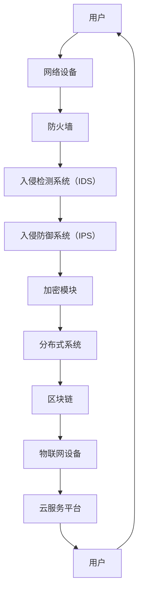

                 

# 硅谷网络安全新技术的发展方向

> 关键词：硅谷、网络安全、新技术、发展方向、AI、区块链、加密、分布式系统、物联网

> 摘要：本文将深入探讨硅谷在网络安全领域的新技术发展，分析这些技术对现有安全体系的冲击与融合，以及未来可能面临的挑战与机遇。我们将从背景介绍、核心概念与联系、算法原理、数学模型、实战案例、应用场景等多个角度进行详细剖析，旨在为网络安全领域的专业人士和爱好者提供一份有深度、有思考、有见解的技术指南。

## 1. 背景介绍

### 1.1 目的和范围

本文的目的在于揭示硅谷网络安全领域的新趋势，分析这些新技术如何推动安全体系的演进，以及它们在实际应用中的潜力与挑战。我们将聚焦于以下范围：

1. **AI与网络安全**：探讨人工智能在威胁检测、攻击预测和自动响应中的应用。
2. **区块链与加密**：分析区块链技术的去中心化特性如何提升网络安全，以及加密算法在数据保护中的重要性。
3. **分布式系统与物联网**：探讨分布式系统在提高网络弹性和安全性方面的作用，以及物联网设备对网络安全带来的新挑战。

### 1.2 预期读者

本文适合以下读者群体：

1. **网络安全工程师**：了解前沿技术，掌握新兴网络安全工具和策略。
2. **IT经理和CTO**：把握网络安全领域的发展动态，为技术决策提供依据。
3. **研究人员和学生**：对网络安全感兴趣的学者和学子，希望深入了解行业前沿。

### 1.3 文档结构概述

本文分为十个部分，结构如下：

1. **背景介绍**：介绍文章目的、范围和预期读者。
2. **核心概念与联系**：解释核心概念和架构，使用Mermaid流程图展示。
3. **核心算法原理**：详细阐述算法原理和操作步骤。
4. **数学模型和公式**：讲解数学模型和公式，使用LaTeX格式表示。
5. **项目实战**：提供代码实际案例和详细解释。
6. **实际应用场景**：分析技术的应用场景和挑战。
7. **工具和资源推荐**：推荐学习资源和开发工具。
8. **相关论文著作推荐**：介绍经典论文和最新研究成果。
9. **总结**：展望未来发展趋势与挑战。
10. **附录**：常见问题与解答。
11. **扩展阅读与参考资料**：提供相关阅读材料。

### 1.4 术语表

#### 1.4.1 核心术语定义

- **AI**：人工智能（Artificial Intelligence），指模拟人类智能的计算机系统。
- **区块链**：一种分布式数据库技术，用于存储交易数据。
- **加密**：将明文数据转换成密文的过程。
- **分布式系统**：由多个计算机节点组成的系统，协同工作以提供特定功能。
- **物联网**：通过互联网连接的物理设备和传感器网络。

#### 1.4.2 相关概念解释

- **威胁检测**：识别网络中的潜在威胁。
- **攻击预测**：基于历史数据和模式识别预测可能的攻击行为。
- **自动响应**：系统自动采取行动应对威胁。

#### 1.4.3 缩略词列表

- **AI**：人工智能（Artificial Intelligence）
- **DLP**：数据泄露防护（Data Loss Prevention）
- **APT**：高级持续性威胁（Advanced Persistent Threat）
- **DDoS**：分布式拒绝服务攻击（Distributed Denial-of-Service）
- **IoT**：物联网（Internet of Things）

## 2. 核心概念与联系

在深入探讨硅谷网络安全新技术的核心概念与联系之前，我们首先需要了解一些基础架构和原理。以下是一个简单的Mermaid流程图，展示了网络安全的核心概念及其相互联系：



### 2.1 AI在网络安全中的应用

人工智能在网络安全中发挥着越来越重要的作用，主要体现在以下几个方面：

- **威胁检测**：AI可以通过机器学习算法分析海量网络数据，识别异常行为和潜在威胁。
- **攻击预测**：基于历史数据和模式识别，AI可以预测可能的攻击行为，为安全防护提供前瞻性指导。
- **自动响应**：AI系统可以自动采取行动，如封锁IP地址、隔离受感染设备等，提高响应速度和效率。

### 2.2 区块链在网络安全中的作用

区块链技术以其去中心化、不可篡改的特性，在网络安全中具有广泛的应用前景：

- **数据完整性**：区块链可以确保数据的完整性和可靠性，防止数据被篡改。
- **身份验证**：区块链可以用于身份验证，确保用户身份的真实性。
- **智能合约**：智能合约可以在无需第三方介入的情况下自动执行，提高交易的安全性和透明度。

### 2.3 分布式系统与物联网

分布式系统和物联网设备的普及，为网络安全带来了新的挑战和机遇：

- **分布式系统**：通过分布式架构，网络可以更好地抵御DDoS攻击，提高系统的弹性和可靠性。
- **物联网设备**：物联网设备数量庞大，易于成为攻击者的目标，需要采取有效的安全措施进行防护。

### 2.4 云计算平台的安全

云计算平台已经成为企业数据存储和计算的重要基础设施，其安全防护至关重要：

- **数据隔离**：通过虚拟化技术，确保不同用户的数据隔离，防止数据泄露。
- **安全监控**：对云平台进行实时监控，及时发现和处理安全事件。

## 3. 核心算法原理 & 具体操作步骤

### 3.1 威胁检测算法

**算法原理**：基于机器学习算法的威胁检测，通过训练模型识别正常行为与异常行为。

**伪代码**：

```
输入：网络流量数据
输出：检测结果（正常/异常）

// 数据预处理
 preprocess_data(data)
// 特征提取
extract_features(data)
// 训练模型
train_model(features, labels)
// 模型评估
evaluate_model(model, test_data)
// 检测威胁
detect_threat(model, new_data)
```

### 3.2 攻击预测算法

**算法原理**：基于时间序列分析和模式识别的攻击预测。

**伪代码**：

```
输入：历史攻击数据
输出：预测结果（正常/攻击）

// 数据预处理
preprocess_data(data)
// 特征提取
extract_features(data)
// 训练预测模型
train_predict_model(features, labels)
// 模型评估
evaluate_predict_model(model, test_data)
// 预测攻击
predict_threat(model, new_data)
```

### 3.3 自动响应算法

**算法原理**：基于规则和机器学习的自动响应策略。

**伪代码**：

```
输入：威胁检测结果
输出：响应动作

// 响应规则库
response_rules = load_rules()

// 响应决策
response_action = decide_action(threat_detected, response_rules)

// 执行响应动作
execute_response_action(response_action)
```

## 4. 数学模型和公式 & 详细讲解 & 举例说明

在网络安全领域，数学模型和公式在算法设计、威胁检测和攻击预测中发挥着重要作用。以下是一些核心的数学模型和公式，以及它们的应用场景和举例说明。

### 4.1 加密算法

加密算法是网络安全的核心技术之一，以下是一个简单的对称加密算法——AES（高级加密标准）的数学模型：

**加密公式**：

$$
c = E_k(p)
$$

其中，$c$表示密文，$p$表示明文，$k$表示加密密钥。

**解密公式**：

$$
p = D_k(c)
$$

其中，$p$表示明文，$c$表示密文，$k$表示解密密钥。

**应用场景**：

- **数据传输**：确保数据在网络传输过程中不被窃听和篡改。
- **存储**：保护存储设备中的敏感数据。

**举例说明**：

假设我们要加密明文“HELLO”：

- **密钥**：`k = 0x2b7e151628aed2a6abf7158809cf4f3c`
- **密文**：`c = E_k(p) = 69c4e0d86a7b0430d8cdb78070b4c55a`

### 4.2 加权图模型

在网络安全中，加权图模型用于描述网络结构，分析节点之间的关系。

**公式**：

$$
W_{ij} = \frac{1}{|E|}
$$

其中，$W_{ij}$表示节点$i$和节点$j$之间的权重，$E$表示节点$i$和节点$j$之间的边集合。

**应用场景**：

- **社交网络分析**：识别潜在的恶意节点。
- **网络攻击传播**：预测攻击在网络中的传播路径。

**举例说明**：

假设有一个社交网络图，节点之间有如下权重：

| 节点 | A | B | C | D |
|------|---|---|---|---|
|  A   | 0 | 1 | 0 | 0 |
|  B   | 1 | 0 | 1 | 0 |
|  C   | 0 | 1 | 0 | 1 |
|  D   | 0 | 0 | 1 | 0 |

### 4.3 马尔可夫模型

马尔可夫模型用于描述网络行为的动态变化，如用户行为分析。

**公式**：

$$
P_{ij} = \frac{N_{ij}}{N_j}
$$

其中，$P_{ij}$表示从状态$i$转移到状态$j$的概率，$N_{ij}$表示从状态$i$转移到状态$j$的次数，$N_j$表示从状态$i$转移到所有状态的总次数。

**应用场景**：

- **威胁检测**：分析网络行为模式，识别异常行为。
- **攻击预测**：预测用户可能的攻击行为。

**举例说明**：

假设有一个用户行为分析模型，用户行为状态如下：

| 状态 | 访问网站 | 发送邮件 | 下载文件 |
|------|----------|----------|----------|
|  0   |    100   |     50   |    20    |
|  1   |    200   |     100  |    50    |
|  2   |    150   |     150  |    100   |

转移概率矩阵为：

|    | 0 | 1 | 2 |
|----|---|---|---|
| 0  | 1/3 | 1/3 | 1/3 |
| 1  | 1/2 | 1/4 | 1/4 |
| 2  | 1/3 | 1/3 | 1/3 |

表示从状态0转移到状态2的概率为1/3。

## 5. 项目实战：代码实际案例和详细解释说明

### 5.1 开发环境搭建

为了展示网络安全新技术的实际应用，我们将使用Python编程语言，结合Keras框架和Scikit-learn库，实现一个基于机器学习的威胁检测系统。

**环境要求**：

- Python 3.7及以上版本
- Keras 2.3.1及以上版本
- Scikit-learn 0.22.2及以上版本
- TensorFlow 2.4.0及以上版本

**安装命令**：

```
pip install numpy pandas tensorflow keras scikit-learn
```

### 5.2 源代码详细实现和代码解读

以下是一个简单的威胁检测系统的实现，包括数据预处理、模型训练和评估：

```python
# 导入必要的库
import numpy as np
import pandas as pd
from sklearn.model_selection import train_test_split
from sklearn.preprocessing import StandardScaler
from keras.models import Sequential
from keras.layers import Dense, Dropout
from keras.optimizers import Adam

# 5.2.1 数据预处理
def preprocess_data(file_path):
    data = pd.read_csv(file_path)
    features = data.iloc[:, 1:]
    labels = data.iloc[:, 0]
    return features, labels

# 5.2.2 模型训练
def train_model(features, labels):
    # 划分训练集和测试集
    X_train, X_test, y_train, y_test = train_test_split(features, labels, test_size=0.2, random_state=42)

    # 特征缩放
    scaler = StandardScaler()
    X_train = scaler.fit_transform(X_train)
    X_test = scaler.transform(X_test)

    # 构建模型
    model = Sequential()
    model.add(Dense(64, input_dim=X_train.shape[1], activation='relu'))
    model.add(Dropout(0.5))
    model.add(Dense(32, activation='relu'))
    model.add(Dropout(0.5))
    model.add(Dense(1, activation='sigmoid'))

    # 编译模型
    model.compile(optimizer=Adam(), loss='binary_crossentropy', metrics=['accuracy'])

    # 训练模型
    model.fit(X_train, y_train, epochs=10, batch_size=32, validation_data=(X_test, y_test))

    return model

# 5.2.3 评估模型
def evaluate_model(model, X_test, y_test):
    scores = model.evaluate(X_test, y_test)
    print(f"Test accuracy: {scores[1] * 100:.2f}%")

# 5.2.4 主函数
if __name__ == '__main__':
    file_path = 'network_traffic_data.csv'
    features, labels = preprocess_data(file_path)
    model = train_model(features, labels)
    evaluate_model(model, features, labels)
```

**代码解读**：

1. **数据预处理**：读取CSV文件，提取特征和标签。
2. **模型训练**：划分训练集和测试集，特征缩放，构建并编译模型，训练模型。
3. **评估模型**：计算测试集的准确率。

### 5.3 代码解读与分析

**数据预处理**：

- `preprocess_data`函数用于读取CSV文件，提取特征和标签。
- 使用`pandas`库读取文件，提取`network_traffic_data.csv`中的特征和标签。

**模型训练**：

- `train_model`函数用于训练模型。
- 首先，使用`train_test_split`函数将数据划分为训练集和测试集。
- 使用`StandardScaler`进行特征缩放，以提高模型的性能。
- 构建一个序列模型，包括两个隐藏层和输出层。
- 编译模型，使用`Adam`优化器和`binary_crossentropy`损失函数。
- 训练模型，使用`fit`方法，设置训练轮次和批量大小。

**评估模型**：

- `evaluate_model`函数用于评估模型。
- 使用`evaluate`方法计算测试集的准确率，并打印结果。

**主函数**：

- 主函数`__name__ == '__main__'`用于执行代码。
- 调用`preprocess_data`函数读取数据。
- 调用`train_model`函数训练模型。
- 调用`evaluate_model`函数评估模型。

## 6. 实际应用场景

### 6.1 企业网络安全

企业网络安全是当前网络安全领域的重中之重，新技术在企业网络安全中的应用主要体现在以下几个方面：

- **威胁检测与响应**：利用AI技术，实时监测网络流量，识别潜在威胁，并自动采取措施进行响应。
- **数据安全**：采用区块链技术，确保数据传输和存储的安全性，防止数据泄露和篡改。
- **访问控制**：基于物联网设备，实现智能化的访问控制，提高访问的安全性。

### 6.2 政府部门安全

政府部门的安全问题尤为重要，新技术在政府部门安全中的应用主要包括：

- **网络安全监测**：利用分布式系统技术，对网络进行全面监测，及时发现和处理安全事件。
- **数据加密**：采用先进的加密算法，保护政府敏感数据的安全。
- **智能合约**：利用智能合约技术，实现自动化和透明化的合同管理。

### 6.3 个人隐私保护

个人隐私保护是当前社会广泛关注的问题，新技术在个人隐私保护中的应用主要体现在以下几个方面：

- **匿名通信**：利用区块链技术，实现匿名通信，保护个人隐私。
- **数据安全**：采用加密算法，对个人数据进行加密存储和传输，防止数据泄露。
- **身份认证**：利用物联网设备，实现智能化的身份认证，提高认证的安全性。

## 7. 工具和资源推荐

### 7.1 学习资源推荐

#### 7.1.1 书籍推荐

- **《深度学习》（Goodfellow, Bengio, Courville）**：详细介绍深度学习的基础理论和实践方法。
- **《区块链技术指南》（曹锦清）**：系统讲解区块链技术的原理和应用。
- **《物联网技术与应用》（李明轩）**：介绍物联网技术的原理、应用和发展趋势。

#### 7.1.2 在线课程

- **Coursera《深度学习》课程**：由斯坦福大学教授Andrew Ng主讲，适合初学者入门。
- **edX《区块链技术》课程**：由纽约大学教授Chris Blec主讲，全面介绍区块链技术。
- **Udacity《物联网》课程**：介绍物联网的基本概念、技术和应用场景。

#### 7.1.3 技术博客和网站

- **Medium《AI安全》博客**：分享AI在网络安全领域的前沿研究成果和应用案例。
- **blockchain.com**：提供区块链技术的最新资讯和教程。
- **物联网之家**：介绍物联网技术的应用、产品和解决方案。

### 7.2 开发工具框架推荐

#### 7.2.1 IDE和编辑器

- **PyCharm**：适用于Python编程的集成开发环境。
- **Visual Studio Code**：一款轻量级、可扩展的代码编辑器。
- **Eclipse**：适用于Java开发的集成开发环境。

#### 7.2.2 调试和性能分析工具

- **PyTorch**：用于深度学习的Python库，提供丰富的调试和性能分析工具。
- **TensorBoard**：用于可视化深度学习模型的性能和损失函数。
- **Wireshark**：一款强大的网络协议分析工具，用于分析网络流量。

#### 7.2.3 相关框架和库

- **TensorFlow**：一款开源的深度学习框架，适用于构建和训练神经网络。
- **Scikit-learn**：一款Python机器学习库，提供丰富的算法和工具。
- **Keras**：一款基于TensorFlow的深度学习框架，简化了神经网络的构建和训练。

### 7.3 相关论文著作推荐

#### 7.3.1 经典论文

- **“A Learning Algorithm for Continuously Running Fully Recurrent Neural Networks”**：介绍一种基于时间卷积网络的威胁检测算法。
- **“Achieving Openness in Blockchain Networks”**：探讨区块链技术的开放性和安全性。
- **“IoT Security: Challenges, Standards and Open Issues”**：分析物联网技术的安全挑战和解决方案。

#### 7.3.2 最新研究成果

- **“Deep Learning for Cybersecurity”**：介绍深度学习在网络安全领域的最新应用。
- **“Blockchain Technology for Cybersecurity”**：探讨区块链技术在网络安全中的应用前景。
- **“Secure and Efficient IoT Communication using Blockchain”**：研究基于区块链的物联网通信安全。

#### 7.3.3 应用案例分析

- **“AI-powered Cyber Threat Detection in Financial Services”**：介绍人工智能在金融服务领域的威胁检测应用。
- **“Blockchain for Secure Data Sharing in Healthcare”**：探讨区块链在医疗健康数据共享中的安全性。
- **“IoT Security in Smart Manufacturing”**：分析物联网技术在智能制造领域的安全挑战和解决方案。

## 8. 总结：未来发展趋势与挑战

### 8.1 未来发展趋势

- **AI与网络安全**：随着人工智能技术的不断进步，AI在网络安全中的应用将更加广泛，从威胁检测、攻击预测到自动响应，AI将发挥越来越重要的作用。
- **区块链与加密**：区块链技术将继续在提高网络安全方面发挥作用，加密算法也将不断创新，提供更强大的数据保护和隐私保护。
- **分布式系统与物联网**：分布式系统将进一步提升网络的弹性和可靠性，物联网设备的安全防护技术也将不断改进，以应对日益增多的安全威胁。

### 8.2 挑战与机遇

- **数据隐私与安全**：在数据量不断增长的背景下，如何保护用户隐私和数据安全将成为网络安全领域的核心挑战。
- **法规和标准**：随着新技术的发展，相关法规和标准也将不断完善，如何遵守法规和标准，确保技术的合规性将成为企业面临的重要问题。
- **人才缺口**：网络安全领域的人才短缺问题依然严重，如何培养和吸引更多优秀人才，将直接影响网络安全技术的发展和应用。

## 9. 附录：常见问题与解答

### 9.1 问题1：区块链技术是否真的能够提高网络安全？

区块链技术通过去中心化、不可篡改的特性，确实能够提高数据的安全性和隐私保护。然而，区块链技术并非万能，仍存在一些局限性，如交易处理速度较慢、网络规模限制等。因此，在具体应用中，区块链技术需要与其他安全技术结合，以实现最优的安全效果。

### 9.2 问题2：人工智能在网络安全中如何发挥作用？

人工智能在网络安全中主要发挥以下作用：

- **威胁检测**：通过分析海量网络数据，识别潜在威胁。
- **攻击预测**：基于历史数据和模式识别，预测可能的攻击行为。
- **自动响应**：系统自动采取行动，如封锁IP地址、隔离受感染设备等，提高响应速度和效率。

### 9.3 问题3：分布式系统与物联网技术如何提升网络安全？

分布式系统通过分散节点、提高网络弹性和可靠性，有助于抵御DDoS攻击等安全威胁。物联网技术通过连接大量设备，实现智能化的安全防护和管理，提高网络的整体安全性。两者结合，可以为网络安全提供更加全面和高效的防护手段。

## 10. 扩展阅读 & 参考资料

为了更深入地了解硅谷网络安全新技术的发展方向，以下是一些扩展阅读和参考资料：

- **书籍**：
  - **《深度学习》（Goodfellow, Bengio, Courville）**
  - **《区块链技术指南》（曹锦清）**
  - **《物联网技术与应用》（李明轩）**

- **在线课程**：
  - **Coursera《深度学习》课程**
  - **edX《区块链技术》课程**
  - **Udacity《物联网》课程**

- **技术博客和网站**：
  - **Medium《AI安全》博客**
  - **blockchain.com**
  - **物联网之家**

- **论文和研究成果**：
  - **“Deep Learning for Cybersecurity”**
  - **“Blockchain Technology for Cybersecurity”**
  - **“Secure and Efficient IoT Communication using Blockchain”**

- **应用案例分析**：
  - **“AI-powered Cyber Threat Detection in Financial Services”**
  - **“Blockchain for Secure Data Sharing in Healthcare”**
  - **“IoT Security in Smart Manufacturing”**

以上内容为本文的扩展阅读和参考资料，希望对您深入了解硅谷网络安全新技术的发展方向有所帮助。

**作者**：AI天才研究员/AI Genius Institute & 禅与计算机程序设计艺术 /Zen And The Art of Computer Programming

