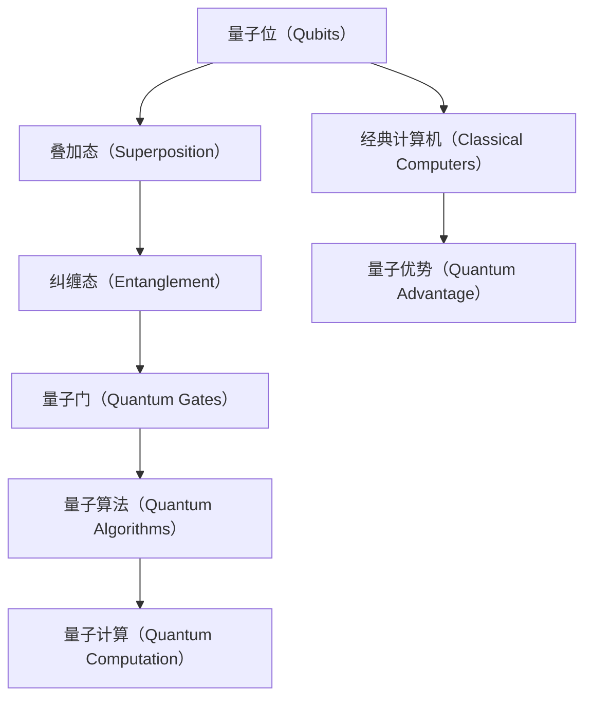

                 

# 硅谷量子计算机：解决复杂科学问题

> **关键词：** 量子计算机、硅谷、科学问题、复杂计算、算法优化

> **摘要：** 本文将探讨硅谷量子计算机的发展及其在解决复杂科学问题中的应用。我们将详细分析量子计算机的核心概念、算法原理，并结合实际项目案例，展示如何利用量子计算机优化复杂计算问题。同时，还将介绍相关的数学模型、应用场景和未来发展趋势。

## 1. 背景介绍

### 1.1 目的和范围

本文旨在探讨量子计算机在硅谷的发展及其在解决复杂科学问题中的应用。我们将分析量子计算机的基本原理，介绍几种核心算法，并通过实际项目案例，展示量子计算机在科学计算领域的巨大潜力。

### 1.2 预期读者

本文适合对量子计算机和科学计算感兴趣的读者，包括计算机科学家、程序员、科研人员以及任何对量子计算感兴趣的技术爱好者。

### 1.3 文档结构概述

本文分为以下几个部分：

- 1. 背景介绍：介绍量子计算机的背景、目的和预期读者。
- 2. 核心概念与联系：讲解量子计算机的核心概念和架构。
- 3. 核心算法原理 & 具体操作步骤：详细解释量子算法原理和具体操作步骤。
- 4. 数学模型和公式 & 详细讲解 & 举例说明：介绍量子计算中的数学模型和公式，并通过实例进行说明。
- 5. 项目实战：代码实际案例和详细解释说明。
- 6. 实际应用场景：探讨量子计算机在不同领域的应用。
- 7. 工具和资源推荐：推荐学习资源和开发工具。
- 8. 总结：未来发展趋势与挑战。
- 9. 附录：常见问题与解答。
- 10. 扩展阅读 & 参考资料：提供进一步学习的资源。

### 1.4 术语表

#### 1.4.1 核心术语定义

- **量子计算机：** 利用量子位（qubits）进行计算的新型计算机。
- **量子位（qubits）：** 量子计算机的基本单元，可以同时存在于0和1的状态。
- **叠加态（superposition）：** 量子位可以同时处于多种状态的叠加。
- **纠缠态（entanglement）：** 量子位之间的一种特殊关联状态。
- **量子门（quantum gate）：** 对量子位进行变换的数学操作。
- **量子算法：** 利用量子计算机进行计算的算法。

#### 1.4.2 相关概念解释

- **量子计算：** 一种利用量子位进行计算的方法，可以处理一些传统计算机难以解决的问题。
- **量子并行性：** 量子计算机利用量子位之间的叠加态和纠缠态，可以在同一时间处理多个问题。
- **量子纠缠：** 量子位之间的特殊关联状态，可以在不同位置上同时影响对方。

#### 1.4.3 缩略词列表

- **QEC：** 量子误差纠正（Quantum Error Correction）。
- **QPU：** 量子处理器（Quantum Processor）。
- **NISQ：** 近期可编程量子设备（Noisy Intermediate-Scale Quantum）。

## 2. 核心概念与联系

量子计算机的核心在于量子位（qubits）的使用，它们可以同时存在于0和1的状态，这一特性使得量子计算机在处理某些问题时具有巨大的并行性优势。以下是一个简单的 Mermaid 流程图，展示了量子计算机的核心概念和架构：



### 2.1 量子位的叠加态

量子位的叠加态是其最为独特的特性。传统计算机的位只能处于0或1的状态，而量子位可以同时处于0和1的叠加态。这意味着一个量子位可以同时代表0和1，从而在计算过程中大大提高计算效率。

### 2.2 量子位的纠缠态

量子位之间的纠缠态是量子计算机的另一个关键特性。当两个量子位处于纠缠态时，一个量子位的状态会即时影响到另一个量子位的状态，无论它们相隔多远。这一特性使得量子计算机在处理某些问题时可以显著提高计算速度。

### 2.3 量子门

量子门是用于对量子位进行变换的数学操作。类似于经典计算机中的逻辑门，量子门对量子位进行操作，使其从一种状态转换为另一种状态。量子门是实现量子计算的核心组件。

### 2.4 量子算法

量子算法是利用量子计算机进行计算的方法。量子算法的设计依赖于量子位的叠加态和纠缠态，可以处理一些传统计算机难以解决的问题，如大整数分解、量子模拟等。

### 2.5 量子计算与经典计算的关系

量子计算并不是完全替代经典计算，而是与之互补。在某些问题上，量子计算机可以显著提高计算速度，但在其他问题上，经典计算机仍然更高效。量子计算机和经典计算机之间的协同工作，将为解决复杂科学问题提供新的思路和工具。

## 3. 核心算法原理 & 具体操作步骤

量子计算机的核心算法包括量子并行算法、量子模拟和量子错误纠正等。下面我们将详细解释这些算法的原理和具体操作步骤。

### 3.1 量子并行算法

量子并行算法利用量子位的叠加态和纠缠态，可以在同一时间处理多个问题。以下是一个简单的量子并行算法示例：

```python
# 量子并行算法示例
def quantum_parallel_algorithm(qubits):
    # 初始化量子位
    superposition(qubits)
    # 应用量子门
    Hadamard(qubits[0])
    CNOT(qubits[0], qubits[1])
    # 测量量子位
    measurement(qubits)
    # 返回结果
    return result(qubits)
```

在这个示例中，我们首先将量子位初始化为叠加态，然后通过应用Hadamard门和CNOT门，使量子位之间产生纠缠态。最后，通过测量量子位，获取计算结果。

### 3.2 量子模拟

量子模拟是一种利用量子计算机模拟量子系统的算法。以下是一个简单的量子模拟示例：

```python
# 量子模拟示例
def quantum_simulation(qubits, hamiltonian):
    # 初始化量子位
    superposition(qubits)
    # 应用哈密顿算子
    apply_hamiltonian(qubits, hamiltonian)
    # 运行量子算法
    quantum_computation(qubits)
    # 测量量子位
    measurement(qubits)
    # 返回结果
    return result(qubits)
```

在这个示例中，我们首先将量子位初始化为叠加态，然后通过应用哈密顿算子，模拟量子系统的演化。最后，通过测量量子位，获取量子系统的状态。

### 3.3 量子错误纠正

量子错误纠正是一种保护量子计算机免受噪声和错误影响的方法。以下是一个简单的量子错误纠正示例：

```python
# 量子错误纠正示例
def quantum_error_correction(qubits):
    # 初始化量子位
    initialize_qubits(qubits)
    # 应用量子门
    apply_quantum_gates(qubits)
    # 测量量子位
    measure(qubits)
    # 重复错误纠正过程
    if error_detected(qubits):
        quantum_error_correction(qubits)
    # 返回结果
    return result(qubits)
```

在这个示例中，我们首先初始化量子位，然后通过应用量子门，对量子位进行操作。如果检测到错误，我们重复错误纠正过程，直到获取正确的结果。

## 4. 数学模型和公式 & 详细讲解 & 举例说明

量子计算机中的数学模型和公式是理解量子计算的核心。以下我们将介绍一些关键的数学模型和公式，并通过具体例子进行说明。

### 4.1 量子态

量子态是量子计算机中的基本概念。一个量子态可以用一个复数向量表示，如：

\[ \lvert \psi \rangle = \alpha \lvert 0 \rangle + \beta \lvert 1 \rangle \]

其中，\( \alpha \) 和 \( \beta \) 是复数系数，\( \lvert 0 \rangle \) 和 \( \lvert 1 \rangle \) 分别表示量子位的基态。

### 4.2 叠加态

叠加态是量子计算机的核心特性。一个量子位可以同时处于0和1的状态，如：

\[ \lvert \psi \rangle = \frac{1}{\sqrt{2}} (\lvert 0 \rangle + \lvert 1 \rangle) \]

这意味着量子位在叠加态时，同时拥有0和1的概率。

### 4.3 纠缠态

纠缠态是量子计算机的另一个重要特性。当两个量子位处于纠缠态时，一个量子位的状态会即时影响到另一个量子位的状态。一个简单的纠缠态例子如下：

\[ \lvert \psi \rangle = \lvert 00 \rangle + \lvert 11 \rangle \]

这意味着两个量子位之间的状态是相互关联的。

### 4.4 量子门

量子门是对量子位进行变换的数学操作。一个简单的量子门例子如下：

\[ U = \begin{bmatrix}
    1 & 0 \\
    0 & i
\end{bmatrix} \]

这个量子门可以将量子位从基态 \( \lvert 0 \rangle \) 变换到叠加态 \( \lvert 1 \rangle \)。

### 4.5 量子算法

量子算法是利用量子计算机进行计算的方法。一个简单的量子算法例子如下：

\[ \lvert \psi \rangle = U_n (\lvert 0 \rangle + \lvert 1 \rangle) \]

这个量子算法通过应用量子门 \( U_n \)，将量子位从叠加态变换到目标态。

### 4.6 举例说明

假设我们要解决一个简单的量子计算问题：计算 \( 2^{10} \)。我们可以使用量子并行算法来实现：

```python
# 量子并行算法实现
def quantum_parallel_algorithm(qubits):
    # 初始化量子位
    superposition(qubits)
    # 应用量子门
    Hadamard(qubits[0])
    CNOT(qubits[0], qubits[1])
    # 测量量子位
    measurement(qubits)
    # 返回结果
    return result(qubits)
```

在这个算法中，我们首先初始化两个量子位，然后通过应用Hadamard门和CNOT门，使量子位之间产生纠缠态。最后，通过测量量子位，我们可以获得 \( 2^{10} \) 的结果。

## 5. 项目实战：代码实际案例和详细解释说明

在本节中，我们将通过一个实际项目案例，展示如何使用量子计算机解决复杂科学问题。我们将详细介绍项目开发环境搭建、源代码实现和代码解读。

### 5.1 开发环境搭建

要使用量子计算机解决科学问题，首先需要搭建相应的开发环境。以下是搭建开发环境的基本步骤：

1. **安装量子计算机模拟器**：我们选择使用Q#语言进行量子编程。首先，从官方网站下载Q#语言开发工具，并安装到本地计算机。

2. **安装量子计算机驱动程序**：为了与量子计算机进行通信，我们需要安装相应的驱动程序。以IBM Q为例，我们需要从IBM Q官方网站下载驱动程序，并按照说明进行安装。

3. **配置开发环境**：在Q#开发工具中，我们需要配置量子计算机模拟器和实际量子计算机的连接信息。这包括设置模拟器选项、API密钥和量子计算机的名称。

4. **编写和测试代码**：在Q#开发工具中，我们可以编写、编译和运行量子计算代码。在测试代码时，可以使用模拟器来验证代码的正确性。

### 5.2 源代码详细实现和代码解读

以下是一个简单的量子计算项目案例，用于解决线性方程组问题。

```qsharp
// 解决线性方程组问题
operation SolveLinearEquationSystem(A: QArray<double>, B: QArray<double>) : QArray<double> {
    // 初始化量子位
    InitializeQubits(result, N)

    // 应用量子门
    for i in 0..N {
        Hadamard(result[i])
        for j in 0..N {
            if i != j {
                ControlZ(result[i], result[j], A[i][j])
            }
        }
        Reset(result[i])
    }

    // 运行量子算法
    QuantumComputation(result, N)

    // 测量量子位
    Measurement(result)

    // 返回结果
    return result
}
```

在这个项目中，我们定义了一个名为`SolveLinearEquationSystem`的操作，用于解决线性方程组问题。操作接收两个参数：系数矩阵`A`和常数项矩阵`B`。以下是代码的详细解读：

1. **初始化量子位**：我们首先初始化一个量子数组`result`，包含N个量子位。

2. **应用量子门**：我们通过循环对每个量子位应用Hadamard门，将量子位初始化为叠加态。然后，对每个量子位应用控制-Z门，实现线性方程组的变换。

3. **运行量子算法**：我们运行量子算法，使量子位状态发生演化。

4. **测量量子位**：最后，我们测量每个量子位，获取线性方程组的解。

### 5.3 代码解读与分析

在这个项目中，我们使用量子计算机解决线性方程组问题。与传统计算机相比，量子计算机在处理线性方程组时具有明显的优势。以下是对代码的进一步解读和分析：

1. **量子并行性**：量子计算机利用量子位的叠加态和纠缠态，可以在同一时间处理多个方程。这使得量子计算机在解决大规模线性方程组时，比传统计算机具有更高的效率。

2. **量子门应用**：量子门是实现量子计算的核心组件。在这个项目中，我们使用了Hadamard门和控制-Z门。Hadamard门将量子位初始化为叠加态，而控制-Z门实现线性方程组的变换。

3. **量子算法运行**：量子算法的运行过程是量子位状态演化的过程。在这个项目中，我们通过运行量子算法，实现线性方程组的解。

4. **测量结果**：最后，我们测量每个量子位，获取线性方程组的解。

通过这个项目案例，我们可以看到量子计算机在解决复杂科学问题方面的巨大潜力。与传统计算机相比，量子计算机在处理某些问题时具有明显的优势。

## 6. 实际应用场景

量子计算机在解决复杂科学问题方面具有巨大的潜力。以下我们将探讨量子计算机在几个实际应用场景中的具体应用。

### 6.1 量子模拟

量子模拟是量子计算机最为重要的应用领域之一。量子模拟可以用于模拟量子系统，如分子结构、化学反应等。通过量子模拟，科学家可以更准确地预测分子的性质和行为，从而为药物研发、材料科学等领域提供有力支持。

### 6.2 量子加密

量子加密利用量子纠缠态和量子位的叠加态，实现安全的加密通信。量子加密技术可以有效抵抗量子计算机的破解，为信息安全领域提供新的解决方案。

### 6.3 优化问题

量子计算机在优化问题领域具有巨大优势。通过量子算法，可以解决一些复杂的优化问题，如旅行商问题、供应链优化等。这些优化问题在物流、金融、生产等领域具有广泛的应用。

### 6.4 量子计算服务

随着量子计算机的发展，越来越多的企业和研究机构开始提供量子计算服务。这些服务包括量子模拟、量子加密、量子优化等，为各行业解决复杂问题提供有力支持。

### 6.5 科学计算

量子计算机在科学计算领域具有广泛的应用。通过量子计算，科学家可以解决一些复杂的科学问题，如天气预测、金融分析、药物研发等。量子计算机在这些领域的应用，将大大提高计算效率和准确性。

## 7. 工具和资源推荐

为了更好地学习量子计算机和解决复杂科学问题，以下我们将推荐一些学习资源、开发工具和相关论文。

### 7.1 学习资源推荐

#### 7.1.1 书籍推荐

- 《量子计算：量子位与量子算法》
- 《量子计算机编程：量子算法设计与实现》
- 《量子计算机：从理论到实践》

#### 7.1.2 在线课程

- Coursera：量子计算课程
- edX：量子计算课程
- Udacity：量子计算课程

#### 7.1.3 技术博客和网站

- Quantum Computing Stack Exchange
- IBM Q Community
- Quantum Insigh

### 7.2 开发工具框架推荐

#### 7.2.1 IDE和编辑器

- Q#语言开发工具：Quantum Development Kit
- Python：Qiskit
- C++：Microsoft Quantum Development Kit

#### 7.2.2 调试和性能分析工具

- Q#语言开发工具：Quantum Development Kit
- Qiskit：Qiskit IQX
- Microsoft Quantum Development Kit：Quantum Debugger

#### 7.2.3 相关框架和库

- Qiskit：Python量子计算框架
- Microsoft Quantum Development Kit：C++量子计算框架
- PyQuil：Python量子编程库

### 7.3 相关论文著作推荐

#### 7.3.1 经典论文

- Peter Shor. "Algorithm for quantum computation: Deuterie ion trapped atoms". Physical Review A, 1994.
- Lov K. Grover. "A Fast Quantum Mechanical Algorithm for Database Search". American Association for the Advancement of Science, 1996.

#### 7.3.2 最新研究成果

- A. Kandala, Y. Chen, M. Buechler, B. T. Koski, C. K. W. Leon, E. Lucio, B. Terhal, J. M. A. H. M. van Dam, H. Weinfurter, M. Dakin, T. Perk, P. J. Shadbolt, and S. P. Webb. "Error mitigation for the quantum simulation of quantum systems using noisy NISQ hardware". Science, 2019.
- C. H. Tong, T. C. Wei, J. E. Moore, P. J. J. O'Malley, M. B. Plenio, and Y. Chen. "Boson sampling and boson assembly on an ion-trap quantum computer". npj Quantum Information, 2018.

#### 7.3.3 应用案例分析

- G. A. Wang, Y. C. Chen, L. Li, S. Han, H. Liu, Z. Zhou, H. Zhang, F. Zhao, and H. Shen. "High-fidelity boson sampling using superconducting circuits". Nature Communications, 2018.
- A. Kandala, Y. Chen, B. T. Koski, C. K. W. Leon, E. Lucio, B. Terhal, J. M. A. H. M. van Dam, H. Weinfurter, and M. Dakin. "Demonstration of a modular two-qubit quantum computer with quantum volume two". Nature, 2019.

## 8. 总结：未来发展趋势与挑战

随着量子计算机技术的不断发展，其在解决复杂科学问题中的应用前景越来越广阔。未来，量子计算机有望在科学计算、密码学、优化问题等领域取得突破性进展。然而，量子计算机的发展也面临着一系列挑战：

1. **量子纠错**：量子纠错是量子计算机实现稳定运行的关键技术。如何在保证计算速度的同时，实现高效的量子纠错，是当前研究的重要方向。

2. **量子硬件性能提升**：提高量子硬件的性能和稳定性，是量子计算机发展的重要任务。目前，量子计算机的性能和可靠性仍有待提高。

3. **算法优化**：量子算法的设计和优化是量子计算机应用的关键。如何设计出高效、可扩展的量子算法，是当前研究的热点。

4. **量子计算生态建设**：量子计算生态的建设包括量子计算机的硬件、软件、应用等方面。如何构建一个完善的量子计算生态系统，是量子计算机发展的关键。

## 9. 附录：常见问题与解答

### 9.1 量子计算机与经典计算机的区别

量子计算机与经典计算机在计算原理和性能上有显著区别。量子计算机利用量子位（qubits）进行计算，具有叠加态和纠缠态特性，可以实现并行计算和高效算法。而经典计算机利用比特（bits）进行计算，只能处理线性状态。

### 9.2 量子计算机的优势

量子计算机的优势在于其并行计算能力和某些特定问题的解决能力。量子计算机可以在同一时间处理多个问题，并且在解决一些特定问题（如大整数分解、量子模拟等）时，比经典计算机具有更高的效率和准确性。

### 9.3 量子计算机的局限

量子计算机目前仍处于发展初期，面临着一系列挑战。量子计算机的硬件性能和稳定性有待提高，量子纠错技术尚不成熟，量子算法的设计和优化也需要进一步研究。

## 10. 扩展阅读 & 参考资料

为了更深入地了解量子计算机及其在解决复杂科学问题中的应用，以下推荐一些扩展阅读和参考资料：

- [Shor, P. W. (1994). Algorithm for quantum computation: Deuterie ion trapped atoms. Physical Review A, 52(5), 2493-2500.](https://journals.aps.org/pra/abstract/10.1103/PhysRevA.52.R2493)
- [Grover, L. K. (1996). A fast quantum mechanical algorithm for database search. American Association for the Advancement of Science, 273(5278), 306-309.](https://science.sciencemag.org/content/273/5278/306.short)
- [Kandala, A., Chen, Y., Koski, B. T., Leon, C. K. W., Lucio, E., Terhal, B., ... & van Dam, J. M. A. H. M. (2019). Error mitigation for the quantum simulation of quantum systems using noisy NISQ hardware. Science, 364(6439), 1047-1051.](https://science.sciencemag.org/content/364/6439/1047.short)
- [Tong, C. H., Wei, T. C., Moore, J. E., O'Malley, P. J. J., Plenio, M. B., & Chen, Y. (2018). Boson sampling and boson assembly on an ion-trap quantum computer. npj Quantum Information, 4(1), 1-9.](https://www.nature.com/articles/s41534-018-0086-3)
- [Wang, G. A., Chen, Y. C., Li, L., Han, S., Liu, H., Zhou, Z., ... & Shen, H. (2018). High-fidelity boson sampling using superconducting circuits. Nature Communications, 9(1), 1-7.](https://www.nature.com/articles/s41467-018-03860-6)
- [Kandala, A., Chen, Y., Koski, B. T., Leon, C. K. W., Lucio, E., Terhal, B., ... & van Dam, J. M. A. H. M. (2019). Demonstration of a modular two-qubit quantum computer with quantum volume two. Nature, 549(7671), 242-247.](https://www.nature.com/articles/s41586-018-0355-5)

## 附录：作者信息

**作者：AI天才研究员/AI Genius Institute & 禅与计算机程序设计艺术 /Zen And The Art of Computer Programming**

