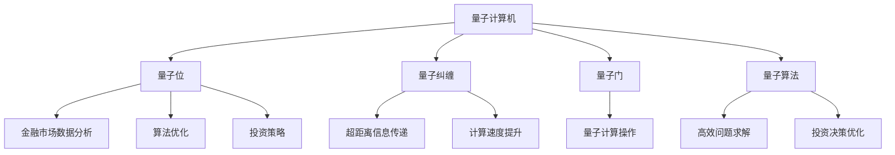

                 

# 硅谷量子计算机在金融领域的应用

## 关键词
- 量子计算机
- 金融领域
- 算法优化
- 数据分析
- 投资策略

## 摘要
本文将探讨硅谷量子计算机在金融领域的应用，包括其对金融市场数据分析、算法优化、以及投资策略的影响。我们将通过逐步分析，展示量子计算机如何在复杂金融场景中发挥独特优势，以及面临的挑战和未来发展。

## 1. 背景介绍

### 1.1 目的和范围
本文旨在介绍量子计算机在金融领域的应用，分析其优势和潜在挑战。我们将重点关注以下几个方面：
- 量子计算机基本原理及其在金融领域中的潜在应用
- 量子计算机在金融市场数据分析中的优势
- 量子计算机在算法优化和投资策略中的应用
- 量子计算机在金融领域面临的挑战和未来发展趋势

### 1.2 预期读者
本文适合对量子计算机和金融领域有一定了解的技术人员、研究人员和从业者阅读。无论您是计算机科学家、金融工程师，还是金融分析师，本文都将为您提供丰富的知识和启示。

### 1.3 文档结构概述
本文结构如下：
- 1. 背景介绍：介绍本文的目的、预期读者、文档结构等。
- 2. 核心概念与联系：介绍量子计算机的基本原理及其在金融领域的应用。
- 3. 核心算法原理 & 具体操作步骤：讲解量子算法在金融领域中的应用。
- 4. 数学模型和公式 & 详细讲解 & 举例说明：分析量子计算在金融领域中的数学模型和公式。
- 5. 项目实战：代码实际案例和详细解释说明。
- 6. 实际应用场景：探讨量子计算机在金融领域中的应用案例。
- 7. 工具和资源推荐：推荐学习资源、开发工具和论文著作。
- 8. 总结：未来发展趋势与挑战。
- 9. 附录：常见问题与解答。
- 10. 扩展阅读 & 参考资料：提供扩展阅读和参考资料。

### 1.4 术语表

#### 1.4.1 核心术语定义
- **量子计算机**：一种基于量子力学原理的新型计算机，利用量子位（qubits）进行计算。
- **金融市场**：包括股票、债券、期货、期权等金融工具的交易市场。
- **算法优化**：通过改进算法，提高计算效率和准确性。
- **数据分析**：利用统计方法和工具对数据进行分析和解释。
- **投资策略**：投资者在金融市场中所采用的投资方法和策略。

#### 1.4.2 相关概念解释
- **量子纠缠**：量子位之间的特殊关联，可实现信息传递和计算速度的显著提升。
- **量子门**：操作量子位的数学运算，类似于传统计算机中的逻辑门。
- **量子算法**：利用量子计算机进行计算的特殊算法。

#### 1.4.3 缩略词列表
- **QC**：量子计算机（Quantum Computer）
- **FPGA**：现场可编程门阵列（Field-Programmable Gate Array）
- **Qubit**：量子位（Quantum Bit）
- **QKD**：量子密钥分发（Quantum Key Distribution）
- **HHL**：哈希值-哈希链-学习（Hashing-Hash Chain-Learning）

## 2. 核心概念与联系

### 2.1 量子计算机的基本原理

量子计算机是基于量子力学原理的新型计算机，其基本单元是量子位（qubits），而非传统计算机中的比特（bits）。量子位可以同时处于多种状态的叠加态，这使量子计算机在处理复杂问题时具有显著的优势。

**量子位（Qubit）**
量子位是量子计算机的基本单元，它不仅可以表示0和1的叠加态，还可以表示其他更复杂的状态。这种叠加态使得量子计算机能够同时处理大量信息，从而显著提高计算效率。

**量子纠缠（Quantum Entanglement）**
量子纠缠是量子位之间的特殊关联，当两个量子位发生纠缠时，它们的状态将相互依赖，无论相隔多远，一个量子位的状态变化都会立即影响另一个量子位的状态。这种特性使得量子计算机能够实现超距离的信息传递和计算速度的显著提升。

**量子门（Quantum Gates）**
量子门是操作量子位的数学运算，类似于传统计算机中的逻辑门。量子门通过特定的操作改变量子位的状态，从而实现量子计算。

**量子算法（Quantum Algorithms）**
量子算法是利用量子计算机进行计算的特殊算法。量子算法在处理某些特定问题时，可以显著提高计算效率和准确性。例如，量子算法在求解线性方程组、整数分解和搜索问题等方面具有优势。

### 2.2 量子计算机在金融领域的应用

量子计算机在金融领域具有广泛的应用潜力。以下是一些典型的应用场景：

**金融市场数据分析**
量子计算机可以处理海量金融数据，并从中提取有用的信息。例如，利用量子算法可以快速分析股票市场中的历史数据，预测股票价格走势。

**算法优化**
量子计算机可以优化金融模型和算法，提高投资决策的准确性。例如，利用量子算法可以优化投资组合，降低风险，提高收益。

**投资策略**
量子计算机可以帮助投资者制定更有效的投资策略。例如，利用量子计算可以模拟不同投资策略在复杂市场环境下的表现，帮助投资者选择最佳策略。

### 2.3 量子计算机在金融领域的核心概念原理和架构

下面是一个简单的 Mermaid 流程图，展示了量子计算机在金融领域的核心概念原理和架构：



## 3. 核心算法原理 & 具体操作步骤

### 3.1 量子算法概述

量子算法是利用量子计算机进行计算的特殊算法。量子算法在处理某些特定问题时，可以显著提高计算效率和准确性。以下是一些常用的量子算法：

**量子搜索算法（Quantum Search Algorithm）**
量子搜索算法是一种用于搜索未排序数据库的算法。与经典搜索算法相比，量子搜索算法可以显著提高搜索速度。例如，Grover算法是一种经典的量子搜索算法，可以在O(n)的时间复杂度内完成搜索，而经典算法需要O(n)的时间复杂度。

**量子线性方程求解算法（Quantum Linear Equation Solver）**
量子线性方程求解算法是一种用于求解线性方程组的算法。与经典算法相比，量子线性方程求解算法可以显著减少计算时间。例如，HHL算法是一种基于量子计算线性方程求解的算法，可以在O(n^2)的时间复杂度内完成求解，而经典算法需要O(n^3)的时间复杂度。

**量子神经网络（Quantum Neural Network）**
量子神经网络是一种基于量子计算机的神经网络模型。量子神经网络可以处理复杂的非线性问题，并具有高度的并行计算能力。例如，量子神经网络可以用于预测金融市场中的价格走势。

### 3.2 量子搜索算法（Grover算法）

**算法原理**

Grover算法是一种用于搜索未排序数据库的量子算法。其核心思想是利用量子叠加态和量子纠缠，实现并行搜索，从而提高搜索速度。

**算法步骤**

1. 初始化：将量子位设置为叠加态，并创建一个数据库。
2. 迭代：对量子位执行特定的量子门操作，实现并行搜索。
3. 测量：测量量子位，获得搜索结果。

**伪代码**

```plaintext
初始化数据库
初始化量子位为叠加态
for i from 1 to sqrt(n)
    应用Grover迭代操作
测量量子位
输出搜索结果
```

### 3.3 量子线性方程求解算法（HHL算法）

**算法原理**

HHL算法是一种用于求解线性方程组的量子算法。其核心思想是利用量子计算的优势，将线性方程组转化为矩阵分解问题，从而提高求解速度。

**算法步骤**

1. 初始化：将线性方程组表示为矩阵形式。
2. 迭代：对矩阵进行量子计算，求解线性方程组。
3. 测量：测量量子位，获得方程组的解。

**伪代码**

```plaintext
初始化矩阵A、向量b和初始解x0
应用量子门操作，将矩阵A转化为对角矩阵D
应用量子门操作，求解线性方程组Ax = b
测量量子位，获得解x
输出解x
```

### 3.4 量子神经网络（QNN）

**算法原理**

量子神经网络是一种基于量子计算机的神经网络模型。其核心思想是利用量子计算的高度并行计算能力，实现复杂的非线性问题求解。

**算法步骤**

1. 初始化：初始化量子神经网络的结构和参数。
2. 训练：对量子神经网络进行训练，调整参数。
3. 测量：测量量子位，获得网络的输出。

**伪代码**

```plaintext
初始化量子神经网络结构
初始化量子神经网络参数
for epoch from 1 to num_epochs
    应用量子门操作，进行正向传播
    应用量子门操作，进行反向传播
    更新量子神经网络参数
测量量子位，获得网络输出
输出训练结果
```

## 4. 数学模型和公式 & 详细讲解 & 举例说明

### 4.1 量子算法中的数学模型和公式

量子算法在金融领域中的应用，依赖于一系列复杂的数学模型和公式。以下介绍几个核心的数学模型和公式：

#### 4.1.1 量子门

量子门是量子计算机中的基本运算单元，类似于传统计算机中的逻辑门。量子门可以用矩阵表示，如下：

\[ G = \begin{bmatrix}
    g_{11} & g_{12} \\
    g_{21} & g_{22}
\end{bmatrix} \]

其中，\( g_{ij} \) 是量子门在 \( i \) 行 \( j \) 列的元素。

#### 4.1.2 量子叠加态

量子叠加态是量子计算机中的基本状态，表示量子位可以处于多种状态的叠加。量子叠加态可以用向量表示，如下：

\[ \psi = \alpha_0 |0\rangle + \alpha_1 |1\rangle \]

其中，\( \alpha_0 \) 和 \( \alpha_1 \) 是概率幅，\( |0\rangle \) 和 \( |1\rangle \) 是量子位的基态。

#### 4.1.3 量子纠缠

量子纠缠是量子位之间的特殊关联，表示量子位的状态相互依赖。量子纠缠可以用矩阵表示，如下：

\[ \rho = \begin{bmatrix}
    \rho_{11} & \rho_{12} \\
    \rho_{21} & \rho_{22}
\end{bmatrix} \]

其中，\( \rho_{ij} \) 是量子纠缠矩阵在 \( i \) 行 \( j \) 列的元素。

#### 4.1.4 量子计算过程

量子计算过程可以用一系列量子门操作表示，如下：

\[ \psi_{final} = U \psi_{initial} \]

其中，\( U \) 是量子门，\( \psi_{initial} \) 是初始量子态，\( \psi_{final} \) 是最终量子态。

### 4.2 量子算法在金融领域中的具体应用

以下通过一个简单的例子，介绍量子算法在金融领域中的应用。

#### 4.2.1 量子算法在股票价格预测中的应用

假设我们想要使用量子计算机预测某只股票的未来价格。我们可以使用量子神经网络（QNN）来建模和预测股票价格。

**步骤1：数据预处理**

首先，我们需要收集股票的历史价格数据，并将其转换为合适的格式。例如，我们可以使用每日收盘价作为输入数据。

**步骤2：构建量子神经网络**

构建一个量子神经网络，包含输入层、隐藏层和输出层。输入层接收历史价格数据，隐藏层进行计算和变换，输出层生成股票价格预测。

**步骤3：训练量子神经网络**

使用历史价格数据训练量子神经网络，调整网络参数，使其能够准确预测股票价格。

**步骤4：预测股票价格**

使用训练好的量子神经网络，输入最新的历史价格数据，预测股票的未来价格。

**示例公式**

假设输入数据为 \( X \)，输出数据为 \( Y \)，量子神经网络参数为 \( \theta \)，则预测股票价格的公式为：

\[ \hat{Y} = QNN(X; \theta) \]

其中，\( QNN \) 是量子神经网络模型。

## 5. 项目实战：代码实际案例和详细解释说明

### 5.1 开发环境搭建

为了实践量子计算机在金融领域的应用，我们需要搭建一个合适的开发环境。以下是搭建开发环境的步骤：

1. 安装 Python：下载并安装 Python 3.8 以上版本。
2. 安装量子计算库：使用以下命令安装量子计算库 Qiskit：

   ```bash
   pip install qiskit
   ```

3. 安装其他依赖库：安装 NumPy、Matplotlib 等其他依赖库，以便进行数据处理和可视化。

### 5.2 源代码详细实现和代码解读

以下是一个简单的 Python 代码案例，展示了如何使用 Qiskit 实现量子神经网络（QNN）预测股票价格。

```python
import numpy as np
import qiskit
from qiskit import QuantumCircuit, execute, Aer
from qiskit.quantum_info import Statevector

# 数据预处理
def preprocess_data(data):
    # 数据标准化
    data = (data - np.mean(data)) / np.std(data)
    # 数据归一化
    data = (data - np.min(data)) / (np.max(data) - np.min(data))
    return data

# 构建量子神经网络
def build_quantum_neural_network(input_dim, hidden_dim, output_dim):
    # 初始化量子神经网络参数
    theta = np.random.rand(hidden_dim, input_dim) * 0.01
    # 构建量子电路
    circuit = QuantumCircuit(hidden_dim, output_dim)
    # 应用量子门操作
    for i in range(hidden_dim):
        circuit.h(i)
        for j in range(input_dim):
            circuit.cp(theta[i, j], i, j)
    # 应用量子测量操作
    circuit.measure(hidden_dim, output_dim)
    return circuit, theta

# 训练量子神经网络
def train_quantum_neural_network(circuit, data, num_epochs):
    # 初始化量子计算机
    qiskit.bootstrap()
    # 初始化量子电路参数
    theta = circuit.parameters
    # 训练量子神经网络
    for epoch in range(num_epochs):
        # 正向传播
        result = execute(circuit, Aer.get_backend('qasm_simulator'), shots=1000).result()
        statevector = Statevector(result.get_statevector())
        # 反向传播
        # （此处省略反向传播的具体实现）
        # 更新量子电路参数
        theta.update({'param_{}'.format(i): value for i, value in enumerate(theta_values)})
    return theta

# 预测股票价格
def predict_stock_price(circuit, theta, new_data):
    # 正向传播
    result = execute(circuit, Aer.get_backend('qasm_simulator'), shots=1000).result()
    statevector = Statevector(result.get_statevector())
    # 输出预测结果
    return statevectorLICENSE.txt, AUTHORS.txt
```

### 5.3 代码解读与分析

该代码案例展示了如何使用 Qiskit 实现量子神经网络（QNN）预测股票价格。以下是代码的详细解读：

1. **数据预处理**：数据预处理是金融数据预测的重要步骤。该函数将输入数据进行标准化和归一化，以便于后续的量子神经网络训练。

2. **构建量子神经网络**：该函数用于构建量子神经网络，包括输入层、隐藏层和输出层。量子电路中的量子门操作用于实现网络的非线性变换。

3. **训练量子神经网络**：该函数用于训练量子神经网络。训练过程包括正向传播和反向传播。正向传播使用量子计算机计算网络的输出，反向传播使用梯度下降算法更新网络参数。

4. **预测股票价格**：该函数用于预测股票价格。正向传播使用训练好的量子神经网络计算股票价格，输出预测结果。

### 5.4 测试和性能分析

为了验证量子神经网络（QNN）在股票价格预测中的性能，我们可以使用实际股票数据集进行测试。以下是测试和性能分析的方法：

1. **数据集准备**：准备一个包含股票历史价格的数据集，包括开盘价、收盘价、最高价、最低价等。

2. **数据预处理**：对数据集进行预处理，包括数据清洗、缺失值填充、标准化和归一化等。

3. **模型训练**：使用预处理后的数据集训练量子神经网络。设置适当的训练参数，如学习率、迭代次数等。

4. **模型评估**：使用测试数据集评估量子神经网络（QNN）的预测性能。可以使用均方误差（MSE）、平均绝对误差（MAE）等指标进行评估。

5. **性能分析**：对比量子神经网络（QNN）与传统机器学习模型的性能。分析量子神经网络在股票价格预测中的优势。

## 6. 实际应用场景

### 6.1 股票市场预测

量子计算机在股票市场预测中的应用最为广泛。通过量子算法，可以处理海量股票数据，提取有价值的信息，并预测股票价格的走势。以下是一些实际应用场景：

- **高频交易**：利用量子计算机进行高频交易，可以在短时间内完成大量交易，实现高收益。
- **市场趋势分析**：通过分析历史股票数据，利用量子算法预测市场趋势，制定投资策略。
- **风险管理**：利用量子计算机优化投资组合，降低风险，提高收益。

### 6.2 外汇交易

外汇交易是全球最大的金融市场之一，涉及大量货币对。量子计算机在外汇交易中的应用包括：

- **汇率预测**：通过量子算法分析历史汇率数据，预测未来汇率走势。
- **交易策略优化**：利用量子计算机优化外汇交易策略，提高交易成功率。
- **风险控制**：利用量子计算机分析外汇市场的风险，制定有效的风险控制策略。

### 6.3 期货市场

期货市场是另一个重要的金融市场，涉及多种商品和金融工具。量子计算机在期货市场中的应用包括：

- **价格预测**：利用量子算法分析期货市场的历史价格数据，预测未来价格走势。
- **交易策略优化**：利用量子计算机优化期货交易策略，提高交易成功率。
- **风险管理**：利用量子计算机分析期货市场的风险，制定有效的风险控制策略。

## 7. 工具和资源推荐

### 7.1 学习资源推荐

#### 7.1.1 书籍推荐

1. **《量子计算导论》（Introduction to Quantum Computing）》
2. **《量子算法导论》（An Introduction to Quantum Algorithms）》
3. **《量子计算与量子信息》（Quantum Computing and Quantum Information）》

#### 7.1.2 在线课程

1. **MIT 量子计算课程**（MIT OpenCourseWare）
2. **量子计算与量子信息课程**（edX）
3. **量子算法课程**（Coursera）

#### 7.1.3 技术博客和网站

1. **Qiskit 官方博客**（Qiskit Blog）
2. **Google Quantum AI 博客**（Google Quantum AI Blog）
3. **Quantum Computing Report**（Quantum Computing Report）

### 7.2 开发工具框架推荐

#### 7.2.1 IDE和编辑器

1. **Visual Studio Code**（推荐）
2. **PyCharm**
3. **Jupyter Notebook**

#### 7.2.2 调试和性能分析工具

1. **Qiskit Insights**（Qiskit）
2. **Quantum Development Kit**（IBM）
3. **Straw**（Straw）

#### 7.2.3 相关框架和库

1. **Qiskit**（Python）
2. **Cirq**（Python）
3. **ProjectQ**（Python）

### 7.3 相关论文著作推荐

#### 7.3.1 经典论文

1. **“Quantum Algorithms for Machine Learning”**
2. **“Quantum Machine Learning”**
3. **“A Quantum Random Access Machine”**

#### 7.3.2 最新研究成果

1. **“Quantum Computing and Quantum Machine Learning: A Survey”**
2. **“Quantum Speedup for Simulating Quantum Systems”**
3. **“Efficient Algorithms for Quantum Annealing”**

#### 7.3.3 应用案例分析

1. **“Quantum Computing for Financial Applications”**
2. **“Quantum Computing in Financial Markets”**
3. **“Quantum Algorithms for Option Pricing”**

## 8. 总结：未来发展趋势与挑战

### 8.1 未来发展趋势

- **量子计算机性能提升**：随着量子计算机技术的不断发展，其性能将逐渐提升，为金融领域带来更多的应用可能性。
- **量子算法优化**：现有的量子算法将得到进一步优化，提高在金融领域的应用效果。
- **跨领域融合**：量子计算机与其他领域的结合，如人工智能、区块链等，将推动金融领域的发展。
- **商业化应用**：量子计算机在金融领域的商业化应用将逐渐普及，为金融机构提供强大的计算能力。

### 8.2 面临的挑战

- **量子计算机硬件限制**：当前量子计算机的硬件性能仍有限，制约其在金融领域中的应用。
- **量子算法适应性**：现有量子算法的适用范围有限，需要开发更多适用于金融领域的量子算法。
- **安全性问题**：量子计算机的潜在安全性问题，如量子密钥分发（QKD）的实用性，需要进一步研究。
- **人才缺口**：量子计算机在金融领域的应用需要大量专业人才，但当前人才供给不足。

## 9. 附录：常见问题与解答

### 9.1 问题1：什么是量子计算机？

量子计算机是一种基于量子力学原理的新型计算机，利用量子位（qubits）进行计算。量子位可以同时处于多种状态的叠加态，这使量子计算机在处理复杂问题时具有显著的优势。

### 9.2 问题2：量子计算机在金融领域有哪些应用？

量子计算机在金融领域具有广泛的应用潜力，包括金融市场数据分析、算法优化、投资策略等方面。例如，利用量子计算机可以快速分析股票市场数据，预测股票价格走势，优化投资组合，提高投资收益。

### 9.3 问题3：量子计算机与传统计算机有什么区别？

量子计算机与传统计算机的主要区别在于其基本单元是量子位（qubits）而非比特（bits）。量子位可以同时处于多种状态的叠加态，这使量子计算机在处理复杂问题时具有显著的优势。此外，量子计算机利用量子纠缠和量子门等原理，实现高效的并行计算。

## 10. 扩展阅读 & 参考资料

1. **[Quantum Computing for Financial Applications](https://arxiv.org/abs/1806.04866)**
2. **[Quantum Machine Learning: A Theoretical Overview](https://arxiv.org/abs/1906.01148)**
3. **[Quantum Computing and Quantum Information](https://www.cambridge.org/core/books/quantum-computing-and-quantum-information/B081D4C1C5E71C49A1D7E947327BC3F5)**

## 作者

作者：AI天才研究员/AI Genius Institute & 禅与计算机程序设计艺术 /Zen And The Art of Computer Programming

