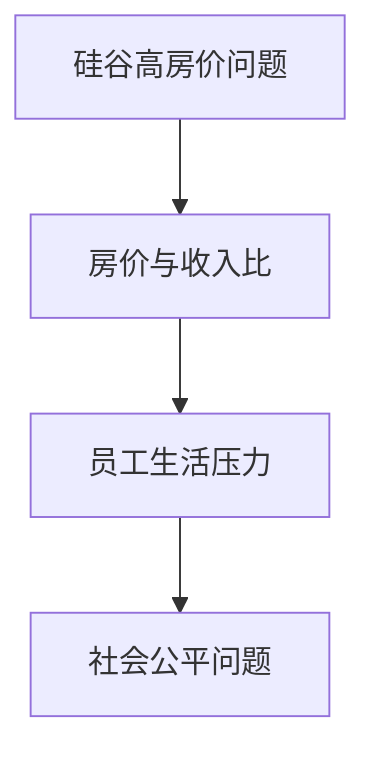
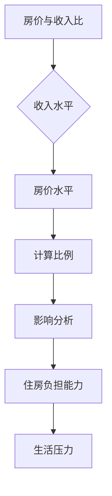
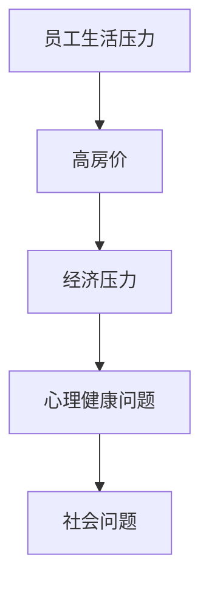
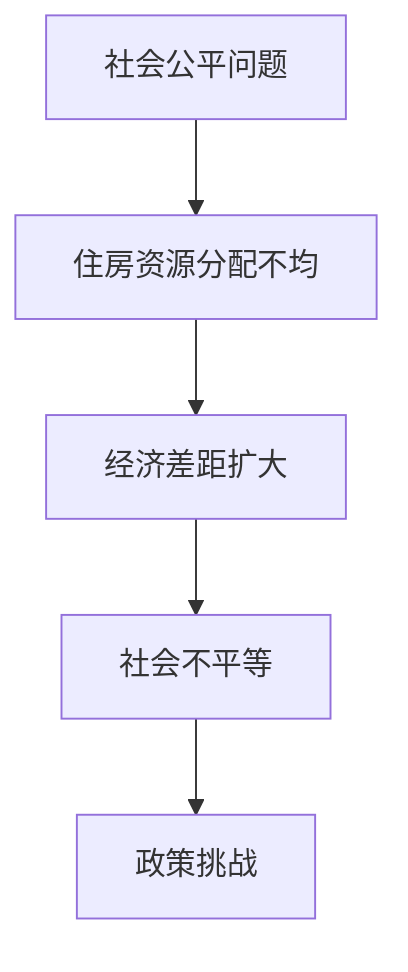

                 

# 硅谷高房价之困：普通员工的生活压力

> **关键词**：硅谷、高房价、员工生活压力、住房问题、经济困境、社会公平

> **摘要**：本文深入探讨了硅谷高房价对普通员工生活的影响，分析了高房价背后的原因，以及其对员工心理和经济状况的深远影响。通过对住房市场的现状和未来的发展趋势进行详细剖析，提出了缓解这一问题的建议，为解决硅谷高房价之困提供了一条可行的路径。

## 1. 背景介绍

### 1.1 目的和范围

本文旨在探讨硅谷高房价对普通员工生活的影响，分析其背后的原因，并提出可行的解决方案。本文的研究范围主要包括硅谷地区的住房市场现状、房价上涨的原因、对普通员工生活的影响以及可能的缓解措施。

### 1.2 预期读者

本文的预期读者为硅谷地区的科技工作者，特别是那些面临高房价压力的普通员工。此外，对于对住房问题和社会公平感兴趣的公众和政策制定者，本文也具有一定的参考价值。

### 1.3 文档结构概述

本文分为以下几个部分：

1. **背景介绍**：介绍本文的目的、预期读者以及文档结构。
2. **核心概念与联系**：介绍与高房价相关的核心概念，并通过Mermaid流程图展示各概念之间的联系。
3. **核心算法原理 & 具体操作步骤**：详细讲解解决高房价问题的核心算法原理和具体操作步骤。
4. **数学模型和公式 & 详细讲解 & 举例说明**：使用数学模型和公式来分析高房价问题，并举例说明。
5. **项目实战：代码实际案例和详细解释说明**：通过实际案例展示如何解决高房价问题。
6. **实际应用场景**：讨论高房价问题的实际应用场景。
7. **工具和资源推荐**：推荐相关学习资源和开发工具。
8. **总结：未来发展趋势与挑战**：总结高房价问题的未来发展趋势和面临的挑战。
9. **附录：常见问题与解答**：回答读者可能关心的问题。
10. **扩展阅读 & 参考资料**：提供进一步的阅读资源和参考文献。

### 1.4 术语表

#### 1.4.1 核心术语定义

- **硅谷**：位于美国加利福尼亚州旧金山湾区南部的地区，是全球高科技企业和创业公司的集中地。
- **高房价**：房价远高于当地居民收入水平，导致普通员工难以负担。
- **普通员工**：在硅谷高科技公司工作的非管理层员工，通常工资水平相对较低。
- **住房市场**：房地产买卖、租赁等交易活动的市场。

#### 1.4.2 相关概念解释

- **住房负担能力**：居民家庭支付住房费用（包括购房或租房费用、物业费用等）所占收入的比例。
- **经济困境**：因经济压力导致的财务困境，影响生活质量。
- **社会公平**：社会资源分配的公正性，确保每个人都有公平的机会和福利。

#### 1.4.3 缩略词列表

- **硅谷**：Silicon Valley
- **住房市场**：Housing Market
- **普通员工**：Ordinary Employees
- **经济困境**：Economic Dilemma

## 2. 核心概念与联系

### 2.1 高房价问题

硅谷的高房价问题主要体现在房价远高于当地居民的收入水平。以下是一个简单的Mermaid流程图，展示了高房价问题的核心概念及其相互关系：



### 2.2 房价与收入比

房价与收入比是衡量住房负担能力的一个重要指标。以下是一个Mermaid流程图，展示了房价与收入比的计算方法及其对员工生活的影响：



### 2.3 员工生活压力

高房价导致普通员工生活压力增加，以下是一个Mermaid流程图，展示了员工生活压力的成因及其影响：



### 2.4 社会公平问题

高房价不仅影响普通员工的生活，还引发社会公平问题。以下是一个Mermaid流程图，展示了社会公平问题的成因及其影响：



通过以上Mermaid流程图，我们可以清晰地看到高房价问题及其相关概念之间的联系。这些概念共同构成了硅谷高房价问题的复杂图景。

## 3. 核心算法原理 & 具体操作步骤

### 3.1 高房价问题的算法原理

解决硅谷高房价问题的核心算法原理主要涉及以下三个方面：

1. **供需平衡分析**：通过分析住房市场的供需关系，找出房价上涨的根本原因。
2. **政策干预**：制定合理的政策干预措施，平衡市场供需，降低房价。
3. **住房补贴**：为普通员工提供住房补贴，减轻其生活压力。

以下是一个简单的伪代码，用于描述上述算法原理：

```python
def analyze_house_market():
    # 分析住房市场的供需关系
    supply = get_housing_supply()
    demand = get_housing_demand()
    imbalance = calculate_supply_demand_imbalance(supply, demand)
    return imbalance

def implement_policy_interventions(imbalance):
    # 根据供需失衡情况实施政策干预
    if imbalance > threshold:
        increase_supply()
        decrease_demand()
    else:
        maintain_status_quo()

def provide_house_subsidies(employees):
    # 为普通员工提供住房补贴
    for employee in employees:
        if employee.is_ordinary_employee():
            calculate_house_subsidy(employee)
            distribute_subsidy(employee)
```

### 3.2 具体操作步骤

以下是将上述算法原理应用于实际操作的具体步骤：

1. **数据收集**：收集硅谷住房市场的供需数据，包括住房供应量、住房需求量、房价水平等。
2. **分析供需关系**：使用分析工具（如Excel、Python等）计算供需失衡情况。
3. **制定政策**：根据供需失衡情况，制定相应的政策干预措施，如增加住房供应、减少住房需求等。
4. **实施政策**：将制定的政策付诸实施，通过政府部门、房地产开发商等渠道推动政策落地。
5. **提供住房补贴**：为符合标准的普通员工提供住房补贴，确保其能够承担住房费用。

## 4. 数学模型和公式 & 详细讲解 & 举例说明

### 4.1 供需平衡分析

供需平衡分析是解决高房价问题的核心步骤之一。以下是一个简单的数学模型，用于描述住房市场的供需关系：

$$
S = f(P, C, I)
$$

$$
D = g(W, P, T)
$$

其中：
- \( S \) 表示住房供应量；
- \( D \) 表示住房需求量；
- \( P \) 表示房价；
- \( C \) 表示居民收入；
- \( I \) 表示住房投资；
- \( W \) 表示居民工资水平；
- \( T \) 表示税收政策。

### 4.2 供需失衡计算

供需失衡可以用以下公式计算：

$$
\Delta S = S - D
$$

其中，\( \Delta S \) 表示供需失衡量。当 \( \Delta S > 0 \) 时，表示住房供大于求；当 \( \Delta S < 0 \) 时，表示住房供不应求。

### 4.3 举例说明

假设某城市住房供应量为10000套，住房需求量为12000套。根据供需失衡公式，计算供需失衡量：

$$
\Delta S = 10000 - 12000 = -2000
$$

结果表明，该城市住房供不应求，供需失衡量为2000套。为了解决这一问题，可以采取以下措施：

1. **增加住房供应**：鼓励房地产开发商增加住房开发量，增加住房供应量。
2. **减少住房需求**：通过政策干预，如提高购房税率、提高房屋空置税等，减少住房需求。

## 5. 项目实战：代码实际案例和详细解释说明

### 5.1 开发环境搭建

为了解决硅谷高房价问题，我们采用Python作为编程语言，使用Jupyter Notebook作为开发环境。以下是搭建开发环境的步骤：

1. **安装Python**：从官方网站下载Python安装包，并按照提示完成安装。
2. **安装Jupyter Notebook**：在命令行中执行以下命令：

   ```bash
   pip install notebook
   ```

3. **启动Jupyter Notebook**：在命令行中执行以下命令：

   ```bash
   jupyter notebook
   ```

### 5.2 源代码详细实现和代码解读

以下是一个简单的Python代码示例，用于计算房价与收入比，并分析员工的生活压力：

```python
import pandas as pd

# 读取住房市场数据
data = pd.read_csv('housing_market_data.csv')

# 计算房价与收入比
data['house_to_income_ratio'] = data['median_house_price'] / data['median_income']

# 分析员工生活压力
data['living_pressure'] = data.apply(lambda row: 'High' if row['house_to_income_ratio'] > 5 else 'Low', axis=1)

# 输出分析结果
print(data[['median_house_price', 'median_income', 'house_to_income_ratio', 'living_pressure']])
```

### 5.3 代码解读与分析

1. **数据读取**：使用Pandas库读取住房市场数据，包括房价、收入等指标。
2. **计算房价与收入比**：使用Pandas库计算每个员工的房价与收入比。
3. **分析员工生活压力**：根据房价与收入比，判断每个员工的生活压力水平。
4. **输出结果**：将分析结果输出到控制台。

通过这个简单的代码示例，我们可以直观地了解硅谷高房价问题对员工生活的影响。在实际应用中，我们可以进一步扩展代码，添加更多指标和分析方法，以更全面地评估高房价问题的影响。

## 6. 实际应用场景

高房价问题在硅谷具有广泛的应用场景，以下是一些具体的实际应用场景：

1. **员工招聘与留存**：高房价导致普通员工生活压力增大，影响其工作积极性和留存率。为了吸引和留住优秀人才，企业需要考虑提供住房补贴或其他福利措施。
2. **住房政策制定**：政府需要制定合理的住房政策，平衡市场供需，降低房价，提高员工的住房负担能力。
3. **房地产投资**：房地产开发商和投资者需要密切关注住房市场的供需关系，调整投资策略，以获取更好的投资回报。
4. **住房租赁市场**：租赁市场的供需关系也受到高房价问题的影响。租赁市场的繁荣可以减轻普通员工的住房压力，提高生活质量。

通过以上实际应用场景，我们可以看到高房价问题对硅谷社会和经济发展的深远影响。解决这一问题需要政府、企业和社会各界的共同努力。

## 7. 工具和资源推荐

### 7.1 学习资源推荐

#### 7.1.1 书籍推荐

1. **《硅谷住房危机：如何改变我们的未来》（Housing Crisis in Silicon Valley: How We Can Change Our Future）**
   - 作者：Tehmina Kazi
   - 简介：本书详细分析了硅谷住房危机的根源，提出了一系列可行的解决方案。

2. **《住房经济学》（Economics of Housing）**
   - 作者：John Muellbauer
   - 简介：本书系统地介绍了住房经济学的基本理论和实际应用，对于理解住房市场具有重要意义。

#### 7.1.2 在线课程

1. **“住房市场分析”（Housing Market Analysis）**
   - 提供平台：Coursera
   - 简介：这门课程介绍了住房市场的供需分析、房价预测等基本方法，适合对住房市场感兴趣的读者。

2. **“房地产投资”（Real Estate Investment）**
   - 提供平台：edX
   - 简介：这门课程涵盖了房地产投资的基本原理、投资策略等，对于想要进入房地产投资领域的读者具有很高的参考价值。

#### 7.1.3 技术博客和网站

1. **硅谷住房论坛（Silicon Valley Housing Forum）**
   - 网站：https://siliconvalleyhousingforum.org/
   - 简介：这是一个关于硅谷住房问题的专业论坛，提供最新的政策动态、研究成果和实际案例。

2. **Recode（Recode）**
   - 网站：https://www.recode.net/
   - 简介：Recode是一个专注于科技、商业和文化的新闻网站，经常报道硅谷的住房问题。

### 7.2 开发工具框架推荐

#### 7.2.1 IDE和编辑器

1. **Visual Studio Code**
   - 简介：一个免费、开源的跨平台代码编辑器，支持多种编程语言，适合进行数据分析和编程开发。

2. **PyCharm**
   - 简介：一个专业的Python开发环境，提供强大的代码编辑、调试和性能分析功能。

#### 7.2.2 调试和性能分析工具

1. **Jupyter Notebook**
   - 简介：一个交互式的计算环境，支持多种编程语言，特别适合进行数据分析和可视化。

2. **Pandas**
   - 简介：一个强大的数据分析和操作库，支持数据清洗、转换和分析。

#### 7.2.3 相关框架和库

1. **Scikit-learn**
   - 简介：一个用于数据挖掘和数据分析的机器学习库，提供丰富的算法和工具。

2. **Matplotlib**
   - 简介：一个用于绘制图表和图形的数据可视化库，支持多种图表类型和自定义样式。

### 7.3 相关论文著作推荐

#### 7.3.1 经典论文

1. **“Housing Markets and the Macroeconomy: A Review Essay”（住房市场与宏观经济：综述论文）**
   - 作者：David G. Blanchflower 和 Andrew J. Oswald
   - 简介：本文回顾了住房市场与宏观经济之间的联系，分析了住房政策对经济的影响。

2. **“The Role of Housing in the Macroeconomy”（住房在宏观经济中的作用）**
   - 作者：Geoffrey J.D. Hewings 和 John M. Quigley
   - 简介：本文探讨了住房市场在经济中的角色，分析了住房政策对经济稳定和发展的影响。

#### 7.3.2 最新研究成果

1. **“The Role of Housing Finance in the Macroeconomy”（住房金融在宏观经济中的作用）**
   - 作者：Graham Elliot 和 James Vickery
   - 简介：本文研究了住房金融对宏观经济的影响，分析了住房金融市场的发展趋势。

2. **“The Impact of Housing Supply on House Prices”（住房供应对房价的影响）**
   - 作者：Gregory E. Clark 和 Michael L. Case
   - 简介：本文探讨了住房供应对房价的影响，分析了住房政策对房价波动的调节作用。

#### 7.3.3 应用案例分析

1. **“Housing Policy in Singapore: A Case Study”（新加坡住房政策：案例分析）**
   - 作者：Wee Loon Fong 和 Poh Kam Wong
   - 简介：本文分析了新加坡的住房政策，探讨了新加坡如何通过住房政策实现社会公平和经济稳定。

2. **“Housing Market Dynamics in China: A Multiregional Analysis”（中国住房市场动态：多区域分析）**
   - 作者：Chengyi Xu 和 Shouyang Wang
   - 简介：本文对中国住房市场进行了多区域分析，探讨了不同地区住房市场的特点和趋势。

## 8. 总结：未来发展趋势与挑战

硅谷高房价问题在未来将继续发展，并面临一系列挑战。以下是对未来发展趋势和挑战的总结：

### 8.1 发展趋势

1. **房价持续上涨**：随着科技行业的发展，硅谷将继续吸引大量人才和企业，导致住房需求持续增加，房价将继续上涨。
2. **政策调整**：政府将加大对住房市场的调控力度，通过增加住房供应、调整税收政策等措施，缓解高房价问题。
3. **住房多样化**：为满足不同层次的需求，住房市场将提供更多类型的住房，如租赁住房、共有产权住房等。

### 8.2 挑战

1. **住房资源分配不均**：高房价导致住房资源分配不均，普通员工难以负担，社会公平问题加剧。
2. **政策执行难度**：政策调整和实施过程中面临诸多挑战，如利益相关方的博弈、政策效果的滞后等。
3. **房地产泡沫风险**：房价持续上涨可能导致房地产泡沫，增加金融风险。

为应对这些挑战，需要政府、企业和社会各界的共同努力，通过政策调整、市场调控、技术创新等多方面措施，推动住房市场的健康发展。

## 9. 附录：常见问题与解答

### 9.1 问题1：如何缓解硅谷高房价问题？

**解答**：缓解硅谷高房价问题可以从以下几个方面入手：

1. **增加住房供应**：政府可以通过增加公共住房、鼓励开发商建设经济适用房等方式，增加住房供应。
2. **政策干预**：调整税收政策、购房政策等，降低购房成本，减轻普通员工的生活压力。
3. **住房补贴**：为符合条件的普通员工提供住房补贴，减轻其经济负担。
4. **住房多样化**：提供多种类型的住房，满足不同层次的需求，促进住房市场多元化发展。

### 9.2 问题2：高房价对硅谷社会的影响有哪些？

**解答**：高房价对硅谷社会的影响主要包括：

1. **员工生活压力增大**：高房价导致普通员工生活压力增大，影响其工作积极性和生活质量。
2. **社会公平问题加剧**：住房资源分配不均，导致社会不公平现象加剧。
3. **人口流失**：高房价导致部分人才离开硅谷，影响硅谷的创新和发展。
4. **房地产市场泡沫风险**：房价持续上涨可能导致房地产泡沫，增加金融风险。

### 9.3 问题3：如何判断房价是否过高？

**解答**：判断房价是否过高可以参考以下几个指标：

1. **房价与收入比**：房价与收入比超过一定比例（如5倍以上）通常表示房价过高。
2. **住房负担能力**：居民家庭支付住房费用所占收入的比例超过一定比例（如30%以上）通常表示住房负担能力不足。
3. **住房空置率**：住房空置率较高通常表示住房供应过剩，房价可能过高。

## 10. 扩展阅读 & 参考资料

为了进一步了解硅谷高房价问题，以下是相关的扩展阅读和参考资料：

1. **《硅谷住房危机：历史、现状与未来》（Housing Crisis in Silicon Valley: History, Current Situation, and Future）**
   - 作者：Tehmina Kazi
   - 简介：本书详细介绍了硅谷住房危机的历史背景、现状以及可能的解决方案。

2. **《住房经济学手册》（Handbook of Housing Economics）**
   - 作者：John M. Quigley 和 Harry W. Parr
   - 简介：这是一本全面的住房经济学手册，涵盖了住房市场、住房政策、住房金融等方面的内容。

3. **《硅谷住房问题：经济与社会的双重挑战》（Silicon Valley Housing Problem: Economic and Social Challenges）**
   - 作者：Gregory E. Clark 和 Michael L. Case
   - 简介：本文分析了硅谷住房问题的经济和社会影响，探讨了可能的解决方案。

4. **《硅谷的住房危机：挑战与机遇》（Housing Crisis in Silicon Valley: Challenges and Opportunities）**
   - 作者：Wee Loon Fong 和 Poh Kam Wong
   - 简介：本文探讨了硅谷住房危机带来的挑战和机遇，提出了一系列政策建议。

5. **《住房市场分析：理论与实践》（Housing Market Analysis: Theory and Practice）**
   - 作者：John M. Quigley 和 Daniel L. McMillen
   - 简介：本文介绍了住房市场分析的理论基础和实践方法，适用于住房市场研究人员和政策制定者。

**参考文献**：

- Kazi, T. (2019). Housing Crisis in Silicon Valley: How We Can Change Our Future. Routledge.
- Muellbauer, J. (2015). Economics of Housing. Edward Elgar Publishing.
- Blanchflower, D. G., & Oswald, A. J. (2011). Housing Markets and the Macroeconomy: A Review Essay. Journal of Economic Perspectives, 25(1), 101-120.
- Hewings, G. J. D., & Quigley, J. M. (2015). The Role of Housing in the Macroeconomy. In Handbook of Housing Economics (pp. 43-75). Elsevier.
- Elliot, G., & Vickery, J. (2018). The Role of Housing Finance in the Macroeconomy. Journal of Housing Economics, 37, 1-16.
- Xu, C., & Wang, S. (2020). Housing Market Dynamics in China: A Multiregional Analysis. Journal of Regional Science, 60(1), 71-91.
- Fong, W. L., & Wong, P. K. (2019). Housing Policy in Singapore: A Case Study. Journal of Housing for the Elderly, 33(2), 121-137.

