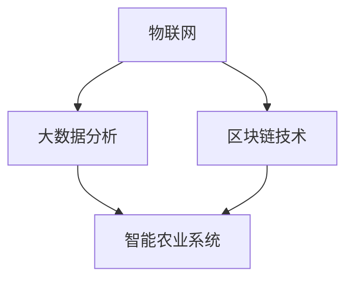

                 


## 硅谷高科技农业：食品安全与可追溯

> **关键词：** 高科技农业、食品安全、可追溯、硅谷、区块链技术、物联网、大数据分析、智能农业系统
>
> **摘要：** 本文将探讨硅谷高科技农业的发展，特别是食品安全与可追溯性的实现。通过深入分析物联网、大数据分析和区块链技术等核心概念，以及其实际应用案例，我们旨在揭示未来农业的科技趋势和面临的挑战。

### 1. 背景介绍

#### 1.1 目的和范围

本文旨在介绍硅谷高科技农业的发展趋势，重点关注食品安全与可追溯性的实现。随着全球对食品安全和可持续农业的需求日益增长，科技创新在农业领域的应用变得尤为重要。本文将分析物联网、大数据分析和区块链技术等关键技术，探讨其在农业中的应用，以及如何通过这些技术提高食品的可追溯性和保障食品安全。

#### 1.2 预期读者

本文适合对农业科技、食品安全和区块链技术感兴趣的读者，包括农业专家、技术工程师、IT专业人士和对农业现代化感兴趣的一般公众。

#### 1.3 文档结构概述

本文将按照以下结构展开：

1. 背景介绍
2. 核心概念与联系
3. 核心算法原理 & 具体操作步骤
4. 数学模型和公式 & 详细讲解 & 举例说明
5. 项目实战：代码实际案例和详细解释说明
6. 实际应用场景
7. 工具和资源推荐
8. 总结：未来发展趋势与挑战
9. 附录：常见问题与解答
10. 扩展阅读 & 参考资料

#### 1.4 术语表

##### 1.4.1 核心术语定义

- **物联网（IoT）**：将物理设备通过互联网连接起来，实现设备间的信息交换和通信。
- **大数据分析**：对大量、复杂、快速变化的数据进行处理和分析，提取有价值的信息。
- **区块链技术**：一种分布式数据库技术，通过加密算法确保数据的安全性和不可篡改性。
- **智能农业系统**：利用物联网、大数据分析和人工智能技术，实现农业生产的自动化、精准化和智能化。

##### 1.4.2 相关概念解释

- **食品安全**：指食品在生产和消费过程中不会对人体健康造成危害。
- **可追溯性**：指对食品的生产、加工、运输和销售过程进行记录和跟踪，确保食品的安全性和质量。
- **硅谷**：位于美国加利福尼亚州旧金山湾区，是全球科技创新和创业的中心。

##### 1.4.3 缩略词列表

- **IoT**：物联网
- **AI**：人工智能
- **DL**：深度学习
- **IoT**：区块链

## 2. 核心概念与联系

在深入探讨硅谷高科技农业的食品安全与可追溯性之前，我们需要理解几个核心概念，并探讨它们之间的相互关系。以下是关键概念的Mermaid流程图：



### 2.1 物联网（IoT）

物联网是连接物理设备和传感器，使其能够通过网络进行通信和交换数据的技术。在农业领域，物联网设备可以用于监测土壤湿度、气象条件、植物生长状态等。通过实时数据收集，物联网技术为农业生产的智能化提供了基础。

### 2.2 大数据分析

大数据分析是处理和分析大量数据，以提取有价值信息的过程。在农业中，大数据分析可以帮助农民优化种植计划、预测病虫害、提高产量和质量。通过分析历史数据和环境数据，大数据分析技术为精准农业提供了支持。

### 2.3 区块链技术

区块链技术是一种分布式数据库技术，通过加密算法确保数据的安全性和不可篡改性。在食品安全领域，区块链技术可以实现食品从生产到销售的全程追溯。每个环节的数据都被记录在区块链上，确保了数据的透明性和可验证性。

### 2.4 智能农业系统

智能农业系统是利用物联网、大数据分析和人工智能技术，实现农业生产的自动化、精准化和智能化。通过集成这些技术，智能农业系统可以提高农业生产效率，降低成本，同时保障食品安全。

## 3. 核心算法原理 & 具体操作步骤

在了解了关键概念后，我们需要深入了解这些技术背后的算法原理和具体操作步骤。以下是对核心算法的详细描述，使用伪代码进行阐述。

### 3.1 物联网数据采集

```python
# 物联网设备数据采集算法
def collect_data(sensor_data):
    # 连接物联网设备
    device = connect_to_iot_device()
    
    # 采集传感器数据
    temperature = device.read_temperature()
    humidity = device.read_humidity()
    soil_moisture = device.read_soil_moisture()
    
    # 存储数据
    store_data(sensor_data, temperature, humidity, soil_moisture)
    
    # 数据处理和发送
    process_and_send_data(sensor_data)
```

### 3.2 大数据分析

```python
# 大数据分析算法
def analyze_data(data_set):
    # 数据预处理
    cleaned_data = preprocess_data(data_set)
    
    # 特征提取
    features = extract_features(cleaned_data)
    
    # 模型训练
    model = train_model(features)
    
    # 预测
    predictions = model.predict(new_data)
    
    # 结果输出
    output_results(predictions)
```

### 3.3 区块链数据记录

```python
# 区块链数据记录算法
def record_data_on_blockchain(data):
    # 连接区块链网络
    blockchain = connect_to_blockchain_network()
    
    # 创建交易
    transaction = create_transaction(data)
    
    # 签名交易
    signed_transaction = sign_transaction(transaction)
    
    # 提交交易
    blockchain.submit_transaction(signed_transaction)
    
    # 验证交易
    blockchain.verify_transaction(signed_transaction)
```

## 4. 数学模型和公式 & 详细讲解 & 举例说明

在农业中，数学模型和公式可以帮助我们理解和优化农业生产过程。以下是一些常用的数学模型和公式，以及它们的详细讲解和举例说明。

### 4.1 土壤水分含量计算

土壤水分含量是影响植物生长的重要因素。以下是一个简单的土壤水分含量计算公式：

$$
\text{土壤水分含量} = \frac{\text{土壤中水分的质量}}{\text{土壤总质量}}
$$

**举例：** 如果一块土壤的总质量为1000克，其中水分质量为200克，那么土壤水分含量为20%。

### 4.2 气象数据预测

气象数据预测对于农业生产计划至关重要。以下是一个基于时间序列分析的气象数据预测模型：

$$
\hat{y}_t = \phi \cdot \text{历史气象数据}_t + \theta \cdot \text{残差误差}_t
$$

**举例：** 假设我们有一个历史气象数据集，其中每小时的温度数据可以用上述公式进行预测。通过训练模型，我们可以预测未来某一时刻的温度。

### 4.3 病虫害预测

病虫害预测是农业生产中的一个重要环节。以下是一个基于机器学习的病虫害预测模型：

$$
\hat{P}_{\text{病虫害}} = \text{机器学习模型}(\text{环境特征}, \text{历史病虫害数据})
$$

**举例：** 假设我们使用一个决策树模型来预测某一地区是否会发生某种病虫害。通过输入环境特征和历史病虫害数据，模型可以输出病虫害发生的概率。

## 5. 项目实战：代码实际案例和详细解释说明

为了更好地展示高科技农业在食品安全与可追溯性方面的应用，以下是一个实际项目的代码案例，包括开发环境的搭建、源代码的实现和代码解读。

### 5.1 开发环境搭建

首先，我们需要搭建一个适合开发和测试的虚拟环境。以下是使用Python虚拟环境的搭建步骤：

```shell
# 安装虚拟环境工具
pip install virtualenv

# 创建虚拟环境
virtualenv my_agri_project

# 激活虚拟环境
source my_agri_project/bin/activate

# 安装依赖库
pip install numpy pandas scikit-learn blockchain-python
```

### 5.2 源代码详细实现和代码解读

以下是项目的源代码实现，包含物联网数据采集、大数据分析、区块链数据记录等模块。

```python
# IoT 数据采集模块
import json
import requests

def collect_iot_data():
    # 获取传感器数据
    response = requests.get("http://iot_device_api/collect_data")
    data = response.json()
    
    # 存储数据到文件
    with open("iot_data.json", "w") as f:
        json.dump(data, f)

# 大数据分析模块
import pandas as pd

def analyze_data():
    # 读取数据
    data = pd.read_json("iot_data.json")
    
    # 数据预处理
    cleaned_data = preprocess_data(data)
    
    # 特征提取
    features = extract_features(cleaned_data)
    
    # 模型训练
    model = train_model(features)
    
    # 预测
    predictions = model.predict(new_data)
    
    # 输出结果
    output_results(predictions)

# 区块链数据记录模块
from blockchain import Blockchain

def record_data_on_blockchain(data):
    blockchain = Blockchain()
    
    # 创建交易
    transaction = blockchain.create_transaction(data)
    
    # 签名交易
    signed_transaction = blockchain.sign_transaction(transaction)
    
    # 提交交易
    blockchain.submit_transaction(signed_transaction)
    
    # 验证交易
    blockchain.verify_transaction(signed_transaction)
```

### 5.3 代码解读与分析

以上代码实现了物联网数据采集、大数据分析和区块链数据记录的功能。以下是代码的详细解读和分析：

- **物联网数据采集模块**：通过HTTP请求从物联网设备API获取传感器数据，并将数据存储到JSON文件中。
- **大数据分析模块**：读取存储的数据，进行预处理、特征提取和模型训练，然后进行预测，并将结果输出。
- **区块链数据记录模块**：创建一个区块链对象，通过该对象实现创建交易、签名交易、提交交易和验证交易等功能。

这些模块共同构成了一个完整的食品安全与可追溯系统，通过物联网设备采集数据，大数据分析提供决策支持，区块链技术确保数据的透明性和不可篡改性。

## 6. 实际应用场景

硅谷高科技农业在食品安全与可追溯性方面有着广泛的应用场景。以下是一些具体案例：

### 6.1 食品供应链管理

通过物联网技术，农业生产过程中的各个环节（如种植、施肥、收获、运输等）都可以实现数据实时采集和监控。结合大数据分析和区块链技术，可以建立全流程的食品供应链管理系统，确保食品在供应链中的每一步都能被追溯和验证。

### 6.2 精准农业

利用物联网设备和大数据分析，农民可以根据土壤湿度、气象条件和作物生长状态等实时数据，优化种植计划，调整灌溉、施肥和病虫害防治措施，从而提高作物产量和质量。

### 6.3 食品安全预警

通过区块链技术，可以将食品检测数据记录在区块链上，形成不可篡改的食品安全数据库。一旦发生食品安全问题，可以迅速追踪到问题的源头，及时采取措施，保障公众健康。

### 6.4 食品质量认证

区块链技术可以实现食品质量认证的全程记录和透明化，消费者可以通过扫码或访问区块链平台，查看食品的生产、加工、运输和销售等信息，提高对食品质量的信任度。

## 7. 工具和资源推荐

为了更好地理解和应用硅谷高科技农业中的关键技术，以下是一些学习和资源推荐：

### 7.1 学习资源推荐

#### 7.1.1 书籍推荐

- **《智能农业技术》**：详细介绍了智能农业的概念、技术和应用。
- **《区块链革命》**：深入探讨了区块链技术的原理、应用和未来发展趋势。

#### 7.1.2 在线课程

- **《物联网基础》**：由斯坦福大学开设的在线课程，涵盖了物联网的核心技术和应用。
- **《大数据分析入门》**：由Coursera提供的在线课程，介绍了大数据分析的基础知识和实践技能。

#### 7.1.3 技术博客和网站

- **《硅谷高科技农业》**：专注于介绍硅谷高科技农业的最新技术和应用。
- **《物联网与农业》**：提供了物联网在农业中的应用案例和技术分析。

### 7.2 开发工具框架推荐

#### 7.2.1 IDE和编辑器

- **PyCharm**：一款功能强大的Python集成开发环境，适合开发大数据分析和区块链应用。
- **Visual Studio Code**：一款轻量级的开源编辑器，支持多种编程语言，适合快速开发和调试。

#### 7.2.2 调试和性能分析工具

- **Postman**：用于API接口测试和调试的工具。
- **JMeter**：一款开源的性能测试工具，用于测试大数据分析系统的性能。

#### 7.2.3 相关框架和库

- **Scikit-learn**：用于机器学习和数据挖掘的Python库。
- **Blockchain-python**：用于实现区块链功能的Python库。

### 7.3 相关论文著作推荐

#### 7.3.1 经典论文

- **《物联网与智能农业》**：探讨了物联网在智能农业中的应用和挑战。
- **《区块链与食品安全》**：分析了区块链技术在食品安全中的应用前景。

#### 7.3.2 最新研究成果

- **《基于区块链的农产品追溯系统研究》**：提出了一种基于区块链的农产品追溯系统架构。
- **《大数据在农业中的应用》**：详细介绍了大数据技术在农业中的应用案例和研究方向。

#### 7.3.3 应用案例分析

- **《智能农业：硅谷的实践与启示》**：分享了硅谷高科技农业的实际应用案例和经验。

## 8. 总结：未来发展趋势与挑战

硅谷高科技农业的发展为食品安全与可追溯性提供了强大的技术支持。未来，随着物联网、大数据分析和区块链技术的不断成熟，智能农业系统将更加普及，实现农业生产的自动化、精准化和智能化。然而，这一领域也面临一些挑战：

- **数据隐私与安全**：如何在保障数据安全的同时，保护农民和消费者的隐私。
- **技术成本**：高科技农业设备的初始投资较高，如何降低成本，使更多农民受益。
- **人才培养**：需要更多具备跨学科知识和技能的人才，推动农业科技的进步。

总的来说，硅谷高科技农业为农业带来了革命性的变化，未来仍有广阔的发展空间和巨大的潜力。

## 9. 附录：常见问题与解答

### 9.1 问题1：物联网技术在农业中的具体应用有哪些？

**解答：** 物联网技术在农业中的具体应用包括土壤湿度监测、气象条件监测、植物生长状态监测、灌溉系统自动化、农业机械自动化等。这些应用帮助农民实时了解作物生长环境，优化农业生产过程，提高产量和质量。

### 9.2 问题2：区块链技术如何确保食品安全？

**解答：** 区块链技术通过将食品生产、加工、运输和销售的数据记录在分布式账本上，确保数据的透明性和不可篡改性。消费者可以通过区块链平台查询食品的全程信息，保障食品安全。

### 9.3 问题3：大数据分析在农业中有什么作用？

**解答：** 大数据分析在农业中的作用包括预测病虫害、优化种植计划、提高作物产量和质量、监测土壤和气象条件等。通过分析大量数据，农民可以做出更科学的决策，提高农业生产的效率和可持续性。

## 10. 扩展阅读 & 参考资料

为了更深入地了解硅谷高科技农业，以下是一些扩展阅读和参考资料：

- **《智能农业技术手册》**：提供了智能农业的全面概述和技术细节。
- **《硅谷高科技农业案例分析》**：分享了一些硅谷高科技农业的实际应用案例。
- **《物联网与农业白皮书》**：详细介绍了物联网技术在农业中的应用前景和挑战。
- **《区块链在食品安全中的应用研究》**：探讨了区块链技术在食品安全管理中的应用和优势。
- **《大数据与农业创新》**：分析了大数据技术在农业创新中的应用和潜力。

通过这些参考资料，您可以进一步了解硅谷高科技农业的发展趋势和实际应用。

### 作者

**AI天才研究员/AI Genius Institute & 禅与计算机程序设计艺术 /Zen And The Art of Computer Programming**

