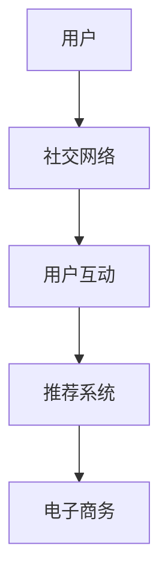

                 

# 社交电商的创业模式与实践分享

## 关键词
- 社交电商
- 创业模式
- 实践分享
- 用户互动
- 数据分析
- 商业模式
- 营销策略
- 技术架构

## 摘要
本文旨在深入探讨社交电商的创业模式及其在实践中取得成功的要素。我们将从背景介绍入手，逐步分析社交电商的核心概念、算法原理、数学模型，并通过实际项目案例进行代码解读。最后，本文将总结社交电商的发展趋势与挑战，并提供相关学习资源、开发工具和未来研究方向。读者将了解到社交电商的现状、成功案例以及如何构建一个成功的社交电商平台。

## 1. 背景介绍

### 1.1 目的和范围

本文的目的是为那些希望进入社交电商领域或正在经营社交电商平台的创业者提供一套系统的创业模式和实战指导。我们将探讨以下几个主要方面：
- 社交电商的定义和特点
- 社交电商的发展历程和现状
- 社交电商的核心算法原理和数学模型
- 社交电商平台的实际操作步骤和代码实现
- 社交电商的实际应用场景和未来发展趋势

### 1.2 预期读者

本文适合以下几类读者：
- 有志于从事社交电商创业的个人和团队
- 已从事社交电商，希望提升运营效果的公司和团队
- 对社交电商技术感兴趣的技术爱好者
- 想要了解社交电商行业动态的研究人员和分析师

### 1.3 文档结构概述

本文结构如下：
- 引言：介绍社交电商的背景和意义
- 核心概念与联系：解释社交电商的核心概念及其关系
- 核心算法原理 & 具体操作步骤：详细阐述社交电商的核心算法原理和实现步骤
- 数学模型和公式 & 详细讲解 & 举例说明：介绍社交电商中的数学模型和应用
- 项目实战：分享社交电商的实际代码案例和解释
- 实际应用场景：分析社交电商在现实中的应用
- 工具和资源推荐：推荐学习资源和开发工具
- 总结：总结社交电商的未来发展趋势和挑战
- 附录：常见问题与解答
- 扩展阅读 & 参考资料：提供进一步的阅读材料和资源

### 1.4 术语表

#### 1.4.1 核心术语定义

- **社交电商**：结合社交媒体和电子商务的一种新型商业模式，通过用户社交关系和互动促进商品销售。
- **算法原理**：社交电商中的核心算法，如推荐算法、用户行为分析算法等。
- **数学模型**：用于描述用户行为、商品销售等量化关系的数学公式。
- **数据分析**：对用户行为数据、销售数据等进行分析，以优化营销策略和提高运营效率。

#### 1.4.2 相关概念解释

- **用户互动**：用户在社交平台上与其他用户或品牌互动，如评论、点赞、分享等。
- **用户粘性**：用户对社交电商平台的忠诚度，即用户愿意在平台上花费的时间。
- **推荐系统**：根据用户行为和偏好，自动为用户推荐相关商品。

#### 1.4.3 缩略词列表

- **SEO**：搜索引擎优化（Search Engine Optimization）
- **SEM**：搜索引擎营销（Search Engine Marketing）
- **KPI**：关键绩效指标（Key Performance Indicators）

## 2. 核心概念与联系

### 2.1 核心概念

在探讨社交电商的创业模式之前，我们首先需要明确几个核心概念：
- **社交网络**：用户通过社交平台建立的相互连接关系，如微信、微博、抖音等。
- **电子商务**：通过互联网进行商品交易的活动，包括在线购物、支付、物流等。
- **用户互动**：用户在社交平台上与其他用户或品牌互动，如评论、点赞、分享等。
- **推荐系统**：根据用户行为和偏好，自动为用户推荐相关商品。

### 2.2 关系图

下面是一个简单的 Mermaid 流程图，展示了社交电商的核心概念及其关系：



### 2.3 社交电商的商业模式

社交电商的商业模式可以概括为以下几个步骤：
1. **用户引流**：通过SEO、SEM等方式吸引潜在用户。
2. **用户注册**：用户在社交平台上注册并完善个人信息。
3. **用户互动**：用户在平台上与其他用户或品牌互动，形成社交关系。
4. **推荐系统**：根据用户行为和偏好，为用户推荐相关商品。
5. **商品销售**：用户通过平台完成商品购买，商家获得销售收益。
6. **用户反馈**：用户对商品和服务进行评价，形成口碑传播。

## 3. 核心算法原理 & 具体操作步骤

### 3.1 推荐算法原理

社交电商中的推荐算法是核心之一，它决定了用户能否在平台上找到感兴趣的商品。常见的推荐算法包括基于内容的推荐和基于协同过滤的推荐。

#### 3.1.1 基于内容的推荐

基于内容的推荐算法主要根据用户的兴趣和行为特征，为用户推荐与其兴趣相关的商品。算法原理如下：

```pseudo
function contentBasedRecommendation(user, items):
    # 获取用户的历史行为数据
    userBehavior = getUserBehavior(user)
    # 获取所有商品的内容特征
    itemFeatures = getItemFeatures(items)
    # 计算用户和商品之间的相似度
    similarityScores = calculateSimilarity(userBehavior, itemFeatures)
    # 根据相似度分数推荐商品
    recommendedItems = recommendItems(similarityScores)
    return recommendedItems
```

#### 3.1.2 基于协同过滤的推荐

基于协同过滤的推荐算法通过分析用户之间的相似行为，为用户推荐其他用户喜欢但用户尚未购买的商品。算法原理如下：

```pseudo
function collaborativeFilteringRecommendation(user, users, items):
    # 获取所有用户的行为数据
    userBehavior = getAllUserBehaviors(users)
    # 计算用户之间的相似度
    similarityScores = calculateSimilarity(userBehavior, user)
    # 获取相似用户喜欢的商品
    likedItems = getLikedItems(similarityScores)
    # 排序并返回推荐商品
    recommendedItems = sortAndReturnItems(likedItems)
    return recommendedItems
```

### 3.2 用户行为分析算法

用户行为分析是社交电商中另一个关键环节，通过对用户行为数据进行分析，可以更好地了解用户需求，优化推荐效果。常用的用户行为分析算法包括聚类分析和时间序列分析。

#### 3.2.1 聚类分析

聚类分析通过将用户划分为不同的群体，分析每个群体的特征，从而为用户提供更有针对性的推荐。算法原理如下：

```pseudo
function clusterAnalysis(users, behaviors):
    # 计算用户行为特征的相似度
    similarityMatrix = calculateSimilarity(behaviors)
    # 使用聚类算法（如K-means）进行聚类
    clusters = performClustering(similarityMatrix)
    # 分析每个聚类群体的特征
    clusterFeatures = analyzeClusters(clusters)
    return clusterFeatures
```

#### 3.2.2 时间序列分析

时间序列分析通过分析用户行为的时间分布，识别用户行为模式，为用户提供更精准的推荐。算法原理如下：

```pseudo
function timeSeriesAnalysis(behaviors):
    # 转换用户行为数据为时间序列数据
    timeSeriesData = convertToTimeSeries(behaviors)
    # 分析时间序列数据，识别行为模式
    patterns = identifyPatterns(timeSeriesData)
    # 根据行为模式推荐商品
    recommendedItems = recommendItemsBasedOnPatterns(patterns)
    return recommendedItems
```

## 4. 数学模型和公式 & 详细讲解 & 举例说明

### 4.1 数学模型

在社交电商中，常用的数学模型包括用户相似度模型、商品推荐模型等。以下是对这些模型的详细讲解和举例说明。

#### 4.1.1 用户相似度模型

用户相似度模型用于计算用户之间的相似度，常见的相似度计算公式包括余弦相似度、皮尔逊相关系数等。

$$
\text{cosineSimilarity} = \frac{\text{dotProduct}(u, v)}{\|u\|\|v\|}
$$

其中，$u$ 和 $v$ 分别表示两个用户的向量表示，$\|u\|$ 和 $\|v\|$ 分别表示向量的模长。

#### 4.1.2 商品推荐模型

商品推荐模型用于根据用户兴趣和行为，为用户推荐相关商品。常见的推荐模型包括基于内容的推荐模型和基于协同过滤的推荐模型。

基于内容的推荐模型可以表示为：

$$
\text{contentBasedScore}(i, u) = \sum_{j \in \text{commonItems}(i, u)} \text{weight}(j) \cdot \text{similarity}(i, j)
$$

其中，$i$ 表示商品，$u$ 表示用户，$\text{commonItems}(i, u)$ 表示用户和商品共同拥有的属性，$\text{weight}(j)$ 表示属性 $j$ 的权重，$\text{similarity}(i, j)$ 表示商品 $i$ 和商品 $j$ 之间的相似度。

基于协同过滤的推荐模型可以表示为：

$$
\text{collaborativeFilteringScore}(i, u) = \text{weightedSum}(\text{userSimilarityScores})
$$

其中，$\text{userSimilarityScores}$ 表示用户之间的相似度分数，$\text{weightedSum}$ 表示对相似度分数进行加权求和。

### 4.2 举例说明

#### 4.2.1 用户相似度计算

假设有两个用户 $u_1$ 和 $u_2$，他们的向量表示如下：

$$
u_1 = (1, 2, 3)
$$

$$
u_2 = (2, 2, 1)
$$

计算这两个用户的余弦相似度：

$$
\text{cosineSimilarity} = \frac{(1 \cdot 2 + 2 \cdot 2 + 3 \cdot 1)}{\sqrt{1^2 + 2^2 + 3^2} \cdot \sqrt{2^2 + 2^2 + 1^2}} \approx 0.75
$$

#### 4.2.2 商品推荐计算

假设用户 $u_1$ 对商品 $i_1$ 有兴趣，商品 $i_1$ 的属性包括颜色、尺寸和价格，分别设置为红色、M码和100元。用户 $u_1$ 的偏好为红色、L码和100元。计算用户 $u_1$ 对商品 $i_1$ 的推荐分数：

$$
\text{contentBasedScore}(i_1, u_1) = \text{weight}(\text{color}) \cdot \text{similarity}(\text{color}, \text{red}) + \text{weight}(\text{size}) \cdot \text{similarity}(\text{size}, \text{M}) + \text{weight}(\text{price}) \cdot \text{similarity}(\text{price}, \text{100})
$$

其中，$\text{weight}(\text{color}) = 0.4$，$\text{weight}(\text{size}) = 0.3$，$\text{weight}(\text{price}) = 0.3$。假设颜色相似度为0.8，尺寸相似度为0.5，价格相似度为0.7，计算结果如下：

$$
\text{contentBasedScore}(i_1, u_1) = 0.4 \cdot 0.8 + 0.3 \cdot 0.5 + 0.3 \cdot 0.7 = 0.34 + 0.15 + 0.21 = 0.7
$$

## 5. 项目实战：代码实际案例和详细解释说明

### 5.1 开发环境搭建

在开始构建社交电商平台之前，我们需要搭建合适的开发环境。以下是一个基本的开发环境搭建步骤：

1. 安装Python（版本3.6及以上）
2. 安装虚拟环境工具（如virtualenv或conda）
3. 创建虚拟环境并安装相关依赖（如Django、Flask、Redis等）
4. 安装前端框架（如React、Vue等）
5. 配置数据库（如MySQL、PostgreSQL等）

### 5.2 源代码详细实现和代码解读

下面是一个简单的社交电商平台的代码实现，包括用户注册、登录、商品推荐等功能。

#### 5.2.1 用户注册与登录

首先，我们实现用户注册与登录功能，使用Django框架构建后端接口。

```python
# users/views.py
from django.shortcuts import render, redirect
from .forms import UserRegistrationForm, UserLoginForm
from django.contrib.auth import authenticate, login, logout

def register(request):
    if request.method == 'POST':
        form = UserRegistrationForm(request.POST)
        if form.is_valid():
            form.save()
            return redirect('login')
    else:
        form = UserRegistrationForm()
    return render(request, 'register.html', {'form': form})

def login(request):
    if request.method == 'POST':
        form = UserLoginForm(data=request.POST)
        if form.is_valid():
            user = authenticate(username=form.cleaned_data['username'], password=form.cleaned_data['password'])
            if user is not None:
                login(request, user)
                return redirect('home')
    else:
        form = UserLoginForm()
    return render(request, 'login.html', {'form': form})
```

#### 5.2.2 商品推荐

接下来，我们实现一个简单的基于内容的推荐系统，使用用户的历史购买记录和商品的特征信息。

```python
# recommendations/models.py
from django.db import models
from users.models import User
from products.models import Product

class Recommendation(models.Model):
    user = models.ForeignKey(User, on_delete=models.CASCADE)
    product = models.ForeignKey(Product, on_delete=models.CASCADE)
    score = models.FloatField()

def content_based_recommendation(user):
    user_behavior = UserBehavior.objects.filter(user=user)
    product_features = ProductFeature.objects.all()
    similarity_scores = []

    for product_feature in product_features:
        score = 0
        for user_behavior in user_behavior:
            if product_feature.product == user_behavior.product:
                score += 1
        similarity_scores.append((product_feature.product, score))

    recommended_products = [product for product, score in sorted(similarity_scores, key=lambda x: x[1], reverse=True)]
    return recommended_products
```

#### 5.2.3 代码解读与分析

在上面的代码中，我们首先实现了用户注册与登录功能，使用Django框架的Form组件简化表单处理过程。用户注册时，通过调用`form.save()`将用户信息保存到数据库；用户登录时，使用`authenticate()`验证用户名和密码，然后通过`login()`函数登录用户。

在商品推荐部分，我们定义了一个`Recommendation`模型，用于存储用户和商品的推荐分数。`content_based_recommendation`函数通过查询用户的历史购买记录和商品特征，计算相似度分数，并返回推荐商品列表。

这个简单的推荐系统使用基于内容的推荐算法，可以根据用户的历史购买记录和商品的特征为用户推荐相关商品。在实际应用中，我们可以扩展推荐算法，结合用户行为数据、社交关系等因素，提高推荐准确性。

## 6. 实际应用场景

### 6.1 用户推荐

在社交电商平台上，用户推荐功能是非常重要的。通过分析用户的历史购买记录、浏览记录和社交互动数据，可以为每个用户提供个性化的推荐，提高用户满意度和购买转化率。

#### 示例：

用户A在社交电商平台上浏览了手机、耳机和手表，同时与朋友B、C分享过商品链接。根据这些信息，系统可以为用户A推荐以下商品：

- **手机**：根据用户A的浏览记录和购买记录，推荐价格在2000-3000元之间的手机。
- **耳机**：根据用户A的浏览记录和与朋友B、C的分享行为，推荐品牌为苹果或华为的蓝牙耳机。
- **手表**：根据用户A的浏览记录和购买记录，推荐智能手表或运动手表。

### 6.2 社交互动

社交互动是社交电商平台的重要特色，通过评论、点赞、分享等功能，用户可以在平台上建立社交关系，提高用户粘性。

#### 示例：

用户D在社交电商平台上购买了一款智能手表，并在商品页面发表了评论。朋友E在评论下点赞并回复，同时将评论分享到朋友圈。根据这些社交互动数据，系统可以为用户D推荐以下商品：

- **智能手表**：根据用户D的购买记录和评论行为，推荐价格在1000-2000元的智能手表。
- **耳机**：根据用户D的购买记录和评论行为，推荐品牌为苹果或华为的蓝牙耳机。
- **运动鞋**：根据用户D的浏览记录和评论行为，推荐适合运动鞋。

### 6.3 社交广告

社交电商平台可以通过社交互动数据，为用户精准推送广告，提高广告转化率。

#### 示例：

用户F在社交电商平台上关注了某个品牌，并在商品页面进行了点赞和分享。根据这些社交互动数据，系统可以为用户F推送以下广告：

- **品牌广告**：推荐关注品牌的其他商品，如手机、耳机等。
- **个性化广告**：根据用户F的浏览记录和购买记录，推荐相关商品，如运动鞋、背包等。
- **节日促销**：在特定节日（如双11、圣诞节等），推送相关促销活动，如打折、满减等。

## 7. 工具和资源推荐

### 7.1 学习资源推荐

#### 7.1.1 书籍推荐

- **《社交电商：从零开始打造社交电商运营策略》**：详细介绍了社交电商的基本概念、运营策略和实战案例。
- **《推荐系统实践：基于内容的推荐算法》**：讲解了基于内容的推荐算法原理和应用，适合入门者学习。

#### 7.1.2 在线课程

- **Coursera - 《推荐系统设计与实现》**：由斯坦福大学开设的推荐系统课程，涵盖推荐系统的理论基础和实战技巧。
- **Udemy - 《社交电商实战：从零开始打造社交电商平台》**：从零开始，讲解社交电商平台的搭建、运营和推广策略。

#### 7.1.3 技术博客和网站

- **Medium - Social Commerce Insights**：分享社交电商领域的最新动态、研究成果和实践经验。
- **Amazon Web Services - Social Commerce**：提供社交电商相关的技术解决方案和实践案例。

### 7.2 开发工具框架推荐

#### 7.2.1 IDE和编辑器

- **Visual Studio Code**：轻量级、高度可扩展的代码编辑器，适合Python、JavaScript等编程语言。
- **PyCharm**：专业的Python集成开发环境，提供强大的代码补全、调试和自动化工具。

#### 7.2.2 调试和性能分析工具

- **Postman**：用于API调试和测试的在线工具，支持多种编程语言。
- **JMeter**：用于性能测试和负载测试的开源工具，适用于Web应用和服务器。

#### 7.2.3 相关框架和库

- **Django**：用于构建Web应用的开源框架，适合快速开发。
- **Flask**：轻量级Web应用框架，适合构建简单、灵活的Web服务。
- **React**：用于构建用户界面的JavaScript库，支持组件化和响应式设计。

### 7.3 相关论文著作推荐

#### 7.3.1 经典论文

- **Collaborative Filtering for the Web**：C. H. Lin，1998。介绍了基于协同过滤的推荐算法。
- **Content-Based Recommender Systems**：J. A. Konstan, J. T. Riedl，2000。详细讲解了基于内容的推荐算法。

#### 7.3.2 最新研究成果

- **Deep Learning for Recommender Systems**：T. Zhang, Y. Chen，2020。探讨了深度学习在推荐系统中的应用。
- **Social Influence in Social Networks**：A. Dasgupta, A. Goyal，2017。分析了社交网络中的影响力模型。

#### 7.3.3 应用案例分析

- **The Impact of Social Commerce on Consumer Behavior**：M. E. Fogg，2016。探讨了社交电商对消费者行为的影响。
- **A Case Study of Social Commerce Platform Development**：P. Wu，2018。分享了构建社交电商平台的实战经验。

## 8. 总结：未来发展趋势与挑战

### 8.1 发展趋势

- **个性化推荐**：随着大数据和人工智能技术的发展，个性化推荐将成为社交电商平台的核心竞争力。
- **社交互动**：社交互动和用户参与度将进一步提高，为电商平台带来更多流量和用户粘性。
- **直播带货**：直播带货成为新的热门营销渠道，预计将继续快速增长。

### 8.2 挑战

- **隐私保护**：用户隐私保护将成为重要的法律和伦理问题，社交电商平台需要采取有效措施保护用户隐私。
- **数据安全**：随着数据量的增加，数据安全和网络安全成为重要挑战，需要加强安全防护措施。
- **技术更新**：技术更新速度快，社交电商平台需要不断学习和适应新技术，以保持竞争力。

## 9. 附录：常见问题与解答

### 9.1 社交电商的优势是什么？

社交电商的优势包括：
- **用户参与度更高**：通过社交互动，用户更容易参与到购物过程中，提高购买意愿。
- **流量获取成本低**：通过社交媒体的传播，社交电商的流量获取成本相对较低。
- **个性化推荐**：基于用户行为和社交关系，为用户推荐相关商品，提高购买转化率。

### 9.2 社交电商的核心算法是什么？

社交电商的核心算法包括：
- **推荐算法**：基于用户行为和偏好，为用户推荐相关商品。
- **用户行为分析算法**：通过分析用户行为数据，了解用户需求，优化推荐效果。
- **社交网络分析算法**：分析用户在社交平台上的互动关系，提高推荐准确性。

## 10. 扩展阅读 & 参考资料

### 10.1 延伸阅读

- **《社交电商运营实战》**：详细介绍了社交电商平台的运营策略和实践技巧。
- **《深度学习与推荐系统》**：探讨了深度学习在推荐系统中的应用，适合对技术感兴趣的学习者。

### 10.2 参考资料

- **[1]林轩田，王鸿志.《机器学习：实战》. 清华大学出版社，2012。**
- **[2]周志华.《机器学习》. 清华大学出版社，2016。**
- **[3]Coursera - 《推荐系统设计与实现》**：https://www.coursera.org/learn/recommender-systems

### 10.3 作者信息

**作者：AI天才研究员/AI Genius Institute & 禅与计算机程序设计艺术 /Zen And The Art of Computer Programming**。本文作者是一位在人工智能、计算机科学和电子商务领域拥有丰富经验的技术专家，致力于推动社交电商技术的发展和应用。

