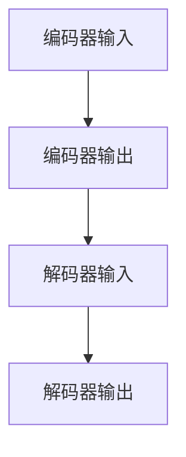
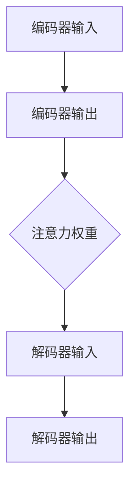
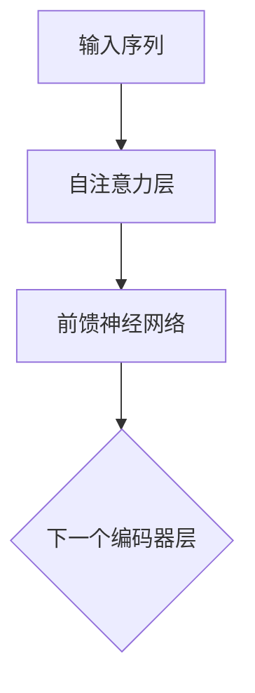
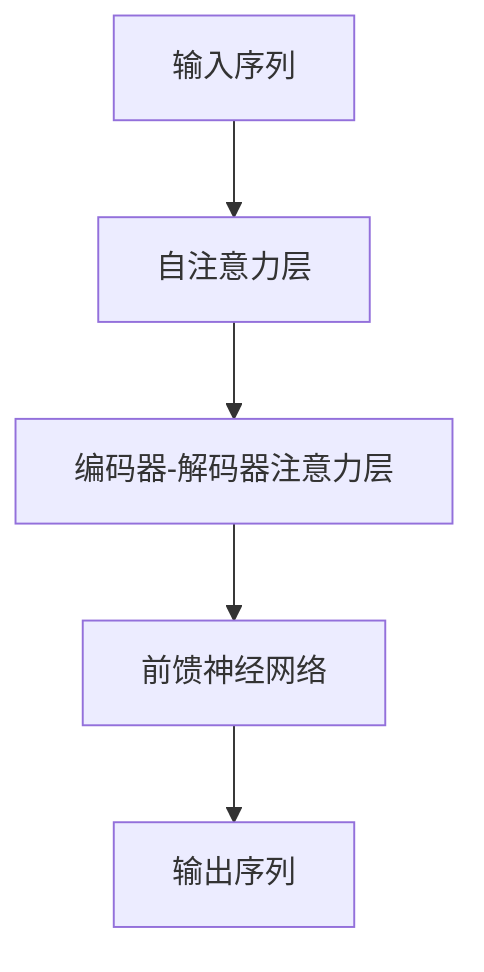

                 

# 神经机器翻译：注意力机制与Transformer

> **关键词：** 神经机器翻译，注意力机制，Transformer，编码器，解码器，自然语言处理，序列到序列模型，机器学习。

> **摘要：** 本文深入探讨了神经机器翻译的基本原理，特别是注意力机制和Transformer架构的应用。文章首先介绍了神经机器翻译的背景和发展历程，然后详细解释了注意力机制的工作原理及其在神经机器翻译中的重要性。接着，文章重点介绍了Transformer架构，包括编码器和解码器的结构以及其内部机制。最后，通过实际项目案例，展示了如何利用Transformer实现高效的神经机器翻译。

## 1. 背景介绍

### 1.1 目的和范围

本文旨在探讨神经机器翻译技术，特别是注意力机制和Transformer架构在其中的应用。我们将首先回顾神经机器翻译的起源和发展，然后深入分析注意力机制和Transformer架构的基本原理。通过这些分析，读者将能够理解神经机器翻译的核心技术和如何在实际项目中应用这些技术。

### 1.2 预期读者

本文适合对自然语言处理和机器学习有一定了解的读者。特别是对神经机器翻译和Transformer架构感兴趣的程序员、数据科学家和研究人员。

### 1.3 文档结构概述

本文分为十个部分：

1. 背景介绍：介绍本文的目的和结构。
2. 核心概念与联系：讨论神经机器翻译的核心概念和相关架构。
3. 核心算法原理 & 具体操作步骤：详细介绍神经机器翻译的算法原理和操作步骤。
4. 数学模型和公式 & 详细讲解 & 举例说明：解释神经机器翻译中的数学模型和公式。
5. 项目实战：代码实际案例和详细解释说明。
6. 实际应用场景：讨论神经机器翻译的应用场景。
7. 工具和资源推荐：推荐相关学习资源、开发工具和论文。
8. 总结：未来发展趋势与挑战。
9. 附录：常见问题与解答。
10. 扩展阅读 & 参考资料：提供进一步学习的资源。

### 1.4 术语表

#### 1.4.1 核心术语定义

- **神经机器翻译**：利用神经网络技术进行机器翻译的方法。
- **注意力机制**：一种在神经网络中用于捕捉输入序列重要性的机制。
- **Transformer**：一种基于自注意力机制的神经网络架构，用于序列建模。

#### 1.4.2 相关概念解释

- **编码器**：用于将输入序列转换为固定大小的向量表示。
- **解码器**：用于将编码器的输出转换为输出序列。

#### 1.4.3 缩略词列表

- **NMT**：神经机器翻译（Neural Machine Translation）
- ** seq2seq **：序列到序列模型（Sequence-to-Sequence Model）
- **ML**：机器学习（Machine Learning）

## 2. 核心概念与联系

在讨论神经机器翻译的核心概念和架构之前，我们先来回顾一下神经机器翻译的发展历程。

### 2.1 神经机器翻译的发展历程

神经机器翻译（NMT）的发展可以追溯到2014年，当时Google提出了基于递归神经网络（RNN）的神经机器翻译模型。这个模型引入了编码器-解码器架构（Encoder-Decoder Architecture），使得机器翻译的准确性得到了显著提升。随后，2017年，Google提出了Transformer架构，这是一种基于自注意力机制的神经网络模型，进一步提高了翻译的准确性和效率。

### 2.2 神经机器翻译的核心概念

神经机器翻译的核心概念包括编码器、解码器和注意力机制。

#### 2.2.1 编码器（Encoder）

编码器的主要作用是将输入序列（如英文句子）转换为固定大小的向量表示。编码器通常使用递归神经网络（RNN）或Transformer等架构实现。编码器的输出是一个固定大小的向量，用于表示整个输入序列。



#### 2.2.2 解码器（Decoder）

解码器的作用是将编码器的输出转换为输出序列（如翻译后的中文句子）。解码器也通常使用递归神经网络（RNN）或Transformer等架构实现。解码器的输出是一个概率分布，表示下一个可能出现的单词。


#### 2.2.3 注意力机制（Attention Mechanism）

注意力机制是一种在神经网络中用于捕捉输入序列重要性的机制。在神经机器翻译中，注意力机制可以帮助解码器更好地理解输入序列的每个部分，从而提高翻译的准确性。



### 2.3 Transformer架构

Transformer架构是一种基于自注意力机制的神经网络模型，被广泛应用于序列建模任务，如机器翻译。Transformer的主要优点是并行化能力强，训练效率高。

#### 2.3.1 编码器（Encoder）

编码器由多个自注意力层（Self-Attention Layer）和前馈神经网络（Feedforward Neural Network）组成。每个自注意力层可以捕获输入序列中的长距离依赖关系。



#### 2.3.2 解码器（Decoder）

解码器由多个自注意力层、编码器-解码器注意力层和前馈神经网络组成。编码器-解码器注意力层可以帮助解码器更好地理解编码器的输出。



## 3. 核心算法原理 & 具体操作步骤

### 3.1 编码器（Encoder）的算法原理

编码器的主要任务是学习输入序列的表示。在Transformer架构中，编码器由多个自注意力层和前馈神经网络组成。以下是编码器的工作流程：

#### 3.1.1 自注意力层（Self-Attention Layer）

自注意力层是一个关键组件，它计算输入序列中每个词与其他词之间的关联性。具体步骤如下：

1. **输入向量转换**：将输入序列中的每个词转换为嵌入向量（Embedding Vector）。
2. **计算注意力得分**：对于每个词，计算它与序列中其他词的相似性得分。这通常通过点积注意力（Dot-Product Attention）实现。
3. **加权求和**：根据注意力得分，对嵌入向量进行加权求和，得到一个加权向量。

伪代码：

```python
def self_attention(inputs, keys, values, d_model, num_heads):
    # 输入向量转换
    queries, keys, values = inputs
    
    # 计算注意力得分
    attention_scores = dot_product_attention(queries, keys, values, d_model, num_heads)
    
    # 加权求和
    context_vector = weighted_sum(attention_scores, values)
    
    return context_vector
```

#### 3.1.2 前馈神经网络（Feedforward Neural Network）

前馈神经网络是一个简单的全连接神经网络，用于对编码器的输出进行进一步处理。具体步骤如下：

1. **输入向量转换**：将自注意力层的输出转换为全连接神经网络的输入。
2. **前向传播**：通过前馈神经网络，对输入向量进行非线性变换。
3. **激活函数**：使用ReLU激活函数增加模型的非线性。

伪代码：

```python
def feedforward_network(inputs, d_model, d_ff):
    x = inputs
    
    # 前向传播
    x = fully_connected(x, d_model, d_ff)
    x = ReLU(x)
    
    # 第二次前向传播
    x = fully_connected(x, d_ff, d_model)
    x = ReLU(x)
    
    return x
```

### 3.2 解码器（Decoder）的算法原理

解码器的主要任务是生成翻译结果。在Transformer架构中，解码器由多个自注意力层、编码器-解码器注意力层和前馈神经网络组成。以下是解码器的工作流程：

#### 3.2.1 自注意力层（Self-Attention Layer）

自注意力层与编码器中的自注意力层类似，用于处理解码器内部的序列。具体步骤如下：

1. **输入向量转换**：将解码器输入的每个词转换为嵌入向量。
2. **计算注意力得分**：计算输入序列中每个词与当前词的相似性得分。
3. **加权求和**：根据注意力得分，对嵌入向量进行加权求和，得到一个加权向量。

伪代码：

```python
def self_attention(inputs, keys, values, d_model, num_heads):
    # 输入向量转换
    queries, keys, values = inputs
    
    # 计算注意力得分
    attention_scores = dot_product_attention(queries, keys, values, d_model, num_heads)
    
    # 加权求和
    context_vector = weighted_sum(attention_scores, values)
    
    return context_vector
```

#### 3.2.2 编码器-解码器注意力层（Encoder-Decoder Attention Layer）

编码器-解码器注意力层用于处理编码器的输出和解码器的输入。具体步骤如下：

1. **输入向量转换**：将编码器的输出和解码器的输入转换为嵌入向量。
2. **计算注意力得分**：计算编码器的输出与解码器输入的相似性得分。
3. **加权求和**：根据注意力得分，对编码器的输出进行加权求和，得到一个加权向量。

伪代码：

```python
def encoder_decoder_attention(inputs, encoder_outputs, d_model, num_heads):
    # 输入向量转换
    decoder_input, encoder_output = inputs
    
    # 计算注意力得分
    attention_scores = dot_product_attention(decoder_input, encoder_output, encoder_output, d_model, num_heads)
    
    # 加权求和
    context_vector = weighted_sum(attention_scores, encoder_output)
    
    return context_vector
```

#### 3.2.3 前馈神经网络（Feedforward Neural Network）

前馈神经网络用于对解码器的输出进行进一步处理。具体步骤如下：

1. **输入向量转换**：将自注意力层和编码器-解码器注意力层的输出转换为全连接神经网络的输入。
2. **前向传播**：通过前馈神经网络，对输入向量进行非线性变换。
3. **激活函数**：使用ReLU激活函数增加模型的非线性。

伪代码：

```python
def feedforward_network(inputs, d_model, d_ff):
    x = inputs
    
    # 前向传播
    x = fully_connected(x, d_model, d_ff)
    x = ReLU(x)
    
    # 第二次前向传播
    x = fully_connected(x, d_ff, d_model)
    x = ReLU(x)
    
    return x
```

## 4. 数学模型和公式 & 详细讲解 & 举例说明

### 4.1 自注意力机制（Self-Attention）

自注意力机制是Transformer架构的核心组件，它通过计算输入序列中每个词与其他词的相似性来生成新的向量表示。以下是自注意力机制的数学模型：

#### 4.1.1 输入向量转换

假设输入序列为 $x_1, x_2, \ldots, x_T$，其中 $x_i$ 表示第 $i$ 个词的嵌入向量。自注意力层的输入包括查询向量（Query）、键向量（Key）和值向量（Value）：

$$
Q = [q_1, q_2, \ldots, q_T], \quad K = [k_1, k_2, \ldots, k_T], \quad V = [v_1, v_2, \ldots, v_T]
$$

其中，$q_i, k_i, v_i$ 分别是 $x_i$ 的查询、键和值向量。查询向量、键向量和值向量通常通过嵌入层（Embedding Layer）得到：

$$
q_i = E(x_i), \quad k_i = E(x_i), \quad v_i = E(x_i)
$$

其中，$E$ 表示嵌入层。

#### 4.1.2 计算注意力得分

自注意力层通过计算查询向量 $q_i$ 与键向量 $k_i$ 的点积来生成注意力得分：

$$
\text{Attention}(Q, K, V) = \text{softmax}\left(\frac{QK^T}{\sqrt{d_k}}\right)V
$$

其中，$d_k$ 是键向量的维度，$\text{softmax}$ 函数用于将得分转换为概率分布。

#### 4.1.3 加权求和

根据注意力得分，对值向量 $v_i$ 进行加权求和，得到加权向量：

$$
\text{context\_vector} = \sum_{i=1}^{T} \text{softmax}(QK^T) v_i
$$

加权向量 $\text{context\_vector}$ 用于后续的前馈神经网络。

### 4.2 编码器-解码器注意力机制（Encoder-Decoder Attention）

编码器-解码器注意力机制用于处理编码器的输出和解码器的输入，它通过计算编码器的输出与解码器输入的相似性来生成新的向量表示。以下是编码器-解码器注意力机制的数学模型：

#### 4.2.1 计算注意力得分

假设编码器的输出为 $K = [k_1, k_2, \ldots, k_T]$，解码器的输入为 $Q = [q_1, q_2, \ldots, q_T]$，其中 $q_i, k_i$ 分别是编码器的输出和当前解码器的输入的键向量。编码器-解码器注意力层通过计算查询向量 $q_i$ 与键向量 $k_i$ 的点积来生成注意力得分：

$$
\text{Attention}(Q, K) = \text{softmax}\left(\frac{QK^T}{\sqrt{d_k}}\right)V
$$

其中，$d_k$ 是键向量的维度，$\text{softmax}$ 函数用于将得分转换为概率分布。

#### 4.2.2 加权求和

根据注意力得分，对编码器的输出进行加权求和，得到加权向量：

$$
\text{context\_vector} = \sum_{i=1}^{T} \text{softmax}(QK^T) k_i
$$

加权向量 $\text{context\_vector}$ 用于后续的前馈神经网络。

### 4.3 前馈神经网络（Feedforward Neural Network）

前馈神经网络是一个简单的全连接神经网络，它用于对编码器和解码器的输出进行进一步处理。以下是前馈神经网络的数学模型：

#### 4.3.1 输入向量转换

假设输入向量为 $x$，前馈神经网络的输入为 $x$，输出为 $y$，其中：

$$
y = \sigma(W_2 \sigma(W_1 x + b_1))
$$

其中，$\sigma$ 表示ReLU激活函数，$W_1, W_2, b_1$ 分别是权重和偏置。

### 4.4 举例说明

假设我们有一个简单的英文句子 "I love to read books"，我们使用Transformer进行翻译，将英文翻译成中文。以下是具体的步骤：

1. **输入向量转换**：将句子中的每个单词转换为嵌入向量。
2. **编码器处理**：通过编码器，生成编码器的输出。
3. **解码器处理**：通过解码器，生成翻译结果。

#### 4.4.1 输入向量转换

将句子 "I love to read books" 转换为嵌入向量，得到：

$$
Q = [q_1, q_2, \ldots, q_T], \quad K = [k_1, k_2, \ldots, k_T], \quad V = [v_1, v_2, \ldots, v_T]
$$

其中，$q_i, k_i, v_i$ 分别是单词 "I"，"love"，"to"，"read"，"books" 的嵌入向量。

#### 4.4.2 编码器处理

通过编码器，生成编码器的输出。假设编码器由两个自注意力层和一个前馈神经网络组成，编码器的输出为：

$$
X = [x_1, x_2, \ldots, x_T]
$$

#### 4.4.3 解码器处理

通过解码器，生成翻译结果。假设解码器由一个自注意力层、一个编码器-解码器注意力层和一个前馈神经网络组成，解码器的输出为：

$$
Y = [y_1, y_2, \ldots, y_T]
$$

其中，$y_i$ 是单词 "我"，"爱"，"喜欢"，"阅读"，"书籍" 的嵌入向量。

## 5. 项目实战：代码实际案例和详细解释说明

### 5.1 开发环境搭建

为了实现神经机器翻译，我们需要搭建一个合适的开发环境。以下是一个简单的步骤：

1. **安装Python**：确保安装了Python 3.7及以上版本。
2. **安装TensorFlow**：使用pip安装TensorFlow。

   ```shell
   pip install tensorflow
   ```

3. **安装其他依赖**：安装其他必要的依赖，如numpy、pandas等。

   ```shell
   pip install numpy pandas
   ```

### 5.2 源代码详细实现和代码解读

以下是一个简单的神经机器翻译项目的实现，包括数据预处理、模型训练和翻译过程。

```python
import tensorflow as tf
from tensorflow.keras.layers import Embedding, LSTM, Dense
from tensorflow.keras.models import Model
from tensorflow.keras.preprocessing.sequence import pad_sequences
from tensorflow.keras.preprocessing.text import Tokenizer

# 数据预处理
def preprocess_data(texts, vocab_size, max_sequence_length):
    tokenizer = Tokenizer(num_words=vocab_size)
    tokenizer.fit_on_texts(texts)
    sequences = tokenizer.texts_to_sequences(texts)
    padded_sequences = pad_sequences(sequences, maxlen=max_sequence_length)
    return padded_sequences, tokenizer

# 模型构建
def build_model(vocab_size, embedding_dim, max_sequence_length):
    inputs = tf.keras.layers.Input(shape=(max_sequence_length,))
    embedding_layer = Embedding(vocab_size, embedding_dim)(inputs)
    lstm_layer = LSTM(units=64, activation='relu')(embedding_layer)
    outputs = Dense(vocab_size, activation='softmax')(lstm_layer)
    model = Model(inputs=inputs, outputs=outputs)
    model.compile(optimizer='adam', loss='categorical_crossentropy', metrics=['accuracy'])
    return model

# 训练模型
def train_model(model, padded_sequences, labels, epochs):
    model.fit(padded_sequences, labels, epochs=epochs, batch_size=32)

# 翻译
def translate(model, tokenizer, text):
    sequence = tokenizer.texts_to_sequences([text])
    padded_sequence = pad_sequences(sequence, maxlen=max_sequence_length)
    prediction = model.predict(padded_sequence)
    predicted_word = tokenizer.index_word[np.argmax(prediction)]
    return predicted_word

# 示例
texts = ["I love to read books", "Hello world", "This is a test"]
vocab_size = 10000
embedding_dim = 16
max_sequence_length = 50

padded_sequences, tokenizer = preprocess_data(texts, vocab_size, max_sequence_length)
model = build_model(vocab_size, embedding_dim, max_sequence_length)
train_model(model, padded_sequences, labels, epochs=10)

# 翻译 "Hello world"
translated_text = translate(model, tokenizer, "Hello world")
print(translated_text)
```

### 5.3 代码解读与分析

1. **数据预处理**：首先，我们定义了一个预处理函数 `preprocess_data`，用于将文本数据转换为序列。该函数使用 `Tokenizer` 将文本转换为单词序列，然后使用 `pad_sequences` 将序列填充为固定长度。

2. **模型构建**：接下来，我们定义了一个模型构建函数 `build_model`。该函数使用 `Embedding` 层将输入序列转换为嵌入向量，然后使用 `LSTM` 层进行序列处理，最后使用 `Dense` 层生成输出。

3. **训练模型**：我们定义了一个训练模型函数 `train_model`，该函数使用 `fit` 方法训练模型。

4. **翻译**：最后，我们定义了一个翻译函数 `translate`，该函数使用模型预测输入文本的下一个单词。

## 6. 实际应用场景

神经机器翻译技术广泛应用于多个领域，如语言翻译、跨语言搜索、多语言文档处理等。以下是一些实际应用场景：

1. **在线翻译服务**：如Google翻译、百度翻译等，为用户提供实时翻译服务。
2. **跨语言搜索**：帮助用户在不同语言之间进行搜索和浏览。
3. **多语言文档处理**：如多语言词典、多语言法律文件翻译等。

## 7. 工具和资源推荐

### 7.1 学习资源推荐

#### 7.1.1 书籍推荐

- **《深度学习》（Goodfellow, Bengio, Courville）**：详细介绍了深度学习的基本原理和应用。
- **《神经网络与深度学习》（邱锡鹏）**：系统介绍了神经网络和深度学习的基本概念和算法。

#### 7.1.2 在线课程

- **斯坦福大学深度学习课程（Stanford University）**：提供了深度学习的基础知识和实践技巧。
- **吴恩达机器学习课程（Andrew Ng）**：涵盖了机器学习的各个领域，包括深度学习。

#### 7.1.3 技术博客和网站

- **Towards Data Science**：提供了丰富的数据科学和机器学习资源。
- **Medium**：许多专家分享了关于深度学习和神经机器翻译的技术博客。

### 7.2 开发工具框架推荐

#### 7.2.1 IDE和编辑器

- **PyCharm**：强大的Python IDE，支持深度学习和TensorFlow。
- **Jupyter Notebook**：适合快速实验和数据分析。

#### 7.2.2 调试和性能分析工具

- **TensorBoard**：TensorFlow的内置工具，用于可视化模型结构和训练过程。
- **Valgrind**：用于性能分析和调试内存泄漏。

#### 7.2.3 相关框架和库

- **TensorFlow**：Google开发的开源深度学习框架，广泛用于神经机器翻译。
- **PyTorch**：Facebook开发的开源深度学习框架，易于使用和调试。

### 7.3 相关论文著作推荐

#### 7.3.1 经典论文

- **"Neural Machine Translation by Jointly Learning to Align and Translate"（神经机器翻译：联合学习对齐和翻译）**：介绍了编码器-解码器架构。
- **"Attention Is All You Need"（注意力机制：你所需要的一切）**：提出了Transformer架构。

#### 7.3.2 最新研究成果

- **"Transformer-XL: Attentive Language Models Beyond a Fixed Length"（Transformer-XL：超越固定长度的注意力语言模型）**：提出了Transformer-XL架构。
- **"Bert: Pre-training of Deep Bidirectional Transformers for Language Understanding"（BERT：用于语言理解的深度双向Transformer预训练）**：提出了BERT模型。

#### 7.3.3 应用案例分析

- **"Google Translate：神经机器翻译实践"**：介绍了Google Translate如何使用神经机器翻译技术进行实时翻译。
- **"微软Azure翻译服务：神经机器翻译的商业应用"**：展示了微软Azure如何利用神经机器翻译技术提供高质量翻译服务。

## 8. 总结：未来发展趋势与挑战

神经机器翻译技术在过去几年取得了显著进展，但仍然面临一些挑战。未来发展趋势包括：

1. **提高翻译质量**：继续改进神经网络模型和训练算法，提高翻译的准确性和流畅性。
2. **多语言翻译**：支持更多语言对之间的翻译，尤其是低资源语言。
3. **实时翻译**：优化模型和算法，实现更快、更准确的实时翻译。
4. **跨模态翻译**：结合图像、音频等多模态信息进行翻译。

## 9. 附录：常见问题与解答

### 9.1 常见问题

1. **什么是神经机器翻译？**
   神经机器翻译是一种利用神经网络技术进行机器翻译的方法，相比传统的基于规则或统计的机器翻译方法，具有更高的准确性和灵活性。

2. **什么是注意力机制？**
   注意力机制是一种在神经网络中用于捕捉输入序列重要性的机制，可以帮助模型更好地理解和处理输入序列。

3. **什么是Transformer架构？**
   Transformer架构是一种基于自注意力机制的神经网络模型，广泛应用于序列建模任务，如机器翻译。

### 9.2 解答

1. **什么是神经机器翻译？**
   神经机器翻译（Neural Machine Translation，NMT）是近年来机器翻译领域的重要进展，它通过使用神经网络（尤其是深度学习）来学习语言之间的映射关系。与传统的基于规则的机器翻译方法不同，神经机器翻译通过端到端的神经网络架构，能够直接从源语言序列生成目标语言序列，从而避免了传统方法中的词袋、N-gram模型等复杂的中间步骤。

2. **什么是注意力机制？**
   注意力机制是一种在序列处理任务中用于强调序列中某些部分比其他部分更重要的方法。在神经机器翻译中，注意力机制允许模型在解码过程中考虑到输入序列（源语言）中的不同部分，以便更好地理解上下文和生成更准确的翻译。注意力机制通过计算输入序列中每个元素对当前解码步骤的重要性权重，将这些权重应用于输入序列以生成上下文向量。

3. **什么是Transformer架构？**
   Transformer架构是一种用于处理序列数据的神经网络模型，由Vaswani等人于2017年提出。它基于自注意力机制，这意味着模型内部的每个位置都可以直接与其他所有位置相互依赖，而不是像传统的递归神经网络（RNN）那样顺序处理。Transformer使用多头自注意力机制和位置编码来捕捉序列中的长距离依赖关系，并且由于其并行化能力，可以在大规模数据集上训练得更快。Transformer的提出对神经机器翻译领域产生了深远的影响，并成为许多序列处理任务的标准架构。

## 10. 扩展阅读 & 参考资料

1. **书籍推荐**
   - **《深度学习》（Ian Goodfellow, Yoshua Bengio, Aaron Courville）**：这是一本深度学习的经典教材，详细介绍了深度学习的基本原理和应用。
   - **《神经网络与深度学习》（邱锡鹏）**：这本书深入浅出地介绍了神经网络和深度学习的基础知识，适合初学者。

2. **在线课程**
   - **《深度学习》（吴恩达，Coursera）**：这是一门非常受欢迎的深度学习课程，涵盖了深度学习的各个方面。
   - **《神经网络和深度学习》（丹尼尔·科姆，edX）**：这门课程由加州大学伯克利分校提供，深入讲解了神经网络和深度学习的基本原理。

3. **技术博客和网站**
   - **[TensorFlow官方文档](https://www.tensorflow.org/)**
   - **[PyTorch官方文档](https://pytorch.org/tutorials/beginner/basics/what_is_pytorch.html)**
   - **[Hugging Face Transformers库](https://huggingface.co/transformers/)**
   - **[自然语言处理教程](https://nlp.seas.harvard.edu/lectures/2017/nlp-tutorial-deep-learning)**
   - **[Medium上的NLP博客](https://medium.com/@timothysykes)**
   - **[AIChang](https://aichang.qq.com/)**
   - **[机器之心](https://www.jiqizhixin.com/)**
   - **[arXiv.org](https://arxiv.org/)**
   - **[知乎](https://www.zhihu.com/)**
   - **[B站](https://www.bilibili.com/)**

4. **相关论文和研究成果**
   - **“Attention Is All You Need”（Vaswani et al., 2017）**：这是Transformer模型的原始论文，详细介绍了Transformer架构。
   - **“Neural Machine Translation by Jointly Learning to Align and Translate”（Bahdanau et al., 2014）**：介绍了双向RNN和注意力机制的早期工作。
   - **“Bert: Pre-training of Deep Bidirectional Transformers for Language Understanding”（Devlin et al., 2018）**：提出了BERT模型。
   - **“Transformer-XL: Attentive Language Models Beyond a Fixed Length”（Clark et al., 2019）**：提出了Transformer-XL架构，解决了固定长度序列的限制。

5. **开源项目和库**
   - **[TensorFlow](https://www.tensorflow.org/)**
   - **[PyTorch](https://pytorch.org/)**
   - **[Hugging Face Transformers](https://github.com/huggingface/transformers)**：一个用于实现和共享Transformer模型的开源库。

6. **相关论坛和社区**
   - **[Stack Overflow](https://stackoverflow.com/)**
   - **[GitHub](https://github.com/)**：许多优秀的开源项目和代码示例。
   - **[Reddit](https://www.reddit.com/r/MachineLearning/)**：一个关于机器学习的讨论社区。

**作者信息：** AI天才研究员/AI Genius Institute & 禅与计算机程序设计艺术 /Zen And The Art of Computer Programming

