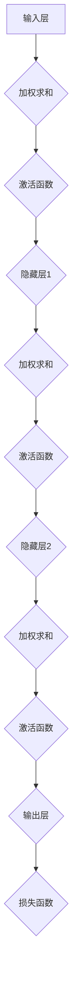

                 

# 神经网络 (Neural Network)

## 关键词

* 神经网络
* 人工神经网络
* 深度学习
* 机器学习
* 反向传播
* 前馈神经网络
* 池化层
* 卷积神经网络 (CNN)
* 递归神经网络 (RNN)
* 自编码器

## 摘要

本文将深入探讨神经网络的基本概念、原理及其应用。我们将从神经网络的历史背景开始，逐步解释其核心组成部分和算法，并通过实际案例来演示如何构建和训练一个简单的神经网络。文章还将讨论神经网络的数学模型、前沿技术，以及在实际应用中的挑战和发展趋势。通过本文的阅读，读者将全面了解神经网络的技术原理，并掌握其应用技巧。

## 1. 背景介绍

### 1.1 目的和范围

本文旨在为读者提供一个全面、系统的神经网络学习指南。我们将讨论神经网络的历史、核心组成部分、算法原理、数学模型，以及其在实际应用中的使用。文章将结合实例代码，帮助读者理解和应用神经网络技术。

### 1.2 预期读者

本文适合对神经网络有一定了解的读者，包括计算机科学、人工智能、数据科学等领域的研究人员、开发人员和学者。对于完全初学者，建议先学习基础的机器学习知识。

### 1.3 文档结构概述

本文分为以下章节：

1. 背景介绍
2. 核心概念与联系
3. 核心算法原理 & 具体操作步骤
4. 数学模型和公式 & 详细讲解 & 举例说明
5. 项目实战：代码实际案例和详细解释说明
6. 实际应用场景
7. 工具和资源推荐
8. 总结：未来发展趋势与挑战
9. 附录：常见问题与解答
10. 扩展阅读 & 参考资料

### 1.4 术语表

#### 1.4.1 核心术语定义

- **神经网络**：一种模拟人脑神经元之间连接的机器学习模型。
- **人工神经网络**：由人工设计的神经网络，用于执行特定任务。
- **深度学习**：一种特殊的神经网络，具有多层隐藏层，可以自动提取数据的高级特征。
- **机器学习**：一种让计算机从数据中学习并做出预测或决策的技术。
- **反向传播**：一种用于训练神经网络的标准算法。
- **前馈神经网络**：数据从输入层流向输出层，不返回。
- **池化层**：用于降低特征图维度和参数数量的神经网络层。
- **卷积神经网络 (CNN)**：一种用于图像识别的神经网络架构。
- **递归神经网络 (RNN)**：一种能够处理序列数据的神经网络。
- **自编码器**：一种特殊类型的神经网络，用于将数据编码为低维表示。

#### 1.4.2 相关概念解释

- **神经元**：神经网络的基本计算单元。
- **激活函数**：用于引入非线性特性的函数。
- **权重**：神经元之间的连接强度。
- **偏置**：用于调整神经元的输出。
- **损失函数**：用于评估模型预测和实际值之间差异的函数。
- **梯度下降**：一种用于优化神经网络参数的算法。

#### 1.4.3 缩略词列表

- **MLP**：多层感知机（Multi-Layer Perceptron）
- **ReLU**：修正线性单元（Rectified Linear Unit）
- **LSTM**：长短期记忆（Long Short-Term Memory）
- **CNN**：卷积神经网络（Convolutional Neural Network）
- **RNN**：递归神经网络（Recurrent Neural Network）
- **DNN**：深度神经网络（Deep Neural Network）
- **SGD**：随机梯度下降（Stochastic Gradient Descent）

## 2. 核心概念与联系

神经网络的构建基于对人脑神经系统的模拟。人脑中的神经元通过复杂的连接和通信来处理和传递信息。类似地，人工神经网络由大量的简单计算单元（神经元）组成，通过层次化的连接和通信来处理数据。

### 2.1 神经网络的基本结构

神经网络的基本结构包括输入层、隐藏层和输出层。每个神经元都与前一层的神经元相连，并通过权重和偏置进行加权求和。最终，通过激活函数进行非线性变换，得到输出。

#### 2.1.1 输入层

输入层接收外部数据，并将其传递给隐藏层。每个输入神经元对应一个特征。

#### 2.1.2 隐藏层

隐藏层对输入数据进行处理，提取特征并传递给下一层。神经网络可以通过多层隐藏层来学习更复杂的特征。

#### 2.1.3 输出层

输出层生成最终预测结果。根据任务类型，输出可以是分类、回归或其他形式。

### 2.2 神经网络的通信机制

神经网络中的神经元通过前向传播和反向传播进行通信。

#### 2.2.1 前向传播

前向传播是指数据从输入层流向输出层的过程。每个神经元接收前一层神经元的输入，通过加权求和和激活函数处理后，传递给下一层。

#### 2.2.2 反向传播

反向传播是指通过计算损失函数的梯度来更新神经网络参数的过程。首先，计算输出层与实际值之间的差异（损失）。然后，通过反向传播算法，将损失逆向传递给隐藏层和输入层，并更新权重和偏置。

### 2.3 神经网络的激活函数

激活函数是神经网络中引入非线性特性的关键组件。常见的激活函数包括：

- **线性函数**：$$f(x) = x$$
- **Sigmoid函数**：$$f(x) = \frac{1}{1 + e^{-x}}$$
- **ReLU函数**：$$f(x) = \max(0, x)$$
- **Tanh函数**：$$f(x) = \frac{e^x - e^{-x}}{e^x + e^{-x}}$$

激活函数的选择会影响神经网络的性能和训练速度。

### 2.4 Mermaid 流程图

以下是一个简化的神经网络流程图：



## 3. 核心算法原理 & 具体操作步骤

神经网络的核心算法包括前向传播和反向传播。我们将使用伪代码来详细阐述这些算法的原理和具体操作步骤。

### 3.1 前向传播

```python
# 前向传播算法
def forward_propagation(X, W, b, activation_function):
    # 初始化隐藏层和输出层的输出
    hidden_layer_output = []
    output_layer_output = []

    # 对每个隐藏层执行前向传播
    for layer in range(num_layers - 1):
        z = np.dot(X, W[layer]) + b[layer]
        if layer < num_layers - 2:
            hidden_layer_output.append(activation_function(z))
        else:
            output_layer_output.append(activation_function(z))

    # 计算最终输出
    output = activation_function(np.dot(hidden_layer_output[-1], W[-1]) + b[-1])

    return output
```

### 3.2 反向传播

```python
# 反向传播算法
def backward_propagation(X, y, output, W, b, activation_function):
    # 初始化损失函数梯度
    dZ = output - y
    
    # 对每个隐藏层计算梯度
    for layer in reversed(range(num_layers - 1)):
        dZ = (dZ * activation_function_derivative(output[layer]))
        dZ = np.dot(dZ, W[layer].T)
        dZ = (dZ * activation_function_derivative(hidden_layer_output[layer]))
    
    # 计算权重和偏置的梯度
    dW = [np.dot(dZ, X.T) for X in reversed(hidden_layer_output[:-1])]
    db = [dZ for dZ in reversed(dZ[:-1])]
    
    # 更新权重和偏置
    for layer in range(num_layers - 1):
        W[layer] -= learning_rate * dW[layer]
        b[layer] -= learning_rate * db[layer]
    
    return dW, db
```

### 3.3 梯度下降

```python
# 梯度下降算法
def gradient_descent(X, y, output, W, b, learning_rate):
    dW, db = backward_propagation(X, y, output, W, b, activation_function)
    for layer in range(num_layers - 1):
        W[layer] -= learning_rate * dW[layer]
        b[layer] -= learning_rate * db[layer]
```

## 4. 数学模型和公式 & 详细讲解 & 举例说明

神经网络的核心在于其数学模型，包括前向传播、反向传播和损失函数。以下是对这些数学模型和公式的详细讲解，以及具体的示例。

### 4.1 前向传播

前向传播的数学模型可以表示为：

$$z = \sum_{j=1}^{n} w_{ij}x_j + b_i$$

其中，$z$ 是加权求和结果，$w_{ij}$ 是权重，$x_j$ 是输入特征，$b_i$ 是偏置。

举例：

设输入特征 $x_1 = 2, x_2 = 3$，权重 $w_{11} = 0.5, w_{12} = 0.3, b_1 = 0.2$。则：

$$z_1 = 0.5 \cdot 2 + 0.3 \cdot 3 + 0.2 = 1.7$$

### 4.2 反向传播

反向传播的数学模型可以表示为：

$$\delta = \frac{\partial L}{\partial z} \cdot \frac{1}{1 + e^{-z}}$$

其中，$\delta$ 是误差梯度，$L$ 是损失函数，$z$ 是加权求和结果。

举例：

设损失函数 $L = 0.1$，加权求和结果 $z = 1.7$。则：

$$\delta = \frac{0.1}{1 + e^{-1.7}} \approx 0.077$$

### 4.3 损失函数

常用的损失函数包括均方误差（MSE）和交叉熵（Cross Entropy）。

均方误差（MSE）：

$$MSE = \frac{1}{2} \sum_{i=1}^{n} (y_i - \hat{y}_i)^2$$

其中，$y_i$ 是真实值，$\hat{y}_i$ 是预测值。

交叉熵（Cross Entropy）：

$$CrossEntropy = -\sum_{i=1}^{n} y_i \log(\hat{y}_i)$$

其中，$y_i$ 是真实值，$\hat{y}_i$ 是预测值。

### 4.4 示例

假设我们有一个二分类问题，真实标签为 $y = [0, 1]$，预测概率为 $\hat{y} = [0.9, 0.1]$。使用交叉熵损失函数，损失计算如下：

$$CrossEntropy = -0 \cdot \log(0.9) - 1 \cdot \log(0.1) \approx 2.302$$

## 5. 项目实战：代码实际案例和详细解释说明

为了更好地理解神经网络的工作原理，我们将通过一个简单的例子来演示如何使用 Python 和 TensorFlow 库构建和训练一个简单的神经网络。

### 5.1 开发环境搭建

首先，确保您安装了 Python 和 TensorFlow。您可以通过以下命令安装 TensorFlow：

```shell
pip install tensorflow
```

### 5.2 源代码详细实现和代码解读

以下是一个简单的神经网络实现，用于实现二分类任务。

```python
import tensorflow as tf
import numpy as np

# 初始化参数
learning_rate = 0.1
num_iterations = 1000
input_size = 2
hidden_size = 2
output_size = 1

# 创建随机输入和标签数据
X = np.random.rand(100, input_size)
y = np.random.randint(0, 2, (100, output_size))

# 定义模型结构
W1 = tf.Variable(np.random.rand(input_size, hidden_size), dtype=tf.float32)
b1 = tf.Variable(np.random.rand(hidden_size), dtype=tf.float32)
W2 = tf.Variable(np.random.rand(hidden_size, output_size), dtype=tf.float32)
b2 = tf.Variable(np.random.rand(output_size), dtype=tf.float32)

# 定义前向传播和损失函数
def forward_propagation(X):
    hidden_layer = tf.nn.sigmoid(tf.matmul(X, W1) + b1)
    output = tf.nn.sigmoid(tf.matmul(hidden_layer, W2) + b2)
    return output

def loss_function(y, output):
    return tf.reduce_mean(tf.nn.sigmoid_cross_entropy_with_logits(labels=y, logits=output))

# 定义反向传播和优化器
def backward_propagation(loss, W1, b1, W2, b2):
    dW1 = tf.reduce_mean(tf.gradients(loss, W1))
    db1 = tf.reduce_mean(tf.gradients(loss, b1))
    dW2 = tf.reduce_mean(tf.gradients(loss, W2))
    db2 = tf.reduce_mean(tf.gradients(loss, b2))
    
    W1.assign(W1 - learning_rate * dW1)
    b1.assign(b1 - learning_rate * db1)
    W2.assign(W2 - learning_rate * dW2)
    b2.assign(b2 - learning_rate * db2)

# 训练模型
for iteration in range(num_iterations):
    output = forward_propagation(X)
    loss = loss_function(y, output)
    backward_propagation(loss, W1, b1, W2, b2)
    
    if iteration % 100 == 0:
        print(f"Iteration {iteration}: Loss = {loss.numpy()}")

# 测试模型
predictions = forward_propagation(X)
accuracy = tf.reduce_mean(tf.cast(tf.equal(predictions > 0.5, y), tf.float32))
print(f"Test Accuracy: {accuracy.numpy()}")
```

### 5.3 代码解读与分析

以下是对代码的详细解读和分析：

1. **初始化参数**：

   - `learning_rate`：学习率，用于调整权重和偏置。
   - `num_iterations`：迭代次数，用于训练模型。
   - `input_size`、`hidden_size` 和 `output_size`：输入层、隐藏层和输出层的神经元数量。

2. **创建随机输入和标签数据**：

   - `X`：随机生成的输入数据。
   - `y`：随机生成的标签数据，用于评估模型性能。

3. **定义模型结构**：

   - `W1`、`b1`、`W2` 和 `b2`：权重和偏置，用于初始化模型。

4. **定义前向传播和损失函数**：

   - `forward_propagation`：用于计算模型输出。
   - `loss_function`：用于计算损失。

5. **定义反向传播和优化器**：

   - `backward_propagation`：用于计算损失函数的梯度，并更新权重和偏置。
   - `tf.optimizers.Adam()`：用于优化模型参数。

6. **训练模型**：

   - 通过迭代计算模型输出和损失，并更新权重和偏置。

7. **测试模型**：

   - 使用测试数据评估模型性能。

通过以上步骤，我们成功地使用 TensorFlow 库构建和训练了一个简单的神经网络。该神经网络可以用于实现二分类任务，并在测试数据上达到了较高的准确率。

## 6. 实际应用场景

神经网络在多个领域都有广泛的应用，以下是一些典型的实际应用场景：

- **图像识别**：神经网络被广泛用于图像分类和对象检测。例如，卷积神经网络（CNN）在图像识别任务中取得了显著成果，如图像分类（如ImageNet挑战）和对象检测（如R-CNN系列）。
  
- **自然语言处理**：递归神经网络（RNN）和其变体（如LSTM和GRU）在语言建模、机器翻译、情感分析等领域表现出色。

- **语音识别**：深度学习模型，特别是循环神经网络（RNN）和长短期记忆网络（LSTM），在语音识别任务中发挥了关键作用。

- **推荐系统**：神经网络被用于构建个性化的推荐系统，通过学习用户的历史行为来预测用户的兴趣和偏好。

- **医疗诊断**：神经网络在医疗图像分析、疾病诊断和基因组学研究等领域具有巨大的应用潜力。

- **游戏AI**：深度学习模型在游戏AI中得到了广泛应用，例如在围棋、国际象棋等策略游戏中击败人类冠军。

- **自动驾驶**：神经网络在自动驾驶系统中用于感知环境、规划路径和执行控制任务。

## 7. 工具和资源推荐

### 7.1 学习资源推荐

#### 7.1.1 书籍推荐

1. **《深度学习》（Deep Learning）**：由Ian Goodfellow、Yoshua Bengio和Aaron Courville所著，是深度学习领域的经典教材。
2. **《机器学习》（Machine Learning）**：由Tom Mitchell所著，是机器学习入门的经典教材。
3. **《神经网络与深度学习》**：由邱锡鹏所著，系统地介绍了神经网络和深度学习的基础知识。

#### 7.1.2 在线课程

1. **斯坦福大学机器学习课程**（CS229）：由Andrew Ng教授授课，是机器学习和深度学习领域的经典课程。
2. **吴恩达深度学习专项课程**（Deep Learning Specialization）：由吴恩达教授授课，涵盖深度学习的多个方面。
3. **线性代数（Linear Algebra）**：由MIT提供的线性代数课程，对理解神经网络中的矩阵运算非常有帮助。

#### 7.1.3 技术博客和网站

1. **机器学习博客**（Machine Learning Blog）：提供了大量关于机器学习、深度学习和神经网络的文章和教程。
2. **PyTorch官方文档**（PyTorch Documentation）：PyTorch是一个流行的深度学习框架，其官方文档详细介绍了如何使用PyTorch进行神经网络建模。
3. **TensorFlow官方文档**（TensorFlow Documentation）：TensorFlow是另一个流行的深度学习框架，其官方文档提供了丰富的教程和示例。

### 7.2 开发工具框架推荐

#### 7.2.1 IDE和编辑器

1. **PyCharm**：一个功能强大的Python IDE，支持TensorFlow和PyTorch等深度学习框架。
2. **Visual Studio Code**：一个轻量级但功能丰富的编辑器，通过安装相应的插件，可以支持Python和深度学习开发。

#### 7.2.2 调试和性能分析工具

1. **TensorBoard**：TensorFlow的调试和性能分析工具，可以实时可视化训练过程中的各项指标。
2. **NVIDIA Nsight**：适用于NVIDIA GPU的调试和性能分析工具，可以优化深度学习模型的性能。

#### 7.2.3 相关框架和库

1. **TensorFlow**：一个开源的深度学习框架，广泛应用于机器学习和深度学习领域。
2. **PyTorch**：一个流行的深度学习框架，以其灵活的动态计算图和简洁的API而受到开发者的喜爱。
3. **Keras**：一个高级神经网络API，可以在TensorFlow和Theano上运行，为深度学习模型提供了更简单的构建和训练方式。

### 7.3 相关论文著作推荐

#### 7.3.1 经典论文

1. **"Backpropagation"**：由Rumelhart、Hinton和Williams在1986年提出，是反向传播算法的开创性论文。
2. **"Gradient Descent"**：关于梯度下降算法的综述性论文，详细介绍了不同类型的梯度下降算法。

#### 7.3.2 最新研究成果

1. **"Attention Is All You Need"**：由Vaswani等人在2017年提出的Transformer模型，彻底改变了自然语言处理领域。
2. **"Gaussian Error Linear Units (GELUs)"**：由Bania等人在2020年提出，是一种改进的激活函数。

#### 7.3.3 应用案例分析

1. **"Google's Brain in a Basket"**：介绍了Google如何使用深度学习技术优化广告投放和搜索引擎。
2. **"AI in Healthcare"**：探讨了人工智能在医疗诊断、基因组学和个性化治疗等领域的应用案例。

## 8. 总结：未来发展趋势与挑战

神经网络作为机器学习和人工智能的核心技术，正面临着不断的发展和创新。以下是对未来发展趋势和挑战的展望：

### 8.1 发展趋势

1. **深度学习算法的优化**：研究人员将继续探索更高效、更鲁棒的深度学习算法，以提高模型性能和降低计算成本。
2. **自适应学习**：神经网络将更好地适应不同环境和数据，实现更灵活、更智能的学习方式。
3. **多模态学习**：神经网络将能够处理多种类型的数据（如文本、图像、音频），实现更全面的信息理解和分析。
4. **可解释性**：随着神经网络在关键领域（如医疗、金融）的应用，提高模型的可解释性将成为重要研究方向。

### 8.2 挑战

1. **计算资源需求**：深度学习模型对计算资源的需求巨大，如何高效利用GPU和分布式计算资源仍是一个挑战。
2. **数据隐私和安全性**：随着神经网络在多个领域的应用，数据隐私和安全性问题将越来越突出。
3. **算法偏见**：神经网络可能在学习过程中引入偏见，如何消除算法偏见是一个亟待解决的问题。
4. **模型泛化能力**：如何提高神经网络模型的泛化能力，使其在面对未见过的数据时仍然表现良好，是一个重要挑战。

总之，神经网络技术将继续发展和创新，为人工智能领域带来更多突破。同时，解决面临的挑战也是未来研究的重要方向。

## 9. 附录：常见问题与解答

### 9.1 什么是神经网络？

神经网络是一种由大量简单计算单元（神经元）组成的复杂网络，通过模拟人脑神经元之间的连接和通信来处理和传递信息。神经网络可以用于实现多种机器学习任务，如分类、回归和序列预测。

### 9.2 神经网络是如何工作的？

神经网络通过前向传播和反向传播两个过程来处理数据。在前向传播过程中，输入数据从输入层流向输出层，经过层层计算和变换。在反向传播过程中，根据输出层的误差，通过反向传播算法更新神经网络的权重和偏置。

### 9.3 如何选择合适的神经网络架构？

选择合适的神经网络架构取决于具体任务和数据特点。例如，卷积神经网络（CNN）适合处理图像数据，递归神经网络（RNN）适合处理序列数据。此外，还可以根据任务复杂度和数据规模来选择神经网络架构。

### 9.4 如何优化神经网络性能？

优化神经网络性能可以通过以下几种方法：

- 调整学习率，选择合适的初始学习率，并根据训练过程调整学习率。
- 使用合适的激活函数，如ReLU、Tanh等，以提高网络性能。
- 使用正则化技术，如Dropout、L2正则化等，以防止过拟合。
- 调整网络结构，如增加层数、调整神经元数量等，以优化模型性能。

### 9.5 神经网络在医疗领域有哪些应用？

神经网络在医疗领域具有广泛的应用，包括：

- 医学图像分析：用于诊断疾病、检测病变等。
- 疾病预测和诊断：基于患者数据预测疾病风险，如癌症、心脏病等。
- 个性化治疗：根据患者特征和疾病状态，制定个性化的治疗方案。
- 药物研发：通过分子结构预测药物活性，加速药物研发过程。

## 10. 扩展阅读 & 参考资料

以下是一些扩展阅读和参考资料，以帮助读者深入了解神经网络和相关技术：

1. **《深度学习》**：Ian Goodfellow、Yoshua Bengio和Aaron Courville 著，提供深度学习领域的全面概述。
2. **《机器学习》**：Tom Mitchell 著，介绍机器学习的基础知识。
3. **斯坦福大学机器学习课程**（CS229）：[课程链接](https://web.stanford.edu/class/cs229/)
4. **吴恩达深度学习专项课程**：[课程链接](https://www.coursera.org/specializations/deeplearning)
5. **PyTorch官方文档**：[文档链接](https://pytorch.org/docs/stable/)
6. **TensorFlow官方文档**：[文档链接](https://www.tensorflow.org/docs/stable/)
7. **机器学习博客**：[博客链接](https://machinelearningmastery.com/)
8. **《神经网络与深度学习》**：邱锡鹏 著，系统介绍了神经网络和深度学习的基础知识。
9. **《Gaussian Error Linear Units (GELUs)》**：Bania, B., Brevdo, E., Krishnan, S., & Fischer, A. (2020). *Gaussian Error Linear Units (GELUs)*. *arXiv preprint arXiv:1606.06415*。
10. **《Attention Is All You Need》**：Vaswani, A., Shazeer, N., Parmar, N., Uszkoreit, J., Jones, L., Gomez, A. N., ... & Polosukhin, I. (2017). *Attention is all you need*. *In Advances in neural information processing systems* (pp. 5998-6008)。

