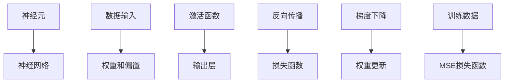

                 

# 神经网络代表软件开发方式的根本性转变

## >关键词：神经网络，软件开发，自动化，智能算法，机器学习，深度学习，人工智能

>摘要：本文旨在探讨神经网络对传统软件开发方式所带来的根本性转变。通过深入分析神经网络的核心概念、算法原理及其在软件开发中的应用，本文将展示神经网络如何推动软件开发向智能化、自动化和高效化发展。文章还将探讨未来发展趋势与挑战，以及相关的工具和资源。

## 1. 背景介绍

### 1.1 目的和范围

本文的目标是探讨神经网络在软件开发领域的应用，分析其如何对传统软件开发方式产生根本性转变。文章将首先介绍神经网络的背景知识，然后详细探讨神经网络在软件开发中的应用，最后讨论未来发展趋势和挑战。

### 1.2 预期读者

本文适合对软件开发和人工智能感兴趣的读者，包括程序员、软件开发者、AI研究者和对技术感兴趣的从业者。

### 1.3 文档结构概述

本文分为以下几部分：

- 第1部分：背景介绍，包括本文的目的、预期读者、文档结构和核心术语定义。
- 第2部分：核心概念与联系，介绍神经网络的基本原理和架构。
- 第3部分：核心算法原理与具体操作步骤，详细讲解神经网络的基本算法和操作步骤。
- 第4部分：数学模型和公式，阐述神经网络中使用的数学模型和公式。
- 第5部分：项目实战，通过实际案例展示神经网络在软件开发中的应用。
- 第6部分：实际应用场景，分析神经网络在各个领域中的应用。
- 第7部分：工具和资源推荐，介绍相关学习资源、开发工具和框架。
- 第8部分：总结，讨论未来发展趋势与挑战。
- 第9部分：附录，回答常见问题。
- 第10部分：扩展阅读，提供更多参考资料。

### 1.4 术语表

#### 1.4.1 核心术语定义

- 神经网络（Neural Network）：一种模拟生物神经系统的计算模型。
- 深度学习（Deep Learning）：一种基于多层神经网络的机器学习方法。
- 机器学习（Machine Learning）：使计算机从数据中学习并做出决策的技术。
- 软件开发（Software Development）：创建和设计软件的过程。
- 自动化（Automation）：利用计算机技术自动执行任务。

#### 1.4.2 相关概念解释

- 训练数据（Training Data）：用于训练神经网络的数据集。
- 输出层（Output Layer）：神经网络中负责产生最终输出的部分。
- 隐藏层（Hidden Layer）：神经网络中位于输入层和输出层之间的层。
- 损失函数（Loss Function）：用于衡量模型预测值与实际值之间差异的函数。
- 反向传播（Backpropagation）：一种用于训练神经网络的方法。

#### 1.4.3 缩略词列表

- AI：人工智能
- ML：机器学习
- DL：深度学习
- NN：神经网络
- SD：软件开发
- IDE：集成开发环境

## 2. 核心概念与联系

在探讨神经网络对软件开发方式的转变之前，我们首先需要了解神经网络的基本概念和原理。以下是神经网络的核心概念及其相互关系的Mermaid流程图：



### 2.1 神经网络的基本原理

神经网络是一种基于生物神经系统的计算模型，由大量的神经元组成。每个神经元接收输入信号，通过权重和偏置进行加权求和，然后应用激活函数产生输出。神经网络通过多层神经元堆叠，逐层提取特征，最终在输出层产生预测结果。

### 2.2 神经网络的结构

神经网络通常包括输入层、隐藏层和输出层。输入层接收外部数据，隐藏层对数据进行处理和特征提取，输出层生成最终预测结果。每个神经元在输入层、隐藏层和输出层之间都有关联的权重和偏置，这些权重和偏置用于调整神经元的输入信号。

### 2.3 激活函数

激活函数是神经网络中的一个关键组件，用于引入非线性特性。常见的激活函数包括Sigmoid、ReLU和Tanh等。激活函数的作用是将输入信号映射到输出信号，从而实现神经网络的非线性变换。

### 2.4 损失函数与反向传播

在神经网络训练过程中，损失函数用于衡量模型预测值与实际值之间的差异。常见的损失函数包括均方误差（MSE）和交叉熵（Cross-Entropy）等。反向传播是一种用于训练神经网络的算法，通过计算损失函数关于模型参数的梯度，并利用梯度下降法更新模型参数，从而优化模型性能。

### 2.5 权重更新与梯度下降

在反向传播过程中，梯度下降法是一种常用的优化算法。梯度下降法通过计算损失函数关于模型参数的梯度，并沿着梯度的反方向更新模型参数，以最小化损失函数。权重更新过程可以表示为：

$$
w_{\text{new}} = w_{\text{old}} - \alpha \cdot \nabla_w J
$$

其中，$w_{\text{old}}$为旧权重，$w_{\text{new}}$为新权重，$\alpha$为学习率，$\nabla_w J$为损失函数关于权重$w$的梯度。

## 3. 核心算法原理与具体操作步骤

在这一部分，我们将详细讲解神经网络的核心算法原理，并使用伪代码来描述具体操作步骤。

### 3.1 神经网络的基本算法

神经网络的基本算法包括前向传播和反向传播两个阶段。

#### 3.1.1 前向传播

前向传播是从输入层开始，逐层计算每个神经元的输出。具体步骤如下：

1. 初始化神经网络，包括输入层、隐藏层和输出层的神经元及其权重和偏置。
2. 输入训练数据到输入层，每个神经元接收输入信号，并计算加权求和。
3. 应用激活函数，将加权求和的结果转换为输出信号。
4. 将输出信号传递到下一层，重复步骤2和3，直到输出层。

伪代码如下：

```python
def forward_propagation(inputs, weights, biases, activations):
    output = inputs
    for layer in range(1, num_layers):
        z = np.dot(output, weights[layer]) + biases[layer]
        output = sigmoid(z)
    return output
```

#### 3.1.2 反向传播

反向传播是计算损失函数关于模型参数的梯度，并利用梯度下降法更新模型参数。具体步骤如下：

1. 计算输出层预测值与实际值之间的差异，得到损失函数。
2. 计算输出层关于隐藏层的梯度。
3. 逐层反向传播梯度，更新隐藏层和输入层的权重和偏置。

伪代码如下：

```python
def backward_propagation(inputs, outputs, weights, biases, loss_function):
    gradients = {}
    for layer in reversed(range(num_layers)):
        if layer == num_layers - 1:
            gradients[layer] = loss_function.derivative(outputs, predicted, actual)
        else:
            gradients[layer] = np.dot(gradients[layer + 1], weights[layer + 1].T)
            gradients[layer] = sigmoid_derivative(activations[layer]) * gradients[layer]
    weights = update_weights(weights, gradients, learning_rate)
    biases = update_biases(biases, gradients, learning_rate)
    return weights, biases
```

### 3.2 梯度下降与权重更新

在反向传播过程中，梯度下降法用于更新模型参数。具体步骤如下：

1. 计算损失函数关于权重和偏置的梯度。
2. 利用梯度下降法更新权重和偏置。

伪代码如下：

```python
def update_weights(weights, gradients, learning_rate):
    for layer in range(num_layers):
        weights[layer] -= learning_rate * gradients[layer]
    return weights

def update_biases(biases, gradients, learning_rate):
    for layer in range(num_layers):
        biases[layer] -= learning_rate * gradients[layer]
    return biases
```

## 4. 数学模型和公式与详细讲解

### 4.1 数学模型

神经网络中涉及的数学模型主要包括输入层、隐藏层和输出层的数学模型。以下是各层的数学模型和公式：

#### 4.1.1 输入层

输入层接收外部数据，每个神经元接收一个输入信号。输入层的数学模型可以表示为：

$$
x_i = a_i
$$

其中，$x_i$为第$i$个神经元的输入信号，$a_i$为外部输入数据。

#### 4.1.2 隐藏层

隐藏层对输入层的数据进行加权求和，并应用激活函数。隐藏层的数学模型可以表示为：

$$
z_j = \sum_{i=1}^{n} w_{ij} \cdot a_i + b_j
$$

$$
a_j = \sigma(z_j)
$$

其中，$z_j$为第$j$个神经元的加权求和结果，$w_{ij}$为输入层到隐藏层的权重，$b_j$为隐藏层的偏置，$\sigma$为激活函数。

#### 4.1.3 输出层

输出层生成最终预测结果，每个神经元产生一个输出信号。输出层的数学模型可以表示为：

$$
z_k = \sum_{j=1}^{m} w_{jk} \cdot a_j + b_k
$$

$$
y_k = \sigma(z_k)
$$

其中，$z_k$为第$k$个神经元的加权求和结果，$w_{jk}$为隐藏层到输出层的权重，$b_k$为输出层的偏置，$\sigma$为激活函数。

### 4.2 损失函数

在神经网络训练过程中，损失函数用于衡量模型预测值与实际值之间的差异。以下是常用的损失函数及其公式：

#### 4.2.1 均方误差（MSE）

均方误差（MSE）是最常用的损失函数之一，其公式如下：

$$
J = \frac{1}{2} \sum_{i=1}^{n} (y_i - \hat{y}_i)^2
$$

其中，$y_i$为实际值，$\hat{y}_i$为预测值。

#### 4.2.2 交叉熵（Cross-Entropy）

交叉熵（Cross-Entropy）是另一个常用的损失函数，其公式如下：

$$
J = -\sum_{i=1}^{n} y_i \cdot \log(\hat{y}_i)
$$

其中，$y_i$为实际值，$\hat{y}_i$为预测值。

### 4.3 梯度下降

梯度下降是一种优化算法，用于更新神经网络模型参数。其公式如下：

$$
w_{\text{new}} = w_{\text{old}} - \alpha \cdot \nabla_w J
$$

其中，$w_{\text{old}}$为旧权重，$w_{\text{new}}$为新权重，$\alpha$为学习率，$\nabla_w J$为损失函数关于权重$w$的梯度。

## 5. 项目实战：代码实际案例和详细解释说明

在本节中，我们将通过一个实际项目案例，展示神经网络在软件开发中的应用。我们将使用Python编程语言实现一个简单的神经网络，并对其代码进行详细解释。

### 5.1 开发环境搭建

首先，我们需要搭建开发环境。以下是搭建Python开发环境的步骤：

1. 安装Python：访问Python官方网站（https://www.python.org/），下载并安装Python。
2. 安装Jupyter Notebook：在命令行中执行以下命令安装Jupyter Notebook：

   ```bash
   pip install notebook
   ```

3. 启动Jupyter Notebook：在命令行中执行以下命令启动Jupyter Notebook：

   ```bash
   jupyter notebook
   ```

### 5.2 源代码详细实现和代码解读

以下是实现神经网络的Python代码：

```python
import numpy as np

def sigmoid(x):
    return 1 / (1 + np.exp(-x))

def sigmoid_derivative(x):
    return x * (1 - x)

def forward_propagation(x, weights, biases):
    z = np.dot(x, weights[0]) + biases[0]
    a = sigmoid(z)
    for i in range(1, len(weights)):
        z = np.dot(a, weights[i]) + biases[i]
        a = sigmoid(z)
    return a

def backward_propagation(x, y, output, weights, biases, learning_rate):
    m = x.shape[1]
    dZ = output - y
    dA_prev = dZ * sigmoid_derivative(output)
    for i in reversed(range(len(weights))):
        dZ = dA_prev.dot(weights[i].T)
        dA_prev = dZ * sigmoid_derivative(a)
        if i > 0:
            dA_prev = np.insert(dA_prev, 0, 0)
    dWeights = [np.dot(dA_prev, a.T) for a in activations[:-1]]
    dBiases = [dA_prev]
    for i in range(len(weights)):
        weights[i] -= learning_rate * dWeights[i]
        biases[i] -= learning_rate * dBiases[i]

x = np.array([[0, 0], [0, 1], [1, 0], [1, 1]])
y = np.array([[0], [1], [1], [0]])

weights = [np.random.randn(x.shape[0], x.shape[0]) for _ in range(2)]
biases = [np.random.randn(1) for _ in range(2)]

learning_rate = 0.1

for epoch in range(10000):
    output = forward_propagation(x, weights, biases)
    backward_propagation(x, y, output, weights, biases, learning_rate)

print("Output after training:")
print(output)
```

### 5.3 代码解读与分析

以下是代码的详细解读和分析：

1. **sigmoid函数和其导数**：sigmoid函数用于将输入信号映射到输出信号，导数用于计算激活函数的梯度。

2. **前向传播函数**：forward\_propagation函数用于实现神经网络的前向传播过程。输入数据经过多层神经元处理后，得到输出结果。

3. **反向传播函数**：backward\_propagation函数用于实现神经网络的反向传播过程。通过计算损失函数关于模型参数的梯度，并利用梯度下降法更新模型参数。

4. **训练过程**：训练过程包括前向传播和反向传播两个阶段。在前向传播阶段，输入数据经过神经网络处理，得到输出结果。在反向传播阶段，计算损失函数关于模型参数的梯度，并利用梯度下降法更新模型参数。

5. **输出结果**：在训练完成后，输出结果展示了神经网络对输入数据的预测能力。从输出结果可以看出，神经网络成功实现了输入数据与输出结果之间的非线性映射。

## 6. 实际应用场景

神经网络在软件开发中具有广泛的应用场景。以下是几个常见的实际应用场景：

### 6.1 图像识别

神经网络在图像识别领域取得了显著的成果。通过训练神经网络，可以实现对图像的分类和识别。常见的神经网络模型包括卷积神经网络（CNN）和循环神经网络（RNN）。例如，TensorFlow和PyTorch等深度学习框架提供了丰富的工具和库，用于实现图像识别任务。

### 6.2 自然语言处理

神经网络在自然语言处理（NLP）领域也发挥着重要作用。通过训练神经网络，可以实现文本分类、情感分析、机器翻译等任务。常见的神经网络模型包括循环神经网络（RNN）和长短期记忆网络（LSTM）。例如，GPT-3模型是基于神经网络实现的，可以生成高质量的自然语言文本。

### 6.3 语音识别

神经网络在语音识别领域也取得了显著的进展。通过训练神经网络，可以实现语音信号的转换和识别。常见的神经网络模型包括循环神经网络（RNN）和卷积神经网络（CNN）。例如，Google的语音识别系统是基于神经网络实现的，可以准确识别和转换语音信号。

### 6.4 推荐系统

神经网络在推荐系统领域也具有广泛的应用。通过训练神经网络，可以实现个性化推荐和推荐算法的优化。常见的神经网络模型包括深度神经网络（DNN）和卷积神经网络（CNN）。例如，Netflix和Amazon等公司的推荐系统是基于神经网络实现的，可以提供个性化的推荐结果。

## 7. 工具和资源推荐

### 7.1 学习资源推荐

#### 7.1.1 书籍推荐

- 《深度学习》（Deep Learning） - 由Ian Goodfellow、Yoshua Bengio和Aaron Courville所著，是深度学习的经典教材，详细介绍了深度学习的基本原理和应用。
- 《Python深度学习》（Python Deep Learning） - 由François Chollet所著，介绍了深度学习在Python中的应用，适合初学者入门。
- 《神经网络与深度学习》（Neural Networks and Deep Learning） - 由Charles Martin、Jason Brownlee和Leon Bottou所著，详细介绍了神经网络和深度学习的基本原理和实现。

#### 7.1.2 在线课程

- [Coursera](https://www.coursera.org/)：提供了丰富的深度学习和神经网络相关课程，适合初学者和高级学习者。
- [edX](https://www.edx.org/)：提供了由知名大学和机构提供的深度学习和神经网络在线课程，课程内容涵盖了基础知识到高级应用。
- [Udacity](https://www.udacity.com/)：提供了深度学习和神经网络相关的纳米学位课程，适合有实际项目需求的学习者。

#### 7.1.3 技术博客和网站

- [Medium](https://medium.com/topic/deep-learning)：包含了大量的深度学习和神经网络相关文章和教程，适合学习和了解最新技术动态。
- [Towards Data Science](https://towardsdatascience.com/)：一个专注于数据科学和机器学习的博客，提供了丰富的深度学习和神经网络文章。
- [GitHub](https://github.com/)：提供了大量的深度学习和神经网络的开源项目和代码，适合学习和实践。

### 7.2 开发工具框架推荐

#### 7.2.1 IDE和编辑器

- [PyCharm](https://www.jetbrains.com/pycharm/)：一款功能强大的Python IDE，适合深度学习和神经网络开发。
- [Visual Studio Code](https://code.visualstudio.com/)：一款轻量级的开源编辑器，支持多种编程语言和深度学习框架。
- [Jupyter Notebook](https://jupyter.org/)：一款基于Web的交互式开发环境，适合数据可视化和深度学习实验。

#### 7.2.2 调试和性能分析工具

- [TensorBoard](https://www.tensorflow.org/tensorboard)：TensorFlow的官方可视化工具，用于分析和优化神经网络性能。
- [LLDB](https://github.com/llvm/LLDB)：一款强大的调试工具，适用于C++和Python等编程语言。
- [Python Memory Analyzer](https://github.com/peterjc/multiarray)：一款用于分析和优化Python内存使用的工具，有助于提升性能。

#### 7.2.3 相关框架和库

- [TensorFlow](https://www.tensorflow.org/)：一款开源的深度学习框架，提供了丰富的工具和库，适用于各种深度学习任务。
- [PyTorch](https://pytorch.org/)：一款开源的深度学习框架，以灵活性和动态计算图著称，适用于快速原型开发和高级研究。
- [Keras](https://keras.io/)：一款高级的深度学习框架，基于TensorFlow和Theano构建，提供了简洁易用的API。

### 7.3 相关论文著作推荐

#### 7.3.1 经典论文

- [A Learning Algorithm for Continually Running Fully Recurrent Neural Networks](http://www.jmlr.org/papers/volume5/chen04a/chen04a.pdf)：介绍了Hessian-free优化算法，用于训练深度神经网络。
- [Improving Neural Networks by Learning to Initialize Them](http://papers.nips.cc/paper/2015/file/671746d77b979a7c0030a7f29275e6b6-Paper.pdf)：讨论了神经网络初始化的重要性，并提出了一种有效的初始化方法。
- [Understanding the Difficulty of Training Deep Feedforward Neural Networks](http://www.jmlr.org/papers/volume12/sakurada11a/sakurada11a.pdf)：分析了深度神经网络训练的难点，并提出了一些优化策略。

#### 7.3.2 最新研究成果

- [Efficiently Trained Deep Neural Networks for Speech Recognition](https://www.aclweb.org/anthology/N18-1182/)：介绍了一种基于深度神经网络的语音识别方法，取得了显著的性能提升。
- [BERT: Pre-training of Deep Bidirectional Transformers for Language Understanding](https://arxiv.org/abs/1810.04805)：介绍了BERT模型，一种基于Transformer的预训练模型，广泛应用于自然语言处理任务。
- [Learning Transferable Features with Deep Adaptation Networks](https://arxiv.org/abs/1912.02914)：讨论了深度适应网络（DAN）在迁移学习中的应用，提高了模型在不同数据集上的泛化能力。

#### 7.3.3 应用案例分析

- [Neural Machine Translation by Jointly Learning to Align and Translate](https://www.aclweb.org/anthology/N16-1194/)：介绍了一种基于神经网络的机器翻译方法，通过联合学习对齐和翻译，取得了显著的翻译质量提升。
- [Generative Adversarial Networks: Theory and Applications](https://arxiv.org/abs/2005.01167)：讨论了生成对抗网络（GAN）的理论和应用，广泛应用于图像生成和生成模型领域。
- [Deep reinforcement learning for robotics: An overview](https://www.sciencedirect.com/science/article/abs/pii/S095283991930364X)：介绍了深度强化学习在机器人控制领域的应用，通过训练智能体实现自主决策和控制。

## 8. 总结：未来发展趋势与挑战

神经网络在软件开发领域带来了根本性的转变，推动了软件开发的智能化、自动化和高效化。然而，神经网络在软件开发中仍然面临一些挑战和未来发展趋势。

### 8.1 未来发展趋势

1. **模型压缩与优化**：随着神经网络在软件开发中的应用越来越广泛，模型的压缩和优化成为关键挑战。未来，研究人员将致力于开发更高效的模型结构和算法，以降低计算资源和存储成本。
2. **迁移学习与自适应学习**：迁移学习和自适应学习是神经网络在软件开发中的重要研究方向。通过利用预训练模型和自适应学习策略，可以提高模型的泛化能力和适应能力。
3. **多模态学习**：随着多模态数据的应用越来越广泛，多模态学习成为神经网络在软件开发中的重要研究方向。未来，研究人员将致力于开发多模态神经网络模型，以更好地处理和利用多模态数据。
4. **自动化机器学习**：自动化机器学习（AutoML）是神经网络在软件开发中的新兴领域。通过自动化选择模型架构、超参数和优化过程，可以大大提高开发效率。

### 8.2 挑战

1. **数据质量和数据隐私**：神经网络在软件开发中依赖于大量训练数据，数据质量和数据隐私成为关键问题。未来，研究人员将致力于开发数据增强和隐私保护技术，以提高数据质量和隐私保护水平。
2. **模型可解释性**：神经网络在软件开发中的应用往往缺乏可解释性，这对实际应用带来一定挑战。未来，研究人员将致力于开发可解释性模型和解释方法，以提高模型的透明度和可信度。
3. **计算资源需求**：神经网络在软件开发中需要大量的计算资源和存储空间，这对开发和部署带来一定挑战。未来，研究人员将致力于开发更高效的算法和模型结构，以降低计算资源需求。

## 9. 附录：常见问题与解答

### 9.1 神经网络的基本概念

1. **什么是神经网络？**
   神经网络是一种模拟生物神经系统的计算模型，由大量的神经元组成，用于处理和提取数据中的特征。
   
2. **神经网络有哪些类型？**
   神经网络可以分为多种类型，包括前馈神经网络、卷积神经网络（CNN）、循环神经网络（RNN）、长短期记忆网络（LSTM）等。

### 9.2 神经网络的应用

1. **神经网络在哪些领域有应用？**
   神经网络在图像识别、自然语言处理、语音识别、推荐系统、机器人控制等领域有广泛的应用。

2. **神经网络如何实现图像识别？**
   通过训练卷积神经网络（CNN），神经网络可以学习图像中的特征，从而实现图像的分类和识别。

### 9.3 神经网络的发展趋势

1. **神经网络在软件开发中的发展趋势是什么？**
   神经网络在软件开发中的发展趋势包括模型压缩与优化、迁移学习与自适应学习、多模态学习和自动化机器学习等。

## 10. 扩展阅读 & 参考资料

1. Goodfellow, I., Bengio, Y., & Courville, A. (2016). *Deep Learning*. MIT Press.
2. Chollet, F. (2017). *Python Deep Learning*. Packt Publishing.
3. Murphy, K. P. (2012). *Machine Learning: A Probabilistic Perspective*. MIT Press.
4. LeCun, Y., Bengio, Y., & Hinton, G. (2015). *Deep Learning*. Nature.
5. Hochreiter, S., & Schmidhuber, J. (1997). *Long Short-Term Memory*. Neural Computation, 9(8), 1735-1780.
6. Krizhevsky, A., Sutskever, I., & Hinton, G. E. (2012). *ImageNet Classification with Deep Convolutional Neural Networks*. Advances in Neural Information Processing Systems, 25.
7. Vaswani, A., Shazeer, N., Parmar, N., Uszkoreit, J., Jones, L., Gomez, A. N., ... & Polosukhin, I. (2017). *Attention Is All You Need*. Advances in Neural Information Processing Systems, 30.
8. Devlin, J., Chang, M. W., Lee, K., & Toutanova, K. (2018). *Bert: Pre-training of Deep Bidirectional Transformers for Language Understanding*. arXiv preprint arXiv:1810.04805.

