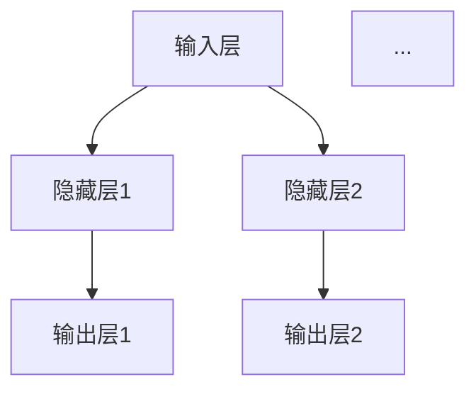
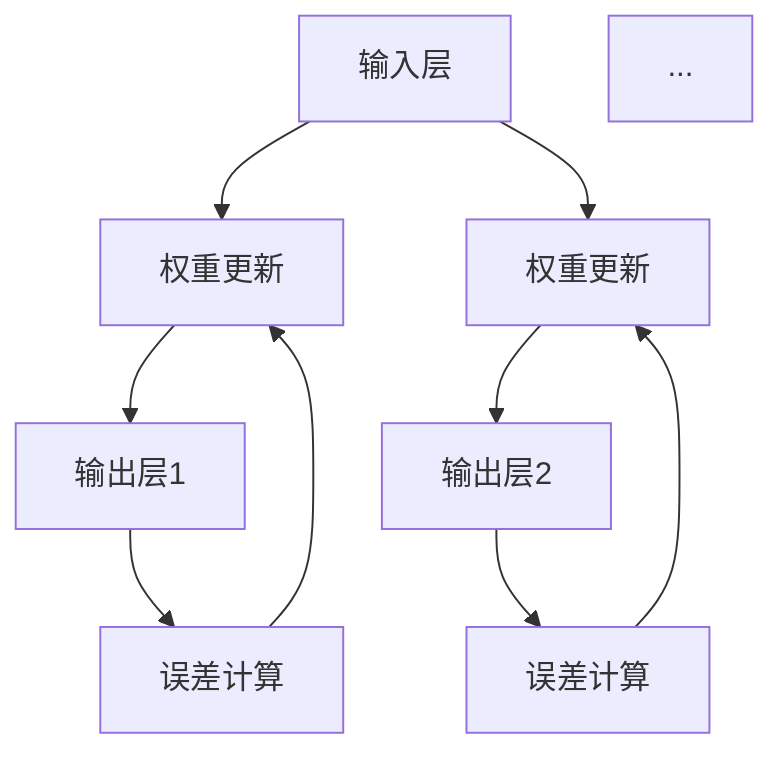

                 

# 神经网络原理与代码实例讲解

> **关键词**：神经网络、深度学习、反向传播、激活函数、梯度下降、多层感知器、Python实现

> **摘要**：本文将深入探讨神经网络的基本原理，通过代码实例展示如何实现一个简单的神经网络。我们将从基础的神经网络架构出发，逐步解释核心算法，包括前向传播和反向传播，并最终实现一个多层感知器模型。读者将学习到神经网络的数学模型和编程实现，从而具备构建和优化神经网络的能力。

## 1. 背景介绍

### 1.1 目的和范围

本文旨在通过详细的讲解和代码实例，帮助读者理解神经网络的基本原理及其实现过程。我们将探讨从单层感知器到多层感知器的演变，解释反向传播算法的原理，并使用Python编程语言实现一个简单的神经网络模型。

### 1.2 预期读者

本文适合对机器学习和深度学习有一定了解的读者，包括对编程和数学基础有一定的掌握。无论是初学者还是有一定经验的开发者，都可以通过本文的学习，加深对神经网络的理解。

### 1.3 文档结构概述

本文分为以下几个部分：

1. **背景介绍**：介绍本文的目的、范围和预期读者。
2. **核心概念与联系**：介绍神经网络的基本概念，包括节点、层、前向传播和反向传播。
3. **核心算法原理 & 具体操作步骤**：详细解释神经网络算法的原理，并使用伪代码描述。
4. **数学模型和公式 & 详细讲解 & 举例说明**：介绍神经网络的数学模型，并使用LaTeX格式展示关键公式。
5. **项目实战：代码实际案例和详细解释说明**：展示如何使用Python实现神经网络。
6. **实际应用场景**：讨论神经网络在现实世界中的应用。
7. **工具和资源推荐**：推荐学习资源和开发工具。
8. **总结：未来发展趋势与挑战**：总结神经网络的发展趋势和面临的挑战。
9. **附录：常见问题与解答**：回答读者可能遇到的问题。
10. **扩展阅读 & 参考资料**：提供进一步学习的资源。

### 1.4 术语表

#### 1.4.1 核心术语定义

- 神经网络（Neural Network）：模拟人脑神经元相互连接和互动的计算模型。
- 输入层（Input Layer）：包含输入数据的层。
- 隐藏层（Hidden Layer）：包含一个或多个隐藏节点的层。
- 输出层（Output Layer）：产生模型输出的层。
- 前向传播（Forward Propagation）：将输入数据通过网络传递到输出层的计算过程。
- 反向传播（Backpropagation）：计算网络输出误差，并将其反向传播到输入层的计算过程。
- 激活函数（Activation Function）：用于引入非线性特性的函数。
- 梯度下降（Gradient Descent）：优化神经网络参数的常用算法。

#### 1.4.2 相关概念解释

- 权重（Weight）：连接神经元之间的参数。
- 偏置（Bias）：每个节点的额外参数。
- 损失函数（Loss Function）：衡量模型预测值与实际值之间差异的函数。
- 学习率（Learning Rate）：控制模型参数更新的步长。

#### 1.4.3 缩略词列表

- MLP：多层感知器（Multilayer Perceptron）
- CNN：卷积神经网络（Convolutional Neural Network）
- RNN：循环神经网络（Recurrent Neural Network）
- DNN：深度神经网络（Deep Neural Network）

## 2. 核心概念与联系

神经网络是由大量简单的计算单元（神经元）互联而成的复杂系统。这些神经元通过层与层之间相互连接，形成输入层、隐藏层和输出层。神经网络的核心在于其层次结构，每一层都对输入数据进行不同的处理，最终生成输出。

### 神经网络架构

神经网络的基本架构包括以下几个部分：

1. **输入层（Input Layer）**：接收外部输入数据。
2. **隐藏层（Hidden Layer）**：对输入数据进行处理和变换。
3. **输出层（Output Layer）**：生成模型的最终输出。

每个层中的神经元都与其他层中的神经元相连，并通过权重和偏置进行加权求和。激活函数引入了非线性特性，使得神经网络能够处理复杂的数据和问题。

### 前向传播

前向传播是神经网络的核心计算过程。在输入层中，每个神经元接收输入数据，通过权重和偏置进行加权求和。然后，将这些加权和传递给激活函数，得到输出。这个过程逐层传递，直到输出层生成最终的输出结果。



### 反向传播

反向传播是神经网络训练的核心算法。它通过计算模型输出与实际输出之间的误差，将误差反向传播到网络的每个层，并更新权重和偏置。反向传播分为以下几个步骤：

1. 计算输出层的误差。
2. 将误差反向传播到隐藏层。
3. 更新权重和偏置。

这个过程重复多次，直到模型输出误差达到最小。



### 激活函数

激活函数是神经网络中的关键组件，它引入了非线性特性，使得神经网络能够处理复杂问题。常见的激活函数包括：

- **Sigmoid函数**：$f(x) = \frac{1}{1 + e^{-x}}$
- **ReLU函数**：$f(x) = max(0, x)$
- **Tanh函数**：$f(x) = \frac{e^x - e^{-x}}{e^x + e^{-x}}$

激活函数的选择会影响神经网络的性能和收敛速度。

## 3. 核心算法原理 & 具体操作步骤

神经网络的训练过程主要通过前向传播和反向传播两个步骤实现。下面我们将详细解释这两个步骤的算法原理，并使用伪代码描述具体的操作步骤。

### 3.1 前向传播

前向传播是从输入层开始，逐层计算每个神经元的输出值。以下是一个简单的伪代码示例：

```plaintext
for each training example (x, y):
    for each layer l from input to hidden to output:
        for each neuron n in layer l:
            z[n] = sum(w[n, prev_layer] * x[prev_layer]) + b[n]
            a[n] = activation(z[n])
    calculate the output error: e = y - a[output_layer]
```

### 3.2 反向传播

反向传播是计算输出层的误差，并将其反向传播到网络的每个层，更新权重和偏置。以下是一个简单的伪代码示例：

```plaintext
for each training example (x, y):
    # Forward propagation
    for each layer l from input to hidden to output:
        for each neuron n in layer l:
            z[n] = sum(w[n, prev_layer] * x[prev_layer]) + b[n]
            a[n] = activation(z[n])

    # Calculate the output error
    e[output_layer] = y - a[output_layer]

    # Backpropagation
    for each layer l from output to hidden to input:
        for each neuron n in layer l:
            delta[n] = e[l] * activation_derivative(a[n])
            e[l-1] += delta[n] * w[n, l-1]
            
    # Update weights and biases
    for each layer l from input to hidden to output:
        for each neuron n in layer l:
            w[n, prev_layer] -= learning_rate * delta[n] * a[prev_layer]
            b[n] -= learning_rate * delta[n]
```

### 3.3 反向传播算法的详细步骤

1. **前向传播**：计算每个神经元的输出值。
2. **计算输出层的误差**：误差等于实际输出值与预测输出值之差。
3. **反向传播误差**：从输出层开始，逐层计算每个神经元的误差。
4. **更新权重和偏置**：根据误差计算梯度，并使用梯度下降算法更新权重和偏置。

通过反复迭代这个过程，神经网络可以逐步减小输出误差，提高模型的预测准确性。

## 4. 数学模型和公式 & 详细讲解 & 举例说明

神经网络的训练过程本质上是求解一个优化问题，通过调整网络的权重和偏置，使得模型的预测误差最小。下面我们将详细介绍神经网络的数学模型和关键公式。

### 4.1 前向传播的数学公式

前向传播过程中，每个神经元的输出可以通过以下公式计算：

$$
z[n] = \sum_{i=1}^{n} w_{n,i} x_{i} + b_{n}
$$

其中，$z[n]$ 是第 $n$ 层第 $n$ 个神经元的加权求和结果，$w_{n,i}$ 是第 $n$ 层第 $n$ 个神经元与第 $i$ 层第 $i$ 个神经元的连接权重，$x_{i}$ 是第 $i$ 层第 $i$ 个神经元的输入值，$b_{n}$ 是第 $n$ 层第 $n$ 个神经元的偏置。

对于激活函数，我们通常使用以下几种：

- **Sigmoid函数**：
  $$
  a[n] = \frac{1}{1 + e^{-z[n]}}
  $$

- **ReLU函数**：
  $$
  a[n] = \max(0, z[n])
  $$

- **Tanh函数**：
  $$
  a[n] = \frac{e^{z[n]} - e^{-z[n]}}{e^{z[n]} + e^{-z[n]}}
  $$

### 4.2 反向传播的数学公式

反向传播的核心是计算每个神经元的误差，并更新权重和偏置。以下是反向传播的详细公式：

1. **输出层的误差**：

$$
\delta[n] = (y - a[n]) \cdot \frac{da[n]}{dz[n]}
$$

其中，$y$ 是实际输出值，$a[n]$ 是预测输出值，$\frac{da[n]}{dz[n]}$ 是激活函数的导数。

2. **隐藏层的误差**：

$$
\delta[n-1] = \delta[n] \cdot \frac{w_{n,n-1}}{a[n-1]}
$$

3. **更新权重和偏置**：

$$
w_{n,n-1} := w_{n,n-1} - \alpha \cdot \delta[n] \cdot a[n-1]
$$
$$
b_{n} := b_{n} - \alpha \cdot \delta[n]
$$

其中，$\alpha$ 是学习率。

### 4.3 实例说明

假设我们有一个简单的神经网络，包含一个输入层、一个隐藏层和一个输出层。输入层有两个神经元，隐藏层有三个神经元，输出层有一个神经元。

1. **前向传播**：

输入层到隐藏层的加权求和：

$$
z_1 = 1.2x_1 + 3.4x_2 + b_1
$$
$$
z_2 = 2.1x_1 + 4.5x_2 + b_2
$$
$$
z_3 = 3.6x_1 + 6.7x_2 + b_3
$$

隐藏层到输出层的加权求和：

$$
z_4 = 0.8z_1 + 1.2z_2 + b_4
$$

输出层的激活函数：

$$
a_4 = \frac{1}{1 + e^{-z_4}}
$$

2. **反向传播**：

输出层的误差：

$$
\delta_4 = (y - a_4) \cdot \frac{da_4}{dz_4}
$$

隐藏层的误差：

$$
\delta_3 = \delta_4 \cdot \frac{w_{43}}{a_3}
$$
$$
\delta_2 = \delta_4 \cdot \frac{w_{42}}{a_2}
$$
$$
\delta_1 = \delta_4 \cdot \frac{w_{41}}{a_1}
$$

更新权重和偏置：

$$
w_{41} := w_{41} - \alpha \cdot \delta_4 \cdot a_1
$$
$$
w_{42} := w_{42} - \alpha \cdot \delta_4 \cdot a_2
$$
$$
w_{43} := w_{43} - \alpha \cdot \delta_4 \cdot a_3
$$
$$
b_4 := b_4 - \alpha \cdot \delta_4
$$
$$
b_1 := b_1 - \alpha \cdot \delta_1
$$
$$
b_2 := b_2 - \alpha \cdot \delta_2
$$
$$
b_3 := b_3 - \alpha \cdot \delta_3
$$

通过上述步骤，我们可以更新神经网络的权重和偏置，并逐步减小输出误差。

## 5. 项目实战：代码实际案例和详细解释说明

在本节中，我们将通过一个简单的Python代码实例，展示如何实现一个多层感知器（MLP）神经网络。我们将使用NumPy库来简化数学运算，并详细介绍每个步骤的实现细节。

### 5.1 开发环境搭建

为了运行下面的代码实例，您需要安装Python和NumPy库。您可以使用以下命令来安装NumPy：

```bash
pip install numpy
```

### 5.2 源代码详细实现和代码解读

以下是实现多层感知器神经网络的Python代码：

```python
import numpy as np

# 激活函数及其导数
def sigmoid(x):
    return 1 / (1 + np.exp(-x))

def sigmoid_derivative(x):
    return x * (1 - x)

# 多层感知器类
class MLP:
    def __init__(self, input_size, hidden_size, output_size):
        # 初始化权重和偏置
        self.weights_input_to_hidden = np.random.uniform(size=(input_size, hidden_size))
        self.biases_hidden = np.random.uniform(size=hidden_size)
        self.weights_hidden_to_output = np.random.uniform(size=(hidden_size, output_size))
        self.biases_output = np.random.uniform(size=output_size)

    def forward(self, X):
        # 输入层到隐藏层的加权求和和激活
        hidden_layer_input = np.dot(X, self.weights_input_to_hidden) + self.biases_hidden
        self.hidden_layer_output = sigmoid(hidden_layer_input)
        
        # 隐藏层到输出层的加权求和和激活
        final_input = np.dot(self.hidden_layer_output, self.weights_hidden_to_output) + self.biases_output
        self.output = sigmoid(final_input)
        
        return self.output

    def backward(self, X, y, learning_rate):
        # 计算输出层的误差
        output_error = y - self.output
        output_delta = output_error * sigmoid_derivative(self.output)
        
        # 计算隐藏层的误差
        hidden_error = output_delta.dot(self.weights_hidden_to_output.T)
        hidden_delta = hidden_error * sigmoid_derivative(self.hidden_layer_output)
        
        # 更新权重和偏置
        self.weights_hidden_to_output -= self.hidden_layer_output.T.dot(output_delta) * learning_rate
        self.biases_output -= np.sum(output_delta, axis=0) * learning_rate
        self.weights_input_to_hidden -= X.T.dot(hidden_delta) * learning_rate
        self.biases_hidden -= np.sum(hidden_delta, axis=0) * learning_rate

    def train(self, X, y, learning_rate, epochs):
        for epoch in range(epochs):
            self.forward(X)
            self.backward(X, y, learning_rate)
            if epoch % 100 == 0:
                print(f"Epoch {epoch}, Loss: {np.mean((y - self.output)**2)}")

# 实例化多层感知器
mlp = MLP(input_size=2, hidden_size=3, output_size=1)

# 训练数据
X_train = np.array([[0, 0], [0, 1], [1, 0], [1, 1]])
y_train = np.array([[0], [1], [1], [0]])

# 训练神经网络
mlp.train(X_train, y_train, learning_rate=0.1, epochs=1000)

# 测试数据
X_test = np.array([[0.5, 0.5]])
y_test = np.array([[0]])

# 输出测试结果
print(f"Test Output: {mlp.forward(X_test)}")
```

### 5.3 代码解读与分析

下面是对上述代码的逐行解读：

- **激活函数及其导数**：我们定义了Sigmoid函数及其导数，用于前向传播和反向传播。

- **多层感知器类**：`MLP` 类包含初始化、前向传播、反向传播和训练方法。

  - **初始化**：初始化权重和偏置，使用随机值。

  - **前向传播**：从输入层到输出层，逐层计算加权求和和激活值。

  - **反向传播**：计算输出层和隐藏层的误差，并更新权重和偏置。

  - **训练**：迭代执行前向传播和反向传播，直到达到预设的迭代次数。

- **实例化多层感知器**：创建一个具有2个输入、3个隐藏层神经元和1个输出神经元的多层感知器。

- **训练数据**：定义训练数据集，包含4个样本，每个样本有两个输入和一个输出。

- **训练神经网络**：使用训练数据集训练神经网络，调整权重和偏置。

- **测试数据**：定义测试数据集，用于验证训练结果。

- **输出测试结果**：计算并输出测试数据集的预测结果。

通过上述代码实例，我们展示了如何使用Python实现一个简单的多层感知器神经网络，并进行了训练和测试。这为我们提供了一个基础的框架，可以在此基础上进一步扩展和优化。

## 6. 实际应用场景

神经网络作为一种强大的机器学习工具，在许多实际应用场景中得到了广泛的应用。以下是一些常见的应用领域：

### 6.1 图像识别

神经网络在图像识别领域取得了显著的成果。卷积神经网络（CNN）通过多层卷积和池化操作，能够有效地提取图像特征，并在图像分类任务中表现出色。常见的应用包括人脸识别、医疗图像分析、自动驾驶车辆的物体检测等。

### 6.2 自然语言处理

神经网络在自然语言处理（NLP）领域也有广泛的应用。循环神经网络（RNN）和其变种长短期记忆网络（LSTM）能够处理序列数据，使得神经网络在机器翻译、情感分析、文本生成等方面表现出色。最近，Transformer模型的出现更是将NLP推向了新的高度。

### 6.3 语音识别

神经网络在语音识别中发挥着关键作用。通过使用深度学习模型，可以实现对语音信号的自动转换成文本。这一技术在智能助手、语音搜索、自动字幕生成等领域有着重要的应用。

### 6.4 推荐系统

神经网络在推荐系统中也有着广泛的应用。通过使用协同过滤和深度学习方法，可以实现对用户兴趣的精准预测，从而为用户提供个性化的推荐。这一技术被广泛应用于电子商务、在线视频平台和社交媒体等场景。

### 6.5 金融领域

神经网络在金融领域也有广泛的应用，包括股票市场预测、风险管理、信用评分等。通过分析大量的历史数据和交易记录，神经网络可以识别出潜在的规律和趋势，为金融机构提供决策支持。

### 6.6 游戏AI

神经网络在游戏AI中也发挥了重要作用。通过使用深度学习模型，可以实现对游戏策略的自动学习和优化，从而提升游戏的智能水平。这一技术在电子竞技、棋类游戏和模拟游戏等领域有着广泛的应用。

这些实际应用场景展示了神经网络在各个领域的强大能力和广泛的应用前景。随着技术的不断进步和算法的优化，神经网络将在更多领域发挥关键作用。

## 7. 工具和资源推荐

### 7.1 学习资源推荐

为了帮助读者更好地学习和理解神经网络，我们推荐以下资源：

#### 7.1.1 书籍推荐

- 《深度学习》（Ian Goodfellow、Yoshua Bengio和Aaron Courville著）：这是一本深度学习领域的经典教材，详细介绍了神经网络的理论和实践。
- 《Python深度学习》（François Chollet著）：这本书以Python编程语言为例，详细讲解了深度学习的基础知识，适合初学者。
- 《神经网络与深度学习》（邱锡鹏著）：这本书系统地介绍了神经网络的发展历程、基础理论和实现方法，适合有一定基础的读者。

#### 7.1.2 在线课程

- Coursera的《神经网络与深度学习》（吴恩达教授）：这是一门非常受欢迎的在线课程，由深度学习领域的权威吴恩达教授主讲，适合初学者和有一定基础的读者。
- Udacity的《深度学习纳米学位》：这是一个包含多个项目和实践的深度学习课程，适合希望通过实践学习深度学习的读者。
- edX的《人工智能基础》：这是一个涵盖了机器学习、深度学习和自然语言处理等多个领域的在线课程，适合对人工智能有广泛兴趣的读者。

#### 7.1.3 技术博客和网站

- Medium：Medium上有很多优秀的深度学习和神经网络相关的文章和博客，适合读者获取最新的技术和研究成果。
- ArXiv：ArXiv是一个免费的学术论文存储库，提供了大量关于神经网络和深度学习的最新研究论文，适合对前沿研究感兴趣的研究者。
- GitHub：GitHub上有很多开源的深度学习项目和代码库，读者可以通过阅读和参与这些项目来提高自己的编程和算法能力。

### 7.2 开发工具框架推荐

为了更好地实现神经网络，我们推荐以下开发工具和框架：

#### 7.2.1 IDE和编辑器

- Jupyter Notebook：Jupyter Notebook是一种交互式开发环境，适合快速原型设计和实验。
- PyCharm：PyCharm是一个强大的Python IDE，提供了丰富的功能和工具，适合进行复杂的深度学习项目。
- VS Code：Visual Studio Code是一个轻量级的代码编辑器，支持多种编程语言，包括Python，适合日常开发和调试。

#### 7.2.2 调试和性能分析工具

- TensorBoard：TensorBoard是一个由Google开发的可视化工具，用于分析神经网络的训练过程和性能。
- Debugpy：Debugpy是一个Python调试工具，可以帮助开发者调试深度学习模型。
- Numba：Numba是一个用于Python的数值计算优化器，可以显著提高深度学习模型的运行速度。

#### 7.2.3 相关框架和库

- TensorFlow：TensorFlow是Google开发的深度学习框架，提供了丰富的API和工具，适合构建和训练各种复杂的神经网络。
- PyTorch：PyTorch是Facebook开发的开源深度学习框架，以其动态计算图和灵活的API而闻名，适合快速原型设计和实验。
- Keras：Keras是一个高层次的深度学习框架，构建在TensorFlow和Theano之上，提供了简洁易用的API。

### 7.3 相关论文著作推荐

为了深入了解神经网络的理论和实践，我们推荐以下论文和著作：

#### 7.3.1 经典论文

- "Backpropagation Learning: An Introduction to the Inner Workings of Neural Networks"（George E. Hinton和Stephen Haykin著）：这是一篇介绍反向传播算法的经典论文，详细解释了神经网络的工作原理。
- "A Learning Algorithm for Continually Running Fully Recurrent Neural Networks"（Yoshua Bengio等著）：这篇论文介绍了长短期记忆网络（LSTM）的原理，是NLP领域的重要突破。

#### 7.3.2 最新研究成果

- "BERT: Pre-training of Deep Bidirectional Transformers for Language Understanding"（Jacob Uszkoreit等著）：这篇论文介绍了BERT模型，是自然语言处理领域的重要进展。
- "GPT-3: Language Models are Few-Shot Learners"（Tom B. Brown等著）：这篇论文介绍了GPT-3模型，展示了深度学习模型在自然语言处理中的强大能力。

#### 7.3.3 应用案例分析

- "ImageNet Classification with Deep Convolutional Neural Networks"（Alex Krizhevsky等著）：这篇论文介绍了如何使用深度卷积神经网络（CNN）进行图像分类，是计算机视觉领域的里程碑。
- "Recurrent Neural Networks for Language Modeling"（Yoshua Bengio等著）：这篇论文介绍了如何使用循环神经网络（RNN）进行语言建模，是自然语言处理领域的经典论文。

这些论文和著作为我们提供了丰富的理论和实践知识，有助于深入理解和应用神经网络技术。

## 8. 总结：未来发展趋势与挑战

神经网络作为深度学习的基础，已经取得了显著的成果并在各个领域得到了广泛应用。然而，随着技术的不断进步和应用的深入，神经网络也面临着一些挑战和机遇。

### 未来发展趋势

1. **模型规模和复杂度的提升**：随着计算能力的提高，深度学习模型将变得更加复杂和庞大，能够处理更大量的数据和更复杂的任务。
2. **多模态学习**：未来的神经网络将能够处理多种类型的数据，如图像、文本、语音等，实现跨模态的信息融合。
3. **可解释性和可靠性**：神经网络的可解释性和可靠性是未来的重要研究方向，通过提高模型的可解释性，可以增强用户对模型的信任度。
4. **迁移学习和少样本学习**：迁移学习和少样本学习技术将使得神经网络在样本量较少的情况下也能取得良好的性能。

### 面临的挑战

1. **计算资源需求**：深度学习模型的训练和推理需要大量的计算资源，特别是在模型规模和复杂度提升的背景下，计算资源的需求将更加巨大。
2. **数据隐私和安全**：随着数据量的增加，数据隐私和安全问题变得越来越重要，如何保护用户数据的安全成为了一个重要的挑战。
3. **过拟合和泛化能力**：深度学习模型容易出现过拟合现象，如何提高模型的泛化能力是一个关键问题。
4. **模型优化和效率**：如何优化深度学习模型的计算效率和存储效率，是一个重要的研究方向。

总之，神经网络作为深度学习的基础，将继续在未来的研究中发挥关键作用。随着技术的不断进步，神经网络将面临更多的挑战和机遇，为各个领域带来更加智能和高效的解决方案。

## 9. 附录：常见问题与解答

### 9.1 常见问题

**Q1：如何选择合适的激活函数？**

A1：选择激活函数需要考虑任务的特性和模型的复杂性。对于简单的线性模型，可以选择Sigmoid函数或Tanh函数，这些函数具有较好的平滑特性。对于复杂的模型，ReLU函数因其计算效率高且不容易过拟合而得到广泛应用。在某些特殊场景下，如处理对称问题，可以选择 softerplus函数。

**Q2：反向传播算法中的梯度消失和梯度爆炸是什么？如何解决？**

A2：梯度消失和梯度爆炸是反向传播算法中常见的两个问题。梯度消失指在训练过程中，梯度变得非常小，导致模型无法更新权重。梯度爆炸则相反，梯度变得非常大，可能导致模型不稳定。解决方法包括使用适当的激活函数（如ReLU函数）、使用权重正则化（如L1或L2正则化）以及使用适当的优化算法（如Adam优化器）。

**Q3：如何选择学习率？**

A3：学习率的选取对模型的训练过程有很大影响。通常，学习率选择应遵循以下原则：

- **初始学习率**：初始学习率应选择一个较小的值，以确保模型在训练过程中逐步收敛。
- **动态调整**：可以通过学习率衰减策略或自适应优化器（如Adam）动态调整学习率，以适应模型在不同阶段的需求。

**Q4：如何处理多分类问题？**

A4：在多分类问题中，常用的输出层激活函数是Softmax函数。Softmax函数将输出层的每个神经元的输出转换为概率分布，使得每个类别的概率之和为1。损失函数通常使用交叉熵损失函数，用于衡量预测分布与实际分布之间的差异。

### 9.2 解答

**Q1 解答**：选择激活函数时，应考虑以下因素：

- **非线性特性**：激活函数应引入非线性特性，以增强模型的表达能力。
- **计算效率**：对于大规模模型，选择计算效率高的激活函数可以加速训练过程。
- **稳定性**：激活函数应确保在训练过程中保持模型的稳定性。

**Q2 解答**：梯度消失和梯度爆炸可以通过以下方法解决：

- **使用适当的激活函数**：选择具有较好稳定性的激活函数，如ReLU函数。
- **权重初始化**：合理初始化权重，避免初始值过大或过小。
- **正则化**：使用权重正则化，如L1或L2正则化，减少过拟合。
- **优化算法**：使用自适应优化算法，如Adam，自动调整学习率。

**Q3 解答**：选择学习率时，可以尝试以下方法：

- **经验法**：初始学习率通常设置为$10^{-2}$到$10^{-4}$。
- **学习率衰减**：在训练过程中，学习率逐渐减小，以避免过早收敛。
- **自适应优化器**：使用自适应优化器（如Adam），自动调整学习率。

**Q4 解答**：在多分类问题中，可以使用以下方法：

- **输出层激活函数**：使用Softmax函数将输出层神经元的输出转换为概率分布。
- **损失函数**：使用交叉熵损失函数（Cross-Entropy Loss），衡量预测分布与实际分布之间的差异。

这些解答提供了对常见问题的详细解释和解决方案，有助于读者更好地理解和应用神经网络技术。

## 10. 扩展阅读 & 参考资料

为了帮助读者进一步了解神经网络的理论和实践，我们推荐以下扩展阅读和参考资料：

### 10.1 书籍

- 《深度学习》（Ian Goodfellow、Yoshua Bengio和Aaron Courville著）：这是一本深度学习领域的经典教材，详细介绍了神经网络的理论和实践。
- 《Python深度学习》（François Chollet著）：这本书以Python编程语言为例，详细讲解了深度学习的基础知识，适合初学者。
- 《神经网络与深度学习》（邱锡鹏著）：这本书系统地介绍了神经网络的发展历程、基础理论和实现方法，适合有一定基础的读者。

### 10.2 论文

- "A Learning Algorithm for Continually Running Fully Recurrent Neural Networks"（Yoshua Bengio等著）：这篇论文介绍了长短期记忆网络（LSTM）的原理，是NLP领域的重要突破。
- "Deep Learning"（Ian Goodfellow、Yoshua Bengio和Aaron Courville著）：这本书是深度学习领域的经典论文集，收录了众多重要的研究成果。
- "ImageNet Classification with Deep Convolutional Neural Networks"（Alex Krizhevsky等著）：这篇论文介绍了如何使用深度卷积神经网络（CNN）进行图像分类，是计算机视觉领域的里程碑。

### 10.3 开源框架和工具

- TensorFlow：由Google开发的开源深度学习框架，提供了丰富的API和工具。
- PyTorch：由Facebook开发的开源深度学习框架，以其动态计算图和灵活的API而闻名。
- Keras：一个高层次的深度学习框架，构建在TensorFlow和Theano之上，提供了简洁易用的API。

### 10.4 在线课程

- Coursera的《神经网络与深度学习》（吴恩达教授）：这是一门非常受欢迎的在线课程，由深度学习领域的权威吴恩达教授主讲。
- Udacity的《深度学习纳米学位》：这是一个包含多个项目和实践的深度学习课程。
- edX的《人工智能基础》：这是一个涵盖了机器学习、深度学习和自然语言处理等多个领域的在线课程。

### 10.5 技术博客和网站

- Medium：提供了大量关于神经网络和深度学习的文章和博客。
- ArXiv：提供了大量关于神经网络和深度学习的最新研究论文。
- GitHub：提供了大量开源的深度学习项目和代码库。

这些扩展阅读和参考资料为读者提供了丰富的知识和资源，有助于深入理解和应用神经网络技术。通过阅读这些资料，读者可以进一步拓宽自己的视野，掌握更多的深度学习理论和实践技巧。

