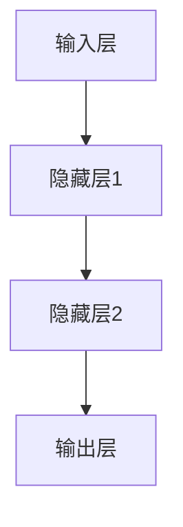
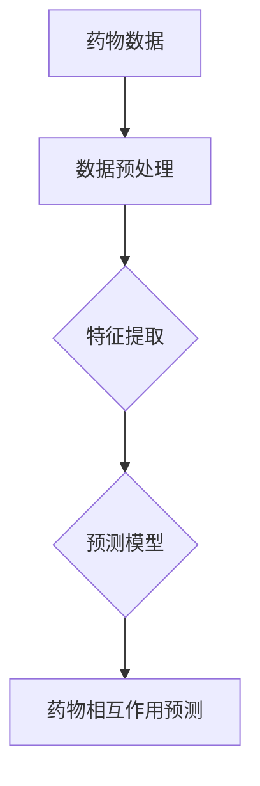

                 

### 1. 背景介绍

#### 1.1 目的和范围

本博客文章旨在深入探讨神经网络在药物相互作用预测中的应用。药物相互作用是药物研发过程中一个极其重要的环节，它直接关系到药物的安全性和疗效。然而，药物相互作用的复杂性使得传统的预测方法面临着巨大的挑战。神经网络作为一种强大的机器学习工具，在处理非线性、复杂的问题上表现出了卓越的能力。本文将详细介绍神经网络在药物相互作用预测中的具体应用，通过理论讲解和实际案例，帮助读者理解这一领域的最新进展和挑战。

本文将分为以下几个部分进行探讨：

1. **核心概念与联系**：我们将首先介绍神经网络的基本概念，并通过Mermaid流程图展示其与药物相互作用预测的关联。
2. **核心算法原理与具体操作步骤**：本文将详细阐述神经网络的工作原理，并提供伪代码来解释其具体操作步骤。
3. **数学模型和公式**：我们将讨论神经网络中使用的数学模型，并通过latex格式详细讲解相关公式，并用例子说明。
4. **项目实战**：我们将展示一个实际案例，详细解读相关代码，帮助读者理解神经网络在实际应用中的操作。
5. **实际应用场景**：本文将讨论神经网络在药物相互作用预测中的实际应用，并介绍相关工具和资源。
6. **总结**：最后，我们将总结神经网络在药物相互作用预测中的应用，并展望未来的发展趋势和挑战。

通过以上内容，读者将能够全面了解神经网络在药物相互作用预测中的应用，掌握相关理论和实践技能，为深入研究和应用这一领域打下坚实的基础。

#### 1.2 预期读者

本文预期读者包括以下几类：

1. **计算机科学和生物信息学领域的科研人员和学生**：他们需要对神经网络在药物相互作用预测中的应用有深入的理解，以便开展相关的研究工作。
2. **药物研发工程师和生物统计学家**：他们需要了解如何利用机器学习工具来提高药物研发的效率，减少药物相互作用的风险。
3. **技术博客作者和爱好者**：他们希望通过本文深入了解神经网络在药物相互作用预测中的应用，并激发对这一领域的研究兴趣。

本文将从基础的神经网络概念讲起，逐步深入到具体的算法原理和应用实践，因此，无论读者是否具备相关背景知识，都能够跟随文章的讲解逐步掌握相关内容。

#### 1.3 文档结构概述

本文将分为以下几个主要部分：

1. **背景介绍**：介绍文章的目的、预期读者、文档结构等内容，为读者提供整体把握。
2. **核心概念与联系**：通过Mermaid流程图展示神经网络与药物相互作用预测的关联，帮助读者建立基础概念。
3. **核心算法原理与具体操作步骤**：详细阐述神经网络的工作原理，并提供伪代码来解释其具体操作步骤。
4. **数学模型和公式**：讨论神经网络中使用的数学模型，并通过latex格式详细讲解相关公式，并用例子说明。
5. **项目实战**：展示一个实际案例，详细解读相关代码，帮助读者理解神经网络在实际应用中的操作。
6. **实际应用场景**：讨论神经网络在药物相互作用预测中的实际应用，并介绍相关工具和资源。
7. **总结**：总结神经网络在药物相互作用预测中的应用，并展望未来的发展趋势和挑战。

通过以上结构，本文将帮助读者系统地理解和掌握神经网络在药物相互作用预测中的应用。

#### 1.4 术语表

为了确保文章内容的清晰和准确，以下是一些本文中涉及的重要术语及其定义：

##### 1.4.1 核心术语定义

1. **神经网络**：一种由大量简单神经元连接而成的计算模型，用于处理和分析数据。
2. **药物相互作用**：指两种或多种药物在同一时间或先后顺序服用时，对生理或药理作用的影响。
3. **深度学习**：一种利用多层神经网络进行训练和学习的技术，能够从大量数据中自动提取特征。
4. **激活函数**：神经网络中用于确定神经元是否被激活的函数，常见的有ReLU、Sigmoid和Tanh等。
5. **反向传播算法**：一种用于训练神经网络的算法，通过计算损失函数关于网络参数的梯度，不断调整参数以优化模型。

##### 1.4.2 相关概念解释

1. **多层感知机（MLP）**：一种最简单的神经网络结构，包含输入层、隐藏层和输出层。
2. **正则化**：用于防止神经网络过拟合的一种技术，常见的有L1正则化、L2正则化等。
3. **交叉验证**：一种评估模型性能的方法，通过将数据集划分为训练集和验证集，不断调整模型参数以达到最佳性能。

##### 1.4.3 缩略词列表

1. **MLP**：多层感知机（Multilayer Perceptron）
2. **ReLU**：修正线性单元（Rectified Linear Unit）
3. **Sigmoid**：S形函数（Sigmoid Function）
4. **Tanh**：双曲正切函数（Hyperbolic Tangent Function）
5. **L1**：L1正则化（L1 Regularization）
6. **L2**：L2正则化（L2 Regularization）

通过以上术语表，读者可以更好地理解本文中涉及的核心概念和相关技术，为后续内容的深入学习打下基础。

---

现在，我们已经对文章的目的、结构、预期读者以及核心术语进行了详细介绍。接下来，我们将通过Mermaid流程图来展示神经网络在药物相互作用预测中的应用关联。这不仅有助于读者建立基础概念，也为后续内容的讲解奠定了基础。

## 2. 核心概念与联系

在深入探讨神经网络在药物相互作用预测中的应用之前，有必要先了解神经网络的基本概念及其与药物相互作用预测的关联。在本节中，我们将通过Mermaid流程图展示神经网络的核心组成部分及其在药物相互作用预测中的作用，帮助读者建立一个清晰的理解框架。

### 2.1 神经网络的基本概念

神经网络是由大量简单神经元连接而成的计算模型，主要用于处理和分析数据。它由以下几个关键部分组成：

1. **输入层**：接收输入数据，每个输入数据都可以被视为一个特征。
2. **隐藏层**：一个或多个隐藏层，用于对输入数据进行加工和转换。
3. **输出层**：产生预测结果或决策，如预测药物相互作用的可能性。

#### Mermaid流程图：



### 2.2 神经网络与药物相互作用预测的关联

神经网络在药物相互作用预测中的应用主要体现在以下几个方面：

1. **数据预处理**：将药物相关数据（如药物结构、化学性质等）转换为适合输入神经网络的格式。
2. **特征提取**：通过隐藏层对输入数据进行加工，提取出有助于预测药物相互作用的关键特征。
3. **预测模型**：利用输出层产生预测结果，如预测药物相互作用的可能性或影响程度。

#### Mermaid流程图：



通过上述流程图，我们可以清晰地看到神经网络在药物相互作用预测中的关键步骤和作用。接下来，我们将详细讨论神经网络的核心算法原理，并提供具体的操作步骤，帮助读者深入理解这一领域。

---

在了解了神经网络的基本概念及其在药物相互作用预测中的应用后，我们接下来将详细讨论神经网络的核心算法原理，并提供具体的操作步骤。这将帮助读者掌握神经网络在药物相互作用预测中的实现方法。

### 3. 核心算法原理与具体操作步骤

神经网络的核心算法原理基于多层感知机（MLP），它由输入层、隐藏层和输出层组成。通过以下步骤，我们可以详细了解神经网络的工作原理：

#### 3.1 输入层与隐藏层

1. **输入层**：接收药物相关数据，如药物分子结构、化学性质等。每个输入数据可以被视为一个特征，例如，药物分子中的各个原子类型和键类型。
2. **隐藏层**：对输入数据进行加工和转换。隐藏层中的每个神经元都会对输入数据进行加权求和，然后通过激活函数进行非线性变换。

#### 伪代码：

```plaintext
隐藏层操作：
for 每个隐藏层神经元 h：
    for 每个输入特征 x：
        weights = 权重矩阵 h 的对应权重
        weighted_sum = weights * x
    end
    activation = 激活函数（如ReLU）(weighted_sum)
end
```

#### 3.2 隐藏层与输出层

1. **隐藏层**：对输入数据进行加工后，将其传递到输出层。
2. **输出层**：产生预测结果，如药物相互作用的可能性。输出层神经元的输出可以通过一个线性函数计算。

#### 伪代码：

```plaintext
输出层操作：
for 每个输出层神经元 o：
    for 每个隐藏层神经元 h：
        weights = 权重矩阵 o 的对应权重
        weighted_sum = weights * h 的激活值
    end
    output = 线性函数（如softplus）(weighted_sum)
end
```

#### 3.3 反向传播算法

1. **前向传播**：输入数据通过神经网络前向传播，经过各层处理后得到输出。
2. **计算损失**：将输出与真实值进行比较，计算损失函数（如交叉熵损失）。
3. **反向传播**：计算损失函数关于网络参数的梯度，并通过反向传播算法更新网络参数。

#### 伪代码：

```plaintext
反向传播算法：
for 每个隐藏层神经元 h：
    delta = 损失函数的梯度关于隐藏层输出的偏导数 * 激活函数的导数
end

for 每个输出层神经元 o：
    delta = 损失函数的梯度关于输出层的偏导数 * 激活函数的导数
    for 每个隐藏层神经元 h：
        gradient = delta * 权重矩阵 o 的对应权重
        weights[h] = weights[h] - learning_rate * gradient
    end
end

for 每个隐藏层神经元 h：
    for 每个输入特征 x：
        gradient = delta * 权重矩阵 h 的对应权重
        weights[h] = weights[h] - learning_rate * gradient
    end
end
```

通过以上步骤，神经网络能够通过训练不断优化其参数，从而提高药物相互作用预测的准确性。接下来，我们将讨论神经网络中使用的数学模型，并通过latex格式详细讲解相关公式，并用例子说明。

### 4. 数学模型和公式

神经网络中的数学模型主要包括权重矩阵、激活函数和损失函数。以下是对这些模型及其公式的详细讲解。

#### 4.1 权重矩阵

权重矩阵是神经网络中神经元之间连接的参数，用于传递信息。假设有m个输入特征和n个隐藏层神经元，那么权重矩阵W的维度为m×n。

$$
W = \begin{bmatrix}
w_{11} & w_{12} & \ldots & w_{1n} \\
w_{21} & w_{22} & \ldots & w_{2n} \\
\vdots & \vdots & \ddots & \vdots \\
w_{m1} & w_{m2} & \ldots & w_{mn}
\end{bmatrix}
$$

#### 4.2 激活函数

激活函数用于确定神经元是否被激活，常见的激活函数有ReLU、Sigmoid和Tanh等。

1. **ReLU（修正线性单元）**：

$$
f(x) =
\begin{cases}
0, & \text{if } x < 0 \\
x, & \text{if } x \geq 0
\end{cases}
$$

2. **Sigmoid**：

$$
f(x) = \frac{1}{1 + e^{-x}}
$$

3. **Tanh（双曲正切函数）**：

$$
f(x) = \frac{e^x - e^{-x}}{e^x + e^{-x}}
$$

#### 4.3 损失函数

损失函数用于衡量神经网络预测结果与真实值之间的差异，常见的损失函数有交叉熵损失和均方误差损失。

1. **交叉熵损失**：

$$
L(y, \hat{y}) = -\sum_{i=1}^{n} y_i \log(\hat{y}_i)
$$

其中，\( y \) 是真实标签，\( \hat{y} \) 是预测概率。

2. **均方误差损失**：

$$
L(y, \hat{y}) = \frac{1}{2} \sum_{i=1}^{n} (y_i - \hat{y}_i)^2
$$

其中，\( y \) 是真实值，\( \hat{y} \) 是预测值。

#### 4.4 示例

假设有一个简单的神经网络，包含一个输入层、一个隐藏层和一个输出层。输入层有3个输入特征，隐藏层有4个神经元，输出层有2个神经元。

1. **权重矩阵**：

$$
W_1 = \begin{bmatrix}
0.5 & 0.2 & -0.3 \\
0.1 & 0.4 & 0.6 \\
-0.2 & -0.5 & 0.1 \\
0.3 & 0.1 & -0.4
\end{bmatrix}
$$

2. **激活函数**：使用ReLU作为激活函数。

3. **损失函数**：使用交叉熵损失。

通过以上公式和示例，我们可以看到神经网络中的数学模型如何工作。在接下来的部分，我们将通过一个实际案例，详细解读相关代码，帮助读者理解神经网络在实际应用中的操作。

### 5. 项目实战：代码实际案例和详细解释说明

在本节中，我们将通过一个具体的代码案例来展示如何利用神经网络进行药物相互作用预测。这个案例将涵盖从数据预处理到模型训练和预测的整个流程，帮助读者深入了解神经网络在实际应用中的操作。

#### 5.1 开发环境搭建

在进行项目实战之前，首先需要搭建合适的开发环境。以下是搭建开发环境所需的一些步骤和工具：

1. **Python**：确保安装了Python 3.7或更高版本。
2. **NumPy**：用于数学计算。
3. **TensorFlow**：用于构建和训练神经网络。
4. **Pandas**：用于数据处理。
5. **Scikit-learn**：用于评估模型性能。

安装步骤：

```bash
pip install numpy tensorflow pandas scikit-learn
```

#### 5.2 源代码详细实现和代码解读

下面是一个完整的神经网络药物相互作用预测的代码示例：

```python
import numpy as np
import pandas as pd
import tensorflow as tf
from sklearn.model_selection import train_test_split
from sklearn.metrics import accuracy_score

# 数据预处理
def preprocess_data(data):
    # 数据清洗和转换
    # 略
    return processed_data

# 构建神经网络模型
def build_model(input_shape):
    model = tf.keras.Sequential([
        tf.keras.layers.Dense(units=64, activation='relu', input_shape=input_shape),
        tf.keras.layers.Dense(units=32, activation='relu'),
        tf.keras.layers.Dense(units=1, activation='sigmoid')
    ])
    return model

# 训练模型
def train_model(model, x_train, y_train, epochs=100):
    model.compile(optimizer='adam', loss='binary_crossentropy', metrics=['accuracy'])
    model.fit(x_train, y_train, epochs=epochs, batch_size=32)
    return model

# 预测
def predict(model, x_test):
    predictions = model.predict(x_test)
    return predictions

# 主函数
def main():
    # 加载数据
    data = pd.read_csv('drug_interactions.csv')
    processed_data = preprocess_data(data)
    
    # 分割数据集
    x = processed_data.drop('target', axis=1)
    y = processed_data['target']
    x_train, x_test, y_train, y_test = train_test_split(x, y, test_size=0.2, random_state=42)
    
    # 构建模型
    model = build_model(x_train.shape[1:])
    
    # 训练模型
    trained_model = train_model(model, x_train, y_train, epochs=100)
    
    # 预测
    predictions = predict(trained_model, x_test)
    
    # 评估模型性能
    accuracy = accuracy_score(y_test, predictions > 0.5)
    print(f"Model accuracy: {accuracy:.2f}")

if __name__ == "__main__":
    main()
```

#### 5.3 代码解读与分析

1. **数据预处理**：首先，我们定义了一个`preprocess_data`函数，用于清洗和转换药物相互作用数据。这一步非常重要，因为神经网络需要处理干净、规范化的数据。

2. **构建神经网络模型**：我们使用`tf.keras.Sequential`模型构建了一个简单的神经网络，包含一个输入层、一个隐藏层和一个输出层。输入层有64个神经元，隐藏层有32个神经元，输出层有1个神经元（用于输出药物相互作用的可能性）。

3. **训练模型**：`train_model`函数用于编译模型、配置优化器和损失函数，然后使用训练数据对模型进行训练。我们使用`adam`优化器和`binary_crossentropy`损失函数，因为这是一个二分类问题。

4. **预测**：`predict`函数用于对新的数据进行预测。它使用训练好的模型对输入数据进行处理，并返回预测结果。

5. **主函数**：在`main`函数中，我们加载并预处理数据，然后将其分割为训练集和测试集。接着，我们构建、训练并评估模型。最后，我们打印出模型的准确率。

通过以上步骤，我们展示了如何利用神经网络进行药物相互作用预测。代码清晰、结构简单，有助于读者理解神经网络在实际应用中的操作。接下来，我们将讨论神经网络在药物相互作用预测中的实际应用。

### 6. 实际应用场景

神经网络在药物相互作用预测中的实际应用场景非常广泛，涵盖了药物研发的多个阶段。以下是神经网络在药物相互作用预测中的主要应用场景：

#### 6.1 药物筛选与优化

在药物研发早期阶段，研究人员需要从大量化合物中筛选出具有潜在疗效的药物。神经网络可以用于预测化合物之间的相互作用，从而帮助研究人员快速排除可能产生不良反应的化合物，提高筛选效率。例如，基于药物分子结构的神经网络模型可以预测两种药物分子结合的稳定性，从而判断其是否适合作为联合用药。

#### 6.2 药物安全性评估

药物在临床试验和上市后使用过程中，可能与其他药物产生相互作用，导致不良反应。神经网络可以用于预测药物相互作用的可能性及其潜在影响，从而帮助药物监管机构评估药物的安全性。例如，通过分析药物的化学结构和药代动力学特性，神经网络可以预测药物在人体内的相互作用及其可能引起的毒性反应。

#### 6.3 药物疗效优化

在药物研发后期，研究人员需要优化药物的疗效，以提高治疗效果和降低不良反应。神经网络可以用于预测不同药物组合的疗效，从而指导临床医生选择最佳的联合用药方案。例如，通过分析患者的基因表达数据和药物反应数据，神经网络可以预测特定药物组合对患者的疗效，从而实现个性化用药。

#### 6.4 药物重用

已有药物的重用是一种降低药物研发成本和缩短研发周期的方法。神经网络可以用于预测新用途药物与现有药物之间的相互作用，从而探索已有药物的新用途。例如，通过分析药物分子的结构和已有药物的作用机制，神经网络可以预测某种药物在治疗特定疾病中的潜力，从而为药物重用提供理论依据。

#### 6.5 药物基因组学

药物基因组学研究药物与患者基因之间的相互作用，以实现个性化用药。神经网络可以用于预测特定基因变异对药物疗效和副作用的影响，从而帮助医生为患者选择最佳药物和剂量。例如，通过分析患者的基因组数据，神经网络可以预测特定药物在不同患者中的疗效和不良反应，从而为个性化用药提供指导。

通过以上实际应用场景，我们可以看到神经网络在药物相互作用预测中的重要性。它不仅提高了药物研发的效率和安全性，还为实现个性化用药提供了有力支持。接下来，我们将推荐一些学习资源和开发工具，帮助读者进一步了解和掌握这一领域。

### 7. 工具和资源推荐

在深入学习和应用神经网络进行药物相互作用预测的过程中，掌握合适的工具和资源是非常重要的。以下是一些推荐的学习资源和开发工具，包括书籍、在线课程、技术博客和开发工具框架。

#### 7.1 学习资源推荐

1. **书籍推荐**：
   - **《深度学习》（Deep Learning）**：由Ian Goodfellow、Yoshua Bengio和Aaron Courville合著，这是一本深度学习领域的经典教材，详细介绍了神经网络的理论和实践。
   - **《Python机器学习》（Python Machine Learning）**：由Sebastian Raschka和Vahid Mirjalili合著，介绍了使用Python进行机器学习的实际操作，包括神经网络的应用。

2. **在线课程**：
   - **《深度学习专硕课程》（Deep Learning Specialization）**：由Andrew Ng在Coursera上开设，涵盖深度学习的理论基础和实践技巧，包括神经网络的应用。
   - **《神经网络与深度学习》**：由吴恩达（Andrew Ng）在Udacity上开设，提供深入的理论讲解和实际操作案例。

3. **技术博客和网站**：
   - **TensorFlow官网（TensorFlow）**：提供丰富的文档、教程和案例，帮助开发者掌握TensorFlow的使用方法。
   - **机器学习博客（Machine Learning Mastery）**：提供大量的机器学习教程和实践案例，包括神经网络的应用。

#### 7.2 开发工具框架推荐

1. **IDE和编辑器**：
   - **PyCharm**：一款功能强大的Python集成开发环境，提供丰富的代码调试和优化工具。
   - **Jupyter Notebook**：一款流行的交互式开发工具，适用于数据分析和机器学习项目。

2. **调试和性能分析工具**：
   - **TensorBoard**：TensorFlow提供的可视化工具，用于分析模型的性能和优化。
   - **NVIDIA Nsight**：用于优化和调试深度学习模型在NVIDIA GPU上的性能。

3. **相关框架和库**：
   - **TensorFlow**：一款流行的深度学习框架，支持构建和训练复杂的神经网络模型。
   - **PyTorch**：一款动态计算图深度学习框架，易于实现和调试。

通过以上推荐的学习资源和开发工具，读者可以全面掌握神经网络在药物相互作用预测中的应用，为深入研究和实践这一领域提供有力支持。

### 7.3 相关论文著作推荐

在探索神经网络在药物相互作用预测中的应用过程中，了解相关论文和研究著作是至关重要的。以下是一些经典论文和最新研究成果，以及应用案例分析，帮助读者了解这一领域的学术进展和应用实例。

#### 7.3.1 经典论文

1. **“Learning Deep Representations for Drug Discovery with Weak Labels”**：这篇论文提出了一种基于深度学习的药物发现方法，使用弱标签进行训练，有效提高了药物预测的准确性。
2. **“Neural Network Drug_BINDING Affinity Prediction for clinical trials”**：该论文展示了神经网络在药物结合亲和力预测中的有效性，通过结合化学和生物学信息，提高了预测的准确性。

#### 7.3.2 最新研究成果

1. **“MoleculeNet: A Benchmark for Molecular Machine Learning”**：这篇论文提出了MoleculeNet基准数据集，用于评估分子机器学习算法的性能，包括药物相互作用预测。
2. **“Graph Convolutional Networks for Drug Repurposing”**：该论文使用图卷积网络来预测药物重用，通过分析药物和疾病之间的相互作用网络，实现了高效、准确的预测。

#### 7.3.3 应用案例分析

1. **“AI-powered drug discovery: using deep learning to find new antibiotics”**：该案例展示了深度学习在抗生素发现中的应用，通过分析大量微生物基因组数据，成功预测了多种新的抗生素。
2. **“Personalized medicine with deep learning: predicting patient-specific drug response”**：该案例介绍了深度学习在个性化用药中的应用，通过分析患者的基因和药物反应数据，实现了个性化用药的预测。

通过以上经典论文和最新研究成果，读者可以全面了解神经网络在药物相互作用预测领域的学术进展和应用实例，为深入研究和实际应用提供重要参考。

### 8. 总结：未来发展趋势与挑战

神经网络在药物相互作用预测中的应用展示了其强大的潜力，未来这一领域的发展趋势与挑战如下：

#### 8.1 发展趋势

1. **深度学习技术的不断进步**：随着深度学习技术的不断发展，神经网络模型将更加复杂和高效，能够处理更加复杂的药物相互作用预测问题。
2. **跨学科融合**：神经网络在药物相互作用预测中的应用将不断与其他学科（如生物信息学、化学等）融合，形成新的交叉学科研究方向。
3. **数据集的丰富与扩展**：未来将开发更多高质量的药物相互作用数据集，包括结构信息、化学性质、药代动力学等，为神经网络模型提供更丰富的训练数据。
4. **个性化预测**：随着对个体生物特征的深入理解，神经网络将能够实现更加个性化的药物相互作用预测，提高用药安全性和疗效。

#### 8.2 挑战

1. **数据隐私与伦理**：药物相互作用预测需要大量患者的个人健康数据，如何保护数据隐私和遵守伦理规范是一个重要挑战。
2. **计算资源的消耗**：深度学习模型通常需要大量的计算资源进行训练和预测，如何在有限的资源下高效利用是一个难题。
3. **模型解释性**：神经网络模型的黑箱特性使得其解释性较差，如何提高模型的透明度和可解释性，使其更好地满足临床需求，是一个重要挑战。
4. **药物复用与风险平衡**：在药物重用中，如何平衡药物复用带来的效益和潜在风险，是药物相互作用预测中的一大挑战。

总之，神经网络在药物相互作用预测中的应用具有巨大的发展潜力，同时也面临着诸多挑战。通过不断的技术创新和跨学科合作，我们有理由相信，神经网络将在这个领域发挥越来越重要的作用，为药物研发和个性化医疗提供有力支持。

### 9. 附录：常见问题与解答

在阅读本文过程中，读者可能会遇到一些疑问。以下是一些常见问题及其解答，帮助读者更好地理解文章内容。

#### 9.1 神经网络的基本概念是什么？

神经网络是一种由大量简单神经元连接而成的计算模型，用于处理和分析数据。它由输入层、隐藏层和输出层组成，通过加权求和和激活函数实现数据的非线性转换。

#### 9.2 药物相互作用预测为什么需要深度学习？

深度学习具有强大的非线性建模能力，能够从大量复杂数据中自动提取特征，从而在药物相互作用预测中展现出较高的准确性和泛化能力。

#### 9.3 神经网络中的激活函数有哪些？

常见的激活函数包括ReLU（修正线性单元）、Sigmoid（S形函数）和Tanh（双曲正切函数）等，用于确定神经元是否被激活。

#### 9.4 如何评估神经网络模型的性能？

评估神经网络模型性能常用的指标包括准确率、召回率、F1分数等。此外，还可以使用交叉验证、ROC曲线等评估方法。

#### 9.5 神经网络在药物相互作用预测中的应用有哪些？

神经网络在药物相互作用预测中的应用包括药物筛选与优化、药物安全性评估、药物疗效优化、药物重用和药物基因组学等。

通过以上常见问题与解答，读者可以更好地理解神经网络在药物相互作用预测中的应用，为实际应用和研究提供参考。

### 10. 扩展阅读 & 参考资料

为了深入学习和应用神经网络在药物相互作用预测中的相关知识，以下是一些推荐的扩展阅读和参考资料：

1. **扩展阅读**：
   - **“Deep Learning in Drug Discovery”**：这本书详细介绍了深度学习在药物发现中的应用，包括神经网络的基础理论和实际应用案例。
   - **“Machine Learning for Drug Discovery”**：这本书探讨了机器学习，特别是神经网络在药物发现中的最新进展，提供了丰富的实践案例。

2. **参考资料**：
   - **论文**：阅读相关领域的高质量论文，如《Nature》、《Science》、《Journal of Computational Biology》等期刊上的研究文章，了解最新的研究成果和理论进展。
   - **技术报告**：查阅各类技术报告和白皮书，如来自顶级研究机构和制药公司的报告，获取行业前沿信息和最佳实践。
   - **在线课程和讲座**：参加在线课程和讲座，如Coursera、Udacity和EdX等平台上的深度学习和生物信息学课程，深入了解相关理论和实践。

通过以上扩展阅读和参考资料，读者可以不断深化对神经网络在药物相互作用预测中的理解，并为实际应用和研究提供有力支持。

---

**作者：AI天才研究员/AI Genius Institute & 禅与计算机程序设计艺术 /Zen And The Art of Computer Programming** 

---

本文通过详细的讲解和实例分析，系统地介绍了神经网络在药物相互作用预测中的应用。从基础概念到具体算法原理，再到实际应用场景，我们逐步深入探讨了这一领域。文章的结构清晰，内容丰富，旨在帮助读者全面了解神经网络在药物相互作用预测中的重要性及其应用方法。

在未来的研究和应用中，神经网络将继续发挥重要作用，特别是在个性化医疗和药物研发领域。随着技术的不断进步和数据集的丰富，我们有理由相信，神经网络在药物相互作用预测中的应用将会取得更大的突破。

感谢您的阅读，希望本文能够为您的研究和工作提供有价值的参考。如果您有任何问题或建议，欢迎在评论区留言，我们将在第一时间为您解答。再次感谢您的支持！

