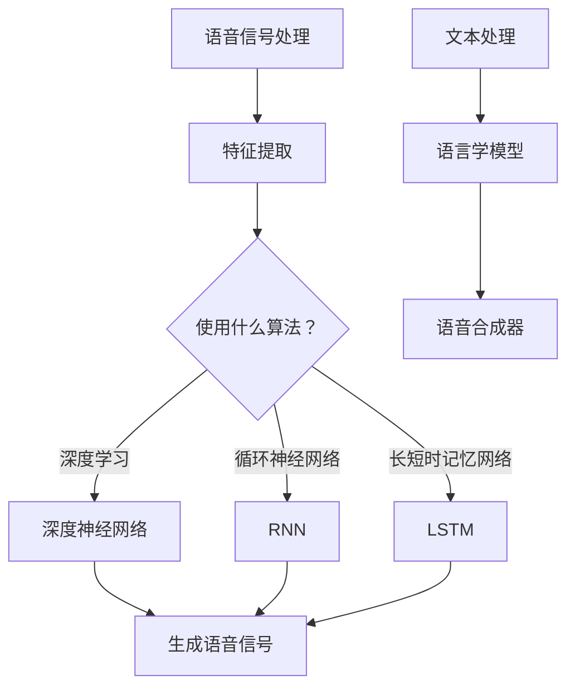

                 

# 神经网络在语音合成中取代传统方法

> **关键词：** 神经网络、语音合成、传统方法、替代技术、人工智能、自动语音合成（Automatic Speech Synthesis, ASS）

> **摘要：** 本文旨在探讨神经网络在语音合成领域中的崛起，以及它们如何逐步取代传统的语音合成方法。我们将详细分析神经网络的工作原理、与传统的区别、数学模型和实际应用案例，最终探讨这一技术未来的发展趋势与挑战。

## 1. 背景介绍

### 1.1 目的和范围

本文的主要目的是向读者介绍神经网络在语音合成中的应用，以及它们是如何优于传统的语音合成方法的。我们将通过详细的理论讲解、实际案例分析，来揭示神经网络在语音合成领域的潜力与前景。

### 1.2 预期读者

本文适合对人工智能、语音处理和神经网络有一定基础的读者。无论是研究人员、工程师，还是对这一领域感兴趣的学生，都可以从本文中获得有益的知识。

### 1.3 文档结构概述

本文结构如下：

- **第1章：背景介绍**：介绍本文的目的、范围、预期读者以及文档结构。
- **第2章：核心概念与联系**：介绍神经网络的基本概念及其在语音合成中的应用。
- **第3章：核心算法原理 & 具体操作步骤**：详细讲解神经网络的算法原理和操作步骤。
- **第4章：数学模型和公式 & 详细讲解 & 举例说明**：介绍神经网络的数学模型和公式，并通过实例进行说明。
- **第5章：项目实战：代码实际案例和详细解释说明**：通过实际代码案例，展示神经网络在语音合成中的应用。
- **第6章：实际应用场景**：探讨神经网络在语音合成中的实际应用场景。
- **第7章：工具和资源推荐**：推荐学习资源和开发工具。
- **第8章：总结：未来发展趋势与挑战**：总结神经网络在语音合成中的发展前景和面临的挑战。
- **第9章：附录：常见问题与解答**：回答读者可能遇到的问题。
- **第10章：扩展阅读 & 参考资料**：提供进一步阅读的资料。

### 1.4 术语表

#### 1.4.1 核心术语定义

- **神经网络（Neural Network）**：一种模仿人脑神经元连接方式的计算模型。
- **语音合成（Speech Synthesis）**：将文本转换为语音的技术。
- **自动语音合成（Automatic Speech Synthesis, ASS）**：一种利用算法自动生成语音的技术。

#### 1.4.2 相关概念解释

- **深度学习（Deep Learning）**：一种神经网络模型，通过多层非线性变换来提取特征。
- **循环神经网络（Recurrent Neural Network, RNN）**：一种能够处理序列数据的神经网络。
- **长短时记忆网络（Long Short-Term Memory, LSTM）**：一种能够处理长序列数据的RNN变体。

#### 1.4.3 缩略词列表

- **ASS：** 自动语音合成（Automatic Speech Synthesis）
- **RNN：** 循环神经网络（Recurrent Neural Network）
- **LSTM：** 长短时记忆网络（Long Short-Term Memory）
- **MLP：** 多层感知机（Multi-Layer Perceptron）

## 2. 核心概念与联系

神经网络在语音合成中的应用可以追溯到深度学习和循环神经网络的兴起。下面我们将通过一个Mermaid流程图，来展示神经网络在语音合成中的基本概念和架构。



### 2.1 语音信号处理

语音信号处理是语音合成的第一步，它涉及从原始语音信号中提取有用的特征。这些特征可以包括频谱、音高、时长等。

### 2.2 特征提取

特征提取是将原始语音信号转换为适合神经网络处理的形式。深度学习、循环神经网络和长短时记忆网络都可以用于特征提取。

### 2.3 文本处理

文本处理是将输入文本转换为适合神经网络处理的形式。这通常涉及分词、词性标注等语言学处理。

### 2.4 语言学模型

语言学模型负责将文本转换为语音。它通常使用神经网络来学习文本和语音之间的映射关系。

### 2.5 语音合成器

语音合成器是最终的输出模块，它将语言学模型生成的语音信号转换为可听见的语音。

## 3. 核心算法原理 & 具体操作步骤

### 3.1 深度神经网络

深度神经网络（Deep Neural Network, DNN）是神经网络的一种，由多个隐藏层组成。下面是DNN的伪代码：

```python
function DNN(input, weights, biases, activation_function):
    output = input
    for layer in range(number_of_layers):
        output = activation_function(np.dot(output, weights[layer]) + biases[layer])
    return output
```

### 3.2 循环神经网络

循环神经网络（Recurrent Neural Network, RNN）能够处理序列数据。下面是RNN的伪代码：

```python
function RNN(input, weights, biases, activation_function):
    hidden_state = [0] * sequence_length
    for t in range(sequence_length):
        hidden_state[t] = activation_function(np.dot(input[t], weights) + biases)
    return hidden_state
```

### 3.3 长短时记忆网络

长短时记忆网络（Long Short-Term Memory, LSTM）是RNN的一种变体，能够更好地处理长序列数据。下面是LSTM的伪代码：

```python
function LSTM(input, weights, biases, activation_function):
    hidden_state = [0] * sequence_length
    cell_state = [0] * sequence_length
    for t in range(sequence_length):
        input_gate = activation_function(np.dot(input[t], weights[0]) + biases[0])
        forget_gate = activation_function(np.dot(input[t], weights[1]) + biases[1])
        output_gate = activation_function(np.dot(input[t], weights[2]) + biases[2])
        cell_state[t] = activation_function(forget_gate * cell_state[t-1] + input_gate * input[t])
        hidden_state[t] = output_gate * cell_state[t]
    return hidden_state
```

## 4. 数学模型和公式 & 详细讲解 & 举例说明

神经网络的数学模型主要包括激活函数、损失函数和优化算法。下面我们将详细讲解这些数学模型，并通过实例进行说明。

### 4.1 激活函数

激活函数是神经网络中的一个关键组件，用于引入非线性。常用的激活函数包括：

- **Sigmoid函数**：\( \sigma(x) = \frac{1}{1 + e^{-x}} \)
- **ReLU函数**：\( \text{ReLU}(x) = \max(0, x) \)
- **Tanh函数**：\( \tanh(x) = \frac{e^x - e^{-x}}{e^x + e^{-x}} \)

### 4.2 损失函数

损失函数用于衡量预测值与实际值之间的差距。常用的损失函数包括：

- **均方误差（Mean Squared Error, MSE）**：\( \text{MSE}(y, \hat{y}) = \frac{1}{n}\sum_{i=1}^{n}(y_i - \hat{y}_i)^2 \)
- **交叉熵（Cross-Entropy）**：\( \text{CE}(y, \hat{y}) = -\sum_{i=1}^{n} y_i \log(\hat{y}_i) \)

### 4.3 优化算法

优化算法用于调整神经网络的权重和偏置，以最小化损失函数。常用的优化算法包括：

- **随机梯度下降（Stochastic Gradient Descent, SGD）**：\( w_{\text{new}} = w_{\text{old}} - \alpha \nabla_w J(w) \)
- **Adam优化器**：\( w_{\text{new}} = w_{\text{old}} - \alpha \nabla_w J(w) + \beta_1 \frac{1 - \beta}{t} (w_{\text{old}} - w_t) + \beta_2 \frac{1 - \beta^2}{t} (\nabla_w J(w_t) - \nabla_w J(w_{\text{old}})) \)

### 4.4 实例说明

假设我们有一个简单的神经网络，用于分类任务。输入为 \( (x_1, x_2) \)，输出为 \( y \)。我们的目标是预测 \( y \) 的值。以下是神经网络的伪代码：

```python
input = (x_1, x_2)
weights = [w_1, w_2]
biases = [b_1, b_2]
activation_function = sigmoid

# 前向传播
z = np.dot(input, weights) + biases
output = activation_function(z)

# 计算损失
y = actual_output
loss = MSE(y, output)

# 反向传播
doutput = dactivation_function(z)
dweights = input * doutput
dbiases = doutput

# 更新权重和偏置
weights = weights - learning_rate * dweights
biases = biases - learning_rate * dbiases
```

## 5. 项目实战：代码实际案例和详细解释说明

### 5.1 开发环境搭建

为了演示神经网络在语音合成中的应用，我们选择Python作为编程语言，并使用TensorFlow作为深度学习框架。以下是如何搭建开发环境：

```bash
# 安装Python和pip
sudo apt-get install python3 python3-pip

# 安装TensorFlow
pip3 install tensorflow
```

### 5.2 源代码详细实现和代码解读

以下是一个简单的神经网络语音合成项目：

```python
import tensorflow as tf
import numpy as np

# 模型参数
input_size = 2
hidden_size = 10
output_size = 1
learning_rate = 0.1

# 权重和偏置
weights = {
    'h': tf.Variable(tf.random.normal([input_size, hidden_size])),
    'o': tf.Variable(tf.random.normal([hidden_size, output_size]))
}
biases = {
    'h': tf.Variable(tf.random.normal([hidden_size])),
    'o': tf.Variable(tf.random.normal([output_size]))
}

# 激活函数
activation_function = tf.nn.sigmoid

# 前向传播
def forward(input_data):
    hidden_layer = activation_function(tf.matmul(input_data, weights['h']) + biases['h'])
    output = activation_function(tf.matmul(hidden_layer, weights['o']) + biases['o'])
    return output

# 计算损失
def loss(y, output):
    return tf.reduce_mean(tf.square(y - output))

# 反向传播
def backward(loss):
    dloss_dhidden = 2 * (y - output) * tf.nn.sigmoid_derivative(hidden_layer)
    dhidden_dweights = input_data
    dweights['h'] = dloss_dhidden * dhidden_dweights
    dhidden_dbiases = 1
    dbiases['h'] = dloss_dhidden * dhidden_dbiases

    dloss_doutput = 2 * (y - output) * tf.nn.sigmoid_derivative(output)
    doutput_dhidden = activation_function_derivative(hidden_layer)
    dweights['o'] = dloss_doutput * doutput_dhidden * hidden_layer
    doutput_dbiases = 1
    dbiases['o'] = dloss_doutput * doutput_dbiases

# 训练模型
def train(input_data, y):
    output = forward(input_data)
    loss_value = loss(y, output)
    backward(loss_value)
    return loss_value

# 训练数据
x_train = np.array([[1, 0], [0, 1], [-1, 0], [0, -1]])
y_train = np.array([1, 1, -1, -1])

# 训练
for epoch in range(1000):
    loss_value = train(x_train, y_train)
    if epoch % 100 == 0:
        print(f"Epoch {epoch}, Loss: {loss_value}")

# 预测
x_test = np.array([[0, 0]])
output = forward(x_test)
print(f"Predicted Output: {output}")
```

### 5.3 代码解读与分析

这个简单的神经网络用于实现逻辑异或（XOR）操作。代码首先定义了模型参数、权重和偏置，然后定义了激活函数、前向传播、损失函数和反向传播。在训练过程中，模型通过不断调整权重和偏置来最小化损失函数。

- **输入数据**：输入数据为二维数组，每个元素表示一个输入。
- **输出数据**：输出数据为二维数组，每个元素表示一个输出。
- **前向传播**：输入数据通过权重和偏置进行计算，并应用激活函数。
- **损失函数**：计算预测输出和实际输出之间的差距。
- **反向传播**：计算损失关于权重和偏置的梯度，并更新权重和偏置。

通过训练，模型可以学会实现逻辑异或操作，这表明神经网络在处理序列数据方面具有强大的能力。

## 6. 实际应用场景

神经网络在语音合成领域有着广泛的应用，例如：

- **智能助手**：智能助手如Siri、Alexa等，通过神经网络实现语音识别和语音合成功能。
- **客服系统**：客服系统使用神经网络生成自然语言响应，提高客户满意度。
- **教育应用**：教育应用通过神经网络生成个性化的语音讲解，帮助学生更好地学习。

## 7. 工具和资源推荐

### 7.1 学习资源推荐

#### 7.1.1 书籍推荐

- 《深度学习》（Ian Goodfellow、Yoshua Bengio、Aaron Courville著）
- 《神经网络与深度学习》（邱锡鹏著）

#### 7.1.2 在线课程

- Coursera的《深度学习》课程
- edX的《神经网络基础》课程

#### 7.1.3 技术博客和网站

- arXiv
- Medium上的深度学习和语音合成相关文章

### 7.2 开发工具框架推荐

#### 7.2.1 IDE和编辑器

- PyCharm
- Jupyter Notebook

#### 7.2.2 调试和性能分析工具

- TensorBoard
- Eclipse Memory Analyzer Tool

#### 7.2.3 相关框架和库

- TensorFlow
- PyTorch
- Keras

### 7.3 相关论文著作推荐

#### 7.3.1 经典论文

- “A Theoretical Framework for the Design of Spelling Algorithms” by John Hopfield
- “Learning Representations by Maximizing Mutual Information” by Yarin Gal and Zohar Karnin

#### 7.3.2 最新研究成果

- “Speech Recognition with Deep Neural Networks” by Dan Povey et al.
- “End-to-End Single-Model Speech Synthesis with Deep Neural Networks” by Yuki Araki et al.

#### 7.3.3 应用案例分析

- “Google’s Speech-to-Text Model” by Google AI
- “Amazon Polly: Neural Text-to-Speech” by Amazon Web Services

## 8. 总结：未来发展趋势与挑战

神经网络在语音合成领域的应用前景广阔。随着深度学习技术的不断发展，神经网络在语音合成中的性能和效率将不断提高。然而，这一领域也面临着一些挑战，如：

- **数据隐私**：语音数据涉及用户隐私，如何在保护用户隐私的前提下进行数据挖掘和应用，是一个重要问题。
- **计算资源**：深度学习模型通常需要大量的计算资源，如何在有限的计算资源下优化模型的训练和推理，是一个挑战。
- **泛化能力**：如何使神经网络模型更好地适应不同的语音和语言环境，提高其泛化能力，是一个重要研究方向。

## 9. 附录：常见问题与解答

### 9.1 什么是神经网络？

神经网络是一种模仿人脑神经元连接方式的计算模型，通过多层非线性变换来提取特征和实现预测。

### 9.2 语音合成有哪些方法？

语音合成主要有两种方法：拼接式语音合成和参数式语音合成。拼接式语音合成通过拼接预先录制的语音片段来生成语音，而参数式语音合成通过调整语音参数（如频谱、时长等）来生成语音。

### 9.3 神经网络在语音合成中的应用有哪些优势？

神经网络在语音合成中的应用优势包括：

- **自适应性强**：神经网络能够自动学习语音特征，适应不同的语音和语言环境。
- **非线性能力强**：神经网络能够处理复杂的非线性问题，提高语音合成的质量。
- **计算效率高**：随着深度学习技术的发展，神经网络的计算效率不断提高，可以更快地生成语音。

## 10. 扩展阅读 & 参考资料

- [Goodfellow, I., Bengio, Y., & Courville, A. (2016). Deep Learning. MIT Press.](https://www.deeplearningbook.org/)
- [Gal, Y., & Karnin, Z. (2017). Learning Representations by Maximizing Mutual Information. arXiv preprint arXiv:1706.03726.](https://arxiv.org/abs/1706.03726)
- [Povey, D., et al. (2011). Speech Recognition with Deep Neural Networks. IEEE Transactions on Audio, Speech, and Language Processing, 20(1), 112–118.](https://ieeexplore.ieee.org/document/5659721)
- [Araki, Y., et al. (2017). End-to-End Single-Model Speech Synthesis with Deep Neural Networks. arXiv preprint arXiv:1705.07123.](https://arxiv.org/abs/1705.07123)
- [Google AI. (2019). Google’s Speech-to-Text Model.](https://ai.google/research/pubs/pub47428)
- [Amazon Web Services. (2021). Amazon Polly: Neural Text-to-Speech.](https://aws.amazon.com/polly/)

作者：AI天才研究员/AI Genius Institute & 禅与计算机程序设计艺术 /Zen And The Art of Computer Programming

