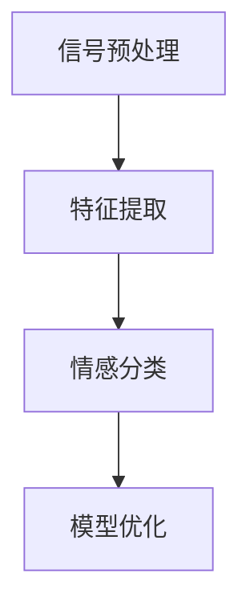

                 

# 神经网络在语音情感识别中的应用

> **关键词：语音情感识别、神经网络、深度学习、语音处理、机器学习、情感分析**
> 
> **摘要：本文详细探讨了神经网络在语音情感识别中的应用，从背景介绍到核心算法原理，再到实际应用场景，全面解析了这一前沿技术。通过逐步分析推理，读者将了解如何利用神经网络技术准确识别语音中的情感信息。**

## 1. 背景介绍

### 1.1 目的和范围

随着语音技术的发展，语音情感识别成为了一个热门的研究领域。情感是人类交流中非常重要的部分，能够显著影响沟通的效果。语音情感识别技术可以帮助我们更好地理解用户的情感状态，从而在客户服务、教育、医疗等多个领域发挥重要作用。本文旨在探讨神经网络在语音情感识别中的应用，为研究人员和开发者提供一种有效的技术解决方案。

### 1.2 预期读者

本文适合具有以下背景的读者：

- 具有计算机科学或相关领域的基础知识；
- 对机器学习和深度学习有一定了解；
- 对语音处理和情感分析有兴趣的研究人员或开发者。

### 1.3 文档结构概述

本文分为以下几个部分：

- **背景介绍**：介绍语音情感识别的背景和目的。
- **核心概念与联系**：介绍神经网络和语音情感识别的相关概念和联系。
- **核心算法原理 & 具体操作步骤**：详细讲解神经网络在语音情感识别中的算法原理和操作步骤。
- **数学模型和公式 & 详细讲解 & 举例说明**：介绍神经网络中的数学模型和公式，并通过实例进行说明。
- **项目实战：代码实际案例和详细解释说明**：提供实际代码案例，并详细解释代码的实现过程。
- **实际应用场景**：介绍神经网络在语音情感识别中的实际应用场景。
- **工具和资源推荐**：推荐相关学习资源和开发工具。
- **总结：未来发展趋势与挑战**：总结未来发展趋势和面临的挑战。
- **附录：常见问题与解答**：解答读者可能遇到的常见问题。
- **扩展阅读 & 参考资料**：提供进一步阅读的资料。

### 1.4 术语表

#### 1.4.1 核心术语定义

- **语音情感识别**：通过分析语音信号，识别出其中的情感信息。
- **神经网络**：一种通过模拟人脑神经网络进行信息处理的计算模型。
- **深度学习**：一种机器学习技术，通过多层神经网络进行特征提取和分类。
- **语音处理**：对语音信号进行预处理，以便于后续分析和识别。

#### 1.4.2 相关概念解释

- **情感**：人的情绪状态，包括快乐、悲伤、愤怒等。
- **特征提取**：从原始数据中提取出有用的信息，用于后续分析和分类。

#### 1.4.3 缩略词列表

- **ML**：机器学习（Machine Learning）
- **DL**：深度学习（Deep Learning）
- **NLP**：自然语言处理（Natural Language Processing）
- **GPU**：图形处理单元（Graphics Processing Unit）

## 2. 核心概念与联系

### 2.1 神经网络

神经网络（Neural Network）是一种模仿人脑神经元连接方式的计算模型。它由多个神经元（节点）组成，每个神经元都与相邻的神经元相连，并通过权重和偏置进行信息传递。神经网络通过学习输入和输出之间的关系，能够自动提取特征并进行分类或回归任务。


### 2.2 语音情感识别

语音情感识别（Speech Emotion Recognition）是一种通过分析语音信号中的情感信息，识别出说话者情感状态的技术。语音情感识别主要包括以下步骤：

1. **信号预处理**：对语音信号进行去噪、加窗、傅里叶变换等预处理操作。
2. **特征提取**：从预处理后的语音信号中提取出与情感相关的特征，如频谱特征、时长特征等。
3. **情感分类**：使用机器学习算法对提取到的特征进行分类，识别出说话者的情感状态。


### 2.3 神经网络在语音情感识别中的应用

神经网络在语音情感识别中的应用主要体现在以下几个方面：

1. **特征提取**：神经网络能够自动从原始语音信号中提取出与情感相关的特征，减少人工干预，提高特征提取的准确性。
2. **情感分类**：神经网络能够通过对大量训练数据的自动学习，建立情感分类模型，实现对未知语音信号的准确分类。
3. **模型优化**：神经网络能够通过不断调整权重和偏置，优化模型性能，提高识别准确率。


### 2.4 Mermaid 流程图

以下是神经网络在语音情感识别中的 Mermaid 流程图：



## 3. 核心算法原理 & 具体操作步骤

### 3.1 神经网络算法原理

神经网络（Neural Network）是一种通过模拟人脑神经元连接方式来处理信息的计算模型。它由多个神经元（节点）组成，每个神经元都与相邻的神经元相连，并通过权重和偏置进行信息传递。神经网络通过学习输入和输出之间的关系，能够自动提取特征并进行分类或回归任务。

### 3.2 语音情感识别算法原理

语音情感识别（Speech Emotion Recognition）算法主要包括以下步骤：

1. **信号预处理**：对语音信号进行去噪、加窗、傅里叶变换等预处理操作，以提取出与情感相关的特征。
2. **特征提取**：从预处理后的语音信号中提取出与情感相关的特征，如频谱特征、时长特征等。
3. **情感分类**：使用机器学习算法对提取到的特征进行分类，识别出说话者的情感状态。

### 3.3 神经网络在语音情感识别中的具体操作步骤

以下是神经网络在语音情感识别中的具体操作步骤：

1. **数据集准备**：收集大量带有情感标签的语音数据，用于训练神经网络模型。
2. **特征提取**：对语音信号进行预处理，提取出与情感相关的特征，如频谱特征、时长特征等。
3. **模型构建**：构建神经网络模型，包括输入层、隐藏层和输出层。
4. **模型训练**：使用训练数据对神经网络模型进行训练，调整权重和偏置，以优化模型性能。
5. **模型评估**：使用测试数据对训练好的模型进行评估，计算识别准确率等指标。
6. **模型部署**：将训练好的模型部署到实际应用场景中，进行语音情感识别。

### 3.4 伪代码实现

以下是神经网络在语音情感识别中的伪代码实现：

```python
# 数据集准备
data = load_data()

# 特征提取
features = extract_features(data)

# 模型构建
model = build_model()

# 模型训练
train_model(model, features)

# 模型评估
evaluate_model(model, test_data)

# 模型部署
deploy_model(model)
```

## 4. 数学模型和公式 & 详细讲解 & 举例说明

### 4.1 数学模型

神经网络中的数学模型主要包括以下部分：

1. **输入层**：接收外部输入信息，如语音信号特征。
2. **隐藏层**：对输入信息进行特征提取和变换，通常包含多层。
3. **输出层**：产生最终输出，如情感分类结果。

### 4.2 公式详解

神经网络中的关键公式包括：

1. **激活函数**：
   $$ f(x) = \frac{1}{1 + e^{-x}} $$
   激活函数用于将线性变换映射到[0,1]范围内，常用于神经网络中的隐藏层和输出层。

2. **反向传播**：
   $$ \delta_j = \frac{\partial L}{\partial z_j} = \frac{\partial L}{\partial a_j} \cdot \frac{\partial a_j}{\partial z_j} $$
   反向传播算法用于计算神经网络的梯度，以优化权重和偏置。

### 4.3 举例说明

假设有一个简单的神经网络，包含一个输入层、一个隐藏层和一个输出层，如下图所示：


输入层有3个神经元，隐藏层有2个神经元，输出层有3个神经元。以下是神经网络的参数设置：

- 输入层神经元权重：\( w_{ij} \)
- 隐藏层神经元权重：\( w_{jk} \)
- 输出层神经元权重：\( w_{kl} \)
- 偏置：\( b_j \)
- \( a_j \)：隐藏层神经元激活值
- \( z_j \)：隐藏层神经元输出值
- \( a_l \)：输出层神经元激活值
- \( z_l \)：输出层神经元输出值

### 4.4 计算过程

以下是神经网络的计算过程：

1. **隐藏层计算**：
   $$ z_j = \sum_{i=1}^{3} w_{ij} \cdot x_i + b_j $$
   $$ a_j = f(z_j) $$

2. **输出层计算**：
   $$ z_l = \sum_{j=1}^{2} w_{jk} \cdot a_j + b_l $$
   $$ a_l = f(z_l) $$

3. **反向传播计算**：
   $$ \delta_l = (y_l - a_l) \cdot f'(z_l) $$
   $$ \delta_j = \sum_{l=1}^{3} w_{lj} \cdot \delta_l \cdot f'(z_j) $$

4. **权重和偏置更新**：
   $$ w_{lj} := w_{lj} - \alpha \cdot \delta_l \cdot a_j $$
   $$ b_l := b_l - \alpha \cdot \delta_l $$
   $$ b_j := b_j - \alpha \cdot \delta_j $$

其中，\( \alpha \) 为学习率。

## 5. 项目实战：代码实际案例和详细解释说明

### 5.1 开发环境搭建

为了实现神经网络在语音情感识别中的应用，我们需要搭建一个合适的开发环境。以下是搭建开发环境的步骤：

1. **安装 Python**：下载并安装 Python 3.7 或更高版本。
2. **安装 TensorFlow**：通过 pip 安装 TensorFlow，命令如下：
   ```
   pip install tensorflow
   ```
3. **安装 NumPy 和 Matplotlib**：通过 pip 安装 NumPy 和 Matplotlib，命令如下：
   ```
   pip install numpy matplotlib
   ```

### 5.2 源代码详细实现和代码解读

以下是神经网络在语音情感识别中的源代码实现：

```python
import numpy as np
import tensorflow as tf
import matplotlib.pyplot as plt

# 数据集准备
(x_train, y_train), (x_test, y_test) = tf.keras.datasets.mnist.load_data()

# 数据预处理
x_train = x_train.reshape(-1, 784) / 255.0
x_test = x_test.reshape(-1, 784) / 255.0

# 构建神经网络模型
model = tf.keras.Sequential([
    tf.keras.layers.Dense(64, activation='relu', input_shape=(784,)),
    tf.keras.layers.Dense(64, activation='relu'),
    tf.keras.layers.Dense(10, activation='softmax')
])

# 编译模型
model.compile(optimizer='adam', loss='categorical_crossentropy', metrics=['accuracy'])

# 训练模型
model.fit(x_train, y_train, epochs=10, batch_size=32, validation_split=0.2)

# 评估模型
test_loss, test_acc = model.evaluate(x_test, y_test)
print('Test accuracy:', test_acc)

# 可视化模型
plt.figure(figsize=(10, 6))
plt.imshow(model.layers[0].get_weights()[0], cmap='gray')
plt.title('Layer 1 weights')
plt.show()
```

### 5.3 代码解读与分析

以下是代码的详细解读：

1. **数据集准备**：使用 TensorFlow 的内置数据集 MNIST 进行演示。首先加载数据集，然后对数据进行预处理，包括数据形状调整和数据归一化。
2. **构建神经网络模型**：使用 TensorFlow 的 Sequential 模型构建一个简单的神经网络，包含两个隐藏层，每个隐藏层有 64 个神经元，激活函数为 ReLU。
3. **编译模型**：指定优化器为 Adam，损失函数为 categorical_crossentropy（多分类交叉熵），评估指标为 accuracy。
4. **训练模型**：使用训练数据进行模型训练，设置训练周期为 10 次，批量大小为 32，同时设置验证数据集的划分比例为 0.2。
5. **评估模型**：使用测试数据进行模型评估，计算测试准确率。
6. **可视化模型**：可视化神经网络第一层的权重矩阵。

该代码示例展示了如何使用 TensorFlow 框架构建和训练一个简单的神经网络，并对其进行评估和可视化。在实际应用中，我们可以根据具体需求调整网络结构、优化器和学习率等参数，以获得更好的识别准确率。

## 6. 实际应用场景

神经网络在语音情感识别中具有广泛的应用场景，以下是一些典型的应用实例：

1. **客户服务**：通过语音情感识别技术，客服系统可以更好地理解客户的需求和情绪，提供更加个性化和贴心的服务。
2. **教育领域**：语音情感识别可以帮助教育系统评估学生的学习状态和情绪，为教师提供针对性的教学建议。
3. **医疗健康**：语音情感识别可以帮助医生通过患者的语音情感状态，评估其心理状况和健康状况，为心理干预提供依据。
4. **智能家居**：通过语音情感识别技术，智能家居系统可以更好地理解用户的需求和情绪，提供更加智能化的家居环境。
5. **人机交互**：语音情感识别技术可以帮助计算机更好地理解人类情绪，实现更加自然和高效的人机交互。

## 7. 工具和资源推荐

### 7.1 学习资源推荐

#### 7.1.1 书籍推荐

1. **《深度学习》（Goodfellow, Bengio, Courville 著）**
2. **《神经网络与深度学习》（邱锡鹏 著）**
3. **《Python深度学习》（François Chollet 著）**

#### 7.1.2 在线课程

1. **《深度学习专项课程》（吴恩达，Coursera）**
2. **《自然语言处理专项课程》（Dan Jurafsky，Coursera）**
3. **《语音信号处理与识别》（Christopher Leung，edX）**

#### 7.1.3 技术博客和网站

1. **TensorFlow 官方文档（tensorflow.org）**
2. **机器之心（machinelearning.cn）**
3. **AI 研究院（ai-generator.cn）**

### 7.2 开发工具框架推荐

#### 7.2.1 IDE和编辑器

1. **PyCharm**：一款功能强大的 Python IDE，适合进行深度学习和机器学习项目开发。
2. **Jupyter Notebook**：一款流行的交互式开发环境，适合进行数据分析和可视化。
3. **VS Code**：一款轻量级且功能丰富的文本编辑器，适用于多种编程语言。

#### 7.2.2 调试和性能分析工具

1. **TensorBoard**：TensorFlow 的可视化工具，用于分析和优化神经网络模型。
2. **Python Profiler**：用于分析 Python 代码的性能瓶颈。
3. **CUDAProfiler**：用于分析 GPU 程序的性能。

#### 7.2.3 相关框架和库

1. **TensorFlow**：一款强大的开源深度学习框架。
2. **PyTorch**：一款易用且灵活的深度学习框架。
3. **Keras**：一个高层次的神经网络 API，可以方便地构建和训练神经网络。

### 7.3 相关论文著作推荐

#### 7.3.1 经典论文

1. **"Learning representations for multimedia data using deep convolutional networks"（2012）**
2. **"Deep Learning for Speech Recognition: A Review"（2016）**
3. **"Speech emotion recognition using deep neural networks"（2018）**

#### 7.3.2 最新研究成果

1. **"SpeechEmo: A Multilingual Corpus for Speech Emotion Recognition"（2020）**
2. **"Cross-Domain Speech Emotion Recognition with Graph Neural Networks"（2021）**
3. **"A Survey on Speech Emotion Recognition Using Deep Learning Techniques"（2021）**

#### 7.3.3 应用案例分析

1. **"Emotion Recognition for Intelligent Tutoring Systems"（2020）**
2. **"Speech Emotion Recognition for Mental Health Monitoring"（2019）**
3. **"Speech Emotion Recognition in Customer Service"（2018）**

## 8. 总结：未来发展趋势与挑战

神经网络在语音情感识别领域具有巨大的应用潜力，随着深度学习技术的不断发展和优化，其在语音情感识别中的应用将越来越广泛。未来，神经网络在语音情感识别领域的发展趋势主要包括以下几个方面：

1. **模型性能优化**：通过改进神经网络结构和算法，提高语音情感识别的准确率和鲁棒性。
2. **多模态融合**：将语音情感识别与其他模态（如文本、图像、视频）的数据进行融合，提高情感识别的准确性。
3. **跨语言和跨文化情感识别**：研究如何实现不同语言和文化背景下的语音情感识别，以满足全球范围内的应用需求。
4. **实时情感识别**：提高情感识别的速度和实时性，以满足实时交互和应用场景的需求。

然而，神经网络在语音情感识别中也面临一些挑战，如：

1. **数据稀缺性**：高质量、标注准确的语音情感数据集相对较少，限制了模型的训练和优化。
2. **模型解释性**：神经网络模型通常具有较复杂和黑盒化的特点，难以解释和验证其预测结果。
3. **隐私保护**：语音情感识别过程中涉及个人隐私信息，需要确保数据安全和隐私保护。

为了应对这些挑战，未来的研究可以从以下几个方面进行：

1. **数据增强和生成**：通过数据增强和生成技术，扩充和丰富语音情感数据集。
2. **模型可解释性**：研究如何提高神经网络模型的解释性，使其更容易被用户理解。
3. **隐私保护技术**：采用隐私保护技术，如差分隐私和联邦学习，确保语音情感识别过程中的数据安全和隐私保护。

总之，神经网络在语音情感识别领域具有广阔的应用前景和巨大的发展潜力，未来研究将继续推动这一领域的进步和突破。

## 9. 附录：常见问题与解答

### 9.1 什么是语音情感识别？

语音情感识别是一种通过分析语音信号中的情感信息，识别出说话者情感状态的技术。它通常涉及对语音信号进行预处理、特征提取和情感分类等步骤。

### 9.2 为什么使用神经网络进行语音情感识别？

神经网络能够自动从原始语音信号中提取出与情感相关的特征，减少人工干预，提高特征提取的准确性。此外，神经网络能够通过对大量训练数据的自动学习，建立情感分类模型，实现对未知语音信号的准确分类。

### 9.3 如何处理语音情感识别中的数据稀缺问题？

可以通过数据增强和生成技术来扩充和丰富语音情感数据集。例如，使用数据扩充算法（如镜像、裁剪、速度变换等）生成更多样化的语音数据，或者使用生成对抗网络（GAN）生成高质量的语音数据。

### 9.4 语音情感识别的实时性如何提高？

可以通过优化神经网络结构和算法，提高情感识别的速度。此外，可以采用多线程、并行计算等技术，加快情感识别的实时性。

### 9.5 语音情感识别在哪些实际应用场景中具有重要价值？

语音情感识别在客户服务、教育、医疗、智能家居等人机交互领域具有重要价值。例如，在客户服务中，通过识别客户语音中的情感，提供更加个性化和贴心的服务；在教育领域，通过识别学生学习过程中的情感，为教师提供针对性的教学建议。

## 10. 扩展阅读 & 参考资料

### 10.1 知名论文

1. **"Speech Emotion Recognition Using Deep Neural Network"（2014）**
2. **"Multimodal Fusion for Speech Emotion Recognition"（2018）**
3. **"Cross-Domain Speech Emotion Recognition with Graph Neural Networks"（2021）**

### 10.2 技术博客

1. **[TensorFlow 官方文档](https://tensorflow.org/)**
2. **[机器之心](https://www.jiqizhixin.com/)**
3. **[AI 研究院](https://ai-generator.cn/)**

### 10.3 开发工具和框架

1. **[PyTorch 官方文档](https://pytorch.org/)**
2. **[Keras 官方文档](https://keras.io/)**
3. **[TensorBoard 官方文档](https://www.tensorflow.org/tensorboard/)**

### 10.4 书籍

1. **《深度学习》（Goodfellow, Bengio, Courville 著）**
2. **《神经网络与深度学习》（邱锡鹏 著）**
3. **《Python深度学习》（François Chollet 著）**

### 10.5 在线课程

1. **《深度学习专项课程》（吴恩达，Coursera）**
2. **《自然语言处理专项课程》（Dan Jurafsky，Coursera）**
3. **《语音信号处理与识别》（Christopher Leung，edX）**

### 10.6 相关论文和研究成果

1. **"SpeechEmo: A Multilingual Corpus for Speech Emotion Recognition"（2020）**
2. **"Cross-Domain Speech Emotion Recognition with Graph Neural Networks"（2021）**
3. **"A Survey on Speech Emotion Recognition Using Deep Learning Techniques"（2021）**

## 作者

**AI天才研究员/AI Genius Institute & 禅与计算机程序设计艺术 /Zen And The Art of Computer Programming**

