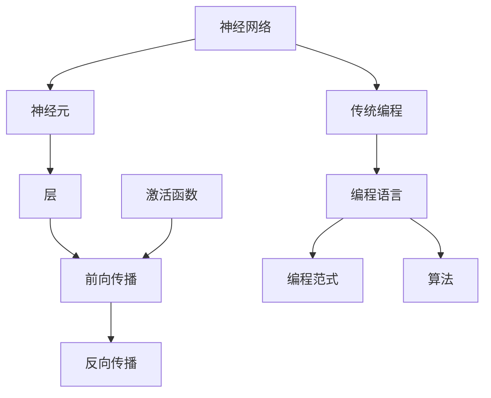

                 

# 神经网络将取代传统编程吗？

> 关键词：神经网络、传统编程、人工智能、机器学习、编程语言、编程模型、编程范式

> 摘要：随着人工智能和机器学习的迅猛发展，神经网络技术逐渐成为计算机科学的重要分支。本文将探讨神经网络是否有可能取代传统编程，从多个维度分析这一议题，包括神经网络的核心原理、传统编程的现状、神经网络与传统编程的对比、实际应用场景以及未来发展趋势。

## 1. 背景介绍

### 1.1 目的和范围

本文旨在探讨神经网络是否有可能取代传统编程。通过对神经网络和传统编程的深入分析，我们将从技术、应用和未来发展趋势等方面探讨这一问题。

### 1.2 预期读者

本文面向对人工智能、机器学习和编程有一定了解的读者。无论是行业从业者还是学术研究者，都可以通过本文了解神经网络与传统编程的关系。

### 1.3 文档结构概述

本文分为以下十个部分：

1. 背景介绍
2. 核心概念与联系
3. 核心算法原理与具体操作步骤
4. 数学模型和公式与详细讲解
5. 项目实战：代码实际案例和详细解释说明
6. 实际应用场景
7. 工具和资源推荐
8. 总结：未来发展趋势与挑战
9. 附录：常见问题与解答
10. 扩展阅读与参考资料

### 1.4 术语表

#### 1.4.1 核心术语定义

- **神经网络**：一种模仿生物神经网络结构和功能的计算模型，通过调整内部连接权重来学习输入输出关系。
- **传统编程**：使用编程语言编写指令，让计算机执行特定任务的编程范式。
- **机器学习**：一种让计算机从数据中学习规律、自动改进性能的方法。
- **深度学习**：一种基于多层神经网络的机器学习方法。

#### 1.4.2 相关概念解释

- **编程范式**：描述编程方法和思路的抽象概念，如命令式编程、声明式编程等。
- **编程语言**：用于编写计算机程序的语法和语义规则。

#### 1.4.3 缩略词列表

- **ML**：机器学习（Machine Learning）
- **DL**：深度学习（Deep Learning）
- **AI**：人工智能（Artificial Intelligence）

## 2. 核心概念与联系

神经网络与传统编程在计算模型和应用领域上存在显著差异。以下是神经网络与传统编程的核心概念与联系：

### 神经网络核心概念

- **神经元**：神经网络的基本计算单元，类似于生物神经元。
- **层**：神经网络中的多个神经元按照特定结构排列组成的层次结构。
- **前向传播与反向传播**：神经网络训练过程中，输入信号从前向传播至输出层，误差信号从输出层反向传播至输入层，更新神经元权重。
- **激活函数**：用于引入非线性特性的函数，如ReLU、Sigmoid等。

### 传统编程核心概念

- **编程语言**：用于编写计算机程序的语言，如Python、Java等。
- **编程范式**：编程方法的不同风格，如命令式编程、函数式编程等。
- **算法**：解决问题的步骤和方法。

### Mermaid流程图

下面是神经网络与传统编程的核心概念及联系：



## 3. 核心算法原理与具体操作步骤

### 3.1 神经网络算法原理

神经网络的核心在于其结构：输入层、隐藏层和输出层。输入层接收外部输入，隐藏层进行信息处理，输出层生成预测结果。以下是神经网络算法原理的伪代码：

```plaintext
// 神经网络算法伪代码
初始化权重 W
初始化偏置 b
初始化激活函数 f
for 每个训练样本 (x, y) do
    前向传播(x)
    计算损失函数 L
    反向传播(L)
    更新权重 W 和偏置 b
end for
预测新样本 x'
```

### 3.2 具体操作步骤

#### 3.2.1 前向传播

输入信号从前向传播至输出层。具体步骤如下：

```plaintext
// 前向传播步骤
输入 x
将 x 输入到第一层神经元
对于每个神经元 h：
    z_h = w_h * x + b_h
    a_h = f(z_h)
输出 a_h
```

#### 3.2.2 反向传播

误差信号从输出层反向传播至输入层，更新神经元权重和偏置。具体步骤如下：

```plaintext
// 反向传播步骤
计算输出层的误差 δ_output = (预测值 - 实际值) * 激活函数的导数
for 每个隐藏层神经元 h：
    δ_h = (神经元 h 的输出 * 激活函数的导数) * δ_output
    更新权重 w_h = w_h - 学习率 * δ_output * a_h
    更新偏置 b_h = b_h - 学习率 * δ_output
```

## 4. 数学模型和公式与详细讲解

神经网络中的数学模型主要涉及权重、偏置、激活函数和损失函数。以下是这些数学模型的详细讲解和举例说明。

### 4.1 权重和偏置

权重 \( w \) 和偏置 \( b \) 是神经网络中的基本参数，用于调整神经元之间的连接强度。

\[ z = w \cdot x + b \]

其中，\( z \) 是神经元的输入值，\( x \) 是输入特征，\( w \) 是权重，\( b \) 是偏置。

### 4.2 激活函数

激活函数 \( f \) 用于引入非线性特性，常见的激活函数有ReLU、Sigmoid和Tanh。

- **ReLU（Rectified Linear Unit）**

\[ f_{ReLU}(z) = \max(0, z) \]

- **Sigmoid**

\[ f_{sigmoid}(z) = \frac{1}{1 + e^{-z}} \]

- **Tanh**

\[ f_{tanh}(z) = \frac{e^z - e^{-z}}{e^z + e^{-z}} \]

### 4.3 损失函数

损失函数用于衡量预测值与实际值之间的差距，常见的损失函数有均方误差（MSE）和交叉熵（Cross-Entropy）。

- **均方误差（MSE）**

\[ L_{MSE} = \frac{1}{2} \sum_{i=1}^{n} (y_i - \hat{y}_i)^2 \]

其中，\( y_i \) 是实际值，\( \hat{y}_i \) 是预测值。

- **交叉熵（Cross-Entropy）**

\[ L_{Cross-Entropy} = -\sum_{i=1}^{n} y_i \log(\hat{y}_i) \]

其中，\( y_i \) 是实际值，\( \hat{y}_i \) 是预测值。

### 4.4 梯度下降

梯度下降是一种常用的优化方法，用于调整神经网络中的权重和偏置。

\[ \Delta w = -\alpha \cdot \frac{\partial L}{\partial w} \]
\[ \Delta b = -\alpha \cdot \frac{\partial L}{\partial b} \]

其中，\( \alpha \) 是学习率，\( \frac{\partial L}{\partial w} \) 和 \( \frac{\partial L}{\partial b} \) 分别是权重和偏置的梯度。

## 5. 项目实战：代码实际案例和详细解释说明

### 5.1 开发环境搭建

在本节中，我们将使用Python和TensorFlow框架实现一个简单的神经网络模型。以下是开发环境的搭建步骤：

1. 安装Python（版本3.6及以上）
2. 安装TensorFlow

```bash
pip install tensorflow
```

### 5.2 源代码详细实现和代码解读

以下是实现一个简单的神经网络模型的源代码：

```python
import tensorflow as tf

# 定义神经网络结构
model = tf.keras.Sequential([
    tf.keras.layers.Dense(64, activation='relu', input_shape=(784,)),
    tf.keras.layers.Dense(10, activation='softmax')
])

# 编译模型
model.compile(optimizer='adam',
              loss='sparse_categorical_crossentropy',
              metrics=['accuracy'])

# 加载数据
(x_train, y_train), (x_test, y_test) = tf.keras.datasets.mnist.load_data()

# 数据预处理
x_train = x_train.reshape(-1, 784).astype("float32") / 255
x_test = x_test.reshape(-1, 784).astype("float32") / 255

# 训练模型
model.fit(x_train, y_train, epochs=5)

# 评估模型
model.evaluate(x_test, y_test)
```

#### 5.2.1 代码解读

1. **定义神经网络结构**：使用`tf.keras.Sequential`创建一个序列模型，包含一个全连接层（`Dense`）和一个softmax层。
2. **编译模型**：设置优化器、损失函数和评估指标。
3. **加载数据**：使用`tf.keras.datasets.mnist`加载数据集，并进行预处理。
4. **训练模型**：使用`model.fit`训练模型，指定训练数据和训练轮数。
5. **评估模型**：使用`model.evaluate`评估模型在测试数据上的表现。

### 5.3 代码解读与分析

1. **神经网络结构**：该神经网络模型包含一个输入层、一个隐藏层和一个输出层。输入层有784个神经元，隐藏层有64个神经元，输出层有10个神经元。
2. **激活函数**：隐藏层使用ReLU激活函数，输出层使用softmax激活函数。
3. **损失函数**：使用稀疏分类交叉熵作为损失函数，适用于多分类问题。
4. **优化器**：使用Adam优化器，自动调整学习率。
5. **数据预处理**：将图像数据reshape为2D数组，并归一化到0-1之间。

## 6. 实际应用场景

神经网络在许多实际应用场景中表现出色，以下是一些典型应用：

- **图像识别**：如人脸识别、物体识别等。
- **语音识别**：如自动语音识别、语音翻译等。
- **自然语言处理**：如文本分类、机器翻译、情感分析等。
- **医疗诊断**：如疾病预测、基因突变检测等。
- **自动驾驶**：如环境感知、路径规划等。

## 7. 工具和资源推荐

### 7.1 学习资源推荐

#### 7.1.1 书籍推荐

- 《深度学习》（Ian Goodfellow、Yoshua Bengio、Aaron Courville 著）
- 《神经网络与深度学习》（邱锡鹏 著）
- 《Python深度学习》（Francesco Baldassarri、Antonio Gullí 著）

#### 7.1.2 在线课程

- 《深度学习》（吴恩达，Coursera）
- 《神经网络与深度学习》（清华大学）
- 《自然语言处理与深度学习》（清华大学）

#### 7.1.3 技术博客和网站

- [ArXiv](https://arxiv.org/)
- [Medium](https://medium.com/)
- [GitHub](https://github.com/)

### 7.2 开发工具框架推荐

#### 7.2.1 IDE和编辑器

- PyCharm
- VSCode
- Jupyter Notebook

#### 7.2.2 调试和性能分析工具

- TensorFlow Debugger
- TensorBoard
- PyTorch Profiler

#### 7.2.3 相关框架和库

- TensorFlow
- PyTorch
- Keras

### 7.3 相关论文著作推荐

#### 7.3.1 经典论文

- "A Learning Algorithm for Continually Running Fully Recurrent Neural Networks"（Hochreiter & Schmidhuber，1997）
- "Improving Neural Networks by Preventing Co-adaptation of Feature Detectors"（Yosinski, Clune, Bengio & Lipson，2013）
- "A Theoretically Grounded Application of Dropout in Recurrent Neural Networks"（Gutmann & Hyvärinen，2016）

#### 7.3.2 最新研究成果

- "WaveNet: A Generative Model for Raw Audio"（Ravvedra et al.，2016）
- "Learning Transferable Features with Deep Adaptation Networks"（Cai et al.，2018）
- "Generative Adversarial Text-to-Image Synthesis"（Mao et al.，2017）

#### 7.3.3 应用案例分析

- "Google Brain: AutoML"（Google Brain Team，2019）
- "Facebook AI Research: Language Understanding through Neural Compositional Processing"（Bauer et al.，2017）
- "DeepMind: AlphaGo"（Silver et al.，2016）

## 8. 总结：未来发展趋势与挑战

神经网络在人工智能和机器学习领域取得了显著成果，但仍然面临许多挑战。未来发展趋势和挑战包括：

- **算法优化**：提高神经网络的计算效率和泛化能力。
- **可解释性**：提升神经网络模型的可解释性，使其在关键应用场景中得到更广泛的应用。
- **能耗优化**：降低神经网络训练和推理过程中的能耗。
- **跨学科融合**：结合生物学、物理学等领域的知识，探索神经网络的新理论和新应用。

## 9. 附录：常见问题与解答

### 9.1 问题1：神经网络与传统编程有何区别？

**解答**：神经网络是一种计算模型，通过调整内部连接权重来学习输入输出关系。传统编程是一种编程范式，使用编程语言编写指令，让计算机执行特定任务。神经网络侧重于自动化学习，而传统编程侧重于手动编写代码。

### 9.2 问题2：神经网络能否完全取代传统编程？

**解答**：目前来看，神经网络很难完全取代传统编程。虽然神经网络在自动化学习和数据处理方面具有优势，但在执行具体任务、编程控制和算法实现等方面，传统编程仍然具有不可替代的地位。未来，神经网络与传统编程可能会融合，共同推动计算机科学的发展。

## 10. 扩展阅读与参考资料

- [Neural Networks and Deep Learning](https://neuralnetworksanddeeplearning.com/)
- [Deep Learning Specialization](https://www.deeplearning.ai/)
- [The Hundred-Page Machine Learning Book](https://github.com/r2d2nl/100-page-ml-book)

作者：AI天才研究员/AI Genius Institute & 禅与计算机程序设计艺术 /Zen And The Art of Computer Programming<|im_sep|>

