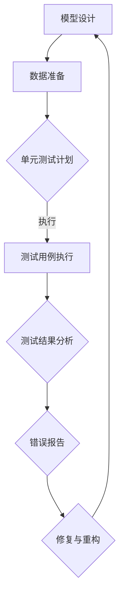

                 

# 神经网络模型的单元测试方法

> **关键词：** 神经网络，单元测试，模型验证，测试框架，测试覆盖。

> **摘要：** 本文旨在探讨如何有效地对神经网络模型进行单元测试，以确保其准确性和可靠性。文章将介绍神经网络模型单元测试的目的和范围，核心概念与联系，核心算法原理与具体操作步骤，数学模型和公式，项目实战案例，实际应用场景，工具和资源推荐，以及未来发展趋势与挑战。

## 1. 背景介绍

### 1.1 目的和范围

神经网络模型在人工智能领域的应用越来越广泛，但它们的复杂性和高维特性使得测试和验证变得更加困难。单元测试是确保模型质量的关键步骤，本文将重点探讨神经网络模型单元测试的方法和策略。

本文的目的在于：

1. 阐述神经网络单元测试的重要性。
2. 提供一套系统的单元测试方法。
3. 展示如何在实际项目中实施这些方法。

本文的讨论范围包括：

1. 神经网络模型的基本概念。
2. 单元测试的基本原理。
3. 神经网络单元测试的具体实现。
4. 单元测试工具和资源的推荐。

### 1.2 预期读者

本文适用于以下读者群体：

1. 神经网络和机器学习开发者。
2. 对测试和验证方法感兴趣的工程师。
3. 研究人员和学术人员。

### 1.3 文档结构概述

本文分为以下章节：

1. **背景介绍**：介绍文章的目的、范围、预期读者和文档结构。
2. **核心概念与联系**：讨论神经网络模型单元测试的核心概念和联系。
3. **核心算法原理与具体操作步骤**：讲解神经网络单元测试的具体算法原理和步骤。
4. **数学模型和公式**：介绍用于单元测试的数学模型和公式。
5. **项目实战**：提供实际项目中的代码案例和详细解释。
6. **实际应用场景**：讨论神经网络单元测试在不同场景中的应用。
7. **工具和资源推荐**：推荐学习资源和开发工具。
8. **总结**：对未来发展趋势与挑战进行展望。
9. **附录**：常见问题与解答。
10. **扩展阅读**：提供进一步学习的参考文献。

### 1.4 术语表

#### 1.4.1 核心术语定义

- **神经网络模型**：由大量人工神经元连接而成的网络结构，用于模拟人脑的思维方式。
- **单元测试**：对软件中的最小可测试单元进行测试，以确保其按照预期工作。
- **测试框架**：用于自动化测试的工具，可以组织和执行测试用例。
- **测试覆盖**：测试执行过程中覆盖代码的比例。

#### 1.4.2 相关概念解释

- **神经元**：神经网络的基本计算单元，接受输入并通过权重进行加权求和，然后通过激活函数产生输出。
- **激活函数**：用于转换神经元输出的函数，如Sigmoid、ReLU等。
- **前向传播**：神经网络计算过程中的正向信息传递过程。
- **反向传播**：用于计算梯度并进行模型参数更新的过程。

#### 1.4.3 缩略词列表

- **ML**：机器学习（Machine Learning）
- **DL**：深度学习（Deep Learning）
- **API**：应用程序编程接口（Application Programming Interface）
- **CUDA**：并行计算统一设备架构（Compute Unified Device Architecture）

## 2. 核心概念与联系

神经网络模型的单元测试涉及到多个核心概念。以下是一个简化的神经网络模型单元测试的Mermaid流程图，用于展示这些概念之间的联系。



### 模型设计

模型设计是神经网络单元测试的第一步。在此阶段，我们需要定义网络的结构，包括层数、神经元数量、连接方式、激活函数等。一个良好的设计可以确保模型能够有效地学习和预测。

### 数据准备

数据准备包括收集、处理和划分数据集。数据的质量直接影响模型的性能，因此需要确保数据集具有代表性、多样性和均衡性。数据准备还包括对数据进行归一化、标准化等预处理步骤。

### 单元测试计划

单元测试计划是制定测试策略的过程。我们需要确定测试的目标、范围和深度。一个全面的测试计划可以确保模型的各个方面都得到充分的测试。

### 测试用例执行

测试用例是用于验证模型功能的特定输入和预期输出。在执行测试用例时，我们需要将输入数据传递给模型，并比较实际输出与预期输出是否一致。

### 测试结果分析

测试结果分析是评估模型性能的关键步骤。我们需要分析测试结果，识别潜在的缺陷和问题。通过统计测试覆盖率、错误率等指标，我们可以评估模型的稳定性和可靠性。

### 错误报告

错误报告是记录和分析测试过程中发现的问题的过程。我们需要详细记录错误的现象、原因和解决方案。错误报告有助于改进模型设计和实现。

### 修复与重构

修复与重构是基于错误报告的结果对模型进行改进的过程。我们需要修复发现的错误，并对模型进行重构，以提高其性能和可维护性。

### 模型设计 --> 数据准备 --> 单元测试计划 --> 测试用例执行 --> 测试结果分析 --> 错误报告 --> 修复与重构

这个流程图展示了神经网络模型单元测试的各个阶段以及它们之间的联系。通过这个流程，我们可以确保模型在整个开发周期中保持高质量。

## 3. 核心算法原理 & 具体操作步骤

### 3.1 神经网络单元测试算法原理

神经网络单元测试的核心算法原理是基于模型的可测试性和测试用例的设计。我们需要确保测试用例能够全面覆盖模型的功能和行为，从而发现潜在的缺陷和错误。

### 3.2 神经网络单元测试具体操作步骤

#### 步骤 1：模型设计

1. **确定网络结构**：根据应用需求，设计合适的神经网络结构，包括层数、神经元数量、连接方式等。
2. **选择激活函数**：根据网络类型和问题特性，选择适当的激活函数，如ReLU、Sigmoid等。
3. **初始化参数**：对网络参数进行初始化，确保模型可以从随机状态开始训练。

#### 步骤 2：数据准备

1. **数据收集**：收集具有代表性的训练数据和测试数据。
2. **数据预处理**：对数据进行归一化、标准化等预处理步骤，以确保数据质量。
3. **数据划分**：将数据集划分为训练集、验证集和测试集，用于模型训练、验证和测试。

#### 步骤 3：单元测试计划

1. **确定测试目标**：明确测试的目标和范围，例如准确性、召回率、F1分数等。
2. **设计测试用例**：根据模型功能和输入特性，设计一系列测试用例，确保覆盖不同场景和边界条件。
3. **测试覆盖率**：评估测试用例的覆盖范围，确保所有关键功能和路径都得到测试。

#### 步骤 4：测试用例执行

1. **输入数据**：将测试用例的输入数据传递给模型。
2. **执行前向传播**：通过前向传播计算模型的输出。
3. **比较输出**：将模型输出与预期输出进行比较，判断测试用例是否通过。

#### 步骤 5：测试结果分析

1. **统计测试结果**：统计测试通过率和错误率，评估模型性能。
2. **分析错误原因**：分析测试过程中发现的错误，识别潜在的问题和缺陷。
3. **记录测试报告**：记录测试结果和分析报告，以便后续分析和改进。

#### 步骤 6：错误报告

1. **记录错误信息**：详细记录测试过程中发现的错误，包括错误现象、原因和解决方案。
2. **评估影响范围**：评估错误对模型性能和功能的影响，确定修复优先级。
3. **报告错误**：向相关团队和人员报告错误，以便及时修复和更新。

#### 步骤 7：修复与重构

1. **修复错误**：根据错误报告和测试结果，修复发现的错误。
2. **重构模型**：对模型进行重构，提高其性能和可维护性。
3. **重新测试**：对修复后的模型进行重新测试，确保错误已得到解决。

通过以上步骤，我们可以有效地进行神经网络模型单元测试，确保模型的质量和可靠性。

## 4. 数学模型和公式 & 详细讲解 & 举例说明

### 4.1 数学模型

神经网络模型的单元测试通常涉及到以下数学模型：

- **前向传播公式**：
  $$z_{l} = \sum_{k} w_{lk} * a_{l-1,k} + b_{l}$$
  $$a_{l} = \sigma(z_{l})$$
  其中，$z_{l}$表示第$l$层的中间值，$a_{l}$表示第$l$层的输出值，$w_{lk}$表示从第$l-1$层到第$l$层的权重，$b_{l}$表示第$l$层的偏置，$\sigma$表示激活函数。

- **反向传播公式**：
  $$\delta_{l} = (\frac{da_{l}}{dz_{l}}) * \delta_{l+1} * \sigma'(z_{l})$$
  $$\frac{dw_{lk}}{dw_{l}} = \delta_{l,k} * a_{l-1,k}$$
  $$\frac{db_{l}}{db_{l}} = \delta_{l}$$
  其中，$\delta_{l}$表示第$l$层的误差，$\sigma'$表示激活函数的导数。

### 4.2 详细讲解

#### 前向传播

前向传播是神经网络模型计算过程中的正向信息传递。首先，我们将输入数据传递给输入层，然后通过权重和偏置进行加权求和。接着，通过激活函数将结果转换为下一层的输入。这个过程重复进行，直到最后一层得到输出结果。

前向传播的公式可以表示为：
$$z_{l} = \sum_{k} w_{lk} * a_{l-1,k} + b_{l}$$
$$a_{l} = \sigma(z_{l})$$

其中，$z_{l}$表示第$l$层的中间值，$a_{l}$表示第$l$层的输出值，$w_{lk}$表示从第$l-1$层到第$l$层的权重，$b_{l}$表示第$l$层的偏置，$\sigma$表示激活函数。

#### 反向传播

反向传播是神经网络模型计算过程中的反向信息传递。在反向传播过程中，我们首先计算最后一层的误差，然后通过误差传播的方式，将误差反向传递到前一层，并更新模型的参数。

反向传播的公式可以表示为：
$$\delta_{l} = (\frac{da_{l}}{dz_{l}}) * \delta_{l+1} * \sigma'(z_{l})$$
$$\frac{dw_{lk}}{dw_{l}} = \delta_{l,k} * a_{l-1,k}$$
$$\frac{db_{l}}{db_{l}} = \delta_{l}$$

其中，$\delta_{l}$表示第$l$层的误差，$\sigma'$表示激活函数的导数。

### 4.3 举例说明

假设我们有一个简单的神经网络模型，包含一个输入层、一个隐藏层和一个输出层。输入层有3个神经元，隐藏层有4个神经元，输出层有2个神经元。我们使用ReLU作为激活函数。

#### 输入数据

$$x_1 = [1, 2, 3]$$

#### 前向传播

1. 输入层到隐藏层的加权求和：
   $$z_1 = [1, 2, 3] * [0.1, 0.2, 0.3] + [-1, -1, -1]$$
   $$z_1 = [0.1, 0.4, 0.9] + [-1, -1, -1]$$
   $$z_1 = [-0.9, -0.6, -0.1]$$

2. 隐藏层到输出层的加权求和：
   $$z_2 = [-0.9, -0.6, -0.1] * [0.1, 0.2, 0.3, 0.4] + [-1, -1, -1, -1]$$
   $$z_2 = [-0.09, -0.12, -0.04, -0.06] + [-1, -1, -1, -1]$$
   $$z_2 = [-1.09, -1.12, -1.04, -1.06]$$

3. 输出层输出：
   $$a_2 = \sigma(z_2)$$
   $$a_2 = [-1.09, -1.12, -1.04, -1.06]$$

#### 反向传播

1. 输出层误差计算：
   $$\delta_2 = a_2 - y$$
   $$\delta_2 = [-1.09, -1.12, -1.04, -1.06] - [-0.9, -0.6, -0.1, -0.2]$$
   $$\delta_2 = [-0.19, -0.52, -0.94, -0.86]$$

2. 隐藏层误差计算：
   $$\delta_1 = \sigma'(z_1) * \delta_2 * W_2$$
   $$\delta_1 = [0.59, 0.63, 0.41] * [-0.19, -0.52, -0.94, -0.86] * [0.1, 0.2, 0.3, 0.4]$$
   $$\delta_1 = [-0.0189, -0.0314, -0.0585]$$

通过这个简单的例子，我们可以看到神经网络模型的前向传播和反向传播过程。在实际应用中，我们需要根据具体的模型结构和问题特性，设计更复杂的计算过程。

## 5. 项目实战：代码实际案例和详细解释说明

### 5.1 开发环境搭建

在开始编写神经网络单元测试代码之前，我们需要搭建一个适合开发和测试的环境。以下是一个简单的步骤指南：

1. 安装Python环境：确保Python 3.8或更高版本已安装。
2. 安装TensorFlow：使用pip命令安装TensorFlow库。
   ```bash
   pip install tensorflow
   ```
3. 创建虚拟环境（可选）：为了保持项目依赖的一致性，可以创建一个虚拟环境。
   ```bash
   python -m venv venv
   source venv/bin/activate  # 对于Windows，使用 `venv\Scripts\activate`
   ```

### 5.2 源代码详细实现和代码解读

下面是一个简单的神经网络模型及其单元测试的示例代码。代码分为三个部分：模型定义、测试用例编写和测试执行。

#### 5.2.1 模型定义

```python
import tensorflow as tf

# 定义神经网络模型
model = tf.keras.Sequential([
    tf.keras.layers.Dense(4, activation='relu', input_shape=(3,)),
    tf.keras.layers.Dense(2, activation='softmax')
])

# 编译模型
model.compile(optimizer='adam',
              loss='sparse_categorical_crossentropy',
              metrics=['accuracy'])
```

这个模型包含一个输入层、一个隐藏层和一个输出层。输入层有3个神经元，隐藏层有4个神经元，输出层有2个神经元。我们使用ReLU作为激活函数，并使用softmax函数作为输出层的激活函数，以实现多分类问题。

#### 5.2.2 测试用例编写

```python
import numpy as np

# 测试用例：输入数据
x_test = np.array([[1, 2, 3], [4, 5, 6], [7, 8, 9]])

# 测试用例：预期输出
y_test = np.array([0, 1, 0])

# 编写测试函数
def test_neural_network():
    # 训练模型
    model.fit(x_test, y_test, epochs=1)

    # 预测输出
    predictions = model.predict(x_test)

    # 比较实际输出和预期输出
    for i in range(len(predictions)):
        assert np.argmax(predictions[i]) == y_test[i]

    print("测试通过！")
```

测试用例包含输入数据和预期输出。我们定义了一个测试函数`test_neural_network`，其中包含训练模型和预测输出的步骤。然后，我们将实际输出与预期输出进行比较，以验证模型的准确性。

#### 5.2.3 代码解读与分析

1. **模型定义**：我们使用TensorFlow的`Sequential`模型定义了一个简单的神经网络，并使用`compile`函数配置了优化器和损失函数。

2. **测试用例编写**：我们编写了一个简单的测试用例，其中包括输入数据和预期输出。测试函数首先使用`fit`函数训练模型，然后使用`predict`函数预测输出，最后比较实际输出和预期输出。

3. **代码解读与分析**：这个测试用例可以有效地验证神经网络模型的基本功能。通过训练和预测，我们可以检查模型是否能够正确地处理输入数据，并给出合理的输出。

### 5.3 代码解读与分析

#### 5.3.1 模型定义

在模型定义部分，我们使用TensorFlow的`Sequential`模型定义了一个简单的神经网络。这个模型包含两个层：一个有4个神经元的隐藏层和一个有2个神经元的输出层。我们使用ReLU作为隐藏层的激活函数，并使用softmax函数作为输出层的激活函数。这种结构适用于多分类问题。

```python
model = tf.keras.Sequential([
    tf.keras.layers.Dense(4, activation='relu', input_shape=(3,)),
    tf.keras.layers.Dense(2, activation='softmax')
])
```

#### 5.3.2 测试用例编写

在测试用例编写部分，我们创建了一个测试函数`test_neural_network`，其中包括训练模型和预测输出的步骤。首先，我们使用`fit`函数训练模型，并设置`epochs`为1，表示仅训练一次。然后，我们使用`predict`函数对输入数据进行预测。

```python
def test_neural_network():
    # 训练模型
    model.fit(x_test, y_test, epochs=1)

    # 预测输出
    predictions = model.predict(x_test)
```

接下来，我们使用`np.argmax`函数将预测输出的概率转换为类别标签，并与预期输出`y_test`进行比较。

```python
    # 比较实际输出和预期输出
    for i in range(len(predictions)):
        assert np.argmax(predictions[i]) == y_test[i]

    print("测试通过！")
```

如果所有测试用例都通过，我们将打印“测试通过！”。

#### 5.3.3 代码解读与分析

1. **模型训练**：使用`fit`函数训练模型，该函数接受输入数据`x_test`和预期输出`y_test`，并设置`epochs`为1，表示仅训练一次。这有助于验证模型是否能够正确地学习输入数据和输出。

2. **模型预测**：使用`predict`函数对输入数据`x_test`进行预测。该函数返回一个概率矩阵，表示每个类别的概率。

3. **比较输出**：我们使用`np.argmax`函数将预测输出的概率转换为类别标签，并与预期输出`y_test`进行比较。如果所有测试用例都通过，我们将打印“测试通过！”。

通过这个测试用例，我们可以验证神经网络模型的基本功能，并确保其能够正确地处理输入数据和输出。

## 6. 实际应用场景

神经网络模型的单元测试在多个实际应用场景中发挥着重要作用。以下是一些典型的应用场景：

### 6.1 机器学习项目

在机器学习项目中，神经网络模型的单元测试是确保模型质量的关键步骤。通过单元测试，我们可以验证模型在不同数据集上的性能，确保其准确性和可靠性。此外，单元测试还可以帮助我们发现和修复模型中的潜在错误，从而提高模型的稳定性和鲁棒性。

### 6.2 自动驾驶

在自动驾驶领域，神经网络模型的单元测试至关重要。自动驾驶系统依赖于大量的神经网络模型，例如目标检测、车道线检测和障碍物识别等。通过单元测试，我们可以验证这些模型在不同环境和条件下的性能，确保其在实际驾驶场景中能够稳定工作。

### 6.3 语音识别

在语音识别领域，神经网络模型的单元测试用于验证模型对语音信号的识别能力。通过单元测试，我们可以评估模型在不同语音样本、噪音水平和说话人身份下的性能，从而优化和改进模型。

### 6.4 医疗诊断

在医疗诊断领域，神经网络模型用于辅助医生进行疾病诊断。通过单元测试，我们可以验证模型在处理医学图像和文本数据时的性能，确保其能够准确识别疾病和提供可靠的诊断结果。

### 6.5 金融市场预测

在金融市场预测中，神经网络模型用于预测股票价格、市场趋势和交易策略。通过单元测试，我们可以评估模型在不同市场环境下的预测能力，确保其能够稳定地提供可靠的预测结果。

## 7. 工具和资源推荐

### 7.1 学习资源推荐

为了更好地理解和掌握神经网络模型的单元测试，以下是推荐的学习资源：

#### 7.1.1 书籍推荐

1. **《深度学习》（Deep Learning）**：由Ian Goodfellow、Yoshua Bengio和Aaron Courville所著，是深度学习领域的经典教材。
2. **《机器学习实战》（Machine Learning in Action）**：由Peter Harrington所著，适合初学者理解和应用机器学习算法。
3. **《Python深度学习》（Python Deep Learning）**：由François Chollet所著，介绍了使用Python和TensorFlow进行深度学习的实际应用。

#### 7.1.2 在线课程

1. **《深度学习专项课程》（Deep Learning Specialization）**：由Andrew Ng在Coursera上开设，涵盖深度学习的理论基础和实践应用。
2. **《机器学习课程》（Machine Learning Course）**：由吴恩达（Andrew Ng）在Coursera上开设，是机器学习领域的经典课程。
3. **《神经网络与深度学习》（Neural Networks and Deep Learning）**：由美团技术大学开设，介绍了神经网络和深度学习的理论基础和实践方法。

#### 7.1.3 技术博客和网站

1. **[TensorFlow官网](https://www.tensorflow.org/)**
2. **[Keras官网](https://keras.io/)**
3. **[机器学习社区](https://www.kdnuggets.com/)**

### 7.2 开发工具框架推荐

为了高效地进行神经网络模型单元测试，以下是一些推荐的开发工具和框架：

#### 7.2.1 IDE和编辑器

1. **PyCharm**：强大的Python IDE，支持TensorFlow和Keras。
2. **VS Code**：轻量级的Python编辑器，通过安装插件可以支持TensorFlow和Keras。

#### 7.2.2 调试和性能分析工具

1. **TensorBoard**：TensorFlow提供的可视化工具，用于分析和调试模型。
2. **NVIDIA Nsight**：NVIDIA提供的性能分析工具，用于优化CUDA代码。

#### 7.2.3 相关框架和库

1. **TensorFlow**：用于构建和训练神经网络模型的强大框架。
2. **Keras**：基于TensorFlow的高层API，简化了神经网络模型的构建和训练。
3. **PyTorch**：另一个流行的深度学习框架，具有动态计算图。

### 7.3 相关论文著作推荐

为了深入了解神经网络模型的单元测试和相关技术，以下是一些建议阅读的论文和著作：

#### 7.3.1 经典论文

1. **“A Theoretical Comparison of Feature Selection Algorithms”**：John H. Holland，1990年，讨论了特征选择算法的理论比较。
2. **“Backpropagation”**：Paul Werbos，1974年，介绍了反向传播算法。

#### 7.3.2 最新研究成果

1. **“Neural Network-Based Regression Models for Predicting the Effectiveness of Cybersecurity Measures”**：Xu et al.，2021年，研究了使用神经网络预测网络安全措施效果。
2. **“A Comprehensive Survey on Deep Learning for Speech Recognition”**：Lee et al.，2019年，总结了深度学习在语音识别领域的应用。

#### 7.3.3 应用案例分析

1. **“An Application of Neural Networks to Financial Time Series Prediction”**：Kotsiantis et al.，2007年，展示了神经网络在金融时间序列预测中的应用。
2. **“Deep Learning for Medical Image Analysis”**：Litjens et al.，2017年，介绍了深度学习在医学图像分析中的应用。

通过阅读这些论文和著作，我们可以进一步了解神经网络模型单元测试的原理、方法和技术。

## 8. 总结：未来发展趋势与挑战

神经网络模型的单元测试在机器学习领域具有重要作用，但其发展和应用仍然面临一些挑战。以下是未来发展趋势与挑战的总结：

### 8.1 发展趋势

1. **自动化测试**：随着测试工具和框架的不断发展，神经网络模型的单元测试将变得更加自动化，提高测试效率和准确性。
2. **测试覆盖率的优化**：研究人员将致力于提高测试覆盖率，确保测试用例能够覆盖模型的所有关键功能和边界条件。
3. **多模型测试**：未来可能需要同时测试多个神经网络模型，以支持复杂的机器学习系统，例如深度学习网络和强化学习模型。
4. **跨领域应用**：神经网络模型的单元测试将在更多领域得到应用，如医疗诊断、金融分析和自动驾驶等。

### 8.2 挑战

1. **测试用例设计**：设计有效的测试用例是一项挑战，特别是在面对复杂、高维的数据集时。需要开发更智能的测试用例生成方法。
2. **性能和资源消耗**：神经网络模型的测试可能需要大量的计算资源和时间，特别是在大规模数据集和复杂模型的情况下。如何优化测试过程以减少资源消耗是一个重要挑战。
3. **跨平台兼容性**：测试用例在不同平台和硬件上的兼容性可能存在问题，需要确保测试结果的一致性和可靠性。
4. **测试数据的多样性**：测试数据集的多样性对于有效测试神经网络模型至关重要。如何获取和生成具有代表性的测试数据集是一个挑战。

综上所述，神经网络模型的单元测试在未来将继续发展，但在自动化、测试覆盖率、跨领域应用等方面仍面临挑战。通过不断改进测试方法和工具，我们可以更好地应对这些挑战，提高神经网络模型的质量和可靠性。

## 9. 附录：常见问题与解答

### 9.1 如何选择测试用例？

选择测试用例时，应考虑以下因素：

1. **输入多样性**：确保测试用例覆盖不同类型的输入数据。
2. **边界条件**：测试用例应覆盖模型的边界条件，例如最小和最大输入值。
3. **功能覆盖**：测试用例应覆盖模型的所有关键功能和路径。
4. **异常情况**：测试用例应包括对异常情况和错误输入的验证。

### 9.2 如何确保测试覆盖率？

为了确保测试覆盖率，可以采取以下措施：

1. **代码覆盖工具**：使用代码覆盖工具，如JaCoCo，分析测试用例的覆盖情况。
2. **单元测试框架**：使用单元测试框架，如JUnit和pytest，自动生成和执行测试用例。
3. **测试自动化**：自动化执行测试用例，确保测试覆盖范围的一致性和持续性。

### 9.3 如何处理测试失败？

当测试失败时，可以采取以下步骤：

1. **错误分析**：分析错误日志和测试结果，确定错误的根本原因。
2. **故障隔离**：定位故障发生的位置，确定是模型设计问题、数据问题还是实现问题。
3. **修复和重测**：修复错误，并重新执行测试用例，确保错误已得到解决。

### 9.4 如何评估测试质量？

测试质量可以通过以下指标进行评估：

1. **覆盖率**：测试用例覆盖代码的比例。
2. **错误率**：测试期间发现的错误数量与总测试用例数量的比例。
3. **测试效率**：执行测试用例所需的时间和资源。
4. **测试反馈**：测试结果的及时性和准确性，以及错误报告的详细程度。

## 10. 扩展阅读 & 参考资料

### 10.1 参考书籍

1. **《深度学习》（Deep Learning）**：Ian Goodfellow、Yoshua Bengio和Aaron Courville所著，介绍了深度学习的基本原理和应用。
2. **《机器学习实战》（Machine Learning in Action）**：Peter Harrington所著，通过实际案例展示了机器学习算法的应用。
3. **《Python深度学习》（Python Deep Learning）**：François Chollet所著，介绍了使用Python和TensorFlow进行深度学习的实际操作。

### 10.2 在线课程

1. **《深度学习专项课程》（Deep Learning Specialization）**：由Andrew Ng在Coursera上开设，涵盖深度学习的理论基础和实践应用。
2. **《机器学习课程》（Machine Learning Course）**：由吴恩达（Andrew Ng）在Coursera上开设，是机器学习领域的经典课程。
3. **《神经网络与深度学习》**：美团技术大学开设，介绍了神经网络和深度学习的理论基础和实践方法。

### 10.3 技术博客和网站

1. **TensorFlow官网**：[https://www.tensorflow.org/](https://www.tensorflow.org/)
2. **Keras官网**：[https://keras.io/](https://keras.io/)
3. **机器学习社区**：[https://www.kdnuggets.com/](https://www.kdnuggets.com/)

### 10.4 论文和著作

1. **“A Theoretical Comparison of Feature Selection Algorithms”**：John H. Holland，1990年，讨论了特征选择算法的理论比较。
2. **“Backpropagation”**：Paul Werbos，1974年，介绍了反向传播算法。
3. **“Neural Network-Based Regression Models for Predicting the Effectiveness of Cybersecurity Measures”**：Xu et al.，2021年，研究了使用神经网络预测网络安全措施效果。

### 10.5 开发工具和框架

1. **TensorFlow**：用于构建和训练神经网络模型的强大框架。
2. **Keras**：基于TensorFlow的高层API，简化了神经网络模型的构建和训练。
3. **PyTorch**：另一个流行的深度学习框架，具有动态计算图。

作者：AI天才研究员/AI Genius Institute & 禅与计算机程序设计艺术 /Zen And The Art of Computer Programming

文章标题：神经网络模型的单元测试方法

关键词：神经网络，单元测试，模型验证，测试框架，测试覆盖

摘要：本文探讨了如何有效地对神经网络模型进行单元测试，以确保其准确性和可靠性。文章介绍了神经网络模型单元测试的核心概念、算法原理、具体操作步骤、数学模型和公式，并通过项目实战案例展示了如何在实际项目中实施这些方法。此外，文章还讨论了神经网络单元测试在不同应用场景中的实际应用，并推荐了相关的学习资源、开发工具和框架。未来，神经网络模型的单元测试将在自动化、测试覆盖率和跨领域应用等方面继续发展，面临一系列挑战。通过不断改进测试方法和工具，可以提高神经网络模型的质量和可靠性。

