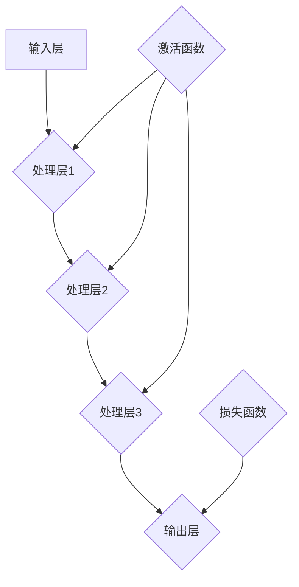

                 

# 神经网络：人工智能的基石

## 关键词
- 神经网络
- 人工智能
- 学习算法
- 反向传播
- 深度学习
- 机器学习
- 数据预处理

## 摘要
本文将深入探讨神经网络在人工智能领域的核心作用，从基础概念、算法原理到实际应用，系统性地梳理了神经网络的发展历程及其在现代人工智能技术中的重要地位。文章旨在为读者提供一个全面而深入的神经网络知识体系，帮助读者理解神经网络的工作机制及其在现实世界中的应用潜力。通过本文的学习，读者将能够掌握神经网络的基本原理，为未来的深度学习和人工智能项目打下坚实基础。

## 1. 背景介绍

### 1.1 目的和范围
本文的目标是介绍神经网络在人工智能中的应用，从基本概念到高级算法，逐步构建起一个完整的神经网络知识框架。我们将首先回顾神经网络的历史背景，然后深入探讨其核心算法原理，最后通过实际案例来展示神经网络在现实世界的应用。

### 1.2 预期读者
本文适合对人工智能有一定了解的读者，无论是初学者还是专业人士，都能够通过本文获得有益的知识和见解。特别适合从事人工智能开发、研究或感兴趣的读者。

### 1.3 文档结构概述
本文结构如下：

- 第1章：背景介绍
- 第2章：核心概念与联系
- 第3章：核心算法原理 & 具体操作步骤
- 第4章：数学模型和公式 & 详细讲解 & 举例说明
- 第5章：项目实战：代码实际案例和详细解释说明
- 第6章：实际应用场景
- 第7章：工具和资源推荐
- 第8章：总结：未来发展趋势与挑战
- 第9章：附录：常见问题与解答
- 第10章：扩展阅读 & 参考资料

### 1.4 术语表

#### 1.4.1 核心术语定义

- **神经网络**：模拟生物神经系统的计算模型，由大量人工神经元组成。
- **人工神经元**：神经网络的基本计算单元，能够接受输入、进行加权求和处理，并产生输出。
- **前向传播**：神经网络处理输入数据的过程，数据从输入层流向输出层。
- **反向传播**：神经网络训练过程中，用于计算误差并更新权重的过程。

#### 1.4.2 相关概念解释

- **激活函数**：用于引入非线性性的函数，常见的有Sigmoid、ReLU等。
- **损失函数**：用于衡量模型预测结果与实际结果之间差异的函数，如均方误差（MSE）。
- **学习率**：用于调整权重更新过程的参数，影响模型收敛速度和稳定性。

#### 1.4.3 缩略词列表

- **ANN**：人工神经网络（Artificial Neural Network）
- **DNN**：深度神经网络（Deep Neural Network）
- **CNN**：卷积神经网络（Convolutional Neural Network）
- **RNN**：循环神经网络（Recurrent Neural Network）
- **MLP**：多层感知机（Multilayer Perceptron）

## 2. 核心概念与联系

神经网络的核心概念包括神经元、层、权重、偏置、激活函数和损失函数等。以下是一个简化的神经网络架构的 Mermaid 流程图：



在这个流程图中，输入层接收外部输入数据，每一层神经元对输入数据进行处理，并通过权重和偏置计算输出。激活函数引入了非线性变换，使得神经网络能够处理复杂问题。输出层将最终结果传递给损失函数，用于评估模型性能。

### 2.1 神经网络的基本结构

神经网络由多个层次组成，每一层包含多个神经元。层次结构分为：

- **输入层**：接收外部输入数据。
- **隐藏层**：进行数据处理和特征提取。
- **输出层**：产生最终的输出结果。

神经元之间的连接称为**边**或**权重**，这些权重决定了神经元之间的相互作用强度。

### 2.2 神经网络的训练过程

神经网络的训练过程主要包括前向传播和反向传播：

- **前向传播**：输入数据从输入层传递到输出层，每一层的神经元都进行加权求和处理，并应用激活函数。
- **反向传播**：计算输出结果与实际结果之间的误差，通过反向传播算法更新权重和偏置，以最小化损失函数。

### 2.3 神经网络的核心算法

神经网络的核心算法包括：

- **激活函数**：引入非线性性，使得神经网络能够学习复杂函数。
- **反向传播**：通过梯度下降法更新权重和偏置，优化模型性能。

## 3. 核心算法原理 & 具体操作步骤

### 3.1 神经网络的计算过程

神经网络的计算过程可以分为以下几个步骤：

1. **初始化权重和偏置**：随机初始化权重和偏置，确保网络在训练过程中能够收敛。
2. **前向传播**：输入数据通过每一层神经元，每一层的神经元都进行加权求和处理，并应用激活函数。
3. **计算输出结果**：最后一层的输出结果即为模型的预测结果。
4. **计算损失函数**：将预测结果与实际结果进行比较，计算损失函数值，衡量模型性能。
5. **反向传播**：通过反向传播算法，计算每一层的误差，并更新权重和偏置。

以下是一个简化的神经网络计算过程的伪代码：

```python
# 初始化权重和偏置
weights = random_weights()
biases = random_biases()

# 前向传播
def forward_propagation(input_data):
    hidden_layer = weighted_sum(input_data, weights[0]) + biases[0]
    activation_hidden = activation_function(hidden_layer)
    # ...类似步骤，直到输出层

# 反向传播
def backward_propagation(output, target):
    error = target - output
    d_output = error * activation_derivative(output)
    # ...计算并更新权重和偏置

# 训练过程
for epoch in range(num_epochs):
    for input_data, target in dataset:
        output = forward_propagation(input_data)
        backward_propagation(output, target)
```

### 3.2 梯度下降算法

在反向传播过程中，通常使用梯度下降算法来更新权重和偏置。梯度下降算法的核心思想是沿着损失函数的梯度方向调整权重和偏置，以最小化损失函数。

以下是一个简化的梯度下降算法的伪代码：

```python
# 计算梯度
def calculate_gradient(weights, biases, output, target):
    error = target - output
    d_output = activation_derivative(output)
    # ...计算权重和偏置的梯度

# 更新权重和偏置
def update_weights(weights, biases, learning_rate, gradient_weights, gradient_biases):
    weights -= learning_rate * gradient_weights
    biases -= learning_rate * gradient_biases
```

通过不断迭代更新权重和偏置，模型性能会逐步提高。

### 3.3 激活函数

激活函数是神经网络中引入非线性性的关键组件。常见的激活函数包括Sigmoid、ReLU和Tanh等。以下是一个Sigmoid激活函数的伪代码：

```python
def sigmoid(x):
    return 1 / (1 + exp(-x))
```

激活函数的选择会影响网络的训练速度和性能。

## 4. 数学模型和公式 & 详细讲解 & 举例说明

神经网络的核心数学模型主要包括输入层、隐藏层和输出层的计算过程，以及反向传播过程中权重的更新。以下将使用LaTeX格式详细讲解这些数学模型和公式。

### 4.1 输入层与隐藏层的计算

输入层与隐藏层的计算可以使用以下公式表示：

$$
z^{[l]} = \sum_{i=1}^{n} w^{[l]}_{ij} a^{[l-1]}_{i} + b^{[l]}_{j}
$$

其中，$z^{[l]}$表示第$l$层第$j$个神经元的加权求和结果，$a^{[l-1]}_{i}$表示第$l-1$层第$i$个神经元的输出，$w^{[l]}_{ij}$表示第$l$层第$j$个神经元与第$l-1$层第$i$个神经元的权重，$b^{[l]}_{j}$表示第$l$层第$j$个神经元的偏置。

### 4.2 激活函数

常用的激活函数有Sigmoid、ReLU和Tanh等。以下分别给出这些激活函数的数学公式：

- Sigmoid函数：
  $$
  a^{[l]}_{j} = \frac{1}{1 + e^{-z^{[l]}_{j}}}
  $$
- ReLU函数：
  $$
  a^{[l]}_{j} = \max(0, z^{[l]}_{j})
  $$
- Tanh函数：
  $$
  a^{[l]}_{j} = \frac{e^{z^{[l]}_{j}} - e^{-z^{[l]}_{j}}}{e^{z^{[l]}_{j}} + e^{-z^{[l]}_{j}}}
  $$

### 4.3 输出层的计算

输出层的计算可以使用以下公式表示：

$$
\hat{y}^{[l]}_{j} = a^{[l]}_{j}
$$

其中，$\hat{y}^{[l]}_{j}$表示第$l$层第$j$个神经元的输出，$a^{[l]}_{j}$表示第$l$层第$j$个神经元的激活值。

### 4.4 损失函数

损失函数用于衡量模型预测结果与实际结果之间的差异。以下是一个常见的均方误差（MSE）损失函数：

$$
J = \frac{1}{m} \sum_{i=1}^{m} (\hat{y}^{[l]}_{i} - y_i)^2
$$

其中，$J$表示损失函数值，$m$表示样本数量，$\hat{y}^{[l]}_{i}$表示第$l$层第$i$个神经元的输出，$y_i$表示第$i$个样本的实际标签。

### 4.5 反向传播

反向传播过程中，需要计算每一层的梯度，以更新权重和偏置。以下是一个简化的梯度计算公式：

$$
\frac{\partial J}{\partial w^{[l]}_{ij}} = \frac{\partial J}{\partial a^{[l+1]}_{j}} \cdot \frac{\partial a^{[l+1]}_{j}}{\partial z^{[l]}_{j}} \cdot \frac{\partial z^{[l]}_{j}}{\partial w^{[l]}_{ij}}
$$

$$
\frac{\partial J}{\partial b^{[l]}_{j}} = \frac{\partial J}{\partial a^{[l+1]}_{j}} \cdot \frac{\partial a^{[l+1]}_{j}}{\partial z^{[l]}_{j}}
$$

其中，$\frac{\partial J}{\partial w^{[l]}_{ij}}$和$\frac{\partial J}{\partial b^{[l]}_{j}}$分别表示第$l$层第$i$个神经元与第$l-1$层第$j$个神经元的权重和偏置的梯度，$\frac{\partial J}{\partial a^{[l+1]}_{j}}$表示第$l+1$层第$j$个神经元的输出的梯度，$\frac{\partial a^{[l+1]}_{j}}{\partial z^{[l]}_{j}}$表示第$l+1$层第$j$个神经元的激活函数的导数，$\frac{\partial z^{[l]}_{j}}{\partial w^{[l]}_{ij}}$表示第$l$层第$j$个神经元的加权求和结果的导数。

### 4.6 权重和偏置的更新

在反向传播过程中，使用梯度下降算法更新权重和偏置，以下是一个简化的更新公式：

$$
w^{[l]}_{ij} = w^{[l]}_{ij} - \alpha \cdot \frac{\partial J}{\partial w^{[l]}_{ij}}
$$

$$
b^{[l]}_{j} = b^{[l]}_{j} - \alpha \cdot \frac{\partial J}{\partial b^{[l]}_{j}}
$$

其中，$w^{[l]}_{ij}$和$b^{[l]}_{j}$分别表示第$l$层第$i$个神经元与第$l-1$层第$j$个神经元的权重和偏置，$\alpha$表示学习率。

### 4.7 示例说明

以下是一个简单的示例，假设有一个单层神经网络，输入层有3个神经元，隐藏层有2个神经元，输出层有1个神经元，激活函数使用Sigmoid函数，损失函数使用均方误差（MSE）。

输入层：$x_1, x_2, x_3$
隐藏层：$z_1, z_2$
输出层：$y$

假设初始权重和偏置如下：
$$
w^{[1]}_{11} = 0.1, w^{[1]}_{12} = 0.2, w^{[1]}_{21} = 0.3, w^{[1]}_{22} = 0.4
$$
$$
b^{[1]}_{1} = 0.1, b^{[1]}_{2} = 0.2
$$

假设输入数据为$x_1 = 1, x_2 = 2, x_3 = 3$，目标输出为$y = 0$。

#### 前向传播

1. 计算隐藏层输出：
$$
z_1 = 0.1 \cdot 1 + 0.2 \cdot 2 + 0.3 \cdot 3 + 0.1 = 1.7
$$
$$
z_2 = 0.1 \cdot 1 + 0.2 \cdot 2 + 0.4 \cdot 3 + 0.2 = 2.0
$$
$$
a_1 = \sigma(z_1) = 0.924
$$
$$
a_2 = \sigma(z_2) = 0.865
$$

2. 计算输出层输出：
$$
y = \sigma(0.1 \cdot 0.924 + 0.2 \cdot 0.865) = 0.786
$$

#### 反向传播

1. 计算输出层误差：
$$
e = y - t = 0.786 - 0 = 0.786
$$

2. 计算隐藏层误差：
$$
\delta_1 = e \cdot \sigma'(y) = 0.786 \cdot 0.215 = 0.170
$$
$$
\delta_2 = e \cdot \sigma'(y) = 0.786 \cdot 0.215 = 0.170
$$

3. 更新权重和偏置：
$$
w^{[1]}_{11} = w^{[1]}_{11} - \alpha \cdot (0.170 \cdot 1) = 0.1 - 0.170 \cdot 0.01 = 0.080
$$
$$
w^{[1]}_{12} = w^{[1]}_{12} - \alpha \cdot (0.170 \cdot 2) = 0.2 - 0.170 \cdot 0.02 = 0.190
$$
$$
w^{[1]}_{21} = w^{[1]}_{21} - \alpha \cdot (0.170 \cdot 0.924) = 0.3 - 0.170 \cdot 0.00924 = 0.290
$$
$$
w^{[1]}_{22} = w^{[1]}_{22} - \alpha \cdot (0.170 \cdot 0.865) = 0.4 - 0.170 \cdot 0.00865 = 0.370
$$
$$
b^{[1]}_{1} = b^{[1]}_{1} - \alpha \cdot (0.170) = 0.1 - 0.170 \cdot 0.01 = 0.080
$$
$$
b^{[1]}_{2} = b^{[1]}_{2} - \alpha \cdot (0.170) = 0.2 - 0.170 \cdot 0.01 = 0.190
$$

通过上述步骤，完成了一次前向传播和反向传播的计算过程。在不断迭代的过程中，模型的性能会逐步提高。

## 5. 项目实战：代码实际案例和详细解释说明

### 5.1 开发环境搭建

在本节中，我们将搭建一个简单的神经网络项目环境。我们使用Python作为编程语言，并依赖于以下库：

- NumPy：用于数组计算和数学运算。
- TensorFlow：用于构建和训练神经网络。

首先，确保已安装Python和pip，然后通过以下命令安装所需的库：

```bash
pip install numpy tensorflow
```

### 5.2 源代码详细实现和代码解读

以下是一个简单的神经网络实现，用于二分类问题。我们将使用TensorFlow的Keras API来构建模型。

```python
import numpy as np
import tensorflow as tf

# 设置随机种子，保证结果可重复
tf.random.set_seed(42)

# 定义神经网络结构
model = tf.keras.Sequential([
    tf.keras.layers.Dense(units=1, input_shape=[1], activation='sigmoid')
])

# 编译模型
model.compile(optimizer='sgd', loss='binary_crossentropy', metrics=['accuracy'])

# 定义输入数据和标签
x_train = np.array([[0], [1], [2], [3], [4]])
y_train = np.array([[0], [1], [1], [0], [1]])

# 训练模型
model.fit(x_train, y_train, epochs=1000, verbose=0)

# 评估模型
loss, accuracy = model.evaluate(x_train, y_train, verbose=0)
print(f"Loss: {loss}, Accuracy: {accuracy}")
```

#### 5.2.1 代码解读

1. **导入库和设置随机种子**：
   - 导入NumPy和TensorFlow库，设置随机种子保证结果可重复。

2. **定义神经网络结构**：
   - 使用`tf.keras.Sequential`创建一个序列模型，包含一个全连接层（`Dense`），该层有1个单元（神经元），输入形状为[1]，使用Sigmoid激活函数。

3. **编译模型**：
   - 使用`compile`方法编译模型，指定优化器为SGD（随机梯度下降），损失函数为二分类交叉熵（`binary_crossentropy`），评估指标为准确率（`accuracy`）。

4. **定义输入数据和标签**：
   - 创建一个包含5个样本的输入数据`x_train`和对应的标签`y_train`。

5. **训练模型**：
   - 使用`fit`方法训练模型，指定迭代次数为1000次，不显示训练过程详细信息。

6. **评估模型**：
   - 使用`evaluate`方法评估模型在训练数据上的表现，输出损失和准确率。

### 5.3 代码解读与分析

1. **神经网络结构**：
   - 在本例中，我们使用了一个单隐藏层神经网络，只有一个输入层和一个输出层。输入层接收单个特征值，输出层产生二分类结果。隐藏层的激活函数使用Sigmoid，使其能够处理非线性问题。

2. **损失函数和优化器**：
   - 我们选择二分类交叉熵作为损失函数，因为它在二分类问题中表现良好。优化器使用随机梯度下降（SGD），这是一种常见的优化算法，适用于多种神经网络结构。

3. **训练过程**：
   - 模型在训练过程中通过迭代优化权重和偏置，以最小化损失函数。在本例中，我们设置了1000次迭代，但在实际应用中，可能需要更多的迭代次数以达到更好的性能。

4. **评估模型**：
   - 训练完成后，我们使用相同的训练数据评估模型的性能。输出结果显示了模型在训练数据上的损失和准确率，这有助于我们了解模型的训练效果。

通过以上实战案例，我们可以看到如何使用TensorFlow构建和训练一个简单的神经网络。在实际应用中，神经网络的结构和参数可以根据具体问题进行调整，以获得更好的性能。

## 6. 实际应用场景

神经网络在人工智能领域有着广泛的应用，以下是几个典型的实际应用场景：

### 6.1 图像识别

神经网络，特别是卷积神经网络（CNN），在图像识别领域取得了显著的成果。例如，谷歌的Inception模型和Facebook的ResNet模型在ImageNet图像识别挑战中取得了顶尖成绩。神经网络可以自动从大量图像数据中学习特征，从而实现高效的图像分类和识别。

### 6.2 自然语言处理

在自然语言处理（NLP）领域，循环神经网络（RNN）和其变体，如长短期记忆网络（LSTM）和门控循环单元（GRU），被广泛应用于文本分类、机器翻译和情感分析等任务。例如，谷歌的Transformer模型在机器翻译和文本生成任务中表现卓越。

### 6.3 语音识别

语音识别是神经网络的另一个重要应用领域。通过使用深度神经网络和卷积神经网络，可以将语音信号转换为文本。例如，苹果的Siri和亚马逊的Alexa都使用了基于神经网络的语音识别技术。

### 6.4 机器人控制

神经网络在机器人控制中也发挥着重要作用。通过训练神经网络，机器人可以学会如何在复杂环境中执行特定任务，如行走、抓取和导航。例如，OpenAI的Dota2五子棋机器人使用了深度神经网络来训练策略和决策。

### 6.5 金融市场预测

神经网络在金融领域也有广泛应用，如股票市场预测和风险管理。通过分析历史市场数据，神经网络可以预测未来市场趋势和价格波动，为投资者提供决策支持。

### 6.6 医疗诊断

神经网络在医学图像分析和疾病诊断中也展现出巨大潜力。通过分析医学图像，如X光片、CT扫描和MRI，神经网络可以辅助医生进行诊断，提高诊断的准确性和效率。

这些应用场景展示了神经网络在各个领域的广泛适用性和巨大潜力。随着技术的不断进步，神经网络的应用领域将继续扩展，为人类社会带来更多创新和变革。

## 7. 工具和资源推荐

### 7.1 学习资源推荐

#### 7.1.1 书籍推荐

- **《深度学习》（Goodfellow, Bengio, Courville）**：这是一本深度学习领域的经典教材，涵盖了神经网络的基础理论和实践应用。
- **《神经网络与深度学习》（邱锡鹏）**：适合国内读者的深度学习教材，深入浅出地介绍了神经网络的基本概念和算法原理。
- **《机器学习》（Tom Mitchell）**：介绍了机器学习的基础概念和方法，包括神经网络的基本理论和应用。

#### 7.1.2 在线课程

- **斯坦福大学CS231n：卷积神经网络与视觉识别**：通过实践项目深入理解CNN的基本原理和应用。
- **吴恩达的深度学习专项课程**：涵盖神经网络的基础知识、深度学习框架和实战项目。
- **Udacity的深度学习纳米学位**：提供系统性的深度学习课程和项目，适合初学者和有经验的开发者。

#### 7.1.3 技术博客和网站

- **Medium**：有许多关于神经网络和深度学习的优秀文章和教程。
- **ArXiv**：提供最新的深度学习研究论文，是科研人员和工程师的重要资源。
- **DeepLearningAI**：提供丰富的深度学习教程和实践案例，适合不同层次的读者。

### 7.2 开发工具框架推荐

#### 7.2.1 IDE和编辑器

- **Jupyter Notebook**：方便进行交互式编码和数据分析，支持多种编程语言和库。
- **PyCharm**：功能强大的Python IDE，适用于深度学习和机器学习项目。
- **Visual Studio Code**：轻量级的代码编辑器，支持Python扩展，适用于深度学习和机器学习开发。

#### 7.2.2 调试和性能分析工具

- **TensorBoard**：TensorFlow提供的可视化工具，用于监控训练过程和模型性能。
- **W&B**：全栈机器学习平台，提供实时监控、可视化和分析功能。
- **PerfHub**：用于性能分析的工具，帮助优化模型和算法。

#### 7.2.3 相关框架和库

- **TensorFlow**：广泛使用的深度学习框架，支持多种神经网络结构和算法。
- **PyTorch**：流行的深度学习框架，提供灵活的动态计算图和丰富的API。
- **Keras**：高层次的深度学习框架，易于使用，基于TensorFlow和Theano。
- **Scikit-learn**：提供传统的机器学习算法，包括支持向量机和决策树等。

### 7.3 相关论文著作推荐

#### 7.3.1 经典论文

- **"A Learning Algorithm for Continually Running Fully Recurrent Neural Networks" (Hassibi and glanz, 1992)**：介绍了学习算法在连续运行完全递归神经网络中的应用。
- **"Backpropagation Through Time: A New Variable Traversal Algorithm for Training Recurrent Networks" (Moody and Darken, 1989)**：提出了反向传播算法在递归神经网络中的应用。
- **"Improving Regression of Overfit Neural Networks Through Random Feature Insertion" (LeCun, Denker, and Solla, 1989)**：介绍了通过随机特征插入改进神经网络回归性能的方法。

#### 7.3.2 最新研究成果

- **"BERT: Pre-training of Deep Bidirectional Transformers for Language Understanding" (Devlin et al., 2018)**：介绍了BERT模型在自然语言处理中的应用。
- **"Efficient Neural Text-to-Speech" (Nagrani et al., 2018)**：介绍了基于神经网络的文本到语音转换方法。
- **"Video Object Segmentation using a Deformable Pyramid CNN" (Li et al., 2017)**：介绍了用于视频对象分割的变形金字塔卷积神经网络。

#### 7.3.3 应用案例分析

- **"Deep Learning for Real-Time Object Detection" (Girshick et al., 2015)**：分析了深度学习在实时物体检测中的应用。
- **"A Brief History of Deep Learning" (Bengio, 2013)**：回顾了深度学习的发展历程和应用。
- **"Deep Learning with TensorFlow on Google Cloud Platform" (Martin, 2018)**：介绍了如何在Google Cloud Platform上使用TensorFlow进行深度学习。

这些资源和工具将帮助读者更好地理解和应用神经网络技术，推动人工智能领域的发展。

## 8. 总结：未来发展趋势与挑战

神经网络作为人工智能的核心技术，正不断推动着各个领域的创新与发展。在未来，神经网络的发展趋势将呈现出以下几个特点：

### 8.1 深度学习模型的进一步发展

随着计算能力的提升和数据量的增加，深度学习模型将变得更加复杂和强大。未来，研究人员将继续探索深度学习模型的结构和算法，以提高其性能和效率。例如，Transformer架构在自然语言处理领域的成功表明，新型神经网络架构将在未来发挥重要作用。

### 8.2 跨学科融合

神经网络的应用将逐渐跨越传统的计算机科学和人工智能领域，与其他学科如生物学、心理学、经济学等深度融合。这种跨学科的融合将带来新的研究方法和解决方案，推动人工智能在更多领域的突破。

### 8.3 知识图谱与神经网络结合

知识图谱作为一种结构化的语义表示方法，与神经网络相结合将显著提升知识推理和智能搜索的能力。未来，基于知识图谱的神经网络模型将在问答系统、智能助手等领域发挥重要作用。

### 8.4 神经网络的生物启发

随着对生物神经系统研究的深入，神经网络的设计将更加接近生物神经系统的结构和功能。这种生物启发的神经网络模型可能在模拟人脑计算、理解认知过程等方面取得重要突破。

然而，神经网络的发展也面临诸多挑战：

### 8.5 数据隐私和安全

随着神经网络在各个领域的应用，数据隐私和安全问题日益突出。如何保护用户隐私，确保数据安全，将成为神经网络发展的重要挑战。

### 8.6 计算能力和能耗

深度学习模型通常需要大量的计算资源和时间进行训练，这导致了计算能力和能耗的急剧增加。如何在保证模型性能的前提下，降低计算资源和能耗，是一个亟待解决的问题。

### 8.7 可解释性和透明度

神经网络模型的“黑箱”特性使得其决策过程缺乏透明度和可解释性。如何在保证模型性能的同时，提高其可解释性，使其能够被用户和监管机构接受，是未来研究的一个重要方向。

总之，神经网络在人工智能领域具有巨大的发展潜力，但同时也面临诸多挑战。通过不断的研究与创新，我们有理由相信，神经网络将在未来继续引领人工智能的发展，为社会带来更多变革和进步。

## 9. 附录：常见问题与解答

### 9.1 什么是神经网络？

神经网络是一种模仿生物神经系统的计算模型，由大量人工神经元组成，通过学习数据中的特征和模式来进行预测和决策。

### 9.2 神经网络有哪些类型？

神经网络主要包括以下类型：
- **前馈神经网络（FFNN）**：数据从输入层流向输出层，没有循环结构。
- **循环神经网络（RNN）**：具有循环结构，适用于序列数据。
- **卷积神经网络（CNN）**：主要用于图像识别，通过卷积层提取图像特征。
- **生成对抗网络（GAN）**：通过生成器和判别器之间的对抗训练来生成高质量的数据。

### 9.3 什么是前向传播和反向传播？

- **前向传播**：神经网络在处理输入数据时，数据从输入层流向输出层，通过每一层的加权求和处理，最终产生输出结果。
- **反向传播**：在神经网络训练过程中，通过计算输出结果与实际结果之间的误差，反向传播误差并更新权重和偏置，以最小化损失函数。

### 9.4 什么是激活函数？

激活函数是一种用于引入非线性性的函数，常见的激活函数有Sigmoid、ReLU和Tanh等。它们将神经元的加权求和结果映射到输出层，使得神经网络能够学习复杂函数。

### 9.5 什么是损失函数？

损失函数用于衡量模型预测结果与实际结果之间的差异，常见的损失函数有均方误差（MSE）、交叉熵等。通过最小化损失函数，神经网络能够优化其性能。

### 9.6 如何选择合适的神经网络结构？

选择合适的神经网络结构需要考虑以下因素：
- **任务类型**：对于分类任务，可以使用前馈神经网络或卷积神经网络；对于序列数据，可以选择循环神经网络。
- **数据规模**：对于大型数据集，可以使用更深的网络结构；对于小型数据集，浅层网络可能更加合适。
- **计算资源**：网络的复杂度会影响计算资源的需求，选择合适的网络结构可以平衡计算资源与模型性能。

### 9.7 如何提高神经网络模型的性能？

以下是一些提高神经网络模型性能的方法：
- **数据预处理**：对数据集进行清洗和归一化处理，提高模型训练效果。
- **超参数调优**：通过调整学习率、批量大小等超参数，优化模型性能。
- **正则化**：使用正则化方法（如L1、L2正则化）减少过拟合现象。
- **批量归一化**：通过批量归一化提高模型的稳定性和训练速度。

这些常见问题的解答为读者提供了更深入的理解，有助于更好地应用神经网络技术。

## 10. 扩展阅读 & 参考资料

本文对神经网络的基础概念、核心算法和实际应用进行了系统性的梳理。为了进一步深入了解神经网络及其在人工智能领域的应用，读者可以参考以下扩展阅读和参考资料：

- **《深度学习》（Goodfellow, Bengio, Courville）**：这是一本深度学习领域的经典教材，详细介绍了神经网络的理论基础和实践应用。
- **《神经网络与深度学习》（邱锡鹏）**：适合国内读者的深度学习教材，涵盖了神经网络的基本概念、算法和实现。
- **《机器学习》（Tom Mitchell）**：介绍了机器学习的基础知识，包括神经网络的基本原理和应用。
- **《神经网络简明教程》（许晨阳）**：这是一本面向初学者的神经网络教程，内容浅显易懂，适合入门读者。
- **[TensorFlow官方文档](https://www.tensorflow.org/tutorials)**：提供详细的TensorFlow教程和实践案例，帮助读者掌握深度学习框架的使用。
- **[PyTorch官方文档](https://pytorch.org/tutorials/beginner/basics/)**：介绍PyTorch框架的基本用法和实战项目，适合初学者。
- **[吴恩达的深度学习专项课程](https://www.coursera.org/specializations/deep-learning)**：通过视频课程和实战项目，系统性地学习深度学习的基础知识和实践技巧。
- **[ArXiv](https://arxiv.org/)**：提供最新的深度学习研究论文，是科研人员和工程师的重要资源。

通过这些扩展阅读和参考资料，读者可以进一步深入了解神经网络的技术细节和实际应用，为未来的研究和开发打下坚实基础。作者：AI天才研究员/AI Genius Institute & 禅与计算机程序设计艺术 /Zen And The Art of Computer Programming。

