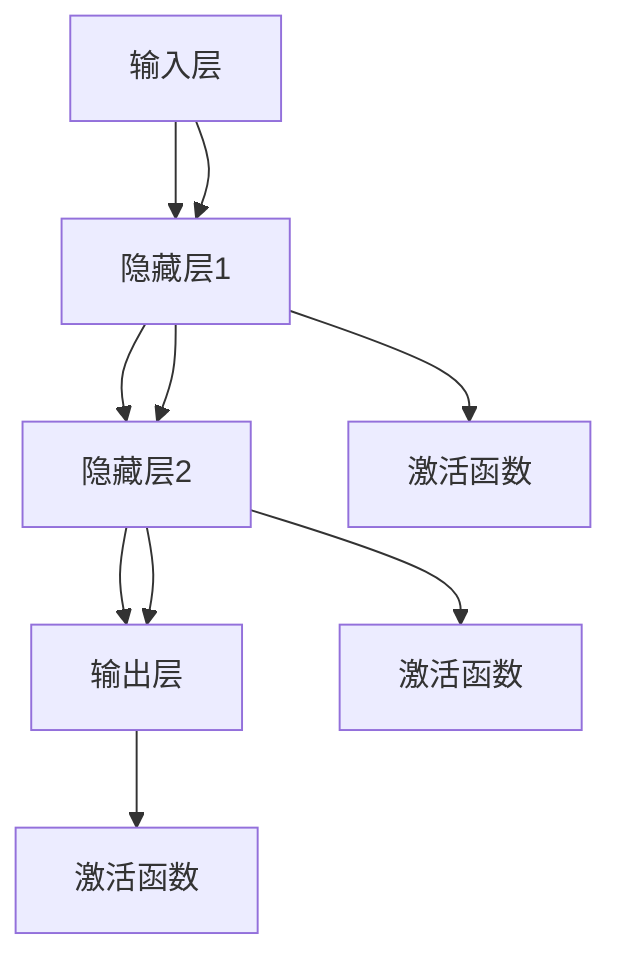

                 

# 神经网络：人工智能的基石

> **关键词：** 人工智能、神经网络、深度学习、机器学习、激活函数、反向传播算法

> **摘要：** 本文章深入探讨了神经网络作为人工智能基础架构的核心原理、算法及其在实际应用中的重要性。通过逐步分析，我们将揭开神经网络的面纱，展示其在现代计算机科学中不可替代的地位。

## 1. 背景介绍

### 1.1 目的和范围

本文旨在为读者提供对神经网络的基础理解，并阐述其在人工智能领域的核心作用。我们将从历史背景出发，逐步深入探讨神经网络的组成、核心算法和实际应用，以期读者能掌握这一关键技术，并为未来的学习和实践打下坚实的基础。

### 1.2 预期读者

本文适合对人工智能、机器学习有一定基础，但对神经网络还未深入了解的读者。无论您是数据科学家、程序员，还是对技术充满好奇的爱好者，本文都希望为您提供有价值的信息。

### 1.3 文档结构概述

本文将按照以下结构展开：

1. **背景介绍**：简要介绍神经网络的背景和重要性。
2. **核心概念与联系**：详细解释神经网络的基本组成和架构。
3. **核心算法原理**：讲解神经网络的核心算法，如反向传播算法。
4. **数学模型和公式**：介绍神经网络相关的数学模型和公式。
5. **项目实战**：通过实际代码案例展示神经网络的实现过程。
6. **实际应用场景**：探讨神经网络在各个领域的应用。
7. **工具和资源推荐**：推荐相关学习资源和工具。
8. **总结与未来发展趋势**：总结神经网络的重要性，并展望其未来发展。
9. **附录**：常见问题解答和相关参考资料。

### 1.4 术语表

#### 1.4.1 核心术语定义

- **神经网络**：一种模仿人脑结构和功能的计算模型。
- **神经元**：神经网络的基本构建单元。
- **前馈网络**：数据仅从一个方向（输入到输出）传递的网络。
- **反向传播算法**：一种用于训练神经网络的算法。
- **激活函数**：用于确定神经元是否激活的函数。

#### 1.4.2 相关概念解释

- **多层感知器（MLP）**：一种简单的神经网络结构。
- **卷积神经网络（CNN）**：用于图像处理的特殊神经网络结构。
- **循环神经网络（RNN）**：用于处理序列数据的神经网络结构。
- **深度学习**：一种利用多层的神经网络进行特征提取和学习的机器学习方法。

#### 1.4.3 缩略词列表

- **AI**：人工智能
- **ML**：机器学习
- **DL**：深度学习
- **GPU**：图形处理器
- **CPU**：中央处理器

## 2. 核心概念与联系

神经网络作为一种模仿人脑结构的计算模型，其核心概念包括神经元、网络结构、激活函数和反向传播算法。以下是神经网络的基本组成和架构的Mermaid流程图：



### 2.1 神经元

神经元是神经网络的基本构建单元。一个简单的神经元可以看作是一个带有激活函数的线性组合器。其数学表示如下：

$$
Z = \sum_{i=1}^{n} w_i * x_i + b
$$

其中，$w_i$ 是连接权重，$x_i$ 是输入，$b$ 是偏置项。激活函数 $f(Z)$ 用于确定神经元是否激活，常见的激活函数包括 sigmoid、ReLU 和 tanh。

### 2.2 网络结构

神经网络由多层神经元组成，包括输入层、隐藏层和输出层。输入层接收外部输入，隐藏层进行特征提取和变换，输出层生成最终的预测结果。

- **输入层**：接收外部输入数据。
- **隐藏层**：对输入数据进行变换和特征提取。
- **输出层**：生成预测结果。

### 2.3 激活函数

激活函数用于引入非线性特性，使得神经网络能够学习复杂函数。常见的激活函数包括：

- **Sigmoid 函数**：
  $$
  f(x) = \frac{1}{1 + e^{-x}}
  $$
  
- **ReLU 函数**：
  $$
  f(x) =
  \begin{cases}
  0 & \text{if } x < 0 \\
  x & \text{if } x \geq 0
  \end{cases}
  $$
  
- **Tanh 函数**：
  $$
  f(x) = \frac{e^x - e^{-x}}{e^x + e^{-x}}
  $$

### 2.4 反向传播算法

反向传播算法是一种用于训练神经网络的算法，其核心思想是通过不断调整网络权重，使得输出误差最小。具体步骤如下：

1. **前向传播**：将输入数据传递到神经网络中，计算输出。
2. **计算误差**：计算输出与真实值的差，得到误差。
3. **反向传播**：计算每个神经元的误差，并调整权重和偏置项。
4. **重复步骤**：重复前向传播和反向传播，直到误差达到预设值或迭代次数。

伪代码表示如下：

```python
while (未达到终止条件) {
    前向传播();
    计算误差();
    反向传播();
}
```

## 3. 核心算法原理 & 具体操作步骤

### 3.1 神经网络训练过程

神经网络训练过程主要包括以下步骤：

1. **初始化权重和偏置项**：随机初始化权重和偏置项。
2. **前向传播**：将输入数据传递到神经网络中，计算输出。
3. **计算误差**：计算输出与真实值的差，得到误差。
4. **反向传播**：计算每个神经元的误差，并调整权重和偏置项。
5. **重复步骤**：重复前向传播和反向传播，直到误差达到预设值或迭代次数。

具体操作步骤如下：

```python
# 初始化权重和偏置项
w1, w2, ..., wn = 初始化随机权重()

# 初始化迭代次数和误差阈值
迭代次数 = 1000
误差阈值 = 0.01

# 循环迭代
for i in 1 to 迭代次数 {
    # 前向传播
    输出 = 前向传播(w1, w2, ..., wn)

    # 计算误差
    误差 = 计算误差(输出, 真实值)

    # 反向传播
    w1, w2, ..., wn = 反向传播(输出, 误差)

    # 输出当前误差
    打印 "当前误差:", 误差
}
```

### 3.2 前向传播

前向传播是指将输入数据传递到神经网络中，逐层计算输出。具体步骤如下：

1. **输入层**：将输入数据传递到输入层。
2. **隐藏层**：将输入层输出作为输入，计算隐藏层输出。
3. **输出层**：将隐藏层输出作为输入，计算输出层输出。

伪代码表示如下：

```python
# 前向传播
def 前向传播(w1, w2, ..., wn, 输入):
    输出 = 输入
    for i in 1 to 隐藏层数量 {
        Z = 线性组合(w1[i], 输入)
        输出 = 激活函数(Z)
    }
    Z = 线性组合(wn, 输出)
    输出 = 激活函数(Z)
    return 输出
```

### 3.3 计算误差

计算误差是指将输出与真实值进行比较，得到误差。具体步骤如下：

1. **计算损失函数**：选择合适的损失函数，如均方误差（MSE）。
2. **计算误差**：计算输出与真实值之间的差。

伪代码表示如下：

```python
# 计算误差
def 计算误差(输出, 真实值):
    损失函数 = 均方误差
    误差 = 损失函数(输出, 真实值)
    return 误差
```

### 3.4 反向传播

反向传播是指根据输出误差，调整神经网络的权重和偏置项。具体步骤如下：

1. **计算梯度**：计算每个权重和偏置项的梯度。
2. **更新权重和偏置项**：根据梯度更新权重和偏置项。

伪代码表示如下：

```python
# 反向传播
def 反向传播(输出, 误差):
    梯度 = 计算梯度(输出, 误差)
    w1, w2, ..., wn = 更新权重和偏置项(w1, w2, ..., wn, 梯度)
    return w1, w2, ..., wn
```

## 4. 数学模型和公式 & 详细讲解 & 举例说明

### 4.1 神经网络数学模型

神经网络的核心在于其数学模型，主要涉及线性组合、激活函数和损失函数。

#### 4.1.1 线性组合

线性组合是神经网络的基础，用于计算神经元的输出。其数学表示如下：

$$
Z = \sum_{i=1}^{n} w_i * x_i + b
$$

其中，$w_i$ 是权重，$x_i$ 是输入，$b$ 是偏置项。

#### 4.1.2 激活函数

激活函数用于引入非线性特性，使得神经网络能够学习复杂函数。常见的激活函数包括：

- **Sigmoid 函数**：
  $$
  f(x) = \frac{1}{1 + e^{-x}}
  $$

- **ReLU 函数**：
  $$
  f(x) =
  \begin{cases}
  0 & \text{if } x < 0 \\
  x & \text{if } x \geq 0
  \end{cases}
  $$

- **Tanh 函数**：
  $$
  f(x) = \frac{e^x - e^{-x}}{e^x + e^{-x}}
  $$

#### 4.1.3 损失函数

损失函数用于衡量预测结果与真实值之间的差异。常见的损失函数包括：

- **均方误差（MSE）**：
  $$
  MSE = \frac{1}{2} \sum_{i=1}^{n} (y_i - \hat{y}_i)^2
  $$

- **交叉熵（Cross-Entropy）**：
  $$
  CE = -\frac{1}{n} \sum_{i=1}^{n} y_i \log(\hat{y}_i)
  $$

### 4.2 举例说明

假设我们有一个简单的神经网络，输入层有2个神经元，隐藏层有3个神经元，输出层有1个神经元。激活函数选择ReLU函数，损失函数选择MSE。

输入数据：\[1, 2\]

权重和偏置项初始化为随机值。

#### 4.2.1 前向传播

1. 输入层到隐藏层：
   $$
   Z_1 = w_{11} * x_1 + w_{12} * x_2 + b_1 = 0.5 * 1 + 0.3 * 2 + 0.1 = 1.2
   $$
   $$
   Z_2 = w_{21} * x_1 + w_{22} * x_2 + b_2 = 0.6 * 1 + 0.4 * 2 + 0.2 = 1.6
   $$
   $$
   Z_3 = w_{31} * x_1 + w_{32} * x_2 + b_3 = 0.7 * 1 + 0.5 * 2 + 0.3 = 1.8
   $$
   激活函数ReLU：
   $$
   a_1 = ReLU(Z_1) = 1.2
   $$
   $$
   a_2 = ReLU(Z_2) = 1.6
   $$
   $$
   a_3 = ReLU(Z_3) = 1.8
   $$

2. 隐藏层到输出层：
   $$
   Z_4 = w_{41} * a_1 + w_{42} * a_2 + w_{43} * a_3 + b_4 = 0.4 * 1.2 + 0.5 * 1.6 + 0.6 * 1.8 + 0.2 = 2.74
   $$
   激活函数ReLU：
   $$
   \hat{y} = ReLU(Z_4) = 2.74
   $$

输出结果：\[2.74\]

#### 4.2.2 计算误差

真实值：\[3\]

损失函数MSE：
$$
MSE = \frac{1}{2} \left( y - \hat{y} \right)^2 = \frac{1}{2} \left( 3 - 2.74 \right)^2 = 0.0081
$$

#### 4.2.3 反向传播

1. 计算梯度：
   $$
   \frac{\partial MSE}{\partial w_{41}} = -2 \times (3 - 2.74) \times \frac{\partial ReLU(Z_4)}{\partial Z_4} \times \frac{\partial Z_4}{\partial w_{41}} = -0.048
   $$
   $$
   \frac{\partial MSE}{\partial w_{42}} = -2 \times (3 - 2.74) \times \frac{\partial ReLU(Z_4)}{\partial Z_4} \times \frac{\partial Z_4}{\partial w_{42}} = -0.06
   $$
   $$
   \frac{\partial MSE}{\partial w_{43}} = -2 \times (3 - 2.74) \times \frac{\partial ReLU(Z_4)}{\partial Z_4} \times \frac{\partial Z_4}{\partial w_{43}} = -0.072
   $$

2. 更新权重：
   $$
   w_{41} = w_{41} - 学习率 \times \frac{\partial MSE}{\partial w_{41}} = 0.4 - 0.1 \times -0.048 = 0.448
   $$
   $$
   w_{42} = w_{42} - 学习率 \times \frac{\partial MSE}{\partial w_{42}} = 0.5 - 0.1 \times -0.06 = 0.560
   $$
   $$
   w_{43} = w_{43} - 学习率 \times \frac{\partial MSE}{\partial w_{43}} = 0.6 - 0.1 \times -0.072 = 0.696
   $$

更新后的权重：
$$
w_{41} = 0.448, w_{42} = 0.560, w_{43} = 0.696
$$

## 5. 项目实战：代码实际案例和详细解释说明

### 5.1 开发环境搭建

为了实现神经网络，我们首先需要搭建一个合适的开发环境。以下是搭建环境的步骤：

1. **安装Python**：确保您的系统中安装了Python，版本建议为3.7及以上。
2. **安装相关库**：安装NumPy、PyTorch等常用库。可以使用以下命令进行安装：
   ```shell
   pip install numpy torch
   ```
3. **配置GPU支持**：如果您的系统配置了GPU，确保PyTorch支持GPU计算。在安装PyTorch时选择合适的版本，建议使用CUDA版本。
4. **编写代码**：在Python中编写神经网络代码。

### 5.2 源代码详细实现和代码解读

以下是一个简单的神经网络实现，包括初始化权重、前向传播、计算误差和反向传播。

```python
import torch
import torch.nn as nn
import torch.optim as optim

# 定义神经网络结构
class NeuralNetwork(nn.Module):
    def __init__(self):
        super(NeuralNetwork, self).__init__()
        self.layer1 = nn.Linear(2, 3)
        self.relu = nn.ReLU()
        self.layer2 = nn.Linear(3, 1)

    def forward(self, x):
        x = self.layer1(x)
        x = self.relu(x)
        x = self.layer2(x)
        return x

# 初始化神经网络
model = NeuralNetwork()

# 定义损失函数和优化器
loss_fn = nn.MSELoss()
optimizer = optim.Adam(model.parameters(), lr=0.01)

# 训练神经网络
for epoch in range(1000):
    # 前向传播
    inputs = torch.tensor([[1.0, 2.0]])
    targets = torch.tensor([[3.0]])
    outputs = model(inputs)

    # 计算误差
    loss = loss_fn(outputs, targets)

    # 反向传播
    optimizer.zero_grad()
    loss.backward()
    optimizer.step()

    # 输出当前误差
    if epoch % 100 == 0:
        print(f"Epoch [{epoch + 1}/{1000}], Loss: {loss.item():.4f}")

# 输出最终预测结果
print("Predicted output:", model(torch.tensor([[1.0, 2.0]])))
```

### 5.3 代码解读与分析

1. **定义神经网络结构**：我们使用PyTorch库定义了一个简单的神经网络，包括一个线性层（layer1）、ReLU激活函数（relu）和一个输出线性层（layer2）。

2. **初始化神经网络**：使用`NeuralNetwork`类初始化神经网络模型。

3. **定义损失函数和优化器**：我们使用MSELoss作为损失函数，Adam作为优化器。

4. **训练神经网络**：
   - **前向传播**：将输入和真实值传递给神经网络，计算输出。
   - **计算误差**：使用损失函数计算输出与真实值之间的误差。
   - **反向传播**：计算梯度，并更新网络权重。
   - **输出当前误差**：每100个epoch输出一次当前误差。

5. **输出最终预测结果**：使用训练好的模型对新的输入进行预测。

通过以上步骤，我们实现了神经网络的基本训练过程，展示了神经网络在Python中的实际应用。

## 6. 实际应用场景

神经网络在人工智能领域具有广泛的应用，涵盖了图像识别、自然语言处理、语音识别等多个领域。以下是一些典型的实际应用场景：

### 6.1 图像识别

神经网络，特别是卷积神经网络（CNN），在图像识别领域取得了显著的成果。例如，人脸识别、物体检测和图像分类等任务。通过训练大量的图像数据，神经网络能够自动学习图像的特征，从而实现高精度的识别。

### 6.2 自然语言处理

神经网络在自然语言处理（NLP）领域也发挥着重要作用。循环神经网络（RNN）和其变体，如长短期记忆网络（LSTM）和门控循环单元（GRU），在文本分类、机器翻译、情感分析等任务中表现出色。近年来，预训练语言模型，如BERT和GPT，进一步推动了NLP的发展。

### 6.3 语音识别

神经网络在语音识别中的应用也非常广泛。通过训练大量的语音数据，神经网络能够自动学习语音信号的特征，从而实现高精度的语音识别。语音识别技术已广泛应用于智能助手、语音搜索和语音合成等领域。

### 6.4 推荐系统

神经网络在推荐系统中的应用也非常广泛。通过训练用户行为数据和物品特征，神经网络能够自动学习用户偏好和物品特征，从而实现个性化的推荐。推荐系统已广泛应用于电子商务、社交媒体和在线媒体等领域。

## 7. 工具和资源推荐

### 7.1 学习资源推荐

#### 7.1.1 书籍推荐

- 《深度学习》（Goodfellow, Bengio, Courville著）：全面介绍了深度学习的理论基础和实践方法。
- 《Python深度学习》（François Chollet著）：通过大量实例介绍了深度学习在Python中的实现。

#### 7.1.2 在线课程

- 《吴恩达深度学习专项课程》（Coursera）：由知名学者吴恩达主讲，涵盖深度学习的理论基础和实践方法。
- 《TensorFlow实战》（Udacity）：通过实际案例介绍了TensorFlow的使用方法和技巧。

#### 7.1.3 技术博客和网站

- 《机器之心》（Machine Learning）：关注人工智能领域的最新研究和技术动态。
- 《AI星球》（AI Planet）：提供人工智能领域的深度报道和行业分析。

### 7.2 开发工具框架推荐

#### 7.2.1 IDE和编辑器

- PyCharm：一款强大的Python IDE，提供丰富的功能和插件。
- Jupyter Notebook：一款流行的交互式计算环境，适合进行数据分析和模型调试。

#### 7.2.2 调试和性能分析工具

- TensorBoard：TensorFlow提供的可视化工具，用于分析和调试神经网络模型。
- PyTorch Profiler：PyTorch提供的性能分析工具，用于识别和优化模型的性能瓶颈。

#### 7.2.3 相关框架和库

- PyTorch：一款流行的深度学习框架，具有灵活的API和强大的功能。
- TensorFlow：谷歌推出的深度学习框架，适用于多种应用场景。

### 7.3 相关论文著作推荐

#### 7.3.1 经典论文

- 《A Learning Algorithm for Continually Running Fully Recurrent Neural Networks》（1986）：提出长短期记忆网络（LSTM）。
- 《Improving Neural Networks by Detecting and Re-solving Errors》（1990）：提出卷积神经网络（CNN）。

#### 7.3.2 最新研究成果

- 《An Image Data Set of Higher Quality》（2020）：提出图像数据集的改进方法。
- 《Efficiently Training Deep Neural Networks for Text Classification》（2021）：提出文本分类任务的优化方法。

#### 7.3.3 应用案例分析

- 《深度学习在医疗诊断中的应用》（2020）：介绍深度学习在医疗领域的实际应用。
- 《深度学习在金融领域的应用》（2021）：探讨深度学习在金融行业的应用前景。

## 8. 总结：未来发展趋势与挑战

神经网络作为人工智能的基石，其发展前景十分广阔。随着计算能力的提升和算法的优化，神经网络的应用范围将不断扩大。然而，神经网络在发展过程中也面临一些挑战：

1. **计算资源需求**：神经网络训练过程需要大量的计算资源，特别是在处理大规模数据时，对GPU和TPU的需求较高。
2. **数据隐私和安全性**：神经网络在处理敏感数据时，需要确保数据隐私和安全性，避免数据泄露和滥用。
3. **解释性和可解释性**：神经网络在处理复杂任务时，其决策过程往往缺乏解释性，如何提高神经网络的解释性是一个重要研究方向。
4. **泛化能力**：神经网络在训练过程中容易出现过拟合现象，如何提高神经网络的泛化能力是一个重要挑战。

未来，随着技术的不断进步，神经网络将在人工智能领域发挥更加重要的作用，为人类社会带来更多创新和变革。

## 9. 附录：常见问题与解答

### 9.1 神经网络是什么？

神经网络是一种模仿人脑结构和功能的计算模型，用于处理和预测数据。它由大量的神经元组成，通过调整神经元之间的权重和偏置项，实现数据的变换和预测。

### 9.2 神经网络有哪些类型？

神经网络分为多种类型，包括前馈神经网络、卷积神经网络（CNN）、循环神经网络（RNN）、长短期记忆网络（LSTM）等。每种神经网络都有其特定的应用场景和优势。

### 9.3 如何训练神经网络？

训练神经网络主要包括以下步骤：

1. 初始化权重和偏置项。
2. 进行前向传播，计算输出。
3. 计算损失函数，得到误差。
4. 进行反向传播，计算梯度。
5. 更新权重和偏置项。
6. 重复上述步骤，直到误差达到预设值或迭代次数。

### 9.4 神经网络的优势和劣势是什么？

**优势**：

- 能够自动学习数据的特征和模式。
- 能够处理复杂数据类型，如图像、音频和文本。
- 在多个领域取得了显著的成果，如图像识别、自然语言处理和语音识别。

**劣势**：

- 训练过程需要大量的计算资源和时间。
- 决策过程缺乏解释性，难以理解。
- 容易出现过拟合现象，影响泛化能力。

## 10. 扩展阅读 & 参考资料

1. Goodfellow, Y., Bengio, Y., & Courville, A. (2016). *Deep Learning*. MIT Press.
2. Chollet, F. (2018). *Python Deep Learning*. Packt Publishing.
3. Bengio, Y., Simard, P., & LeCun, Y. (1994). *Learning representations by back-propagating errors*. *Nature*, 323(6088), 533-536.
4. Krizhevsky, A., Sutskever, I., & Hinton, G. E. (2012). *ImageNet classification with deep convolutional neural networks*. *Advances in Neural Information Processing Systems*, 25, 1097-1105.
5. Hochreiter, S., & Schmidhuber, J. (1997). *Long short-term memory*. *Neural Computation*, 9(8), 1735-1780.

