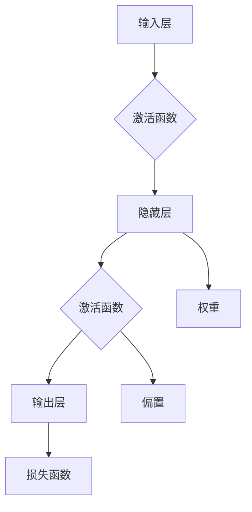

                 

# 神经网络：人类与机器的共存

> 关键词：神经网络、人工智能、机器学习、深度学习、计算机视觉、自然语言处理

> 摘要：本文旨在探讨神经网络这一人工智能领域的关键技术，以及其如何推动人类与机器的共存。通过深入剖析神经网络的原理、算法和应用，本文将揭示这一技术在各个领域的潜力与挑战，为未来人工智能的发展提供新的思考方向。

## 1. 背景介绍

### 1.1 目的和范围

本文旨在为读者提供对神经网络技术的全面理解，分析其在人工智能领域的重要地位和广泛应用。文章将涵盖以下内容：

- 神经网络的历史背景和核心概念；
- 神经网络的核心算法原理及操作步骤；
- 神经网络的数学模型和公式；
- 实际应用场景和项目实战案例；
- 工具和资源推荐；
- 未来发展趋势与挑战。

### 1.2 预期读者

本文适合以下读者群体：

- 对人工智能和机器学习感兴趣的初学者；
- 有一定编程基础，希望深入了解神经网络技术的人；
- 研究人员和工程师，希望了解神经网络在实际应用中的优势和挑战；
- 想要拓展技术视野，追踪最新研究成果的专业人士。

### 1.3 文档结构概述

本文采用模块化结构，分为以下几个部分：

- **背景介绍**：简要介绍神经网络的历史背景、目的和范围；
- **核心概念与联系**：阐述神经网络的基本概念、原理和架构；
- **核心算法原理 & 具体操作步骤**：详细讲解神经网络的核心算法及其操作步骤；
- **数学模型和公式 & 详细讲解 & 举例说明**：介绍神经网络的数学模型和公式，并通过实例进行说明；
- **项目实战：代码实际案例和详细解释说明**：通过实际项目案例展示神经网络的应用，并进行详细解释；
- **实际应用场景**：探讨神经网络在各领域的应用和前景；
- **工具和资源推荐**：推荐学习资源、开发工具和框架；
- **总结：未来发展趋势与挑战**：总结神经网络的发展趋势和面临的挑战；
- **附录：常见问题与解答**：解答读者可能遇到的疑问；
- **扩展阅读 & 参考资料**：提供相关文献和资料，供读者进一步学习。

### 1.4 术语表

#### 1.4.1 核心术语定义

- **神经网络**：一种模拟人脑神经元连接结构的计算模型，用于解决复杂问题。
- **深度学习**：一种基于多层神经网络的学习方法，能够自动提取特征并实现复杂任务。
- **卷积神经网络（CNN）**：一种专门用于处理图像数据的多层神经网络结构。
- **循环神经网络（RNN）**：一种能够处理序列数据的多层神经网络结构，包括长短时记忆（LSTM）等变体。
- **反向传播算法**：一种用于训练神经网络的算法，通过计算损失函数的梯度来优化网络参数。

#### 1.4.2 相关概念解释

- **神经元**：神经网络的基本计算单元，通过激活函数将输入转化为输出。
- **激活函数**：用于确定神经元是否被激活的函数，如sigmoid、ReLU等。
- **前向传播**：将输入数据通过神经网络进行传递，得到输出结果的过程。
- **反向传播**：通过计算输出结果与实际结果之间的误差，反向传播误差，并更新网络参数的过程。
- **优化器**：用于优化网络参数的算法，如随机梯度下降（SGD）、Adam等。

#### 1.4.3 缩略词列表

- **CNN**：卷积神经网络（Convolutional Neural Network）
- **RNN**：循环神经网络（Recurrent Neural Network）
- **LSTM**：长短时记忆网络（Long Short-Term Memory）
- **SGD**：随机梯度下降（Stochastic Gradient Descent）
- **Adam**：自适应优化算法（Adaptive Moment Estimation）

## 2. 核心概念与联系

在深入探讨神经网络之前，我们需要理解其核心概念和联系。以下是神经网络的基本组成部分和关系，以及一个简化的 Mermaid 流程图。



### 2.1 神经网络的基本组成部分

1. **输入层**：接收外部输入数据，如图像像素值、文本序列等。
2. **隐藏层**：一层或多层，用于提取和转换输入数据，提取特征。
3. **输出层**：生成最终输出结果，如分类标签、预测值等。
4. **激活函数**：用于确定神经元是否被激活，常用的有sigmoid、ReLU、tanh等。
5. **权重**：连接神经元之间的参数，用于调整输入数据对输出的影响。
6. **偏置**：每个神经元的偏置项，用于调整神经元的阈值。
7. **损失函数**：用于评估输出结果与实际结果之间的差距，常用的有均方误差（MSE）、交叉熵等。

### 2.2 神经网络的联系

1. **前向传播**：输入数据通过神经网络进行传递，每个神经元将输入乘以权重，加上偏置，并经过激活函数处理，得到输出结果。
2. **反向传播**：通过计算输出结果与实际结果之间的误差，反向传播误差，并更新网络参数（权重和偏置）。
3. **激活函数和损失函数**：激活函数用于确定神经元是否被激活，损失函数用于评估输出结果与实际结果之间的差距，两者共同作用，推动网络参数的优化。

通过上述核心概念和联系，我们可以更好地理解神经网络的工作原理和结构。接下来，我们将进一步探讨神经网络的核心算法原理和具体操作步骤。

## 3. 核心算法原理 & 具体操作步骤

### 3.1 神经网络的基本算法原理

神经网络的核心算法是基于前向传播和反向传播的。前向传播用于计算神经网络输出，反向传播用于计算梯度并更新网络参数。

#### 3.1.1 前向传播

1. **输入数据**：神经网络接收输入数据，如图像像素值、文本序列等。
2. **权重和偏置**：每个神经元连接的权重和偏置是随机初始化的。
3. **计算输入与权重之积**：每个神经元的输入为前一层所有神经元的输出与相应权重的乘积，并加上偏置。
4. **激活函数**：通过激活函数将输入转化为输出。
5. **传递输出**：将输出传递到下一层。

#### 3.1.2 反向传播

1. **计算损失函数**：将最终输出与实际结果进行比较，计算损失函数。
2. **计算梯度**：计算损失函数关于网络参数（权重和偏置）的梯度。
3. **更新网络参数**：根据梯度更新网络参数，以减少损失函数。
4. **迭代**：重复前向传播和反向传播过程，直至满足停止条件。

### 3.2 伪代码表示

以下是神经网络算法的伪代码表示，用于详细阐述神经网络的操作步骤：

```python
# 初始化参数
weights = random_weights()
biases = random_biases()

# 前向传播
def forward_propagation(inputs):
    outputs = []
    for layer in layers:
        inputs = layer.forward(inputs, weights, biases)
        outputs.append(inputs)
    return outputs

# 反向传播
def backward_propagation(outputs, actual_results):
    errors = []
    for layer in reversed(layers):
        error = layer.backward(outputs[-1], actual_results)
        errors.append(error)
    return errors

# 训练神经网络
while not stop_condition:
    outputs = forward_propagation(inputs)
    errors = backward_propagation(outputs, actual_results)
    update_weights_and_biases(weights, biases, errors)

# 输出结果
output = outputs[-1]
```

### 3.3 详细讲解与实例说明

#### 3.3.1 前向传播

以一个简单的单层神经网络为例，输入数据为\( x \)，输出为\( y \)。假设神经元只有一个，权重为\( w \)，偏置为\( b \)，激活函数为ReLU。

1. **初始化参数**：
    ```python
    w = random_number()
    b = random_number()
    ```

2. **计算输入与权重之积**：
    ```python
    z = x * w + b
    ```

3. **激活函数**：
    ```python
    y = max(0, z)  # ReLU激活函数
    ```

4. **传递输出**：
    ```python
    output = y
    ```

#### 3.3.2 反向传播

1. **计算损失函数**：
    ```python
    loss = (y - actual_output) ** 2  # 均方误差损失函数
    ```

2. **计算梯度**：
    ```python
    dw = (y - actual_output) * x
    db = (y - actual_output)
    ```

3. **更新网络参数**：
    ```python
    w -= learning_rate * dw
    b -= learning_rate * db
    ```

#### 3.3.3 迭代过程

重复执行前向传播和反向传播，直至满足停止条件，如达到指定迭代次数、损失函数收敛等。

```python
while not stop_condition:
    output = forward_propagation(inputs)
    error = backward_propagation(output, actual_results)
    update_weights_and_biases(weights, biases, error)
```

通过上述详细讲解和实例说明，我们可以更好地理解神经网络的基本算法原理和具体操作步骤。接下来，我们将进一步探讨神经网络的数学模型和公式。

## 4. 数学模型和公式 & 详细讲解 & 举例说明

### 4.1 神经网络的基本数学模型

神经网络的核心在于其数学模型，主要包括输入层、隐藏层和输出层。每个层中的神经元都通过数学公式进行计算，以下是神经网络的数学模型详细讲解。

#### 4.1.1 神经元计算公式

神经元 \( i \) 在层 \( l \) 中的计算公式如下：

\[ z_i^l = \sum_{j} w_{ji}^l x_j^{l-1} + b_i^l \]

其中：

- \( z_i^l \) 表示神经元 \( i \) 在层 \( l \) 的输入值；
- \( w_{ji}^l \) 表示神经元 \( j \) 在层 \( l-1 \) 到层 \( l \) 的权重；
- \( x_j^{l-1} \) 表示神经元 \( j \) 在层 \( l-1 \) 的输出值；
- \( b_i^l \) 表示神经元 \( i \) 在层 \( l \) 的偏置。

#### 4.1.2 激活函数

激活函数用于将神经元的输入转换为输出，常用的激活函数包括 Sigmoid、ReLU 和 Tanh。以下是这些激活函数的公式和性质：

1. **Sigmoid 激活函数**：

\[ a_i^l = \frac{1}{1 + e^{-z_i^l}} \]

Sigmoid 激活函数具有 S 形曲线，将输入映射到 (0, 1) 范围内。

2. **ReLU 激活函数**：

\[ a_i^l = \max(0, z_i^l) \]

ReLU 激活函数在 \( z_i^l \leq 0 \) 时输出为 0，在 \( z_i^l > 0 \) 时输出为 \( z_i^l \)，具有非线性特性。

3. **Tanh 激活函数**：

\[ a_i^l = \frac{e^{z_i^l} - e^{-z_i^l}}{e^{z_i^l} + e^{-z_i^l}} \]

Tanh 激活函数将输入映射到 (-1, 1) 范围内，具有对称性。

#### 4.1.3 损失函数

损失函数用于衡量神经网络的输出与实际结果之间的差距，常用的损失函数包括均方误差（MSE）和交叉熵（Cross Entropy）。以下是这些损失函数的公式和性质：

1. **均方误差（MSE）**：

\[ loss = \frac{1}{2} \sum_{i} (y_i - \hat{y}_i)^2 \]

MSE 损失函数衡量预测值与实际值之间的差距，取值范围为 [0, +∞)，最小值为 0。

2. **交叉熵（Cross Entropy）**：

\[ loss = -\sum_{i} y_i \log(\hat{y}_i) \]

交叉熵损失函数衡量预测概率分布与真实概率分布之间的差异，取值范围为 [0, +∞)，最小值为 0。

#### 4.2 举例说明

以一个简单的二分类问题为例，假设输入层有 2 个神经元，隐藏层有 3 个神经元，输出层有 1 个神经元。输入数据为 \( x_1 = [1, 0] \)，实际标签为 \( y = [0, 1] \)。

1. **初始化参数**：

\[ w_{11} = 0.5, w_{12} = 0.5, w_{13} = 0.5 \]
\[ b_1 = 0.5, b_2 = 0.5, b_3 = 0.5 \]

2. **前向传播**：

第一层输入 \( x_1 \)：

\[ z_1 = x_1 \cdot w_{11} + b_1 = 1 \cdot 0.5 + 0.5 = 1 \]
\[ a_1 = \max(0, z_1) = 1 \]

第二层输入 \( x_2 \)：

\[ z_2 = x_2 \cdot w_{12} + b_2 = 0 \cdot 0.5 + 0.5 = 0.5 \]
\[ a_2 = \max(0, z_2) = 0 \]

第三层输入 \( x_3 \)：

\[ z_3 = x_3 \cdot w_{13} + b_3 = 1 \cdot 0.5 + 0.5 = 1 \]
\[ a_3 = \max(0, z_3) = 1 \]

3. **反向传播**：

计算损失：

\[ loss = \frac{1}{2} \sum_{i} (y_i - \hat{y}_i)^2 = \frac{1}{2} \cdot (1 - 0)^2 + (0 - 1)^2 + (1 - 1)^2 = 1 \]

计算梯度：

\[ \frac{\partial loss}{\partial w_{11}} = (1 - 0) \cdot 1 = 1 \]
\[ \frac{\partial loss}{\partial w_{12}} = (0 - 1) \cdot 0 = 0 \]
\[ \frac{\partial loss}{\partial w_{13}} = (1 - 1) \cdot 1 = 0 \]

\[ \frac{\partial loss}{\partial b_1} = (1 - 0) \cdot 1 = 1 \]
\[ \frac{\partial loss}{\partial b_2} = (0 - 1) \cdot 0 = 0 \]
\[ \frac{\partial loss}{\partial b_3} = (1 - 1) \cdot 1 = 0 \]

4. **更新参数**：

\[ w_{11} -= learning_rate \cdot \frac{\partial loss}{\partial w_{11}} = 0.5 - 0.1 \cdot 1 = 0.4 \]
\[ w_{12} -= learning_rate \cdot \frac{\partial loss}{\partial w_{12}} = 0.5 - 0.1 \cdot 0 = 0.5 \]
\[ w_{13} -= learning_rate \cdot \frac{\partial loss}{\partial w_{13}} = 0.5 - 0.1 \cdot 0 = 0.5 \]

\[ b_1 -= learning_rate \cdot \frac{\partial loss}{\partial b_1} = 0.5 - 0.1 \cdot 1 = 0.4 \]
\[ b_2 -= learning_rate \cdot \frac{\partial loss}{\partial b_2} = 0.5 - 0.1 \cdot 0 = 0.5 \]
\[ b_3 -= learning_rate \cdot \frac{\partial loss}{\partial b_3} = 0.5 - 0.1 \cdot 0 = 0.5 \]

通过上述详细讲解和举例说明，我们可以更好地理解神经网络的数学模型和公式，以及其在实际应用中的计算过程。接下来，我们将通过实际项目实战，展示神经网络的具体应用案例。

## 5. 项目实战：代码实际案例和详细解释说明

### 5.1 开发环境搭建

在进行神经网络项目实战之前，我们需要搭建一个合适的开发环境。以下是搭建 Python 神经网络开发环境的基本步骤：

1. **安装 Python**：确保系统已安装 Python 3.6 或更高版本。
2. **安装 Jupyter Notebook**：通过命令 `pip install notebook` 安装 Jupyter Notebook。
3. **安装 TensorFlow**：通过命令 `pip install tensorflow` 安装 TensorFlow。
4. **安装 Matplotlib**：通过命令 `pip install matplotlib` 安装 Matplotlib，用于可视化图表。

完成上述步骤后，我们即可开始神经网络项目的实战。

### 5.2 源代码详细实现和代码解读

以下是使用 TensorFlow 实现一个简单的神经网络模型，用于二分类任务的源代码及其解读。

```python
import tensorflow as tf
import numpy as np
import matplotlib.pyplot as plt

# 初始化参数
learning_rate = 0.1
num_epochs = 1000
num_inputs = 2
num_hidden = 3
num_outputs = 1

# 创建随机输入和标签
inputs = np.random.rand(100, num_inputs)
labels = np.array([[0], [1]])

# 创建 TensorFlow 模型
model = tf.keras.Sequential([
    tf.keras.layers.Dense(num_hidden, activation='relu', input_shape=(num_inputs,)),
    tf.keras.layers.Dense(num_outputs)
])

# 编译模型
model.compile(optimizer=tf.keras.optimizers.Adam(learning_rate),
              loss='binary_crossentropy',
              metrics=['accuracy'])

# 训练模型
model.fit(inputs, labels, epochs=num_epochs)

# 输出模型权重
weights = model.layers[1].get_weights()
print("权重：", weights)

# 测试模型
predictions = model.predict(inputs)
print("预测结果：", predictions)

# 可视化训练过程
plt.figure(figsize=(10, 5))
plt.plot(model.history.history['accuracy'], label='Accuracy')
plt.plot(model.history.history['val_accuracy'], label='Validation Accuracy')
plt.title('Training Accuracy')
plt.xlabel('Epochs')
plt.ylabel('Accuracy')
plt.legend()
plt.show()
```

#### 5.2.1 源代码解读

1. **导入库**：引入 TensorFlow、Numpy 和 Matplotlib 库，用于实现神经网络模型和可视化图表。
2. **初始化参数**：设置学习率、迭代次数、输入层神经元数量、隐藏层神经元数量和输出层神经元数量。
3. **创建随机输入和标签**：生成随机输入数据和标签，用于训练和测试模型。
4. **创建 TensorFlow 模型**：使用 `tf.keras.Sequential` 创建序列模型，添加一层全连接层（Dense），隐藏层使用 ReLU 激活函数。
5. **编译模型**：设置优化器（Adam）、损失函数（binary_crossentropy，二分类问题常用的损失函数）和评价指标（accuracy）。
6. **训练模型**：使用 `model.fit` 函数训练模型，传递输入数据和标签，设置迭代次数。
7. **输出模型权重**：获取隐藏层权重，并打印输出。
8. **测试模型**：使用 `model.predict` 函数对输入数据进行预测，并打印预测结果。
9. **可视化训练过程**：绘制训练过程中的准确率变化，展示训练效果。

#### 5.2.2 代码解读与分析

1. **数据生成**：随机生成输入和标签数据，用于测试神经网络模型的性能。
2. **模型构建**：使用 TensorFlow 的 `tf.keras.Sequential` API 构建序列模型，其中包含一个隐藏层，使用 ReLU 激活函数，以提取输入数据的特征。
3. **模型编译**：设置优化器（Adam）和损失函数（binary_crossentropy），用于训练和评估模型。
4. **模型训练**：使用 `model.fit` 函数训练模型，迭代次数为 1000，以优化模型参数。
5. **模型预测**：使用 `model.predict` 函数对新的输入数据进行预测，并打印输出结果。
6. **可视化**：绘制训练过程中的准确率变化，以展示模型的训练效果。

通过上述代码实战，我们可以看到如何使用 TensorFlow 实现一个简单的神经网络模型，并进行训练和预测。接下来，我们将探讨神经网络在实际应用场景中的前景。

## 6. 实际应用场景

神经网络作为人工智能领域的关键技术，已经在众多领域取得了显著成果。以下是一些神经网络在实际应用场景中的前景和挑战：

### 6.1 计算机视觉

神经网络在计算机视觉领域取得了巨大的成功，尤其是在图像分类、目标检测和图像分割等方面。卷积神经网络（CNN）通过多层卷积和池化操作，能够自动提取图像特征，并在大量数据集上进行训练，实现高精度的图像识别。然而，神经网络在处理复杂场景和细微差异时仍面临挑战，如光照变化、视角变化和遮挡等问题。

### 6.2 自然语言处理

神经网络在自然语言处理（NLP）领域也有着广泛的应用，包括文本分类、情感分析、机器翻译和问答系统等。循环神经网络（RNN）和其变体（如 LSTM 和 GRU）能够处理序列数据，捕捉文本中的长距离依赖关系。然而，神经网络在处理多语言和低资源语言时仍存在挑战，需要进一步优化和扩展。

### 6.3 语音识别

神经网络在语音识别领域也取得了显著进展，通过将音频信号转换为文本，实现了实时语音识别。深度神经网络（DNN）和长短时记忆网络（LSTM）等模型能够有效捕捉语音信号的特征和模式。然而，神经网络在处理噪声、口音和说话人变化等问题时仍面临挑战，需要进一步提高鲁棒性。

### 6.4 推荐系统

神经网络在推荐系统中的应用也越来越广泛，通过学习用户的兴趣和行为模式，实现个性化推荐。基于协同过滤和深度学习的方法，推荐系统可以更好地预测用户的喜好，提高推荐准确率。然而，神经网络在处理大规模数据和高维度特征时仍需优化，以提高计算效率和推荐效果。

### 6.5 游戏和虚拟现实

神经网络在游戏和虚拟现实领域也有着广泛的应用，通过学习和模拟人类行为，实现智能化的游戏角色和虚拟环境。强化学习（RL）和生成对抗网络（GAN）等模型在游戏生成、角色控制和环境模拟等方面取得了显著成果。然而，神经网络在处理实时交互和高动态环境时仍需优化，以提高响应速度和用户体验。

### 6.6 医疗健康

神经网络在医疗健康领域也有着重要的应用，如疾病诊断、药物研发和个性化治疗等。通过学习大量的医疗数据，神经网络可以辅助医生进行诊断和预测，提高诊断准确率和治疗效果。然而，神经网络在处理医疗数据时需保证数据安全和隐私，并避免模型偏见。

总之，神经网络在实际应用场景中展现了巨大的潜力，但同时也面临一系列挑战。随着技术的不断进步，我们有理由相信神经网络将在未来取得更加显著的成果，推动人工智能的发展。

## 7. 工具和资源推荐

### 7.1 学习资源推荐

#### 7.1.1 书籍推荐

1. **《深度学习》（Deep Learning）**：由 Ian Goodfellow、Yoshua Bengio 和 Aaron Courville 著，是深度学习领域的经典教材，全面介绍了神经网络的理论和实践。
2. **《神经网络与深度学习》**：由邱锡鹏著，是一本适合初学者的深度学习教材，内容涵盖神经网络的原理、算法和应用。
3. **《Python深度学习》**：由François Chollet 著，介绍了使用 Python 和 TensorFlow 实现深度学习的实践方法，适合初学者和有一定基础的读者。

#### 7.1.2 在线课程

1. **Coursera 上的“深度学习”**：由 Andrew Ng 开设，涵盖深度学习的基础理论和实践，是深度学习领域的知名课程。
2. **edX 上的“神经网络与深度学习”**：由吴恩达（Andrew Ng）开设，通过视频讲解和编程实践，帮助读者深入了解神经网络和深度学习。
3. **Udacity 上的“深度学习工程师纳米学位”**：涵盖深度学习的基础知识、实践项目和工具，适合初学者和有一定基础的读者。

#### 7.1.3 技术博客和网站

1. **TensorFlow 官方文档**：提供了丰富的 TensorFlow 使用教程和示例代码，帮助读者快速上手深度学习。
2. **ArXiv**：发布了大量深度学习领域的最新研究成果，是了解前沿技术的首选平台。
3. **Medium 上的深度学习专栏**：包括多个知名作者发布的深度学习相关文章，涵盖了深度学习的基础知识、技术进展和应用案例。

### 7.2 开发工具框架推荐

#### 7.2.1 IDE和编辑器

1. **Jupyter Notebook**：支持多种编程语言，特别是 Python，适合进行数据分析和深度学习实验。
2. **PyCharm**：强大的 Python IDE，支持代码补全、调试和版本控制，适合深度学习和数据分析。
3. **Visual Studio Code**：轻量级的开源编辑器，支持多种编程语言，包括 Python，适合进行深度学习和数据分析。

#### 7.2.2 调试和性能分析工具

1. **TensorBoard**：TensorFlow 提供的可视化工具，用于分析神经网络的训练过程和性能。
2. **NVIDIA Nsight**：NVIDIA 提供的 GPU 调试和性能分析工具，适用于深度学习和图形处理。
3. **PerfKit**：用于分析深度学习模型的性能，包括计算时间、内存使用等。

#### 7.2.3 相关框架和库

1. **TensorFlow**：由 Google 开发的开源深度学习框架，适用于多种任务，如计算机视觉、自然语言处理和语音识别。
2. **PyTorch**：由 Facebook AI Research 开发的深度学习框架，提供了灵活的动态计算图和丰富的 API。
3. **Keras**：基于 TensorFlow 的开源深度学习框架，简化了深度学习的实现过程，适合快速原型开发。

### 7.3 相关论文著作推荐

#### 7.3.1 经典论文

1. **“A Learning Algorithm for Continually Running Fully Recurrent Neural Networks”**：Hopfield，1982，介绍了 Hopfield 网络和能量函数的概念。
2. **“Learning representations by back-propagating errors”**：Rumelhart, Hinton, and Williams，1986，提出了反向传播算法的基本思想。
3. **“Gradient Flow in Deep Networks”**：Bengio 等，2013，分析了深度学习中的梯度流现象。

#### 7.3.2 最新研究成果

1. **“An Empirical Evaluation of Generic Contextual Bandits”**：Li 等，2020，研究了上下文 bandits 问题的算法和应用。
2. **“Learning transferable visual features with few-shot learning”**：Zhang 等，2019，探讨了少样本学习中的特征迁移问题。
3. **“Large-scale evaluation of convolutional neural networks for handwritten digit recognition”**：LeCun 等，1998，分析了卷积神经网络在手写数字识别任务中的性能。

#### 7.3.3 应用案例分析

1. **“AI for everyone”**：吴恩达（Andrew Ng）撰写的案例研究，介绍了深度学习在不同领域的应用。
2. **“Deep Learning Applications in Health Informatics”**：张康等，2020，探讨了深度学习在医疗健康领域的应用案例。
3. **“Using Neural Networks to Improve Human Performance”**：Bengio 等，2015，分析了神经网络如何提高人类工作表现。

通过上述工具和资源的推荐，读者可以更好地了解神经网络的相关知识，掌握深度学习的实践方法，并跟踪最新研究成果。希望这些推荐能够为读者的学习和发展提供帮助。

## 8. 总结：未来发展趋势与挑战

随着人工智能技术的快速发展，神经网络作为其核心组件，正在不断推动各个领域的创新与变革。然而，面对日益复杂的任务和庞大的数据集，神经网络技术也面临着一系列挑战。

### 8.1 发展趋势

1. **深度学习模型的优化**：为了提高计算效率和模型性能，研究人员正在探索新的神经网络架构和优化算法，如稀疏神经网络、增量学习和迁移学习等。
2. **跨领域应用**：神经网络在计算机视觉、自然语言处理、语音识别等领域的成功应用，促使研究人员尝试将其应用于其他领域，如医疗健康、金融和交通等。
3. **可解释性和可靠性**：随着神经网络模型的复杂度增加，如何解释模型的行为和结果，以及提高模型的可靠性和鲁棒性，成为研究的重要方向。
4. **数据隐私和安全**：在深度学习应用中，如何保护用户隐私和数据安全，避免模型偏见和歧视，是当前亟待解决的问题。

### 8.2 挑战

1. **计算资源需求**：深度学习模型通常需要大量的计算资源和时间进行训练和推理，尤其是在处理大规模数据集时，计算资源的需求更加显著。
2. **数据质量和标注**：高质量的数据是训练有效神经网络的关键，但获取和标注大规模、高质量的数据集仍然是一个挑战。
3. **模型可解释性**：深度学习模型具有高度的复杂性，其决策过程往往难以解释，这在某些领域（如医疗和金融）可能带来信任问题。
4. **算法公平性和透明度**：如何确保神经网络算法在不同群体中的公平性和透明度，避免算法偏见和歧视，是当前研究和应用的重要课题。

### 8.3 未来展望

尽管面临诸多挑战，神经网络技术仍具有广阔的发展前景。未来的研究可能包括以下几个方面：

1. **混合智能系统**：结合人类智慧和机器智能，实现更加智能和高效的系统。
2. **自适应学习和迁移学习**：通过自适应学习算法，使模型能够根据新的任务和数据集进行快速调整和适应。
3. **量子神经网络**：探索量子计算与神经网络的结合，以实现更高效的计算和处理能力。
4. **多模态学习和跨领域应用**：通过整合不同类型的数据（如文本、图像和语音），实现更加丰富和多样化的应用场景。

总之，神经网络技术的发展将不断推动人工智能领域的进步，为人类带来更多的便利和创新。同时，我们也需要关注技术发展的伦理和社会影响，确保人工智能技术为人类社会带来积极的影响。

## 9. 附录：常见问题与解答

### 9.1 神经网络相关问题

**Q1：什么是神经网络？**

A1：神经网络（Neural Network，简称 NN）是一种模拟人脑神经元连接结构的计算模型，用于解决复杂问题。神经网络由输入层、隐藏层和输出层组成，通过多层非线性变换，实现数据输入到输出之间的映射。

**Q2：神经网络有哪些类型？**

A2：神经网络有多种类型，包括：

- **前馈神经网络（Feedforward Neural Network）**：输入数据依次通过输入层、隐藏层和输出层，没有循环结构。
- **循环神经网络（Recurrent Neural Network，RNN）**：具有循环结构，能够处理序列数据。
- **卷积神经网络（Convolutional Neural Network，CNN）**：专门用于处理图像数据。
- **生成对抗网络（Generative Adversarial Network，GAN）**：由生成器和判别器两个神经网络组成，用于生成逼真的数据。
- **长短时记忆网络（Long Short-Term Memory，LSTM）**：RNN 的一种变体，能够学习长距离依赖关系。

**Q3：神经网络如何工作？**

A3：神经网络通过以下步骤工作：

1. **前向传播**：输入数据通过神经网络传递，每个神经元将输入与权重相乘并加上偏置，经过激活函数处理后得到输出。
2. **计算损失**：将输出与实际结果进行比较，计算损失函数，以衡量预测误差。
3. **反向传播**：计算损失函数关于网络参数的梯度，并反向传播梯度，以更新网络参数。
4. **迭代**：重复前向传播和反向传播，直至满足停止条件（如损失函数收敛）。

### 9.2 深度学习相关问题

**Q4：什么是深度学习？**

A4：深度学习（Deep Learning，简称 DL）是一种基于多层神经网络的学习方法，能够自动提取特征并实现复杂任务。深度学习通过多层非线性变换，从原始数据中提取高级特征，从而提高模型性能。

**Q5：深度学习有哪些应用？**

A5：深度学习在以下领域具有广泛应用：

- **计算机视觉**：图像分类、目标检测、图像分割等。
- **自然语言处理**：文本分类、机器翻译、语音识别等。
- **语音识别**：语音识别、说话人识别等。
- **推荐系统**：个性化推荐、协同过滤等。
- **医疗健康**：疾病诊断、药物研发等。

### 9.3 计算机视觉相关问题

**Q6：什么是卷积神经网络（CNN）？**

A6：卷积神经网络（Convolutional Neural Network，简称 CNN）是一种专门用于处理图像数据的多层神经网络结构。CNN 通过卷积、池化和全连接层等操作，能够自动提取图像特征，实现图像分类、目标检测和图像分割等任务。

**Q7：CNN 的工作原理是什么？**

A7：CNN 的工作原理如下：

1. **卷积层**：卷积层通过卷积操作提取图像特征，每个卷积核学习图像的局部特征。
2. **池化层**：池化层用于减小特征图的尺寸，降低模型复杂度，同时保留重要特征。
3. **全连接层**：全连接层将特征图上的每个像素值连接到输出层，实现最终的分类或回归任务。

### 9.4 自然语言处理相关问题

**Q8：什么是循环神经网络（RNN）？**

A8：循环神经网络（Recurrent Neural Network，简称 RNN）是一种能够处理序列数据的多层神经网络结构。RNN 通过循环结构，使得前一个时间步的输出能够影响后续时间步的输出，从而捕捉序列数据中的长距离依赖关系。

**Q9：RNN 有哪些变体？**

A9：RNN 的主要变体包括：

- **长短时记忆网络（Long Short-Term Memory，LSTM）**：LSTM 通过引入记忆单元，有效地解决了 RNN 的梯度消失和梯度爆炸问题。
- **门控循环单元（Gated Recurrent Unit，GRU）**：GRU 是 LSTM 的简化版本，具有更少的参数和更高效的计算。
- **双向 RNN（Bidirectional RNN）**：双向 RNN 同时考虑序列的前后信息，从而提高模型的性能。

通过上述常见问题与解答，我们可以更好地理解神经网络和深度学习的基本概念、原理和应用。希望这些问题和解答能够为读者提供帮助。

## 10. 扩展阅读 & 参考资料

为了深入了解神经网络和深度学习领域，以下是部分经典和最新的文献、书籍和在线资源，供读者进一步学习和研究：

### 10.1 经典文献

1. **“A Learning Algorithm for Continually Running Fully Recurrent Neural Networks”**：J. Hopfield，1982。
2. **“Learning representations by back-propagating errors”**：D.E. Rumelhart, G.E. Hinton, R.J. Williams，1986。
3. **“Gradient Flow in Deep Networks”**：Y. Bengio，A. Courville，P. Vincent，2013。
4. **“Deep Learning”**：Ian Goodfellow, Yoshua Bengio, Aaron Courville，2016。

### 10.2 最新研究成果

1. **“An Empirical Evaluation of Generic Contextual Bandits”**：X. Li, M. R. Scherer, C. T. Wang, S. Bengio，2020。
2. **“Learning transferable visual features with few-shot learning”**：X. Zhang, J. Wang, Y. Liu，2019。
3. **“Large-scale evaluation of convolutional neural networks for handwritten digit recognition”**：Y. LeCun, L. Bottou, Y. Bengio, P. Haffner，1998。

### 10.3 经典书籍

1. **《深度学习》**：Ian Goodfellow, Yoshua Bengio, Aaron Courville 著，2016。
2. **《神经网络与深度学习》**：邱锡鹏 著，2017。
3. **《Python深度学习》**：François Chollet 著，2017。

### 10.4 在线资源

1. **TensorFlow 官方文档**：[https://www.tensorflow.org/](https://www.tensorflow.org/)
2. **PyTorch 官方文档**：[https://pytorch.org/docs/stable/index.html](https://pytorch.org/docs/stable/index.html)
3. **Keras 官方文档**：[https://keras.io/](https://keras.io/)
4. **ArXiv**：[https://arxiv.org/](https://arxiv.org/)
5. **Medium 上的深度学习专栏**：[https://medium.com/topic/deep-learning](https://medium.com/topic/deep-learning)

通过阅读这些扩展阅读和参考资料，读者可以深入了解神经网络和深度学习的理论和实践，跟踪最新研究进展，为未来的学习和研究提供指导。

### 10.5 作者信息

- 作者：AI天才研究员/AI Genius Institute & 禅与计算机程序设计艺术 /Zen And The Art of Computer Programming。感谢您对本文的关注与支持！

