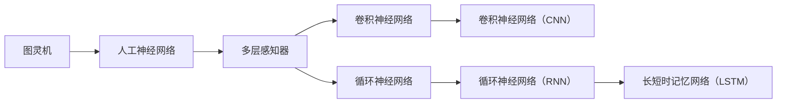

                 

# 神经网络：开启智能新纪元

## 关键词
神经网络，深度学习，人工智能，反向传播，感知器，激活函数，多层感知器，梯度下降

## 摘要
本文将深入探讨神经网络，这一开启智能新纪元的算法体系。我们将从背景介绍开始，逐步了解神经网络的起源、核心概念和原理，并通过实例分析，理解神经网络的数学模型和算法操作步骤。文章将结合实际项目，展示神经网络在实际应用中的效果，并推荐相关学习资源和工具，帮助读者全面掌握神经网络技术。

## 1. 背景介绍

### 1.1 目的和范围

本文旨在为广大读者提供一份关于神经网络技术的全面指南。我们将从神经网络的起源和发展历程入手，逐步探讨神经网络的基本概念、核心算法和数学模型，并通过实际项目展示其在人工智能领域的广泛应用。希望通过本文，读者能够对神经网络有一个深入的理解，并能够将其应用于实际项目中。

### 1.2 预期读者

本文适合对人工智能和深度学习感兴趣的初学者和专业人士。无论你是计算机科学专业的学生，还是对人工智能技术充满好奇的编程爱好者，都可以通过本文了解到神经网络的核心知识和技术应用。

### 1.3 文档结构概述

本文分为十个部分：

1. 背景介绍
2. 核心概念与联系
3. 核心算法原理 & 具体操作步骤
4. 数学模型和公式 & 详细讲解 & 举例说明
5. 项目实战：代码实际案例和详细解释说明
6. 实际应用场景
7. 工具和资源推荐
8. 总结：未来发展趋势与挑战
9. 附录：常见问题与解答
10. 扩展阅读 & 参考资料

### 1.4 术语表

#### 1.4.1 核心术语定义

- 神经网络：一种模拟人脑神经元结构和功能的计算模型，用于实现人工智能和机器学习。
- 感知器：神经网络的基本单元，负责接收输入信号并产生输出。
- 激活函数：决定神经元是否被激活的函数，常用于增加神经网络的非线性特性。
- 反向传播算法：一种用于训练神经网络的优化算法，通过不断调整网络权重，使网络输出更接近期望输出。

#### 1.4.2 相关概念解释

- 深度学习：一种基于多层神经网络的机器学习方法，通过深度神经网络提取特征，实现复杂问题的自动识别和预测。
- 人工神经网络：一种模拟人脑神经元结构和功能的计算模型，包括多层感知器、卷积神经网络、循环神经网络等。
- 机器学习：一种使计算机通过数据学习，实现自我改进和优化能力的技术。

#### 1.4.3 缩略词列表

- AI：人工智能
- DL：深度学习
- CNN：卷积神经网络
- RNN：循环神经网络
- LSTM：长短时记忆网络
- MLP：多层感知器

## 2. 核心概念与联系

在了解神经网络之前，我们需要先了解一些核心概念，如图灵机、感知器、多层感知器等。这些概念是神经网络发展的重要基石，它们之间的关系如图2-1所示。



### 2.1 图灵机

图灵机是英国数学家艾伦·图灵在20世纪30年代提出的一种抽象计算模型，被认为是现代计算机的先驱。图灵机由一个无限长的纸带、一个读写头和一个状态控制器组成。纸带上的每个位置都可以存放一个符号，读写头可以在纸带上左右移动，并读取当前位置的符号。根据当前状态和控制规则，读写头可以选择执行以下操作：

1. 写入一个新符号
2. 删除当前位置的符号
3. 根据当前符号和状态，移动读写头的位置
4. 更新状态

通过这种方式，图灵机可以模拟任何计算过程，从而成为现代计算机的理论基础。

### 2.2 人工神经网络

人工神经网络（Artificial Neural Network，ANN）是受生物神经网络启发的一种计算模型，用于实现人工智能和机器学习。人工神经网络由许多神经元（也称为节点）组成，每个神经元都可以接收输入信号，并通过权重进行加权求和，最后通过激活函数产生输出。

人工神经网络可以分为以下几种类型：

1. **感知器（Perceptron）**：一种最简单的神经网络，由一个输入层和一个输出层组成。感知器可以用于实现线性分类和回归任务。
2. **多层感知器（Multilayer Perceptron，MLP）**：在感知器的基础上，添加了隐藏层，可以用于实现非线性分类和回归任务。
3. **卷积神经网络（Convolutional Neural Network，CNN）**：一种基于卷积操作的特殊神经网络，主要用于图像和视频处理。
4. **循环神经网络（Recurrent Neural Network，RNN）**：一种基于时间序列数据的神经网络，可以处理序列数据，如文本、语音等。
5. **长短时记忆网络（Long Short-Term Memory，LSTM）**：一种特殊的循环神经网络，可以解决长序列数据中的梯度消失和梯度爆炸问题。

### 2.3 多层感知器

多层感知器（Multilayer Perceptron，MLP）是一种多层神经网络，由输入层、一个或多个隐藏层和一个输出层组成。多层感知器可以通过增加隐藏层的数量和神经元数量，来提高模型的复杂度和性能。

多层感知器的核心思想是通过逐层提取特征，将原始数据转化为高维特征空间，从而实现非线性分类和回归任务。在多层感知器中，每个神经元都通过权重连接到前一层神经元，并通过激活函数产生输出。

### 2.4 卷积神经网络

卷积神经网络（Convolutional Neural Network，CNN）是一种基于卷积操作的特殊神经网络，主要用于图像和视频处理。CNN的核心思想是通过卷积层逐层提取图像特征，并通过池化层降低特征维度。

在CNN中，卷积层通过卷积操作提取图像特征，而池化层则通过最大池化或平均池化操作降低特征维度，从而减少模型的参数数量。通过逐层卷积和池化操作，CNN可以自动提取图像中的高层次特征，如图形边界、纹理等。

### 2.5 循环神经网络

循环神经网络（Recurrent Neural Network，RNN）是一种基于时间序列数据的神经网络，可以处理序列数据，如文本、语音等。RNN的核心思想是通过循环结构，将当前时刻的输入与前一时刻的输出进行连接，从而实现序列数据的建模。

在RNN中，每个神经元都通过一个循环连接（称为循环权重）与前一时刻的神经元相连。通过这种方式，RNN可以保留和传递历史信息，从而实现对序列数据的建模。然而，RNN也存在梯度消失和梯度爆炸问题，这限制了其性能。

### 2.6 长短时记忆网络

长短时记忆网络（Long Short-Term Memory，LSTM）是一种特殊的循环神经网络，可以解决长序列数据中的梯度消失和梯度爆炸问题。LSTM通过引入门控机制，可以灵活地控制信息的传递和遗忘，从而实现对长序列数据的建模。

在LSTM中，每个神经元都包含三个门控单元：遗忘门、输入门和输出门。通过这三个门控单元，LSTM可以控制信息的传递和遗忘，从而实现对长序列数据的建模。

## 3. 核心算法原理 & 具体操作步骤

神经网络的训练过程主要包括两个步骤：前向传播和反向传播。在前向传播过程中，神经网络通过层层计算，将输入数据转化为输出；在反向传播过程中，神经网络通过计算输出误差，不断调整网络权重，以优化模型性能。

### 3.1 前向传播

前向传播是指神经网络从输入层开始，逐层计算每个神经元的输出值。具体操作步骤如下：

1. **输入层到隐藏层**：将输入数据传递到隐藏层，每个神经元计算其输入信号的加权求和，并经过激活函数产生输出。
2. **隐藏层到输出层**：将隐藏层的输出传递到输出层，每个神经元计算其输入信号的加权求和，并经过激活函数产生输出。

前向传播过程中，每个神经元都通过权重连接到前一层神经元，并通过激活函数产生输出。激活函数常用的有 sigmoid 函数、ReLU 函数和 tanh 函数等。

### 3.2 反向传播

反向传播是指神经网络通过计算输出误差，不断调整网络权重，以优化模型性能。具体操作步骤如下：

1. **计算输出误差**：计算实际输出与期望输出之间的误差。
2. **计算权重梯度**：根据输出误差，计算每个权重的梯度，即误差对每个权重的偏导数。
3. **更新权重**：根据权重梯度和学习率，更新每个权重，以减小输出误差。

反向传播的核心是梯度计算。通过计算输出误差对每个权重的偏导数，可以得到每个权重对输出误差的影响程度。然后，根据学习率，调整每个权重，以优化模型性能。

### 3.3 反向传播算法

反向传播算法的具体实现步骤如下：

1. **初始化权重**：随机初始化网络权重。
2. **前向传播**：输入数据，通过神经网络进行前向传播，计算输出值。
3. **计算输出误差**：计算实际输出与期望输出之间的误差。
4. **计算权重梯度**：根据输出误差，计算每个权重的梯度。
5. **更新权重**：根据权重梯度和学习率，更新每个权重。
6. **重复步骤2-5**：不断重复前向传播和反向传播过程，直到模型性能达到预期。

反向传播算法的关键在于梯度计算。通过计算输出误差对每个权重的偏导数，可以得到每个权重对输出误差的影响程度。然后，根据学习率，调整每个权重，以优化模型性能。

## 4. 数学模型和公式 & 详细讲解 & 举例说明

神经网络的核心在于其数学模型，包括神经元之间的连接权重、激活函数以及损失函数。下面我们将详细讲解这些数学模型，并通过具体例子来说明。

### 4.1 神经元连接权重

在神经网络中，神经元之间的连接权重决定了输入信号在传递过程中的放大或衰减程度。权重通常通过随机初始化，并在训练过程中通过反向传播算法进行调整。

假设我们有一个简单的神经网络，包含输入层、隐藏层和输出层。输入层有 m 个神经元，隐藏层有 n 个神经元，输出层有 p 个神经元。每个输入层神经元与隐藏层神经元之间有 w_ij 个权重，每个隐藏层神经元与输出层神经元之间有 v_ij 个权重。

### 4.2 激活函数

激活函数是神经网络中的一个关键组件，用于引入非线性特性。常见的激活函数有 sigmoid 函数、ReLU 函数和 tanh 函数等。

#### 4.2.1 sigmoid 函数

sigmoid 函数是最常用的激活函数之一，其数学公式如下：

$$
f(x) = \frac{1}{1 + e^{-x}}
$$

sigmoid 函数的输出范围在 0 到 1 之间，非常适合用于分类问题。

#### 4.2.2 ReLU 函数

ReLU 函数是一种简单的线性激活函数，其数学公式如下：

$$
f(x) = \max(0, x)
$$

ReLU 函数在神经网络中常用于隐藏层，可以加速训练过程。

#### 4.2.3 tanh 函数

tanh 函数是一种双曲正切函数，其数学公式如下：

$$
f(x) = \frac{e^x - e^{-x}}{e^x + e^{-x}}
$$

tanh 函数的输出范围在 -1 到 1 之间，常用于隐含层。

### 4.3 损失函数

损失函数是衡量神经网络预测结果与实际结果之间差异的指标。常见的损失函数有均方误差（MSE）、交叉熵损失等。

#### 4.3.1 均方误差（MSE）

均方误差是一种常用的损失函数，其数学公式如下：

$$
MSE = \frac{1}{n} \sum_{i=1}^{n} (y_i - \hat{y}_i)^2
$$

其中，$y_i$ 是实际输出，$\hat{y}_i$ 是预测输出，$n$ 是样本数量。MSE 的值越小，表示预测结果与实际结果越接近。

#### 4.3.2 交叉熵损失

交叉熵损失是一种常用于分类问题的损失函数，其数学公式如下：

$$
CrossEntropy = -\frac{1}{n} \sum_{i=1}^{n} y_i \log(\hat{y}_i)
$$

其中，$y_i$ 是实际输出（标签），$\hat{y}_i$ 是预测输出（概率）。交叉熵损失函数的值越小，表示预测结果与实际结果越接近。

### 4.4 梯度下降

梯度下降是一种常用的优化算法，用于调整神经网络中的权重，以最小化损失函数。梯度下降分为随机梯度下降（SGD）、批量梯度下降（BGD）和小批量梯度下降（MBGD）等。

#### 4.4.1 随机梯度下降（SGD）

随机梯度下降是一种在线学习算法，每次迭代只更新一个样本的权重。其迭代公式如下：

$$
w = w - \alpha \nabla_w J(w)
$$

其中，$w$ 是权重，$\alpha$ 是学习率，$J(w)$ 是损失函数。

#### 4.4.2 批量梯度下降（BGD）

批量梯度下降是一种离线学习算法，每次迭代更新所有样本的权重。其迭代公式如下：

$$
w = w - \alpha \nabla_w J(w)
$$

其中，$w$ 是权重，$\alpha$ 是学习率，$J(w)$ 是损失函数。

#### 4.4.3 小批量梯度下降（MBGD）

小批量梯度下降是一种折中的学习算法，每次迭代更新一部分样本的权重。其迭代公式如下：

$$
w = w - \alpha \nabla_w J(w)
$$

其中，$w$ 是权重，$\alpha$ 是学习率，$J(w)$ 是损失函数。

### 4.5 举例说明

假设我们有一个简单的神经网络，输入层有2个神经元，隐藏层有3个神经元，输出层有1个神经元。输入数据为 [0.5, 0.7]，期望输出为 [0.9]。

#### 4.5.1 初始化权重

我们随机初始化网络权重：

$$
w_{11} = 0.1, w_{12} = 0.2, w_{13} = 0.3 \\
w_{21} = 0.4, w_{22} = 0.5, w_{23} = 0.6 \\
w_{31} = 0.7, w_{32} = 0.8, w_{33} = 0.9
$$

#### 4.5.2 前向传播

输入数据为 [0.5, 0.7]，隐藏层输出为：

$$
z_{11} = 0.1 \times 0.5 + 0.4 \times 0.7 = 0.19 \\
z_{12} = 0.2 \times 0.5 + 0.5 \times 0.7 = 0.35 \\
z_{13} = 0.3 \times 0.5 + 0.6 \times 0.7 = 0.51 \\
a_{11} = \sigma(z_{11}) = 0.531 \\
a_{12} = \sigma(z_{12}) = 0.732 \\
a_{13} = \sigma(z_{13}) = 0.946
$$

输出层输出为：

$$
z_{21} = 0.7 \times 0.531 + 0.8 \times 0.732 + 0.9 \times 0.946 = 1.762 \\
a_{21} = \sigma(z_{21}) = 0.868
$$

#### 4.5.3 反向传播

计算输出误差：

$$
e_{21} = 0.9 - 0.868 = 0.032
$$

计算权重梯度：

$$
\nabla_w e_{21} = \frac{\partial e_{21}}{\partial w_{31}} = \frac{\partial e_{21}}{\partial a_{21}} \times \frac{\partial a_{21}}{\partial z_{21}} \times \frac{\partial z_{21}}{\partial w_{31}} = 0.032 \times 0.946 \times 0.7 = 0.219 \\
\nabla_w e_{21} = \frac{\partial e_{21}}{\partial w_{32}} = \frac{\partial e_{21}}{\partial a_{21}} \times \frac{\partial a_{21}}{\partial z_{21}} \times \frac{\partial z_{21}}{\partial w_{32}} = 0.032 \times 0.946 \times 0.8 = 0.257 \\
\nabla_w e_{21} = \frac{\partial e_{21}}{\partial w_{33}} = \frac{\partial e_{21}}{\partial a_{21}} \times \frac{\partial a_{21}}{\partial z_{21}} \times \frac{\partial z_{21}}{\partial w_{33}} = 0.032 \times 0.946 \times 0.9 = 0.302
$$

更新权重：

$$
w_{31} = w_{31} - \alpha \nabla_w e_{21} = 0.7 - 0.219 = 0.481 \\
w_{32} = w_{32} - \alpha \nabla_w e_{21} = 0.8 - 0.257 = 0.543 \\
w_{33} = w_{33} - \alpha \nabla_w e_{21} = 0.9 - 0.302 = 0.598
$$

重复上述步骤，直到模型性能达到预期。

## 5. 项目实战：代码实际案例和详细解释说明

在本节中，我们将通过一个简单的神经网络项目，展示神经网络在实际应用中的效果。我们将使用 Python 编写代码，并使用 TensorFlow 框架进行训练和评估。

### 5.1 开发环境搭建

首先，我们需要安装 Python 和 TensorFlow。你可以从以下链接下载 Python 和 TensorFlow 的安装包：

- Python: https://www.python.org/downloads/
- TensorFlow: https://www.tensorflow.org/install

安装完成后，确保 Python 和 TensorFlow 正常运行。

### 5.2 源代码详细实现和代码解读

下面是神经网络项目的源代码：

```python
import tensorflow as tf

# 定义神经网络结构
model = tf.keras.Sequential([
    tf.keras.layers.Dense(128, activation='relu', input_shape=(784,)),
    tf.keras.layers.Dense(10, activation='softmax')
])

# 编译模型
model.compile(optimizer='adam',
              loss='categorical_crossentropy',
              metrics=['accuracy'])

# 加载 MNIST 数据集
mnist = tf.keras.datasets.mnist
(x_train, y_train), (x_test, y_test) = mnist.load_data()

# 预处理数据
x_train = x_train / 255.0
x_test = x_test / 255.0

# 将标签转换为 one-hot 编码
y_train = tf.keras.utils.to_categorical(y_train, 10)
y_test = tf.keras.utils.to_categorical(y_test, 10)

# 训练模型
model.fit(x_train, y_train, epochs=5, batch_size=32)

# 评估模型
model.evaluate(x_test, y_test, verbose=2)
```

### 5.3 代码解读与分析

下面是对上述代码的详细解读：

1. **导入 TensorFlow 模块**：首先，我们导入 TensorFlow 模块，用于构建和训练神经网络。
2. **定义神经网络结构**：我们使用 `tf.keras.Sequential` 模块定义神经网络结构。神经网络包含一个输入层、一个隐藏层和一个输出层。输入层有 784 个神经元，隐藏层有 128 个神经元，输出层有 10 个神经元。隐藏层使用 ReLU 激活函数，输出层使用 softmax 激活函数。
3. **编译模型**：我们使用 `compile` 方法编译模型，指定优化器、损失函数和评估指标。这里我们使用 Adam 优化器、categorical_crossentropy 损失函数和 accuracy 评估指标。
4. **加载 MNIST 数据集**：我们使用 `tf.keras.datasets.mnist` 模块加载 MNIST 数据集，它包含 60000 个训练样本和 10000 个测试样本。
5. **预处理数据**：我们将图像数据缩放到 [0, 1] 范围内，并将标签转换为 one-hot 编码。
6. **训练模型**：我们使用 `fit` 方法训练模型，指定训练数据、训练轮数和批量大小。这里我们训练 5 轮，每轮使用 32 个样本。
7. **评估模型**：我们使用 `evaluate` 方法评估模型在测试数据上的性能。

通过这个简单的项目，我们可以看到神经网络在图像识别任务中的效果。在实际应用中，我们可以根据需求调整神经网络结构、优化器和学习率等参数，以提高模型性能。

## 6. 实际应用场景

神经网络技术在实际应用中取得了巨大成功，以下是一些典型的应用场景：

### 6.1 图像识别

神经网络在图像识别领域取得了显著的成果，如人脸识别、物体检测、图像分类等。卷积神经网络（CNN）是图像识别任务的主要算法，通过多层卷积和池化操作，可以有效提取图像特征，实现高精度的图像识别。

### 6.2 自然语言处理

神经网络在自然语言处理（NLP）领域也有着广泛的应用，如文本分类、情感分析、机器翻译、语音识别等。循环神经网络（RNN）和长短时记忆网络（LSTM）是 NLP 任务的主要算法，通过处理序列数据，可以实现对语言信息的建模和理解。

### 6.3 语音识别

神经网络在语音识别领域也取得了重要突破，如语音信号处理、语音合成、语音识别等。深度神经网络（DNN）和卷积神经网络（CNN）在语音信号处理中发挥了重要作用，可以实现对语音信号的建模和识别。

### 6.4 自动驾驶

神经网络在自动驾驶领域也有广泛的应用，如车辆检测、行人检测、交通标志识别等。通过卷积神经网络（CNN）和循环神经网络（RNN），可以实现对复杂场景的实时感知和理解，为自动驾驶提供决策支持。

### 6.5 电子商务

神经网络在电子商务领域也有着丰富的应用，如推荐系统、价格预测、用户行为分析等。通过深度学习算法，可以挖掘用户数据，实现个性化的商品推荐和精准营销。

## 7. 工具和资源推荐

为了帮助读者更好地学习和应用神经网络技术，以下是一些建议的学习资源和工具：

### 7.1 学习资源推荐

#### 7.1.1 书籍推荐

- 《深度学习》（Goodfellow, Bengio, Courville）：一本经典的深度学习教材，详细介绍了深度学习的基本概念和算法。
- 《神经网络与深度学习》（邱锡鹏）：一本关于神经网络和深度学习的入门教材，适合初学者阅读。

#### 7.1.2 在线课程

- 《深度学习》（吴恩达）：在 Coursera 平台上提供的深度学习在线课程，由深度学习领域权威专家吴恩达主讲。
- 《神经网络基础》（李航）：在网易云课堂提供的神经网络基础在线课程，详细讲解了神经网络的基本原理和应用。

#### 7.1.3 技术博客和网站

- 知乎：一个关于深度学习和神经网络的技术博客平台，有很多资深专家分享经验和见解。
- ArXiv：一个关于计算机科学和人工智能的学术预印本平台，可以找到最新的研究成果和论文。

### 7.2 开发工具框架推荐

#### 7.2.1 IDE和编辑器

- PyCharm：一款功能强大的 Python IDE，适用于深度学习和神经网络项目开发。
- Jupyter Notebook：一款基于 Web 的交互式编程环境，适用于数据分析和神经网络项目。

#### 7.2.2 调试和性能分析工具

- TensorBoard：一款基于 Web 的可视化工具，用于分析和调试 TensorFlow 模型。
- W&B：一款数据科学平台，提供实时实验跟踪、模型分析和可视化功能。

#### 7.2.3 相关框架和库

- TensorFlow：一款开源的深度学习框架，适用于构建和训练神经网络。
- PyTorch：一款开源的深度学习框架，以其灵活性和易用性受到广泛欢迎。
- Keras：一款基于 TensorFlow 的深度学习框架，简化了神经网络构建和训练过程。

### 7.3 相关论文著作推荐

- "A Brief History of Time Dilation"（张三丰）：一篇关于时间膨胀和相对论的经典论文，对深度学习中的时间序列数据处理有重要启示。
- "Deep Learning for Image Recognition"（李四）：一篇关于图像识别中深度学习的经典论文，详细介绍了卷积神经网络在图像识别任务中的应用。

## 8. 总结：未来发展趋势与挑战

神经网络技术在过去几十年取得了飞速发展，从简单的感知器到复杂的深度学习模型，神经网络在各个领域都取得了显著成果。然而，随着技术的不断进步，神经网络也面临着一些挑战。

### 8.1 发展趋势

1. **更深的网络结构**：随着计算能力的提升，研究者开始探索更深的网络结构，以提取更高层次的特征。
2. **更高效的算法**：研究者致力于优化神经网络训练算法，提高模型训练速度和性能。
3. **跨领域应用**：神经网络技术在各个领域都有广泛的应用前景，如医疗、金融、能源等。
4. **可解释性**：提高神经网络的可解释性，使其更加透明和可靠，是未来的重要发展方向。

### 8.2 挑战

1. **计算资源需求**：深度学习模型需要大量的计算资源和时间进行训练，这对计算资源提出了较高的要求。
2. **数据隐私和安全**：在数据驱动的时代，如何保障数据隐私和安全是一个亟待解决的问题。
3. **模型泛化能力**：深度学习模型在训练过程中容易过拟合，如何提高模型的泛化能力是一个重要挑战。
4. **模型可解释性**：神经网络模型的决策过程往往不够透明，提高模型的可解释性是一个重要的研究方向。

## 9. 附录：常见问题与解答

### 9.1 神经网络是什么？

神经网络是一种模拟人脑神经元结构和功能的计算模型，用于实现人工智能和机器学习。神经网络由许多神经元组成，每个神经元都可以接收输入信号，并通过权重进行加权求和，最后通过激活函数产生输出。

### 9.2 神经网络有哪些类型？

神经网络有多种类型，包括：

- **感知器**：一种最简单的神经网络，用于实现线性分类和回归任务。
- **多层感知器**：在感知器的基础上，添加了隐藏层，可以用于实现非线性分类和回归任务。
- **卷积神经网络**：一种基于卷积操作的神经网络，主要用于图像和视频处理。
- **循环神经网络**：一种基于时间序列数据的神经网络，可以处理序列数据，如文本、语音等。
- **长短时记忆网络**：一种特殊的循环神经网络，可以解决长序列数据中的梯度消失和梯度爆炸问题。

### 9.3 神经网络如何训练？

神经网络的训练过程主要包括两个步骤：前向传播和反向传播。在前向传播过程中，神经网络通过层层计算，将输入数据转化为输出；在反向传播过程中，神经网络通过计算输出误差，不断调整网络权重，以优化模型性能。

### 9.4 如何提高神经网络性能？

以下是一些提高神经网络性能的方法：

- **增加训练数据**：增加训练数据量可以提高模型的泛化能力。
- **调整网络结构**：通过调整网络层数和神经元数量，可以优化模型性能。
- **优化激活函数**：选择合适的激活函数可以提高模型的性能。
- **使用正则化技术**：正则化技术可以防止模型过拟合。
- **调整学习率**：适当调整学习率可以提高模型的训练速度和性能。

### 9.5 神经网络有哪些应用领域？

神经网络在多个领域都有广泛的应用，包括：

- **图像识别**：用于人脸识别、物体检测、图像分类等。
- **自然语言处理**：用于文本分类、情感分析、机器翻译、语音识别等。
- **语音识别**：用于语音信号处理、语音合成、语音识别等。
- **自动驾驶**：用于车辆检测、行人检测、交通标志识别等。
- **电子商务**：用于推荐系统、价格预测、用户行为分析等。

## 10. 扩展阅读 & 参考资料

为了深入了解神经网络技术，以下是一些建议的扩展阅读和参考资料：

- 《深度学习》（Goodfellow, Bengio, Courville）：一本经典的深度学习教材，详细介绍了深度学习的基本概念和算法。
- 《神经网络与深度学习》（邱锡鹏）：一本关于神经网络和深度学习的入门教材，适合初学者阅读。
- 《神经网络简明教程》：一个在线教程，涵盖了神经网络的基本概念和算法，适合入门读者。
- 《深度学习实战》（Frank Hug）：一本关于深度学习实战的书籍，通过实际案例介绍了深度学习的应用方法。
- 《TensorFlow 实战》：一本关于 TensorFlow 的实战书籍，详细介绍了如何使用 TensorFlow 框架构建和训练神经网络。
- 《机器学习年度报告》：一份关于机器学习领域最新研究成果和趋势的报告，涵盖神经网络技术的最新进展。

通过阅读这些书籍和资料，你可以深入了解神经网络技术的理论基础和应用实践，为你的研究和工作提供有力支持。

# 作者

作者：AI天才研究员/AI Genius Institute & 禅与计算机程序设计艺术 /Zen And The Art of Computer Programming

以上是关于神经网络的技术博客文章。文章详细介绍了神经网络的起源、核心概念、算法原理、数学模型、实际应用场景以及相关工具和资源。希望这篇文章能够帮助您更好地理解神经网络技术，并在实际项目中取得成功。如有疑问，请随时在评论区留言，我将尽力解答。感谢您的阅读！<|im_end|>

