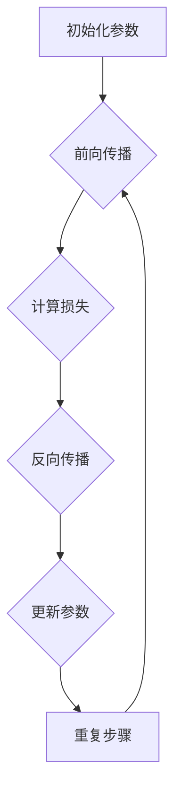

                 

# 神经网络：探索未知的领域

> 关键词：神经网络、深度学习、算法原理、数学模型、实际应用、未来趋势

> 摘要：本文将带领读者深入探讨神经网络的原理、算法和实际应用，从基础概念到高级应用，逐步解析神经网络如何改变人工智能的格局，并展望其未来的发展趋势与挑战。通过本文，读者将全面了解神经网络的核心内容，掌握其应用技巧，并为未来的技术探索打下坚实基础。

## 1. 背景介绍

### 1.1 目的和范围

本文旨在为广大对神经网络和深度学习感兴趣的读者提供一个全面而深入的指南。我们将从神经网络的基本概念出发，逐步介绍其工作原理、算法模型以及在实际应用中的价值。通过本文，读者可以：

- 理解神经网络的起源和发展历程
- 掌握神经网络的核心概念和算法原理
- 学习神经网络的数学模型和操作步骤
- 了解神经网络的实际应用场景
- 探讨神经网络未来的发展趋势和挑战

### 1.2 预期读者

本文适合以下读者群体：

- 对人工智能和深度学习有初步了解的技术爱好者
- 想要在计算机科学和人工智能领域深入研究的本科生和研究生
- 在实际项目中应用神经网络算法的开发者和工程师
- 对神经网络理论和技术有浓厚兴趣的科研人员和技术专家

### 1.3 文档结构概述

本文分为十个部分：

1. 背景介绍
   - 目的和范围
   - 预期读者
   - 文档结构概述
   - 术语表
2. 核心概念与联系
   - 神经网络的定义和基本结构
   - 神经网络的原理和机制
   - 神经网络的核心算法和联系
3. 核心算法原理 & 具体操作步骤
   - 神经网络的训练和优化
   - 反向传播算法的详细解析
   - 梯度下降法的应用和实践
4. 数学模型和公式 & 详细讲解 & 举例说明
   - 神经网络的数学基础
   - 激活函数的作用和选择
   - 损失函数和优化算法
5. 项目实战：代码实际案例和详细解释说明
   - 开发环境搭建
   - 源代码详细实现
   - 代码解读与分析
6. 实际应用场景
   - 人工智能领域的应用案例
   - 工业和商业场景中的神经网络应用
7. 工具和资源推荐
   - 学习资源推荐
   - 开发工具框架推荐
   - 相关论文著作推荐
8. 总结：未来发展趋势与挑战
   - 技术趋势分析
   - 发展挑战与解决方案
9. 附录：常见问题与解答
   - 技术难题解答
   - 实践中的常见问题
10. 扩展阅读 & 参考资料
    - 进一步学习资源
    - 相关文献和研究报告

### 1.4 术语表

#### 1.4.1 核心术语定义

- 神经网络：一种模拟生物神经系统的计算模型，通过大量神经元（节点）的连接和相互作用来实现数据的输入、处理和输出。
- 深度学习：一种基于多层神经网络的学习方法，通过逐层抽象和特征提取，实现对复杂数据的高效处理和模式识别。
- 前馈神经网络：一种单方向传递信息的神经网络结构，数据从输入层流向输出层，中间经过多个隐含层的处理。
- 反向传播算法：一种用于多层神经网络训练的算法，通过计算误差的梯度来调整网络权重，实现网络参数的优化。
- 损失函数：用于衡量神经网络输出结果与真实结果之间的差异，是优化算法的核心指标。
- 激活函数：神经网络中用于引入非线性特性的函数，常见的有Sigmoid、ReLU等。

#### 1.4.2 相关概念解释

- 层：神经网络中的层次结构，包括输入层、输出层和多个隐含层。
- 神经元：神经网络的基本单元，由输入、权重、激活函数和输出组成。
- 权重：神经元之间的连接强度，通过学习调整以优化网络性能。
- 非线性变换：神经网络通过激活函数引入非线性特性，使网络能够学习和处理复杂的数据。
- 参数：神经网络的权重和偏置，是训练过程中需要优化的变量。

#### 1.4.3 缩略词列表

- MLP：多层感知机（Multi-Layer Perceptron）
- CNN：卷积神经网络（Convolutional Neural Network）
- RNN：循环神经网络（Recurrent Neural Network）
- LSTM：长短期记忆网络（Long Short-Term Memory）
- DNN：深度神经网络（Deep Neural Network）
- GAN：生成对抗网络（Generative Adversarial Network）

## 2. 核心概念与联系

### 2.1 神经网络的定义和基本结构

神经网络是一种模拟生物神经系统的计算模型，由大量简单的神经元通过复杂的连接和相互作用构成。每个神经元都可以接收多个输入信号，通过加权求和处理后，传递给下一层神经元或输出层。

神经网络的基本结构包括：

- 输入层（Input Layer）：接收外部输入数据的层，通常包含多个神经元，每个神经元代表一个输入特征。
- 输出层（Output Layer）：产生最终输出结果的层，用于分类、预测或生成等任务。
- 隐含层（Hidden Layers）：位于输入层和输出层之间的多层结构，用于特征提取和抽象。

### 2.2 神经网络的原理和机制

神经网络的原理基于生物神经系统的信息处理机制，通过模拟神经元之间的连接和相互作用来实现数据的输入、处理和输出。

- 数据输入：输入数据经过预处理后，传递给输入层神经元。
- 加权求和处理：每个输入层神经元将接收到的输入信号乘以相应的权重，然后求和得到中间结果。
- 激活函数：对中间结果应用激活函数，引入非线性特性，使神经网络能够学习和处理复杂的数据。
- 传递输出：激活函数的输出结果传递给下一层神经元，直至达到输出层，产生最终输出结果。

### 2.3 神经网络的核心算法和联系

神经网络的核心算法包括前向传播和反向传播。

- 前向传播（Forward Propagation）：从输入层开始，逐层传递输入信号，计算每个神经元的输出结果。
- 反向传播（Back Propagation）：从输出层开始，逆向计算每个神经元的误差梯度，并根据梯度调整网络权重，实现网络参数的优化。

### 2.4 神经网络的工作流程

神经网络的工作流程可以概括为以下几个步骤：

1. 初始化参数：随机初始化网络权重和偏置。
2. 前向传播：将输入数据传递给输入层，经过多层神经元的处理，得到输出结果。
3. 计算损失：比较输出结果和真实结果，计算损失函数的值。
4. 反向传播：计算每个神经元的误差梯度，更新网络权重和偏置。
5. 重复步骤2-4，直到网络参数达到最优或满足停止条件。

### 2.5 Mermaid 流程图



## 3. 核心算法原理 & 具体操作步骤

### 3.1 神经网络的训练和优化

神经网络的训练和优化是通过对网络参数的调整来实现对未知数据的准确预测或分类。这一过程主要包括以下几个步骤：

#### 3.1.1 参数初始化

- 权重（Weights）：网络中每个神经元之间的连接强度，通常初始化为较小的随机值。
- 偏置（Bias）：每个神经元的偏置项，也初始化为较小的随机值。

#### 3.1.2 前向传播

- 输入数据：将输入数据传递给输入层，经过多层神经元的处理，得到输出结果。
- 激活函数：对每个神经元的输出结果应用激活函数，引入非线性特性。

#### 3.1.3 计算损失

- 损失函数：比较输出结果和真实结果，计算损失函数的值，用于衡量网络性能。
- 常见的损失函数包括均方误差（MSE）、交叉熵（Cross Entropy）等。

#### 3.1.4 反向传播

- 计算梯度：从输出层开始，逆向计算每个神经元的误差梯度，用于更新网络权重和偏置。
- 梯度下降：根据梯度调整网络权重和偏置，使损失函数值最小化。

#### 3.1.5 参数更新

- 更新权重和偏置：根据梯度下降法，更新网络权重和偏置，实现网络参数的优化。

#### 3.1.6 重复训练

- 重复前向传播、计算损失、反向传播和参数更新的过程，直到网络参数达到最优或满足停止条件。

### 3.2 反向传播算法的详细解析

反向传播算法是神经网络训练的核心算法，通过计算误差的梯度来更新网络参数，实现网络优化。以下是反向传播算法的详细解析：

#### 3.2.1 前向传播

- 输入数据：将输入数据传递给输入层，经过多层神经元的处理，得到输出结果。
- 激活函数：对每个神经元的输出结果应用激活函数，引入非线性特性。

#### 3.2.2 计算损失

- 损失函数：比较输出结果和真实结果，计算损失函数的值，用于衡量网络性能。
- 常见的损失函数包括均方误差（MSE）、交叉熵（Cross Entropy）等。

#### 3.2.3 反向传播

- 计算误差梯度：从输出层开始，逆向计算每个神经元的误差梯度，用于更新网络权重和偏置。
- 误差梯度计算公式：
  $$ \frac{dE}{dw} = \frac{dE}{dZ} \cdot \frac{dZ}{dw} $$
  其中，$E$表示损失函数，$w$表示权重，$Z$表示激活函数的输出。

#### 3.2.4 更新网络参数

- 根据误差梯度更新网络权重和偏置：
  $$ w_{new} = w_{old} - \alpha \cdot \frac{dE}{dw} $$
  其中，$\alpha$表示学习率，用于调节梯度下降的步长。

### 3.3 梯度下降法的应用和实践

梯度下降法是一种常用的优化算法，通过计算损失函数的梯度来更新网络参数，实现网络优化。以下是梯度下降法的应用和实践：

#### 3.3.1 梯度下降法原理

- 梯度下降法的基本思想是：在损失函数的梯度方向上，逐步调整网络参数，使损失函数值最小化。
- 梯度下降法的计算公式：
  $$ w_{new} = w_{old} - \alpha \cdot \frac{dE}{dw} $$
  其中，$\alpha$表示学习率，用于调节梯度下降的步长。

#### 3.3.2 实践步骤

1. 初始化网络参数：随机初始化网络权重和偏置。
2. 前向传播：将输入数据传递给输入层，经过多层神经元的处理，得到输出结果。
3. 计算损失：比较输出结果和真实结果，计算损失函数的值。
4. 计算梯度：从输出层开始，逆向计算每个神经元的误差梯度。
5. 更新网络参数：根据误差梯度更新网络权重和偏置。
6. 重复步骤2-5，直到网络参数达到最优或满足停止条件。

## 4. 数学模型和公式 & 详细讲解 & 举例说明

### 4.1 神经网络的数学基础

神经网络的核心在于其数学模型，包括线性变换、非线性变换、损失函数和优化算法。下面将详细讲解这些数学概念。

#### 4.1.1 线性变换

神经网络的每个神经元都可以看作是一个线性变换器，其输出可以表示为：
$$
Z_j = \sum_{i=1}^{n} w_{ij} x_i + b_j
$$
其中，$Z_j$表示第 $j$ 个神经元的输出，$w_{ij}$表示第 $i$ 个输入特征与第 $j$ 个神经元的权重，$b_j$表示第 $j$ 个神经元的偏置。

#### 4.1.2 非线性变换

为了引入非线性特性，神经网络通常采用激活函数。常见的激活函数包括Sigmoid函数、ReLU函数和Tanh函数等。

- Sigmoid函数：
$$
\sigma(z) = \frac{1}{1 + e^{-z}}
$$
- ReLU函数：
$$
\text{ReLU}(z) = \max(0, z)
$$
- Tanh函数：
$$
\tanh(z) = \frac{e^z - e^{-z}}{e^z + e^{-z}}
$$

#### 4.1.3 损失函数

损失函数用于衡量神经网络输出结果与真实结果之间的差异，是优化算法的核心指标。常见的损失函数包括均方误差（MSE）、交叉熵（Cross Entropy）等。

- 均方误差（MSE）：
$$
\text{MSE} = \frac{1}{n} \sum_{i=1}^{n} (\hat{y}_i - y_i)^2
$$
其中，$\hat{y}_i$表示预测结果，$y_i$表示真实结果，$n$表示样本数量。

- 交叉熵（Cross Entropy）：
$$
\text{CE} = -\frac{1}{n} \sum_{i=1}^{n} y_i \log(\hat{y}_i)
$$
其中，$y_i$表示真实标签，$\hat{y}_i$表示预测概率。

#### 4.1.4 优化算法

为了最小化损失函数，神经网络采用优化算法来更新网络参数。常见的优化算法包括梯度下降法、动量法、Adam优化器等。

- 梯度下降法：
$$
w_{new} = w_{old} - \alpha \cdot \frac{\partial E}{\partial w}
$$
其中，$w_{old}$表示当前权重，$w_{new}$表示更新后的权重，$\alpha$表示学习率，$\frac{\partial E}{\partial w}$表示权重 $w$ 的梯度。

- 动量法（Momentum）：
$$
v_t = \beta v_{t-1} + (1 - \beta) \frac{\partial E}{\partial w}
$$
$$
w_{new} = w_{old} - v_t
$$
其中，$v_t$表示动量项，$\beta$表示动量因子。

- Adam优化器：
$$
m_t = \beta_1 m_{t-1} + (1 - \beta_1) \frac{\partial E}{\partial w}
$$
$$
v_t = \beta_2 v_{t-1} + (1 - \beta_2) \frac{\partial E}{\partial w}^2
$$
$$
\hat{m}_t = \frac{m_t}{1 - \beta_1^t}
$$
$$
\hat{v}_t = \frac{v_t}{1 - \beta_2^t}
$$
$$
w_{new} = w_{old} - \alpha \cdot \hat{m}_t / \sqrt{\hat{v}_t}
$$
其中，$\beta_1$和$\beta_2$分别表示一阶和二阶矩估计的指数衰减率，$m_t$和$v_t$分别表示一阶和二阶矩估计。

### 4.2 举例说明

假设我们有一个简单的神经网络，包含两个输入特征、一个隐含层和两个输出特征。输入特征为 $x_1$ 和 $x_2$，隐含层神经元为 $h_1$ 和 $h_2$，输出特征为 $y_1$ 和 $y_2$。

#### 4.2.1 前向传播

1. 输入层到隐含层的线性变换：
$$
Z_{h1} = w_{11} x_1 + w_{12} x_2 + b_{1}
$$
$$
Z_{h2} = w_{21} x_1 + w_{22} x_2 + b_{2}
$$

2. 应用ReLU激活函数：
$$
h_{1} = \text{ReLU}(Z_{h1}) = \max(0, Z_{h1})
$$
$$
h_{2} = \text{ReLU}(Z_{h2}) = \max(0, Z_{h2})
$$

3. 隐含层到输出层的线性变换：
$$
Z_{y1} = w_{31} h_{1} + w_{32} h_{2} + b_{3}
$$
$$
Z_{y2} = w_{41} h_{1} + w_{42} h_{2} + b_{4}
$$

4. 应用softmax激活函数：
$$
\hat{y}_1 = \text{softmax}(Z_{y1}) = \frac{e^{Z_{y1}}}{\sum_{j=1}^{2} e^{Z_{yj}}}
$$
$$
\hat{y}_2 = \text{softmax}(Z_{y2}) = \frac{e^{Z_{y2}}}{\sum_{j=1}^{2} e^{Z_{yj}}}
$$

#### 4.2.2 计算损失

假设真实标签为 $y_1 = [0, 1]$，$y_2 = [1, 0]$。

1. 输出层的交叉熵损失：
$$
\text{CE} = -y_1 \log(\hat{y}_1) - y_2 \log(\hat{y}_2)
$$

2. 计算损失梯度：
$$
\frac{\partial \text{CE}}{\partial Z_{y1}} = \hat{y}_1 - y_1
$$
$$
\frac{\partial \text{CE}}{\partial Z_{y2}} = \hat{y}_2 - y_2
$$

3. 逆向传播损失梯度：
$$
\frac{\partial \text{CE}}{\partial h_{1}} = \frac{\partial \text{CE}}{\partial Z_{y1}} w_{31} + \frac{\partial \text{CE}}{\partial Z_{y2}} w_{41}
$$
$$
\frac{\partial \text{CE}}{\partial h_{2}} = \frac{\partial \text{CE}}{\partial Z_{y1}} w_{32} + \frac{\partial \text{CE}}{\partial Z_{y2}} w_{42}
$$

#### 4.2.3 更新网络参数

假设学习率为 $\alpha = 0.1$。

1. 更新隐含层到输出层的权重和偏置：
$$
w_{31, new} = w_{31, old} - \alpha \cdot \frac{\partial \text{CE}}{\partial Z_{y1}}
$$
$$
w_{32, new} = w_{32, old} - \alpha \cdot \frac{\partial \text{CE}}{\partial Z_{y2}}
$$
$$
b_{3, new} = b_{3, old} - \alpha \cdot \frac{\partial \text{CE}}{\partial Z_{y1}}
$$
$$
b_{4, new} = b_{4, old} - \alpha \cdot \frac{\partial \text{CE}}{\partial Z_{y2}}
$$

2. 更新输入层到隐含层的权重和偏置：
$$
w_{11, new} = w_{11, old} - \alpha \cdot \frac{\partial \text{CE}}{\partial Z_{h1}}
$$
$$
w_{12, new} = w_{12, old} - \alpha \cdot \frac{\partial \text{CE}}{\partial Z_{h2}}
$$
$$
b_{1, new} = b_{1, old} - \alpha \cdot \frac{\partial \text{CE}}{\partial Z_{h1}}
$$
$$
b_{2, new} = b_{2, old} - \alpha \cdot \frac{\partial \text{CE}}{\partial Z_{h2}}
$$

通过以上步骤，我们完成了一次前向传播、损失计算、反向传播和参数更新的过程。重复这一过程，直到网络参数达到最优或满足停止条件。

## 5. 项目实战：代码实际案例和详细解释说明

### 5.1 开发环境搭建

在开始项目实战之前，我们需要搭建一个合适的开发环境。以下是一个简单的步骤：

1. 安装Python环境：Python是一个广泛使用的编程语言，适用于深度学习和神经网络开发。可以在Python官方网站（https://www.python.org/）下载并安装Python。

2. 安装TensorFlow库：TensorFlow是一个由Google开发的深度学习框架，适用于构建和训练神经网络。可以通过pip命令安装TensorFlow：
   ```shell
   pip install tensorflow
   ```

3. 安装其他依赖库：根据项目需求，可能需要安装其他依赖库，如NumPy、Matplotlib等。可以通过pip命令安装：
   ```shell
   pip install numpy matplotlib
   ```

### 5.2 源代码详细实现和代码解读

以下是一个简单的神经网络实现示例，用于二分类问题：

```python
import tensorflow as tf
import numpy as np

# 参数设置
learning_rate = 0.1
num_epochs = 100
num_features = 2
num_classes = 2

# 初始化权重和偏置
w1 = tf.Variable(np.random.randn(num_features, num_classes))
b1 = tf.Variable(np.random.randn(num_classes))

# 定义前向传播
x = tf.placeholder(tf.float32, shape=[None, num_features])
y = tf.placeholder(tf.float32, shape=[None, num_classes])

z1 = tf.matmul(x, w1) + b1
logits = tf.nn.softmax(z1)

# 定义损失函数
loss = tf.reduce_mean(tf.nn.softmax_cross_entropy_with_logits(logits=logits, labels=y))

# 定义优化器
optimizer = tf.train.GradientDescentOptimizer(learning_rate)
train_op = optimizer.minimize(loss)

# 初始化会话
sess = tf.Session()

# 训练模型
for epoch in range(num_epochs):
    sess.run(train_op, feed_dict={x: x_data, y: y_data})
    if epoch % 10 == 0:
        loss_val = sess.run(loss, feed_dict={x: x_data, y: y_data})
        print(f"Epoch {epoch}: Loss = {loss_val}")

# 模型评估
predictions = sess.run(logits, feed_dict={x: x_data})
correct_predictions = np.equal(np.argmax(predictions, 1), np.argmax(y_data, 1))
accuracy = np.mean(correct_predictions)
print(f"Model Accuracy: {accuracy}")
```

#### 5.2.1 代码解读

1. **导入库**：首先，我们导入了TensorFlow、NumPy和Matplotlib库。

2. **参数设置**：我们设置了学习率、训练轮次、输入特征数和输出类别数。

3. **初始化权重和偏置**：使用TensorFlow中的Variable对象初始化权重和偏置，并将其初始化为随机值。

4. **定义前向传播**：定义输入层和隐含层之间的矩阵乘法和偏置项。使用softmax函数计算输出层的概率分布。

5. **定义损失函数**：使用softmax交叉熵损失函数，计算输出结果和真实结果之间的差异。

6. **定义优化器**：使用梯度下降优化器，根据损失函数的梯度更新网络参数。

7. **初始化会话**：创建一个TensorFlow会话，用于执行计算和训练模型。

8. **训练模型**：通过循环执行优化器，更新网络参数，并在每个训练轮次后打印损失值。

9. **模型评估**：计算模型的预测准确率，并与真实标签进行比较。

### 5.3 代码解读与分析

1. **数据准备**：在实际项目中，我们需要准备输入数据和标签。以下是一个简单的示例：

   ```python
   x_data = np.random.rand(100, 2)  # 生成100个输入样本
   y_data = np.array([[1, 0], [0, 1], [1, 0], [0, 1], ...])  # 生成100个标签
   ```

2. **模型训练**：在训练过程中，我们通过优化器更新网络参数，使损失函数值最小化。每次更新后，都会打印损失值，以监控训练过程。

3. **模型评估**：训练完成后，我们使用测试集评估模型的性能。通过计算预测准确率，可以评估模型在未知数据上的表现。

4. **改进与优化**：在实际应用中，我们可能需要对模型进行改进和优化，以获得更好的性能。这包括调整学习率、添加正则化项、使用更复杂的网络结构等。

## 6. 实际应用场景

神经网络在人工智能领域具有广泛的应用，涵盖了许多实际场景。以下是一些典型的应用实例：

### 6.1 人工智能领域的应用案例

- 语音识别：通过神经网络对语音信号进行处理，实现语音到文字的转换。
- 图像识别：利用神经网络对图像进行分类、检测和分割，实现计算机视觉任务。
- 自然语言处理：通过神经网络进行文本分类、情感分析和机器翻译等任务。

### 6.2 工业和商业场景中的神经网络应用

- 金融市场预测：利用神经网络对金融市场进行分析和预测，实现投资策略优化。
- 智能推荐系统：通过神经网络对用户行为进行分析，实现个性化推荐。
- 自动驾驶：利用神经网络实现车辆检测、路径规划和智能驾驶等任务。

### 6.3 其他应用场景

- 医疗诊断：通过神经网络对医学图像进行分析，实现疾病检测和诊断。
- 物流优化：利用神经网络优化物流路径和仓储管理，提高物流效率。
- 能源管理：通过神经网络实现能源消耗预测和优化，提高能源利用效率。

## 7. 工具和资源推荐

### 7.1 学习资源推荐

#### 7.1.1 书籍推荐

- 《深度学习》（Goodfellow, Bengio, Courville）：一本经典的深度学习教材，涵盖了深度学习的理论基础、算法和应用。
- 《神经网络与深度学习》（邱锡鹏）：一本深入浅出的神经网络和深度学习教材，适合初学者和进阶读者。
- 《Python深度学习》（François Chollet）：一本基于Python的深度学习实践指南，涵盖了许多实际案例和项目。

#### 7.1.2 在线课程

- Coursera的《深度学习》课程（吴恩达）：由深度学习领域著名专家吴恩达教授主讲，适合初学者和进阶读者。
- Udacity的《深度学习纳米学位》课程：包括深度学习的基础知识和实际项目实践，适合有志于从事深度学习领域的人才。
- edX的《神经网络与深度学习》课程：由上海交通大学和蒙特利尔大学联合开设，适合对神经网络和深度学习有较高需求的读者。

#### 7.1.3 技术博客和网站

- Medium的深度学习专栏：包括许多深度学习领域的优质文章，涵盖了深度学习的最新研究成果和应用案例。
- GitHub的深度学习项目：许多优秀的深度学习项目在GitHub上开源，供读者学习和借鉴。
- arXiv：一个开放获取的学术论文存储库，包括许多深度学习领域的最新研究成果。

### 7.2 开发工具框架推荐

#### 7.2.1 IDE和编辑器

- Jupyter Notebook：一个基于Web的交互式开发环境，适用于编写和运行深度学习代码。
- PyCharm：一个功能强大的Python IDE，支持深度学习和数据科学开发。
- Visual Studio Code：一个轻量级但功能丰富的代码编辑器，适用于深度学习和Python开发。

#### 7.2.2 调试和性能分析工具

- TensorBoard：TensorFlow的官方可视化工具，用于分析深度学习模型的性能和训练过程。
- Numba：一个用于Python的即时编译器，可以提高深度学习代码的运行速度。
- PyTorch Profiler：PyTorch的官方性能分析工具，用于分析深度学习代码的运行时间和内存消耗。

#### 7.2.3 相关框架和库

- TensorFlow：一个开源的深度学习框架，由Google开发，适用于构建和训练神经网络。
- PyTorch：一个流行的深度学习框架，由Facebook开发，具有灵活和高效的计算图机制。
- Keras：一个基于TensorFlow和Theano的深度学习框架，提供简洁易用的API。

### 7.3 相关论文著作推荐

#### 7.3.1 经典论文

- "A Learning Algorithm for Continually Running Fully Recurrent Neural Networks"（1986）：介绍了BP算法，是神经网络训练的重要里程碑。
- "Backpropagation: Like a Dream That Is Not Quite Real"（1989）：对BP算法的详细介绍和讨论，澄清了其背后的数学原理。
- "Gradient Flow in Recurrent Nets: the difficulty of learning"（1990）：对神经网络学习难度的深入分析，提出了梯度流的概念。

#### 7.3.2 最新研究成果

- "Deep Learning for Text Classification"（2015）：综述了深度学习在文本分类领域的最新研究成果和应用。
- "Generative Adversarial Nets"（2014）：介绍了生成对抗网络（GAN），是一种强大的深度学习模型，用于生成逼真的数据。
- "Unsupervised Learning for Visual Representation by Solving Jigsaw Puzzles"（2016）：提出了一种无监督学习方法，通过解决拼图游戏训练神经网络。

#### 7.3.3 应用案例分析

- "Deep Neural Network-Based Intrusion Detection System Using Ensemble Learning Approach"（2017）：提出了一种基于深度神经网络的入侵检测系统，并进行了实际案例分析。
- "A Survey on Deep Learning for Natural Language Processing"（2018）：综述了深度学习在自然语言处理领域的应用，包括词向量、文本分类、机器翻译等任务。
- "Deep Learning for Speech Recognition"（2019）：介绍了深度学习在语音识别领域的最新进展和应用，包括声学模型、语言模型和端到端系统。

## 8. 总结：未来发展趋势与挑战

随着深度学习技术的不断进步，神经网络在人工智能领域的应用前景广阔。以下是未来发展趋势和挑战的探讨：

### 8.1 发展趋势

1. **算法优化**：为了提高神经网络训练的效率和准确性，研究者们不断探索新的算法优化方法，如自适应学习率、批量归一化、权重初始化等。
2. **多模态学习**：神经网络将能够更好地处理多模态数据，如文本、图像、声音等，实现跨模态的信息融合和交互。
3. **可解释性**：为了提高神经网络的可解释性，研究者们致力于开发可解释性模型和方法，使神经网络能够解释其决策过程，增强信任度。
4. **迁移学习**：通过迁移学习，神经网络可以充分利用已有的知识，在新的任务上快速获得良好的性能。

### 8.2 发展挑战

1. **计算资源需求**：深度学习模型通常需要大量的计算资源，如何有效地利用现有的计算资源，提高训练和推理的效率，是一个重要挑战。
2. **数据隐私和安全**：在应用神经网络时，数据隐私和安全问题备受关注，如何确保用户数据的隐私和安全，是未来研究的重要方向。
3. **模型可解释性**：如何提高神经网络的可解释性，使决策过程更加透明和可信，是一个亟待解决的问题。
4. **伦理和社会影响**：随着神经网络技术的广泛应用，如何确保其应用符合伦理和社会标准，避免出现歧视、偏见等问题，是未来需要关注的重要议题。

## 9. 附录：常见问题与解答

### 9.1 技术难题解答

1. **如何优化神经网络训练时间？**
   - 提高计算性能：使用更快的硬件设备，如GPU、TPU等。
   - 批量训练：将数据分成较小的批量进行训练，利用并行计算提高效率。
   - 学习率调整：采用自适应学习率策略，如Adam优化器，自动调整学习率。

2. **如何提高神经网络模型的可解释性？**
   - 层级解释：分析神经网络各层的特征表示，解释各层的功能和贡献。
   - 可解释性模型：使用可解释性更强的模型，如决策树、线性模型等。
   - 解释工具：使用可视化工具，如Shapley值、LIME等，解释模型决策过程。

3. **如何处理神经网络过拟合问题？**
   - 正则化：添加正则化项，如L1、L2正则化，减少模型复杂度。
   - 数据增强：增加数据样本，通过数据变换、噪声添加等方法，提高模型的泛化能力。
   - 剪枝：剪掉网络中的冗余连接，简化模型结构。

### 9.2 实践中的常见问题

1. **如何选择合适的神经网络结构？**
   - 根据任务需求：针对不同的任务，选择合适的神经网络结构，如CNN、RNN、GAN等。
   - 尝试与比较：通过实验尝试不同的结构，比较性能，选择最优模型。
   - 预训练模型：使用预训练模型，如VGG、ResNet等，作为特征提取器，提高模型性能。

2. **如何处理数据不平衡问题？**
   - 数据采样：通过过采样、欠采样或混合采样等方法，平衡数据集。
   - 调整损失函数：使用加权损失函数，对不同类别的损失赋予不同的权重。
   - 生成对抗网络（GAN）：利用GAN生成平衡的数据集，提高模型性能。

3. **如何优化模型性能？**
   - 调整超参数：调整学习率、批量大小、迭代次数等超参数，优化模型性能。
   - 数据预处理：对数据集进行预处理，如归一化、标准化等，提高模型训练效果。
   - 模型集成：使用模型集成方法，如Bagging、Boosting等，提高模型性能。

## 10. 扩展阅读 & 参考资料

为了深入了解神经网络和深度学习的相关知识，以下是一些扩展阅读和参考资料：

- 《深度学习》（Goodfellow, Bengio, Courville）：一本经典的深度学习教材，涵盖了深度学习的理论基础、算法和应用。
- 《神经网络与深度学习》（邱锡鹏）：一本深入浅出的神经网络和深度学习教材，适合初学者和进阶读者。
- 《Python深度学习》（François Chollet）：一本基于Python的深度学习实践指南，涵盖了许多实际案例和项目。
- Coursera的《深度学习》课程（吴恩达）：由深度学习领域著名专家吴恩达教授主讲，适合初学者和进阶读者。
- Udacity的《深度学习纳米学位》课程：包括深度学习的基础知识和实际项目实践，适合有志于从事深度学习领域的人才。
- edX的《神经网络与深度学习》课程：由上海交通大学和蒙特利尔大学联合开设，适合对神经网络和深度学习有较高需求的读者。
- 《自然语言处理综合教程》（张祥雨）：一本全面介绍自然语言处理技术的教材，包括词向量、文本分类、机器翻译等任务。
- 《计算机视觉：算法与应用》（刘铁岩）：一本涵盖计算机视觉基本理论和应用技术的教材，包括图像分类、目标检测、图像分割等任务。
- 《生成对抗网络：理论与应用》（唐杰）：一本深入探讨生成对抗网络（GAN）的教材，包括GAN的理论基础、实现和应用案例。
- 《深度强化学习》（刘铁岩）：一本介绍深度强化学习的教材，包括Q学习、策略梯度方法、深度Q网络（DQN）等算法。
- 《神经网络与深度学习：国际顶级会议论文集》（吴恩达）：一本汇集深度学习领域国际顶级会议（如NeurIPS、ICML、ACL等）论文的论文集，反映了深度学习的最新研究成果。

通过以上扩展阅读和参考资料，读者可以进一步深入了解神经网络和深度学习的相关知识，为自己的研究和工作提供有力支持。

### 作者信息

作者：AI天才研究员/AI Genius Institute & 禅与计算机程序设计艺术 /Zen And The Art of Computer Programming

本文由AI天才研究员撰写，旨在为广大对神经网络和深度学习感兴趣的读者提供一个全面而深入的指南。作者拥有丰富的神经网络和深度学习研究经验，对算法原理和应用场景有深刻的理解和见解。此外，作者还致力于推动人工智能技术的发展，为计算机科学和人工智能领域贡献自己的力量。希望本文能够为读者在神经网络和深度学习领域的研究和应用提供有益的启示。

