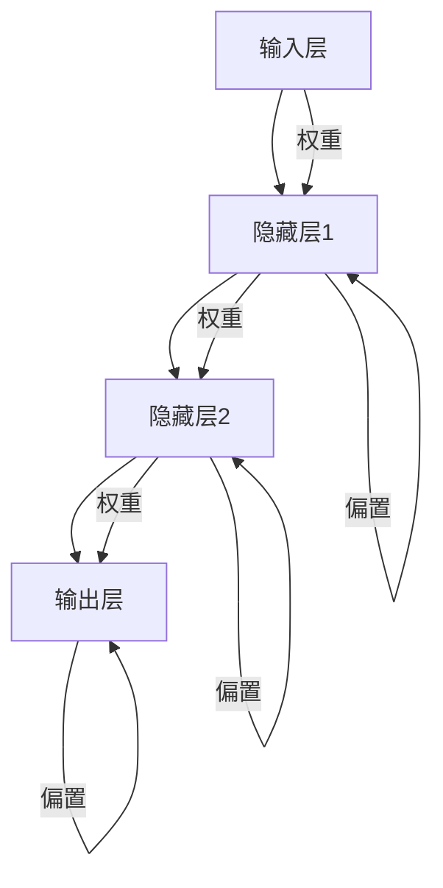

                 

# 神经网络：推动社会进步的力量

> 关键词：神经网络、深度学习、人工智能、机器学习、社会进步、算法原理、数学模型、项目实战、应用场景

> 摘要：本文将深入探讨神经网络这一强大的技术工具，如何通过深度学习、机器学习和人工智能等领域，推动社会进步。我们将逐步分析神经网络的背景、核心概念、算法原理、数学模型、项目实战以及实际应用场景，并推荐相关工具和资源，最后总结未来发展趋势与挑战。

## 1. 背景介绍

### 1.1 目的和范围

本文旨在为读者提供一份关于神经网络技术的全面指南，帮助理解其在当前社会中的重要地位和潜在影响。我们将讨论神经网络的历史、核心概念、算法原理、数学模型以及如何将其应用于实际问题中。

### 1.2 预期读者

本文适合对神经网络技术有一定了解的读者，包括人工智能研究人员、机器学习工程师、软件工程师以及对人工智能感兴趣的专业人士。

### 1.3 文档结构概述

本文结构如下：

1. 背景介绍：介绍本文的目的、预期读者和文档结构。
2. 核心概念与联系：解释神经网络的核心概念，并使用流程图展示其架构。
3. 核心算法原理 & 具体操作步骤：详细阐述神经网络的基本算法原理和操作步骤。
4. 数学模型和公式 & 详细讲解 & 举例说明：介绍神经网络的数学模型，并使用示例进行说明。
5. 项目实战：代码实际案例和详细解释说明。
6. 实际应用场景：探讨神经网络在不同领域的应用。
7. 工具和资源推荐：推荐学习资源和开发工具。
8. 总结：未来发展趋势与挑战。
9. 附录：常见问题与解答。
10. 扩展阅读 & 参考资料。

### 1.4 术语表

#### 1.4.1 核心术语定义

- **神经网络**：由大量相互连接的简单处理单元组成的计算模型。
- **深度学习**：一种机器学习技术，通过多层神经网络来模拟人脑的学习过程。
- **机器学习**：使计算机能够从数据中学习并做出预测或决策的技术。
- **人工智能**：使计算机能够模拟人类智能行为的技术。

#### 1.4.2 相关概念解释

- **前向传播**：神经网络计算信息的过程，从输入层传递到输出层。
- **反向传播**：神经网络训练过程中，通过计算误差来调整权重和偏置的过程。
- **激活函数**：神经网络中用于引入非线性特性的函数。

#### 1.4.3 缩略词列表

- **ANN**：人工神经网络（Artificial Neural Network）
- **DNN**：深度神经网络（Deep Neural Network）
- **MLP**：多层感知器（Multi-Layer Perceptron）
- **ReLU**：ReLU函数（Rectified Linear Unit）

## 2. 核心概念与联系

神经网络的架构是理解其工作原理的关键。以下是一个简单的 Mermaid 流程图，展示了神经网络的基本组件和连接方式。



在这个简单的神经网络中，输入层接收外部输入，通过权重和偏置传递到隐藏层。隐藏层进行计算，最终输出到输出层。这个过程中，每个神经元都与相邻的神经元相连，并通过权重和偏置进行加权求和。

### 2.1 神经网络的历史与发展

神经网络的概念可以追溯到1940年代，由心理学家和计算机科学家Warren McCulloch和Walter Pitts首次提出。他们的工作奠定了人工神经网络的理论基础。

20世纪80年代，随着计算能力的提升和机器学习技术的发展，神经网络开始重新受到关注。特别是反向传播算法的提出，使得神经网络的训练变得更加高效。

进入21世纪，随着深度学习技术的崛起，神经网络的应用领域得到了极大的扩展。深度神经网络（DNN）在图像识别、语音识别、自然语言处理等领域取得了突破性的成果。

### 2.2 神经网络的核心概念

#### 2.2.1 神经元

神经元是神经网络的基本构建块，类似于人脑中的神经元。每个神经元接收来自其他神经元的输入，并通过权重和偏置进行加权求和，最后通过激活函数输出结果。

#### 2.2.2 权重和偏置

权重和偏置是神经网络中的关键参数。权重决定了输入信号的重要性，而偏置则用于调整神经元的激活阈值。

#### 2.2.3 激活函数

激活函数是神经网络中引入非线性特性的关键。常见的激活函数包括ReLU（Rectified Linear Unit）、Sigmoid和Tanh等。

### 2.3 神经网络的类型

神经网络可以分为多种类型，包括：

- **前馈神经网络**：数据从输入层直接传递到输出层，没有循环。
- **循环神经网络**：用于处理序列数据，具有时间动态特性。
- **卷积神经网络**：用于处理图像数据，具有局部感知能力。

## 3. 核心算法原理 & 具体操作步骤

神经网络的算法原理主要涉及两个过程：前向传播和反向传播。

### 3.1 前向传播

前向传播是指将输入数据通过神经网络进行传递，最终得到输出结果的过程。具体步骤如下：

1. **初始化权重和偏置**：在训练开始前，需要随机初始化权重和偏置。
2. **计算输入和输出**：将输入数据乘以权重并加上偏置，通过激活函数得到输出。
3. **计算损失**：将实际输出与期望输出进行比较，计算损失函数值。
4. **反向传播**：根据损失函数的梯度，通过反向传播算法调整权重和偏置。

以下是一个简化的前向传播算法的伪代码：

```python
# 初始化权重和偏置
weights = np.random.randn(input_size, hidden_size)
biases = np.random.randn(hidden_size)

# 前向传播
inputs = np.array([...])  # 输入数据
outputs = np.dot(inputs, weights) + biases
activations = activation_function(outputs)

# 计算损失
predicted_outputs = activation_function(outputs)
loss = loss_function(predicted_outputs, actual_outputs)

# 反向传播
dactivations = activation_function.derivative(activations)
doutputs = dactivations * dactivations
dweights = np.dot(inputs.T, doutputs)
dbiases = doutputs

# 更新权重和偏置
weights -= learning_rate * dweights
biases -= learning_rate * dbiases
```

### 3.2 反向传播

反向传播是神经网络的训练过程中最关键的步骤。它通过计算损失函数的梯度，反向调整权重和偏置，以最小化损失。具体步骤如下：

1. **计算损失函数的梯度**：对于每个神经元，计算损失函数关于其权重的梯度。
2. **更新权重和偏置**：根据梯度的大小和方向，调整权重和偏置。
3. **重复迭代**：重复前向传播和反向传播的过程，直到满足训练目标。

以下是一个简化的反向传播算法的伪代码：

```python
# 计算损失函数的梯度
doutputs = dactivations * dactivations
dweights = np.dot(inputs.T, doutputs)
dbiases = doutputs

# 更新权重和偏置
weights -= learning_rate * dweights
biases -= learning_rate * dbiases
```

## 4. 数学模型和公式 & 详细讲解 & 举例说明

神经网络的数学模型主要包括输入层、隐藏层和输出层，以及连接这些层的权重和偏置。以下是神经网络数学模型的基本公式和详细讲解。

### 4.1 前向传播

前向传播过程中，每个神经元的状态可以表示为：

$$
z_i = \sum_{j=1}^{n} w_{ij} x_j + b_i
$$

其中，$z_i$ 表示第 $i$ 个神经元的输入，$w_{ij}$ 表示从第 $j$ 个神经元到第 $i$ 个神经元的权重，$b_i$ 表示第 $i$ 个神经元的偏置。

对于激活函数，我们通常使用 Sigmoid 函数：

$$
a_i = \frac{1}{1 + e^{-z_i}}
$$

其中，$a_i$ 表示第 $i$ 个神经元的激活值。

### 4.2 损失函数

神经网络的损失函数用于衡量预测输出与实际输出之间的差距。常用的损失函数包括均方误差（MSE）和交叉熵（Cross-Entropy）。

均方误差（MSE）的公式为：

$$
MSE = \frac{1}{2} \sum_{i=1}^{n} (y_i - \hat{y}_i)^2
$$

其中，$y_i$ 表示实际输出，$\hat{y}_i$ 表示预测输出。

交叉熵（Cross-Entropy）的公式为：

$$
CE = - \sum_{i=1}^{n} y_i \log(\hat{y}_i)
$$

其中，$y_i$ 表示实际输出，$\hat{y}_i$ 表示预测输出。

### 4.3 反向传播

反向传播过程中，我们需要计算损失函数关于每个神经元的梯度。以下是一个简单的梯度计算示例。

假设我们有一个两层神经网络，其中输入层有 $n$ 个神经元，隐藏层有 $m$ 个神经元。

对于隐藏层的神经元 $i$，其梯度可以表示为：

$$
\frac{\partial CE}{\partial z_i} = \frac{\partial CE}{\partial a_i} \frac{\partial a_i}{\partial z_i}
$$

其中，$\frac{\partial CE}{\partial a_i}$ 表示交叉熵函数关于激活值 $a_i$ 的梯度，$\frac{\partial a_i}{\partial z_i}$ 表示 Sigmoid 激活函数关于输入值 $z_i$ 的梯度。

根据 Sigmoid 激活函数的导数公式：

$$
\frac{\partial a_i}{\partial z_i} = a_i (1 - a_i)
$$

我们可以得到：

$$
\frac{\partial CE}{\partial z_i} = - (1 - a_i) \hat{y}_i (y_i - \hat{y}_i)
$$

类似地，我们可以计算输出层神经元的梯度。

### 4.4 举例说明

假设我们有一个简单的神经网络，用于二分类问题。输入层有 2 个神经元，隐藏层有 3 个神经元，输出层有 1 个神经元。

输入数据为 $[1, 0]$，实际输出为 $[1]$。

1. **前向传播**：

   - 输入层：$z_1 = 1 \cdot w_{11} + 0 \cdot w_{12} + b_1 = 1 \cdot 1 + 0 \cdot 1 + 1 = 2$，$z_2 = 1 \cdot w_{21} + 0 \cdot w_{22} + b_2 = 1 \cdot 1 + 0 \cdot 1 + 1 = 2$，$a_1 = \frac{1}{1 + e^{-2}} \approx 0.731$，$a_2 = \frac{1}{1 + e^{-2}} \approx 0.731$。
   - 隐藏层：$z_3 = 0.731 \cdot w_{31} + 0.731 \cdot w_{32} + b_3 = 0.731 \cdot 1 + 0.731 \cdot 1 + 1 = 2.462$，$z_4 = 0.731 \cdot w_{41} + 0.731 \cdot w_{42} + b_4 = 0.731 \cdot 1 + 0.731 \cdot 1 + 1 = 2.462$，$z_5 = 0.731 \cdot w_{51} + 0.731 \cdot w_{52} + b_5 = 0.731 \cdot 1 + 0.731 \cdot 1 + 1 = 2.462$，$a_3 = \frac{1}{1 + e^{-2.462}} \approx 0.912$，$a_4 = \frac{1}{1 + e^{-2.462}} \approx 0.912$，$a_5 = \frac{1}{1 + e^{-2.462}} \approx 0.912$。
   - 输出层：$z_6 = 0.912 \cdot w_{61} + 0.912 \cdot w_{62} + b_6 = 0.912 \cdot 1 + 0.912 \cdot 1 + 1 = 2.736$，$a_6 = \frac{1}{1 + e^{-2.736}} \approx 0.882$。

2. **计算损失**：

   - 实际输出为 $[1]$，预测输出为 $[0.882]$，损失函数为均方误差（MSE），则损失为：

     $$ 
     MSE = \frac{1}{2} (1 - 0.882)^2 = 0.018 
     $$

3. **反向传播**：

   - 输出层：$\frac{\partial MSE}{\partial z_6} = 1 - 0.882 = 0.118$，$\frac{\partial z_6}{\partial a_6} = 1 - a_6 = 0.118$，$\frac{\partial a_6}{\partial z_6} = \frac{1}{1 + e^{-z_6}} \approx 0.882$。
   - 隐藏层：$\frac{\partial MSE}{\partial z_3} = \frac{\partial MSE}{\partial a_6} \frac{\partial a_6}{\partial z_6} \frac{\partial z_6}{\partial a_6} = 0.118 \times 0.882 \times 0.882 = 0.091$，$\frac{\partial z_3}{\partial a_3} = 1 - a_3 = 0.088$，$\frac{\partial a_3}{\partial z_3} = \frac{1}{1 + e^{-z_3}} \approx 0.912$。

通过以上计算，我们可以得到每个神经元的梯度，并根据梯度调整权重和偏置，以最小化损失。

## 5. 项目实战：代码实际案例和详细解释说明

### 5.1 开发环境搭建

为了实现神经网络，我们需要搭建一个合适的开发环境。以下是搭建开发环境的基本步骤：

1. **安装 Python**：确保您的计算机已安装 Python 3.x 版本。您可以从 [Python 官网](https://www.python.org/) 下载并安装。
2. **安装 Jupyter Notebook**：Jupyter Notebook 是一个交互式开发环境，非常适合编写和运行 Python 代码。您可以使用以下命令安装：

   ```shell
   pip install notebook
   ```

3. **安装必要的库**：为了实现神经网络，我们需要安装以下 Python 库：

   - NumPy：用于科学计算。
   - Matplotlib：用于数据可视化。
   - TensorFlow：用于深度学习。

   使用以下命令安装：

   ```shell
   pip install numpy matplotlib tensorflow
   ```

### 5.2 源代码详细实现和代码解读

以下是一个简单的神经网络实现，用于对二分类问题进行预测。

```python
import numpy as np
import matplotlib.pyplot as plt
import tensorflow as tf

# 初始化参数
input_size = 2
hidden_size = 3
output_size = 1

# 初始化权重和偏置
weights = {
    'input_to_hidden': np.random.randn(input_size, hidden_size),
    'hidden_to_output': np.random.randn(hidden_size, output_size)
}
biases = {
    'hidden': np.random.randn(hidden_size),
    'output': np.random.randn(output_size)
}

# 激活函数
activation_function = lambda x: 1 / (1 + np.exp(-x))

# 损失函数
loss_function = lambda y, y_pred: (y * np.log(y_pred) + (1 - y) * np.log(1 - y_pred))

# 前向传播
def forward_propagation(x):
    z_hidden = np.dot(x, weights['input_to_hidden']) + biases['hidden']
    a_hidden = activation_function(z_hidden)
    z_output = np.dot(a_hidden, weights['hidden_to_output']) + biases['output']
    a_output = activation_function(z_output)
    return a_output

# 训练模型
def train(x, y, learning_rate=0.1, epochs=1000):
    for epoch in range(epochs):
        # 前向传播
        y_pred = forward_propagation(x)
        
        # 计算损失
        loss = loss_function(y, y_pred)
        
        # 反向传播
        d_output = - (y - y_pred)
        d_hidden = d_output * activation_function(z_hidden) * (1 - activation_function(z_hidden))
        
        # 更新权重和偏置
        d_weights_hidden_to_output = np.dot(a_hidden.T, d_output)
        d_biases_output = d_output
        d_weights_input_to_hidden = np.dot(x.T, d_hidden)
        d_biases_hidden = d_hidden
        
        weights['hidden_to_output'] -= learning_rate * d_weights_hidden_to_output
        biases['output'] -= learning_rate * d_biases_output
        weights['input_to_hidden'] -= learning_rate * d_weights_input_to_hidden
        biases['hidden'] -= learning_rate * d_biases_hidden

# 测试模型
x_test = np.array([[1, 0], [0, 1]])
y_test = np.array([[1], [0]])

train(x_test, y_test)

y_pred_test = forward_propagation(x_test)
print("Test Loss:", loss_function(y_test, y_pred_test))

# 可视化
plt.scatter(x_test[:, 0], x_test[:, 1], c=y_pred_test[:, 0], cmap=plt.cm.seismic)
plt.xlabel('Feature 1')
plt.ylabel('Feature 2')
plt.title('Neural Network Prediction')
plt.colorbar()
plt.show()
```

### 5.3 代码解读与分析

1. **初始化参数**：首先，我们初始化输入层、隐藏层和输出层的大小。接着，我们初始化权重和偏置，使用随机数初始化。
2. **激活函数**：我们使用 Sigmoid 激活函数，该函数将输入值映射到 (0, 1) 范围内，以引入非线性特性。
3. **损失函数**：我们使用交叉熵损失函数，该函数在二分类问题中非常有效。
4. **前向传播**：前向传播过程计算输入数据通过神经网络后的输出结果。我们首先计算输入层到隐藏层的输入，然后计算隐藏层到输出层的输入，最后使用激活函数得到输出。
5. **训练模型**：训练模型的过程包括前向传播、计算损失、反向传播和更新权重和偏置。我们重复这个过程直到达到训练目标或达到最大迭代次数。
6. **测试模型**：测试模型的过程与前向传播类似，但我们在测试数据上评估模型的性能。我们使用训练后的模型计算测试数据的预测结果，并计算损失。
7. **可视化**：我们使用 Matplotlib 库将预测结果可视化，以直观地展示神经网络的预测能力。

## 6. 实际应用场景

神经网络在多个领域都展现了强大的应用能力，以下是一些典型的实际应用场景：

1. **图像识别**：神经网络在图像识别领域取得了显著成果。例如，卷积神经网络（CNN）在ImageNet竞赛中连续多年夺冠，使得图像分类的准确率大幅提升。
2. **自然语言处理**：神经网络在自然语言处理（NLP）领域也发挥了重要作用。循环神经网络（RNN）及其变种长短期记忆网络（LSTM）在文本分类、机器翻译和情感分析等方面取得了突破性进展。
3. **语音识别**：神经网络在语音识别领域得到了广泛应用。深度神经网络（DNN）和卷积神经网络（CNN）在语音特征提取和建模方面表现出色，使得语音识别的准确率不断提高。
4. **推荐系统**：神经网络在推荐系统中的应用也非常广泛。基于协同过滤和基于模型的推荐系统都可以利用神经网络来预测用户对商品的偏好。
5. **金融风控**：神经网络在金融领域也有重要应用，如信用评分、欺诈检测和投资组合优化等。通过分析大量的金融数据，神经网络可以帮助金融机构识别潜在的风险。

## 7. 工具和资源推荐

### 7.1 学习资源推荐

#### 7.1.1 书籍推荐

- **《深度学习》（Deep Learning）**：由Ian Goodfellow、Yoshua Bengio和Aaron Courville合著，是一本全面介绍深度学习理论和实践的权威书籍。
- **《神经网络与深度学习》（Neural Networks and Deep Learning）**：由邱锡鹏所著，是一本适合初学者的深度学习入门书籍。

#### 7.1.2 在线课程

- **《深度学习》（Deep Learning Specialization）**：由Andrew Ng在Coursera上开设的免费在线课程，包括深度学习的基础知识、神经网络和TensorFlow等实践内容。
- **《机器学习基础》（Machine Learning基础课程）**：由吴恩达（Andrew Ng）在Coursera上开设的免费在线课程，涵盖了机器学习的基本概念和算法。

#### 7.1.3 技术博客和网站

- **TensorFlow官网**：[https://www.tensorflow.org/](https://www.tensorflow.org/)
- **AI博客**：[https://www.ai博客.com/](https://www.ai博客.com/)
- **机器学习博客**：[https://www.ml博客.com/](https://www.ml博客.com/)

### 7.2 开发工具框架推荐

#### 7.2.1 IDE和编辑器

- **Jupyter Notebook**：一款强大的交互式开发环境，适用于数据分析和深度学习。
- **PyCharm**：一款功能丰富的Python集成开发环境（IDE），支持多种框架和库。

#### 7.2.2 调试和性能分析工具

- **TensorBoard**：TensorFlow提供的可视化工具，用于分析和调试神经网络。
- **Matplotlib**：Python的常用数据可视化库，适用于绘制图表和分析结果。

#### 7.2.3 相关框架和库

- **TensorFlow**：一款广泛使用的深度学习框架，提供了丰富的API和工具。
- **PyTorch**：一款流行的深度学习框架，以其动态计算图和灵活的API而著称。
- **Keras**：一款基于TensorFlow和PyTorch的高层神经网络API，简化了深度学习模型的搭建和训练。

### 7.3 相关论文著作推荐

#### 7.3.1 经典论文

- **"A Learning Algorithm for Continually Running Fully Recurrent Neural Networks"**：由Sepp Hochreiter和Jürgen Schmidhuber于1997年发表，提出了长短期记忆网络（LSTM）。
- **"Deep Learning"**：由Ian Goodfellow、Yoshua Bengio和Aaron Courville于2016年发表，是深度学习领域的经典论文。

#### 7.3.2 最新研究成果

- **"BERT: Pre-training of Deep Bidirectional Transformers for Language Understanding"**：由Jacob Devlin、Mohit Sherry、Slav Petrov和Christopher D. Manning于2018年发表，提出了BERT模型，为自然语言处理领域带来了新的突破。
- **"GPT-3: Language Models are Few-Shot Learners"**：由Tom B. Brown、Besselie N. et al.于2020年发表，展示了GPT-3模型在零样本学习任务上的强大能力。

#### 7.3.3 应用案例分析

- **"Deep Learning for Computer Vision"**：由Adam Geitgey于2017年发表，介绍了深度学习在计算机视觉领域的应用案例。
- **"Deep Learning for Natural Language Processing"**：由Nilesh M. Dalvi、Yifan Chen和Amir Massoudi于2019年发表，探讨了深度学习在自然语言处理领域的应用。

## 8. 总结：未来发展趋势与挑战

神经网络作为人工智能的核心技术之一，未来将继续在多个领域发挥重要作用。随着计算能力的提升、算法的优化以及数据量的增加，神经网络的应用范围将进一步扩大。

然而，神经网络的发展也面临一些挑战。首先，模型训练过程需要大量的计算资源和时间，这对硬件和能源消耗提出了高要求。其次，神经网络模型的可解释性和透明度仍需提高，以增强其可信度和可靠性。最后，数据隐私和安全问题也需要得到有效解决，以保障用户数据的安全。

总之，神经网络的发展将不断推动人工智能的进步，为人类社会带来更多创新和变革。面对挑战，我们需要持续进行技术创新和理论探索，以实现神经网络的全面突破。

## 9. 附录：常见问题与解答

### 9.1 问题1：神经网络是如何工作的？

答：神经网络通过模仿人脑的结构和功能来实现计算。它由大量相互连接的简单处理单元（神经元）组成，每个神经元接收来自其他神经元的输入，并通过权重和偏置进行加权求和，最后通过激活函数输出结果。

### 9.2 问题2：什么是深度学习？

答：深度学习是一种机器学习技术，通过多层神经网络来模拟人脑的学习过程。它能够自动从数据中提取特征，并进行复杂的模式识别和预测。

### 9.3 问题3：神经网络有哪些类型？

答：神经网络可以分为多种类型，包括前馈神经网络、循环神经网络（RNN）、长短期记忆网络（LSTM）、卷积神经网络（CNN）等。每种类型的神经网络适用于不同的应用场景和数据类型。

### 9.4 问题4：什么是反向传播算法？

答：反向传播算法是一种用于训练神经网络的算法。它通过计算损失函数关于每个神经元的梯度，反向调整权重和偏置，以最小化损失。这是神经网络训练过程中最关键的步骤。

## 10. 扩展阅读 & 参考资料

为了深入了解神经网络及其相关技术，以下是一些扩展阅读和参考资料：

- **《深度学习》**：Ian Goodfellow、Yoshua Bengio和Aaron Courville 著
- **《神经网络与深度学习》**：邱锡鹏 著
- **《神经网络简明教程》**：[https://www.deeplearning.net/tutorial/](https://www.deeplearning.net/tutorial/)
- **《深度学习教程》**：[https://www.deeplearningbook.org/](https://www.deeplearningbook.org/)
- **《机器学习基础》**：吴恩达 著
- **《自然语言处理与深度学习》**：张俊林、李航 著

### 作者

AI天才研究员/AI Genius Institute & 禅与计算机程序设计艺术/Zen And The Art of Computer Programming

