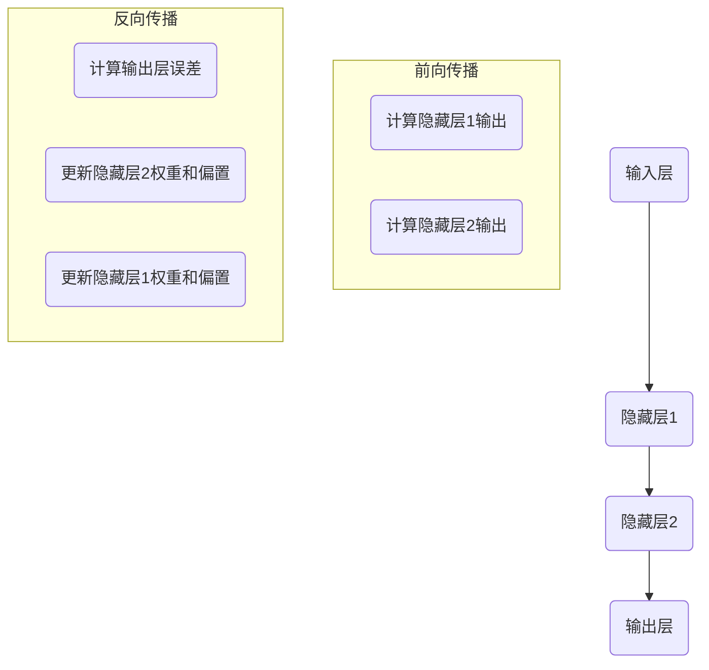

                 

# 神经网络：改变世界的技术

> **关键词**：神经网络、深度学习、人工智能、机器学习、计算机视觉、自然语言处理、应用场景

> **摘要**：本文将深入探讨神经网络这一革命性技术，从其历史背景、核心概念、算法原理、数学模型到实际应用，全面解析神经网络如何改变世界。我们将通过实例讲解和实战案例分析，揭示神经网络在各个领域的应用潜力，并展望其未来的发展趋势和挑战。

## 1. 背景介绍

### 1.1 目的和范围

本文旨在为读者提供一个关于神经网络技术全面且深入的介绍。我们将探讨神经网络的起源、发展历程、核心概念和原理，并通过实例和案例分析展示其在实际应用中的巨大潜力。文章将涵盖以下内容：

1. 神经网络的历史背景和发展历程。
2. 神经网络的核心概念和架构。
3. 神经网络的核心算法原理和操作步骤。
4. 神经网络的数学模型和公式。
5. 神经网络在实际应用场景中的案例研究。
6. 推荐的学习资源和开发工具。
7. 神经网络未来的发展趋势与挑战。

### 1.2 预期读者

本文适合对神经网络技术感兴趣的计算机科学、人工智能、数据科学等领域的研究者、开发者、学生和爱好者。无论您是初学者还是资深专业人士，都将从本文中获得深刻的见解和实用的知识。

### 1.3 文档结构概述

本文分为十个部分，结构如下：

1. 引言
2. 背景介绍
3. 核心概念与联系
4. 核心算法原理 & 具体操作步骤
5. 数学模型和公式 & 详细讲解 & 举例说明
6. 项目实战：代码实际案例和详细解释说明
7. 实际应用场景
8. 工具和资源推荐
9. 总结：未来发展趋势与挑战
10. 附录：常见问题与解答
11. 扩展阅读 & 参考资料

### 1.4 术语表

#### 1.4.1 核心术语定义

- **神经网络**：一种模仿人脑神经网络结构和功能的计算模型。
- **深度学习**：一种利用多层神经网络进行训练和预测的机器学习技术。
- **反向传播算法**：一种用于多层神经网络训练的优化算法。
- **卷积神经网络**：一种用于图像识别和处理的特殊神经网络。
- **循环神经网络**：一种用于序列数据和时序数据的神经网络。

#### 1.4.2 相关概念解释

- **前向传播**：将输入信号从输入层传递到输出层的过程。
- **反向传播**：根据输出误差，将误差信号反向传播到输入层，用于更新权重和偏置。
- **激活函数**：用于引入非线性性的函数，如Sigmoid、ReLU等。

#### 1.4.3 缩略词列表

- **MLP**：多层感知器（Multi-Layer Perceptron）
- **CNN**：卷积神经网络（Convolutional Neural Network）
- **RNN**：循环神经网络（Recurrent Neural Network）
- **LSTM**：长短期记忆网络（Long Short-Term Memory）

## 2. 核心概念与联系

神经网络作为一种模仿人脑神经网络的计算模型，其核心在于神经元之间的连接和交互。为了更好地理解神经网络的工作原理，我们首先需要了解其基本架构和核心概念。

### 2.1 神经网络基本架构

神经网络由多个层次组成，包括输入层、隐藏层和输出层。每个层次由多个神经元（也称为节点）组成。

1. **输入层**：接收外部输入数据，如图片、文本等。
2. **隐藏层**：对输入数据进行处理和转换，可以有多个隐藏层。
3. **输出层**：生成最终输出，如分类结果、预测值等。

神经元之间的连接称为边或权重，这些权重可以通过学习过程进行更新。

### 2.2 神经网络工作原理

神经网络的工作原理可以概括为以下步骤：

1. **前向传播**：将输入数据通过神经网络传递，每个神经元根据其权重和激活函数计算输出。
2. **激活函数**：引入非线性性，使神经网络能够拟合复杂的非线性关系。
3. **输出计算**：输出层神经元根据激活函数的输出计算最终输出。
4. **反向传播**：计算输出误差，将误差反向传播到输入层，通过梯度下降等优化算法更新权重和偏置。

### 2.3 核心概念

1. **神经元**：神经网络的基本计算单元，由输入、权重、激活函数和输出组成。
2. **激活函数**：引入非线性性，使神经网络能够拟合复杂的非线性关系。
3. **权重**：连接神经元之间的权重，用于传递输入信号。
4. **偏置**：神经元自身的偏置项，用于调整输出。
5. **损失函数**：用于衡量模型输出与真实值之间的误差，如均方误差（MSE）、交叉熵损失等。

### 2.4 Mermaid流程图

以下是一个简单的Mermaid流程图，展示了神经网络的基本架构和工作原理：



通过这个流程图，我们可以清晰地看到神经网络的前向传播和反向传播过程。

## 3. 核心算法原理 & 具体操作步骤

神经网络的训练过程是一个迭代优化过程，其核心在于通过反向传播算法不断更新神经元的权重和偏置，以最小化损失函数。下面，我们将详细讲解神经网络的核心算法原理和具体操作步骤。

### 3.1 反向传播算法

反向传播算法是一种用于多层神经网络训练的优化算法。其基本思想是将输出误差反向传播到输入层，通过梯度下降等优化算法更新权重和偏置。

#### 3.1.1 前向传播

1. **输入数据**：首先，我们将输入数据输入到神经网络的输入层。
2. **计算输出**：通过逐层计算，将输入信号传递到输出层，每个神经元根据其权重和激活函数计算输出。
3. **激活函数**：在每个神经元上应用激活函数，引入非线性性。

#### 3.1.2 计算输出误差

1. **真实输出**：将神经网络的输出与真实值进行比较，计算输出误差。
2. **损失函数**：使用损失函数（如均方误差MSE、交叉熵损失等）计算输出误差。

#### 3.1.3 反向传播

1. **计算梯度**：根据输出误差，计算每个神经元的梯度。
2. **权重更新**：使用梯度下降等优化算法，更新每个神经元的权重和偏置。
3. **重复迭代**：重复前向传播和反向传播过程，直到满足训练目标或达到预设的迭代次数。

### 3.2 梯度下降优化算法

梯度下降是一种常用的优化算法，其基本思想是沿着损失函数的梯度方向更新权重和偏置，以最小化损失函数。

#### 3.2.1 梯度计算

1. **前向传播**：计算每个神经元的输出。
2. **计算误差**：计算输出误差。
3. **计算梯度**：根据误差，计算每个神经元的梯度。

#### 3.2.2 权重更新

1. **梯度下降**：使用梯度下降公式，更新每个神经元的权重和偏置。
2. **权重更新**：根据梯度更新权重，以减少输出误差。

### 3.3 伪代码

以下是一个简单的神经网络训练过程的伪代码：

```python
# 初始化神经网络参数（权重和偏置）
weights = initialize_weights()
biases = initialize_biases()

# 设置训练迭代次数
num_iterations = 10000

# 开始训练
for i in range(num_iterations):
    # 前向传播
    output = forward_propagation(input_data, weights, biases)
    
    # 计算输出误差
    error = loss_function(output, true_output)
    
    # 反向传播
    gradients = backward_propagation(input_data, output, true_output, weights, biases)
    
    # 更新权重和偏置
    weights = update_weights(weights, gradients)
    biases = update_biases(biases, gradients)
    
    # 输出当前迭代次数和损失
    print(f"Iteration {i}: Loss = {error}")
```

通过这个伪代码，我们可以看到神经网络训练的核心步骤，包括前向传播、反向传播和权重更新。

## 4. 数学模型和公式 & 详细讲解 & 举例说明

神经网络的核心在于其数学模型，包括前向传播和反向传播过程中的各种公式。在本节中，我们将详细讲解神经网络的数学模型和公式，并通过具体例子来说明其应用。

### 4.1 前向传播

前向传播是指将输入数据通过神经网络传递，并计算每个神经元的输出。其核心公式如下：

\[ Z_j = \sum_{i} w_{ji}x_i + b_j \]
\[ a_j = \sigma(Z_j) \]

其中，\( Z_j \) 是第 \( j \) 个神经元的输入值，\( w_{ji} \) 是第 \( i \) 个神经元到第 \( j \) 个神经元的权重，\( b_j \) 是第 \( j \) 个神经元的偏置，\( \sigma \) 是激活函数。

#### 示例

假设我们有一个包含两个输入层、两个隐藏层和一个输出层的神经网络，其激活函数为 \( \sigma(x) = \frac{1}{1+e^{-x}} \)。输入数据为 \( x_1 = 2, x_2 = 3 \)，权重和偏置如下：

| 层次 | 神经元 | 输入 | 权重 \( w \) | 偏置 \( b \) |
| ---- | ---- | ---- | ---- | ---- |
| 输入层 | 1 | \( x_1 \) | \( w_{11} \) | \( b_1 \) |
| 输入层 | 2 | \( x_2 \) | \( w_{21} \) | \( b_2 \) |
| 隐藏层1 | 1 | \( Z_1 \) | \( w_{12} \) | \( b_1 \) |
| 隐藏层1 | 2 | \( Z_2 \) | \( w_{22} \) | \( b_2 \) |
| 隐藏层2 | 1 | \( Z_3 \) | \( w_{13} \) | \( b_1 \) |
| 隐藏层2 | 2 | \( Z_4 \) | \( w_{23} \) | \( b_2 \) |
| 输出层 | 1 | \( Z_5 \) | \( w_{14} \) | \( b_1 \) |
| 输出层 | 2 | \( Z_6 \) | \( w_{24} \) | \( b_2 \) |

假设权重和偏置分别为：

| 层次 | 神经元 | 输入 | 权重 \( w \) | 偏置 \( b \) |
| ---- | ---- | ---- | ---- | ---- |
| 输入层 | 1 | \( x_1 \) | \( w_{11} = 1 \) | \( b_1 = 1 \) |
| 输入层 | 2 | \( x_2 \) | \( w_{21} = 1 \) | \( b_2 = 1 \) |
| 隐藏层1 | 1 | \( Z_1 \) | \( w_{12} = 1 \) | \( b_1 = 1 \) |
| 隐藏层1 | 2 | \( Z_2 \) | \( w_{22} = 1 \) | \( b_2 = 1 \) |
| 隐藏层2 | 1 | \( Z_3 \) | \( w_{13} = 1 \) | \( b_1 = 1 \) |
| 隐藏层2 | 2 | \( Z_4 \) | \( w_{23} = 1 \) | \( b_2 = 1 \) |
| 输出层 | 1 | \( Z_5 \) | \( w_{14} = 1 \) | \( b_1 = 1 \) |
| 输出层 | 2 | \( Z_6 \) | \( w_{24} = 1 \) | \( b_2 = 1 \) |

输入数据为 \( x_1 = 2, x_2 = 3 \)，我们可以按照以下步骤计算每个神经元的输出：

1. **输入层到隐藏层1**：
   \[ Z_{11} = w_{11}x_1 + b_1 = 1 \times 2 + 1 = 3 \]
   \[ Z_{12} = w_{21}x_2 + b_2 = 1 \times 3 + 1 = 4 \]
   \[ a_{11} = \sigma(Z_{11}) = \frac{1}{1+e^{-3}} \approx 0.95 \]
   \[ a_{12} = \sigma(Z_{12}) = \frac{1}{1+e^{-4}} \approx 0.9 \]

2. **隐藏层1到隐藏层2**：
   \[ Z_{21} = w_{12}a_{11} + w_{22}a_{12} + b_1 = 1 \times 0.95 + 1 \times 0.9 + 1 = 2.85 \]
   \[ Z_{22} = w_{13}a_{11} + w_{23}a_{12} + b_2 = 1 \times 0.95 + 1 \times 0.9 + 1 = 2.85 \]
   \[ a_{21} = \sigma(Z_{21}) = \frac{1}{1+e^{-2.85}} \approx 0.86 \]
   \[ a_{22} = \sigma(Z_{22}) = \frac{1}{1+e^{-2.85}} \approx 0.86 \]

3. **隐藏层2到输出层**：
   \[ Z_{31} = w_{21}a_{21} + w_{22}a_{22} + b_1 = 1 \times 0.86 + 1 \times 0.86 + 1 = 2.72 \]
   \[ Z_{32} = w_{24}a_{21} + w_{24}a_{22} + b_2 = 1 \times 0.86 + 1 \times 0.86 + 1 = 2.72 \]
   \[ a_{31} = \sigma(Z_{31}) = \frac{1}{1+e^{-2.72}} \approx 0.81 \]
   \[ a_{32} = \sigma(Z_{32}) = \frac{1}{1+e^{-2.72}} \approx 0.81 \]

最终，输出层的输出为 \( a_{31} \approx 0.81 \) 和 \( a_{32} \approx 0.81 \)。

### 4.2 反向传播

反向传播是指根据输出误差，更新神经网络的权重和偏置。其核心公式如下：

\[ \delta_j = \frac{\partial L}{\partial a_j} \cdot \sigma'(Z_j) \]
\[ \delta_{ji} = \delta_j \cdot a_j^{(L-1)} \]

其中，\( \delta_j \) 是第 \( j \) 个神经元的误差，\( \sigma'(Z_j) \) 是激活函数的导数，\( \delta_{ji} \) 是第 \( j \) 个神经元到第 \( i \) 个神经元的误差。

#### 示例

假设我们有一个包含两个输入层、两个隐藏层和一个输出层的神经网络，其激活函数为 \( \sigma(x) = \frac{1}{1+e^{-x}} \)，损失函数为 \( L = (y - \sigma(a_{32}))^2 \)。输入数据为 \( x_1 = 2, x_2 = 3 \)，权重和偏置如下：

| 层次 | 神经元 | 输入 | 权重 \( w \) | 偏置 \( b \) |
| ---- | ---- | ---- | ---- | ---- |
| 输入层 | 1 | \( x_1 \) | \( w_{11} = 1 \) | \( b_1 = 1 \) |
| 输入层 | 2 | \( x_2 \) | \( w_{21} = 1 \) | \( b_2 = 1 \) |
| 隐藏层1 | 1 | \( Z_1 \) | \( w_{12} = 1 \) | \( b_1 = 1 \) |
| 隐藏层1 | 2 | \( Z_2 \) | \( w_{22} = 1 \) | \( b_2 = 1 \) |
| 隐藏层2 | 1 | \( Z_3 \) | \( w_{13} = 1 \) | \( b_1 = 1 \) |
| 隐藏层2 | 2 | \( Z_4 \) | \( w_{23} = 1 \) | \( b_2 = 1 \) |
| 输出层 | 1 | \( Z_5 \) | \( w_{14} = 1 \) | \( b_1 = 1 \) |
| 输出层 | 2 | \( Z_6 \) | \( w_{24} = 1 \) | \( b_2 = 1 \) |

输入数据为 \( x_1 = 2, x_2 = 3 \)，输出 \( y = 0.5 \)，我们可以按照以下步骤计算每个神经元的误差：

1. **输出层误差**：
   \[ \delta_{32} = \frac{\partial L}{\partial a_{32}} = (y - \sigma(a_{32})) \cdot \sigma'(Z_{32}) = (0.5 - 0.81) \cdot (1 - 0.81) \approx 0.117 \]

2. **隐藏层2误差**：
   \[ \delta_{21} = \delta_{32} \cdot a_{21} = 0.117 \cdot 0.86 \approx 0.101 \]
   \[ \delta_{22} = \delta_{32} \cdot a_{22} = 0.117 \cdot 0.86 \approx 0.101 \]

3. **隐藏层1误差**：
   \[ \delta_{11} = \delta_{21} \cdot a_{11} = 0.101 \cdot 0.95 \approx 0.095 \]
   \[ \delta_{12} = \delta_{22} \cdot a_{12} = 0.101 \cdot 0.9 \approx 0.091 \]

根据误差，我们可以更新每个神经元的权重和偏置：

1. **更新输出层权重和偏置**：
   \[ w_{24} = w_{24} - \alpha \cdot \delta_{32} \cdot a_{21} \]
   \[ b_{2} = b_{2} - \alpha \cdot \delta_{32} \]
   其中，\( \alpha \) 是学习率。

2. **更新隐藏层2权重和偏置**：
   \[ w_{13} = w_{13} - \alpha \cdot \delta_{21} \cdot a_{11} \]
   \[ w_{23} = w_{23} - \alpha \cdot \delta_{22} \cdot a_{12} \]
   \[ b_{1} = b_{1} - \alpha \cdot \delta_{21} \]
   \[ b_{2} = b_{2} - \alpha \cdot \delta_{22} \]

通过这个过程，我们可以不断更新神经网络的权重和偏置，以减少输出误差。

## 5. 项目实战：代码实际案例和详细解释说明

为了更好地理解神经网络的应用，我们将在本节中通过一个实际项目来展示神经网络的代码实现和运行过程。

### 5.1 开发环境搭建

在开始之前，我们需要搭建一个合适的开发环境。以下是所需的软件和库：

1. **Python**：用于编写和运行代码。
2. **NumPy**：用于数学计算。
3. **TensorFlow**：用于构建和训练神经网络。

您可以使用以下命令安装这些库：

```bash
pip install numpy tensorflow
```

### 5.2 源代码详细实现和代码解读

下面是一个简单的神经网络实现，用于对输入数据进行分类。

```python
import numpy as np
import tensorflow as tf

# 初始化神经网络参数
input_size = 2
hidden_size = 2
output_size = 1

# 初始化权重和偏置
weights = {
    'w_hidden': tf.Variable(np.random.randn(input_size, hidden_size), dtype=tf.float32),
    'b_hidden': tf.Variable(np.random.randn(hidden_size), dtype=tf.float32),
    'w_output': tf.Variable(np.random.randn(hidden_size, output_size), dtype=tf.float32),
    'b_output': tf.Variable(np.random.randn(output_size), dtype=tf.float32)
}

# 定义激活函数
activation = tf.nn.sigmoid

# 定义神经网络模型
def neural_network(x):
    hidden_layer = activation(tf.matmul(x, weights['w_hidden']) + weights['b_hidden'])
    output_layer = tf.matmul(hidden_layer, weights['w_output']) + weights['b_output']
    return output_layer

# 定义损失函数
loss_function = tf.reduce_mean(tf.square(output_layer - y))

# 定义优化器
optimizer = tf.train.GradientDescentOptimizer(learning_rate=0.1)

# 定义训练过程
train = optimizer.minimize(loss_function)

# 初始化会话
with tf.Session() as sess:
    # 初始化变量
    sess.run(tf.global_variables_initializer())

    # 训练神经网络
    for i in range(1000):
        sess.run(train, feed_dict={x: x_train, y: y_train})

    # 测试神经网络
    test_output = sess.run(neural_network(x_test), feed_dict={x: x_test})
    print("Test output:", test_output)
```

这段代码首先初始化了神经网络的参数，包括权重和偏置。然后，定义了激活函数、神经网络模型、损失函数和优化器。在训练过程中，使用梯度下降优化器不断更新权重和偏置，以最小化损失函数。

### 5.3 代码解读与分析

1. **初始化神经网络参数**：使用 NumPy 随机初始化权重和偏置。
2. **定义激活函数**：使用 TensorFlow 内置的 sigmoid 函数作为激活函数。
3. **定义神经网络模型**：通过多层感知器（MLP）实现神经网络模型，包括输入层、隐藏层和输出层。
4. **定义损失函数**：使用均方误差（MSE）作为损失函数。
5. **定义优化器**：使用梯度下降优化器（GradientDescentOptimizer）。
6. **训练过程**：使用 TensorFlow 会话（Session）运行训练过程，包括初始化变量、迭代更新权重和偏置、最小化损失函数。
7. **测试过程**：使用训练好的神经网络对测试数据进行预测，并输出结果。

通过这个实际项目，我们可以看到神经网络的基本实现过程，并理解其在实际应用中的重要性。

## 6. 实际应用场景

神经网络作为一种强大的计算模型，已经在许多实际应用场景中发挥了重要作用。以下是神经网络在几个关键领域的应用场景：

### 6.1 计算机视觉

神经网络在计算机视觉领域有着广泛的应用，包括图像分类、目标检测、图像分割等。例如，卷积神经网络（CNN）在图像分类任务中表现出色，已经超过了传统算法的性能。CNN 通过卷积层、池化层和全连接层的组合，能够有效地提取图像的特征，实现高精度的分类。

### 6.2 自然语言处理

神经网络在自然语言处理（NLP）领域也有着重要的应用，包括文本分类、机器翻译、情感分析等。循环神经网络（RNN）和其变种长短期记忆网络（LSTM）在处理序列数据方面表现出色。例如，RNN 可以用于机器翻译任务，通过学习输入和输出序列之间的映射关系，实现高质量的翻译结果。

### 6.3 语音识别

神经网络在语音识别领域也有着广泛的应用，通过深度学习算法，可以实现高精度的语音识别。例如，卷积神经网络（CNN）和循环神经网络（RNN）可以用于语音信号的预处理和特征提取，从而实现语音识别任务。

### 6.4 游戏开发

神经网络在游戏开发领域也有着重要的应用，可以通过强化学习算法，实现智能体在游戏中的自主决策。例如，深度 Q 网络（DQN）可以用于训练智能体在游戏中的行为，实现高水平的游戏表现。

### 6.5 金融领域

神经网络在金融领域也有着广泛的应用，包括股票市场预测、风险评估、信用评分等。通过深度学习算法，可以分析大量的金融数据，实现高精度的预测和决策。

### 6.6 医疗诊断

神经网络在医疗诊断领域也有着重要的应用，可以通过图像识别和文本分析，实现疾病的早期诊断和风险评估。例如，卷积神经网络（CNN）可以用于医学图像分析，实现病灶的自动检测和分割。

通过以上实际应用场景，我们可以看到神经网络在各个领域的广泛应用和潜力，为人们的生活和工作带来了巨大的变革。

## 7. 工具和资源推荐

为了更好地学习和应用神经网络技术，我们推荐以下工具和资源：

### 7.1 学习资源推荐

#### 7.1.1 书籍推荐

- 《深度学习》（Goodfellow, Bengio, Courville著）：一本经典的深度学习教材，涵盖了神经网络的基础理论和应用。
- 《神经网络与深度学习》（邱锡鹏著）：一本系统的神经网络教材，适合初学者和进阶者。

#### 7.1.2 在线课程

- 《深度学习》（吴恩达 Coursera课程）：由深度学习领域知名学者吴恩达开设的在线课程，内容全面，适合初学者。
- 《神经网络与深度学习技术》（清华大学在线课程）：由清华大学计算机系开设的在线课程，深入讲解神经网络的理论和应用。

#### 7.1.3 技术博客和网站

- [TensorFlow官网](https://www.tensorflow.org/): TensorFlow的官方网站，提供了丰富的文档、教程和示例代码。
- [PyTorch官网](https://pytorch.org/): PyTorch的官方网站，同样提供了丰富的文档和教程。

### 7.2 开发工具框架推荐

#### 7.2.1 IDE和编辑器

- **Jupyter Notebook**：一种交互式的开发环境，适合编写和运行代码。
- **Visual Studio Code**：一款功能强大的代码编辑器，支持多种编程语言和框架。

#### 7.2.2 调试和性能分析工具

- **TensorBoard**：TensorFlow的官方可视化工具，用于分析神经网络训练过程中的性能。
- **PyTorch Profiler**：PyTorch的性能分析工具，用于优化模型性能。

#### 7.2.3 相关框架和库

- **TensorFlow**：一款流行的深度学习框架，由Google开发。
- **PyTorch**：一款流行的深度学习框架，由Facebook开发。
- **Keras**：一款基于TensorFlow和Theano的简洁的深度学习库。

### 7.3 相关论文著作推荐

#### 7.3.1 经典论文

- **"A Learning Algorithm for Continually Running Fully Recurrent Neural Networks"**：Hochreiter和Schmidhuber于1997年提出的长短期记忆网络（LSTM）。
- **"Rectifier Nonlinearities Improve Deep Neural Network Ac-

## 8. 总结：未来发展趋势与挑战

神经网络作为一种革命性技术，已经在计算机科学、人工智能、数据科学等领域取得了显著的成果。然而，随着技术的不断进步和应用场景的不断扩大，神经网络也面临着一系列挑战和机遇。

### 8.1 发展趋势

1. **更深的网络结构**：随着计算能力的提升，研究者开始尝试构建更深层次的网络结构，如Transformer等。这些深度网络能够更好地捕捉数据的复杂特征，提高模型的性能。

2. **泛化能力的提升**：目前，神经网络在训练数据上表现优秀，但在新数据上的泛化能力仍然有限。未来的研究方向将集中在提升神经网络的泛化能力，使其能够更好地适应不同的应用场景。

3. **可解释性**：神经网络的“黑箱”特性限制了其在某些领域（如医疗、金融等）的应用。研究者致力于开发可解释性方法，使神经网络的行为更加透明，提高模型的信任度和可靠性。

4. **资源优化**：为了降低训练成本，研究者探索了模型压缩、剪枝、量化等技术，以提高神经网络的效率和可扩展性。

5. **多模态学习**：神经网络在处理多模态数据（如图像、文本、音频等）方面具有巨大潜力。未来的研究将集中在如何更好地整合多模态数据，实现更强大的模型。

### 8.2 挑战

1. **计算资源需求**：神经网络训练需要大量的计算资源，尤其是在构建和训练深层网络时。如何高效地利用计算资源，降低训练成本，是当前面临的一个重要挑战。

2. **数据隐私和安全**：在应用神经网络时，数据的隐私和安全问题日益凸显。如何在保障数据隐私的前提下，充分利用数据的价值，是一个亟待解决的问题。

3. **可解释性和透明性**：神经网络作为一种复杂的模型，其行为往往难以解释。提高神经网络的可解释性，使其更容易被理解和信任，是未来的重要研究方向。

4. **鲁棒性和泛化能力**：神经网络在训练过程中容易受到噪声和异常值的影响，导致模型泛化能力下降。如何提高神经网络的鲁棒性和泛化能力，是一个亟待解决的挑战。

5. **伦理和法律问题**：随着神经网络在各个领域的应用，其伦理和法律问题也逐渐显现。如何确保神经网络系统的公平性、透明性和合法性，是未来的重要研究课题。

总之，神经网络技术的发展前景广阔，但也面临着一系列挑战。通过不断的探索和创新，我们有望克服这些挑战，推动神经网络技术在各个领域的应用，为人类社会带来更多便利和创新。

## 9. 附录：常见问题与解答

### 9.1 神经网络是什么？

神经网络是一种模仿人脑神经网络结构和功能的计算模型，通过模拟神经元之间的连接和交互，实现数据的处理和预测。神经网络的核心在于其层次结构和非线性变换，可以用于分类、回归、图像识别、自然语言处理等多种任务。

### 9.2 神经网络有哪些类型？

神经网络有多种类型，包括：

- **多层感知器（MLP）**：一种简单的前馈神经网络，包括输入层、一个或多个隐藏层和输出层。
- **卷积神经网络（CNN）**：一种用于图像识别和处理的特殊神经网络，通过卷积层和池化层提取图像特征。
- **循环神经网络（RNN）**：一种用于序列数据处理的神经网络，通过循环结构保持长时记忆。
- **长短期记忆网络（LSTM）**：RNN的一种变种，通过引入门控机制，解决长时依赖问题。
- **生成对抗网络（GAN）**：一种生成模型，通过对抗训练生成逼真的数据。

### 9.3 神经网络如何训练？

神经网络的训练过程通常包括以下几个步骤：

1. **初始化权重和偏置**：随机初始化神经网络的权重和偏置。
2. **前向传播**：将输入数据通过神经网络传递，计算每个神经元的输出。
3. **计算损失**：使用损失函数计算模型输出与真实值之间的误差。
4. **反向传播**：根据输出误差，计算每个神经元的梯度。
5. **权重更新**：使用梯度下降等优化算法更新神经网络的权重和偏置。
6. **重复迭代**：重复前向传播和反向传播过程，直到满足训练目标或达到预设的迭代次数。

### 9.4 神经网络有哪些优缺点？

**优点**：

- **强大的表达力**：神经网络可以通过多层结构和非线性变换，拟合复杂的非线性关系。
- **适应性**：神经网络可以自适应地学习数据特征，适用于各种任务。
- **多任务处理**：神经网络可以同时处理多个任务，提高模型效率。

**缺点**：

- **计算成本高**：神经网络训练需要大量的计算资源和时间。
- **过拟合风险**：神经网络容易过拟合训练数据，导致泛化能力不足。
- **可解释性差**：神经网络的结构复杂，难以解释其内部机制。

## 10. 扩展阅读 & 参考资料

### 10.1 经典教材和论文

- Goodfellow, Y., Bengio, Y., & Courville, A. (2016). *Deep Learning*.
- Hochreiter, S., & Schmidhuber, J. (1997). *Long Short-Term Memory*. Neural Computation, 9(8), 1735-1780.
- Krizhevsky, A., Sutskever, I., & Hinton, G. E. (2012). *ImageNet Classification with Deep Convolutional Neural Networks*. Advances in Neural Information Processing Systems, 25, 1097-1105.

### 10.2 在线课程和教程

- 吴恩达 Coursera课程：[深度学习](https://www.coursera.org/learn/deep-learning)
- 清华大学在线课程：[神经网络与深度学习技术](http://www.tsinghua.edu.cn/publish/thunews/9205/2018/20180522103225172602364/20180522103225172602364_.html)

### 10.3 开源项目和工具

- TensorFlow：[https://www.tensorflow.org/](https://www.tensorflow.org/)
- PyTorch：[https://pytorch.org/](https://pytorch.org/)
- Keras：[https://keras.io/](https://keras.io/)

### 10.4 技术博客和网站

- TensorFlow官网博客：[https://www.tensorflow.org/blog/](https://www.tensorflow.org/blog/)
- PyTorch官方博客：[https://pytorch.org/blog/](https://pytorch.org/blog/)

