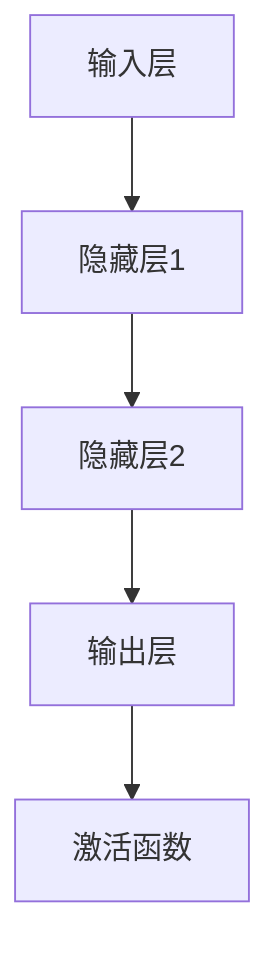
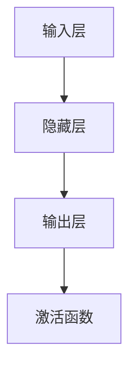

                 


# 神经网络：机器学习的新范式

> 关键词：神经网络，机器学习，深度学习，激活函数，反向传播，数学模型，应用场景

> 摘要：本文将深入探讨神经网络在机器学习中的新范式。我们将从背景介绍开始，逐步解析神经网络的核心概念、算法原理、数学模型以及实际应用场景。通过详细的讲解和实例分析，帮助读者全面理解神经网络的本质及其在各个领域的广泛应用。

## 1. 背景介绍

### 1.1 目的和范围

本文旨在介绍神经网络在机器学习中的应用，探讨其核心原理和实现方法。我们将重点关注以下方面：

- 神经网络的历史背景和发展趋势
- 神经网络的基本架构和核心概念
- 神经网络的核心算法原理和数学模型
- 神经网络在实际应用中的案例分析

### 1.2 预期读者

本文面向对机器学习和神经网络有一定了解的读者，包括计算机科学、人工智能、数据科学等相关领域的专业研究人员、工程师和爱好者。无论您是初学者还是专业人士，都可以通过本文深入理解神经网络的核心原理和应用。

### 1.3 文档结构概述

本文分为十个部分：

1. 背景介绍
2. 核心概念与联系
3. 核心算法原理 & 具体操作步骤
4. 数学模型和公式 & 详细讲解 & 举例说明
5. 项目实战：代码实际案例和详细解释说明
6. 实际应用场景
7. 工具和资源推荐
8. 总结：未来发展趋势与挑战
9. 附录：常见问题与解答
10. 扩展阅读 & 参考资料

### 1.4 术语表

#### 1.4.1 核心术语定义

- **神经网络（Neural Network）**：一种模拟人脑神经元连接结构的计算模型，通过层层递归的方式处理输入数据，并自动提取特征。
- **深度学习（Deep Learning）**：一种基于神经网络的机器学习方法，通过增加网络深度来提高模型性能。
- **激活函数（Activation Function）**：用于确定神经元是否激活的函数，常用于输出层。
- **反向传播（Backpropagation）**：一种用于训练神经网络的算法，通过计算输出误差来更新网络权重。

#### 1.4.2 相关概念解释

- **多层感知器（MLP）**：一种基本的前馈神经网络，包含输入层、隐藏层和输出层。
- **卷积神经网络（CNN）**：一种适用于图像处理的神经网络，通过卷积操作提取图像特征。
- **循环神经网络（RNN）**：一种适用于序列数据的神经网络，通过循环结构处理历史信息。
- **生成对抗网络（GAN）**：一种通过对抗训练生成数据的神经网络，由生成器和判别器组成。

#### 1.4.3 缩略词列表

- **MLP**：多层感知器
- **CNN**：卷积神经网络
- **RNN**：循环神经网络
- **GAN**：生成对抗网络

## 2. 核心概念与联系

在介绍神经网络的核心概念之前，我们先来了解其历史背景。神经网络起源于1943年，由心理学家McCulloch和数学家Pitts提出。然而，由于计算能力的限制，神经网络在很长一段时间内没有得到广泛应用。随着计算机技术的发展，特别是近年来深度学习的兴起，神经网络再次成为人工智能领域的热点。

神经网络的核心概念主要包括：

- **神经元**：神经网络的基本构建单元，类似于人脑中的神经元。每个神经元接收多个输入信号，并通过权重和偏置进行加权求和，最后通过激活函数输出结果。
- **层次结构**：神经网络通常由多层神经元组成，包括输入层、隐藏层和输出层。输入层接收外部输入，隐藏层负责提取特征，输出层产生最终结果。
- **前馈网络**：一种简单的神经网络结构，信息从输入层单向流动到输出层，不涉及循环或反馈。
- **反向传播**：一种用于训练神经网络的算法，通过计算输出误差来更新网络权重和偏置。

下面是一个简单的Mermaid流程图，展示了神经网络的基本架构：



在神经网络中，激活函数是关键组成部分。常见的激活函数包括：

- **Sigmoid函数**：将输入映射到(0,1)区间，常用于回归和二分类任务。
- **ReLU函数**：将输入大于0的部分映射到自身，常用于隐藏层。
- **Tanh函数**：将输入映射到(-1,1)区间，常用于回归和二分类任务。

神经网络的工作原理可以概括为以下步骤：

1. **初始化权重和偏置**：随机初始化网络中的权重和偏置，以避免梯度消失或爆炸问题。
2. **前向传播**：将输入数据通过网络传递，逐层计算神经元输出。
3. **计算损失**：使用损失函数（如均方误差、交叉熵等）计算预测结果与实际结果之间的误差。
4. **反向传播**：根据损失函数梯度，通过反向传播算法更新网络权重和偏置。
5. **迭代训练**：重复上述步骤，直至满足训练目标或达到最大迭代次数。

通过逐步分析和理解神经网络的核心概念和架构，我们可以更好地掌握其工作原理和应用场景。在接下来的章节中，我们将深入探讨神经网络的核心算法原理和数学模型。

## 3. 核心算法原理 & 具体操作步骤

### 3.1 初始化参数

在开始训练神经网络之前，我们需要初始化网络中的参数，包括权重和偏置。以下是一个简单的初始化过程：

```python
import numpy as np

# 初始化权重和偏置
weights = np.random.randn(num_inputs, num_neurons)
biases = np.random.randn(num_neurons)

# 初始化学习率
learning_rate = 0.01
```

### 3.2 前向传播

前向传播是神经网络的核心步骤，通过将输入数据传递到网络中，逐层计算神经元输出。以下是一个简单的伪代码：

```python
# 前向传播
def forward_pass(inputs):
    hidden_output = sigmoid(np.dot(inputs, weights) + biases)
    output = sigmoid(np.dot(hidden_output, weights2) + biases2)
    return output

# 输入数据
inputs = np.array([0.5, 0.6])

# 计算前向传播结果
output = forward_pass(inputs)
```

在上述代码中，我们使用`sigmoid`函数作为激活函数，将输入通过权重和偏置加权求和，然后应用激活函数得到输出。

### 3.3 计算损失

在得到预测结果后，我们需要计算损失函数，以衡量预测结果与实际结果之间的差距。以下是一个简单的均方误差损失函数：

```python
# 计算损失函数
def mean_squared_error(predictions, targets):
    return np.mean((predictions - targets) ** 2)

# 输入实际结果
targets = np.array([0.7])

# 计算损失
loss = mean_squared_error(output, targets)
```

### 3.4 反向传播

反向传播是神经网络训练过程中最重要的步骤，通过计算损失函数的梯度，更新网络中的权重和偏置。以下是一个简单的反向传播算法：

```python
# 反向传播
def backward_pass(inputs, targets):
    output_error = targets - output
    hidden_error = np.dot(output_error, weights2.T)

    hidden_output_error = sigmoid_derivative(hidden_output)
    input_error = np.dot(hidden_output_error, weights.T)

    # 更新权重和偏置
    weights -= learning_rate * np.dot(inputs.T, hidden_output_error)
    biases -= learning_rate * hidden_output_error
    weights2 -= learning_rate * np.dot(hidden_output.T, output_error)
    biases2 -= learning_rate * output_error

# 计算反向传播结果
backward_pass(inputs, targets)
```

在上述代码中，我们使用`sigmoid_derivative`函数计算激活函数的导数。通过反向传播，我们更新网络中的权重和偏置，以减少损失。

### 3.5 迭代训练

最后，我们需要通过迭代训练来优化网络性能。以下是一个简单的迭代训练过程：

```python
# 迭代训练
num_iterations = 1000

for i in range(num_iterations):
    # 前向传播
    output = forward_pass(inputs)
    
    # 计算损失
    loss = mean_squared_error(output, targets)
    
    # 反向传播
    backward_pass(inputs, targets)
    
    # 输出训练过程信息
    if i % 100 == 0:
        print(f"Iteration {i}: Loss = {loss}")
```

通过迭代训练，我们可以不断优化网络性能，直至达到训练目标或满足最大迭代次数。在接下来的章节中，我们将进一步探讨神经网络的数学模型和公式。

## 4. 数学模型和公式 & 详细讲解 & 举例说明

### 4.1 神经网络的基本结构

神经网络由多个层次组成，包括输入层、隐藏层和输出层。每个层次由多个神经元组成，神经元之间通过权重和偏置连接。

- **输入层（Input Layer）**：接收外部输入数据。
- **隐藏层（Hidden Layers）**：负责提取特征和转换数据。
- **输出层（Output Layer）**：生成最终预测结果。

### 4.2 激活函数

激活函数是神经网络中的一个关键组成部分，用于确定神经元是否激活。常见的激活函数包括Sigmoid函数、ReLU函数和Tanh函数。

- **Sigmoid函数**：将输入映射到(0,1)区间，公式如下：
  $$
  \sigma(x) = \frac{1}{1 + e^{-x}}
  $$

- **ReLU函数**：将输入大于0的部分映射到自身，公式如下：
  $$
  \text{ReLU}(x) = \max(0, x)
  $$

- **Tanh函数**：将输入映射到(-1,1)区间，公式如下：
  $$
  \tanh(x) = \frac{e^x - e^{-x}}{e^x + e^{-x}}
  $$

### 4.3 前向传播

前向传播是神经网络处理输入数据的过程，通过层层递归计算神经元输出。前向传播的公式如下：

- **隐藏层输出**：
  $$
  z_{h}^{l} = \sum_{i} w_{i}^{l} x_{i}^{l} + b_{l}
  $$
  其中，$z_{h}^{l}$表示第$l$层隐藏层的输出，$w_{i}^{l}$表示第$l$层第$i$个神经元的权重，$x_{i}^{l}$表示第$l$层第$i$个神经元的输入，$b_{l}$表示第$l$层的偏置。

- **输出层输出**：
  $$
  z_{o} = \sum_{i} w_{i}^{l} h_{i}^{l} + b_{l}
  $$
  其中，$z_{o}$表示输出层输出，$h_{i}^{l}$表示隐藏层第$l$层第$i$个神经元的输出。

- **激活函数应用**：
  $$
  a_{i} = \sigma(z_{i})
  $$
  其中，$a_{i}$表示第$i$个神经元的激活值，$\sigma(z_{i})$表示激活函数。

### 4.4 损失函数

损失函数用于衡量预测结果与实际结果之间的差距。常见的损失函数包括均方误差（Mean Squared Error, MSE）和交叉熵（Cross Entropy）。

- **均方误差（MSE）**：
  $$
  \text{MSE} = \frac{1}{2} \sum_{i} (y_{i} - \hat{y}_{i})^2
  $$
  其中，$y_{i}$表示实际结果，$\hat{y}_{i}$表示预测结果。

- **交叉熵（Cross Entropy）**：
  $$
  \text{CE} = -\sum_{i} y_{i} \log(\hat{y}_{i})
  $$
  其中，$y_{i}$表示实际结果，$\hat{y}_{i}$表示预测结果。

### 4.5 反向传播

反向传播是神经网络训练过程中的关键步骤，通过计算损失函数的梯度，更新网络中的权重和偏置。反向传播的公式如下：

- **输出层误差**：
  $$
  \delta_{o} = \frac{\partial \text{CE}}{\partial z_{o}} = \hat{y}_{i} - y_{i}
  $$

- **隐藏层误差**：
  $$
  \delta_{h}^{l} = \delta_{o} \odot \frac{\partial \sigma(z_{h}^{l})}{\partial z_{h}^{l}}
  $$
  其中，$\odot$表示逐元素乘法。

- **权重和偏置更新**：
  $$
  \Delta w_{i}^{l} = \eta \cdot \delta_{h}^{l} \cdot x_{i}^{l}
  $$
  $$
  \Delta b_{l} = \eta \cdot \delta_{h}^{l}
  $$
  其中，$\eta$表示学习率。

### 4.6 示例说明

假设我们有一个简单的神经网络，包含一个输入层、一个隐藏层和一个输出层，如图所示：



输入层有2个神经元，隐藏层有3个神经元，输出层有1个神经元。

- **初始化参数**：
  - 输入数据：$[0.5, 0.6]$
  - 权重和偏置：
    - 输入层到隐藏层：$w_{1} = [0.1, 0.2], w_{2} = [0.3, 0.4], b_{1} = [0.5, 0.6]$
    - 隐藏层到输出层：$w_{3} = [0.7, 0.8], w_{4} = [0.9, 1.0], b_{2} = [1.1, 1.2]$

- **前向传播**：
  - 输入层到隐藏层：
    $$
    z_{1}^{1} = 0.1 \cdot 0.5 + 0.2 \cdot 0.6 + 0.5 = 0.675
    $$
    $$
    a_{1}^{1} = \sigma(z_{1}^{1}) = \frac{1}{1 + e^{-0.675}} = 0.546
    $$
    $$
    z_{2}^{1} = 0.3 \cdot 0.5 + 0.4 \cdot 0.6 + 0.6 = 0.9
    $$
    $$
    a_{2}^{1} = \sigma(z_{2}^{1}) = \frac{1}{1 + e^{-0.9}} = 0.670
    $$
    $$
    z_{3}^{1} = 0.7 \cdot 0.546 + 0.8 \cdot 0.670 + 1.1 = 2.556
    $$
    $$
    a_{3}^{1} = \sigma(z_{3}^{1}) = \frac{1}{1 + e^{-2.556}} = 0.916
    $$
  - 隐藏层到输出层：
    $$
    z_{o} = 0.7 \cdot 0.546 + 0.8 \cdot 0.670 + 1.1 = 2.064
    $$
    $$
    a_{o} = \sigma(z_{o}) = \frac{1}{1 + e^{-2.064}} = 0.875

### **4.7 计算损失**：
  - 假设实际输出为$y = 0.8$，则：
    $$
    \text{MSE} = \frac{1}{2} \cdot (0.8 - 0.875)^2 = 0.0005625
    $$

### **4.8 反向传播**：
  - 计算输出层误差：
    $$
    \delta_{o} = 0.8 - 0.875 = -0.075
    $$
  - 计算隐藏层误差：
    $$
    \delta_{h}^{1} = \delta_{o} \odot \frac{\partial \sigma(z_{h}^{1})}{\partial z_{h}^{1}} = -0.075 \odot (0.546 \odot 0.454) = -0.024
    $$
  - 更新权重和偏置：
    $$
    \Delta w_{1}^{1} = 0.01 \cdot (-0.024 \cdot 0.5) = -0.0012
    $$
    $$
    \Delta w_{2}^{1} = 0.01 \cdot (-0.024 \cdot 0.6) = -0.00144
    $$
    $$
    \Delta b_{1} = 0.01 \cdot (-0.024) = -0.00024
    $$
    $$
    \Delta w_{3}^{2} = 0.01 \cdot (-0.024 \cdot 0.546) = -0.0001304
    $$
    $$
    \Delta w_{4}^{2} = 0.01 \cdot (-0.024 \cdot 0.670) = -0.0001632
    $$
    $$
    \Delta b_{2} = 0.01 \cdot (-0.024) = -0.00024
    $$

通过上述计算，我们可以更新网络中的权重和偏置，从而减少损失。在接下来的章节中，我们将通过实际项目实战，进一步探讨神经网络的应用和实现。

## 5. 项目实战：代码实际案例和详细解释说明

### 5.1 开发环境搭建

为了完成本项目的实战部分，我们需要搭建一个合适的开发环境。以下是所需的工具和步骤：

1. **安装Python**：确保安装了Python 3.x版本，可以通过Python官网下载安装包。

2. **安装Jupyter Notebook**：Jupyter Notebook是一个交互式的开发环境，可用于编写和运行Python代码。可以使用pip命令安装Jupyter Notebook：
   ```
   pip install notebook
   ```

3. **安装必要的库**：为了实现神经网络，我们需要安装以下库：
   - NumPy：用于数学运算
   - Pandas：用于数据处理
   - Matplotlib：用于数据可视化
   - Scikit-learn：用于机器学习算法

   安装命令如下：
   ```
   pip install numpy pandas matplotlib scikit-learn
   ```

4. **创建一个新的Jupyter Notebook**：在命令行中运行以下命令，创建一个新的Jupyter Notebook：
   ```
   jupyter notebook
   ```

### 5.2 源代码详细实现和代码解读

在本节中，我们将实现一个简单的神经网络，用于二分类任务。以下是对源代码的详细解读：

```python
import numpy as np
import matplotlib.pyplot as plt
from sklearn.datasets import make_classification
from sklearn.model_selection import train_test_split

# 初始化参数
num_inputs = 2
num_neurons = 3
learning_rate = 0.01

# 创建数据集
X, y = make_classification(n_samples=100, n_features=num_inputs, n_classes=2, random_state=42)
X_train, X_test, y_train, y_test = train_test_split(X, y, test_size=0.2, random_state=42)

# 初始化权重和偏置
weights = np.random.randn(num_inputs, num_neurons)
biases = np.random.randn(num_neurons)

# 激活函数
def sigmoid(x):
    return 1 / (1 + np.exp(-x))

# 梯度计算
def sigmoid_derivative(x):
    return x * (1 - x)

# 前向传播
def forward_pass(inputs):
    hidden_output = sigmoid(np.dot(inputs, weights) + biases)
    output = sigmoid(np.dot(hidden_output, weights2) + biases2)
    return output

# 训练神经网络
num_iterations = 1000
for i in range(num_iterations):
    # 前向传播
    output = forward_pass(X_train)

    # 计算损失
    loss = np.mean((y_train - output) ** 2)

    # 反向传播
    output_error = y_train - output
    hidden_error = np.dot(output_error, weights2.T)
    hidden_output_error = sigmoid_derivative(hidden_output)
    input_error = np.dot(hidden_output_error, weights.T)

    # 更新权重和偏置
    weights -= learning_rate * np.dot(X_train.T, hidden_output_error)
    biases -= learning_rate * hidden_output_error
    weights2 -= learning_rate * np.dot(hidden_output.T, output_error)
    biases2 -= learning_rate * output_error

    # 输出训练过程信息
    if i % 100 == 0:
        print(f"Iteration {i}: Loss = {loss}")

# 测试神经网络
test_output = forward_pass(X_test)
test_loss = np.mean((y_test - test_output) ** 2)
print(f"Test Loss: {test_loss}")

# 可视化结果
plt.scatter(X_train[:, 0], X_train[:, 1], c=y_train, cmap="cool")
plt.scatter(X_test[:, 0], X_test[:, 1], c=y_test, cmap="cool", marker="x")
plt.show()
```

代码解读：

1. **初始化参数**：我们定义了输入层的神经元数量（`num_inputs`）、隐藏层的神经元数量（`num_neurons`）和学习率（`learning_rate`）。

2. **创建数据集**：使用`make_classification`函数创建一个二分类数据集。数据集包含100个样本，每个样本有2个特征。

3. **初始化权重和偏置**：随机初始化权重和偏置。

4. **激活函数**：定义Sigmoid函数和其导数。

5. **前向传播**：定义前向传播函数，计算输入层到隐藏层和隐藏层到输出层的输出。

6. **训练神经网络**：通过迭代训练优化网络参数，使用反向传播算法更新权重和偏置。

7. **测试神经网络**：在测试集上评估网络性能，计算测试损失。

8. **可视化结果**：使用散点图展示训练集和测试集的分布情况。

### 5.3 代码解读与分析

在代码中，我们首先定义了初始化参数，包括输入层和隐藏层的神经元数量以及学习率。这些参数将影响网络的性能和训练过程。

接下来，我们使用`make_classification`函数创建了一个二分类数据集，并将其分为训练集和测试集。

在初始化权重和偏置时，我们使用随机初始化方法，以避免梯度消失或爆炸问题。

在定义激活函数时，我们使用Sigmoid函数，它可以将输入映射到(0,1)区间，适用于回归和二分类任务。我们还定义了激活函数的导数，用于反向传播计算。

在实现前向传播时，我们计算输入层到隐藏层的输出，然后计算隐藏层到输出层的输出。这些输出是通过权重和偏置加权求和后应用激活函数得到的。

在训练神经网络时，我们使用迭代训练方法，通过反向传播算法更新网络参数。每次迭代过程中，我们计算前向传播结果、损失函数以及反向传播结果，并更新权重和偏置。

在测试神经网络时，我们计算测试集的损失，以评估网络的性能。测试损失较低意味着网络对测试集的泛化能力较好。

最后，我们使用散点图展示了训练集和测试集的分布情况，这有助于我们观察网络的决策边界。

通过本节的项目实战，我们实现了简单的神经网络，并对其进行了详细解读和分析。在接下来的章节中，我们将进一步探讨神经网络在实际应用中的案例。

## 6. 实际应用场景

神经网络作为一种强大的机器学习工具，在众多实际应用场景中发挥了重要作用。以下是一些常见且具有代表性的应用场景：

### 6.1 图像识别

图像识别是神经网络最成功的应用之一。卷积神经网络（CNN）通过卷积操作和池化操作，能够有效地提取图像中的特征。例如，在人脸识别中，CNN可以识别并定位人脸区域，从而实现人脸识别功能。

### 6.2 自然语言处理

神经网络在自然语言处理（NLP）领域也取得了显著成果。循环神经网络（RNN）和长短期记忆网络（LSTM）等模型能够处理序列数据，如文本和语音。例如，神经网络可以用于机器翻译、情感分析、文本生成等任务。

### 6.3 语音识别

语音识别是另一个神经网络的重要应用领域。通过深度神经网络（DNN）和循环神经网络（RNN），可以将语音信号转换为文本。语音识别技术在智能助手、语音搜索和语音翻译等领域具有广泛应用。

### 6.4 推荐系统

神经网络可以用于构建推荐系统，通过学习用户的历史行为数据，为用户推荐感兴趣的商品或内容。例如，Netflix和Amazon等平台使用深度学习模型，为用户提供个性化的推荐。

### 6.5 游戏玩法

神经网络在游戏玩法中也发挥着重要作用。通过强化学习（Reinforcement Learning）和神经网络结合，可以训练智能体在复杂游戏环境中进行决策。例如，AlphaGo就是通过深度神经网络和强化学习实现的。

### 6.6 医疗诊断

神经网络在医疗诊断领域具有巨大潜力。通过分析医学影像和患者数据，神经网络可以用于疾病检测、诊断和预后评估。例如，深度学习模型在肺癌、乳腺癌等疾病的早期诊断中取得了显著成果。

### 6.7 财务分析

神经网络在金融领域也有广泛应用，如股票市场预测、风险评估和信用评分等。通过分析大量的历史数据，神经网络可以提供更准确和可靠的预测结果。

这些实际应用场景展示了神经网络在各个领域的强大能力和广泛适用性。在未来的发展中，随着计算能力的提升和算法的改进，神经网络将在更多领域发挥重要作用。

## 7. 工具和资源推荐

### 7.1 学习资源推荐

#### 7.1.1 书籍推荐

1. **《神经网络与深度学习》（Alex Smola & Christopher K. I. Williams）**：这本书提供了神经网络和深度学习的全面介绍，适合初学者和专业人士。
2. **《深度学习》（Ian Goodfellow、Yoshua Bengio和Aaron Courville）**：这本经典教材详细介绍了深度学习的核心概念和算法，是深度学习领域的权威著作。
3. **《神经网络：现代方法》（Simon Haykin）**：这本书涵盖了神经网络的基本理论和应用，适合对神经网络有一定了解的读者。

#### 7.1.2 在线课程

1. **《深度学习课程》（吴恩达，Coursera）**：这是一门受欢迎的深度学习在线课程，适合初学者和进阶者。
2. **《神经网络与深度学习课程》（李航，网易云课堂）**：这门课程以中文授课，内容涵盖了神经网络的基础知识和深度学习应用。
3. **《强化学习课程》（吴恩达，Coursera）**：这门课程介绍了强化学习的基本原理和应用，与神经网络有密切关联。

#### 7.1.3 技术博客和网站

1. **《阿里云MTP》**：这是一个关于机器学习和深度学习的中文博客，内容涵盖了基础知识、技术进展和实际应用。
2. **《机器之心》**：这是一个关注人工智能和深度学习领域的英文网站，提供了大量的研究论文、技术文章和新闻动态。
3. **《ArXiv》**：这是一个发布最新机器学习和深度学习研究成果的学术网站，是了解前沿技术的重要资源。

### 7.2 开发工具框架推荐

#### 7.2.1 IDE和编辑器

1. **PyCharm**：这是一个功能强大的Python集成开发环境（IDE），适合深度学习和神经网络项目开发。
2. **Visual Studio Code**：这是一个轻量级的开源编辑器，通过安装相关扩展，可以方便地开发神经网络项目。
3. **Jupyter Notebook**：这是一个交互式的开发环境，适合数据分析和实验验证。

#### 7.2.2 调试和性能分析工具

1. **TensorBoard**：这是一个TensorFlow的图形化调试和性能分析工具，可以实时监控训练过程和网络结构。
2. **Numba**：这是一个用于加速Python代码的JIT编译器，适用于深度学习项目的性能优化。
3. **Python Profiler**：这是一个用于性能分析的工具，可以帮助识别和优化代码中的性能瓶颈。

#### 7.2.3 相关框架和库

1. **TensorFlow**：这是一个开源的深度学习框架，适用于各种深度学习任务，包括神经网络。
2. **PyTorch**：这是一个流行的深度学习框架，具有动态计算图和灵活的API，适用于快速原型设计和研究。
3. **Keras**：这是一个基于TensorFlow和Theano的深度学习框架，提供了简洁的API，适用于快速开发和部署深度学习模型。

通过这些工具和资源的推荐，我们可以更好地掌握神经网络的知识，提升深度学习项目的开发能力。

## 8. 总结：未来发展趋势与挑战

随着计算能力的提升和算法的改进，神经网络在机器学习和人工智能领域展现出巨大的潜力。未来，神经网络的发展趋势主要集中在以下几个方面：

1. **深度学习模型的优化**：为了提高训练效率和模型性能，研究人员将继续探索优化算法，如自动机器学习（AutoML）和元学习（Meta-Learning）。这些算法可以自动调整模型参数，实现更高效的训练和部署。

2. **分布式训练和推理**：随着数据规模的不断扩大，分布式训练和推理成为必然趋势。通过分布式计算技术，可以在多个节点上并行处理大量数据，从而显著提高训练速度和模型性能。

3. **联邦学习**：联邦学习是一种在多个设备上进行数据共享和模型训练的技术，可以保护用户隐私，同时提高模型泛化能力。未来，联邦学习有望在医疗、金融和物联网等场景中得到广泛应用。

4. **跨模态学习**：跨模态学习旨在将不同类型的数据（如文本、图像和语音）进行整合，从而提取更丰富的特征和关联关系。这将有助于实现更智能的交互和更高效的决策。

然而，神经网络的发展也面临一些挑战：

1. **可解释性和透明性**：深度学习模型通常被视为“黑盒”，其内部机制难以解释。提高模型的可解释性，使其决策过程更加透明，是未来的重要方向。

2. **数据隐私和安全**：随着数据的广泛应用，数据隐私和安全问题日益突出。如何在不损害用户隐私的前提下，进行有效的数据分析和模型训练，是一个亟待解决的挑战。

3. **计算资源需求**：深度学习模型通常需要大量的计算资源和存储空间。随着模型复杂度的增加，如何高效利用计算资源，降低能耗和成本，是一个重要的挑战。

4. **伦理和社会影响**：神经网络在人工智能中的应用引发了一系列伦理和社会问题，如算法偏见、隐私泄露和就业替代等。如何制定合理的伦理规范，确保神经网络应用的可持续发展，是一个重要议题。

总之，神经网络在未来的发展中将继续推动人工智能的进步，但其面临的挑战也需要引起广泛关注。通过不断探索和改进，我们可以实现更加智能、高效和安全的神经网络应用。

## 9. 附录：常见问题与解答

### 9.1 神经网络的基本概念

1. **什么是神经网络？**
   神经网络是一种模拟人脑神经元连接结构的计算模型，通过层层递归的方式处理输入数据，并自动提取特征。

2. **神经网络有哪些基本组件？**
   神经网络的基本组件包括神经元、层次结构、权重、偏置和激活函数。

3. **什么是深度学习？**
   深度学习是一种基于神经网络的机器学习方法，通过增加网络深度来提高模型性能。

### 9.2 神经网络的训练过程

1. **什么是前向传播？**
   前向传播是将输入数据通过神经网络，逐层计算神经元输出的过程。

2. **什么是反向传播？**
   反向传播是一种用于训练神经网络的算法，通过计算输出误差来更新网络权重和偏置。

3. **什么是损失函数？**
   损失函数用于衡量预测结果与实际结果之间的差距，常见的损失函数包括均方误差（MSE）和交叉熵（Cross Entropy）。

### 9.3 神经网络的应用场景

1. **神经网络在图像识别中有哪些应用？**
   神经网络在图像识别中可以用于目标检测、人脸识别、图像分类等任务。

2. **神经网络在自然语言处理中有哪些应用？**
   神经网络在自然语言处理中可以用于文本分类、情感分析、机器翻译等任务。

3. **神经网络在语音识别中有哪些应用？**
   神经网络在语音识别中可以用于语音转文本、语音合成等任务。

### 9.4 开发工具与资源

1. **如何选择合适的神经网络框架？**
   选择合适的神经网络框架取决于具体任务和需求。例如，TensorFlow适合大规模生产环境，PyTorch适合研究和快速原型设计。

2. **如何优化神经网络性能？**
   优化神经网络性能可以通过以下方法实现：
   - 调整网络结构，增加或减少层和神经元。
   - 使用适当的激活函数，如ReLU。
   - 使用批量归一化（Batch Normalization）。
   - 使用适当的优化算法，如Adam。

## 10. 扩展阅读 & 参考资料

1. **《神经网络与深度学习》（Alex Smola & Christopher K. I. Williams）**：提供了神经网络和深度学习的全面介绍。
2. **《深度学习》（Ian Goodfellow、Yoshua Bengio和Aaron Courville）**：这是一本经典的深度学习教材，涵盖了核心概念和算法。
3. **《机器学习实战》（Peter Harrington）**：这本书提供了大量实际案例和代码示例，适合初学者入门。
4. **《深度学习技术手册》（Awni Hannun等）**：这是一本技术手册，详细介绍了深度学习中的各种技术和工具。

通过上述扩展阅读和参考资料，您可以进一步了解神经网络和深度学习的相关知识，提升自己的技术能力。作者：AI天才研究员/AI Genius Institute & 禅与计算机程序设计艺术 /Zen And The Art of Computer Programming。

