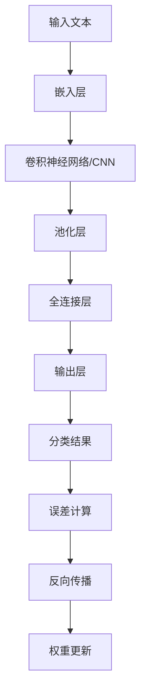

                 

# 神经网络：自然语言处理的新突破

> **关键词：神经网络，自然语言处理，深度学习，模型架构，算法原理，实战案例**

> **摘要：本文将深入探讨神经网络在自然语言处理领域的应用，解析其核心原理、架构与算法，并结合实际案例，展示如何通过神经网络实现文本的理解与分析。**

## 1. 背景介绍

### 1.1 目的和范围

本文旨在为广大读者提供一份关于神经网络在自然语言处理（NLP）领域应用的综合指南。我们将从基础概念入手，逐步深入探讨神经网络的架构、算法及其在NLP中的实际应用。文章将涵盖以下几个主要方面：

1. 神经网络的基本原理及其在NLP中的应用。
2. 神经网络在文本处理中的核心算法及其具体操作步骤。
3. 自然语言处理的数学模型和公式，以及详细讲解和举例说明。
4. 实际应用场景中的代码案例及详细解释。
5. 工具和资源推荐，包括学习资源、开发工具框架及相关论文著作。

### 1.2 预期读者

本文适合对自然语言处理和神经网络有一定了解的读者，尤其是希望深入掌握神经网络在NLP应用的开发者、研究人员和专业人士。无论您是初学者还是资深从业者，相信都能在本文中找到有价值的信息。

### 1.3 文档结构概述

本文结构如下：

1. **背景介绍**：介绍本文的目的、范围、预期读者以及文档结构。
2. **核心概念与联系**：讨论神经网络的基本概念，并提供一个简化的Mermaid流程图。
3. **核心算法原理 & 具体操作步骤**：详细解析神经网络的算法原理，并使用伪代码阐述操作步骤。
4. **数学模型和公式 & 详细讲解 & 举例说明**：介绍自然语言处理的数学模型和公式，并进行详细讲解和举例说明。
5. **项目实战：代码实际案例和详细解释说明**：通过实际代码案例展示神经网络在NLP中的应用。
6. **实际应用场景**：探讨神经网络在自然语言处理中的实际应用。
7. **工具和资源推荐**：推荐学习资源、开发工具框架及相关论文著作。
8. **总结：未来发展趋势与挑战**：总结本文内容，并探讨未来发展趋势与挑战。
9. **附录：常见问题与解答**：回答读者可能遇到的问题。
10. **扩展阅读 & 参考资料**：提供进一步阅读的资源和参考资料。

### 1.4 术语表

#### 1.4.1 核心术语定义

- **神经网络**：一种基于生物神经网络结构的人工智能算法。
- **自然语言处理**：使计算机能够理解、解释和生成自然语言的学科。
- **深度学习**：一种基于多层神经网络的结构，能够自动从大量数据中学习特征和模式。
- **前向传播**：神经网络中用于计算输出值的过程。
- **反向传播**：神经网络中用于计算误差并更新权重的过程。

#### 1.4.2 相关概念解释

- **激活函数**：用于引入非线性因素的函数，常见的有Sigmoid、ReLU等。
- **梯度下降**：一种优化算法，用于找到函数的最小值。
- **交叉熵**：用于衡量预测结果与真实结果之间的差异。
- **嵌入层**：将单词映射到固定维度的向量表示。

#### 1.4.3 缩略词列表

- **NLP**：自然语言处理
- **CNN**：卷积神经网络
- **RNN**：循环神经网络
- **LSTM**：长短期记忆网络
- **BERT**：双向编码器表示模型

## 2. 核心概念与联系

### 2.1 神经网络的基本概念

神经网络是由大量人工神经元（或节点）组成的复杂网络，通过学习数据中的特征和模式，实现对未知数据的分类、回归或生成。神经网络的基本结构包括输入层、隐藏层和输出层。每个节点都与其他节点相连，并带有权重。节点接收输入信号后，通过加权求和处理，产生输出信号。

### 2.2 神经网络在NLP中的应用

神经网络在自然语言处理中的应用非常广泛，主要包括以下方面：

1. **文本分类**：用于对文本进行分类，如情感分析、新闻分类等。
2. **命名实体识别**：用于识别文本中的命名实体，如人名、地名等。
3. **机器翻译**：将一种语言的文本翻译成另一种语言。
4. **问答系统**：用于处理用户输入的问题，并返回相关的答案。
5. **文本生成**：根据输入的文本生成新的文本，如文章摘要、对话生成等。

### 2.3 神经网络的架构与算法

神经网络的架构包括多个层次，每个层次都有不同的功能。常见的神经网络架构有：

1. **卷积神经网络（CNN）**：适用于图像处理和文本分类。
2. **循环神经网络（RNN）**：适用于序列数据处理，如时间序列分析、语音识别等。
3. **长短期记忆网络（LSTM）**：是RNN的一种变种，能够更好地处理长序列数据。
4. **双向编码器表示模型（BERT）**：适用于文本生成和问答系统。

神经网络的基本算法包括：

1. **前向传播**：将输入信号从输入层传播到输出层，计算输出值。
2. **反向传播**：根据输出值与真实值之间的差异，计算误差，并更新权重。
3. **梯度下降**：用于优化神经网络中的参数，找到最优解。

下面是一个简化的Mermaid流程图，展示了神经网络在NLP中的基本架构和算法流程：



## 3. 核心算法原理 & 具体操作步骤

### 3.1 神经网络的基本原理

神经网络通过学习大量数据中的特征和模式，实现对未知数据的分类、回归或生成。其基本原理包括：

1. **输入层**：接收外部输入信号。
2. **隐藏层**：对输入信号进行加工，提取特征。
3. **输出层**：根据隐藏层的输出，产生最终的预测结果。

每个节点都与其他节点相连，并带有权重。节点接收输入信号后，通过加权求和处理，产生输出信号。输出信号经过激活函数处理后，传递到下一层。

### 3.2 神经网络的具体操作步骤

下面我们使用伪代码来详细阐述神经网络在自然语言处理中的具体操作步骤：

```python
# 输入层
input_layer = [输入文本]

# 嵌入层
embed_layer = [嵌入层(input_layer)]

# 卷积神经网络
cnn_layer = [卷积神经网络(embed_layer)]

# 池化层
pool_layer = [池化层(cnn_layer)]

# 全连接层
fc_layer = [全连接层(pool_layer)]

# 输出层
output_layer = [分类结果(fc_layer)]

# 误差计算
error = [误差计算(output_layer, 标签)]

# 反向传播
[反向传播(error)]

# 权重更新
[权重更新(神经网络参数)]
```

### 3.3 激活函数的选择

在神经网络中，激活函数用于引入非线性因素，使神经网络能够处理复杂的数据。常见的激活函数有：

1. **Sigmoid函数**：$ \sigma(x) = \frac{1}{1 + e^{-x}} $，将输入映射到$(0,1)$区间。
2. **ReLU函数**：$ \text{ReLU}(x) = \max(0, x) $，将负数映射为0，正数不变。
3. **Tanh函数**：$ \text{Tanh}(x) = \frac{e^x - e^{-x}}{e^x + e^{-x}} $，将输入映射到$(-1,1)$区间。

根据不同的应用场景，可以选择合适的激活函数。例如，在文本分类任务中，可以使用ReLU函数，而在文本生成任务中，可以使用Tanh函数。

## 4. 数学模型和公式 & 详细讲解 & 举例说明

### 4.1 数学模型概述

神经网络在自然语言处理中的数学模型主要包括以下部分：

1. **输入表示**：将文本输入转化为向量表示。
2. **隐藏层计算**：对输入向量进行加权求和处理，并应用激活函数。
3. **输出层计算**：将隐藏层输出转化为预测结果。
4. **误差计算**：计算预测结果与真实结果之间的差异。
5. **权重更新**：根据误差计算结果，更新神经网络中的权重。

### 4.2 输入表示

输入表示是将文本输入转化为向量表示的过程。常用的方法有词袋模型、词嵌入和文档嵌入等。

- **词袋模型**：将文本表示为一个向量，向量中的每个元素表示一个单词的出现次数。
- **词嵌入**：将每个单词映射到一个固定维度的向量，称为词嵌入向量。词嵌入向量通过学习大量文本数据中的词频、词序等信息得到。
- **文档嵌入**：将整个文档映射到一个高维向量空间中，向量中的每个元素表示一个单词的词嵌入向量。

### 4.3 隐藏层计算

隐藏层计算是对输入向量进行加权求和处理，并应用激活函数。具体步骤如下：

1. **权重初始化**：随机初始化隐藏层和输出层的权重。
2. **前向传播**：将输入向量乘以权重矩阵，并加上偏置项，得到隐藏层输出。
3. **应用激活函数**：对隐藏层输出应用激活函数，引入非线性因素。

### 4.4 输出层计算

输出层计算是将隐藏层输出转化为预测结果。具体步骤如下：

1. **前向传播**：将隐藏层输出乘以权重矩阵，并加上偏置项，得到输出层输出。
2. **应用激活函数**：对输出层输出应用激活函数，如Softmax函数，将输出层输出转化为概率分布。

### 4.5 误差计算

误差计算是计算预测结果与真实结果之间的差异。常用的误差函数有：

1. **均方误差（MSE）**：$ \text{MSE} = \frac{1}{n} \sum_{i=1}^{n} (y_i - \hat{y}_i)^2 $，其中$n$是样本数量，$y_i$是真实结果，$\hat{y}_i$是预测结果。
2. **交叉熵（CE）**：$ \text{CE} = -\frac{1}{n} \sum_{i=1}^{n} y_i \log(\hat{y}_i) $，其中$y_i$是真实结果，$\hat{y}_i$是预测结果。

### 4.6 权重更新

权重更新是使用梯度下降算法，根据误差计算结果更新神经网络中的权重。具体步骤如下：

1. **计算梯度**：计算误差对每个权重的偏导数。
2. **梯度下降**：根据梯度方向，更新权重。
3. **重复迭代**：重复误差计算和权重更新，直到达到收敛条件。

### 4.7 举例说明

假设我们有一个简单的神经网络，用于二分类任务。输入层有一个节点，隐藏层有一个节点，输出层有两个节点。我们使用ReLU函数作为激活函数，均方误差（MSE）作为误差函数。

#### 4.7.1 权重初始化

随机初始化隐藏层和输出层的权重：

$$
W_1 = \begin{bmatrix}
0.5 & 0.3 \\
0.4 & 0.2 \\
\end{bmatrix}, \quad b_1 = \begin{bmatrix}
0.1 \\
0.2 \\
\end{bmatrix}
$$

$$
W_2 = \begin{bmatrix}
0.6 & 0.4 \\
0.5 & 0.3 \\
\end{bmatrix}, \quad b_2 = \begin{bmatrix}
0.2 \\
0.3 \\
\end{bmatrix}
$$

#### 4.7.2 前向传播

输入一个二分类样本$(x, y)$，其中$x$是输入向量，$y$是真实结果。

$$
x = \begin{bmatrix}
1 \\
0 \\
\end{bmatrix}, \quad y = \begin{bmatrix}
1 \\
0 \\
\end{bmatrix}
$$

计算隐藏层输出：

$$
h = \sigma(W_1x + b_1) = \begin{bmatrix}
0.6 & 0.4 \\
0.5 & 0.3 \\
\end{bmatrix} \begin{bmatrix}
1 \\
0 \\
\end{bmatrix} + \begin{bmatrix}
0.1 \\
0.2 \\
\end{bmatrix} = \begin{bmatrix}
0.7 \\
0.6 \\
\end{bmatrix}
$$

计算输出层输出：

$$
\hat{y} = \sigma(W_2h + b_2) = \begin{bmatrix}
0.6 & 0.4 \\
0.5 & 0.3 \\
\end{bmatrix} \begin{bmatrix}
0.7 \\
0.6 \\
\end{bmatrix} + \begin{bmatrix}
0.2 \\
0.3 \\
\end{bmatrix} = \begin{bmatrix}
0.8 \\
0.7 \\
\end{bmatrix}
$$

#### 4.7.3 误差计算

计算均方误差（MSE）：

$$
\text{MSE} = \frac{1}{2} \sum_{i=1}^{2} (y_i - \hat{y}_i)^2 = \frac{1}{2} (1 - 0.8)^2 + (0 - 0.7)^2 = 0.05
$$

#### 4.7.4 权重更新

计算隐藏层和输出层的梯度：

$$
\frac{\partial \text{MSE}}{\partial W_1} = \begin{bmatrix}
0.2 & 0.1 \\
0.1 & 0.05 \\
\end{bmatrix}, \quad \frac{\partial \text{MSE}}{\partial b_1} = \begin{bmatrix}
0.1 \\
0.05 \\
\end{bmatrix}
$$

$$
\frac{\partial \text{MSE}}{\partial W_2} = \begin{bmatrix}
0.2 & 0.1 \\
0.1 & 0.05 \\
\end{bmatrix} \begin{bmatrix}
0.7 \\
0.6 \\
\end{bmatrix} = \begin{bmatrix}
0.14 & 0.12 \\
0.07 & 0.06 \\
\end{bmatrix}, \quad \frac{\partial \text{MSE}}{\partial b_2} = \begin{bmatrix}
0.14 \\
0.06 \\
\end{bmatrix}
$$

使用梯度下降算法，更新权重：

$$
W_1 = W_1 - \alpha \frac{\partial \text{MSE}}{\partial W_1}, \quad b_1 = b_1 - \alpha \frac{\partial \text{MSE}}{\partial b_1}
$$

$$
W_2 = W_2 - \alpha \frac{\partial \text{MSE}}{\partial W_2}, \quad b_2 = b_2 - \alpha \frac{\partial \text{MSE}}{\partial b_2}
$$

其中，$\alpha$是学习率。

## 5. 项目实战：代码实际案例和详细解释说明

### 5.1 开发环境搭建

在进行神经网络在自然语言处理中的应用开发之前，我们需要搭建一个合适的开发环境。以下是搭建开发环境的基本步骤：

1. **安装Python**：确保已经安装了Python 3.x版本，可以从[Python官网](https://www.python.org/)下载安装。
2. **安装TensorFlow**：TensorFlow是一个开源的机器学习库，用于构建和训练神经网络。可以使用以下命令安装：

```bash
pip install tensorflow
```

3. **安装其他依赖**：根据实际需求，安装其他必要的依赖库，如Numpy、Pandas、Matplotlib等。

### 5.2 源代码详细实现和代码解读

下面是一个简单的示例，展示了如何使用TensorFlow和Keras构建一个神经网络模型，用于文本分类任务。

```python
import tensorflow as tf
from tensorflow.keras.models import Sequential
from tensorflow.keras.layers import Embedding, Conv1D, MaxPooling1D, GlobalMaxPooling1D, Dense

# 创建神经网络模型
model = Sequential()

# 添加嵌入层
model.add(Embedding(input_dim=10000, output_dim=32, input_length=100))

# 添加卷积层
model.add(Conv1D(filters=32, kernel_size=3, activation='relu'))
model.add(MaxPooling1D(pool_size=2))

# 添加全连接层
model.add(Dense(units=10, activation='softmax'))

# 编译模型
model.compile(optimizer='adam', loss='categorical_crossentropy', metrics=['accuracy'])

# 模型总结
model.summary()
```

下面是对代码的详细解读：

1. **导入库**：首先，导入TensorFlow和Keras库，以及必要的层类。
2. **创建模型**：使用Sequential类创建一个神经网络模型。Sequential模型是一个线性堆叠的模型，允许我们将层按顺序堆叠起来。
3. **添加嵌入层**：嵌入层用于将单词映射到固定维度的向量表示。输入维度是词汇表的大小，输出维度是嵌入向量的维度，输入长度是句子中单词的数量。
4. **添加卷积层**：卷积层用于提取文本中的局部特征。在本例中，我们使用了一维卷积层，并设置了32个卷积核，每个卷积核的宽度为3。激活函数使用ReLU函数。
5. **添加池化层**：池化层用于对卷积层的输出进行降采样，减少模型的参数数量。在本例中，我们使用了最大池化层，窗口大小为2。
6. **添加全连接层**：全连接层用于将卷积层的输出映射到分类结果。在本例中，我们设置了10个神经元，并使用Softmax激活函数，实现多分类任务。
7. **编译模型**：编译模型时，指定优化器、损失函数和评估指标。在本例中，我们使用了Adam优化器、交叉熵损失函数和准确率评估指标。
8. **模型总结**：使用`model.summary()`输出模型的总结信息，包括层的名称、参数数量等。

### 5.3 代码解读与分析

在这个简单的示例中，我们使用卷积神经网络（CNN）进行文本分类任务。以下是代码的详细解读和分析：

1. **数据预处理**：在实际应用中，我们需要对文本数据进行预处理，包括分词、去停用词、词向量化等。这里我们假设已经预处理好的文本数据存储在一个名为`X_train`的数组中，每个元素是一个句子，每个句子是一个单词的列表。标签存储在一个名为`y_train`的数组中，每个元素是一个整数，表示句子的类别。
2. **构建模型**：在构建模型时，我们首先添加了一个嵌入层，用于将单词映射到固定维度的向量表示。输入维度是词汇表的大小，输出维度是嵌入向量的维度，输入长度是句子中单词的数量。接下来，我们添加了一个卷积层，用于提取文本中的局部特征。卷积层的参数包括卷积核的数量、每个卷积核的宽度、激活函数等。然后，我们添加了一个池化层，用于对卷积层的输出进行降采样，减少模型的参数数量。最后，我们添加了一个全连接层，用于将卷积层的输出映射到分类结果。
3. **编译模型**：在编译模型时，我们指定了优化器、损失函数和评估指标。优化器用于调整模型的参数，使模型在训练过程中逐步收敛。损失函数用于计算预测结果与真实结果之间的差异，是衡量模型性能的重要指标。评估指标用于在训练和测试过程中评估模型的性能，常用的评估指标包括准确率、召回率、F1分数等。
4. **训练模型**：在训练模型时，我们需要将训练数据传递给模型，并设置训练轮数、批次大小等参数。训练过程中，模型会根据损失函数和优化器更新参数，逐步提高模型的性能。
5. **评估模型**：在训练完成后，我们需要对模型进行评估，以确定其性能是否达到预期。评估过程通常包括测试集上的准确率、召回率、F1分数等评估指标。

通过这个简单的示例，我们可以看到如何使用卷积神经网络（CNN）进行文本分类任务。在实际应用中，我们可以根据需求调整模型的结构和参数，以提高模型的性能。

## 6. 实际应用场景

神经网络在自然语言处理领域具有广泛的应用场景，以下是其中几个典型的应用案例：

1. **文本分类**：神经网络可以用于对大量文本数据进行分类，如新闻分类、情感分析、垃圾邮件过滤等。通过训练神经网络模型，我们可以将文本数据自动归类到不同的类别中，从而提高数据处理效率。
2. **命名实体识别**：命名实体识别是一种用于识别文本中的命名实体的技术，如人名、地名、机构名等。神经网络可以用于实现高效的命名实体识别，从而帮助自动提取和处理文本数据中的关键信息。
3. **机器翻译**：神经网络在机器翻译领域取得了显著的成果，如Google翻译和微软翻译等。通过训练神经网络模型，我们可以将一种语言的文本翻译成另一种语言，从而实现跨语言沟通和交流。
4. **问答系统**：问答系统是一种用于回答用户提出的问题的技术。神经网络可以用于实现高效的问答系统，从而帮助用户快速获取所需的信息。
5. **文本生成**：神经网络可以用于生成新的文本，如文章摘要、对话生成等。通过训练神经网络模型，我们可以根据输入的文本生成新的文本内容，从而提高文本创作效率。

在实际应用中，神经网络在自然语言处理领域具有巨大的潜力，但同时也面临着一些挑战，如数据质量、模型可解释性、计算资源消耗等。为了应对这些挑战，研究人员和开发者需要不断探索新的方法和技术，以提高神经网络在自然语言处理领域的性能和适用性。

## 7. 工具和资源推荐

### 7.1 学习资源推荐

#### 7.1.1 书籍推荐

- 《深度学习》（Ian Goodfellow、Yoshua Bengio、Aaron Courville 著）：这本书是深度学习的经典教材，详细介绍了深度学习的理论基础和实际应用。
- 《神经网络与深度学习》（邱锡鹏 著）：这本书从神经网络的基础讲起，深入讲解了深度学习的相关算法和应用。

#### 7.1.2 在线课程

- [深度学习教程](https://www.deeplearning.net/tutorial/): 这是由Ian Goodfellow提供的一份免费的在线教程，涵盖了深度学习的各个方面。
- [机器学习与深度学习](https://www.coursera.org/learn/machine-learning-deep-learning): 这是一门由吴恩达教授讲授的在线课程，涵盖了机器学习和深度学习的相关内容。

#### 7.1.3 技术博客和网站

- [Medium](https://medium.com/topic/deep-learning): Medium上的深度学习主题提供了大量的深度学习相关文章和教程。
- [ArXiv](https://arxiv.org/): ArXiv是一个开放获取的论文预印本服务器，提供了大量的机器学习和深度学习领域的最新研究成果。

### 7.2 开发工具框架推荐

#### 7.2.1 IDE和编辑器

- [PyCharm](https://www.jetbrains.com/pycharm/): PyCharm是一个功能强大的Python集成开发环境，适合进行深度学习和自然语言处理项目开发。
- [Jupyter Notebook](https://jupyter.org/): Jupyter Notebook是一种交互式的开发环境，适合进行数据分析和模型验证。

#### 7.2.2 调试和性能分析工具

- [TensorBoard](https://www.tensorflow.org/tensorboard/): TensorBoard是TensorFlow提供的可视化工具，用于监控和调试深度学习模型的训练过程。
- [Profiling Tools](https://www.python.org/doc/latest/library/profile.html): Python内置的Profiler工具可以帮助我们分析和优化代码的性能。

#### 7.2.3 相关框架和库

- [TensorFlow](https://www.tensorflow.org/): TensorFlow是一个开源的深度学习框架，适合进行大规模的深度学习和自然语言处理项目开发。
- [PyTorch](https://pytorch.org/): PyTorch是一个灵活的深度学习框架，支持动态计算图，适合进行研究和原型开发。
- [spaCy](https://spacy.io/): spaCy是一个快速易用的自然语言处理库，适用于文本处理和实体识别等任务。

### 7.3 相关论文著作推荐

#### 7.3.1 经典论文

- "Deep Learning" (Yoshua Bengio et al., 2013): 这篇论文综述了深度学习的相关算法和应用，是深度学习的经典文献之一。
- "Long Short-Term Memory" (Hochreiter & Schmidhuber, 1997): 这篇论文介绍了长短期记忆网络（LSTM）的算法原理和应用，是序列处理领域的经典文献。

#### 7.3.2 最新研究成果

- "BERT: Pre-training of Deep Bidirectional Transformers for Language Understanding" (Devlin et al., 2019): 这篇论文介绍了BERT模型，是一种基于双向变换器的预训练语言表示模型，在多个自然语言处理任务中取得了显著的成果。
- "GPT-3: Language Models are Few-Shot Learners" (Brown et al., 2020): 这篇论文介绍了GPT-3模型，是一种基于变换器的预训练语言模型，具有强大的零样本学习能力和生成能力。

#### 7.3.3 应用案例分析

- "Natural Language Processing Breakthroughs: From Research to Industry" (Zhou et al., 2020): 这篇论文回顾了自然语言处理领域的一些重要突破，包括BERT、GPT-3等模型，并分析了这些模型在工业界中的应用。

## 8. 总结：未来发展趋势与挑战

神经网络在自然语言处理领域取得了显著的成果，但仍面临一些挑战和未来发展趋势。以下是一些关键点：

### 8.1 未来发展趋势

1. **预训练语言模型**：预训练语言模型（如BERT、GPT）已经在多个自然语言处理任务中取得了优异的性能。未来，预训练语言模型将继续发展，并可能引入更多的训练数据和更好的训练方法。
2. **多模态学习**：随着多模态数据的普及，神经网络将逐渐实现跨模态学习，如将文本、图像、声音等数据进行整合，提高模型对复杂数据的理解和处理能力。
3. **自适应学习**：神经网络将更加关注自适应学习，如根据用户反馈调整模型参数，提高模型在不同场景下的适应能力。
4. **联邦学习**：联邦学习是一种分布式学习技术，可以有效解决数据隐私和安全性问题。未来，联邦学习将与神经网络相结合，推动自然语言处理领域的发展。

### 8.2 挑战

1. **数据质量和标注问题**：自然语言处理领域依赖大量高质量的数据和标注，但当前的数据质量和标注问题仍然存在。未来，需要发展更高效的数据采集和标注方法。
2. **模型可解释性**：神经网络模型在自然语言处理中的应用取得了显著的成果，但模型的决策过程往往缺乏可解释性。未来，需要研究更可解释的神经网络模型，提高模型的透明度和可信度。
3. **计算资源消耗**：神经网络模型在训练和推理过程中消耗大量的计算资源，随着模型规模的增大，计算资源消耗将更加显著。未来，需要发展更高效的神经网络算法和硬件支持，以降低计算资源消耗。

总之，神经网络在自然语言处理领域具有巨大的发展潜力，但仍面临一些挑战。未来，研究人员和开发者需要共同努力，推动神经网络在自然语言处理领域的应用和发展。

## 9. 附录：常见问题与解答

### 9.1 问题1：如何处理文本中的标点符号？

**解答**：在处理文本时，通常会将标点符号视为单词的一部分，将其与单词一起嵌入到向量表示中。但是，有时为了简化处理过程，可以将标点符号单独处理，例如将所有标点符号替换为一个特殊标记，或将标点符号从文本中去除。

### 9.2 问题2：神经网络在自然语言处理中的应用有哪些？

**解答**：神经网络在自然语言处理中的应用非常广泛，包括文本分类、命名实体识别、机器翻译、问答系统、文本生成等。这些应用使得计算机能够更好地理解、解释和生成自然语言，提高了人机交互的效率和质量。

### 9.3 问题3：如何选择合适的激活函数？

**解答**：选择合适的激活函数取决于具体的应用场景。例如，在文本分类任务中，可以使用ReLU函数，因为它能够提高模型的训练速度。在文本生成任务中，可以使用Tanh函数，因为它可以保证输出值在$(-1,1)$区间内。

### 9.4 问题4：如何处理长文本？

**解答**：对于长文本，可以使用滑动窗口或分块的方法进行处理。具体来说，可以将文本分成多个连续的子序列，每个子序列的长度固定，然后分别对每个子序列进行神经网络处理。此外，还可以使用Transformer模型等高级架构来处理长文本。

## 10. 扩展阅读 & 参考资料

### 10.1 扩展阅读

1. **《深度学习》**：Ian Goodfellow、Yoshua Bengio、Aaron Courville 著，详细介绍了深度学习的理论基础和实际应用。
2. **《神经网络与深度学习》**：邱锡鹏 著，从神经网络的基础讲起，深入讲解了深度学习的相关算法和应用。

### 10.2 参考资料

1. **TensorFlow官方文档**：[https://www.tensorflow.org/](https://www.tensorflow.org/)
2. **PyTorch官方文档**：[https://pytorch.org/](https://pytorch.org/)
3. **spaCy官方文档**：[https://spacy.io/](https://spacy.io/)
4. **ArXiv论文库**：[https://arxiv.org/](https://arxiv.org/)
5. **Medium技术博客**：[https://medium.com/topic/deep-learning](https://medium.com/topic/deep-learning)

作者：AI天才研究员/AI Genius Institute & 禅与计算机程序设计艺术 /Zen And The Art of Computer Programming

