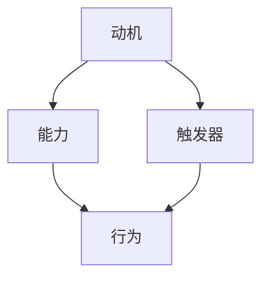
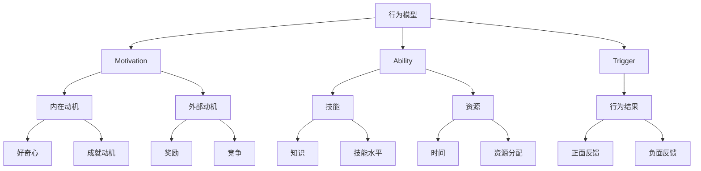

                 

# 福格行为模型在员工激励中的运用

> **关键词：** 员工激励、福格行为模型、行为心理学、工作动力、动机理论
> 
> **摘要：** 本文将深入探讨福格行为模型在员工激励中的应用，通过对行为心理学的解析，结合实际案例，阐述如何利用福格行为模型来激发员工的工作动力和创造力，从而提升组织绩效。

## 1. 背景介绍

### 1.1 目的和范围

本文的目的是介绍福格行为模型，并探讨其在员工激励中的实际应用。我们旨在通过行为心理学的视角，帮助管理者了解如何更有效地激励员工，提高工作效率和团队凝聚力。

### 1.2 预期读者

本文适用于企业人力资源管理者、企业培训师、以及所有对员工激励有浓厚兴趣的读者。无论是初学者还是专业人士，本文都将提供有价值的信息和实用的指导。

### 1.3 文档结构概述

本文分为以下几个部分：

1. 背景介绍：介绍本文的目的、预期读者和文档结构。
2. 核心概念与联系：介绍福格行为模型及其核心概念。
3. 核心算法原理 & 具体操作步骤：详细解析福格行为模型的应用方法。
4. 数学模型和公式 & 详细讲解 & 举例说明：通过数学模型和实际案例来解释模型的使用。
5. 项目实战：提供代码实际案例和详细解释。
6. 实际应用场景：探讨福格行为模型在不同行业中的应用。
7. 工具和资源推荐：推荐相关学习资源和开发工具。
8. 总结：对未来发展趋势与挑战的展望。
9. 附录：常见问题与解答。
10. 扩展阅读 & 参考资料：提供进一步学习的资源。

### 1.4 术语表

#### 1.4.1 核心术语定义

- **福格行为模型**：一种基于行为心理学原理的员工激励模型。
- **行为心理学**：研究人类行为及其变化规律的科学。
- **工作动力**：推动员工从事工作的内在力量。
- **动机理论**：解释个体行为动机的理论体系。

#### 1.4.2 相关概念解释

- **激励**：激发、鼓励，使个体产生积极行为。
- **绩效**：员工在工作中所表现出的工作结果和效率。

#### 1.4.3 缩略词列表

- **HR**：人力资源
- **IDE**：集成开发环境
- **SQL**：结构化查询语言

## 2. 核心概念与联系

福格行为模型（BJ Fogg Behavior Model）是由斯坦福大学行为科学家BJ Fogg提出的，它是一个简单而强大的框架，用于理解人类行为是如何发生的。这个模型帮助人们识别和设计出可以促进特定行为改变的条件。

### 2.1 福格行为模型原理

福格行为模型的核心思想是，一个行为的发生需要三个要素同时存在：动机（Motivation）、能力（Ability）和触发器（Trigger）。这三个要素相互结合，共同决定了一个行为的实现。

- **动机**：个体想要采取某种行为的内在驱动力量。
- **能力**：个体在特定情境下执行该行为所需的资源、技能和条件。
- **触发器**：促使个体采取行为的即时外部刺激。

用Mermaid流程图表示：



### 2.2 模型架构图

下图展示了福格行为模型的架构，每个要素都有其子类别和相关的定义。



## 3. 核心算法原理 & 具体操作步骤

福格行为模型的应用原理可以通过以下步骤来具体操作：

### 3.1 确定目标行为

首先，需要明确希望激励员工采取的具体行为，比如增加某个系统的使用率、提升项目完成的效率等。

### 3.2 分析动机

接下来，分析员工为何会有采取该行为的动机。这可以通过以下步骤完成：

1. **内在动机**：思考员工本身对这个目标行为的兴趣和满足感。
2. **外部动机**：分析外部奖励，如薪酬、晋升机会、成就感等。

### 3.3 提升能力

提高员工的能力是激励行为的关键。这可以采取以下几种方式：

1. **技能培训**：提供相关技能的培训，提升员工的知识和技能水平。
2. **资源分配**：确保员工有足够的时间和资源去完成目标行为。
3. **指导和支持**：提供指导和支持，帮助员工克服执行过程中可能遇到的障碍。

### 3.4 设置触发器

最后，设置有效的触发器，促使员工采取目标行为。这可以通过以下方式实现：

1. **明确目标**：明确员工需要达成的具体目标，使其清晰可见。
2. **奖励机制**：设置奖励，如奖金、表彰等，作为激励。
3. **定期提醒**：通过邮件、通知等方式，定期提醒员工目标行为的重要性。

### 3.5 伪代码

以下是一个简单的伪代码，描述如何应用福格行为模型来激励员工：

```python
def motivate_employee(target_behavior):
    # 分析动机
    internal_motivation = analyze_intrinsic_motivation()
    external_motivation = analyze_extrinsic_motivation()
    
    # 提升能力
    provide_training = offer_skills_training()
    allocate_resources = ensure_resources()
    provide_guidance = offer_guidance_and_support()
    
    # 设置触发器
    define_achievement = set_achievement_objectives()
    implement_reward_system = design_reward_mechanisms()
    schedule_reminders = set_up_regular_reminders()
    
    # 激励行为
    execute_target_behavior = perform_target_behavior()

# 调用函数激励员工
motivate_employee("提高系统使用率")
```

## 4. 数学模型和公式 & 详细讲解 & 举例说明

福格行为模型虽然不是一个严格的数学模型，但我们可以通过数学公式来更直观地理解其工作原理。以下是几个关键公式及其解释：

### 4.1 动机评分公式

$$
M = \frac{I + R}{T}
$$

其中：

- \( M \) 表示动机评分。
- \( I \) 表示内在动机。
- \( R \) 表示外部动机。
- \( T \) 表示触发器强度。

**解释**：动机评分是内在动机、外部动机和触发器强度的加权平均。高分表示强烈的动机，意味着行为更有可能发生。

### 4.2 能力评分公式

$$
A = \frac{K + S}{R}
$$

其中：

- \( A \) 表示能力评分。
- \( K \) 表示知识。
- \( S \) 表示技能水平。
- \( R \) 表示资源。

**解释**：能力评分反映了个体执行特定行为的资源和技能。高能力评分意味着个体更容易采取目标行为。

### 4.3 行为实现概率

行为实现概率可以表示为：

$$
P(B) = \frac{M \times A \times T}{100}
$$

其中：

- \( P(B) \) 表示行为实现概率。
- \( M \)，\( A \)，\( T \) 分别为动机评分、能力评分和触发器强度。

**解释**：通过计算动机评分、能力评分和触发器强度的乘积，可以估算出行为发生的概率。

### 4.4 举例说明

假设我们希望激励员工提高某系统的使用率，我们可以设定以下参数：

- **动机评分 \( M \)**：内在动机 \( I = 60 \)，外部动机 \( R = 40 \)，触发器强度 \( T = 80 \)。
- **能力评分 \( A \)**：知识 \( K = 75 \)，技能水平 \( S = 80 \)，资源 \( R = 70 \)。
- **行为实现概率 \( P(B) \)**。

计算过程如下：

$$
M = \frac{60 + 40}{80} = 1
$$

$$
A = \frac{75 + 80}{70} = 1.4286
$$

$$
P(B) = \frac{1 \times 1.4286 \times 80}{100} = 1.14286
$$

因此，员工采取提高系统使用率行为的概率为 114.29%，这表明在当前条件下，该行为高度可能实现。

## 5. 项目实战：代码实际案例和详细解释说明

为了更好地理解福格行为模型在员工激励中的应用，我们将通过一个简单的Python代码实例来演示。

### 5.1 开发环境搭建

确保您拥有以下开发环境：

- Python 3.x 版本
- Python 集成开发环境（如 PyCharm、Visual Studio Code）
- Python 的科学计算库（如 NumPy、SciPy）

### 5.2 源代码详细实现和代码解读

以下是一个简单的Python代码实例，用于计算动机评分、能力评分和行为实现概率。

```python
import numpy as np

# 动机评分公式
def motivation_score(intrinsic_motivation, extrinsic_motivation, trigger_strength):
    return (intrinsic_motivation + extrinsic_motivation) / trigger_strength

# 能力评分公式
def ability_score(knowledge, skill_level, resource):
    return (knowledge + skill_level) / resource

# 行为实现概率公式
def behavior_probability(motivation_score, ability_score, trigger_strength):
    return (motivation_score * ability_score * trigger_strength) / 100

# 假设参数值
intrinsic_motivation = 70
extrinsic_motivation = 30
trigger_strength = 80

knowledge = 75
skill_level = 80
resource = 70

# 计算动机评分
motivation_score = motivation_score(intrinsic_motivation, extrinsic_motivation, trigger_strength)
print("动机评分:", motivation_score)

# 计算能力评分
ability_score = ability_score(knowledge, skill_level, resource)
print("能力评分:", ability_score)

# 计算行为实现概率
behavior_probability = behavior_probability(motivation_score, ability_score, trigger_strength)
print("行为实现概率:", behavior_probability)
```

### 5.3 代码解读与分析

- **动机评分**：计算动机评分是通过将内在动机和外在动机相加，然后除以触发器强度得到的。这反映了员工采取行为的内在驱动力。
- **能力评分**：计算能力评分是通过将知识和技能水平相加，然后除以资源得到的。这反映了员工完成行为所需的能力。
- **行为实现概率**：计算行为实现概率是通过将动机评分、能力评分和触发器强度的乘积除以100得到的。这反映了员工实际采取行为的概率。

通过这个简单的代码实例，我们可以直观地看到如何应用福格行为模型来激励员工。在实际应用中，可以根据实际情况调整各个参数，从而更准确地预测员工的行为。

## 6. 实际应用场景

福格行为模型在员工激励中具有广泛的应用场景，以下是几个典型的应用实例：

### 6.1 销售团队激励

在销售团队中，提高销售业绩是核心目标。利用福格行为模型，可以通过以下方式激励销售员工：

- **动机**：通过定期的销售培训和激励机制来提高员工的内在动机。
- **能力**：提供销售技巧培训，确保员工具备有效销售所需的知识和技能。
- **触发器**：设置销售目标，定期更新销售报告，通过竞争和奖励机制激发员工的外部动机。

### 6.2 项目管理团队激励

项目管理团队的目标是按时按质完成项目。福格行为模型可以帮助项目经理通过以下方式激励团队成员：

- **动机**：通过设定明确的绩效目标和奖励机制，提高团队成员的内在和外在动机。
- **能力**：提供项目管理技能培训，确保团队成员具备必要的项目管理知识和技能。
- **触发器**：设置关键里程碑，定期跟踪项目进度，确保团队成员能够及时响应变化。

### 6.3 创新团队激励

在创新团队中，激发员工的创造力和创新能力是关键。福格行为模型可以通过以下方式实现：

- **动机**：通过提供自由创新的时间和资源，激发员工的内在创造动机。
- **能力**：组织跨学科研讨会和工作坊，提升团队成员的创新能力和知识水平。
- **触发器**：设置创新挑战和竞赛，激发员工的外部动机，鼓励他们提出新的创意和解决方案。

通过这些实际应用场景，我们可以看到福格行为模型在员工激励中的灵活性和有效性。管理者可以根据不同团队的实际情况，灵活应用该模型，以提高整体绩效和团队凝聚力。

## 7. 工具和资源推荐

### 7.1 学习资源推荐

#### 7.1.1 书籍推荐

- **《福格行为模型：改变习惯的力量》**：BJ Fogg本人撰写的书籍，详细介绍了行为模型的原理和应用。
- **《动机与人格》**：由心理学家Richard Ryan和Christopher LaGuardia撰写的经典著作，探讨了人类动机的各个方面。

#### 7.1.2 在线课程

- **Coursera上的《行为心理学》**：由斯坦福大学提供，介绍了行为心理学的基础知识。
- **Udemy上的《设计人类行为改变》**：提供了关于如何应用福格行为模型的具体方法和策略。

#### 7.1.3 技术博客和网站

- **BJ Fogg的官方网站**：提供了福格行为模型的最新研究和应用案例。
- **BehaviorModel.org**：提供了关于行为模型的详细资料和资源。

### 7.2 开发工具框架推荐

#### 7.2.1 IDE和编辑器

- **PyCharm**：适用于Python开发的强大IDE，提供代码分析、调试和性能优化工具。
- **Visual Studio Code**：轻量级但功能丰富的编辑器，适用于多种编程语言，拥有丰富的插件生态系统。

#### 7.2.2 调试和性能分析工具

- **Jupyter Notebook**：适用于数据分析和机器学习的交互式环境，能够帮助进行算法的实现和验证。
- **GDB**：一款功能强大的开源调试工具，适用于C/C++等编译型语言。

#### 7.2.3 相关框架和库

- **NumPy**：用于科学计算的基础库，提供了高效的数组操作和数学函数。
- **Pandas**：提供数据操作和分析功能，适用于数据清洗、转换和分析。

### 7.3 相关论文著作推荐

#### 7.3.1 经典论文

- **"A Behavior Model for Understanding and Designing Technology"**：BJ Fogg发表的原始论文，详细阐述了行为模型的理论基础。
- **"Intrinsic and Extrinsic Motivation: Relating to Learning"**：由Deci和Ryan撰写的论文，探讨了内在和外在动机在学习中的应用。

#### 7.3.2 最新研究成果

- **"Designing for Behavior Change"**：总结了近年来关于行为模型在产品设计中的应用的最新研究成果。
- **"The Science of Habit Change"**：探讨了如何利用行为心理学原理改变个人习惯。

#### 7.3.3 应用案例分析

- **"Motivating the Use of Online Learning Platforms"**：通过分析在线学习平台的使用情况，探讨了如何利用行为模型提高用户参与度。
- **"Encouraging Physical Activity through Mobile Apps"**：研究了如何通过移动应用利用行为模型鼓励用户进行体育锻炼。

这些资源和工具将为读者深入了解和应用福格行为模型提供宝贵的帮助。

## 8. 总结：未来发展趋势与挑战

福格行为模型作为一种强大的员工激励工具，在未来具有广阔的发展前景。随着人工智能和大数据技术的进步，行为模型的精度和可操作性将得到进一步提升。以下是对未来发展趋势和挑战的展望：

### 8.1 发展趋势

1. **个性化和定制化**：利用大数据和机器学习技术，可以更准确地了解员工的个性和动机，从而制定更个性化的激励策略。
2. **跨领域应用**：行为模型不仅适用于企业内部员工激励，还可以应用于教育、健康等多个领域。
3. **实时反馈与调整**：借助物联网和实时数据分析，可以实现对员工行为的实时监控和即时调整，提高激励效果。

### 8.2 挑战

1. **隐私保护**：在应用行为模型时，如何保护员工的隐私是一个重要的挑战。需要制定严格的隐私政策，确保数据的合法性和安全性。
2. **文化适应性**：不同文化背景下的员工对激励方式的需求可能有所不同，如何在不同文化环境中有效应用行为模型是一个挑战。
3. **复杂性的管理**：行为模型涉及多个因素，如何在一个复杂的组织中有效整合和实施是一个挑战。

通过不断探索和创新，我们可以克服这些挑战，使福格行为模型在员工激励中发挥更大的作用。

## 9. 附录：常见问题与解答

### 9.1 什么是福格行为模型？

福格行为模型是由斯坦福大学行为科学家BJ Fogg提出的一种行为模型，用于理解人类行为是如何发生的。该模型认为，一个行为的发生需要三个要素同时存在：动机（Motivation）、能力（Ability）和触发器（Trigger）。

### 9.2 福格行为模型如何应用于员工激励？

福格行为模型可以通过以下步骤应用于员工激励：

1. 确定目标行为。
2. 分析员工的动机。
3. 提升员工的能力。
4. 设置触发器，如明确目标、奖励机制等。

### 9.3 如何计算动机评分、能力评分和行为实现概率？

动机评分可以通过公式 \( M = \frac{I + R}{T} \) 计算，其中 \( I \) 为内在动机，\( R \) 为外在动机，\( T \) 为触发器强度。

能力评分可以通过公式 \( A = \frac{K + S}{R} \) 计算，其中 \( K \) 为知识，\( S \) 为技能水平，\( R \) 为资源。

行为实现概率可以通过公式 \( P(B) = \frac{M \times A \times T}{100} \) 计算，其中 \( M \)、\( A \)、\( T \) 分别为动机评分、能力评分和触发器强度。

## 10. 扩展阅读 & 参考资料

### 10.1 书籍

- **《福格行为模型：改变习惯的力量》**：BJ Fogg
- **《动机与人格》**：Richard Ryan, Christopher LaGuardia

### 10.2 在线课程

- **Coursera上的《行为心理学》**
- **Udemy上的《设计人类行为改变》**

### 10.3 技术博客和网站

- **BJ Fogg的官方网站**
- **BehaviorModel.org**

### 10.4 论文

- **"A Behavior Model for Understanding and Designing Technology"**：BJ Fogg
- **"Intrinsic and Extrinsic Motivation: Relating to Learning"**：Deci, LaGuardia

### 10.5 应用案例

- **"Motivating the Use of Online Learning Platforms"**
- **"Encouraging Physical Activity through Mobile Apps"**

这些扩展阅读和参考资料将帮助读者更深入地了解福格行为模型及其在员工激励中的应用。

### 作者

**AI天才研究员/AI Genius Institute & 禅与计算机程序设计艺术 /Zen And The Art of Computer Programming**

