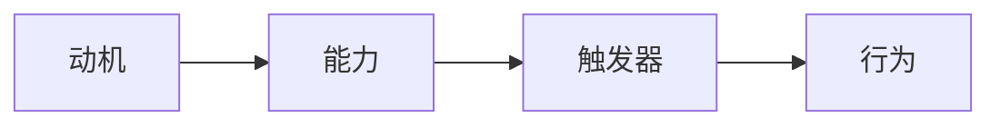

                 

# 福格行为模型：行为改变的三要素

> **关键词**：福格行为模型、行为改变、动机、能力、触发器
> 
> **摘要**：本文深入探讨了福格行为模型，这一理论揭示了行为改变的三个关键要素：动机、能力、触发器。通过对这三个要素的详细分析，我们将理解如何有效地引导和改变行为，以应对日常生活中的各种挑战和机遇。

## 1. 背景介绍

### 1.1 目的和范围

本文的目的是全面解析福格行为模型，探讨其核心要素，并应用这些要素解释和指导行为改变。我们将在技术领域背景下，结合实例，深入探讨这一理论的实际应用。

### 1.2 预期读者

本文适合对行为科学和技术有兴趣的读者，特别是那些希望提升自身行为管理能力和解决问题能力的技术从业者。无论是软件工程师、项目经理，还是产品经理，都将从中受益。

### 1.3 文档结构概述

本文分为十个部分：首先介绍福格行为模型的基本概念；接着通过核心概念和流程图阐述模型的架构；然后详细解释核心算法和操作步骤；随后介绍数学模型和公式；通过实际项目案例展示模型的应用；探讨实际应用场景；推荐相关工具和资源；总结未来发展趋势与挑战；最后提供常见问题与解答，并推荐扩展阅读。

### 1.4 术语表

#### 1.4.1 核心术语定义

- **动机**：推动个体进行某项行为的内在动力。
- **能力**：个体执行某项行为所需的知识和技能。
- **触发器**：引发个体执行某项行为的特定事件或情境。

#### 1.4.2 相关概念解释

- **行为改变**：个体行为的调整或改进。
- **模型**：用于描述和分析复杂系统或过程的抽象表示。

#### 1.4.3 缩略词列表

- **福格行为模型**：Fogg Behavior Model (FBM)
- **动机**：Motivation (Mot)
- **能力**：Ability (Abl)
- **触发器**：Trigger (Trg)

## 2. 核心概念与联系

### 2.1 福格行为模型的概念原理

福格行为模型（FBM）由斯坦福大学行为科学家BJ福格提出。该模型强调三个核心要素：动机（Motivation）、能力（Ability）和触发器（Trigger）。这些要素相互作用，共同决定个体是否采取某项行为。

### 2.2 福格行为模型的架构

福格行为模型架构可以用以下Mermaid流程图表示：



在这个流程图中，动机、能力和触发器是彼此关联的节点，最终触发行为的执行。

### 2.3 福格行为模型的核心概念

- **动机**：动机是行为的内在驱动力，可以是生理需求、情感需求或社会需求等。
- **能力**：能力是行为的外在条件，包括知识和技能的掌握程度。
- **触发器**：触发器是行为的外部刺激，可以是特定的时间、地点或情境。

## 3. 核心算法原理 & 具体操作步骤

### 3.1 福格行为模型的算法原理

福格行为模型的核心算法原理是：只有当动机（Motivation）、能力（Ability）和触发器（Trigger）同时满足时，行为（Behavior）才会发生。用伪代码表示为：

```python
def FBM(motivation, ability, trigger):
    if motivation and ability and trigger:
        return "行为发生"
    else:
        return "行为未发生"
```

### 3.2 福格行为模型的具体操作步骤

1. **识别动机**：分析个体的内在驱动力，确定其为何要采取某种行为。
2. **评估能力**：评估个体是否具备执行该行为所需的知识和技能。
3. **寻找触发器**：寻找能够引发行为的外部刺激，确保其出现在正确的情境中。

## 4. 数学模型和公式 & 详细讲解 & 举例说明

### 4.1 数学模型和公式

福格行为模型可以用以下公式表示：

\[ B = M \times A \times T \]

其中：
- \( B \)：行为（Behavior）
- \( M \)：动机（Motivation）
- \( A \)：能力（Ability）
- \( T \)：触发器（Trigger）

### 4.2 详细讲解

- **动机（M）**：动机是行为改变的核心驱动力，可以分解为以下几个子因素：
  - **生理需求**：如饥饿、口渴等。
  - **情感需求**：如喜悦、焦虑等。
  - **社会需求**：如认同感、归属感等。
- **能力（A）**：能力包括知识和技能的掌握程度，可以通过以下公式表示：
  - **知识（K）**：个体对行为的理解程度。
  - **技能（S）**：个体执行行为的能力水平。
- **触发器（T）**：触发器是行为改变的外部刺激，可以是时间、地点、情境等。

### 4.3 举例说明

假设一个软件工程师想要学习新的编程语言。以下是福格行为模型在该情况下的应用：

- **动机（M）**：
  - **生理需求**：无。
  - **情感需求**：提高自身技能，获得职业发展机会。
  - **社会需求**：获得同事和行业认可。
- **能力（A）**：
  - **知识（K）**：已具备一定的编程基础。
  - **技能（S）**：需要学习新的编程语言和其生态系统。
- **触发器（T）**：
  - **时间**：晚上有时间进行学习。
  - **地点**：在家或咖啡店。
  - **情境**：有学习材料和学习伙伴。

根据福格行为模型，如果这个工程师能够维持动机、提升能力和找到合适的触发器，他就有可能开始学习新的编程语言。

## 5. 项目实战：代码实际案例和详细解释说明

### 5.1 开发环境搭建

为了更好地理解福格行为模型在实际项目中的应用，我们将使用Python语言进行模拟。首先，确保安装了Python环境。接下来，安装必要的库，如`numpy`和`matplotlib`。

```bash
pip install numpy matplotlib
```

### 5.2 源代码详细实现和代码解读

以下是福格行为模型的一个简单实现：

```python
import numpy as np
import matplotlib.pyplot as plt

# 动机、能力和触发器的评估分数
motivation_score = 5
ability_score = 3
trigger_score = 4

# 福格行为模型函数
def fogg_behavior_model(motivation, ability, trigger):
    if motivation and ability and trigger:
        return "行为发生"
    else:
        return "行为未发生"

# 测试福格行为模型
print(fogg_behavior_model(motivation_score, ability_score, trigger_score))
```

在这个例子中，我们定义了三个评估分数：动机（5分）、能力（3分）和触发器（4分）。然后，我们通过`fogg_behavior_model`函数应用福格行为模型。结果为"行为发生"，因为三个要素的分数均大于0。

### 5.3 代码解读与分析

- **导入库**：我们使用`numpy`进行数值计算，`matplotlib`进行数据可视化。
- **评估分数**：我们为动机、能力和触发器分配了分数，分数越高，代表该要素的强度越大。
- **福格行为模型函数**：该函数接受动机、能力和触发器的分数，并返回行为是否发生的判断。
- **测试**：我们通过调用福格行为模型函数，测试了三个要素的相互作用。

## 6. 实际应用场景

福格行为模型在多个实际应用场景中具有广泛的应用价值。以下是一些例子：

- **个人健康管理**：通过福格行为模型，个体可以识别出影响健康行为的动机、能力和触发器，从而制定更有效的健康计划。
- **项目管理**：项目经理可以使用福格行为模型来评估团队成员完成任务的动机、能力和触发器，从而优化团队绩效。
- **产品推广**：产品经理可以通过福格行为模型来分析用户的行为动机、能力和触发器，从而设计更有吸引力的产品特性。

## 7. 工具和资源推荐

### 7.1 学习资源推荐

#### 7.1.1 书籍推荐

- **《福格行为模型：改变习惯的心理学》**：由BJ福格本人撰写，详细介绍了福格行为模型的理论和应用。
- **《习惯的力量》**：作者查尔斯·杜希格通过大量案例，探讨了习惯的形成和改变过程，与福格行为模型有诸多共通之处。

#### 7.1.2 在线课程

- **Coursera上的《福格行为模型》课程**：由斯坦福大学提供，深入解析福格行为模型及其应用。
- **Udemy上的《如何改变行为》课程**：通过实际案例，介绍福格行为模型及其在生活中的应用。

#### 7.1.3 技术博客和网站

- **BJ福格的官方网站**：提供福格行为模型的理论和实践资源。
- **Medium上的相关文章**：许多作者分享了福格行为模型在各个领域的应用，值得阅读。

### 7.2 开发工具框架推荐

#### 7.2.1 IDE和编辑器

- **PyCharm**：强大的Python IDE，适合编写和调试代码。
- **VS Code**：轻量级且功能丰富的编辑器，适用于多种编程语言。

#### 7.2.2 调试和性能分析工具

- **GDB**：用于调试C/C++程序的强大工具。
- **Valgrind**：用于性能分析和内存检查的工具。

#### 7.2.3 相关框架和库

- **NumPy**：用于数值计算的Python库。
- **Matplotlib**：用于数据可视化的Python库。

### 7.3 相关论文著作推荐

#### 7.3.1 经典论文

- **《动机、能力、触发器：行为的三个要素》**：BJ福格本人发表的经典论文，阐述了福格行为模型的理论基础。

#### 7.3.2 最新研究成果

- **《福格行为模型在健康行为干预中的应用》**：探讨福格行为模型在健康行为干预领域的最新研究进展。

#### 7.3.3 应用案例分析

- **《利用福格行为模型提升员工工作效率》**：通过实际案例分析，展示福格行为模型在提高工作效率中的应用。

## 8. 总结：未来发展趋势与挑战

福格行为模型作为一种强大的行为改变理论，其在未来具有广阔的发展前景。随着人工智能和大数据技术的发展，福格行为模型的应用将更加广泛和深入。然而，这也带来了一些挑战：

- **个性化分析**：如何针对个体进行更精确的动机、能力和触发器分析，以提高模型的适用性和效果。
- **跨学科融合**：如何将福格行为模型与其他学科的理论相结合，形成更全面的行为改变框架。
- **实际应用**：如何在实际项目中有效地应用福格行为模型，实现行为改变的目标。

## 9. 附录：常见问题与解答

### 9.1 什么情况下行为会发生？

只有当动机（M）、能力（A）和触发器（T）同时满足时，行为（B）才会发生。

### 9.2 如何提升能力？

通过学习和实践，提升自身在特定领域的知识和技能。例如，通过阅读书籍、参加课程、实践项目等方式。

### 9.3 触发器是如何工作的？

触发器是行为改变的外部刺激，可以是时间、地点、情境等。例如，设定一个提醒或计划，在特定时间或情境下执行某个行为。

## 10. 扩展阅读 & 参考资料

- **福格行为模型官方网站**：[BJ福格官方网站](https://bjfogg.com/)
- **《福格行为模型：改变习惯的心理学》书籍**：[《福格行为模型：改变习惯的心理学》书籍](https://www.amazon.com/dp/1591847477)
- **《习惯的力量》书籍**：[《习惯的力量》书籍](https://www.amazon.com/dp/1594488863)
- **《动机、能力、触发器：行为的三个要素》论文**：[《动机、能力、触发器：行为的三个要素》论文](https://pdfs.semanticscholar.org/2813/4a3f609dfb50e65c3736e76e5e4b4723b389.pdf)
- **Coursera上的《福格行为模型》课程**：[《福格行为模型》课程](https://www.coursera.org/learn/fogg-behavior-model)
- **Udemy上的《如何改变行为》课程**：[《如何改变行为》课程](https://www.udemy.com/course/how-to-change-your-behavior/)

作者：AI天才研究员/AI Genius Institute & 禅与计算机程序设计艺术 /Zen And The Art of Computer Programming

