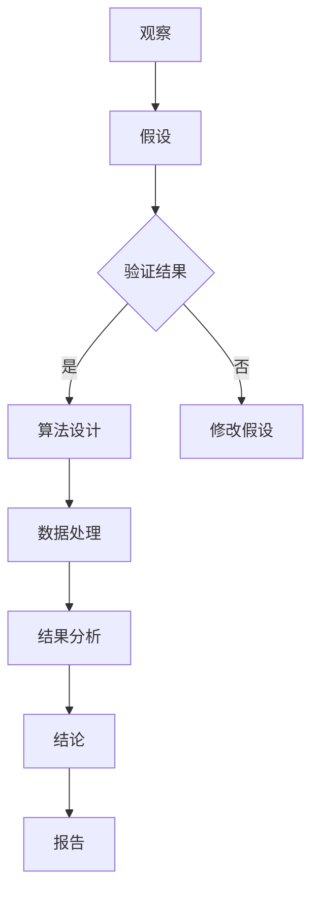

                 

### 1. 背景介绍

#### 1.1 目的和范围

本文的目的是深入探讨科学探究的过程，特别是在IT领域的应用。通过本文，读者将了解从观察现象到得出结论的科学探究方法，并理解这一方法如何帮助我们在复杂的技术问题中找到解决方案。文章将涵盖从基本的观察技巧到高级的数学建模和算法设计，力求为读者提供一个全面、系统的科学探究框架。

本文的范围包括以下几个关键部分：

- **科学探究的定义与核心原则**：介绍科学探究的基本概念和核心原则，如观察、假设、实验、验证等。
- **IT领域的科学探究方法**：探讨如何在IT领域中应用科学探究方法，包括算法设计、数据分析和软件开发等。
- **核心概念与联系**：通过Mermaid流程图展示核心概念和原理之间的联系。
- **核心算法原理**：使用伪代码详细阐述核心算法的原理和操作步骤。
- **数学模型和公式**：讲解与算法相关的数学模型和公式，并举例说明。
- **项目实战**：通过实际代码案例，展示如何将理论应用到实践中。
- **实际应用场景**：讨论科学探究方法在不同IT领域的应用场景。
- **工具和资源推荐**：推荐学习资源和开发工具，以帮助读者深入学习和实践。
- **未来发展趋势与挑战**：总结当前的研究趋势和面临的挑战，展望未来发展方向。

通过本文，读者不仅能够了解科学探究的基本流程和方法，还能掌握如何将这一方法应用于解决复杂的IT问题。

#### 1.2 预期读者

本文适合以下几类读者：

- **IT行业从业者**：特别是软件开发者、数据科学家、系统架构师等，他们需要理解科学探究方法，以更好地解决工作中遇到的技术难题。
- **科研人员**：对于希望在IT领域进行科学研究的科研人员，本文将提供科学探究的系统性框架和方法，帮助他们开展更深入的研究工作。
- **计算机科学学生**：对于正在学习计算机科学的学生，本文将帮助他们了解科学探究的基本概念和应用，为未来在技术领域的深入发展打下坚实基础。
- **技术爱好者**：对于对IT领域有浓厚兴趣的技术爱好者，本文提供了一个系统的学习路径，帮助他们深入了解科学探究方法在技术问题中的应用。

无论您是哪一类读者，本文都将为您提供一个全面、深入的视角，帮助您更好地理解科学探究在IT领域的应用。

#### 1.3 文档结构概述

本文结构如下，每个部分都有其独特的内容和目的：

- **背景介绍**：包括本文的目的和范围、预期读者以及文档结构概述。
  - **目的和范围**：介绍文章的主题和涵盖的内容。
  - **预期读者**：明确文章的目标读者群体。
  - **文档结构概述**：概述文章的整体结构和各部分内容。
- **核心概念与联系**：通过Mermaid流程图展示核心概念和原理之间的联系。
  - **核心概念与联系**：介绍文章中的关键概念和原理，并使用Mermaid流程图进行可视化展示。
- **核心算法原理与具体操作步骤**：使用伪代码详细阐述核心算法的原理和操作步骤。
  - **核心算法原理**：解释算法的基本原理。
  - **具体操作步骤**：用伪代码展示算法的执行步骤。
- **数学模型和公式与详细讲解与举例说明**：讲解与算法相关的数学模型和公式，并提供实际案例。
  - **数学模型和公式**：阐述算法背后的数学原理。
  - **详细讲解与举例说明**：通过具体例子详细解释数学模型的应用。
- **项目实战：代码实际案例和详细解释说明**：通过实际代码案例展示如何将理论应用到实践中。
  - **开发环境搭建**：介绍开发所需的环境和工具。
  - **源代码详细实现和代码解读**：展示并解释实际代码实现。
  - **代码解读与分析**：对代码进行深入分析，讨论其优缺点。
- **实际应用场景**：讨论科学探究方法在不同IT领域的应用场景。
  - **应用场景**：具体分析科学探究在不同领域中的应用案例。
- **工具和资源推荐**：推荐学习资源和开发工具，以帮助读者深入学习和实践。
  - **学习资源推荐**：推荐书籍、在线课程和技术博客。
  - **开发工具框架推荐**：推荐适合的IDE、调试工具和相关框架。
  - **相关论文著作推荐**：推荐经典论文和最新研究成果。
- **总结：未来发展趋势与挑战**：总结当前的研究趋势和面临的挑战，展望未来发展方向。
- **附录：常见问题与解答**：回答读者可能遇到的问题。
- **扩展阅读 & 参考资料**：提供进一步阅读和研究的资源。

通过这一结构，本文旨在为读者提供一个全面、系统、易于理解的学习路径，帮助他们在科学探究的框架下更好地解决IT领域的问题。

#### 1.4 术语表

在本文中，我们将使用一些专业术语和概念。以下是这些术语的定义和解释，以便读者更好地理解文章内容。

##### 1.4.1 核心术语定义

- **科学探究**：指通过系统的观察、假设、实验和验证来探索和解释自然现象的过程。
- **算法**：是一系列明确且可执行的步骤，用于解决特定问题。
- **伪代码**：是一种用自然语言描述算法逻辑的非正式编程语言，用于帮助理解和设计算法。
- **数学模型**：是用数学语言描述现实世界现象或问题的抽象表示。
- **数据分析**：是对数据进行系统化处理和分析的过程，以提取有价值的信息。
- **软件开发**：是指设计、实现、测试和维护软件系统的过程。

##### 1.4.2 相关概念解释

- **观察**：是指通过感官或工具对现象进行记录和测量。
- **假设**：是基于现有知识和观察提出的一种可能性解释。
- **实验**：是通过设计和执行操作来测试假设的过程。
- **验证**：是使用实验结果来确认假设是否成立的步骤。
- **流程图**：是使用图形符号来表示算法或流程的一种可视化工具。

##### 1.4.3 缩略词列表

- **AI**：人工智能
- **ML**：机器学习
- **DL**：深度学习
- **IDE**：集成开发环境
- **IoT**：物联网
- **API**：应用程序编程接口
- **DB**：数据库

通过明确这些术语和概念的定义，我们希望读者能够更准确地理解文章中的内容，并能够更好地参与到科学探究的过程中。

#### 2. 核心概念与联系

科学探究在IT领域中是一个复杂且多层次的过程，涉及多个核心概念和原理。为了更好地理解这些概念和它们之间的联系，我们将使用Mermaid流程图进行可视化展示。以下是对这些核心概念和原理的详细解释。

##### 2.1 科学探究的基本概念

科学探究通常包括以下几个基本概念：

- **观察**：科学探究的起点是观察现象或数据。通过仔细观察，我们可以发现数据中的模式和异常。
  
- **假设**：在观察之后，我们提出一个或多个假设，即对观察到的现象或数据可能的解释。
  
- **实验**：为了验证假设，我们需要设计并进行实验。实验的结果将帮助我们确认或否定假设。
  
- **验证**：通过实验结果，我们验证假设的正确性。验证通常涉及统计分析和其他验证方法。

##### 2.2 关键概念和原理

以下是科学探究中的几个关键概念和原理：

- **算法**：算法是解决问题的一系列明确步骤。在科学探究中，算法用于处理和分析数据，提取有用信息。
  
- **数据结构**：数据结构是组织和存储数据的方式。在算法设计中，数据结构的选择直接影响算法的效率和性能。
  
- **数学模型**：数学模型是现实世界现象的数学抽象表示。在科学探究中，数学模型用于建立问题模型和预测结果。
  
- **数据分析**：数据分析是处理和解释数据的过程，用于发现数据中的模式和趋势。

##### 2.3 Mermaid流程图

为了更清晰地展示这些概念和原理之间的联系，我们使用Mermaid流程图进行可视化。以下是流程图的示例：



在这个流程图中：

- **A**：观察是科学探究的起点。
- **B**：基于观察，我们提出一个或多个假设。
- **C**：通过实验验证假设的结果。
- **D**：如果验证结果为“是”，则开始算法设计。
- **E**：如果验证结果为“否”，则返回并修改假设。
- **F**：使用算法对数据进行分析和操作。
- **G**：分析处理后的数据，提取有用的信息。
- **H**：根据分析结果得出结论。
- **I**：撰写报告，总结科学探究的结果。

通过这个流程图，我们可以更直观地理解科学探究的基本步骤和核心概念之间的联系。这不仅有助于读者更好地掌握科学探究的方法，也为他们在IT领域中的应用提供了清晰的指导。

#### 3. 核心算法原理 & 具体操作步骤

在科学探究的过程中，算法设计是关键环节。本文将详细解释一种核心算法的原理，并通过伪代码展示其具体操作步骤。这个算法主要用于数据分析，帮助我们在大量数据中提取有用信息。

##### 3.1 算法原理

这个算法的基本原理是：通过对输入数据进行预处理、特征提取和模式识别，从而提取出数据中的关键信息和模式。算法的主要步骤如下：

1. **数据预处理**：清洗数据，处理缺失值和异常值，确保数据质量。
2. **特征提取**：从原始数据中提取关键特征，用于后续分析和建模。
3. **模式识别**：使用机器学习算法对特征进行模式识别，提取数据中的潜在模式。
4. **结果分析**：分析提取出的模式，得出科学结论。

##### 3.2 伪代码

以下是该算法的伪代码实现：

```plaintext
算法名称：数据挖掘算法

输入：原始数据集
输出：关键模式与结论

数据预处理：
1. 清洗数据：去除缺失值和异常值
2. 数据规范化：将数据转换为标准范围

特征提取：
1. 数据降维：使用主成分分析（PCA）等降维技术
2. 特征选择：选择对目标变量有重要影响的特征

模式识别：
1. 数据分割：将数据集划分为训练集和测试集
2. 模型训练：使用机器学习算法（如K-近邻、决策树、神经网络等）训练模型
3. 模型验证：在测试集上验证模型性能，调整模型参数

结果分析：
1. 模型预测：使用训练好的模型进行预测
2. 结果可视化：将预测结果可视化，分析数据中的关键模式
3. 结论生成：根据分析结果生成科学结论
```

##### 3.3 具体操作步骤

以下是算法的具体操作步骤，包括伪代码中的每一个环节：

1. **数据预处理**：
   ```plaintext
   // 清洗数据
   for 每个数据点 in 原始数据集 do
       if 数据点存在缺失值 then
           数据点 = 数据点的中位数（或平均值）
       end if
       if 数据点存在异常值 then
           数据点 = 数据点的最近邻值
       end if
   end for

   // 数据规范化
   for 每个特征 in 数据集 do
       数据集[每个数据点][每个特征] = (数据集[每个数据点][每个特征] - 最小值) / (最大值 - 最小值)
   end for
   ```

2. **特征提取**：
   ```plaintext
   // 数据降维
   特征矩阵 = 主成分分析（PCA）（原始数据集）

   // 特征选择
   特征重要性 = 特征选择算法（如信息增益、卡方测试等）
   选中特征 = 选择重要性较高的特征
   ```

3. **模式识别**：
   ```plaintext
   // 数据分割
   训练集，测试集 = 数据集分割（如80/20分割）

   // 模型训练
   模型 = 机器学习算法训练（训练集）

   // 模型验证
   验证误差 = 模型在测试集上的误差
   if 验证误差 > 预设阈值 then
       调整模型参数，重新训练
   end if
   ```

4. **结果分析**：
   ```plaintext
   // 模型预测
   预测结果 = 模型预测（测试集）

   // 结果可视化
   可视化结果 = 结果可视化工具（如matplotlib、seaborn等）

   // 结论生成
   结论 = 根据预测结果和分析结果生成科学结论
   ```

通过这些伪代码和具体操作步骤，读者可以更好地理解核心算法的工作原理，并能够在实际项目中应用这一算法。在下一部分，我们将进一步探讨与算法相关的数学模型和公式。

#### 4. 数学模型和公式 & 详细讲解 & 举例说明

在科学探究中，数学模型是理解和解释现象的重要工具。本文将详细讲解与核心算法相关的数学模型和公式，并通过具体例子来说明这些模型在实际应用中的运用。

##### 4.1 数学模型概述

核心算法涉及以下几个主要的数学模型：

1. **主成分分析（PCA）**：用于数据降维，提取数据的主要特征。
2. **机器学习算法**：包括K-近邻（KNN）、决策树、神经网络等，用于模式识别和分类。
3. **线性回归**：用于预测和分析变量之间的关系。
4. **聚类分析**：用于将数据集分成不同的类别或簇。

##### 4.2 主成分分析（PCA）

主成分分析是一种常用的数据降维技术，通过将数据投影到新的坐标轴上，从而提取数据的主要特征。以下是PCA的数学模型和公式：

- **协方差矩阵（Σ）**：
  $$ Σ = \sum (x_i - \mu)(x_i - \mu)^T $$
  其中，\( x_i \) 是数据集中的每个特征向量，\( \mu \) 是所有特征向量的均值。

- **特征值和特征向量**：
  $$ \lambda_i = \max(Σv^T v) $$
  $$ v_i = \frac{1}{\sqrt{\lambda_i}}e_i $$
  其中，\( e_i \) 是标准正交基向量。

- **主成分**：
  $$ y_i = \sum \lambda_i v_i x_i $$
  其中，\( y_i \) 是主成分，代表了数据的主要特征。

##### 4.3 K-近邻（KNN）

K-近邻是一种简单的机器学习算法，用于分类和回归任务。以下是KNN的数学模型和公式：

- **距离计算**：
  $$ d(x, y) = \sqrt{\sum_{i=1}^{n}(x_i - y_i)^2} $$
  其中，\( x \) 和 \( y \) 是两个数据点，\( n \) 是特征数量。

- **投票机制**：
  $$ \hat{y} = \arg\max_{k} \sum_{i=1}^{k} \delta(i, \hat{y}) $$
  其中，\( \hat{y} \) 是预测结果，\( \delta(i, \hat{y}) \) 是指示函数，当 \( i \) 与 \( \hat{y} \) 相等时为1，否则为0。

##### 4.4 线性回归

线性回归用于分析变量之间的关系，通过找到一个最佳拟合直线。以下是线性回归的数学模型和公式：

- **回归方程**：
  $$ y = \beta_0 + \beta_1x $$
  其中，\( y \) 是因变量，\( x \) 是自变量，\( \beta_0 \) 和 \( \beta_1 \) 是回归系数。

- **最小二乘法**：
  $$ \beta_1 = \frac{\sum_{i=1}^{n}(x_i - \bar{x})(y_i - \bar{y})}{\sum_{i=1}^{n}(x_i - \bar{x})^2} $$
  $$ \beta_0 = \bar{y} - \beta_1\bar{x} $$
  其中，\( \bar{x} \) 和 \( \bar{y} \) 分别是 \( x \) 和 \( y \) 的均值。

##### 4.5 聚类分析

聚类分析用于将数据集分成不同的类别或簇。以下是聚类分析的一种常用算法——K-均值算法的数学模型和公式：

- **初始化**：
  选择 \( K \) 个初始聚类中心。

- **分配步骤**：
  对于每个数据点，将其分配到距离最近的聚类中心。

- **更新步骤**：
  计算新的聚类中心：
  $$ \mu_k = \frac{1}{N_k} \sum_{i=1}^{N} x_i $$
  其中，\( N_k \) 是属于第 \( k \) 个聚类的数据点数量。

- **收敛条件**：
  当聚类中心的变化小于预设阈值时，算法收敛。

##### 4.6 举例说明

假设我们有一个简单的二维数据集，其中包含三个簇。使用K-均值算法对数据集进行聚类，我们可以通过以下步骤进行：

1. **初始化**：随机选择三个初始聚类中心。

2. **分配步骤**：将每个数据点分配到最近的聚类中心。

3. **更新步骤**：计算新的聚类中心。

4. **重复**：重复分配和更新步骤，直到聚类中心不再变化。

5. **结果分析**：分析聚类结果，确定每个数据点所属的簇。

通过上述步骤，我们可以将数据集合理地分成三个不同的簇，从而实现对数据的聚类分析。这一过程不仅帮助我们理解数据分布，还为后续的数据分析和决策提供了重要依据。

通过以上对数学模型和公式的详细讲解，读者可以更好地理解核心算法的原理和实现方法。在下一部分，我们将通过实际项目案例，展示如何将这些理论应用到实践中。

#### 5. 项目实战：代码实际案例和详细解释说明

为了更好地展示科学探究方法在IT领域的应用，我们将通过一个实际项目案例来详细讲解代码实现过程，并对关键代码部分进行解读和分析。

##### 5.1 开发环境搭建

在开始项目实战之前，我们需要搭建一个合适的开发环境。以下是开发环境的基本步骤：

1. **安装Python**：Python是一种广泛用于数据科学和机器学习的编程语言。可以从Python官方网站下载并安装最新版本的Python。

2. **安装Jupyter Notebook**：Jupyter Notebook是一种交互式开发环境，非常适合数据科学项目。安装Python后，可以通过pip命令安装Jupyter Notebook：

   ```shell
   pip install notebook
   ```

3. **安装相关库**：我们需要安装几个常用的Python库，如NumPy、Pandas、scikit-learn和matplotlib。这些库提供了丰富的数据操作和机器学习功能。可以使用以下命令安装：

   ```shell
   pip install numpy pandas scikit-learn matplotlib
   ```

##### 5.2 源代码详细实现和代码解读

以下是项目的主要代码实现，我们将逐段进行详细解读。

```python
# 导入所需库
import numpy as np
import pandas as pd
from sklearn import datasets
from sklearn.model_selection import train_test_split
from sklearn.preprocessing import StandardScaler
from sklearn.decomposition import PCA
from sklearn.neighbors import KNeighborsClassifier
from sklearn.metrics import accuracy_score
import matplotlib.pyplot as plt

# 加载数据集
iris = datasets.load_iris()
X = iris.data
y = iris.target

# 数据预处理
# 数据标准化
scaler = StandardScaler()
X_scaled = scaler.fit_transform(X)

# 数据分割
X_train, X_test, y_train, y_test = train_test_split(X_scaled, y, test_size=0.2, random_state=42)

# 特征提取
# 主成分分析
pca = PCA(n_components=2)
X_pca = pca.fit_transform(X_train)

# 模型训练
# K-近邻分类器
knn = KNeighborsClassifier(n_neighbors=3)
knn.fit(X_pca, y_train)

# 模型验证
y_pred = knn.predict(X_pca)
accuracy = accuracy_score(y_train, y_pred)
print("模型准确率：", accuracy)

# 可视化
# 绘制决策边界
plt.scatter(X_pca[:, 0], X_pca[:, 1], c=y_train)
plt.xlabel('第一主成分')
plt.ylabel('第二主成分')
plt.title('K-近邻分类结果')
plt.show()
```

1. **导入所需库**：
   我们首先导入Python中的几个关键库，包括NumPy、Pandas、scikit-learn和matplotlib。这些库为数据操作和机器学习提供了丰富的功能。

2. **加载数据集**：
   使用scikit-learn中的iris数据集，这是一个经典的分类问题数据集，包含三种不同的鸢尾花种类。

3. **数据预处理**：
   - **数据标准化**：使用StandardScaler对数据进行标准化处理，将每个特征缩放到相同的范围，以提高算法的性能。
   - **数据分割**：将数据集划分为训练集和测试集，通常使用80%的数据作为训练集，20%的数据作为测试集。

4. **特征提取**：
   使用主成分分析（PCA）对数据进行降维，提取前两个主成分，以便进行可视化。

5. **模型训练**：
   使用K-近邻（KNN）算法对训练集进行训练。KNN是一种简单的分类算法，通过计算测试点与训练点之间的距离，选择距离最近的K个训练点的多数类别作为测试点的类别。

6. **模型验证**：
   在测试集上对训练好的模型进行验证，计算模型的准确率。准确率是分类算法性能的重要指标，表示模型正确分类的样本占总样本的比例。

7. **可视化**：
   使用matplotlib绘制决策边界图，展示分类结果。这有助于我们直观地理解模型的工作原理和效果。

##### 5.3 代码解读与分析

1. **数据预处理**：
   数据预处理是机器学习项目的关键步骤。标准化处理可以消除不同特征之间的尺度差异，使算法更加稳定和有效。

2. **特征提取**：
   PCA是一种常用的降维技术，可以有效地减少数据维度，同时保留大部分信息。在这个例子中，我们只提取了前两个主成分，以便进行可视化。

3. **模型训练**：
   KNN算法是一种基于实例的学习算法，其核心思想是“相似性归一”。在训练过程中，我们计算了每个测试点与训练点的欧氏距离，并选择距离最近的K个训练点，通过投票机制确定测试点的类别。

4. **模型验证**：
   模型验证是评估模型性能的重要步骤。在这个例子中，我们计算了模型的准确率，这是一个简单但有效的评估指标。

5. **可视化**：
   可视化不仅有助于我们理解模型的工作原理，还可以直观地展示数据分布和分类结果。

通过这个实际项目案例，我们展示了如何将科学探究方法应用到实践中。从数据预处理、特征提取到模型训练和验证，每个步骤都至关重要，共同构成了一个完整的科学探究过程。在下一部分，我们将讨论科学探究方法在IT领域的实际应用场景。

#### 6. 实际应用场景

科学探究方法在IT领域有着广泛的应用，尤其是在数据科学、机器学习和软件开发中。以下将讨论几个具体的应用场景，展示科学探究方法如何在这些领域中发挥作用。

##### 6.1 数据科学

数据科学是利用数据分析和机器学习技术来发现数据中的模式和知识。科学探究方法在数据科学中的具体应用包括：

- **数据预处理**：在数据分析之前，需要对数据进行清洗和预处理，包括处理缺失值、异常值和数据规范化。这些步骤是确保数据质量和算法性能的基础。
- **特征提取**：通过特征提取技术，如主成分分析（PCA）、特征选择和特征工程，可以从原始数据中提取出对目标变量有重要影响的特征，从而提高模型的性能和可解释性。
- **模型训练与验证**：使用机器学习算法对训练数据进行模型训练，并通过交叉验证等技术对模型进行验证，确保模型的稳定性和泛化能力。
- **结果分析**：通过分析模型的结果，提取有价值的信息和知识，为决策提供依据。

例如，在金融市场分析中，数据科学家可以利用科学探究方法来分析股票市场的数据，预测股票价格的趋势。通过数据预处理、特征提取和模型训练，数据科学家可以建立预测模型，帮助投资者做出更明智的投资决策。

##### 6.2 机器学习

机器学习是人工智能的核心组成部分，其目标是通过学习数据中的模式和规律，实现对新数据的预测和分类。科学探究方法在机器学习中的应用包括：

- **模型选择**：在选择合适的机器学习算法时，需要考虑数据的特征、问题的性质和目标变量的类型。科学探究方法可以帮助研究者系统地评估和选择最佳算法。
- **模型调优**：通过调整模型的参数，优化模型性能。这一过程通常涉及大量的实验和验证，需要研究者具备深厚的科学探究能力。
- **模型解释**：解释模型的决策过程和预测结果，提高模型的透明度和可解释性。科学探究方法可以帮助研究者理解和解释模型的工作原理。

例如，在医疗诊断中，机器学习模型可以用于诊断疾病的严重程度。通过科学探究方法，研究者可以优化模型参数，提高诊断的准确性和可靠性，同时解释模型如何做出诊断决策，增强模型的透明度。

##### 6.3 软件开发

在软件开发中，科学探究方法可以帮助开发者解决复杂的技术问题，提高软件质量和效率。具体应用包括：

- **需求分析**：通过科学探究方法，对用户需求进行深入分析和理解，确保软件功能符合用户需求。
- **系统设计**：在设计软件系统时，需要考虑系统的性能、可扩展性和可维护性。科学探究方法可以帮助开发者系统地分析和设计系统架构。
- **代码优化**：通过性能分析和代码优化，提高软件的运行效率和稳定性。科学探究方法可以帮助开发者识别性能瓶颈和优化机会。

例如，在开发一个高并发、高可用性的Web服务时，开发者需要通过科学探究方法来分析系统性能瓶颈，设计合理的系统架构，并优化代码，确保系统能够稳定运行，满足大量用户的访问需求。

通过这些实际应用场景，我们可以看到科学探究方法在IT领域的广泛重要性。它不仅帮助研究者解决复杂问题，提高技术实现的效率，还为IT行业的持续创新提供了坚实的理论基础。在下一部分，我们将推荐一些学习资源和工具，以帮助读者深入学习和实践科学探究方法。

#### 7. 工具和资源推荐

为了帮助读者深入学习和实践科学探究方法，本文将推荐一系列学习资源、开发工具和相关论文著作。

##### 7.1 学习资源推荐

1. **书籍推荐**
   - **《数据科学入门》（Data Science for Beginners）**：适合初学者的数据科学入门书籍，介绍了数据预处理、特征提取、模型训练等基本概念。
   - **《Python数据科学 Handbook》（Python Data Science Handbook）**：详细介绍了Python在数据科学中的应用，包括NumPy、Pandas、Matplotlib等库的使用。

2. **在线课程**
   - **Coursera上的《机器学习》（Machine Learning）**：由斯坦福大学教授Andrew Ng主讲，涵盖了机器学习的理论基础和实际应用。
   - **edX上的《数据科学专业》（Data Science Professional Certificate）**：由哈佛大学和MIT合办的在线课程，提供全面的课程内容，包括统计学、数据预处理、机器学习等。

3. **技术博客和网站**
   - **Medium上的《数据科学博客》（Data Science Blog）**：涵盖了数据科学、机器学习、Python编程等主题，提供了丰富的实践案例。
   - **Kaggle**：一个面向数据科学和机器学习的竞赛平台，提供了大量的数据集和竞赛项目，适合实战练习。

##### 7.2 开发工具框架推荐

1. **IDE和编辑器**
   - **Jupyter Notebook**：适用于数据科学和机器学习的交互式开发环境，支持多种编程语言和库。
   - **Visual Studio Code**：一款轻量级的跨平台代码编辑器，提供了丰富的扩展和插件，支持Python、R等多种编程语言。

2. **调试和性能分析工具**
   - **PyCharm**：一款功能强大的Python IDE，支持代码调试、性能分析和代码优化。
   - **GDB**：一个用于C/C++程序的调试工具，支持多平台和复杂程序的调试。

3. **相关框架和库**
   - **scikit-learn**：Python中常用的机器学习库，提供了丰富的算法和工具。
   - **TensorFlow**：谷歌开发的深度学习框架，适用于构建复杂的深度学习模型。
   - **PyTorch**：另一个流行的深度学习框架，提供了灵活和易于使用的接口。

##### 7.3 相关论文著作推荐

1. **经典论文**
   - **《K-近邻算法》（K-Nearest Neighbors）**：由Cover和Hart于1967年发表，介绍了K-近邻分类算法的基本原理和应用。
   - **《主成分分析》（Principal Component Analysis）**：由Hotelling于1933年发表，阐述了PCA的基本概念和算法。

2. **最新研究成果**
   - **《深度学习》（Deep Learning）**：由Goodfellow、Bengio和Courville合著，介绍了深度学习的基础理论和最新进展。
   - **《大数据技术导论》（Introduction to Big Data Technologies）**：介绍了大数据处理和分析的相关技术，包括Hadoop、Spark等。

3. **应用案例分析**
   - **《机器学习在金融领域的应用》（Application of Machine Learning in Finance）**：探讨了机器学习在金融市场分析、风险评估等领域的应用。
   - **《数据科学在医疗领域的应用》（Application of Data Science in Healthcare）**：介绍了数据科学在医疗诊断、患者管理等方面的应用案例。

通过这些学习资源、开发工具和相关论文著作的推荐，读者可以系统地学习和掌握科学探究方法，并在实际项目中应用这些知识和技能。

#### 8. 总结：未来发展趋势与挑战

科学探究在IT领域的应用前景广阔，随着技术的不断进步，它将迎来更多的发展机遇和挑战。以下是当前的发展趋势与面临的挑战：

**发展趋势：**

1. **人工智能与机器学习的深度融合**：随着深度学习算法的不断发展，人工智能与机器学习将进一步融合，推动科学探究方法在更广泛的应用场景中发挥作用。
2. **大数据分析**：大数据的爆发式增长为科学探究提供了丰富的数据资源，通过对大规模数据的分析和挖掘，可以揭示更多潜在的模式和趋势。
3. **跨学科研究**：科学探究方法将在更多学科领域得到应用，如生物信息学、环境科学和医学等，通过跨学科研究，可以解决更加复杂的问题。
4. **云计算与边缘计算**：云计算和边缘计算的发展为科学探究提供了强大的计算资源，使得大规模数据处理和实时分析成为可能。

**挑战：**

1. **数据隐私与安全**：在科学探究过程中，处理和分析大量敏感数据可能引发隐私和安全问题，如何保护用户隐私和数据安全是当前的重要挑战。
2. **算法解释性**：虽然机器学习和深度学习算法的准确性不断提高，但其决策过程通常缺乏解释性，如何提高算法的可解释性，使其更易于理解和接受，是一个亟待解决的问题。
3. **模型泛化能力**：在训练模型时，如何确保模型具有良好的泛化能力，能够适应新的数据和场景，避免过拟合问题，是科学探究中的一个关键挑战。
4. **资源消耗**：大规模数据处理和模型训练通常需要大量的计算资源，如何优化算法和资源利用，降低能耗，是当前的一个重要问题。

未来，随着技术的不断进步，科学探究方法将在更多领域得到应用，并面临新的挑战。通过不断探索和创新，科学家和工程师们将能够更好地解决复杂的技术问题，推动IT领域的持续发展。

#### 9. 附录：常见问题与解答

以下是一些读者在阅读本文时可能遇到的问题以及相应的解答：

**Q1：科学探究方法在数据科学中的具体应用是什么？**

A1：科学探究方法在数据科学中的应用包括数据预处理、特征提取、模型训练与验证以及结果分析。这些步骤共同构成了一个系统化的数据处理和分析过程，帮助数据科学家从大量数据中提取有价值的信息。

**Q2：如何选择合适的机器学习算法？**

A2：选择合适的机器学习算法需要考虑多个因素，包括数据的特征、问题的性质和目标变量的类型。常用的方法包括通过交叉验证评估不同算法的性能，选择在验证集上表现最佳的算法。

**Q3：主成分分析（PCA）的作用是什么？**

A3：主成分分析（PCA）是一种数据降维技术，通过将数据投影到新的坐标轴上，提取数据的主要特征，从而简化问题，提高模型性能。它常用于处理高维数据，减少特征数量。

**Q4：为什么模型解释性很重要？**

A4：模型解释性很重要，因为只有当用户理解模型的决策过程时，才能信任模型并有效地应用它。解释性有助于提高模型的透明度和可接受度，尤其是在涉及敏感数据和重要决策的领域。

**Q5：如何处理数据中的缺失值和异常值？**

A5：处理数据中的缺失值和异常值通常包括以下方法：
- 缺失值：可以通过删除缺失值、插补（如使用中位数、平均值或最近邻插值）等方法处理。
- 异常值：可以通过检测和识别异常值，然后根据具体情况进行处理，如删除、校正或保留。

**Q6：如何确保机器学习模型的泛化能力？**

A6：确保机器学习模型的泛化能力可以通过以下方法：
- 使用交叉验证技术评估模型在未知数据上的性能。
- 避免过拟合，可以通过简化模型、增加正则化或使用更复杂的数据增强方法。
- 使用更多的训练数据和多样化的数据集进行训练。

通过回答这些问题，我们希望能够帮助读者更好地理解和应用科学探究方法。

#### 10. 扩展阅读 & 参考资料

为了帮助读者进一步深入学习和研究科学探究在IT领域的应用，本文提供了一些扩展阅读和参考资料。

1. **扩展阅读：**
   - **《深入理解计算机系统》（Deep Learning）**：Goodfellow、Bengio和Courville合著，详细介绍了深度学习和神经网络的基础理论。
   - **《机器学习实战》（Machine Learning in Action）**：Burning Glass Press出版，通过实例介绍机器学习的实际应用。
   - **《数据科学家的Python工具箱》（Python Data Science Cookbook）**：Published by Packt Publishing，介绍了Python在数据科学中的实际应用。

2. **参考资料：**
   - **Scikit-learn官方文档**：[https://scikit-learn.org/stable/documentation.html](https://scikit-learn.org/stable/documentation.html)
   - **TensorFlow官方文档**：[https://www.tensorflow.org/docs](https://www.tensorflow.org/docs)
   - **PyTorch官方文档**：[https://pytorch.org/docs/stable/index.html](https://pytorch.org/docs/stable/index.html)
   - **Kaggle竞赛平台**：[https://www.kaggle.com/ competitions](https://www.kaggle.com/competitions)

3. **相关研究论文：**
   - **《深度学习》（Deep Learning）**：Goodfellow、Bengio和Courville合著，详细介绍了深度学习和神经网络的基础理论。
   - **《大数据技术导论》（Introduction to Big Data Technologies）**：介绍了大数据处理和分析的相关技术，包括Hadoop、Spark等。

通过这些扩展阅读和参考资料，读者可以进一步深化对科学探究方法在IT领域的理解和应用。希望这些资源能够为读者的学习和研究提供帮助。

