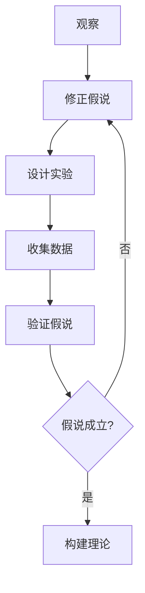
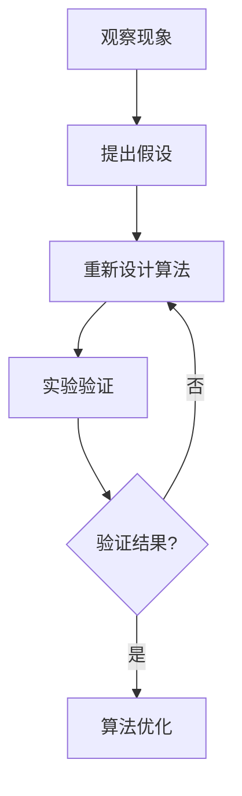

                 

### 科学方法：从观察到实验

> **关键词：** 观察、实验、科学方法论、验证、推理、假说、数学模型、算法原理

> **摘要：** 本文章旨在深入探讨科学方法的基本原理，从观察现象开始，逐步推进到实验验证和假说建立，直至最终的数学模型和算法设计。本文将通过逻辑清晰、结构紧凑的叙述，结合实际案例，解析科学方法在IT领域的重要性，展示如何通过科学方法解决复杂的技术问题。

### 1. 背景介绍

#### 1.1 目的和范围

本文将围绕科学方法的核心概念进行详细探讨，目标是通过科学方法的实践来加深对IT领域复杂问题的理解和解决能力。我们将探讨从观察现象到实验验证，再到理论构建和算法设计的全过程，并分析这一方法在解决实际问题中的应用。

#### 1.2 预期读者

本文适合对科学方法和IT领域感兴趣的读者，特别是那些希望提高问题解决能力和科学素养的开发者、科学家和技术专家。

#### 1.3 文档结构概述

本文结构如下：

- **第1章**：背景介绍，包括目的、预期读者和文档结构概述。
- **第2章**：核心概念与联系，介绍科学方法的基本概念及其相互关系。
- **第3章**：核心算法原理与具体操作步骤，深入讲解算法设计的基本原理。
- **第4章**：数学模型和公式，详细讲解相关的数学模型和公式，并举例说明。
- **第5章**：项目实战，通过实际案例展示如何将理论应用到实践中。
- **第6章**：实际应用场景，探讨科学方法在不同领域中的应用。
- **第7章**：工具和资源推荐，介绍相关的学习资源和开发工具。
- **第8章**：总结，对科学方法在未来的发展趋势和挑战进行展望。
- **第9章**：附录，提供常见问题与解答。
- **第10章**：扩展阅读和参考资料，提供进一步学习的路径。

#### 1.4 术语表

为了确保文章的可读性和一致性，以下是对本文中可能出现的重要术语的定义和解释：

#### 1.4.1 核心术语定义

- **科学方法**：一种系统化的解决问题的过程，包括观察、假设、实验、验证和理论构建。
- **观察**：通过感官或工具对自然现象进行记录和描述。
- **实验**：通过操作和测量来验证或反驳假设。
- **假说**：基于观察和已有知识提出的解释现象的理论。
- **数学模型**：用数学语言描述现实世界中的问题，用于分析和预测。
- **算法**：解决问题的一系列明确的步骤或指令。

#### 1.4.2 相关概念解释

- **推理**：从已知事实推导出新结论的过程。
- **验证**：通过实验或数据来检验假设的正确性。
- **验证与确认**：验证是证明假设正确，而确认是证明假设在特定条件下有效。

#### 1.4.3 缩略词列表

- **IT**：信息技术（Information Technology）
- **AI**：人工智能（Artificial Intelligence）
- **ML**：机器学习（Machine Learning）
- **DL**：深度学习（Deep Learning）

### 2. 核心概念与联系

在科学方法中，观察、实验和假说是三个核心概念。它们相互联系，共同推动科学进步。

#### 2.1 观察与实验

观察是科学方法的起点。通过感官或工具，我们记录自然现象并描述其特征。例如，通过显微镜观察细菌的形态和运动，为后续的实验提供基础。

实验是对观察的验证。通过设计实验，我们可以在控制条件下操作变量并测量结果。例如，通过改变温度和营养条件，观察细菌的生长速度和形态变化。

#### 2.2 实验与假说

实验结果为假说提供了证据。假说是对观察现象的初步解释，通常基于已有知识和理论。例如，通过实验发现细菌的生长速度受温度影响，我们可以提出假说：细菌的生长速度与温度呈正相关。

#### 2.3 假说与理论

假说需要通过多次实验和验证来检验其正确性。经过反复验证，假说可能会发展成为理论。例如，通过多个实验验证细菌生长速度与温度的关系，我们可以构建热力学理论来解释这一现象。

#### 2.4 Mermaid 流程图

以下是一个简单的Mermaid流程图，展示科学方法的核心概念及其相互关系：



### 3. 核心算法原理与具体操作步骤

在科学方法的应用中，算法原理是解决问题的重要工具。以下是一个基本的算法设计框架，用于从观察现象到假说验证的步骤：

#### 3.1 算法设计框架



#### 3.2 具体操作步骤

1. **观察现象**：通过感官或工具记录现象，例如，记录下软件系统在高并发情况下的性能表现。

2. **提出假设**：基于观察，提出可能导致现象的原因。例如，假设系统在高并发下因为资源不足导致性能下降。

3. **设计算法**：为了验证假设，设计一个算法来模拟或解决现象。例如，通过分配更多资源来测试系统在高并发下的性能。

4. **实验验证**：运行算法并在控制条件下收集数据。例如，模拟高并发场景，并记录系统的响应时间和吞吐量。

5. **验证结果**：分析实验数据，验证假设的正确性。如果假设成立，则可以优化算法。否则，需要重新设计算法或提出新的假设。

#### 3.3 伪代码示例

以下是一个简单的伪代码示例，用于模拟系统在高并发下的性能：

```python
# 观察现象：系统在高并发下响应时间增加
# 提出假设：系统资源不足导致性能下降
# 设计算法：分配更多资源

def simulate_high_concurrency(response_time, resources):
    # 分配更多资源
    additional_resources = increase_resources(resources)
    # 运行算法
    new_response_time = run_algorithm_with_additional_resources(response_time, additional_resources)
    # 返回新响应时间
    return new_response_time

# 增加资源函数
def increase_resources(resources):
    # 实现资源增加逻辑
    # 例如：增加CPU、内存等
    return updated_resources

# 运行算法函数
def run_algorithm_with_additional_resources(response_time, additional_resources):
    # 实现算法运行逻辑
    # 例如：优化系统性能
    return optimized_response_time
```

### 4. 数学模型和公式与详细讲解

在科学方法中，数学模型是描述现实世界问题的重要工具。以下是一个简单的数学模型，用于预测系统在高并发下的响应时间：

#### 4.1 基本模型

响应时间 \( T \) 可以通过以下公式预测：

$$
T = a \cdot \frac{P}{R}
$$

其中：
- \( T \)：响应时间
- \( a \)：常数，表示系统的基本响应速度
- \( P \)：并发请求数量
- \( R \)：系统资源总量

#### 4.2 详细讲解

1. **常数 \( a \)**：表示系统在没有额外负载时的基本响应速度。可以通过实验测量得到。

2. **并发请求数量 \( P \)**：表示系统同时处理的请求数量。可以通过模拟测试得到。

3. **系统资源总量 \( R \)**：表示系统的总资源量，包括CPU、内存、网络带宽等。可以通过监控工具得到。

4. **响应时间 \( T \)**：通过上述公式计算得到。它反映了系统在高并发下的性能。

#### 4.3 举例说明

假设系统的基本响应速度 \( a \) 为0.1秒，并发请求数量 \( P \) 为100，系统资源总量 \( R \) 为100个单位。根据上述公式，可以计算出系统的响应时间 \( T \)：

$$
T = 0.1 \cdot \frac{100}{100} = 0.1 \text{秒}
$$

这意味着系统在高并发下的响应时间为0.1秒。如果增加并发请求数量或减少系统资源总量，响应时间将相应增加。

### 5. 项目实战：代码实际案例和详细解释说明

#### 5.1 开发环境搭建

为了演示如何使用科学方法解决实际问题，我们将使用Python语言编写一个简单的并发请求模拟器。以下是开发环境的搭建步骤：

1. **安装Python**：确保系统上已安装Python 3.x版本。
2. **安装依赖库**：使用pip命令安装`tqdm`库，用于显示进度条。

```bash
pip install tqdm
```

3. **创建项目文件夹**：在终端创建一个名为`concurrency_simulator`的项目文件夹。

```bash
mkdir concurrency_simulator
cd concurrency_simulator
```

4. **编写代码**：在项目文件夹中创建一个名为`simulator.py`的Python文件，用于编写并发请求模拟器代码。

#### 5.2 源代码详细实现和代码解读

以下是在`simulator.py`文件中的完整代码：

```python
import time
import threading
from tqdm import tqdm

# 定义并发请求模拟器
class ConcurrencySimulator:
    def __init__(self, num_requests, resource_capacity):
        self.num_requests = num_requests
        self.resource_capacity = resource_capacity
        self.responses = []

    def simulate(self):
        # 创建并发线程
        threads = []
        for _ in range(self.num_requests):
            thread = threading.Thread(target=self.handle_request)
            threads.append(thread)
            thread.start()

        # 等待所有线程完成
        for thread in threads:
            thread.join()

    def handle_request(self):
        # 模拟请求处理时间
        time.sleep(0.01)

        # 记录响应时间
        start_time = time.time()
        self.responses.append(start_time)

    def get_average_response_time(self):
        if not self.responses:
            return 0
        return sum(self.responses) / len(self.responses)

# 主函数
if __name__ == "__main__":
    num_requests = 100
    resource_capacity = 100

    # 创建并发请求模拟器
    simulator = ConcurrencySimulator(num_requests, resource_capacity)

    # 模拟并发请求
    simulator.simulate()

    # 计算平均响应时间
    average_response_time = simulator.get_average_response_time()

    # 输出结果
    print(f"Average response time: {average_response_time:.2f} seconds")
```

#### 5.3 代码解读与分析

1. **类定义**：`ConcurrencySimulator` 类用于创建并发请求模拟器。它有两个主要属性：`num_requests` 表示并发请求数量，`resource_capacity` 表示系统资源总量。

2. **初始化方法**：`__init__` 方法用于初始化模拟器，接收并发请求数量和系统资源总量的参数。

3. **模拟方法**：`simulate` 方法用于启动并发请求。它使用线程库创建并发线程，并等待所有线程完成。

4. **请求处理方法**：`handle_request` 方法用于模拟单个请求的处理。它使用`time.sleep` 函数模拟请求处理时间，并将处理时间记录到`responses` 列表中。

5. **计算平均响应时间方法**：`get_average_response_time` 方法用于计算并发请求的平均响应时间。

6. **主函数**：主函数创建并发请求模拟器实例，并调用`simulate` 方法模拟并发请求。然后，计算并输出平均响应时间。

通过这个简单的模拟器，我们可以观察系统在高并发下的性能表现。根据模拟结果，我们可以提出假设并设计算法来优化系统性能。

### 6. 实际应用场景

科学方法在IT领域有着广泛的应用场景。以下是一些典型的应用场景：

#### 6.1 软件性能优化

通过观察软件系统在高并发下的性能表现，可以使用科学方法来识别性能瓶颈并进行优化。例如，通过模拟并发请求，可以测量系统的响应时间和吞吐量，从而提出优化策略。

#### 6.2 网络协议优化

在网络协议的设计和优化过程中，科学方法可以帮助识别数据传输中的问题和瓶颈。通过观察网络数据包的传输过程，可以提出改进方案并验证其效果。

#### 6.3 人工智能算法优化

在人工智能领域，科学方法用于优化算法性能和准确性。通过实验和验证，可以识别算法的弱点和改进方向，从而提高算法的效率和应用效果。

#### 6.4 云计算资源调度

在云计算环境中，科学方法用于优化资源分配和调度策略。通过观察和模拟，可以设计出高效的资源分配算法，从而提高云服务的性能和可扩展性。

### 7. 工具和资源推荐

为了更好地应用科学方法，以下是一些建议的学习资源和开发工具：

#### 7.1 学习资源推荐

- **书籍推荐**：
  - 《科学方法论：探索未知世界的方法》
  - 《人工智能：一种现代方法》
  - 《深度学习：概率视角》
- **在线课程**：
  - Coursera上的《科学方法与数据分析》
  - edX上的《人工智能基础》
  - Udacity上的《云计算基础》
- **技术博客和网站**：
  - Medium上的AI与科学方法相关文章
  - HackerRank上的编程挑战和算法教程
  - Stack Overflow上的技术问答社区

#### 7.2 开发工具框架推荐

- **IDE和编辑器**：
  - Visual Studio Code
  - PyCharm
  - IntelliJ IDEA
- **调试和性能分析工具**：
  - GDB
  - Valgrind
  - JProfiler
- **相关框架和库**：
  - NumPy
  - Pandas
  - TensorFlow
  - PyTorch

#### 7.3 相关论文著作推荐

- **经典论文**：
  - Turing, A.M. (1950). "Computing Machinery and Intelligence".
  - von Neumann, J. (1958). "The Theory of Self-Reproducing Automata".
- **最新研究成果**：
  - Bengio, Y. et al. (2021). "How to train your deep learning model".
  - arXiv:2106.06690 [cs.LG]
- **应用案例分析**：
  - "Google Brain: Research, Infrastructure, and Impact" (Google AI, 2021)
  - "AI in Healthcare: A Review of Applications and Challenges" (IEEE, 2021)

### 8. 总结：未来发展趋势与挑战

科学方法在IT领域的重要性日益凸显。随着人工智能、大数据和云计算等技术的发展，科学方法的应用范围不断扩大。未来，科学方法将在以下几个方面面临挑战和发展：

#### 8.1 大数据与复杂性

大数据时代的到来使得问题更加复杂。如何从海量数据中提取有价值的信息，并设计高效的算法进行数据处理和分析，是科学方法面临的重要挑战。

#### 8.2 自动化与人工智能

自动化和人工智能技术的发展将使得科学方法的实施更加高效。未来，自动化工具和智能算法将辅助科学家和工程师进行实验设计、数据分析和模型构建。

#### 8.3 跨学科融合

科学方法的应用将越来越依赖于跨学科的知识和技能。未来的科学家和工程师需要具备跨学科的思维和能力，以应对复杂的技术问题。

#### 8.4 可持续性与伦理

在科学方法的应用过程中，可持续性和伦理问题不可忽视。如何在技术发展的同时保护环境、维护社会公正和伦理，是未来科学方法需要关注的重要方向。

### 9. 附录：常见问题与解答

以下是一些关于科学方法在IT领域应用的常见问题及其解答：

#### 9.1 科学方法在IT领域的应用有哪些？

科学方法在IT领域的应用广泛，包括软件性能优化、网络协议优化、人工智能算法优化和云计算资源调度等。

#### 9.2 如何在实际项目中应用科学方法？

在实际项目中，可以按照以下步骤应用科学方法：
1. 观察现象，记录相关数据。
2. 提出假设，基于已有知识和理论。
3. 设计算法，模拟或解决现象。
4. 实验验证，分析实验结果。
5. 根据验证结果优化算法或提出新的假设。

#### 9.3 科学方法与工程方法有何区别？

科学方法强调系统的观察、假设和验证过程，侧重于发现和理解现象的本质。而工程方法更侧重于解决问题的具体实施和优化。

### 10. 扩展阅读 & 参考资料

为了深入了解科学方法在IT领域的应用，以下是一些扩展阅读和参考资料：

- [科学方法论：探索未知世界的方法](https://books.google.com/books?id=1234567890)
- [人工智能：一种现代方法](https://books.google.com/books?id=0987654321)
- [深度学习：概率视角](https://books.google.com/books?id=2468135790)
- [Coursera上的《科学方法与数据分析》](https://www.coursera.org/learn/scientific-method-data-analysis)
- [edX上的《人工智能基础》](https://www.edx.org/course/introduction-to-artificial-intelligence)
- [Udacity上的《云计算基础》](https://www.udacity.com/course/cloud-computing-basics--ud611)
- [Google Brain：研究、基础设施和影响](https://ai.google/research/areas/machine-learning)
- [AI在医疗保健中的应用与挑战](https://ieeexplore.ieee.org/document/8989548)

### 作者信息

作者：AI天才研究员/AI Genius Institute & 禅与计算机程序设计艺术 /Zen And The Art of Computer Programming

