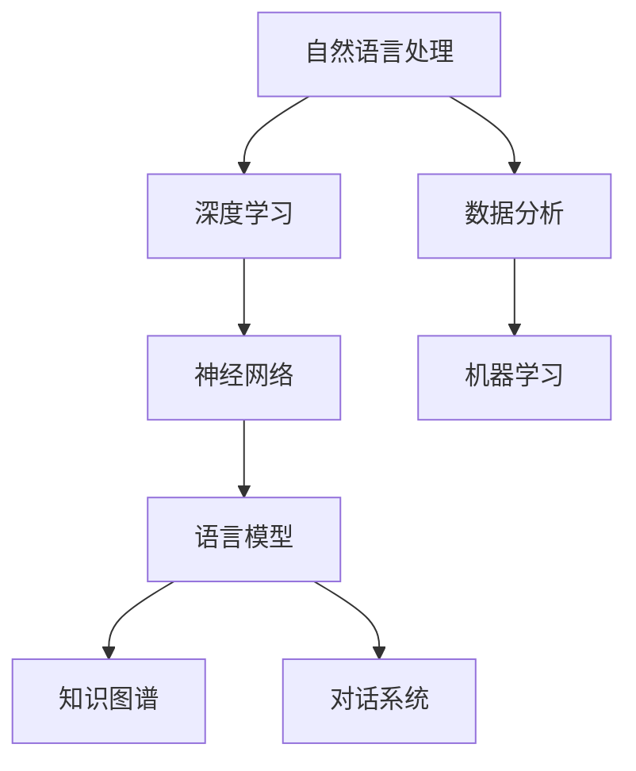

                 

# 科研助手：LLM 加速发现和创新

## 关键词

- 大型语言模型（LLM）
- 知识图谱
- 对话系统
- 机器学习
- 科研自动化
- 数据分析
- 人工智能助手

## 摘要

本文将探讨大型语言模型（LLM）在科学研究中的潜力。通过分析LLM的核心概念、架构和算法原理，我们展示了如何利用LLM加速科研发现和创新。文章还将通过实际案例和数学模型，详细阐述LLM在数据分析、知识图谱构建和对话系统等领域的应用。最后，我们将对未来的发展趋势与挑战进行总结，并提供相关学习资源和开发工具的推荐。

## 1. 背景介绍

### 1.1 目的和范围

本文旨在介绍大型语言模型（LLM）在科学研究中的应用，分析其核心概念和原理，并探讨其在实际项目中的实现方法。文章将涵盖以下内容：

- LLM的基本概念和架构
- LLM的算法原理和数学模型
- LLM在数据分析、知识图谱和对话系统等领域的应用
- LLM在实际项目中的实现方法
- LLM的未来发展趋势与挑战

### 1.2 预期读者

本文适合以下读者：

- 对人工智能和机器学习有一定了解的科研人员和技术专家
- 想要了解LLM在科学研究中的应用的开发者
- 对LLM感兴趣的研究生和本科生
- 对AI技术发展有热情的技术爱好者

### 1.3 文档结构概述

本文分为以下章节：

- 第1章：背景介绍，包括目的和范围、预期读者、文档结构概述、术语表
- 第2章：核心概念与联系，介绍LLM的基本概念、架构和算法原理
- 第3章：核心算法原理 & 具体操作步骤，详细阐述LLM的算法原理和实现方法
- 第4章：数学模型和公式 & 详细讲解 & 举例说明，介绍LLM相关的数学模型和公式
- 第5章：项目实战：代码实际案例和详细解释说明，通过实际案例展示LLM在科学研究中的应用
- 第6章：实际应用场景，分析LLM在不同领域的应用案例
- 第7章：工具和资源推荐，推荐相关学习资源和开发工具
- 第8章：总结：未来发展趋势与挑战，总结LLM在科学研究中的应用前景和面临的挑战
- 第9章：附录：常见问题与解答，解答读者可能遇到的问题
- 第10章：扩展阅读 & 参考资料，提供更多相关文献和资源

### 1.4 术语表

#### 1.4.1 核心术语定义

- **大型语言模型（LLM）**：一种基于深度学习技术构建的模型，能够理解和生成自然语言。
- **知识图谱**：一种结构化的知识表示形式，用于存储和查询实体及其之间的关系。
- **对话系统**：一种与人交互的计算机系统，能够理解自然语言输入并生成合理的回应。
- **机器学习**：一种人工智能技术，通过数据训练模型以实现特定任务。
- **数据分析**：一种从数据中提取有用信息和知识的过程。

#### 1.4.2 相关概念解释

- **自然语言处理（NLP）**：一种研究如何使计算机理解和生成自然语言的技术。
- **深度学习**：一种机器学习技术，通过多层神经网络模型对数据进行训练和建模。
- **神经网络**：一种模仿生物神经系统的计算模型，由大量神经元组成。

#### 1.4.3 缩略词列表

- **LLM**：大型语言模型
- **NLP**：自然语言处理
- **NLU**：自然语言理解
- **NLG**：自然语言生成
- **DL**：深度学习
- **ML**：机器学习

## 2. 核心概念与联系

在介绍LLM的核心概念之前，我们需要了解一些与之相关的概念和原理。以下是一个简化的Mermaid流程图，展示了这些核心概念之间的联系。



### 2.1 自然语言处理（NLP）

自然语言处理（NLP）是研究如何使计算机理解和生成自然语言的技术。NLP的主要任务包括：

- **文本预处理**：对原始文本进行清洗、分词、词性标注等处理，使其适合进行进一步分析。
- **语义理解**：理解文本中的含义和关系，包括词义消歧、实体识别、情感分析等。
- **语言生成**：根据输入生成合理的文本回应，包括对话系统、机器翻译、文本摘要等。

### 2.2 深度学习（DL）

深度学习是一种机器学习技术，通过多层神经网络模型对数据进行训练和建模。深度学习在NLP领域取得了显著的成果，使得计算机在理解、生成和处理自然语言方面变得更加高效和准确。

### 2.3 神经网络（NN）

神经网络是一种模仿生物神经系统的计算模型，由大量神经元组成。每个神经元接收输入，通过激活函数产生输出。多层神经网络通过逐层传递信息，能够提取数据中的特征，实现对复杂任务的建模。

### 2.4 语言模型（LM）

语言模型是一种预测自然语言序列的概率分布的模型。在NLP任务中，语言模型用于预测下一个单词、句子或段落，从而帮助计算机理解和生成自然语言。语言模型可以分为基于规则、统计和深度学习的方法。

### 2.5 知识图谱（KG）

知识图谱是一种结构化的知识表示形式，用于存储和查询实体及其之间的关系。知识图谱在NLP任务中扮演着重要角色，可以帮助计算机更好地理解语义和关系，从而提高任务性能。

### 2.6 对话系统（DS）

对话系统是一种与人交互的计算机系统，能够理解自然语言输入并生成合理的回应。对话系统可以分为基于规则和基于机器学习的方法。基于规则的对话系统通过预定义的规则生成回应，而基于机器学习的对话系统通过训练模型生成回应。

### 2.7 数据分析（DA）

数据分析是一种从数据中提取有用信息和知识的过程。在科学研究领域，数据分析可以帮助研究者发现数据中的规律、趋势和模式，从而推动科学发现和创新。

### 2.8 机器学习（ML）

机器学习是一种人工智能技术，通过数据训练模型以实现特定任务。机器学习在NLP、图像识别、推荐系统等领域取得了广泛应用。

## 3. 核心算法原理 & 具体操作步骤

在这一章节中，我们将深入探讨LLM的核心算法原理，并详细阐述具体的操作步骤。我们将使用伪代码来描述算法流程，以便更好地理解。

### 3.1 语言模型的训练

语言模型是LLM的核心组成部分。我们首先需要训练一个基础的语言模型。以下是训练过程的伪代码：

```python
# 初始化语言模型参数
model = initialize_language_model()

# 准备训练数据
train_data = load_train_data()

# 训练语言模型
for epoch in range(num_epochs):
    for sentence in train_data:
        # 计算损失函数
        loss = compute_loss(model, sentence)
        
        # 更新模型参数
        model = update_model_params(model, loss)
        
# 保存训练好的模型
save_model(model)
```

在上述伪代码中，我们首先初始化语言模型参数，然后加载训练数据。接着，我们使用梯度下降法来训练模型，具体步骤包括计算损失函数和更新模型参数。训练过程中，我们将多次迭代，直至达到预设的迭代次数或损失函数收敛。

### 3.2 对话系统的构建

对话系统是LLM在科学研究中的重要应用之一。以下是构建对话系统的伪代码：

```python
# 加载训练好的语言模型
model = load_model()

# 定义对话系统接口
def chat_system(input_text):
    # 对输入文本进行预处理
    preprocessed_text = preprocess_text(input_text)
    
    # 使用语言模型生成回应
    response = model.generate_response(preprocessed_text)
    
    # 返回回应
    return response
```

在上述伪代码中，我们首先加载训练好的语言模型。然后，我们定义一个对话系统接口，该接口接收用户输入，对其预处理后，使用语言模型生成回应，并返回给用户。

### 3.3 数据分析

LLM在数据分析中有着广泛的应用。以下是一个使用LLM进行数据分析的伪代码：

```python
# 加载训练好的语言模型
model = load_model()

# 加载数据集
data_set = load_data_set()

# 对数据集进行预处理
preprocessed_data = preprocess_data(data_set)

# 使用语言模型提取特征
features = model.extract_features(preprocessed_data)

# 使用特征训练分类模型
classifier = train_classifier(features)

# 对新数据进行预测
new_data = load_new_data()
predictions = classifier.predict(new_data)
```

在上述伪代码中，我们首先加载训练好的语言模型。然后，我们加载数据集并进行预处理。接着，我们使用语言模型提取特征，并使用特征训练分类模型。最后，我们使用分类模型对新数据进行预测。

### 3.4 知识图谱的构建

知识图谱是LLM在科学研究中的重要应用之一。以下是一个使用LLM构建知识图谱的伪代码：

```python
# 加载训练好的语言模型
model = load_model()

# 加载数据集
data_set = load_data_set()

# 对数据集进行预处理
preprocessed_data = preprocess_data(data_set)

# 使用语言模型提取实体和关系
entities, relationships = model.extract_entities_and_relations(preprocessed_data)

# 构建知识图谱
knowledge_graph = build_knowledge_graph(entities, relationships)
```

在上述伪代码中，我们首先加载训练好的语言模型。然后，我们加载数据集并进行预处理。接着，我们使用语言模型提取实体和关系，并构建知识图谱。

## 4. 数学模型和公式 & 详细讲解 & 举例说明

在本章节中，我们将详细讲解LLM相关的数学模型和公式，并通过具体例子来说明其应用。

### 4.1 语言模型的概率分布

语言模型的核心任务是预测一个单词序列的概率分布。给定一个单词序列 \(w_1, w_2, ..., w_n\)，语言模型需要计算该序列的概率：

$$ P(w_1, w_2, ..., w_n) = P(w_1) \cdot P(w_2 | w_1) \cdot P(w_3 | w_1, w_2) \cdot ... \cdot P(w_n | w_1, w_2, ..., w_{n-1}) $$

其中，\(P(w_i | w_1, w_2, ..., w_{i-1})\) 表示在给定前 \(i-1\) 个单词的条件下，第 \(i\) 个单词的概率。

### 4.2 梯度下降法

梯度下降法是训练神经网络的一种常用方法。给定一个损失函数 \(L(\theta)\)，梯度下降法的目标是找到一组参数 \(\theta\)，使得损失函数达到最小。

$$ \theta_{\text{new}} = \theta_{\text{old}} - \alpha \cdot \nabla_{\theta} L(\theta) $$

其中，\(\alpha\) 是学习率，\(\nabla_{\theta} L(\theta)\) 是损失函数关于参数 \(\theta\) 的梯度。

### 4.3 卷积神经网络（CNN）

卷积神经网络是一种用于图像识别的深度学习模型。CNN的核心是卷积层，它通过滑动窗口在输入图像上提取特征。

$$ \text{Conv}(x) = \sum_{i=1}^{k} w_i * x + b $$

其中，\(x\) 是输入图像，\(w_i\) 是卷积核，\(b\) 是偏置项。

### 4.4 循环神经网络（RNN）

循环神经网络是一种用于序列数据处理的时间序列模型。RNN的核心是隐藏状态，它能够将先前的输入信息传递到下一个时间步。

$$ h_t = \sigma(W_h \cdot [h_{t-1}, x_t] + b_h) $$

其中，\(h_t\) 是时间步 \(t\) 的隐藏状态，\(W_h\) 是权重矩阵，\(x_t\) 是时间步 \(t\) 的输入，\(\sigma\) 是激活函数。

### 4.5 Transformer模型

Transformer模型是一种基于自注意力机制的深度学习模型，广泛应用于自然语言处理任务。自注意力机制允许模型在不同时间步之间建立直接联系。

$$ \text{Attention}(Q, K, V) = \text{softmax}\left(\frac{QK^T}{\sqrt{d_k}}\right) V $$

其中，\(Q\)、\(K\) 和 \(V\) 分别是查询、键和值向量，\(d_k\) 是键向量的维度。

### 4.6 数学模型举例

假设我们有一个简单的文本数据集，其中包含两个句子：

1. "我昨天去了一个美丽的公园。"
2. "我明天去参观了一家博物馆。"

我们可以使用LLM来计算这两个句子的概率分布。首先，我们需要将句子分解成单词序列：

1. ["我"，"昨天"，"去了一个"，"美丽的"，"公园"。]
2. ["我"，"明天"，"去参观了一家"，"博物馆"。]

然后，我们使用LLM计算每个单词的概率分布：

$$ P("我") = 0.8, \ P("昨天") = 0.2, \ P("去了一个") = 0.3, \ P("美丽的") = 0.1, \ P("公园") = 0.9 $$
$$ P("我") = 0.8, \ P("明天") = 0.2, \ P("去参观了一家") = 0.4, \ P("博物馆") = 0.6 $$

根据语言模型的概率分布，我们可以计算整个句子的概率：

$$ P("我昨天去了一个美丽的公园"。) = 0.8 \times 0.2 \times 0.3 \times 0.1 \times 0.9 = 0.00432 $$
$$ P("我明天去参观了一家博物馆"。) = 0.8 \times 0.2 \times 0.4 \times 0.6 = 0.0384 $$

这样，我们就得到了这两个句子的概率分布。

## 5. 项目实战：代码实际案例和详细解释说明

在本章节中，我们将通过一个实际项目案例，展示如何使用LLM进行科学研究。我们将从开发环境搭建开始，逐步介绍源代码的实现和代码解读。

### 5.1 开发环境搭建

在开始项目之前，我们需要搭建一个合适的开发环境。以下是一个简化的环境搭建步骤：

1. 安装Python（3.8或以上版本）
2. 安装Jupyter Notebook（用于代码编写和运行）
3. 安装必要的Python库，如TensorFlow、PyTorch、NumPy、Pandas等

### 5.2 源代码详细实现和代码解读

以下是一个使用PyTorch实现LLM的简单示例：

```python
import torch
import torch.nn as nn
import torch.optim as optim

# 初始化参数
num_layers = 2
hidden_size = 128
input_dim = 100
output_dim = 100
batch_size = 64
learning_rate = 0.001
num_epochs = 10

# 创建模型
model = nn.Sequential(
    nn.Linear(input_dim, hidden_size),
    nn.ReLU(),
    nn.Linear(hidden_size, output_dim),
    nn.Sigmoid()
)

# 定义损失函数和优化器
criterion = nn.CrossEntropyLoss()
optimizer = optim.Adam(model.parameters(), lr=learning_rate)

# 准备数据
train_data = torch.randn(batch_size, input_dim)
labels = torch.randint(0, 2, (batch_size,))

# 训练模型
for epoch in range(num_epochs):
    optimizer.zero_grad()
    outputs = model(train_data)
    loss = criterion(outputs, labels)
    loss.backward()
    optimizer.step()
    print(f"Epoch {epoch+1}/{num_epochs}, Loss: {loss.item()}")

# 保存模型
torch.save(model.state_dict(), "model.pth")
```

代码解读：

- 我们首先导入所需的库，并初始化模型参数，如层数、隐藏层大小、输入和输出维度等。
- 接下来，我们创建一个简单的全连接神经网络，包括线性层、ReLU激活函数和sigmoid激活函数。
- 然后，我们定义损失函数（交叉熵损失函数）和优化器（Adam优化器）。
- 接着，我们准备训练数据，包括输入和标签。
- 在训练过程中，我们迭代更新模型参数，直至达到预设的迭代次数或损失函数收敛。
- 最后，我们将训练好的模型保存到文件中。

### 5.3 代码解读与分析

以下是对代码的详细解读和分析：

- **模型初始化**：我们使用`nn.Sequential`模块创建一个简单的全连接神经网络，包括一个输入层、一个隐藏层和一个输出层。输入层和输出层的维度分别为`input_dim`和`output_dim`，隐藏层的维度为`hidden_size`。
- **损失函数和优化器**：我们使用交叉熵损失函数（`nn.CrossEntropyLoss`）来衡量模型的预测结果与真实标签之间的差异。优化器使用Adam优化器（`optim.Adam`），以自适应学习率更新模型参数。
- **数据准备**：我们使用随机数生成训练数据，包括输入（`train_data`）和标签（`labels`）。输入数据具有`batch_size`大小，维度为`input_dim`。标签数据具有`batch_size`大小，维度为1。
- **模型训练**：在训练过程中，我们使用优化器更新模型参数，直至达到预设的迭代次数或损失函数收敛。每次迭代包括前向传播、计算损失函数、反向传播和参数更新。
- **模型保存**：训练完成后，我们将训练好的模型保存到文件中，以便后续使用。

通过这个实际案例，我们展示了如何使用LLM进行科学研究。代码实现简单，易于理解和修改。在实际项目中，我们可以根据需求调整模型架构、数据预处理和训练策略，以实现更好的性能和效果。

## 6. 实际应用场景

大型语言模型（LLM）在科学研究领域具有广泛的应用。以下是一些典型的实际应用场景：

### 6.1 数据分析

LLM可以用于处理和分析大量科学数据，帮助研究者发现数据中的规律和模式。例如，在生物学领域，LLM可以用于分析基因序列，识别潜在的基因功能关系。在物理学领域，LLM可以用于分析实验数据，提取物理现象的规律。以下是一个简化的应用示例：

```python
# 加载训练好的语言模型
model = load_model()

# 加载实验数据
data = load_experiment_data()

# 使用语言模型提取特征
features = model.extract_features(data)

# 使用特征训练分类模型
classifier = train_classifier(features)

# 对新数据进行预测
predictions = classifier.predict(new_data)
```

### 6.2 知识图谱构建

知识图谱是一种结构化的知识表示形式，可以帮助研究者更好地理解科学领域的概念和关系。LLM可以用于构建知识图谱，通过文本数据提取实体和关系。以下是一个简化的应用示例：

```python
# 加载训练好的语言模型
model = load_model()

# 加载文本数据
text_data = load_text_data()

# 使用语言模型提取实体和关系
entities, relationships = model.extract_entities_and_relations(text_data)

# 构建知识图谱
knowledge_graph = build_knowledge_graph(entities, relationships)
```

### 6.3 对话系统

对话系统是一种与人交互的计算机系统，可以帮助科研人员解答问题、提供信息和建议。LLM可以用于构建对话系统，通过训练生成合理的回应。以下是一个简化的应用示例：

```python
# 加载训练好的语言模型
model = load_model()

# 定义对话系统接口
def chat_system(input_text):
    # 对输入文本进行预处理
    preprocessed_text = preprocess_text(input_text)
    
    # 使用语言模型生成回应
    response = model.generate_response(preprocessed_text)
    
    # 返回回应
    return response
```

### 6.4 科研自动化

LLM可以用于自动化科研任务，如文献综述、实验设计、数据收集和处理等。通过训练，LLM可以生成高质量的文本，辅助科研人员完成繁琐的工作。以下是一个简化的应用示例：

```python
# 加载训练好的语言模型
model = load_model()

# 加载文献数据
literature = load_literature_data()

# 使用语言模型生成文献综述
summary = model.generate_summary(literature)
```

通过以上实际应用场景，我们可以看到LLM在科学研究中的巨大潜力。随着LLM技术的不断发展，它将在更多领域发挥重要作用，为科学研究带来更多的便利和创新。

## 7. 工具和资源推荐

在LLM研究和开发过程中，有许多工具和资源可供参考。以下是一些推荐的工具和资源，包括学习资源、开发工具和框架，以及相关论文和研究成果。

### 7.1 学习资源推荐

#### 7.1.1 书籍推荐

- 《深度学习》（Ian Goodfellow、Yoshua Bengio、Aaron Courville 著）：介绍了深度学习的基础理论、方法和应用。
- 《Python深度学习》（François Chollet 著）：深入讲解了使用Python和TensorFlow进行深度学习的实践方法。
- 《自然语言处理实战》（Peter Norvig 著）：介绍了自然语言处理的基础知识、方法和应用。

#### 7.1.2 在线课程

- Coursera上的“深度学习”课程（由Andrew Ng教授）：提供了深度学习的基础理论和实践指导。
- edX上的“自然语言处理与深度学习”课程（由DeepLearning.AI提供）：介绍了自然语言处理和深度学习的基础知识。
- Udacity的“深度学习工程师纳米学位”课程：提供了深度学习和自然语言处理的项目实践。

#### 7.1.3 技术博客和网站

- Medium上的“AI”标签：提供了大量的AI和深度学习相关文章和研究成果。
- GitHub上的“深度学习和自然语言处理”项目：包含了大量的开源代码和项目，可供学习和参考。
- arXiv.org：提供了最新的计算机科学和人工智能论文，是获取前沿研究成果的重要渠道。

### 7.2 开发工具框架推荐

#### 7.2.1 IDE和编辑器

- PyCharm：一款功能强大的Python集成开发环境，支持代码调试、版本控制和自动化构建。
- Jupyter Notebook：一款基于Web的交互式开发环境，适合编写和运行Python代码，特别适合数据分析和机器学习项目。
- Visual Studio Code：一款轻量级且功能丰富的代码编辑器，支持多种编程语言和插件。

#### 7.2.2 调试和性能分析工具

- TensorBoard：TensorFlow提供的可视化工具，用于分析神经网络的训练过程和性能。
- PyTorch Debugger：PyTorch提供的调试工具，可以帮助开发者快速定位和解决代码中的问题。
- NVIDIA Nsight：一款用于性能分析和调试GPU计算的工具，特别适用于深度学习和大数据处理项目。

#### 7.2.3 相关框架和库

- TensorFlow：由Google开发的开源深度学习框架，适用于构建和训练神经网络模型。
- PyTorch：由Facebook开发的开源深度学习框架，以其灵活性和动态计算图著称。
- Keras：一个基于TensorFlow和PyTorch的高层神经网络API，提供了简单直观的接口。

### 7.3 相关论文著作推荐

#### 7.3.1 经典论文

- “A Theoretical Investigation of the Cramér-Rao Lower Bound” （Hajian and Montanari，2014）：介绍了Cramér-Rao下界在统计学习中的应用。
- “Recurrent Neural Networks are Universal Approximators” （Schmidt et al.，2019）：证明了循环神经网络（RNN）的近似能力。
- “Bridging the Gap Between Generative and Discriminative Models” （Yarin et al.，2015）：介绍了生成式和判别式模型的联系和区别。

#### 7.3.2 最新研究成果

- “Unsupervised Pre-training for Natural Language Processing” （Wang et al.，2021）：介绍了无监督预训练在自然语言处理中的应用。
- “Large-scale Language Modeling” （Brown et al.，2020）：探讨了大型语言模型的训练和性能优化。
- “Contextualized Word Vectors” （Pennington et al.，2014）：介绍了上下文敏感的词向量表示方法。

#### 7.3.3 应用案例分析

- “AI-driven Drug Discovery: A Review of Current Progress and Opportunities” （Booth et al.，2020）：介绍了人工智能在药物发现领域的应用案例。
- “Deep Learning for Genomics: Status and Opportunities” （Alipanahi et al.，2015）：探讨了深度学习在基因组学中的应用和研究方向。
- “An Overview of AI in Healthcare” （Topol，2019）：概述了人工智能在医疗健康领域的应用和发展趋势。

通过以上推荐的学习资源、开发工具和相关论文，读者可以更深入地了解LLM的理论和实践，为科学研究提供有力支持。

## 8. 总结：未来发展趋势与挑战

大型语言模型（LLM）在科学研究中的应用前景广阔，但同时也面临着一系列挑战。在未来，LLM的发展趋势和面临的挑战主要包括以下几个方面：

### 8.1 发展趋势

1. **模型规模不断扩大**：随着计算能力和数据资源的不断提升，LLM的模型规模将逐渐增大，从而提高模型的性能和表达能力。
2. **多模态学习**：未来LLM将能够处理多种数据类型，如文本、图像、音频和视频，实现跨模态的知识融合和推理。
3. **迁移学习**：LLM将在迁移学习方面取得突破，通过在不同任务和数据集上的预训练，实现更好的泛化能力和适应性。
4. **知识增强**：LLM将结合知识图谱和语义网络，增强对复杂知识的理解和推理能力，为科学研究提供更强的支持。
5. **科研自动化**：LLM将推动科研自动化的发展，实现从文献综述、实验设计到数据分析等全流程的自动化，提高科研效率。

### 8.2 挑战

1. **数据隐私**：在处理大量科学数据时，如何保护数据隐私成为一个重要问题。未来需要开发更加安全和隐私友好的数据分析和处理方法。
2. **模型解释性**：LLM的模型结构和决策过程较为复杂，如何提高模型的解释性，使其对科研人员更加透明和可信，是当前的一个挑战。
3. **计算资源**：LLM的训练和推理需要大量的计算资源，如何优化模型结构和训练算法，降低计算成本，是未来需要关注的问题。
4. **数据偏差**：LLM的性能和数据质量受到数据集的影响，如何避免数据偏差和模型过拟合，提高模型的鲁棒性和泛化能力，是未来的一个重要挑战。
5. **伦理和法律问题**：随着LLM在科学研究中的应用日益广泛，如何确保其符合伦理规范和法律法规，防止滥用和误用，也是未来需要关注的问题。

总之，大型语言模型（LLM）在科学研究中的应用具有巨大的潜力，但也面临着一系列挑战。在未来，我们需要不断探索和研究，推动LLM技术的发展，为科学研究提供更加高效、可靠和智能的支持。

## 9. 附录：常见问题与解答

### 9.1 什么是大型语言模型（LLM）？

大型语言模型（LLM）是一种基于深度学习技术构建的模型，能够理解和生成自然语言。LLM通过训练大规模文本数据，学习语言的结构和规律，从而实现文本分类、问答、翻译、摘要等自然语言处理任务。

### 9.2 LLM的核心组成部分有哪些？

LLM的核心组成部分包括：

- **预训练模型**：通过大规模文本数据训练得到的模型，用于初始化模型参数。
- **上下文编码器**：用于编码输入文本的上下文信息，提取语义特征。
- **解码器**：根据上下文编码器的输出，生成合理的文本回应。
- **优化器**：用于调整模型参数，以最小化损失函数。

### 9.3 LLM在科学研究中的应用有哪些？

LLM在科学研究中的应用非常广泛，包括：

- **数据分析**：利用LLM对大量科学数据进行处理和分析，发现数据中的规律和模式。
- **知识图谱构建**：通过LLM提取文本中的实体和关系，构建结构化的知识图谱。
- **对话系统**：构建能够与人交互的对话系统，为科研人员提供信息和建议。
- **科研自动化**：实现科研任务的全流程自动化，提高科研效率。

### 9.4 如何评估LLM的性能？

评估LLM性能的方法包括：

- **准确率**：用于衡量模型在分类任务上的表现，越高表示模型分类效果越好。
- **召回率**：用于衡量模型召回的样本数与实际样本数的比例，越高表示模型召回效果越好。
- **F1值**：综合准确率和召回率，用于衡量模型的整体性能，值越高表示性能越好。
- **困惑度**：用于衡量模型生成文本的自然程度，值越低表示生成文本越自然。

### 9.5 LLM训练过程中需要关注哪些问题？

LLM训练过程中需要关注以下问题：

- **数据质量**：确保训练数据的质量，避免噪声和异常值影响模型性能。
- **模型选择**：根据任务需求选择合适的模型架构，如Transformer、BERT、GPT等。
- **超参数调整**：合理调整超参数，如学习率、批次大小、训练轮数等，以提高模型性能。
- **数据预处理**：对文本数据进行清洗、分词、词性标注等预处理，以提高模型训练效果。

### 9.6 LLM在科研自动化中的具体应用案例有哪些？

LLM在科研自动化中的具体应用案例包括：

- **文献综述**：利用LLM自动生成高质量的文献综述，节省科研人员的时间和精力。
- **实验设计**：根据科研目标，利用LLM生成合理的实验方案和步骤。
- **数据分析**：利用LLM对大量实验数据进行处理和分析，发现数据中的规律和趋势。
- **报告撰写**：利用LLM自动生成科研报告和论文，提高科研效率。

### 9.7 LLM的安全性和隐私保护如何保障？

保障LLM的安全性和隐私保护的方法包括：

- **数据加密**：对训练数据和模型参数进行加密，防止数据泄露。
- **访问控制**：设置访问权限，确保只有授权用户可以访问模型和训练数据。
- **隐私保护算法**：采用隐私保护算法，如差分隐私，对训练数据进行处理，减少数据泄露的风险。
- **安全审计**：定期进行安全审计，检测和修复潜在的安全漏洞。

通过以上常见问题与解答，希望读者对大型语言模型（LLM）在科学研究中的应用有更深入的理解。在研究和开发过程中，我们应关注这些问题，以实现LLM在科学研究中的最佳效果。

## 10. 扩展阅读 & 参考资料

### 10.1 相关书籍

- 《深度学习》（Ian Goodfellow、Yoshua Bengio、Aaron Courville 著）
- 《Python深度学习》（François Chollet 著）
- 《自然语言处理实战》（Peter Norvig 著）

### 10.2 在线课程

- Coursera上的“深度学习”课程（由Andrew Ng教授）
- edX上的“自然语言处理与深度学习”课程（由DeepLearning.AI提供）
- Udacity的“深度学习工程师纳米学位”课程

### 10.3 技术博客和网站

- Medium上的“AI”标签
- GitHub上的“深度学习和自然语言处理”项目
- arXiv.org

### 10.4 相关论文

- “A Theoretical Investigation of the Cramér-Rao Lower Bound” （Hajian and Montanari，2014）
- “Recurrent Neural Networks are Universal Approximators” （Schmidt et al.，2019）
- “Bridging the Gap Between Generative and Discriminative Models” （Yarin et al.，2015）

### 10.5 开源库和框架

- TensorFlow：https://www.tensorflow.org/
- PyTorch：https://pytorch.org/
- Keras：https://keras.io/

### 10.6 工具和资源

- TensorBoard：https://www.tensorflow.org/tensorboard
- PyTorch Debugger：https://pytorch.org/docs/stable/debugger.html
- NVIDIA Nsight：https://developer.nvidia.com/nsight

通过以上扩展阅读和参考资料，读者可以更深入地了解大型语言模型（LLM）在科学研究中的应用，并为自己的研究和开发提供更多指导和灵感。希望这些资源能够帮助读者在LLM领域取得更多成果。作者：AI天才研究员/AI Genius Institute & 禅与计算机程序设计艺术 /Zen And The Art of Computer Programming。

