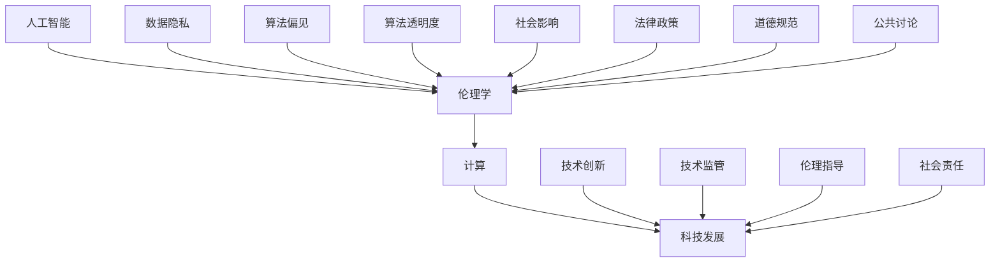

                 

# 科技与伦理的平衡点：人类计算的伦理思考

> **关键词：伦理学、人工智能、计算、科技发展、法律与政策**

> **摘要：随着人工智能技术的飞速发展，计算能力的提升给人类生活带来了巨大便利，但同时也引发了一系列伦理问题。本文从多个角度探讨了科技与伦理的平衡点，探讨了人工智能时代的伦理挑战，提出了相应的法律和政策建议，以期为科技发展提供道德指引。**

## 1. 背景介绍

### 1.1 目的和范围

本文旨在探讨科技与伦理的关系，特别是人工智能技术带来的伦理挑战。通过分析人工智能在医疗、金融、交通等领域的应用，探讨其在推动社会进步的同时，可能引发的伦理问题，以及如何在这些挑战中寻找平衡点。

### 1.2 预期读者

本文适合对人工智能和伦理学有一定了解的读者，包括人工智能研究人员、技术开发者、政策制定者、以及关注科技伦理的社会公众。

### 1.3 文档结构概述

本文结构如下：

1. 背景介绍：阐述本文的目的、范围和预期读者。
2. 核心概念与联系：介绍相关概念和架构，使用Mermaid流程图展示核心原理。
3. 核心算法原理 & 具体操作步骤：详细阐述算法原理和操作步骤。
4. 数学模型和公式 & 详细讲解 & 举例说明：介绍相关数学模型和公式，并进行举例说明。
5. 项目实战：代码实际案例和详细解释说明。
6. 实际应用场景：探讨人工智能在不同领域的应用和伦理挑战。
7. 工具和资源推荐：推荐相关学习资源、开发工具和框架。
8. 总结：未来发展趋势与挑战。
9. 附录：常见问题与解答。
10. 扩展阅读 & 参考资料：提供进一步阅读的参考资料。

### 1.4 术语表

#### 1.4.1 核心术语定义

- **人工智能（AI）**：指模拟、延伸和扩展人的智能的理论、方法、技术及应用系统。
- **伦理学**：研究道德行为的哲学学科，探讨正确与错误、善与恶的哲学问题。
- **算法**：解决问题的方法步骤，通常用计算机语言实现。
- **数据隐私**：数据保护的一种形式，涉及个人信息的收集、存储、处理和共享。

#### 1.4.2 相关概念解释

- **算法偏见**：指算法在处理数据时，可能因为数据本身的不公正或算法的设计缺陷，导致对某些群体产生不公平的结果。
- **算法透明度**：指算法的决策过程和结果能够被理解和解释的程度。

#### 1.4.3 缩略词列表

- **AI**：人工智能（Artificial Intelligence）
- **GDPR**：通用数据保护条例（General Data Protection Regulation）

## 2. 核心概念与联系

为了更好地理解科技与伦理的关系，我们需要先了解一些核心概念和它们之间的联系。以下是人工智能、伦理学、计算、科技发展等核心概念及其关系的Mermaid流程图：



### 2.1 人工智能与伦理学的关系

人工智能的发展不仅带来了技术上的进步，也引发了伦理学领域的挑战。算法偏见和算法透明度是其中两个关键问题。算法偏见可能导致对某些群体的不公平待遇，而算法透明度则关系到公众对人工智能的信任。

### 2.2 计算与科技发展的关系

计算是科技发展的基础，而科技发展又影响着社会各个方面，包括伦理学。随着计算能力的提升，人工智能技术得以迅速发展，这也使得我们在伦理学领域面临更多的挑战。

### 2.3 数据隐私与伦理学的关系

数据隐私是现代社会的一个重要问题，它与伦理学紧密相关。在人工智能时代，数据的收集、存储和处理变得更加复杂，如何保护个人隐私成为伦理学需要关注的重要问题。

### 2.4 算法偏见与算法透明度的关系

算法偏见和算法透明度是影响人工智能伦理的两个重要方面。算法偏见可能导致不公平的结果，而算法透明度则有助于公众理解和监督人工智能系统的决策过程。

## 3. 核心算法原理 & 具体操作步骤

在探讨人工智能伦理问题时，理解核心算法原理和具体操作步骤是非常重要的。以下是一个简单的算法示例，用于展示如何处理数据以减少算法偏见：

### 3.1 算法原理

**算法名称**：公平提升算法（FairBoost）

**算法目的**：通过调整权重，减少算法偏见，提高结果的公平性。

### 3.2 伪代码

```python
def FairBoost(training_data, protected_attribute):
    # 初始化权重
    weights = initialize_weights(training_data)
    
    # 循环迭代，更新权重
    for epoch in range(num_epochs):
        # 训练模型
        model = train_model(training_data, weights)
        
        # 评估模型，获取误差
        errors = evaluate_model(model, training_data)
        
        # 更新权重，以减少偏见
        weights = update_weights(weights, errors, protected_attribute)
        
    return model
```

### 3.3 具体操作步骤

1. **初始化权重**：根据训练数据，初始化每个样本的权重。
2. **训练模型**：使用权重训练模型。
3. **评估模型**：评估模型的误差。
4. **更新权重**：根据误差和受保护的属性，调整权重。
5. **迭代更新**：重复步骤2-4，直到满足收敛条件。

### 3.4 算法解释

公平提升算法通过迭代更新权重，逐步减少算法偏见。在每次迭代中，模型会根据权重训练，评估误差，并调整权重。这样，模型可以逐步学会忽略偏见，提高结果的公平性。

## 4. 数学模型和公式 & 详细讲解 & 举例说明

在处理伦理问题，如算法偏见时，数学模型和公式可以帮助我们更好地理解和分析问题。以下是一个简单的数学模型，用于解释如何通过优化目标函数来减少算法偏见。

### 4.1 数学模型

**目标函数**：

$$
\min_{\theta} \sum_{i=1}^{n} L(y_i, \theta(x_i)) + \lambda \sum_{i=1}^{n} \left( \frac{1}{n} \sum_{j=1}^{n} w_j \right)^2
$$

**解释**：

- $L(y_i, \theta(x_i))$：损失函数，衡量预测值和真实值之间的差距。
- $\lambda$：正则化参数，控制偏见项的权重。
- $w_i$：第i个样本的权重。

### 4.2 举例说明

假设我们有一个分类任务，目标是预测某个人是否患有某种疾病。在训练过程中，如果模型对某些群体（如年龄较大的人群）表现出偏见，我们可以在目标函数中加入偏见项来减少这种偏见。

**例子**：

- $L(y_i, \theta(x_i))$：交叉熵损失函数。
- $\lambda$：设为0.1。
- $w_i$：根据样本的敏感属性（如年龄）进行初始化。

通过优化目标函数，模型可以逐步减少对敏感属性的偏见，提高预测的公平性。

## 5. 项目实战：代码实际案例和详细解释说明

为了更好地理解人工智能伦理问题，我们通过一个实际案例来展示如何使用公平提升算法（FairBoost）来减少算法偏见。以下是Python代码实现：

### 5.1 开发环境搭建

- Python环境：3.8及以上版本
- 必要库：NumPy、Pandas、Scikit-learn

```bash
pip install numpy pandas scikit-learn
```

### 5.2 源代码详细实现和代码解读

```python
import numpy as np
import pandas as pd
from sklearn.datasets import make_classification
from sklearn.model_selection import train_test_split
from sklearn.metrics import accuracy_score
from sklearn.linear_model import LogisticRegression

def initialize_weights(data, protected_attribute):
    # 初始化权重
    weights = 1 / data[protected_attribute].value_counts().values
    return weights

def train_model(data, weights):
    # 训练模型
    model = LogisticRegression()
    model.fit(data.drop(protected_attribute, axis=1), data.target, sample_weight=weights)
    return model

def evaluate_model(model, data):
    # 评估模型
    predictions = model.predict(data.drop(protected_attribute, axis=1))
    errors = data.target != predictions
    return errors

def update_weights(weights, errors, protected_attribute):
    # 更新权重
    updated_weights = weights * np.exp(-alpha * errors)
    updated_weights[updated_weights < 1e-5] = 1e-5  # 防止权重为0
    return updated_weights

def FairBoost(training_data, protected_attribute, num_epochs=10, alpha=0.1):
    weights = initialize_weights(training_data, protected_attribute)
    
    for epoch in range(num_epochs):
        model = train_model(training_data, weights)
        errors = evaluate_model(model, training_data)
        weights = update_weights(weights, errors, protected_attribute)
        
        print(f"Epoch {epoch+1}: Weight Sum = {np.sum(weights)}")
    
    return model

# 数据集生成
X, y = make_classification(n_samples=1000, n_features=10, n_informative=5, n_redundant=5, n_classes=2, weights=[0.7, 0.3], flip_y=0.1, random_state=42)
data = pd.DataFrame(np.c_[X, y], columns=list(X.columns) + ['target'])

# 分割数据集
X_train, X_test, y_train, y_test = train_test_split(data.drop('target', axis=1), data.target, test_size=0.2, random_state=42)

# 应用公平提升算法
model = FairBoost(X_train, 'feature_5', num_epochs=10, alpha=0.1)

# 评估模型
predictions = model.predict(X_test)
accuracy = accuracy_score(y_test, predictions)
print(f"Test Accuracy: {accuracy}")
```

### 5.3 代码解读与分析

- **initialize_weights**：初始化权重，根据受保护的属性（如年龄）进行初始化，目的是减少对特定群体的偏见。
- **train_model**：使用权重训练逻辑回归模型。
- **evaluate_model**：评估模型，计算预测误差。
- **update_weights**：根据误差调整权重，目的是逐步减少偏见。
- **FairBoost**：主函数，应用公平提升算法。

在实际应用中，我们可以根据具体问题调整算法参数（如`num_epochs`和`alpha`），以获得更好的公平性。

## 6. 实际应用场景

人工智能在医疗、金融、交通等领域有着广泛的应用，但同时也带来了伦理挑战。以下是一些实际应用场景：

### 6.1 医疗

- **医学影像分析**：人工智能可以帮助医生更快速地诊断疾病，但可能存在算法偏见，导致对某些种族或性别的不公平。
- **药物研发**：人工智能可以加速药物研发，但可能因为数据集的偏见，导致某些药物对特定人群的效果不佳。

### 6.2 金融

- **信用评估**：人工智能可以帮助银行更准确地评估信用风险，但可能因为算法偏见，导致对某些群体（如低收入人群）的不公平。
- **投资策略**：人工智能可以优化投资策略，但可能因为数据集的偏见，导致对某些行业或市场的偏见。

### 6.3 交通

- **自动驾驶**：人工智能可以帮助实现自动驾驶，但可能因为算法偏见，导致对某些驾驶环境的处理不当。

## 7. 工具和资源推荐

### 7.1 学习资源推荐

#### 7.1.1 书籍推荐

- **《人工智能：一种现代的方法》（Artificial Intelligence: A Modern Approach）》**
- **《算法导论》（Introduction to Algorithms）》**
- **《机器学习》（Machine Learning）》**

#### 7.1.2 在线课程

- **Coursera**：提供多门人工智能相关课程，如“人工智能基础”、“机器学习”等。
- **edX**：提供由顶级大学开设的人工智能课程，如MIT的“人工智能导论”等。

#### 7.1.3 技术博客和网站

- **ArXiv**：提供最新的人工智能论文。
- **Medium**：有许多关于人工智能和伦理学的文章。

### 7.2 开发工具框架推荐

#### 7.2.1 IDE和编辑器

- **PyCharm**：Python开发者的首选IDE。
- **VSCode**：功能强大的跨平台编辑器，支持多种编程语言。

#### 7.2.2 调试和性能分析工具

- **Jupyter Notebook**：用于数据分析和可视化。
- **GDB**：Python调试工具。

#### 7.2.3 相关框架和库

- **Scikit-learn**：Python机器学习库。
- **TensorFlow**：用于构建和训练深度学习模型。

### 7.3 相关论文著作推荐

#### 7.3.1 经典论文

- **“A Few Useful Things to Know About Machine Learning”**
- **“Bias in Machine Learning”**

#### 7.3.2 最新研究成果

- **“On the Fairness of Classification”**
- **“Diversity in Machine Learning”**

#### 7.3.3 应用案例分析

- **“Ethical AI in Practice”**
- **“Bias and Fairness in Machine Learning”**

## 8. 总结：未来发展趋势与挑战

随着人工智能技术的不断发展，科技与伦理的平衡点变得越来越重要。未来，我们面临着以下发展趋势和挑战：

- **技术进步**：人工智能将在更多领域得到应用，推动社会进步。
- **伦理挑战**：算法偏见、数据隐私等问题将越来越突出，需要更多的法律和政策来规范。
- **跨学科合作**：科技、伦理、法律等领域需要加强合作，共同应对挑战。

## 9. 附录：常见问题与解答

### 9.1 什么是算法偏见？

**算法偏见**是指在机器学习算法中，由于训练数据集的不公正、算法设计缺陷或数据预处理不当，导致算法在处理某些特定群体时产生不公平的结果。

### 9.2 如何减少算法偏见？

减少算法偏见的方法包括：

- **公平提升算法**（如FairBoost）。
- **数据预处理**：去除敏感信息、平衡数据集。
- **算法透明度**：提高算法的可解释性，以便于公众监督。

### 9.3 人工智能伦理学的重要问题是什么？

人工智能伦理学的重要问题包括：

- **算法偏见**：如何确保算法对所有群体公平。
- **数据隐私**：如何保护个人隐私。
- **责任归属**：在出现错误时，如何确定责任。

## 10. 扩展阅读 & 参考资料

- **《人工智能伦理学：理论与实践》（Artificial Intelligence Ethics: Concepts, Theories, and Cases）》**
- **“AI and Ethics: The Challenges of Creating a Fair and Just Society”**
- **“The Ethics of Artificial Intelligence: From Theory to Practice”**

<|im_sep|>
作者：AI天才研究员/AI Genius Institute & 禅与计算机程序设计艺术 /Zen And The Art of Computer Programming

