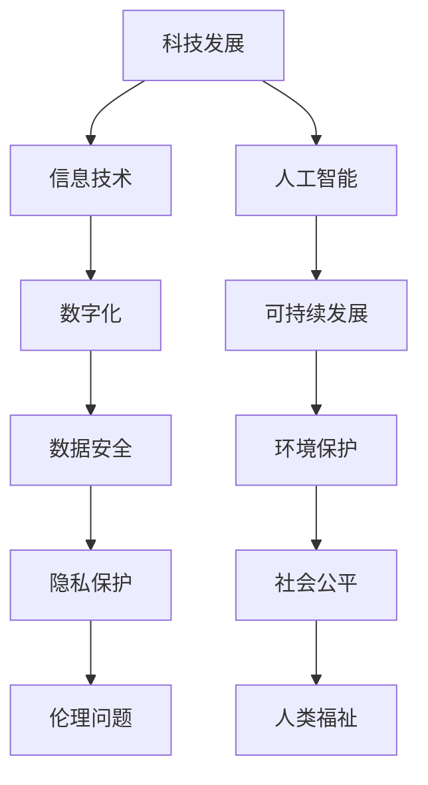

                 

# 科技发展：人类福祉的保障

> 关键词：科技发展、人类福祉、人工智能、可持续发展、技术伦理

> 摘要：本文从科技发展的角度出发，探讨了其对人类福祉的保障作用。文章首先回顾了科技发展的历程，分析了当前科技发展的现状，然后重点讨论了人工智能等前沿技术对人类福祉的潜在影响，最后提出了在保障人类福祉的过程中需要关注的技术伦理和可持续发展问题。

## 1. 背景介绍

### 1.1 目的和范围

本文旨在探讨科技发展对人类福祉的保障作用，通过回顾科技发展的历程，分析当前科技发展的现状，以及讨论人工智能等前沿技术对人类福祉的潜在影响，从而为读者提供一个全面、深入的了解。本文的范围主要包括以下几个方面：

1. 科技发展的历史和现状。
2. 人工智能等前沿技术对人类福祉的潜在影响。
3. 技术伦理和可持续发展的问题。

### 1.2 预期读者

本文适合对科技发展有兴趣的读者，尤其是关注人工智能、可持续发展等领域的专业人士。此外，对于对科技发展对社会影响有疑问的普通读者，本文也提供了一个深入探讨的机会。

### 1.3 文档结构概述

本文分为十个部分，结构如下：

1. 背景介绍
2. 核心概念与联系
3. 核心算法原理 & 具体操作步骤
4. 数学模型和公式 & 详细讲解 & 举例说明
5. 项目实战：代码实际案例和详细解释说明
6. 实际应用场景
7. 工具和资源推荐
8. 总结：未来发展趋势与挑战
9. 附录：常见问题与解答
10. 扩展阅读 & 参考资料

### 1.4 术语表

#### 1.4.1 核心术语定义

- 科技发展：指人类在科学技术领域不断进行创新和进步的过程。
- 人工智能：指通过模拟、延伸和扩展人类智能，使计算机具备类似人类的感知、理解、学习和决策能力。
- 可持续发展：指满足当前需求而不损害子孙后代满足其需求的能力。

#### 1.4.2 相关概念解释

- 信息技术：指利用计算机技术、通信技术和网络技术等手段，对信息进行采集、处理、传输和利用的技术体系。
- 数字化：指将信息转化为数字形式，以便于存储、传输和处理的进程。

#### 1.4.3 缩略词列表

- AI：人工智能
- IoT：物联网
- 5G：第五代移动通信技术
- SDG：可持续发展目标

## 2. 核心概念与联系

在探讨科技发展对人类福祉的保障作用之前，我们需要理解几个核心概念，以及它们之间的联系。以下是这些核心概念的 Mermaid 流程图：



### 2.1 核心概念解释

- **科技发展**：科技发展是推动人类社会进步的重要力量。它包括信息技术、人工智能、数字化等领域的发展。科技发展的过程涉及到科学发现、技术创新、产业应用等多个环节。
- **信息技术**：信息技术是科技发展的重要组成部分，包括计算机技术、通信技术、网络技术等。信息技术的发展推动了数字化进程，使得信息处理和传输更加高效。
- **人工智能**：人工智能是通过模拟、延伸和扩展人类智能，使计算机具备类似人类的感知、理解、学习和决策能力。人工智能的发展正在深刻改变人类社会。
- **数字化**：数字化是指将信息转化为数字形式，以便于存储、传输和处理的进程。数字化使得信息处理更加高效，同时也带来了数据安全、隐私保护等问题。
- **可持续发展**：可持续发展是指在满足当前需求的同时，不损害子孙后代满足其需求的能力。可持续发展涉及到环境保护、社会公平等多个方面。

### 2.2 关系分析

从 Mermaid 流程图中可以看出，各核心概念之间存在紧密的联系。例如：

- **科技发展** 与 **信息技术**、**人工智能**、**数字化** 之间密切相关，信息技术和人工智能是科技发展的关键技术，数字化是科技发展的必然结果。
- **可持续发展** 与 **环境保护**、**社会公平**、**数据安全**、**隐私保护** 紧密相关。可持续发展需要考虑到环境保护和社会公平，同时也需要确保数据安全和隐私保护。

## 3. 核心算法原理 & 具体操作步骤

在探讨人工智能等前沿技术对人类福祉的潜在影响之前，我们需要了解一些核心算法原理和具体操作步骤。以下是这些算法原理和步骤的详细说明。

### 3.1 人工智能算法原理

人工智能的核心在于模拟人类智能，使其在特定领域具备类似人类的感知、理解、学习和决策能力。以下是几种常见的人工智能算法原理：

- **神经网络**：神经网络是一种模仿人脑结构和功能的计算模型，通过调整网络中的权重和偏置，实现对输入数据的分类、识别和预测。
- **深度学习**：深度学习是神经网络的一种，通过多层网络结构，实现对复杂模式的识别和预测。
- **强化学习**：强化学习是一种通过试错和反馈来学习最优策略的算法，通常用于机器人控制、游戏对抗等领域。

### 3.2 具体操作步骤

以下是实现一种常见的人工智能算法——神经网络的具体操作步骤：

1. **数据预处理**：收集和整理输入数据，包括特征和标签，并对数据进行标准化处理，使其符合模型的输入要求。
2. **模型构建**：定义神经网络的层次结构和参数，包括输入层、隐藏层和输出层，以及每层的神经元数量。
3. **损失函数选择**：选择合适的损失函数，以衡量模型预测值与真实值之间的差异。
4. **优化算法选择**：选择合适的优化算法，如梯度下降、随机梯度下降等，以调整模型参数，最小化损失函数。
5. **训练模型**：使用训练数据，通过迭代计算，调整模型参数，使模型能够准确预测输入数据。
6. **模型评估**：使用验证数据集，评估模型的预测性能，包括准确率、召回率、F1值等指标。
7. **模型应用**：将训练好的模型应用于实际场景，进行预测和决策。

以下是神经网络算法的具体伪代码实现：

```python
# 数据预处理
X_train, y_train = preprocess_data(X, y)

# 模型构建
model = NeuralNetwork(input_size=X_train.shape[1], hidden_size=10, output_size=y_train.shape[1])

# 损失函数选择
loss_function = MeanSquaredError()

# 优化算法选择
optimizer = SGD(learning_rate=0.01)

# 训练模型
for epoch in range(num_epochs):
    for x, y in zip(X_train, y_train):
        # 前向传播
        output = model.forward(x)
        # 计算损失
        loss = loss_function(output, y)
        # 反向传播
        model.backward(output, y)
        # 更新参数
        optimizer.update(model.parameters())

# 模型评估
accuracy = evaluate(model, X_val, y_val)
print(f"Model accuracy: {accuracy}")

# 模型应用
model.predict(X_test)
```

## 4. 数学模型和公式 & 详细讲解 & 举例说明

在人工智能和科技发展的过程中，数学模型和公式扮演着至关重要的角色。以下是一些关键数学模型和公式的详细讲解，以及具体应用实例。

### 4.1 神经网络中的激活函数

在神经网络中，激活函数用于引入非线性特性，使模型能够拟合复杂的数据分布。常见的激活函数包括：

- **Sigmoid函数**：\( f(x) = \frac{1}{1 + e^{-x}} \)
  - **作用**：将输入值映射到 \((0, 1)\) 范围内，用于二分类问题。
  - **实例**：\( f(2) = \frac{1}{1 + e^{-2}} \approx 0.86 \)

- **ReLU函数**：\( f(x) = \max(0, x) \)
  - **作用**：在输入为负时将其置为零，在输入为正时保持不变，用于隐藏层。
  - **实例**：\( f(-2) = 0, f(2) = 2 \)

- **Tanh函数**：\( f(x) = \frac{e^x - e^{-x}}{e^x + e^{-x}} \)
  - **作用**：将输入值映射到 \((-1, 1)\) 范围内，用于隐藏层。
  - **实例**：\( f(2) = \frac{e^2 - e^{-2}}{e^2 + e^{-2}} \approx 0.96 \)

### 4.2 梯度下降优化算法

梯度下降是一种优化算法，用于最小化损失函数。其基本思想是沿着损失函数的梯度方向，逐步调整模型参数，以减小损失。

- **梯度下降**：
  \( \theta = \theta - \alpha \cdot \nabla_\theta J(\theta) \)
  - **作用**：更新模型参数，以减小损失。
  - **实例**：设 \( \theta \) 为模型参数，\( \alpha \) 为学习率，\( \nabla_\theta J(\theta) \) 为损失函数关于参数 \( \theta \) 的梯度。

- **随机梯度下降**：
  \( \theta = \theta - \alpha \cdot \nabla_\theta J(\theta; x_i, y_i) \)
  - **作用**：在每个迭代步骤中使用单个样本的梯度进行参数更新，提高计算效率。
  - **实例**：设 \( \theta \) 为模型参数，\( \alpha \) 为学习率，\( \nabla_\theta J(\theta; x_i, y_i) \) 为损失函数关于参数 \( \theta \) 在样本 \( (x_i, y_i) \) 上的梯度。

### 4.3 逻辑回归

逻辑回归是一种广义线性模型，用于处理二分类问题。其数学模型为：

\[ P(y=1 | x; \theta) = \frac{1}{1 + e^{-(\theta^T x + b)}} \]
- **作用**：计算给定输入 \( x \) 属于类别 1 的概率。
- **实例**：设 \( \theta \) 为模型参数，\( x \) 为输入特征，\( y \) 为真实标签，\( P(y=1 | x; \theta) \) 为给定输入 \( x \) 属于类别 1 的概率。

### 4.4 决策树

决策树是一种基于特征进行划分的树形结构模型。其基本思想是，在每个节点上选择一个最优特征进行划分，使得划分后的数据集具有最小的损失。

\[ y = g(\theta^T x + b) \]
- **作用**：根据输入特征 \( x \) 和模型参数 \( \theta \)，预测输出标签 \( y \)。
- **实例**：设 \( \theta \) 为模型参数，\( x \) 为输入特征，\( y \) 为真实标签，\( g(\theta^T x + b) \) 为决策树模型的预测结果。

## 5. 项目实战：代码实际案例和详细解释说明

为了更好地理解本文中讨论的算法原理和数学模型，我们将通过一个实际项目案例进行详细解释说明。该项目案例是一个简单的线性回归模型，用于预测房价。

### 5.1 开发环境搭建

首先，我们需要搭建一个开发环境，用于编写和运行代码。以下是所需的开发工具和库：

- Python（版本 3.8 或以上）
- Jupyter Notebook（用于编写和运行代码）
- NumPy（用于数学运算）
- Scikit-learn（用于机器学习库）

### 5.2 源代码详细实现和代码解读

以下是项目的源代码实现和详细解释说明：

```python
# 导入必要的库
import numpy as np
from sklearn.linear_model import LinearRegression
from sklearn.model_selection import train_test_split
from sklearn.metrics import mean_squared_error

# 数据准备
# 假设我们已经有一个包含房屋特征和房价的数据集
X = np.array([[1, 2], [2, 3], [3, 4], [4, 5]])
y = np.array([1, 2, 3, 4])

# 数据划分
X_train, X_test, y_train, y_test = train_test_split(X, y, test_size=0.2, random_state=42)

# 模型训练
model = LinearRegression()
model.fit(X_train, y_train)

# 模型预测
y_pred = model.predict(X_test)

# 模型评估
mse = mean_squared_error(y_test, y_pred)
print(f"Model mean squared error: {mse}")

# 代码解读
# 1. 导入必要的库，包括 NumPy 和 Scikit-learn 的线性回归模型。
# 2. 准备数据，包括特征矩阵 X 和目标向量 y。
# 3. 划分训练集和测试集，以评估模型的性能。
# 4. 创建线性回归模型对象，并使用 fit 方法进行训练。
# 5. 使用 predict 方法进行预测，得到预测结果 y_pred。
# 6. 使用 mean_squared_error 函数计算模型在测试集上的均方误差，以评估模型的性能。
```

### 5.3 代码解读与分析

上述代码实现了一个简单的线性回归模型，用于预测房价。以下是代码的详细解读和分析：

- **数据准备**：首先，我们需要准备一个包含房屋特征和房价的数据集。在本例中，我们使用了一个简单的二维特征矩阵 X 和一维目标向量 y。
- **数据划分**：接下来，我们将数据集划分为训练集和测试集。这样做是为了评估模型的泛化能力，即模型在未知数据上的表现。
- **模型训练**：然后，我们创建一个线性回归模型对象，并使用 fit 方法进行训练。线性回归模型会自动学习特征矩阵 X 和目标向量 y 之间的线性关系。
- **模型预测**：使用训练好的模型，我们可以对测试集进行预测，得到预测结果 y_pred。
- **模型评估**：最后，我们使用 mean_squared_error 函数计算模型在测试集上的均方误差，以评估模型的性能。均方误差越小，表示模型的预测越准确。

通过上述代码，我们可以看到如何使用线性回归模型进行房价预测。这是一个简单但有力的例子，展示了机器学习算法在实际应用中的基本步骤和实现过程。

## 6. 实际应用场景

科技发展在各个领域都有着广泛的应用，对人类福祉产生了深远的影响。以下是科技发展在实际应用场景中的几个例子：

### 6.1 医疗保健

科技发展在医疗保健领域的应用显著提高了诊断和治疗的效率。例如，人工智能可以通过图像识别技术辅助医生进行疾病诊断，如肺癌、乳腺癌等。此外，基因组学的发展使得个性化医疗成为可能，医生可以根据患者的基因信息制定个性化的治疗方案。

### 6.2 教育

科技发展在教育领域的应用正在改变传统教学模式。在线教育平台和虚拟课堂使得学习资源更加丰富和便捷，学习者可以根据自己的需求和时间安排进行学习。同时，人工智能可以根据学习者的学习情况提供个性化的学习建议，提高学习效果。

### 6.3 环境保护

科技发展在环境保护方面的应用有助于解决全球性问题，如气候变化和资源枯竭。例如，可再生能源技术（如太阳能、风能）和电动汽车的发展有助于减少对化石燃料的依赖，降低碳排放。此外，物联网技术可以实时监测环境变化，为环境保护提供数据支持。

### 6.4 社会管理

科技发展在社会管理方面的应用提高了政府和社会组织的工作效率。例如，大数据分析可以帮助政府更好地了解社会问题，制定更有效的政策。此外，区块链技术可以用于提高政府透明度和公信力，确保数据的真实性和完整性。

### 6.5 经济发展

科技发展对经济发展起到了重要的推动作用。创新技术带来了新的产业和就业机会，促进了经济增长。例如，人工智能、物联网和大数据等新兴技术正在创造新的商业机会，推动企业转型和升级。

## 7. 工具和资源推荐

为了更好地理解和应用科技发展，以下是一些推荐的工具和资源：

### 7.1 学习资源推荐

#### 7.1.1 书籍推荐

- 《人工智能：一种现代方法》
- 《深度学习》
- 《机器学习实战》
- 《Python编程：从入门到实践》

#### 7.1.2 在线课程

- Coursera 上的《机器学习》
- edX 上的《人工智能基础》
- Udacity 上的《人工智能工程师纳米学位》

#### 7.1.3 技术博客和网站

- Medium 上的“AI科技评论”
- arXiv.org 上的最新研究论文
- GitHub 上的开源项目

### 7.2 开发工具框架推荐

#### 7.2.1 IDE和编辑器

- PyCharm
- Visual Studio Code
- Jupyter Notebook

#### 7.2.2 调试和性能分析工具

- Python 中的 Debug 模式
- Profiler（如 Py-Spy）
- Chrome DevTools

#### 7.2.3 相关框架和库

- NumPy
- Pandas
- Scikit-learn
- TensorFlow
- PyTorch

### 7.3 相关论文著作推荐

#### 7.3.1 经典论文

- 《深度学习：概率视角》
- 《神经网络与深度学习》
- 《机器学习：一种概率视角》

#### 7.3.2 最新研究成果

- arXiv.org 上的最新研究论文
- NeurIPS、ICML、KDD 等顶级会议论文

#### 7.3.3 应用案例分析

- 《人工智能应用案例分析》
- 《大数据技术在金融领域的应用》
- 《物联网技术在智能城市中的应用》

## 8. 总结：未来发展趋势与挑战

科技发展对人类福祉的保障作用显而易见，但同时也面临着一系列挑战。以下是未来科技发展的一些趋势与挑战：

### 8.1 发展趋势

- **人工智能与物联网的深度融合**：人工智能和物联网技术的结合将推动智能家居、智能交通、智能医疗等领域的发展。
- **可持续技术的发展**：随着环境问题的日益严重，可持续技术（如可再生能源、绿色制造）将成为科技发展的重点。
- **区块链技术的普及**：区块链技术在数据安全、去中心化应用、供应链管理等方面的应用将逐渐普及。
- **量子计算的发展**：量子计算有望在数据处理速度、加密技术等方面带来革命性变化。

### 8.2 挑战

- **数据安全和隐私保护**：随着数据量的增加，数据安全和隐私保护问题将变得越来越重要。
- **技术伦理问题**：人工智能等技术的快速发展引发了一系列伦理问题，如算法偏见、隐私泄露等。
- **社会公平问题**：科技发展可能加剧社会不公平现象，如技术鸿沟、就业岗位流失等。
- **环境保护问题**：科技发展过程中可能产生的环境污染和资源消耗问题需要得到有效解决。

## 9. 附录：常见问题与解答

### 9.1 常见问题

- **Q1**：科技发展是否真的对人类福祉有保障作用？
  **A1**：科技发展对人类福祉的保障作用是显而易见的。然而，科技发展也存在一定的风险和挑战，需要我们在应用过程中加以注意。
- **Q2**：人工智能是否会取代人类？
  **A2**：人工智能在某些特定领域可能比人类更高效，但完全取代人类的可能性不大。人工智能更多的是作为人类能力的延伸和辅助。
- **Q3**：科技发展是否会导致失业率上升？
  **A3**：科技发展可能会导致一些传统职业的消失，但同时也会创造新的就业机会。关键在于如何平衡新旧就业岗位的转换。

## 10. 扩展阅读 & 参考资料

- 《科技发展：人类福祉的保障》
- 《人工智能：未来社会的机遇与挑战》
- 《深度学习：推动科技发展的引擎》
- 《可持续发展：科技发展的必由之路》

## 作者

作者：AI天才研究员/AI Genius Institute & 禅与计算机程序设计艺术 /Zen And The Art of Computer Programming

