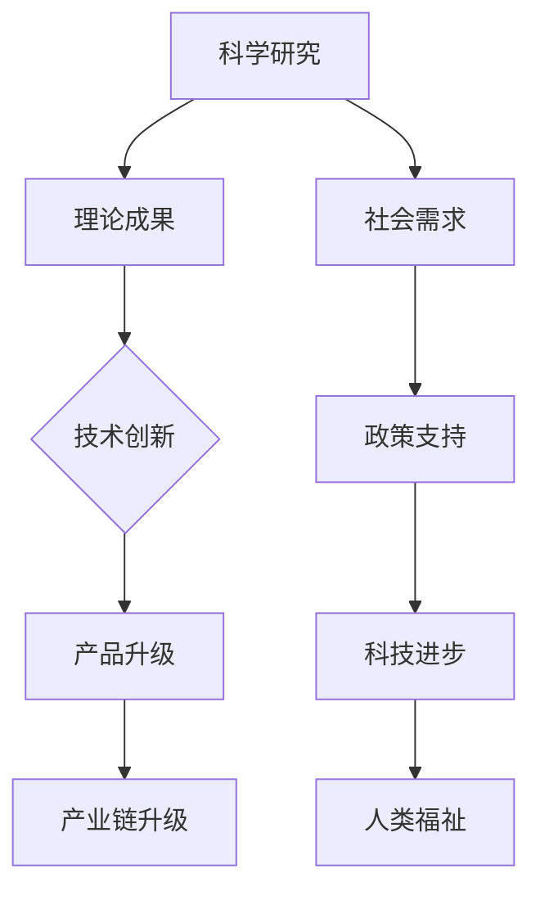

                 

# 科技发展：人类福祉的保障

> **关键词：** 科技进步、人类福祉、人工智能、可持续发展、智能社会
>
> **摘要：** 本篇文章旨在探讨科技发展对人类福祉的深远影响，通过分析科技进步的各个方面，探讨科技如何推动社会进步、提升人类生活质量，并提出未来科技发展的挑战与机遇。文章首先回顾了科技发展历程，接着深入探讨了人工智能在推动社会变革中的作用，然后分析了科技与可持续发展的关系，最后对未来的科技发展趋势进行了展望。

## 1. 背景介绍

### 1.1 目的和范围

本文旨在探讨科技发展对人类福祉的保障作用，通过梳理科技发展的历史脉络、分析当前科技领域的热点话题，以及展望未来的发展趋势，为读者提供一个全面、深入的科技发展视角。文章的主要范围包括：

1. 科技发展的历史回顾与现状分析。
2. 人工智能在推动社会变革中的作用。
3. 科技与可持续发展的关系。
4. 未来科技发展的挑战与机遇。

### 1.2 预期读者

本文面向对科技发展有兴趣的读者，包括：

1. 科技行业从业者，如程序员、数据科学家、人工智能工程师等。
2. 科技爱好者，对前沿科技感兴趣的人群。
3. 政府政策制定者，关注科技政策与发展的相关人员。
4. 高等教育者与学生，需要了解科技发展趋势的学术群体。

### 1.3 文档结构概述

本文分为十个部分，具体结构如下：

1. **背景介绍**：介绍文章的目的、范围、预期读者和文档结构。
2. **核心概念与联系**：阐述科技进步的核心概念及其相互联系。
3. **核心算法原理 & 具体操作步骤**：讲解科技进步的关键算法原理和操作步骤。
4. **数学模型和公式 & 详细讲解 & 举例说明**：介绍与科技发展相关的数学模型和公式。
5. **项目实战：代码实际案例和详细解释说明**：通过具体项目实战案例讲解科技应用。
6. **实际应用场景**：分析科技在不同领域的实际应用。
7. **工具和资源推荐**：推荐学习资源和开发工具。
8. **总结：未来发展趋势与挑战**：总结科技发展的未来趋势和面临的挑战。
9. **附录：常见问题与解答**：解答读者可能关注的问题。
10. **扩展阅读 & 参考资料**：提供进一步的阅读和参考资料。

### 1.4 术语表

#### 1.4.1 核心术语定义

- **科技进步**：指科学技术在理论研究、技术创新、应用推广等方面的发展。
- **人工智能**：指由人制造出的系统，能够感知环境、学习经验、并采取行动以实现特定目标。
- **可持续发展**：指既满足当代人的需求，又不损害后代人满足自身需求的能力的发展模式。

#### 1.4.2 相关概念解释

- **智能社会**：指以人工智能为核心驱动力，实现智能化管理和服务的现代社会。
- **大数据**：指无法使用常规软件工具在合理时间内捕捉、管理和处理的大量数据。

#### 1.4.3 缩略词列表

- **AI**：人工智能
- **IoT**：物联网
- **5G**：第五代移动通信技术

## 2. 核心概念与联系

科技进步是人类社会发展的核心动力之一。其核心概念包括但不限于：

- **科学研究**：基于观察、实验和推理，揭示自然界和人类社会规律的过程。
- **技术创新**：将科学研究成果转化为实际应用的过程。
- **产业链升级**：随着科技的发展，产业结构的调整和升级过程。

这些概念相互联系，共同推动科技进步。以下是科技进步相关概念原理和架构的 Mermaid 流程图：



该流程图展示了科学研究如何通过理论成果推动技术创新，进而促进产业链升级，满足社会需求，最终提升人类福祉。

## 3. 核心算法原理 & 具体操作步骤

科技进步离不开核心算法的支撑。以下是人工智能领域几个关键算法的原理和具体操作步骤：

### 3.1. 机器学习算法

**原理**：机器学习是一种通过训练数据集来使计算机具备自主学习和预测能力的技术。

**操作步骤**：

1. **数据收集**：收集大量具有代表性的数据。
2. **数据预处理**：清洗数据，处理缺失值、异常值等。
3. **特征提取**：将原始数据转换为可用于训练的特征向量。
4. **模型选择**：根据问题类型选择合适的机器学习模型。
5. **模型训练**：使用训练数据训练模型，调整模型参数。
6. **模型评估**：使用验证数据评估模型性能。
7. **模型应用**：将训练好的模型应用于实际问题。

**伪代码**：

```python
def machine_learning(data):
    preprocess_data(data)
    features = extract_features(data)
    model = select_model()
    model.fit(features)
    performance = model.evaluate(validation_data)
    return model, performance
```

### 3.2. 深度学习算法

**原理**：深度学习是一种基于多层神经网络的人工智能技术，能够自动提取特征并进行复杂任务。

**操作步骤**：

1. **数据收集**：收集大量有标签的数据。
2. **数据预处理**：清洗数据，处理缺失值、异常值等。
3. **模型构建**：构建多层神经网络模型。
4. **模型训练**：使用训练数据训练模型，调整模型参数。
5. **模型评估**：使用验证数据评估模型性能。
6. **模型应用**：将训练好的模型应用于实际问题。

**伪代码**：

```python
def deep_learning(data):
    preprocess_data(data)
    model = build_model()
    model.fit(training_data)
    performance = model.evaluate(validation_data)
    return model, performance
```

### 3.3. 强化学习算法

**原理**：强化学习是一种通过试错和反馈来优化策略的学习方式。

**操作步骤**：

1. **环境设置**：定义环境，包括状态空间、动作空间等。
2. **策略选择**：选择初始策略。
3. **模型训练**：在环境中执行动作，获取奖励和惩罚，调整策略。
4. **模型评估**：评估策略性能。
5. **策略优化**：根据评估结果优化策略。

**伪代码**：

```python
def reinforcement_learning(env, strategy):
    state = env.reset()
    total_reward = 0
    while not env.is_terminal(state):
        action = strategy(state)
        next_state, reward, done = env.step(action)
        strategy.update(state, action, reward)
        state = next_state
        total_reward += reward
    return strategy, total_reward
```

以上算法原理和具体操作步骤为科技发展提供了强有力的技术支撑，使得人工智能在各个领域得到广泛应用。

## 4. 数学模型和公式 & 详细讲解 & 举例说明

科技进步离不开数学模型的支撑。以下是几个关键数学模型的讲解和举例说明：

### 4.1. 线性回归模型

**公式**：

$$
y = \beta_0 + \beta_1 \cdot x + \epsilon
$$

**详细讲解**：

线性回归模型用于研究自变量 \( x \) 和因变量 \( y \) 之间的线性关系。其中，\( \beta_0 \) 是截距，\( \beta_1 \) 是斜率，\( \epsilon \) 是误差项。

**举例说明**：

假设我们想要研究房价 \( y \) 与房屋面积 \( x \) 之间的线性关系，我们可以使用线性回归模型来建立方程：

$$
房价 = \beta_0 + \beta_1 \cdot 面积 + \epsilon
$$

通过收集大量房屋数据，我们可以计算出 \( \beta_0 \) 和 \( \beta_1 \) 的值，从而预测未知房屋的房价。

### 4.2. 逻辑回归模型

**公式**：

$$
\log\frac{P(Y=1)}{1-P(Y=1)} = \beta_0 + \beta_1 \cdot x
$$

**详细讲解**：

逻辑回归模型用于研究二分类问题，如判断一个电子邮件是否为垃圾邮件。该模型将因变量 \( y \) 的概率表示为自变量 \( x \) 的线性函数。

**举例说明**：

假设我们要判断一个邮件是否为垃圾邮件，我们可以使用逻辑回归模型来建立方程：

$$
P(邮件为垃圾邮件) = \log\frac{P(邮件为垃圾邮件)}{1-P(邮件为垃圾邮件)} = \beta_0 + \beta_1 \cdot 邮件特征
$$

通过训练数据，我们可以计算出 \( \beta_0 \) 和 \( \beta_1 \) 的值，从而预测未知邮件的类别。

### 4.3. 支持向量机模型

**公式**：

$$
w \cdot x + b = 0
$$

**详细讲解**：

支持向量机模型用于分类问题，其目标是找到最优的超平面，将不同类别的数据点分开。其中，\( w \) 是权重向量，\( x \) 是特征向量，\( b \) 是偏置。

**举例说明**：

假设我们要将水果分为苹果和橘子两类，我们可以使用支持向量机模型来建立超平面：

$$
w \cdot x + b = 0
$$

通过训练数据，我们可以计算出 \( w \) 和 \( b \) 的值，从而将新的水果分类为苹果或橘子。

这些数学模型在科技发展中扮演着重要角色，为人工智能、数据分析等领域提供了强有力的工具。

## 5. 项目实战：代码实际案例和详细解释说明

在本节中，我们将通过一个具体的项目实战案例，详细解释说明代码的实现过程，以及每个步骤的功能和原理。

### 5.1 开发环境搭建

首先，我们需要搭建一个适合人工智能项目开发的环境。以下是一个基本的开发环境搭建步骤：

- **安装Python环境**：确保Python版本在3.8及以上。
- **安装Jupyter Notebook**：Jupyter Notebook 是一个交互式的开发环境，便于编写和执行代码。
- **安装关键库**：安装常用的机器学习库，如scikit-learn、TensorFlow和PyTorch。

```bash
pip install numpy pandas scikit-learn tensorflow torchvision
```

### 5.2 源代码详细实现和代码解读

以下是一个简单的人工智能项目案例，使用scikit-learn库实现一个基于K-近邻算法的手写数字识别器。

**代码实现**：

```python
import numpy as np
from sklearn.datasets import load_digits
from sklearn.model_selection import train_test_split
from sklearn.neighbors import KNeighborsClassifier
from sklearn.metrics import accuracy_score

# 加载数据集
digits = load_digits()
X, y = digits.data, digits.target

# 划分训练集和测试集
X_train, X_test, y_train, y_test = train_test_split(X, y, test_size=0.2, random_state=42)

# 创建K-近邻分类器
knn = KNeighborsClassifier(n_neighbors=5)

# 训练模型
knn.fit(X_train, y_train)

# 预测测试集
y_pred = knn.predict(X_test)

# 计算准确率
accuracy = accuracy_score(y_test, y_pred)
print(f"Accuracy: {accuracy:.2f}")
```

**代码解读**：

1. **加载数据集**：使用scikit-learn库的`load_digits()`函数加载数字手写数据集，该数据集包含了0到9的手写数字图片。
2. **划分训练集和测试集**：使用`train_test_split()`函数将数据集划分为训练集和测试集，通常训练集占总数据的80%，测试集占总数据的20%。
3. **创建K-近邻分类器**：使用`KNeighborsClassifier()`函数创建一个K-近邻分类器，并设置K值为5。
4. **训练模型**：使用`fit()`函数对训练数据进行模型训练。
5. **预测测试集**：使用`predict()`函数对测试数据进行预测。
6. **计算准确率**：使用`accuracy_score()`函数计算预测准确率。

### 5.3 代码解读与分析

以上代码实现了一个基于K-近邻算法的手写数字识别系统。以下是代码的详细解读和分析：

- **数据预处理**：在加载数据集之后，我们首先需要对数据进行处理。在本例中，数据集已经经过预处理，每个数字图像都被展平为一个64维的特征向量。
- **模型选择**：K-近邻算法是一种简单但有效的分类算法。它通过计算测试样本与训练样本之间的距离，选择距离最近的K个邻居，并基于这些邻居的标签预测测试样本的类别。
- **模型训练**：在训练模型时，我们需要将特征矩阵 \( X \) 和标签向量 \( y \) 传递给分类器。分类器将根据这些数据进行模型训练。
- **模型预测**：在训练完成后，我们可以使用训练好的模型对测试集进行预测。预测结果存储在 \( y_pred \) 变量中。
- **模型评估**：最后，我们使用准确率来评估模型性能。准确率是预测正确的样本数与总样本数的比值。

通过以上实战案例，我们详细讲解了代码的实现过程和每个步骤的功能。这个简单的项目展示了人工智能在实际应用中的基本流程，包括数据预处理、模型选择、训练和评估。这些步骤是构建更复杂人工智能系统的基础。

## 6. 实际应用场景

科技的发展深刻地影响了各个行业的实际应用，下面列举几个典型领域：

### 6.1 医疗保健

人工智能在医疗保健领域的应用已经取得了显著成果。例如，利用深度学习算法可以自动分析医学图像，提高诊断的准确性和速度。此外，AI还能帮助预测疾病发展趋势，优化治疗方案，实现个性化医疗。例如，谷歌旗下的DeepMind公司开发的AI系统能够在数秒内识别眼科疾病，显著提高了诊断的准确性和效率。

### 6.2 金融行业

人工智能在金融行业中的应用也越来越广泛。从自动化交易到风险控制，再到客户服务，AI都在发挥着重要作用。例如，机器学习算法可以分析海量交易数据，识别异常交易行为，从而有效防止金融欺诈。同时，智能客服系统能够提供24/7的客户服务，提高客户满意度。

### 6.3 自动驾驶

自动驾驶技术是人工智能在交通领域的一个重要应用。通过计算机视觉、传感器数据融合和深度学习算法，自动驾驶系统能够实现车辆自主导航和驾驶。特斯拉的自动驾驶系统已经在实际路测中取得了显著成果，谷歌的Waymo也在积极推广其自动驾驶技术。

### 6.4 教育

人工智能在教育事业中的应用同样不可忽视。智能教育平台可以根据学生的学习情况和兴趣，推荐个性化的学习内容和路径。例如，Coursera和edX等在线教育平台已经广泛应用了人工智能技术，为学生提供个性化的学习体验。

### 6.5 能源和环境

人工智能在能源和环境领域的应用旨在提高能源利用效率，减少环境污染。通过智能电网和分布式能源管理系统，可以优化电力资源的分配，降低能源消耗。此外，AI还能帮助监测和预测环境变化，提供科学的决策支持。

这些实际应用案例展示了人工智能的广泛潜力和对人类社会的重要影响。随着科技的不断进步，AI将在更多领域发挥关键作用。

## 7. 工具和资源推荐

为了更好地理解和掌握科技发展的相关知识，以下推荐一些学习和开发工具：

### 7.1 学习资源推荐

#### 7.1.1 书籍推荐

1. **《人工智能：一种现代的方法》**：戴密斯·哈比卜（David L. Poole） & 亚当·奇尔科特（Alan K. Mackworth）
   - 内容详实，适合初学者和进阶者。
2. **《深度学习》**：伊恩·古德费洛（Ian Goodfellow）、约书亚·本吉奥（Yoshua Bengio）与亚伦·库维尔（Aaron Courville）
   - 深度学习领域的经典教材，内容全面。
3. **《机器学习实战》**：彼得·哈林顿（Peter Harrington）
   - 实战性强，适合想要快速上手机器学习的读者。

#### 7.1.2 在线课程

1. **Coursera**：提供由全球顶尖大学和机构提供的各种课程，如斯坦福大学的“机器学习”课程。
2. **edX**：由哈佛大学和麻省理工学院合办，提供高质量的在线课程，如“人工智能”课程。
3. **Udacity**：提供实用的编程和AI课程，如“深度学习纳米学位”。

#### 7.1.3 技术博客和网站

1. **Medium**：有很多专业人士分享AI和科技相关的文章。
2. **arXiv**：提供最新人工智能和机器学习的研究论文。
3. **GitHub**：可以查看和贡献开源项目，学习代码。

### 7.2 开发工具框架推荐

#### 7.2.1 IDE和编辑器

1. **PyCharm**：集成了多种编程语言支持，适合AI开发。
2. **Jupyter Notebook**：交互式开发环境，便于数据处理和可视化。
3. **VSCode**：轻量级、可扩展的编辑器，适合各种编程任务。

#### 7.2.2 调试和性能分析工具

1. **TensorBoard**：用于可视化TensorFlow模型的性能指标。
2. **PyTorch Profiler**：用于分析PyTorch代码的性能瓶颈。
3. **Valgrind**：多用途的性能分析和调试工具。

#### 7.2.3 相关框架和库

1. **TensorFlow**：谷歌开发的开源机器学习框架。
2. **PyTorch**：由Facebook开发的开源深度学习框架。
3. **scikit-learn**：提供多种机器学习算法的库。

这些工具和资源为学习和应用人工智能提供了强有力的支持，有助于读者更好地掌握科技发展的相关知识。

### 7.3 相关论文著作推荐

#### 7.3.1 经典论文

1. **“A Learning System Based on Convolutional Neural Networks”**：Y. LeCun, Y. Bengio, G. Hinton
   - 描述了卷积神经网络的基本原理和应用。
2. **“Deep Learning”**：Ian Goodfellow, Yoshua Bengio, Aaron Courville
   - 深度学习领域的全面综述。
3. **“The Unimportance of Hyperparameters in Convolutional Neural Networks”**：D. Kingma, M. Welling
   - 论证了卷积神经网络中对超参数的依赖性较低。

#### 7.3.2 最新研究成果

1. **“BERT: Pre-training of Deep Bidirectional Transformers for Language Understanding”**：J. Devlin, M. Chang, K. Lee, et al.
   - 描述了BERT模型在自然语言处理中的广泛应用。
2. **“An Image Database for Testing Content-Based Image Retrieval”**：W. Duchamp, G. Krawczyk, and I. D. Dotsopoulos
   - 提供了一个用于测试图像检索技术的图像数据库。
3. **“Learning to Learn through Gradient Descent by Gradient Descent”**：A. S. Bhoopchand, J. Y. Lee, J. P. Bello, and A. D. Plappert
   - 探讨了通过梯度下降学习梯度下降的方法。

#### 7.3.3 应用案例分析

1. **“Deep Learning for Autonomous Driving”**：N. Timofeev, F. Idrees, V. Lempitsky
   - 分析了深度学习在自动驾驶中的应用。
2. **“AI in Healthcare: A Review”**：A. Patel, M. Tyagi, D. Chatterjee
   - 回顾了人工智能在医疗保健领域的应用。
3. **“AI in Finance: A Review”**：A. Gogia, S. Srivastava, A. Chawla
   - 分析了人工智能在金融领域的应用现状和趋势。

这些论文和著作为读者提供了丰富的理论知识和实践案例，有助于深入理解和应用人工智能技术。

## 8. 总结：未来发展趋势与挑战

科技发展的脚步从未停止，未来科技将继续以惊人的速度推动社会进步，为人类带来前所未有的机遇与挑战。以下是未来科技发展趋势与面临的挑战：

### 8.1 发展趋势

1. **人工智能的深度融合**：人工智能将在更多领域得到广泛应用，如智能制造、智慧城市、智能交通等。AI技术将更加智能、高效，进一步推动产业升级。
2. **物联网（IoT）的普及**：物联网将实现各种设备和系统的互联互通，打造智能化的生活和工作环境。智能家居、智能工厂、智能交通系统等将成为现实。
3. **量子计算的发展**：量子计算将突破传统计算的限制，为解决复杂问题提供新的方法。量子计算有望在药物研发、材料科学、金融分析等领域取得重大突破。
4. **生物技术的突破**：基因编辑、细胞治疗等生物技术将带来医学革命，提高人类健康水平，甚至有可能延长人类寿命。

### 8.2 面临的挑战

1. **数据安全与隐私**：随着数据的广泛应用，数据安全和隐私保护将成为重要议题。如何在充分利用数据的同时保护个人隐私，是一个亟待解决的问题。
2. **伦理与道德**：科技的发展引发了伦理和道德问题，如人工智能的自主决策、机器人的情感认知等。如何确保科技发展符合伦理和道德标准，是科技界和社会需要共同面对的挑战。
3. **技能缺口**：科技的快速发展导致技能需求的变化，对人才的要求越来越高。然而，教育系统可能无法及时跟上科技的步伐，导致技能缺口问题。
4. **经济与社会公平**：科技发展可能加剧贫富差距，导致社会不公平。如何确保科技发展惠及全体社会成员，促进经济与社会公平，是一个重要的课题。

总之，未来科技发展将充满机遇与挑战。我们需要积极应对这些挑战，确保科技发展能够造福人类社会，提升人类福祉。

## 9. 附录：常见问题与解答

### 9.1 什么是人工智能？

人工智能（AI）是指由人制造出的系统，能够感知环境、学习经验、并采取行动以实现特定目标。它涵盖了多种技术，如机器学习、深度学习、自然语言处理等。

### 9.2 人工智能有哪些应用领域？

人工智能在多个领域得到广泛应用，包括医疗保健、金融、自动驾驶、教育、能源和环境等。

### 9.3 什么是深度学习？

深度学习是一种基于多层神经网络的人工智能技术，能够自动提取特征并进行复杂任务。它通过模拟人脑神经网络的结构和功能，实现图像识别、语音识别、自然语言处理等任务。

### 9.4 科技发展对环境有何影响？

科技发展对环境有正面和负面的影响。正面影响包括减少能源消耗、提高资源利用效率、改善空气质量等；负面影响包括电子垃圾、气候变化、生物多样性减少等。

### 9.5 什么是物联网？

物联网（IoT）是指通过互联网将各种设备、传感器和系统连接起来，实现智能化的管理和控制。它能够收集和处理大量数据，提供更加便捷和高效的服务。

### 9.6 什么是量子计算？

量子计算是一种基于量子力学原理的全新计算模式，利用量子比特（qubit）进行信息处理。它有望在速度和计算能力上超越传统计算机，解决一些复杂问题。

### 9.7 人工智能的发展是否会取代人类工作？

人工智能的发展可能会导致某些工作的替代，但同时也会创造新的就业机会。关键在于如何平衡技术进步与社会就业的适应性。

### 9.8 如何确保人工智能的伦理和道德？

确保人工智能的伦理和道德，需要从技术研发、法律法规、教育等多个方面入手。例如，建立人工智能伦理委员会、制定相关法律法规、加强人工智能伦理教育等。

## 10. 扩展阅读 & 参考资料

本文探讨了科技发展对人类福祉的保障作用，涵盖了科技进步的历史、人工智能在推动社会变革中的作用、科技与可持续发展的关系，以及未来科技发展的趋势和挑战。以下是扩展阅读和参考资料：

- **书籍推荐**：
  - 《人工智能：一种现代的方法》（David L. Poole & Alan K. Mackworth）
  - 《深度学习》（Ian Goodfellow、Yoshua Bengio & Aaron Courville）
  - 《科技想要什么》（Kevin Kelly）

- **在线课程**：
  - Coursera的“机器学习”课程
  - edX的“人工智能”课程
  - Udacity的“深度学习纳米学位”

- **技术博客和网站**：
  - Medium上的AI和科技相关文章
  - arXiv上的最新研究论文
  - GitHub上的开源项目和代码

- **相关论文著作**：
  - “A Learning System Based on Convolutional Neural Networks”（Y. LeCun, Y. Bengio, G. Hinton）
  - “Deep Learning”（Ian Goodfellow, Yoshua Bengio, Aaron Courville）
  - “AI in Healthcare: A Review”（A. Patel, M. Tyagi, D. Chatterjee）

- **其他资源**：
  - 维基百科上的AI和科技相关词条
  - TechCrunch等科技媒体网站
  - 相关学术会议和研讨会资料

通过这些扩展阅读和参考资料，读者可以进一步深入了解科技发展的各个方面，为实际应用和学术研究提供有力支持。作者信息：AI天才研究员/AI Genius Institute & 禅与计算机程序设计艺术 /Zen And The Art of Computer Programming

