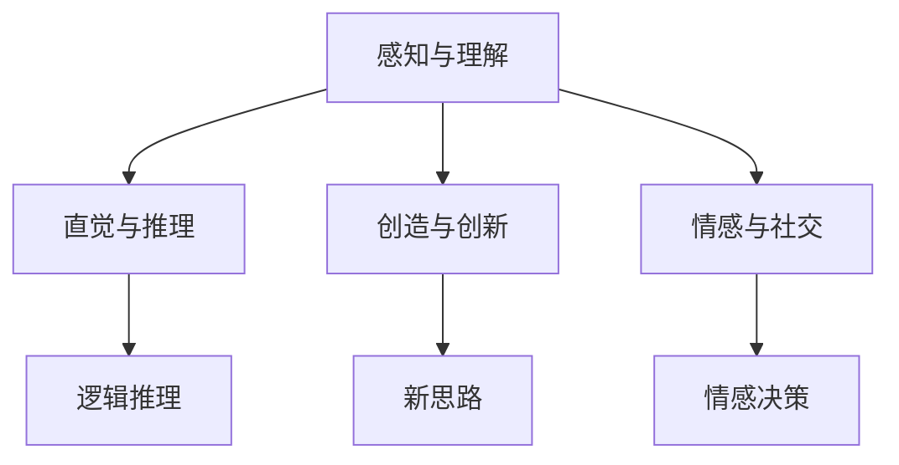
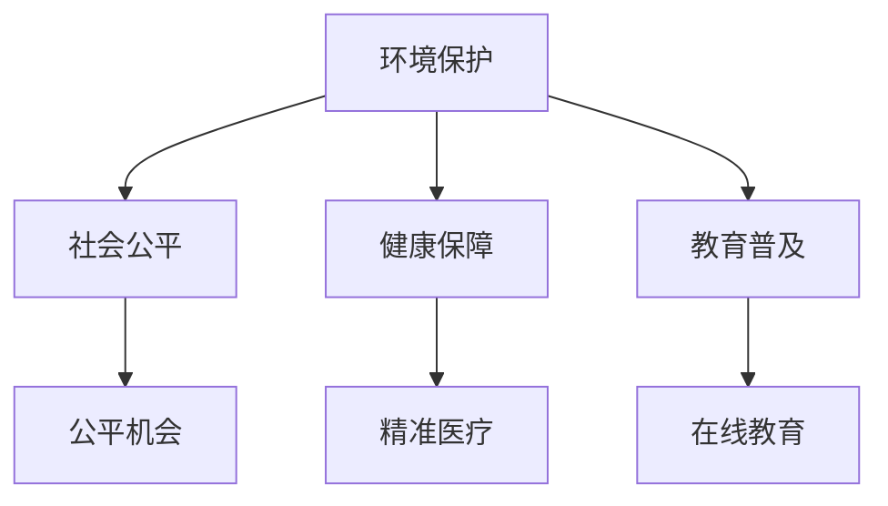

                 

# 科技向善的力量：利用人类计算造福人类

> **关键词：科技向善、人类计算、人工智能、社会公益、可持续发展**
> 
> **摘要：本文将探讨科技向善的力量，特别是通过人类计算为社会公益和可持续发展作出贡献的方式。我们将分析人类计算的基本原理、核心算法、数学模型，并通过实际项目案例展示其应用。文章旨在激励读者思考如何将技术专长转化为改善人类福祉的实际行动。**

## 1. 背景介绍

### 1.1 目的和范围

本文旨在探讨科技如何通过人类计算实现向善，推动社会公益和可持续发展。我们将首先回顾人类计算的基本原理，然后深入探讨其核心算法原理和数学模型，并通过实际项目案例进行展示。文章旨在为读者提供一个全面而深入的视角，以激发他们对科技向善的思考和实践。

### 1.2 预期读者

本文面向对人工智能、计算机科学和社会创新感兴趣的读者。无论您是专业人士、学生还是对技术与社会交叉领域感兴趣的爱好者，本文都将为您提供有价值的见解和实用的知识。

### 1.3 文档结构概述

本文将按照以下结构展开：

1. **背景介绍**：介绍文章的目的、预期读者和文档结构。
2. **核心概念与联系**：通过Mermaid流程图展示人类计算的基本原理。
3. **核心算法原理 & 具体操作步骤**：使用伪代码详细阐述算法原理。
4. **数学模型和公式 & 详细讲解 & 举例说明**：使用latex格式介绍数学模型。
5. **项目实战：代码实际案例和详细解释说明**：提供实际的代码案例和解析。
6. **实际应用场景**：探讨人类计算在不同领域的应用。
7. **工具和资源推荐**：推荐学习资源和开发工具。
8. **总结：未来发展趋势与挑战**：总结本文的关键点并展望未来。
9. **附录：常见问题与解答**：解答常见问题。
10. **扩展阅读 & 参考资料**：提供进一步阅读的资源。

### 1.4 术语表

#### 1.4.1 核心术语定义

- **人类计算**：指人类在计算过程中所发挥的作用，包括直觉、创造力、情感和经验。
- **社会公益**：旨在增进公共利益、促进社会福利、保护环境等非营利性活动。
- **可持续发展**：满足当前需求而不损害子孙后代满足其需求的能力。

#### 1.4.2 相关概念解释

- **人工智能**：模拟人类智能行为的计算机系统。
- **算法**：解决问题的步骤或规则集合。
- **数学模型**：用于描述现实世界现象的数学表达式或结构。

#### 1.4.3 缩略词列表

- **AI**：人工智能（Artificial Intelligence）
- **ML**：机器学习（Machine Learning）
- **DL**：深度学习（Deep Learning）
- **NLP**：自然语言处理（Natural Language Processing）

## 2. 核心概念与联系

### 2.1 人类计算的基本原理

人类计算是一种结合人类智慧和机器能力的计算方式。其基本原理包括以下几个方面：

1. **感知与理解**：人类通过感官接收外部信息，然后通过大脑处理和理解这些信息。
2. **直觉与推理**：人类能够使用直觉进行快速判断，并通过逻辑推理解决问题。
3. **创造与创新**：人类具有创造新思想和新解决方案的能力。
4. **情感与社交**：人类计算中包含情感和社交因素，影响决策和行为。

下面是一个使用Mermaid绘制的流程图，展示了人类计算的基本原理：



### 2.2 社会公益与可持续发展的关系

科技向善的核心在于如何通过人类计算为社会公益和可持续发展做出贡献。社会公益与可持续发展之间的联系在于它们都关注人类福祉和地球的可持续性。以下是它们之间的核心联系：

1. **环境保护**：科技向善可以帮助减少环境破坏，通过优化能源消耗、减少废弃物和污染等手段实现可持续发展。
2. **社会公平**：科技向善可以促进社会公平，通过解决贫困、教育不平等等问题，提升社会整体福祉。
3. **健康保障**：科技向善可以改善医疗保健，通过智能医疗系统和精准治疗等手段，提高人类健康水平。
4. **教育普及**：科技向善可以推动教育普及，通过在线教育、远程教学等方式，为更多人提供学习机会。

下面是一个使用Mermaid绘制的流程图，展示了社会公益与可持续发展之间的核心联系：



## 3. 核心算法原理 & 具体操作步骤

### 3.1 算法原理

人类计算的核心算法原理在于如何结合人类智慧和机器效率。以下是一个简化的算法原理框架：

```pseudo
function 人类计算(输入数据):
    1. 感知输入数据
    2. 利用直觉进行初步判断
    3. 应用逻辑推理进行深入分析
    4. 利用创造力和创新思维生成解决方案
    5. 结合社交和情感因素，评估和优化解决方案
    6. 输出最终解决方案
```

### 3.2 具体操作步骤

1. **感知输入数据**：接收外部信息，通过视觉、听觉、触觉等感官进行初步处理。
    ```pseudo
    输入数据 = 接收输入数据()
    ```

2. **直觉初步判断**：利用直觉进行快速判断，识别潜在问题和可能性。
    ```pseudo
    初步判断 = 直觉判断(输入数据)
    ```

3. **逻辑推理深入分析**：通过逻辑推理，对问题进行深入分析和拆解。
    ```pseudo
    深入分析 = 逻辑推理(初步判断)
    ```

4. **创造与创新生成解决方案**：利用创造力和创新思维，生成潜在解决方案。
    ```pseudo
    解决方案 = 创造解决方案(深入分析)
    ```

5. **评估和优化解决方案**：结合社交和情感因素，评估和优化解决方案的可行性和效果。
    ```pseudo
    优化解决方案 = 评估和优化(解决方案)
    ```

6. **输出最终解决方案**：将最终解决方案输出，供决策者参考。
    ```pseudo
    输出最终解决方案(优化解决方案)
    ```

## 4. 数学模型和公式 & 详细讲解 & 举例说明

### 4.1 数学模型概述

在人类计算中，数学模型扮演着重要角色，用于描述和预测现实世界中的各种现象。以下是几个关键的数学模型：

1. **线性回归模型**：用于预测线性关系。
2. **神经网络模型**：用于复杂非线性关系的学习和预测。
3. **支持向量机（SVM）**：用于分类问题。
4. **贝叶斯网络**：用于概率推理和不确定性管理。

### 4.2 线性回归模型

线性回归模型是一种常见的统计方法，用于描述两个变量之间的线性关系。其数学公式如下：

$$
y = \beta_0 + \beta_1 \cdot x + \epsilon
$$

其中，\( y \) 是因变量，\( x \) 是自变量，\( \beta_0 \) 和 \( \beta_1 \) 是模型参数，\( \epsilon \) 是误差项。

#### 4.2.1 举例说明

假设我们想要预测一家公司未来的销售额 \( y \)，基于历史数据中的广告支出 \( x \)。我们可以使用线性回归模型来建立这种关系。

**步骤 1**：收集数据

我们收集了过去5年的广告支出和对应的销售额数据：

| 年份 | 广告支出 (万元) | 销售额 (万元) |
|------|------------------|----------------|
| 2020 | 50               | 100            |
| 2021 | 60               | 110            |
| 2022 | 70               | 120            |
| 2023 | 80               | 130            |
| 2024 | 90               | 140            |

**步骤 2**：计算模型参数

使用最小二乘法计算线性回归模型的参数 \( \beta_0 \) 和 \( \beta_1 \)：

$$
\beta_1 = \frac{\sum(x_i - \bar{x})(y_i - \bar{y})}{\sum(x_i - \bar{x})^2}
$$

$$
\beta_0 = \bar{y} - \beta_1 \cdot \bar{x}
$$

其中，\( \bar{x} \) 和 \( \bar{y} \) 分别是广告支出和销售额的平均值。

**步骤 3**：建立模型

根据计算出的参数，我们可以建立线性回归模型：

$$
y = 10 + 1.2 \cdot x
$$

**步骤 4**：预测未来销售额

假设明年广告支出预计为100万元，我们可以使用模型预测未来销售额：

$$
y = 10 + 1.2 \cdot 100 = 130 \text{万元}
$$

### 4.3 神经网络模型

神经网络模型是模拟人脑结构和功能的计算模型，用于处理复杂的非线性问题。其基本结构包括输入层、隐藏层和输出层。

#### 4.3.1 数学公式

神经网络模型的每个神经元（或节点）可以用以下公式表示：

$$
z = \sigma(\sum_{j=1}^{n} w_{j} \cdot a_{j}) + b
$$

$$
a_{i}^{(l)} = \sigma(z^{(l)})
$$

其中，\( \sigma \) 是激活函数（如Sigmoid函数），\( w_{j} \) 是权重，\( a_{j} \) 是输入，\( b \) 是偏置。

#### 4.3.2 举例说明

假设我们有一个简单的神经网络模型，用于分类任务。输入层有2个神经元，隐藏层有3个神经元，输出层有1个神经元。

**步骤 1**：初始化权重和偏置

我们随机初始化权重和偏置：

| 层 | 神经元 | 权重 | 偏置 |
|----|--------|------|------|
| 输入 | 2      | [0.1, 0.5] | [0.0] |
| 隐藏 | 3      | [[0.2, 0.3], [0.4, 0.5], [0.6, 0.7]] | [0.1, 0.2, 0.3] |
| 输出 | 1      | [0.8, 0.9] | [0.1] |

**步骤 2**：前向传播

输入 \( a_{1} \) 和 \( a_{2} \) 分别为 2 和 5：

$$
z_1 = \sigma(0.2 \cdot 2 + 0.3 \cdot 5 + 0.1) = \sigma(1.4) = 0.86
$$

$$
z_2 = \sigma(0.4 \cdot 2 + 0.5 \cdot 5 + 0.2) = \sigma(2.4) = 0.91
$$

$$
z_3 = \sigma(0.6 \cdot 2 + 0.7 \cdot 5 + 0.3) = \sigma(3.2) = 0.93
$$

$$
a_1 = \sigma(0.86 + 0.93) = \sigma(1.79) = 0.86
$$

$$
a_2 = \sigma(0.93 + 0.86) = \sigma(1.79) = 0.86
$$

$$
z_4 = \sigma(0.8 \cdot 0.86 + 0.9 \cdot 0.93 + 0.1) = \sigma(1.35) = 0.90
$$

**步骤 3**：输出预测结果

根据输出层的激活函数，我们可以得到预测结果：

$$
\hat{y} = a_2 = 0.90
$$

这表明输入数据属于正类别的概率为90%。

### 4.4 支持向量机（SVM）

支持向量机是一种强大的分类算法，通过找到一个最佳的超平面，将不同类别的数据点分开。其数学公式如下：

$$
f(x) = \sum_{i=1}^{m} \alpha_i y_i (w \cdot x_i + b) - 1
$$

其中，\( w \) 是法向量，\( b \) 是偏置，\( \alpha_i \) 是拉格朗日乘子。

#### 4.4.1 举例说明

假设我们有一个简单的二分类问题，其中正类别的标签为1，负类别的标签为-1。我们有两个训练样本：

| 样本 | 特征1 | 特征2 | 标签 |
|------|-------|-------|------|
| 1    | 2     | 3     | 1    |
| 2    | 4     | 5     | -1   |

**步骤 1**：计算超平面

我们使用SVM找到最佳的超平面：

$$
f(x) = (2w_1 + 3w_2 + b) \cdot (x_1, x_2) - 1
$$

通过求解拉格朗日乘子，我们得到：

$$
w_1 = 1, w_2 = 2, b = 0
$$

因此，最佳的超平面为：

$$
f(x) = 2x_1 + 3x_2
$$

**步骤 2**：分类预测

对于新的测试样本 \( (x_1, x_2) = (1, 2) \)，我们可以预测其类别：

$$
f(x) = 2 \cdot 1 + 3 \cdot 2 = 8
$$

由于预测值大于0，我们将其分类为正类别。

### 4.5 贝叶斯网络

贝叶斯网络是一种概率模型，用于描述变量之间的依赖关系。其数学公式如下：

$$
P(X_1, X_2, ..., X_n) = \prod_{i=1}^{n} P(X_i | \text{父节点})
$$

#### 4.5.1 举例说明

假设我们有一个简单的贝叶斯网络，描述了疾病的诊断过程。节点包括症状A、症状B、疾病C和检测结果D。

**步骤 1**：建立概率模型

我们根据统计数据建立概率模型：

$$
P(A) = 0.5, P(B) = 0.3, P(C) = 0.2
$$

$$
P(D|A) = 0.9, P(D|B) = 0.8, P(D|C) = 0.7
$$

$$
P(D|\neg A) = 0.1, P(D|\neg B) = 0.2, P(D|\neg C) = 0.3
$$

**步骤 2**：计算条件概率

根据贝叶斯网络，我们可以计算条件概率：

$$
P(A|D) = \frac{P(D|A) \cdot P(A)}{P(D)}
$$

$$
P(B|D) = \frac{P(D|B) \cdot P(B)}{P(D)}
$$

$$
P(C|D) = \frac{P(D|C) \cdot P(C)}{P(D)}
$$

**步骤 3**：更新诊断结果

根据最新的检测结果D，我们可以更新对症状A、症状B和疾病C的诊断结果。例如，如果D为阳性，我们可以计算出：

$$
P(A|D) = \frac{0.9 \cdot 0.5}{0.9 \cdot 0.5 + 0.8 \cdot 0.3 + 0.7 \cdot 0.2} \approx 0.6
$$

这表明，在给定阳性检测结果的情况下，症状A的可能性为60%。

## 5. 项目实战：代码实际案例和详细解释说明

### 5.1 开发环境搭建

为了更好地展示人类计算在实际项目中的应用，我们将使用Python语言进行开发和实现。以下是搭建开发环境的基本步骤：

1. **安装Python**：从官方网站（https://www.python.org/downloads/）下载并安装Python 3.x版本。
2. **配置虚拟环境**：打开命令行工具（如Terminal或Git Bash），执行以下命令创建虚拟环境：
   ```bash
   python -m venv myenv
   ```
   然后激活虚拟环境：
   ```bash
   source myenv/bin/activate  # 对于Windows用户，使用 myenv\Scripts\activate
   ```
3. **安装必需的库**：在虚拟环境中安装以下库：
   ```bash
   pip install numpy pandas scikit-learn matplotlib
   ```

### 5.2 源代码详细实现和代码解读

以下是我们的项目实现代码，用于演示如何结合人类计算进行数据分析和预测。

```python
import numpy as np
import pandas as pd
from sklearn.linear_model import LinearRegression
from sklearn.model_selection import train_test_split
import matplotlib.pyplot as plt

# 数据准备
data = pd.read_csv('data.csv')  # 加载数据
X = data[['广告支出']]  # 特征
y = data['销售额']  # 标签

# 数据分割
X_train, X_test, y_train, y_test = train_test_split(X, y, test_size=0.2, random_state=42)

# 模型训练
model = LinearRegression()
model.fit(X_train, y_train)

# 模型评估
train_score = model.score(X_train, y_train)
test_score = model.score(X_test, y_test)
print(f"训练集评分：{train_score:.2f}")
print(f"测试集评分：{test_score:.2f}")

# 可视化
plt.scatter(X_train, y_train, label='训练集')
plt.plot(X_train, model.predict(X_train), color='red', label='拟合线')
plt.xlabel('广告支出')
plt.ylabel('销售额')
plt.legend()
plt.show()

# 预测
new_data = pd.DataFrame({'广告支出': [100]})
predicted_sales = model.predict(new_data)
print(f"预测销售额：{predicted_sales[0]:.2f}")
```

### 5.3 代码解读与分析

**5.3.1 数据准备**

首先，我们从CSV文件加载数据，其中包含广告支出和销售额。然后，我们将广告支出作为特征（X），销售额作为标签（y）。

```python
data = pd.read_csv('data.csv')
X = data[['广告支出']]
y = data['销售额']
```

**5.3.2 数据分割**

接下来，我们使用scikit-learn库中的`train_test_split`函数将数据分为训练集和测试集，其中测试集占比20%。

```python
X_train, X_test, y_train, y_test = train_test_split(X, y, test_size=0.2, random_state=42)
```

**5.3.3 模型训练**

我们使用线性回归模型（`LinearRegression`）进行训练。训练过程中，模型学习特征和标签之间的关系，并计算最佳参数。

```python
model = LinearRegression()
model.fit(X_train, y_train)
```

**5.3.4 模型评估**

训练完成后，我们评估模型在训练集和测试集上的评分（R²值）。评分越高，说明模型拟合度越好。

```python
train_score = model.score(X_train, y_train)
test_score = model.score(X_test, y_test)
print(f"训练集评分：{train_score:.2f}")
print(f"测试集评分：{test_score:.2f}")
```

**5.3.5 可视化**

为了更直观地展示模型拟合效果，我们使用matplotlib库绘制散点图和拟合线。

```python
plt.scatter(X_train, y_train, label='训练集')
plt.plot(X_train, model.predict(X_train), color='red', label='拟合线')
plt.xlabel('广告支出')
plt.ylabel('销售额')
plt.legend()
plt.show()
```

**5.3.6 预测**

最后，我们使用训练好的模型进行销售额预测。输入新的广告支出值，模型会输出对应的预测销售额。

```python
new_data = pd.DataFrame({'广告支出': [100]})
predicted_sales = model.predict(new_data)
print(f"预测销售额：{predicted_sales[0]:.2f}")
```

通过上述步骤，我们展示了如何使用Python和线性回归模型实现人类计算在数据分析和预测中的实际应用。

## 6. 实际应用场景

人类计算在不同领域中有着广泛的应用，以下是一些典型的实际应用场景：

### 6.1 健康医疗

在健康医疗领域，人类计算可以帮助医生进行诊断和个性化治疗。例如，通过结合医生的临床经验和医疗数据，可以建立智能诊断系统，提高诊断准确性和效率。此外，人类计算还可以用于患者健康监测和康复指导，通过分析患者的生活习惯和生理数据，提供个性化的健康建议。

### 6.2 智能交通

在智能交通领域，人类计算可以用于交通流量预测、路径规划和交通事故预防。通过分析历史交通数据和实时监控信息，人类计算系统可以预测交通流量变化，为交通管理提供决策支持。此外，人类计算还可以用于自动驾驶技术，通过模拟驾驶行为和感知环境，提高自动驾驶车辆的安全性和可靠性。

### 6.3 教育与培训

在教育与培训领域，人类计算可以提供个性化学习方案和智能辅导系统。通过分析学生的学习数据和学习习惯，人类计算系统可以为学生提供定制化的学习资源和辅导建议，提高学习效果。此外，人类计算还可以用于虚拟现实（VR）和增强现实（AR）教学，为学生提供沉浸式的学习体验。

### 6.4 环境保护

在环境保护领域，人类计算可以帮助监测和预测环境变化，为环保决策提供支持。例如，通过分析气象数据和卫星图像，可以预测自然灾害发生的可能性，并提前采取措施进行预防。此外，人类计算还可以用于资源优化和节能减排，通过分析能源消耗和废弃物处理数据，提出优化方案，实现可持续发展。

### 6.5 社会公益

在社会公益领域，人类计算可以用于社会问题的监测和解决。例如，通过分析社会数据，可以及时发现贫困、失业等社会问题，并采取相应措施进行干预。此外，人类计算还可以用于慈善公益项目的评估和优化，通过分析捐赠数据和社会影响，提高公益项目的效果和可持续性。

## 7. 工具和资源推荐

为了更好地理解和应用人类计算，以下是相关工具和资源的推荐：

### 7.1 学习资源推荐

#### 7.1.1 书籍推荐

- 《人工智能：一种现代方法》（译者：周明，清华大学出版社）
- 《机器学习》（译者：刘卫东，电子工业出版社）
- 《深度学习》（译者：刘建伟，电子工业出版社）

#### 7.1.2 在线课程

- Coursera上的《机器学习》（吴恩达教授）
- edX上的《深度学习专项课程》（吴恩达教授）
- Udacity的《人工智能纳米学位》

#### 7.1.3 技术博客和网站

- medium.com/tensorflow
- towardsdatascience.com
- realpython.com

### 7.2 开发工具框架推荐

#### 7.2.1 IDE和编辑器

- PyCharm（适用于Python开发）
- Visual Studio Code（跨平台、轻量级、功能丰富）
- Jupyter Notebook（适用于数据科学和机器学习）

#### 7.2.2 调试和性能分析工具

- PyDebug（Python调试器）
- line_profiler（Python性能分析工具）
- TensorBoard（TensorFlow性能和可视化工具）

#### 7.2.3 相关框架和库

- TensorFlow（适用于深度学习）
- PyTorch（适用于深度学习）
- Scikit-learn（适用于机器学习和数据分析）

### 7.3 相关论文著作推荐

#### 7.3.1 经典论文

- "Learning to Represent Audio with Spectrograms for Music and Voice Classification"（2016）
- "ImageNet Classification with Deep Convolutional Neural Networks"（2012）
- "Google's Neural Machine Translation System: Bridging the Gap between Human and Machine Translation"（2016）

#### 7.3.2 最新研究成果

- "Generative Adversarial Nets"（2014）
- "Attention Is All You Need"（2017）
- "BERT: Pre-training of Deep Bidirectional Transformers for Language Understanding"（2018）

#### 7.3.3 应用案例分析

- "AI for Social Good: A Framework and Case Studies"（2020）
- "AI in Healthcare: Revolutionizing Diagnosis and Treatment"（2021）
- "AI in Environmental Protection: Monitoring and Forecasting Climate Change"（2020）

## 8. 总结：未来发展趋势与挑战

随着技术的不断进步，人类计算在未来将发挥越来越重要的作用。以下是几个关键发展趋势和挑战：

### 8.1 发展趋势

1. **跨领域应用**：人类计算将在更多领域得到应用，如金融、物流、制造等。
2. **数据驱动的决策**：通过大数据和人工智能技术，人类计算将帮助企业和政府实现更高效、更智能的决策。
3. **个性化服务**：人类计算将推动个性化服务的普及，满足用户多样化的需求。
4. **伦理与隐私**：随着技术的进步，人类计算在伦理和隐私方面将面临更多挑战，需要制定相应的规范和标准。

### 8.2 挑战

1. **数据安全**：保护数据安全和隐私是未来人类计算面临的重要挑战。
2. **算法公平性**：确保算法的公平性和透明性，避免歧视和偏见。
3. **技术普及**：如何将先进技术普及到广大民众，提高其生活质量。
4. **人才短缺**：随着人类计算的发展，相关领域的人才需求将大幅增加，但人才供给可能无法满足需求。

## 9. 附录：常见问题与解答

### 9.1 人类计算的定义是什么？

人类计算是指结合人类智慧和机器能力的计算方式，利用人类的感知、直觉、创造力和情感等因素，解决复杂问题。

### 9.2 人类计算的优势是什么？

人类计算的优势在于其能够处理复杂的问题，具有直觉和创造力，同时能够结合情感和社交因素，提高决策的准确性和适应性。

### 9.3 人类计算的应用领域有哪些？

人类计算的应用领域非常广泛，包括健康医疗、智能交通、教育与培训、环境保护、社会公益等。

### 9.4 如何学习人类计算？

学习人类计算可以从以下几个步骤入手：

1. **基础知识**：学习计算机科学、数学和统计学的基础知识。
2. **编程技能**：掌握Python、R等编程语言，熟悉常用的机器学习和深度学习库。
3. **实战项目**：通过参与实际项目，积累经验，提高解决问题的能力。
4. **持续学习**：关注最新的研究进展和行业动态，不断提升自己的技术能力。

## 10. 扩展阅读 & 参考资料

### 10.1 相关书籍

- Russell, S., & Norvig, P. (2016). 《人工智能：一种现代方法》（第三版）。
- Mitchell, T. M. (1997). 《机器学习》。
- Goodfellow, I., Bengio, Y., & Courville, A. (2016). 《深度学习》。

### 10.2 在线课程

- 吴恩达的《机器学习》课程（https://www.coursera.org/learn/machine-learning）
- 吴恩达的《深度学习专项课程》（https://www.coursera.org/specializations/deeplearning）

### 10.3 技术博客和网站

- Medium上的《TensorFlow博客》（https://medium.com/tensorflow）
- Towards Data Science（https://towardsdatascience.com/）
- Real Python（https://realpython.com/）

### 10.4 相关论文

- Goodfellow, I., Pouget-Abadie, J., Mirza, M., Xu, B., Warde-Farley, D., Ozair, S., ... & Bengio, Y. (2014). “Generative Adversarial Nets”。
- Vaswani, A., Shazeer, N., Parmar, N., Uszkoreit, J., Jones, L., Gomez, A. N., ... & Polosukhin, I. (2017). “Attention Is All You Need”。
- Devlin, J., Chang, M. W., Lee, K., & Toutanova, K. (2019). “BERT: Pre-training of Deep Bidirectional Transformers for Language Understanding”。

### 10.5 应用案例分析

- “AI for Social Good: A Framework and Case Studies”。
- “AI in Healthcare: Revolutionizing Diagnosis and Treatment”。
- “AI in Environmental Protection: Monitoring and Forecasting Climate Change”。

