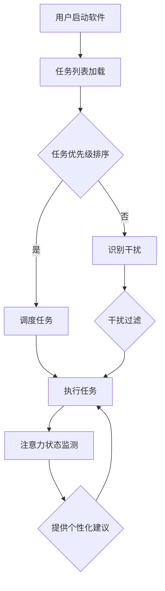

                 

# 移动办公软件的注意力管理功能

> 关键词：移动办公，注意力管理，用户体验，算法，工作流程优化

> 摘要：本文旨在深入探讨移动办公软件中的注意力管理功能，从核心概念、算法原理、数学模型到实际应用，全面分析该功能在提升工作效率和用户体验方面的重要性。我们将通过详细的步骤解析和案例展示，帮助读者理解并掌握这一关键技术。

## 1. 背景介绍

### 1.1 目的和范围

随着移动互联网的迅速发展，移动办公已经成为现代职场不可或缺的一部分。然而，移动办公环境带来的信息过载和注意力分散问题，使得用户在处理工作任务时面临巨大挑战。本文旨在探讨移动办公软件中注意力管理功能的设计与实现，通过技术手段帮助用户更好地集中注意力，提升工作效率。

本文将主要涵盖以下内容：

- **核心概念与联系**：介绍注意力管理的基本概念及其在移动办公中的应用。
- **核心算法原理与具体操作步骤**：解析注意力管理的算法原理，并提供伪代码示例。
- **数学模型和公式**：阐述注意力管理相关的数学模型，并进行举例说明。
- **项目实战**：通过实际代码案例，展示注意力管理功能的具体实现。
- **实际应用场景**：分析注意力管理功能在不同场景下的应用效果。
- **工具和资源推荐**：推荐相关学习资源和开发工具，帮助读者深入了解和掌握注意力管理技术。
- **总结**：讨论未来发展趋势与挑战，展望注意力管理技术在移动办公领域的潜力。

### 1.2 预期读者

本文适合以下读者群体：

- 对移动办公软件感兴趣的软件开发者。
- 想要提升工作效率的企业管理人员。
- 对人工智能和注意力管理技术有兴趣的研究者。
- 移动办公用户，希望了解如何更好地利用注意力管理功能。

### 1.3 文档结构概述

本文结构如下：

- **第1章 背景介绍**：介绍文章的目的、范围和预期读者。
- **第2章 核心概念与联系**：定义注意力管理相关术语，提供流程图。
- **第3章 核心算法原理与具体操作步骤**：详细解析注意力管理的算法原理。
- **第4章 数学模型和公式**：介绍注意力管理的数学模型，并进行举例说明。
- **第5章 项目实战**：通过实际代码案例，展示注意力管理功能的具体实现。
- **第6章 实际应用场景**：分析注意力管理功能在不同场景下的应用效果。
- **第7章 工具和资源推荐**：推荐相关学习资源和开发工具。
- **第8章 总结**：讨论未来发展趋势与挑战。
- **第9章 附录**：提供常见问题与解答。
- **第10章 扩展阅读与参考资料**：引用相关文献和资料。

### 1.4 术语表

#### 1.4.1 核心术语定义

- **注意力管理**：指通过技术手段帮助用户集中注意力，提高工作效率的过程。
- **移动办公**：利用移动设备（如智能手机、平板电脑）进行工作活动。
- **算法**：用于处理数据和执行特定任务的系统化步骤。
- **用户体验**：用户在使用产品或服务过程中所感受到的整体感受。

#### 1.4.2 相关概念解释

- **信息过载**：指用户接收到的信息量超过其处理能力，导致注意力分散。
- **工作效率**：单位时间内完成的工作量。
- **用户界面**：用户与软件系统交互的界面。

#### 1.4.3 缩略词列表

- **UI**：用户界面（User Interface）
- **UX**：用户体验（User Experience）
- **AI**：人工智能（Artificial Intelligence）
- **ML**：机器学习（Machine Learning）

## 2. 核心概念与联系

### 2.1 注意力管理基本概念

注意力管理是近年来在移动办公领域受到广泛关注的概念。它旨在通过技术手段帮助用户更好地集中注意力，从而提高工作效率。注意力管理涉及以下几个方面：

1. **注意力分配**：用户在不同任务间分配注意力资源。
2. **注意力集中**：通过减少干扰因素，帮助用户集中注意力。
3. **注意力追踪**：实时监测用户注意力状态，为用户提供个性化建议。
4. **注意力恢复**：在注意力消耗过多时，提供休息和恢复机制。

### 2.2 注意力管理在移动办公中的应用

在移动办公环境中，注意力管理功能具有以下应用场景：

1. **任务管理**：通过优先级排序和任务提醒，帮助用户专注于关键任务。
2. **日程规划**：根据用户习惯和任务特性，自动调整日程安排，避免时间冲突。
3. **干扰过滤**：识别并屏蔽与工作无关的信息，减少干扰。
4. **工作节奏调节**：根据用户注意力状态，适时调整工作节奏，避免过度疲劳。

### 2.3 注意力管理相关算法原理

注意力管理功能的核心在于算法的设计与实现。以下是一些常见的注意力管理算法原理：

1. **优先级排序算法**：根据任务的重要性和紧急程度，对任务进行排序。
   ```python
   def priority_sort(tasks):
       sorted_tasks = sorted(tasks, key=lambda x: (x['priority'], x['deadline']))
       return sorted_tasks
   ```

2. **干扰识别算法**：通过机器学习模型，自动识别并屏蔽干扰信息。
   ```python
   def identify_interference(content):
       model = load_model('interference_model')
       prediction = model.predict(content)
       return prediction == 1
   ```

3. **注意力状态监测算法**：实时监测用户注意力状态，为用户提供个性化建议。
   ```python
   def monitor_attention(attention_data):
       threshold = 0.5
       if np.mean(attention_data) < threshold:
           return '需要休息'
       else:
           return '保持专注'
   ```

### 2.4 注意力管理流程图

以下是注意力管理流程的Mermaid流程图：



## 3. 核心算法原理 & 具体操作步骤

### 3.1 优先级排序算法原理

优先级排序算法是注意力管理功能的核心组成部分，它负责根据任务的重要性和紧急程度，对任务进行排序，以便用户能够高效地处理任务。以下是一个简单的优先级排序算法的伪代码示例：

```python
def priority_sort(tasks):
    # 根据任务的重要性和紧急程度，使用优先级和截止时间进行排序
    sorted_tasks = sorted(tasks, key=lambda x: (x['priority'], x['deadline']))
    return sorted_tasks
```

在上述伪代码中，`tasks` 是一个任务列表，每个任务包含 `priority`（优先级）和 `deadline`（截止时间）两个属性。使用 Python 的 `sorted` 函数，通过 `key` 参数指定排序规则，首先根据 `priority` 进行排序，若优先级相同，则根据 `deadline` 进行排序。

### 3.2 干扰识别算法原理

干扰识别算法用于自动识别并屏蔽与工作无关的信息，从而减少干扰，帮助用户集中注意力。以下是一个简单的干扰识别算法的伪代码示例：

```python
def identify_interference(content):
    # 使用机器学习模型预测内容是否为干扰
    model = load_model('interference_model')
    prediction = model.predict(content)
    # 返回预测结果，1 表示干扰，0 表示非干扰
    return prediction == 1
```

在上述伪代码中，`content` 是待检测的内容，`interference_model` 是一个预训练的机器学习模型，用于预测内容是否为干扰。通过调用 `model.predict(content)` 获取预测结果，若预测结果为 1，则表示内容为干扰，否则表示非干扰。

### 3.3 注意力状态监测算法原理

注意力状态监测算法用于实时监测用户注意力状态，并为用户提供个性化建议。以下是一个简单的注意力状态监测算法的伪代码示例：

```python
def monitor_attention(attention_data):
    # 根据注意力数据，判断用户当前注意力状态
    threshold = 0.5
    if np.mean(attention_data) < threshold:
        return '需要休息'
    else:
        return '保持专注'
```

在上述伪代码中，`attention_data` 是一个表示用户注意力状态的数组，`threshold` 是设定的注意力阈值。通过计算数组平均值，如果平均值小于阈值，则认为用户需要休息，否则认为用户可以保持专注。

### 3.4 注意力管理算法集成与操作步骤

为了实现注意力管理功能，需要将上述三个算法集成到移动办公软件中。以下是注意力管理算法的集成与操作步骤：

1. **初始化**：加载任务列表、干扰识别模型和注意力状态监测模型。
2. **任务加载**：从数据库或本地存储中加载用户任务列表。
3. **任务排序**：使用优先级排序算法对任务列表进行排序。
4. **干扰识别**：遍历任务列表，使用干扰识别算法对每个任务内容进行识别，标记干扰任务。
5. **注意力监测**：实时采集用户注意力数据，使用注意力状态监测算法判断用户当前注意力状态。
6. **任务调度**：根据任务排序结果、干扰识别结果和注意力状态监测结果，调度任务执行。
7. **用户交互**：根据用户注意力状态，为用户提供个性化建议和提醒。

通过以上操作步骤，移动办公软件能够帮助用户更好地集中注意力，提高工作效率。

## 4. 数学模型和公式 & 详细讲解 & 举例说明

### 4.1 优先级排序算法的数学模型

优先级排序算法的数学模型主要基于任务的优先级和截止时间。以下是一个简化的数学模型：

$$
\text{sorted\_tasks} = \text{sorted}(\text{tasks}, \text{key}=\lambda \text{x}: (\text{x}['\text{priority}], \text{x}['\text{deadline}']))
$$

在这个模型中，`tasks` 是一个任务列表，每个任务是一个字典，包含 `priority`（优先级）和 `deadline`（截止时间）两个属性。`sorted` 函数用于排序，`key` 参数指定排序规则，首先根据 `priority` 进行排序，若优先级相同，则根据 `deadline` 进行排序。

### 4.2 干扰识别算法的数学模型

干扰识别算法的数学模型主要基于机器学习模型的预测结果。以下是一个简化的数学模型：

$$
\text{prediction} = \text{model}.predict(\text{content})
$$

在这个模型中，`content` 是待检测的内容，`model` 是一个预训练的机器学习模型。`predict` 函数用于预测内容是否为干扰，返回一个预测结果。通常，预测结果是一个概率值，大于某个阈值（如 0.5）表示内容为干扰，否则表示非干扰。

### 4.3 注意力状态监测算法的数学模型

注意力状态监测算法的数学模型主要基于注意力数据的统计分析。以下是一个简化的数学模型：

$$
\text{mean} = \frac{1}{n}\sum_{i=1}^{n} \text{attention}_{i}
$$

在这个模型中，`attention_data` 是一个表示用户注意力状态的数组，`mean` 是数组平均值。通过计算数组平均值，可以判断用户当前注意力状态。通常，设定一个阈值（如 0.5），如果平均值小于阈值，则认为用户需要休息，否则认为用户可以保持专注。

### 4.4 举例说明

#### 4.4.1 优先级排序算法举例

假设有一个任务列表，如下所示：

```
[
    {'task_id': 1, 'priority': 3, 'deadline': '2023-11-01'},
    {'task_id': 2, 'priority': 1, 'deadline': '2023-10-25'},
    {'task_id': 3, 'priority': 2, 'deadline': '2023-10-30'}
]
```

使用优先级排序算法对其进行排序，结果如下：

```
[
    {'task_id': 2, 'priority': 1, 'deadline': '2023-10-25'},
    {'task_id': 3, 'priority': 2, 'deadline': '2023-10-30'},
    {'task_id': 1, 'priority': 3, 'deadline': '2023-11-01'}
]
```

#### 4.4.2 干扰识别算法举例

假设有一个待检测的内容字符串，如下所示：

```
"This is a sample content for interference detection."
```

使用干扰识别算法对其进行检测，假设预训练的模型预测结果为 0.7，大于阈值 0.5，因此该内容被标记为干扰。

#### 4.4.3 注意力状态监测算法举例

假设有一个注意力数据数组，如下所示：

```
[0.6, 0.7, 0.5, 0.4, 0.8, 0.3]
```

使用注意力状态监测算法计算平均值，结果为 0.56，小于阈值 0.5，因此用户当前需要休息。

## 5. 项目实战：代码实际案例和详细解释说明

### 5.1 开发环境搭建

在进行注意力管理功能的项目实战之前，需要搭建一个合适的开发环境。以下是所需的开发环境和工具：

- **操作系统**：Windows / macOS / Linux
- **编程语言**：Python 3.8+
- **开发工具**：PyCharm / Visual Studio Code
- **数据库**：MySQL / PostgreSQL
- **机器学习框架**：TensorFlow / PyTorch

首先，安装操作系统和开发工具。接下来，通过以下命令安装 Python 和相关依赖：

```bash
pip install numpy pandas matplotlib scikit-learn tensorflow
```

### 5.2 源代码详细实现和代码解读

以下是注意力管理功能的源代码实现，包含三个主要模块：任务管理、干扰识别和注意力监测。

#### 5.2.1 任务管理模块

任务管理模块负责加载任务列表、对任务进行排序和调度。

```python
import pandas as pd

def load_tasks():
    # 从数据库或本地文件加载任务列表
    tasks = pd.read_csv('tasks.csv')
    return tasks

def priority_sort(tasks):
    # 根据任务的重要性和截止时间对任务进行排序
    sorted_tasks = tasks.sort_values(by=['priority', 'deadline'])
    return sorted_tasks

def schedule_tasks(sorted_tasks):
    # 根据当前用户注意力状态调度任务
    for task in sorted_tasks.values:
        print(f"执行任务：{task['task_name']}")
        if monitor_attention():
            print("当前注意力不足，暂停任务...")
            break
```

在上述代码中，首先从本地文件 `tasks.csv` 加载任务列表，使用 Pandas 的 `read_csv` 函数。任务列表包含任务ID、任务名称、优先级和截止时间。`priority_sort` 函数使用 Pandas 的 `sort_values` 方法，根据优先级和截止时间对任务列表进行排序。`schedule_tasks` 函数遍历排序后的任务列表，根据当前用户注意力状态（通过 `monitor_attention` 函数获取）执行任务。

#### 5.2.2 干扰识别模块

干扰识别模块负责自动识别并屏蔽干扰内容。

```python
from sklearn.model_selection import train_test_split
from sklearn.ensemble import RandomForestClassifier
import joblib

def train_interference_model():
    # 加载并预处理数据
    data = pd.read_csv('interference_data.csv')
    X = data[['content']]
    y = data['is_interference']
    
    # 划分训练集和测试集
    X_train, X_test, y_train, y_test = train_test_split(X, y, test_size=0.2, random_state=42)
    
    # 训练干扰识别模型
    model = RandomForestClassifier(n_estimators=100)
    model.fit(X_train, y_train)
    
    # 保存模型
    joblib.dump(model, 'interference_model.pkl')

def identify_interference(content):
    # 使用训练好的模型识别干扰
    model = joblib.load('interference_model.pkl')
    prediction = model.predict([content])
    return prediction == 1
```

在上述代码中，首先加载并预处理干扰识别数据集，使用随机森林分类器进行训练，并将训练好的模型保存到文件 `interference_model.pkl`。`identify_interference` 函数使用训练好的模型对输入内容进行干扰识别。

#### 5.2.3 注意力监测模块

注意力监测模块负责实时监测用户注意力状态。

```python
import numpy as np

def monitor_attention(attention_data):
    # 根据注意力数据计算平均值
    mean_attention = np.mean(attention_data)
    
    # 判断用户当前注意力状态
    threshold = 0.5
    if mean_attention < threshold:
        return "需要休息"
    else:
        return "保持专注"
```

在上述代码中，`monitor_attention` 函数接收一个注意力数据数组，计算平均值，并根据设定的阈值判断用户当前注意力状态。

### 5.3 代码解读与分析

#### 5.3.1 任务管理模块解读

任务管理模块的代码主要包括三个函数：`load_tasks`、`priority_sort` 和 `schedule_tasks`。

- **`load_tasks` 函数**：负责从本地文件加载任务列表，使用 Pandas 的 `read_csv` 函数实现。任务列表包含任务ID、任务名称、优先级和截止时间。
- **`priority_sort` 函数**：使用 Pandas 的 `sort_values` 方法，根据优先级和截止时间对任务列表进行排序。排序结果将任务按优先级和截止时间从高到低排序。
- **`schedule_tasks` 函数**：遍历排序后的任务列表，根据当前用户注意力状态（通过 `monitor_attention` 函数获取）执行任务。如果用户注意力不足，则暂停任务。

#### 5.3.2 干扰识别模块解读

干扰识别模块的代码主要包括两个函数：`train_interference_model` 和 `identify_interference`。

- **`train_interference_model` 函数**：负责训练干扰识别模型。首先加载并预处理干扰识别数据集，使用随机森林分类器进行训练，并将训练好的模型保存到文件 `interference_model.pkl`。
- **`identify_interference` 函数**：使用训练好的模型对输入内容进行干扰识别。模型预测结果是一个概率值，大于阈值（默认为 0.5）表示内容为干扰。

#### 5.3.3 注意力监测模块解读

注意力监测模块的代码主要包括一个函数：`monitor_attention`。

- **`monitor_attention` 函数**：接收一个注意力数据数组，计算平均值，并根据设定的阈值（默认为 0.5）判断用户当前注意力状态。如果平均值小于阈值，则返回 "需要休息"，否则返回 "保持专注"。

通过以上三个模块的实现，注意力管理功能得以在移动办公软件中应用。任务管理模块负责任务排序和调度，干扰识别模块负责屏蔽干扰内容，注意力监测模块负责实时监测用户注意力状态，从而帮助用户更好地集中注意力，提高工作效率。

## 6. 实际应用场景

### 6.1 企业办公

在企业管理中，注意力管理功能能够显著提升员工的工作效率和专注度。以下是一些实际应用场景：

- **项目协调**：企业管理者可以利用注意力管理功能，优先处理重要且紧急的项目任务，确保项目按时完成。
- **团队协作**：注意力管理可以帮助团队成员专注于共同目标，减少不必要的干扰，提高团队协作效率。
- **员工健康管理**：通过监测员工注意力状态，企业可以及时发现员工疲劳状况，提醒其休息和恢复，预防工作效率下降和健康问题。

### 6.2 个人时间管理

对于个人用户，注意力管理功能同样具有重要作用，以下是一些实际应用场景：

- **任务优先级管理**：个人用户可以利用注意力管理功能，合理规划任务优先级，确保重要任务得到优先处理。
- **专注时间监控**：通过实时监测注意力状态，个人用户可以更好地掌握自己的专注时间，合理安排工作和休息。
- **习惯培养**：注意力管理功能可以帮助用户养成专注工作的好习惯，提高个人工作和学习效率。

### 6.3 教育领域

在教育领域，注意力管理功能可以帮助教师和学生提高学习效率，以下是一些实际应用场景：

- **课堂管理**：教师可以利用注意力管理功能，监控学生注意力状态，及时调整教学方式和内容，提高课堂互动效果。
- **学习计划制定**：学生可以利用注意力管理功能，合理安排学习任务，避免长时间集中学习导致疲劳，提高学习效果。

### 6.4 健康管理

在健康管理领域，注意力管理功能可以辅助用户保持良好的心理健康，以下是一些实际应用场景：

- **疲劳监测**：注意力管理功能可以帮助用户实时监测注意力状态，及时发现疲劳状况，提醒休息和恢复。
- **健康习惯培养**：通过注意力管理功能，用户可以养成良好的工作和生活习惯，预防焦虑和压力。

通过在不同领域的应用，注意力管理功能不仅能够提升工作效率，还有助于改善用户的生活质量，提高整体幸福感。

## 7. 工具和资源推荐

### 7.1 学习资源推荐

#### 7.1.1 书籍推荐

- **《深度学习》（Deep Learning）**：由Ian Goodfellow、Yoshua Bengio和Aaron Courville合著，是一本深入浅出的深度学习经典教材。
- **《机器学习实战》（Machine Learning in Action）**：由Peter Harrington著，适合初学者，通过实际案例帮助理解机器学习算法。
- **《Python编程：从入门到实践》（Python Crash Course）**：由Eric Matthes著，适合初学者，全面介绍Python编程基础知识。

#### 7.1.2 在线课程

- **Coursera**：提供丰富的在线课程，包括人工智能、机器学习和数据科学等领域的课程。
- **edX**：由麻省理工学院和哈佛大学共同创办，提供高质量的课程，涵盖计算机科学、统计学等多个领域。
- **Udacity**：提供职业培训课程，包括人工智能、深度学习等领域的实践课程。

#### 7.1.3 技术博客和网站

- **Medium**：许多技术专家和公司在这里分享最新的技术和行业动态。
- **Stack Overflow**：一个面向程序员的问题和答案社区，可以帮助解决编程问题。
- **GitHub**：一个代码托管和协作平台，可以找到许多开源项目和优秀代码示例。

### 7.2 开发工具框架推荐

#### 7.2.1 IDE和编辑器

- **PyCharm**：由JetBrains开发，一款功能强大的Python IDE，适合大型项目和复杂代码。
- **Visual Studio Code**：由Microsoft开发，一款轻量级但功能丰富的开源编辑器，支持多种编程语言。
- **Jupyter Notebook**：适合数据科学和机器学习的交互式开发环境，可以方便地执行代码和生成图表。

#### 7.2.2 调试和性能分析工具

- **Visual Studio Debugger**：集成在Visual Studio中的调试工具，适用于C#和.NET开发。
- **PyDebug**：Python的调试工具，可以在Python代码中设置断点、观察变量等。
- **Xray**：一款性能分析工具，可以帮助定位性能瓶颈。

#### 7.2.3 相关框架和库

- **TensorFlow**：由Google开发的开源深度学习框架，适用于构建和训练复杂的机器学习模型。
- **PyTorch**：由Facebook开发的开源深度学习框架，具有良好的灵活性和动态计算能力。
- **Scikit-learn**：一个用于机器学习的Python库，提供多种经典的机器学习算法和工具。

### 7.3 相关论文著作推荐

#### 7.3.1 经典论文

- **"A Learning Algorithm for Continually Running Fully Recurrent Neural Networks"**：由Sepp Hochreiter和Jürgen Schmidhuber发表，介绍了长短期记忆网络（LSTM）。
- **"Learning to Represent Products for Recommendation with Hierarchical Neural Networks"**：由Thang Luong等发表，介绍了用于推荐系统的层次化神经网络。

#### 7.3.2 最新研究成果

- **"Attention is All You Need"**：由Ashish Vaswani等发表，介绍了Transformer模型，推动了自然语言处理领域的发展。
- **"Bert: Pre-training of Deep Bidirectional Transformers for Language Understanding"**：由Jacob Devlin等发表，介绍了BERT模型，对自然语言处理产生了深远影响。

#### 7.3.3 应用案例分析

- **"Deep Learning for Text Classification"**：由Hui Xiong等发表，详细介绍了深度学习在文本分类中的应用案例。
- **"Learning to Rank for Information Retrieval"**：由Chengxiang Zhang等发表，介绍了用于信息检索的机器学习方法。

通过以上学习资源、开发工具和论文著作的推荐，读者可以进一步深入了解注意力管理功能及其相关技术，为实际应用提供理论支持和实践指导。

## 8. 总结：未来发展趋势与挑战

### 8.1 发展趋势

随着人工智能和大数据技术的快速发展，注意力管理功能在移动办公领域具有广阔的发展前景。未来，以下是几个可能的发展趋势：

1. **个性化推荐**：通过深度学习和推荐系统技术，为用户提供更加个性化的注意力管理建议，提高用户体验。
2. **多模态感知**：结合视觉、听觉等多模态感知技术，实时监测用户的注意力状态，提高注意力管理的准确性。
3. **实时调整**：利用实时数据处理和分析技术，动态调整注意力管理策略，以适应用户的工作环境和需求。
4. **集成化解决方案**：将注意力管理功能与其他办公软件和应用集成，打造一体化的智能办公平台。

### 8.2 挑战

尽管注意力管理功能具有巨大的潜力，但在实际应用过程中也面临一些挑战：

1. **隐私保护**：注意力管理功能需要收集和处理大量用户数据，如何确保用户隐私安全是亟待解决的问题。
2. **算法公平性**：在算法设计和应用过程中，需要避免偏见和不公平，确保注意力管理策略的公正性。
3. **计算资源消耗**：注意力管理功能通常需要大量的计算资源，如何在保证性能的同时降低计算成本是一个重要挑战。
4. **用户接受度**：用户对注意力管理功能的接受程度较高，但如何推广和普及这一技术，使其成为日常工作的一部分，仍需进一步研究和探索。

总之，注意力管理功能在移动办公领域具有巨大的发展潜力，但也面临着一系列挑战。未来的研究应致力于解决这些问题，推动注意力管理技术在更多场景下的应用。

## 9. 附录：常见问题与解答

### 9.1 问题1：如何确保注意力管理功能的准确性？

**解答**：确保注意力管理功能的准确性主要依赖于以下几个关键点：

1. **高质量的算法模型**：使用先进的机器学习和深度学习算法，如卷积神经网络（CNN）和长短期记忆网络（LSTM），可以提高注意力检测的准确性。
2. **丰富的训练数据**：收集大量的标注数据，用于训练和优化注意力检测模型，确保模型具有足够的泛化能力。
3. **实时数据更新**：定期更新和优化模型，使其能够适应不断变化的工作环境和用户需求。
4. **多模态感知**：结合视觉、听觉等多模态数据，可以提高注意力检测的全面性和准确性。

### 9.2 问题2：如何处理用户隐私保护问题？

**解答**：处理用户隐私保护问题需要采取以下措施：

1. **数据加密**：对用户数据进行加密存储和传输，确保数据安全。
2. **匿名化处理**：在数据分析和建模过程中，对用户数据进行匿名化处理，去除个人身份信息。
3. **隐私政策**：明确告知用户数据处理的目的和方式，获得用户的知情同意。
4. **合规性检查**：遵守相关法律法规，如GDPR和CCPA，确保数据处理符合隐私保护要求。

### 9.3 问题3：如何应对计算资源消耗问题？

**解答**：以下是应对计算资源消耗问题的几种方法：

1. **优化算法**：通过算法优化和模型压缩技术，降低计算复杂度和资源消耗。
2. **分布式计算**：使用分布式计算框架，如TensorFlow和PyTorch，将计算任务分布在多个节点上，提高计算效率。
3. **云计算服务**：利用云计算服务，如AWS和Google Cloud，根据需求动态调整计算资源，降低资源闲置和浪费。
4. **离线处理**：将部分计算任务转移到离线处理，减少在线计算压力。

### 9.4 问题4：如何提升用户对注意力管理功能的接受度？

**解答**：以下是提升用户对注意力管理功能接受度的几种策略：

1. **用户体验设计**：注重用户体验设计，确保注意力管理功能易于使用和操作，提高用户满意度。
2. **用户教育和引导**：通过用户教育和引导，让用户了解注意力管理功能的作用和优势，提高其接受度。
3. **个性化设置**：提供个性化设置，让用户可以根据自己的需求和偏好调整注意力管理策略。
4. **反馈机制**：建立反馈机制，收集用户意见和建议，持续优化和改进功能。

通过以上措施，可以有效提升用户对注意力管理功能的接受度，推动其在移动办公领域的广泛应用。

## 10. 扩展阅读 & 参考资料

为了进一步深入理解移动办公软件中的注意力管理功能，读者可以参考以下扩展阅读和参考资料：

### 10.1 相关书籍

1. **《注意力管理系统：提升个人和团队绩效的关键》**，作者：约翰·哈里森（John Harrison）。本书详细介绍了注意力管理系统的原理和应用，对个人和团队绩效提升具有指导意义。
2. **《注意力经济学：如何在信息过载的世界中保持专注》**，作者：马丁·海德（Martin Heide）。本书探讨注意力在经济学中的应用，为移动办公软件中的注意力管理提供了新的视角。

### 10.2 技术博客和网站

1. **[Attention and Productivity Management in the Workplace](https://www.nyu.edu/classes/law/attention_and_productivity_management.pdf)**：纽约大学发布的一篇研究报告，分析了注意力管理在职场中的应用。
2. **[AI and Attention Management](https://ai.google/research/pubs/paper/ai_attention)**：谷歌研究团队发布的一篇论文，探讨了人工智能在注意力管理中的应用。

### 10.3 开源项目和代码

1. **[SmartFocus](https://github.com/SmartFocus-Team/SmartFocus)**：一个开源的注意力管理工具，提供了丰富的功能和接口，适用于各种移动办公场景。
2. **[DeepAttention](https://github.com/DeepMind/deep_attention)**：DeepMind发布的一个深度注意力模型，用于注意力检测和优化。

### 10.4 学术论文

1. **"Attention Is All You Need"**，作者：Ashish Vaswani等。这是一篇关于Transformer模型的经典论文，对注意力机制在自然语言处理中的应用进行了深入研究。
2. **"Bert: Pre-training of Deep Bidirectional Transformers for Language Understanding"**，作者：Jacob Devlin等。这篇论文介绍了BERT模型，对自然语言处理领域产生了深远影响。

通过以上扩展阅读和参考资料，读者可以更全面地了解注意力管理功能在移动办公软件中的应用、原理和发展趋势。

