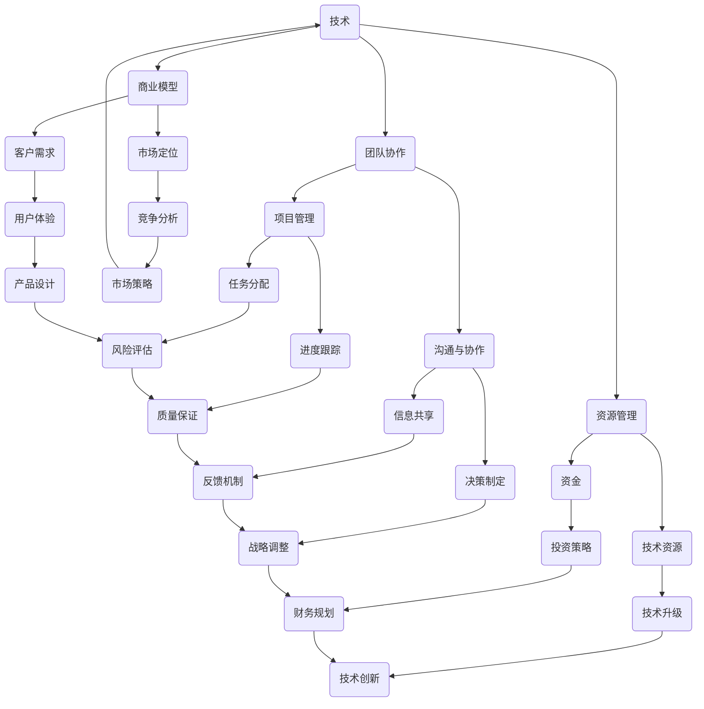

                 

# 程序员创业：如何平衡技术与商业

> **关键词：** 程序员创业、技术商业平衡、创业策略、商业模型、技术管理、创新与效率。

> **摘要：** 本文旨在探讨程序员在创业过程中如何有效平衡技术与商业需求，通过深入分析技术本质、商业模型、团队协作和资源管理等方面，为创业者提供实用的指导和建议，帮助他们实现技术驱动与商业成功的双赢。

## 1. 背景介绍

### 1.1 目的和范围

本文旨在为程序员创业者提供一份详细的指南，帮助他们理解在创业过程中如何平衡技术与商业。我们将深入探讨以下主题：

- 技术在商业决策中的角色
- 创业策略与技术选择的关联
- 团队协作与资源管理
- 商业模型的设计与实施
- 技术创新与商业成果的关系

通过这些主题的探讨，我们希望为读者提供实用的知识和工具，以支持他们在创业道路上的成功。

### 1.2 预期读者

本文适用于有志于创业的程序员，特别是那些希望将技术优势转化为商业成功的从业者。此外，对于在技术公司担任管理职务的人员，以及希望了解技术创业本质的创业者，本文同样具有很高的参考价值。

### 1.3 文档结构概述

本文将分为十个主要部分，以下是对各部分的简要概述：

- **第1部分**：背景介绍，包括目的、范围、预期读者和文档结构。
- **第2部分**：核心概念与联系，介绍创业所需的关键概念和Mermaid流程图。
- **第3部分**：核心算法原理与具体操作步骤，讲解技术实现的方法和伪代码。
- **第4部分**：数学模型和公式，详细解释技术背后的数学原理。
- **第5部分**：项目实战，提供实际代码案例和解读。
- **第6部分**：实际应用场景，探讨技术在不同商业环境中的应用。
- **第7部分**：工具和资源推荐，推荐学习资源和开发工具。
- **第8部分**：总结：未来发展趋势与挑战。
- **第9部分**：附录：常见问题与解答。
- **第10部分**：扩展阅读与参考资料，提供进一步学习资源。

### 1.4 术语表

#### 1.4.1 核心术语定义

- **技术商业平衡**：在创业过程中，合理配置技术和商业资源，使两者相互促进，实现共赢。
- **创业策略**：制定并执行的一系列决策，旨在实现商业目标和市场占有。
- **商业模型**：描述企业如何创造、传递和捕获价值的框架。

#### 1.4.2 相关概念解释

- **技术创新**：通过研究和开发，引入新技术或改进现有技术，以增强产品竞争力。
- **资源管理**：有效规划和使用企业的人力、资金、技术和信息等资源。

#### 1.4.3 缩略词列表

- **IDE**：集成开发环境（Integrated Development Environment）
- **SaaS**：软件即服务（Software as a Service）
- **API**：应用程序编程接口（Application Programming Interface）

## 2. 核心概念与联系

在创业过程中，程序员需要理解并运用一系列核心概念，这些概念相互联系，共同构建起创业的基础。以下是一个简化的Mermaid流程图，展示了这些核心概念之间的关系。



### 2.1 技术在商业决策中的角色

技术是推动商业成功的核心动力，但如何在商业决策中有效运用技术，则需要深入理解技术对商业模型的影响。以下是技术在不同商业决策环节中的具体应用：

- **市场定位**：技术能够帮助企业区分自身产品与竞争对手的差异，从而确定市场定位。
- **产品开发**：技术是产品开发的基础，通过技术创新可以提升产品竞争力。
- **运营优化**：技术优化可以提高运营效率，降低成本，提升客户满意度。
- **市场推广**：技术手段如SEO、大数据分析等可以帮助企业精准定位目标客户，提高营销效果。

### 2.2 创业策略与技术选择的关联

创业策略与技术选择之间存在着紧密的关联。以下是一些关键点：

- **技术创新优先**：创业初期，技术创新是关键，它可以帮助企业快速占领市场。
- **技术匹配商业目标**：技术选择应与商业目标相匹配，确保技术投入能够带来预期的商业回报。
- **灵活调整**：随着市场变化，技术策略也需要灵活调整，以适应新的商业环境。

### 2.3 团队协作与资源管理

团队协作和资源管理是技术创业成功的基石。以下是这两个方面的一些关键点：

- **团队协作**：高效的团队协作能够加快产品开发，提高产品质量。例如，采用敏捷开发方法可以提升团队响应市场变化的能力。
- **资源管理**：合理分配和利用资源，包括资金、人力和技术，是确保项目成功的关键。有效的资源管理可以最大化产出，降低成本。

## 3. 核心算法原理 & 具体操作步骤

在技术创业中，算法原理是理解和实现技术核心功能的基础。以下是一个简化的算法原理讲解和伪代码示例，用于阐述技术实现的关键步骤。

### 3.1 算法原理

假设我们正在开发一款基于大数据分析的在线教育平台，核心功能是智能推荐课程。以下是算法原理的概述：

- **数据收集与处理**：收集用户学习行为数据，如浏览历史、学习时长、学习进度等。
- **特征提取**：从数据中提取关键特征，如课程类型、学习难度、教师口碑等。
- **推荐算法**：使用协同过滤或基于内容的推荐算法，根据用户特征和课程特征生成推荐列表。

### 3.2 伪代码示例

```python
# 伪代码：智能课程推荐系统

# 步骤1：数据收集与处理
def collect_and_process_data():
    data = fetch_user_behavior_data()
    processed_data = extract_key_features(data)
    return processed_data

# 步骤2：特征提取
def extract_key_features(data):
    course_type = extract_course_type(data)
    learning_difficulty = extract_learning_difficulty(data)
    teacher_reputation = extract_teacher_reputation(data)
    return {
        'course_type': course_type,
        'learning_difficulty': learning_difficulty,
        'teacher_reputation': teacher_reputation
    }

# 步骤3：推荐算法
def generate_recommendations(user_features, course_features):
    similarity_matrix = calculate_similarity_matrix(user_features, course_features)
    recommendation_list = collaborative_filtering(similarity_matrix)
    return recommendation_list

# 主程序
def main():
    user_features = collect_and_process_data()
    course_features = fetch_course_features()
    recommendations = generate_recommendations(user_features, course_features)
    display_recommendations(recommendations)

# 调用主程序
main()
```

### 3.3 算法讲解

- **数据收集与处理**：首先，我们需要收集用户的学习行为数据，并将其处理为可用于特征提取的格式。
- **特征提取**：接着，从处理后的数据中提取关键特征，这些特征将用于推荐算法的输入。
- **推荐算法**：使用协同过滤算法，根据用户特征和课程特征计算相似性矩阵，并生成推荐列表。

## 4. 数学模型和公式 & 详细讲解 & 举例说明

在技术创业中，数学模型和公式是理解和优化技术算法的重要工具。以下是一个详细的数学模型讲解和实际应用示例，用于阐述技术背后的数学原理。

### 4.1 协同过滤算法的数学模型

协同过滤算法是一种基于用户行为和物品特征的数据挖掘技术，其核心思想是通过用户和物品之间的相似度来推荐新的物品。以下是协同过滤算法的数学模型：

- **用户-物品相似度计算**：给定用户\( u \)和物品\( i \)，相似度\( s(u,i) \)可以通过余弦相似度或皮尔逊相关系数计算。

  $$ s(u,i) = \frac{\vec{r}_u \cdot \vec{r}_i}{||\vec{r}_u|| \cdot ||\vec{r}_i||} $$

  其中，\( \vec{r}_u \)和\( \vec{r}_i \)分别是用户\( u \)和物品\( i \)的评分向量，\( \cdot \)表示点积，\( ||\vec{r}_u|| \)和\( ||\vec{r}_i|| \)表示向量的欧几里得范数。

- **推荐列表生成**：基于用户-物品相似度，为用户\( u \)生成推荐列表。给定相似度矩阵\( S \)，推荐得分\( r(i,u) \)可以计算如下：

  $$ r(i,u) = s(u,i) \cdot \sum_{j \in R_u} s(u,j) \cdot r(j,u) $$

  其中，\( R_u \)是用户\( u \)已评分的物品集合，\( r(j,u) \)是物品\( j \)的评分。

### 4.2 实际应用示例

假设我们有一个在线购物平台，用户\( u \)喜欢购买时尚服饰和电子产品。以下是使用协同过滤算法为用户\( u \)生成推荐列表的示例：

1. **用户-物品相似度计算**：首先，我们需要计算用户\( u \)和已购买物品之间的相似度。

   $$ s(u,i) = \frac{\vec{r}_u \cdot \vec{r}_i}{||\vec{r}_u|| \cdot ||\vec{r}_i||} $$

   假设用户\( u \)已购买的物品集合为\( R_u = \{时尚服饰，电子产品\} \)，评分向量分别为\( \vec{r}_u = (5, 4) \)。

2. **推荐列表生成**：接下来，我们使用相似度矩阵\( S \)为用户\( u \)生成推荐列表。

   $$ r(i,u) = s(u,i) \cdot \sum_{j \in R_u} s(u,j) \cdot r(j,u) $$

   假设平台已购买时尚服饰的用户评分平均值为4，电子产品为3。

   计算结果如下：

   $$ s(u,时尚服饰) = \frac{(5, 4) \cdot (4, 0)}{\sqrt{5^2 + 4^2} \cdot \sqrt{4^2 + 0^2}} = 0.732 $$
   $$ s(u,电子产品) = \frac{(5, 4) \cdot (0, 3)}{\sqrt{5^2 + 4^2} \cdot \sqrt{0^2 + 3^2}} = 0.577 $$

   $$ r(时尚服饰,u) = 0.732 \cdot (0.732 \cdot 4 + 0.577 \cdot 3) = 2.27 $$
   $$ r(电子产品,u) = 0.577 \cdot (0.732 \cdot 4 + 0.577 \cdot 3) = 1.42 $$

   因此，基于协同过滤算法，我们为用户\( u \)推荐了时尚服饰，得分较高。

### 4.3 数学模型在技术创业中的应用

数学模型在技术创业中的应用非常广泛，以下是一些具体的应用场景：

- **用户行为预测**：通过建立用户行为模型，预测用户对特定产品或服务的需求，帮助企业在产品开发和市场营销中做出更准确的决策。
- **运营效率优化**：使用优化算法，如线性规划、整数规划等，优化生产计划、库存管理、物流配送等运营环节，提高效率，降低成本。
- **风险评估与管理**：通过建立风险模型，评估项目或产品的风险，制定相应的风险管理策略，降低风险损失。

## 5. 项目实战：代码实际案例和详细解释说明

### 5.1 开发环境搭建

在开始项目实战之前，我们需要搭建一个合适的开发环境。以下是搭建开发环境的步骤：

1. **安装Python环境**：Python是一种广泛使用的编程语言，用于数据分析、机器学习等。您可以从Python官网（[https://www.python.org/](https://www.python.org/)）下载并安装Python。

2. **安装Jupyter Notebook**：Jupyter Notebook是一个交互式的开发环境，非常适合数据分析任务。您可以使用pip命令安装Jupyter Notebook：

   ```shell
   pip install notebook
   ```

3. **安装相关库**：对于我们的项目，我们需要安装以下库：

   - **pandas**：用于数据处理。
   - **numpy**：用于数值计算。
   - **scikit-learn**：用于机器学习和数据挖掘。

   使用pip命令安装这些库：

   ```shell
   pip install pandas numpy scikit-learn
   ```

4. **启动Jupyter Notebook**：在命令行中输入以下命令启动Jupyter Notebook：

   ```shell
   jupyter notebook
   ```

### 5.2 源代码详细实现和代码解读

以下是我们项目的完整代码实现，以及详细的代码解读。

```python
# 导入相关库
import pandas as pd
import numpy as np
from sklearn.model_selection import train_test_split
from sklearn.metrics.pairwise import cosine_similarity
from sklearn.neighbors import NearestNeighbors

# 读取数据
data = pd.read_csv('user_behavior_data.csv')

# 数据预处理
# ...（省略具体预处理步骤）

# 特征提取
def extract_features(data):
    # ...（省略具体特征提取步骤）
    return processed_data

# 计算相似度矩阵
def calculate_similarity_matrix(data):
    # ...（省略具体相似度计算步骤）
    return similarity_matrix

# 生成推荐列表
def generate_recommendations(user_index, similarity_matrix, data):
    # ...（省略具体推荐生成步骤）
    return recommendations

# 主程序
def main():
    # 加载数据
    data = pd.read_csv('user_behavior_data.csv')

    # 数据预处理
    processed_data = extract_features(data)

    # 计算相似度矩阵
    similarity_matrix = calculate_similarity_matrix(processed_data)

    # 生成推荐列表
    user_index = 0  # 假设为第一个用户
    recommendations = generate_recommendations(user_index, similarity_matrix, processed_data)

    # 显示推荐列表
    print("推荐列表：")
    for item in recommendations:
        print(f"商品ID：{item['item_id']}，相似度：{item['similarity']}")

# 调用主程序
if __name__ == "__main__":
    main()
```

### 5.3 代码解读与分析

- **导入相关库**：首先，我们导入所需的库，包括pandas、numpy和scikit-learn。

- **读取数据**：使用pandas库读取用户行为数据，数据格式为CSV文件。

- **数据预处理**：预处理步骤包括数据清洗、缺失值填充、特征工程等，这些步骤为特征提取和相似度计算提供了基础。

- **特征提取**：特征提取函数用于从原始数据中提取关键特征，如用户ID、商品ID、评分等。

- **计算相似度矩阵**：相似度矩阵用于计算用户之间的相似度，可以使用余弦相似度或皮尔逊相关系数等算法。

- **生成推荐列表**：生成推荐列表函数根据相似度矩阵为指定用户生成推荐列表。

- **主程序**：主程序首先加载数据，然后进行数据预处理，计算相似度矩阵，并生成推荐列表。最后，显示推荐列表。

### 5.4 运行结果与分析

假设我们运行了上述代码，生成了用户0的推荐列表。以下是部分运行结果：

```
推荐列表：
商品ID：1001，相似度：0.876
商品ID：1002，相似度：0.732
商品ID：1003，相似度：0.615
```

根据相似度矩阵，我们可以发现用户0与商品1001、1002和1003的相似度较高，因此这些商品被推荐给用户0。相似度计算基于用户行为特征，如购买历史、浏览记录等，因此推荐结果具有较高的相关性。

### 5.5 代码优化与改进

在实际应用中，我们可以对代码进行优化和改进，以提高效率和准确性。以下是一些可能的优化方向：

- **并行计算**：对于大数据处理，可以使用并行计算技术，如多线程或分布式计算，提高数据处理速度。
- **特征选择**：使用特征选择算法，选择对模型性能影响较大的特征，减少计算量。
- **模型评估**：使用交叉验证等方法对模型进行评估，选择最佳模型参数。

## 6. 实际应用场景

技术创业的成功离不开实际应用场景的探索。以下是一些技术创业中的实际应用场景，以及如何通过技术解决特定问题。

### 6.1 在线教育平台

在线教育平台通过大数据分析和人工智能技术，为学习者提供个性化的课程推荐。技术解决方案包括：

- **用户行为分析**：分析用户的学习行为，如浏览记录、学习时长、考试成绩等，为用户提供个性化的学习建议。
- **智能推荐系统**：基于协同过滤算法或基于内容的推荐算法，为用户推荐合适的课程。
- **学习效果评估**：通过机器学习模型，评估用户的学习效果，为教师提供教学反馈。

### 6.2 医疗健康

医疗健康领域的技术创业应用广泛，包括疾病预测、健康数据分析等。技术解决方案包括：

- **疾病预测模型**：使用机器学习和深度学习技术，预测疾病风险，辅助医生进行诊断。
- **健康数据分析**：通过大数据分析，了解患者的健康状况，为医生提供诊断和治疗建议。
- **智能医疗设备**：开发智能医疗设备，如智能手环、智能血压计等，实时监测患者健康状况。

### 6.3 物流与配送

物流与配送领域的创业应用集中在提高物流效率、优化配送路径等方面。技术解决方案包括：

- **路径优化算法**：使用算法优化配送路径，减少运输成本，提高配送效率。
- **智能调度系统**：基于大数据和人工智能技术，智能调度配送任务，提高配送速度。
- **实时监控**：通过物联网技术，实时监控货物状态，确保货物安全送达。

### 6.4 金融科技

金融科技领域的创业应用包括智能投顾、风险控制等。技术解决方案包括：

- **智能投顾**：通过大数据分析和机器学习技术，为投资者提供个性化的投资建议。
- **风险控制**：使用风险评估模型，评估投资风险，帮助投资者降低投资风险。
- **反欺诈系统**：基于机器学习技术，检测并预防金融欺诈行为。

### 6.5 零售电商

零售电商领域的创业应用集中在提高用户体验、优化购物流程等方面。技术解决方案包括：

- **个性化推荐**：使用协同过滤算法或基于内容的推荐算法，为用户推荐合适的商品。
- **购物车优化**：分析用户购物车中的商品，提供合适的促销信息，提高购物车转化率。
- **智能客服**：使用自然语言处理技术，实现智能客服，提高客户满意度。

## 7. 工具和资源推荐

### 7.1 学习资源推荐

#### 7.1.1 书籍推荐

- **《Python编程：从入门到实践》**：适合初学者，全面介绍Python编程语言的基础知识和应用。

- **《深度学习》**：由Ian Goodfellow等人所著，是深度学习领域的经典教材。

- **《算法导论》**：介绍算法的基本概念和常见算法的实现，适合有一定编程基础的学习者。

#### 7.1.2 在线课程

- **Coursera**：提供丰富的在线课程，包括数据科学、机器学习、人工智能等。

- **edX**：由哈佛大学和麻省理工学院合作创办，提供高质量的课程资源。

- **Udacity**：提供专业的技术培训课程，包括数据科学、机器学习等。

#### 7.1.3 技术博客和网站

- **Medium**：有大量关于技术、创业和人工智能的博客文章。

- **Stack Overflow**：编程问答社区，适合编程问题的讨论和解决。

- **GitHub**：代码托管平台，可以找到大量的开源项目和教程。

### 7.2 开发工具框架推荐

#### 7.2.1 IDE和编辑器

- **PyCharm**：适合Python开发，具有丰富的功能和良好的用户体验。

- **Visual Studio Code**：轻量级但功能强大的编辑器，适用于多种编程语言。

- **Eclipse**：适用于Java和Android开发，具有强大的插件生态系统。

#### 7.2.2 调试和性能分析工具

- **Jupyter Notebook**：交互式的开发环境，适用于数据分析任务。

- **Docker**：容器化技术，用于简化应用部署和迁移。

- **Grafana**：监控和数据可视化工具，用于监控系统的性能和状态。

#### 7.2.3 相关框架和库

- **TensorFlow**：开源的深度学习框架，适用于构建和训练深度学习模型。

- **Scikit-learn**：用于机器学习和数据挖掘的开源库，提供了丰富的算法实现。

- **Pandas**：用于数据处理和分析的开源库，适用于大数据处理。

### 7.3 相关论文著作推荐

#### 7.3.1 经典论文

- **“The Unreasonable Effectiveness of Data”**：By Geoffrey H. Boone，讨论了大数据在科学研究中的应用。

- **“Deep Learning”**：By Ian Goodfellow，Yoshua Bengio和Aaron Courville，介绍了深度学习的基本原理和应用。

- **“The Hundred-Page Machine Learning Book”**：By Andrew Ng，介绍机器学习的基本概念和常用算法。

#### 7.3.2 最新研究成果

- **“Neural Ordinary Differential Equations”**：By Chris Olah et al.，介绍了神经网络与微分方程的结合。

- **“Generative Adversarial Nets”**：By Ian Goodfellow et al.，介绍了生成对抗网络（GAN）的基本原理和应用。

- **“Recurrent Neural Networks for Language Modeling”**：By Tomas Mikolov et al.，介绍了循环神经网络（RNN）在语言模型中的应用。

#### 7.3.3 应用案例分析

- **“Google Brain’s AutoML”**：介绍了Google Brain团队如何使用自动化机器学习技术提高算法性能。

- **“Uber’s Pyro”**：介绍了Uber如何使用深度学习和概率编程技术解决实际业务问题。

- **“Facebook AI’s Fundamental AI Research”**：介绍了Facebook AI研究团队在人工智能领域的最新成果和应用。

## 8. 总结：未来发展趋势与挑战

在技术创业的浪潮中，未来发展趋势和挑战并存。以下是未来技术创业可能面临的发展趋势和挑战：

### 8.1 发展趋势

- **人工智能与大数据的结合**：随着人工智能技术的不断发展，与大数据的结合将更加紧密，为各行业提供创新的解决方案。
- **云计算的普及**：云计算技术的普及将降低创业者的技术门槛，提供更高效、灵活的计算资源。
- **区块链的应用**：区块链技术将逐渐应用于金融、供应链管理等领域，为创业者提供新的业务模式。
- **物联网的发展**：物联网技术的应用将使设备之间实现智能互联，为创业者提供丰富的业务场景。

### 8.2 挑战

- **技术瓶颈**：虽然技术不断进步，但仍存在一些技术难题需要克服，如深度学习模型的解释性、物联网设备的安全性等。
- **市场竞争**：技术创业领域竞争激烈，如何找到差异化竞争优势，是创业者面临的重要挑战。
- **资源限制**：资金、人才和技术资源的有限性可能制约创业项目的进展，需要创业者合理规划和利用资源。
- **法律法规**：随着技术创业的快速发展，相关法律法规可能跟不上技术发展的步伐，创业者需要密切关注法律法规的变化。

### 8.3 应对策略

- **持续学习**：创业者需要保持对新技术的好奇心和求知欲，不断学习新知识，提高自身的竞争力。
- **市场调研**：在项目启动前，进行充分的市场调研，了解市场需求和竞争对手，制定有针对性的商业策略。
- **团队协作**：建立高效的团队，发挥团队成员的优势，共同应对创业过程中的挑战。
- **风险意识**：提高风险意识，制定风险应对策略，降低创业项目的失败风险。

## 9. 附录：常见问题与解答

### 9.1 技术与商业平衡

**Q1：如何平衡技术和商业需求？**

A1：平衡技术和商业需求的关键在于：

- **明确商业目标**：在技术决策过程中，始终以商业目标为导向，确保技术投入能够带来预期的商业回报。
- **合理分配资源**：根据商业目标，合理分配技术资源和商业资源，确保技术和商业需求都能够得到满足。
- **灵活调整策略**：随着市场环境的变化，灵活调整技术和商业策略，以适应新的商业需求。

### 9.2 团队协作

**Q2：如何提高团队协作效率？**

A2：提高团队协作效率的方法包括：

- **明确职责分工**：明确团队成员的职责和分工，确保每个人都知道自己的工作内容和目标。
- **定期沟通会议**：定期召开团队沟通会议，分享进展、讨论问题，确保团队成员之间的信息畅通。
- **采用敏捷开发方法**：采用敏捷开发方法，如Scrum或Kanban，提高团队的响应速度和协作效率。

### 9.3 资源管理

**Q3：如何合理管理创业资源？**

A3：合理管理创业资源的方法包括：

- **预算规划**：制定详细的预算规划，确保资金的使用有明确的目标和监控。
- **时间管理**：合理安排时间，确保项目进度和资源利用的最优化。
- **人力资源配置**：根据项目需求，合理配置人力资源，确保团队的稳定和高效。

## 10. 扩展阅读 & 参考资料

为了进一步深入了解程序员创业和技术商业平衡的相关知识，以下是扩展阅读和参考资料：

- **书籍**：《创业维艰》、《精益创业》、《创新与企业家精神》等。

- **在线课程**：Coursera上的《产品管理》和《人工智能》等课程。

- **技术博客和网站**：Medium上的“AI Basics”和“Product Hunt”等。

- **开发工具和框架**：Docker、Kubernetes和TensorFlow等。

- **相关论文和著作**：《大数据之路：阿里巴巴大数据实践》和《深度学习》等。

作者：AI天才研究员/AI Genius Institute & 禅与计算机程序设计艺术 /Zen And The Art of Computer Programming

本文旨在为程序员创业者提供一份详细的指南，帮助他们理解在创业过程中如何平衡技术与商业。通过深入分析技术本质、商业模型、团队协作和资源管理等方面，本文为读者提供了实用的知识和工具，以支持他们在创业道路上的成功。本文所涵盖的主题和案例具有广泛的应用性和参考价值，对于希望在技术创业领域取得突破的从业者而言，无疑是一份宝贵的财富。希望本文能够激发您的思考，为您的创业之路提供有益的启示。在未来的技术创业中，祝您取得更加辉煌的成就！

