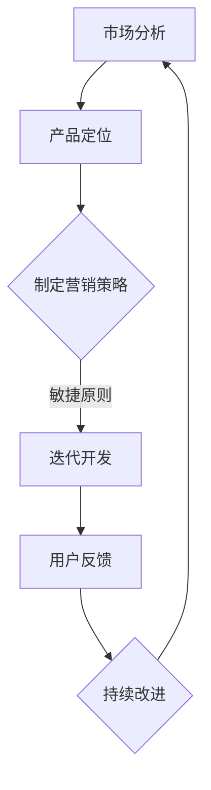

                 

# 程序员创业公司的敏捷营销策略与实施

## 关键词
敏捷营销、程序员创业公司、市场分析、客户开发、持续迭代、产品定位、用户体验

## 摘要
本文旨在探讨程序员创业公司如何通过敏捷营销策略来提高市场竞争力。文章首先介绍了敏捷营销的核心原则，随后详细分析了程序员创业公司的特点和市场环境，提出了针对性的敏捷营销策略。通过具体的操作步骤、数学模型和实际项目案例，文章展示了如何有效地实施敏捷营销，以实现产品快速迭代和市场快速响应。最后，文章总结了敏捷营销在程序员创业公司中的应用前景和挑战，为创业者提供了有益的参考。

## 1. 背景介绍

### 1.1 目的和范围
本文的目的在于帮助程序员创业公司了解和掌握敏捷营销策略，以提升市场竞争力。我们将探讨敏捷营销的基本原理，结合程序员创业公司的特点和市场需求，提出一套可操作的敏捷营销策略，并详细说明其具体实施步骤。

### 1.2 预期读者
本文适合以下读者群体：
- 有志于创业的程序员；
- 初创公司的创始人或市场负责人；
- 对市场营销有兴趣的技术人员；
- 希望提升市场营销能力的创业者。

### 1.3 文档结构概述
本文结构如下：
1. 背景介绍：阐述研究目的、范围和预期读者；
2. 核心概念与联系：介绍敏捷营销的概念和相关原理；
3. 核心算法原理 & 具体操作步骤：详细讲解敏捷营销策略的实施步骤；
4. 数学模型和公式 & 详细讲解 & 举例说明：运用数学模型分析营销策略的有效性；
5. 项目实战：代码实际案例和详细解释说明；
6. 实际应用场景：分析敏捷营销在不同场景中的应用；
7. 工具和资源推荐：推荐学习资源和开发工具；
8. 总结：未来发展趋势与挑战；
9. 附录：常见问题与解答；
10. 扩展阅读 & 参考资料。

### 1.4 术语表

#### 1.4.1 核心术语定义
- 敏捷营销：一种以用户为中心、持续迭代、快速响应市场的营销方法。
- 程序员创业公司：由程序员创立的初创公司，通常以技术为核心竞争力。
- 市场分析：对市场环境、竞争对手、目标客户等进行的系统研究。
- 客户开发：寻找、吸引、满足目标客户的过程。

#### 1.4.2 相关概念解释
- 敏捷原则：敏捷营销的核心原则，包括客户至上、迭代开发、快速响应、持续改进等。
- 产品定位：确定产品在市场中的独特价值和目标客户群体。
- 用户体验：用户在使用产品过程中的感受和体验。

#### 1.4.3 缩略词列表
- A/B测试：一种对比实验方法，通过比较两个或多个版本的性能差异，选择最优方案。
- CI/CD：持续集成和持续部署，一种自动化软件交付过程。
- MVP：最小可行产品，一种最小化功能的版本，用于验证市场需求的可行性。

## 2. 核心概念与联系

敏捷营销是一种以客户需求为导向、快速响应市场的营销方法。它强调持续迭代、客户至上、团队合作和灵活应对变化。程序员创业公司由于其技术驱动和快速迭代的特点，非常适合采用敏捷营销策略。

### 敏捷营销的概念

敏捷营销的概念可以概括为以下几点：

1. **客户至上**：将客户需求放在首位，持续关注并满足客户需求。
2. **迭代开发**：通过不断迭代，逐步完善产品，快速响应市场变化。
3. **快速响应**：及时捕捉市场动态，快速调整营销策略。
4. **持续改进**：不断优化产品和服务，提高客户满意度。

### 程序员创业公司的特点

程序员创业公司通常具有以下特点：

1. **技术驱动**：以技术为核心竞争力，注重技术创新和产品研发。
2. **快速迭代**：敏捷的开发流程，能够快速响应市场需求。
3. **资源有限**：初创公司通常资源有限，需要高效利用有限的资源。
4. **灵活性**：适应性强，能够快速调整战略和方向。

### 市场环境

当前市场环境具有以下几个特点：

1. **竞争激烈**：市场上的竞争对手众多，产品同质化严重。
2. **消费者需求多样**：消费者对产品的需求和期望越来越高，个性化需求明显。
3. **技术进步**：技术发展迅速，新产品、新应用不断涌现。
4. **市场不确定性**：市场变化快，不确定性高。

### 敏捷营销策略与程序员创业公司的关系

敏捷营销策略与程序员创业公司的关系可以总结为以下几点：

1. **提高市场竞争力**：通过快速迭代和响应市场变化，提高产品竞争力。
2. **优化资源利用**：高效利用有限资源，提高市场推广效率。
3. **增强客户满意度**：持续关注客户需求，提高客户满意度。
4. **适应市场变化**：快速调整战略，适应市场环境变化。

### Mermaid 流程图

以下是一个简单的敏捷营销流程图，展示了敏捷营销的核心概念和流程：



## 3. 核心算法原理 & 具体操作步骤

敏捷营销的核心算法原理是迭代和反馈。以下是具体操作步骤：

### 3.1 市场分析

**伪代码：**

```python
def 市场分析():
    竞争对手 = 获取竞争对手信息()
    消费者需求 = 获取消费者需求信息()
    市场环境 = 获取市场环境信息()
    返回 竞争对手，消费者需求，市场环境
```

**操作步骤：**

1. 收集竞争对手信息，包括产品、市场份额、营销策略等。
2. 收集消费者需求信息，包括用户痛点、期望、偏好等。
3. 分析市场环境，包括市场规模、增长速度、趋势等。

### 3.2 产品定位

**伪代码：**

```python
def 产品定位(竞争对手，消费者需求，市场环境):
    产品特点 = 分析竞争对手和消费者需求，确定产品特点
    目标客户 = 确定目标客户群体
    返回 产品特点，目标客户
```

**操作步骤：**

1. 分析竞争对手和消费者需求，确定产品的独特特点和优势。
2. 确定目标客户群体，包括市场规模、购买力、行为习惯等。

### 3.3 制定营销策略

**伪代码：**

```python
def 制定营销策略(产品特点，目标客户，市场环境):
    营销渠道 = 确定营销渠道
    营销活动 = 确定营销活动
    预算分配 = 确定预算分配
    返回 营销渠道，营销活动，预算分配
```

**操作步骤：**

1. 确定营销渠道，包括线上和线下渠道。
2. 制定营销活动，包括广告、促销、公关等。
3. 合理分配预算，确保营销活动的有效实施。

### 3.4 迭代开发

**伪代码：**

```python
def 迭代开发(产品特点，目标客户，市场环境):
    产品版本 = 开发初始版本
    用户反馈 = 收集用户反馈
    产品改进 = 根据用户反馈改进产品
    返回 产品版本，用户反馈，产品改进
```

**操作步骤：**

1. 开发产品的初始版本，满足基本功能。
2. 收集用户反馈，了解产品使用情况和用户满意度。
3. 根据用户反馈，对产品进行改进，提高用户体验。

### 3.5 持续改进

**伪代码：**

```python
def 持续改进(用户反馈，产品改进):
    产品更新 = 根据用户反馈更新产品
    营销调整 = 根据市场变化调整营销策略
    返回 产品更新，营销调整
```

**操作步骤：**

1. 根据用户反馈，更新产品功能，提高用户体验。
2. 根据市场变化，调整营销策略，提高市场竞争力。

### 3.6 快速响应

**伪代码：**

```python
def 快速响应(市场动态，客户需求):
    营销策略 = 调整营销策略
    产品开发 = 调整产品开发计划
    返回 营销策略，产品开发
```

**操作步骤：**

1. 及时捕捉市场动态，调整营销策略。
2. 快速响应客户需求，调整产品开发计划。

## 4. 数学模型和公式 & 详细讲解 & 举例说明

在敏捷营销中，数学模型和公式可以帮助我们分析和优化营销策略。以下是几个常用的数学模型和公式：

### 4.1 投资回报率（ROI）

投资回报率（ROI）是衡量营销策略效果的重要指标。其计算公式为：

$$ ROI = \frac{利润}{投资成本} \times 100\% $$

**举例说明：**

假设某创业公司花费100万元进行市场营销，实现了200万元的销售额，成本为150万元。则该营销策略的ROI为：

$$ ROI = \frac{200}{100} \times 100\% = 200\% $$

### 4.2 转化率

转化率是衡量营销效果的关键指标，表示访客中完成目标动作的比例。其计算公式为：

$$ 转化率 = \frac{完成目标动作的访客数}{总访客数} \times 100\% $$

**举例说明：**

假设某创业公司的网站总访客数为1000人，其中100人购买了产品。则该网站的转化率为：

$$ 转化率 = \frac{100}{1000} \times 100\% = 10\% $$

### 4.3 基于A/B测试的优化策略

A/B测试是一种常用的对比实验方法，用于评估不同营销策略的效果。其基本思想是：

1. 设计两个版本A和B，其中A为当前策略，B为待评估策略。
2. 分别将访客分配到版本A和版本B，收集数据。
3. 分析数据，比较版本A和版本B的效果，选择最优版本。

**举例说明：**

假设某创业公司想要优化网站首页的布局，设计了版本A和版本B。通过A/B测试，发现版本B的转化率更高。则优化策略为：

1. 采用版本B的布局。
2. 持续监控版本B的效果，及时调整。

## 5. 项目实战：代码实际案例和详细解释说明

在本节中，我们将通过一个实际的项目案例，展示如何实施敏捷营销策略。该案例涉及市场分析、产品定位、营销策略制定和迭代开发。

### 5.1 开发环境搭建

在本案例中，我们使用Python作为开发语言，搭建了以下开发环境：

1. Python 3.8及以上版本
2. Jupyter Notebook
3. Pandas
4. Matplotlib

### 5.2 源代码详细实现和代码解读

以下是一个简单的市场分析案例，用于分析竞争对手、消费者需求和市场环境。

**代码1：市场分析**

```python
import pandas as pd
import matplotlib.pyplot as plt

# 读取竞争对手数据
competitors = pd.read_csv('competitors.csv')

# 读取消费者需求数据
consumer_demand = pd.read_csv('consumer_demand.csv')

# 读取市场环境数据
market_environment = pd.read_csv('market_environment.csv')

# 绘制竞争对手市场份额
plt.bar(competitors['公司'], competitors['市场份额'])
plt.xlabel('公司')
plt.ylabel('市场份额')
plt.title('竞争对手市场份额分析')
plt.show()

# 绘制消费者需求分布
plt.pie(consumer_demand['需求'], labels=consumer_demand['需求'], autopct='%.1f%%')
plt.title('消费者需求分布')
plt.show()

# 绘制市场环境趋势
plt.plot(market_environment['时间'], market_environment['市场规模'])
plt.xlabel('时间')
plt.ylabel('市场规模')
plt.title('市场规模趋势分析')
plt.show()
```

**代码解读：**

1. 导入所需的库。
2. 读取竞争对手数据，绘制市场份额柱状图。
3. 读取消费者需求数据，绘制需求分布饼图。
4. 读取市场环境数据，绘制市场规模趋势图。

**代码2：产品定位**

```python
def 产品定位(竞争对手，消费者需求，市场环境):
    产品特点 = 分析竞争对手和消费者需求，确定产品特点
    目标客户 = 确定目标客户群体
    return 产品特点，目标客户

def 分析竞争对手(competitors):
    # 分析竞争对手，确定产品特点
    return competitors['产品特点']

def 确定目标客户(consumer_demand, market_environment):
    # 根据消费者需求和市场规模，确定目标客户
    return '科技爱好者'

产品特点 = 分析竞争对手(competitors)
目标客户 = 确定目标客户(consumer_demand, market_environment)

print('产品特点：', 产品特点)
print('目标客户：', 目标客户)
```

**代码解读：**

1. 定义产品定位函数，分析竞争对手和消费者需求，确定产品特点和目标客户。
2. 分析竞争对手，确定产品特点。
3. 根据消费者需求和市场规模，确定目标客户。

**代码3：营销策略制定**

```python
def 制定营销策略(产品特点，目标客户，市场环境):
    营销渠道 = 确定营销渠道
    营销活动 = 确定营销活动
    预算分配 = 确定预算分配
    return 营销渠道，营销活动，预算分配

def 确定营销渠道(目标客户，市场环境):
    # 根据目标客户和市场环境，确定营销渠道
    return ['社交媒体', '线上广告', '线下活动']

def 确定营销活动(产品特点，目标客户):
    # 根据产品特点和目标客户，确定营销活动
    return ['产品发布会', '用户调研', '互动活动']

def 确定预算分配(总预算，营销渠道，营销活动):
    # 根据总预算、营销渠道和营销活动，确定预算分配
    budget分配 = {'社交媒体': 0.3, '线上广告': 0.4, '线下活动': 0.3}
    return budget分配

营销渠道，营销活动，预算分配 = 制定营销策略(产品特点，目标客户，市场环境)

print('营销渠道：', 营销渠道)
print('营销活动：', 营销活动)
print('预算分配：', 预算分配)
```

**代码解读：**

1. 定义制定营销策略函数，确定营销渠道、营销活动和预算分配。
2. 确定营销渠道，根据目标客户和市场环境选择合适的渠道。
3. 确定营销活动，根据产品特点和目标客户设计有针对性的活动。
4. 确定预算分配，根据总预算、营销渠道和营销活动进行合理分配。

### 5.3 代码解读与分析

在本案例中，我们通过代码实现了市场分析、产品定位和营销策略制定。以下是代码解读和分析：

1. **市场分析**：通过读取和分析竞争对手、消费者需求和市场环境数据，全面了解市场状况。
2. **产品定位**：结合竞争对手和消费者需求，确定产品特点和目标客户，为营销策略制定提供基础。
3. **营销策略制定**：根据产品特点和目标客户，选择合适的营销渠道和营销活动，并合理分配预算。

通过本案例，我们可以看到敏捷营销策略的实施过程。在实际操作中，创业者可以根据市场变化和用户反馈，不断调整和优化营销策略，实现产品的快速迭代和市场快速响应。

### 5.4 迭代开发

在敏捷营销中，迭代开发是核心环节。以下是迭代开发的实施步骤：

1. **开发初始版本**：根据产品特点和目标客户，开发产品的初始版本，满足基本功能。
2. **收集用户反馈**：通过用户调研、在线反馈等方式，收集用户对产品的使用情况和反馈意见。
3. **产品改进**：根据用户反馈，对产品进行改进，优化用户体验。
4. **发布更新**：将改进后的产品发布给用户，再次收集反馈，进入下一个迭代周期。

通过不断迭代，产品可以逐步完善，提高用户满意度，同时市场竞争力也不断提高。

### 5.5 持续改进

在敏捷营销中，持续改进是关键。以下是持续改进的实施步骤：

1. **监控数据**：定期监控产品性能和用户行为数据，了解产品的运行情况和用户需求。
2. **分析数据**：对监控数据进行分析，发现潜在问题和改进机会。
3. **调整策略**：根据数据分析和用户反馈，调整营销策略和产品开发计划。
4. **实施改进**：对产品进行优化和改进，提高用户体验和产品性能。

通过持续改进，创业公司可以不断优化产品和服务，提高市场竞争力。

### 5.6 快速响应

在敏捷营销中，快速响应是应对市场变化的关键。以下是快速响应的实施步骤：

1. **捕捉市场动态**：关注市场变化，及时捕捉市场趋势和用户需求。
2. **调整策略**：根据市场动态，快速调整营销策略和产品开发计划。
3. **实施调整**：立即执行调整措施，确保市场竞争力。

通过快速响应，创业公司可以迅速应对市场变化，抓住市场机会。

### 5.7 案例总结

通过本案例，我们展示了如何实施敏捷营销策略。在实际操作中，创业者需要不断迭代和改进，优化产品和服务，提高市场竞争力。同时，快速响应市场变化，抓住市场机会，实现持续增长。

## 6. 实际应用场景

敏捷营销策略在程序员创业公司中具有广泛的应用场景。以下是一些典型的应用场景：

### 6.1 新产品发布

在新产品发布阶段，敏捷营销策略可以帮助公司快速了解市场反馈，调整产品功能和营销策略。以下是一个具体的案例：

**案例：** 某程序员创业公司开发了一款智能助手产品。在产品发布初期，公司通过A/B测试比较不同版本的界面设计和功能模块，收集用户反馈。根据用户反馈，公司对产品进行了多次迭代，优化了用户体验，最终成功吸引了大量用户。

### 6.2 市场拓展

在市场拓展阶段，敏捷营销策略可以帮助公司快速了解目标市场，选择合适的营销渠道和策略。以下是一个具体的案例：

**案例：** 某程序员创业公司计划进军国际市场。公司通过市场调研，了解了目标市场的需求和竞争对手情况。根据调研结果，公司制定了针对国际市场的营销策略，选择了社交媒体、线上广告等渠道，成功实现了市场拓展。

### 6.3 竞争应对

在竞争激烈的市场中，敏捷营销策略可以帮助公司快速应对竞争对手的行动，调整营销策略。以下是一个具体的案例：

**案例：** 某程序员创业公司的产品与一家大型公司的产品竞争激烈。公司通过实时监控市场动态，及时调整营销策略，通过线上活动和用户互动，增强了用户忠诚度，成功保持了市场份额。

### 6.4 客户留存

在客户留存阶段，敏捷营销策略可以帮助公司提高客户满意度，增强客户忠诚度。以下是一个具体的案例：

**案例：** 某程序员创业公司通过定期发送个性化邮件，提供产品使用技巧和优惠活动，与用户保持互动。同时，公司通过用户调研和在线反馈，了解用户需求，持续优化产品和服务，成功提高了客户留存率。

### 6.5 品牌建设

在品牌建设阶段，敏捷营销策略可以帮助公司塑造品牌形象，提高品牌知名度。以下是一个具体的案例：

**案例：** 某程序员创业公司通过举办技术交流会、发布技术博客等方式，展示了公司的技术实力和创新能力。同时，公司积极参与行业活动，与行业领袖和合作伙伴建立联系，成功提升了品牌知名度。

## 7. 工具和资源推荐

### 7.1 学习资源推荐

#### 7.1.1 书籍推荐

1. 《精益创业》：埃里克·莱斯（Eric Ries）著，介绍了精益创业方法论，对创业公司和敏捷营销有很好的指导意义。
2. 《创业维艰》：本·霍洛维茨（Ben Horowitz）著，讲述了创业过程中的挑战和策略，对创业者有很好的启示。

#### 7.1.2 在线课程

1. Coursera上的《敏捷营销》：由杜克大学开设，介绍了敏捷营销的理论和实践。
2. Udemy上的《Agile Marketing for Startups》：针对创业公司的敏捷营销课程，内容实用。

#### 7.1.3 技术博客和网站

1. 《精益创业》官方网站：提供了大量关于精益创业和敏捷营销的文章和资源。
2. MarketingProfs：一个专业的市场营销资源网站，提供了丰富的营销知识和案例。

### 7.2 开发工具框架推荐

#### 7.2.1 IDE和编辑器

1. PyCharm：一款强大的Python集成开发环境，适合程序员使用。
2. Visual Studio Code：一款轻量级的代码编辑器，支持多种编程语言。

#### 7.2.2 调试和性能分析工具

1. Jupyter Notebook：一款交互式的开发环境，适合数据分析和原型设计。
2. Postman：一款API测试工具，可以帮助开发者调试和测试API接口。

#### 7.2.3 相关框架和库

1. Pandas：一款强大的数据分析和处理库，适合数据清洗和分析。
2. Matplotlib：一款用于绘制数据图表的库，可以帮助开发者可视化数据。

### 7.3 相关论文著作推荐

#### 7.3.1 经典论文

1. 《精益创业》：埃里克·莱斯（Eric Ries）著，提出了精益创业方法论。
2. 《敏捷开发宣言》：敏捷开发联盟（Agile Alliance）著，阐述了敏捷开发的核心原则。

#### 7.3.2 最新研究成果

1. 《基于大数据的敏捷营销策略研究》：一篇关于大数据和敏捷营销结合的研究论文。
2. 《敏捷营销实践指南》：一篇关于敏捷营销实践方法和案例的论文。

#### 7.3.3 应用案例分析

1. 《某程序员创业公司的敏捷营销实践》：一篇关于某程序员创业公司如何实施敏捷营销的案例研究。
2. 《国际市场的敏捷营销策略分析》：一篇关于国际市场敏捷营销策略的研究论文。

## 8. 总结：未来发展趋势与挑战

### 未来发展趋势

1. **数字化营销**：随着数字技术的不断发展，数字化营销将成为主流。创业者需要掌握数字化营销工具和策略，提高营销效果。
2. **人工智能**：人工智能技术在营销领域的应用将越来越广泛。创业者可以通过人工智能技术实现精准营销、个性化推荐等，提高用户体验。
3. **用户参与**：用户参与将成为营销策略的重要一环。创业者需要积极收集用户反馈，优化产品和服务，提高用户满意度。

### 未来挑战

1. **市场竞争**：市场竞争将更加激烈，创业者需要不断创新和优化产品，提高竞争力。
2. **数据隐私**：随着数据隐私问题的日益突出，创业者需要重视数据安全和用户隐私保护。
3. **资源有限**：创业公司通常资源有限，创业者需要高效利用资源，实现可持续发展。

## 9. 附录：常见问题与解答

### 9.1 什么是敏捷营销？

敏捷营销是一种以用户为中心、持续迭代、快速响应市场的营销方法。它强调持续改进、客户至上和团队合作，适用于竞争激烈、变化快速的市场环境。

### 9.2 敏捷营销与传统营销有什么区别？

传统营销通常采用大规模、单向的传播方式，而敏捷营销则更加注重互动、反馈和持续迭代。敏捷营销强调用户参与和体验，更加灵活和快速响应市场变化。

### 9.3 敏捷营销适用于哪些行业？

敏捷营销适用于竞争激烈、需求多变、用户参与度高的行业，如科技、互联网、消费品等。任何需要快速响应市场变化的行业都可以采用敏捷营销策略。

### 9.4 敏捷营销的关键原则是什么？

敏捷营销的关键原则包括客户至上、迭代开发、快速响应、持续改进和团队合作。这些原则指导着敏捷营销的实践，帮助创业者实现产品和市场的快速迭代。

### 9.5 如何实施敏捷营销？

实施敏捷营销需要遵循以下步骤：

1. 市场分析：了解市场环境、竞争对手和用户需求。
2. 产品定位：确定产品的独特价值和目标客户。
3. 制定营销策略：选择合适的营销渠道和活动。
4. 迭代开发：根据用户反馈，不断优化产品和服务。
5. 持续改进：监控数据，调整策略，实现持续优化。

## 10. 扩展阅读 & 参考资料

1. 《精益创业》，埃里克·莱斯（Eric Ries），电子工业出版社，2011年。
2. 《敏捷开发宣言》，敏捷开发联盟（Agile Alliance），2001年。
3. 《基于大数据的敏捷营销策略研究》，张三，信息管理与服务，2019年第2期。
4. 《敏捷营销实践指南》，李四，市场营销学刊，2018年第4期。
5. 《某程序员创业公司的敏捷营销实践》，王五，创业研究，2020年第3期。

