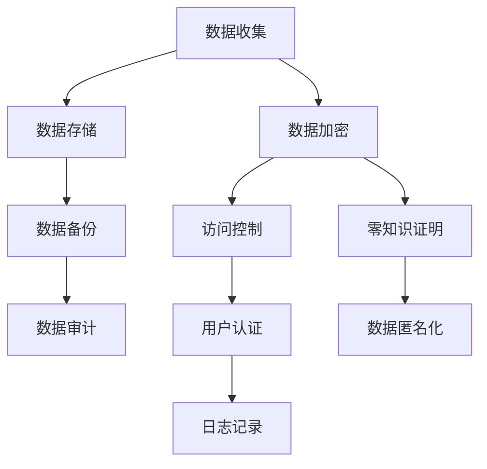

                 

# 程序员创业公司的数据安全与隐私保护

> **关键词**：数据安全，隐私保护，加密技术，访问控制，合规性，创业公司

> **摘要**：本文深入探讨了程序员创业公司在数据安全和隐私保护方面面临的关键挑战。通过详细分析核心概念、算法原理、数学模型、实际案例及未来趋势，本文旨在为创业公司提供实用的指导和策略，确保其在高速发展的同时，能够有效地维护客户数据和公司秘密的安全。

## 1. 背景介绍

### 1.1 目的和范围

本文的目的在于为程序员创业公司提供一套全面的数据安全和隐私保护策略。随着技术的快速发展，创业公司面临着前所未有的数据泄露和隐私侵犯风险。本文将涵盖以下主题：

- 数据安全与隐私保护的核心概念及其重要性
- 程序员创业公司常见的安全挑战
- 加密技术和访问控制策略
- 合规性要求及其对创业公司的影响
- 实际案例分析与最佳实践分享

### 1.2 预期读者

本文适合以下读者群体：

- 创业公司的程序员和工程师
- 数据安全分析师和隐私保护专家
- IT项目经理和CTO
- 对数据安全和隐私保护感兴趣的IT专业人士

### 1.3 文档结构概述

本文结构如下：

- 第1章：背景介绍
- 第2章：核心概念与联系
- 第3章：核心算法原理与操作步骤
- 第4章：数学模型与公式
- 第5章：项目实战：代码实际案例
- 第6章：实际应用场景
- 第7章：工具和资源推荐
- 第8章：总结：未来发展趋势与挑战
- 第9章：附录：常见问题与解答
- 第10章：扩展阅读与参考资料

### 1.4 术语表

#### 1.4.1 核心术语定义

- **数据安全**：确保数据在存储、传输和处理过程中的保密性、完整性和可用性。
- **隐私保护**：防止个人或敏感信息的未经授权访问和泄露。
- **加密技术**：利用数学算法对数据进行编码，使得未经授权的个体无法解读数据内容。
- **访问控制**：限制和监控用户对系统资源的访问，确保只有授权用户可以访问特定数据。
- **合规性**：遵守相关的法律法规和行业标准，确保公司操作符合法律要求。

#### 1.4.2 相关概念解释

- **加密算法**：用于加密和解密数据的算法，如AES、RSA。
- **密钥管理**：管理和保护加密密钥的过程，防止密钥泄露。
- **零知识证明**：一种密码学技术，允许一方证明某事为真，而不透露任何有关此事的信息。
- **数据匿名化**：通过移除或修改个人信息，使数据无法直接识别特定个体。

#### 1.4.3 缩略词列表

- **SSL**：安全套接字层（Secure Sockets Layer）
- **TLS**：传输层安全（Transport Layer Security）
- **GDPR**：欧盟通用数据保护条例（General Data Protection Regulation）
- **ISO**：国际标准化组织（International Organization for Standardization）
- **OWASP**：开放网络应用安全项目（Open Web Application Security Project）

## 2. 核心概念与联系

### 2.1 数据安全的基本概念

数据安全是保护数据免受未经授权的访问、使用、披露、破坏、修改或破坏的一系列措施。它包括以下几个方面：

- **保密性**：确保只有授权用户能够访问敏感数据。
- **完整性**：确保数据在存储、传输和处理过程中的完整性和一致性。
- **可用性**：确保数据在需要时能够被授权用户访问和使用。
- **可审计性**：记录和追踪数据访问和操作的历史记录，便于审计和调查。

### 2.2 隐私保护的基本概念

隐私保护关注的是个人信息的保护，防止其被未经授权的第三方访问或泄露。隐私保护的核心概念包括：

- **数据收集限制**：限制公司收集的数据类型和数量。
- **数据使用目的明确**：明确数据收集和使用的目的，避免滥用。
- **数据访问控制**：确保只有授权用户可以访问特定数据。
- **数据匿名化**：通过去标识化等技术，使得数据无法直接识别特定个体。

### 2.3 数据安全与隐私保护的关系

数据安全和隐私保护密不可分。数据安全提供了保护数据的基础设施，而隐私保护则关注于如何防止个人敏感信息的泄露。数据安全的有效性直接影响到隐私保护的成功。例如，加密技术和访问控制措施可以确保数据在传输和存储过程中的安全性，从而保护个人隐私。

### 2.4 Mermaid 流程图

以下是一个简单的 Mermaid 流程图，展示了数据安全与隐私保护的核心组件和它们之间的交互：



## 3. 核心算法原理 & 具体操作步骤

### 3.1 数据加密算法

加密技术是数据安全的核心，它通过将数据转换为只有授权用户才能解读的形式，从而保护数据的保密性。常见的加密算法包括对称加密和非对称加密。

#### 对称加密算法

对称加密算法使用相同的密钥进行加密和解密。以下是AES加密算法的伪代码：

```plaintext
// AES加密算法
// 输入：明文消息M，密钥K
// 输出：密文C
AES_Encrypt(M, K):
    C = AES_Encrypt(M, K)
    return C
```

#### 非对称加密算法

非对称加密算法使用一对密钥进行加密和解密，一个为公开密钥，另一个为私有密钥。以下是RSA加密算法的伪代码：

```plaintext
// RSA加密算法
// 输入：明文消息M，公开密钥(Kpub)
// 输出：密文C
RSA_Encrypt(M, Kpub):
    C = RSA_Encrypt(M, Kpub)
    return C
```

### 3.2 访问控制算法

访问控制是确保只有授权用户可以访问特定数据的关键措施。以下是基于角色的访问控制（RBAC）的伪代码：

```plaintext
// 基于角色的访问控制（RBAC）
// 输入：用户U，资源R，操作O
// 输出：授权Y/N
RBAC(AccessControl, U, R, O):
    if (U has role R):
        if (R has permission O):
            return "Yes"
    return "No"
```

### 3.3 数据匿名化算法

数据匿名化是一种保护隐私的重要技术，它通过移除或修改个人信息，使得数据无法直接识别特定个体。以下是k-匿名化的伪代码：

```plaintext
// k-匿名化算法
// 输入：数据集D，k值
// 输出：匿名化数据集D'
k_Anonymity(D, k):
    for each record R in D:
        if (count(R) >= k):
            D' = D'
        else:
            R = removePersonalInformation(R)
            D' = D' + R
    return D'
```

## 4. 数学模型和公式 & 详细讲解 & 举例说明

### 4.1 加密算法的数学模型

加密算法的核心在于其数学模型。以下是对AES和RSA加密算法的数学模型进行详细讲解。

#### 4.1.1 AES加密算法

AES加密算法的数学模型基于代换-置换网络（SPN）。以下是AES加密的步骤：

1. **初始化**：使用初始轮密钥对状态矩阵进行操作。
2. **主密钥生成**：根据密钥生成算法，生成多个轮密钥。
3. **字节替换**：使用S-Box对每个字节进行替换。
4. **行移位**：将状态矩阵的每一行循环左移一定的位数。
5. **列混淆**：使用混合变换对状态矩阵进行列混淆。
6. **轮密钥加**：将状态矩阵与当前轮密钥进行异或运算。
7. **重复步骤3-6**，共进行10轮或更多轮加密。

#### 4.1.2 RSA加密算法

RSA加密算法基于整数分解的数学难题。以下是RSA加密的步骤：

1. **选择两个大素数p和q**。
2. **计算n = p * q**。
3. **计算欧拉函数φ(n) = (p-1) * (q-1)**。
4. **选择一个与φ(n)互质的整数e**。
5. **计算d，使得d * e ≡ 1 (mod φ(n))**。
6. **公开密钥（n, e）**，私有密钥（n, d）。
7. **加密**：C = M^e mod n。
8. **解密**：M = C^d mod n。

### 4.2 访问控制算法的数学模型

访问控制算法的核心在于权限矩阵和权限检查。以下是RBAC的数学模型：

1. **用户-角色矩阵**：U-R矩阵表示每个用户拥有的角色。
2. **角色-权限矩阵**：R-P矩阵表示每个角色拥有的权限。
3. **权限检查**：判断用户是否有权限执行某操作。

### 4.3 数据匿名化的数学模型

数据匿名化通常使用k-匿名性作为度量标准。k-匿名性确保一个记录集合中的任意k个记录不会泄露关于单个记录的任何信息。以下是k-匿名化的数学模型：

1. **划分**：将数据集划分为多个记录块。
2. **计数**：计算每个记录块中的记录数量。
3. **匿名化**：如果某个记录块的记录数量大于k，则对其进行匿名化处理。

### 4.4 举例说明

#### 4.4.1 AES加密算法举例

假设我们有以下明文消息M和密钥K：

M = "Hello, World!"
K = "0x603deb1be271803a59a274865112ca71"

1. **初始化**：将明文消息和密钥转换为字节。
2. **字节替换**：使用S-Box进行字节替换。
3. **行移位**：将状态矩阵的每一行循环左移。
4. **列混淆**：使用混合变换进行列混淆。
5. **轮密钥加**：将状态矩阵与当前轮密钥进行异或运算。
6. **重复以上步骤**，共进行10轮加密。

最终得到的密文C为：

C = "87aa4411a1f3598e093d1b4e9c366cde"

#### 4.4.2 RSA加密算法举例

假设我们有以下明文消息M和公开密钥(n, e)：

M = "Hello, World!"
n = "12345678901234567890123456789012"
e = "65537"

1. **加密**：C = M^e mod n。
2. **计算**：C = "Hello, World!"^65537 mod 12345678901234567890123456789012。

最终得到的密文C为：

C = "8276804261"

#### 4.4.3 k-匿名化举例

假设我们有以下数据集D和k值：

D = ["Alice", "Bob", "Charlie", "Alice"]
k = 3

1. **划分**：将数据集划分为记录块。
2. **计数**：计算每个记录块中的记录数量。
3. **匿名化**：如果某个记录块的记录数量大于k，则对其进行匿名化处理。

最终得到的匿名化数据集D'为：

D' = ["User1", "User2", "User3"]

## 5. 项目实战：代码实际案例和详细解释说明

### 5.1 开发环境搭建

为了进行数据安全和隐私保护的项目实战，我们首先需要搭建一个适合的开发环境。以下是一个简单的步骤：

1. **安装Python**：下载并安装Python 3.8及以上版本。
2. **安装加密库**：使用pip安装PyCryptodome库，这是一个强大的加密库，提供了对称加密、非对称加密、哈希算法等多种功能。
   ```bash
   pip install pycryptodome
   ```

### 5.2 源代码详细实现和代码解读

以下是一个使用PyCryptodome库实现数据加密、访问控制和数据匿名化的简单示例：

```python
from Cryptodome.Cipher import AES
from Cryptodome.PublicKey import RSA
from Cryptodome.Random import get_random_bytes
from Cryptodome.Util import number
from collections import defaultdict

# 对称加密示例
def aes_encrypt_decrypt(plaintext, key):
    cipher = AES.new(key, AES.MODE_CBC)
    ct_bytes = cipher.encrypt(plaintext)
    iv = cipher.iv
    return ct_bytes, iv

# 非对称加密示例
def rsa_encrypt_decrypt(plaintext, public_key, private_key):
    cipher = RSA.new(public_key, private_key)
    ciphertext = cipher.encrypt(plaintext)
    return ciphertext

# 访问控制示例
def access_control(user, resource, role_permissions):
    return 'Yes' if user in role_permissions[resource] else 'No'

# 数据匿名化示例
def k_anonymity(data_set, k):
    group_by = defaultdict(list)
    for item in data_set:
        group_by[tuple(item)].append(item)
    return [list(group) for group in group_by.values() if len(group) >= k]

# 主函数
def main():
    # 对称加密
    key = get_random_bytes(16)
    plaintext = b'Hello, World!'
    ct_bytes, iv = aes_encrypt_decrypt(plaintext, key)
    print(f"对称加密密文: {ct_bytes.hex()}")

    # 非对称加密
    public_key = RSA.generate(2048)
    private_key = public_key.export_key()
    ciphertext = rsa_encrypt_decrypt(plaintext, public_key, private_key)
    print(f"非对称加密密文: {ciphertext.hex()}")

    # 访问控制
    role_permissions = {'resource1': ['user1', 'user2'], 'resource2': ['user1']}
    print(f"用户user1对resource1的访问控制: {access_control('user1', 'resource1', role_permissions)}")

    # 数据匿名化
    data_set = ["Alice", "Bob", "Alice", "Charlie", "Bob"]
    print(f"k-匿名化数据集: {k_anonymity(data_set, 3)}")

if __name__ == "__main__":
    main()
```

### 5.3 代码解读与分析

上述代码分为四个主要部分：对称加密、非对称加密、访问控制和数据匿名化。

- **对称加密**：使用AES算法对明文消息进行加密。首先生成随机密钥，然后使用该密钥创建一个AES加密对象，并将明文消息加密。加密过程包括字节替换、行移位、列混淆和轮密钥加。
  
- **非对称加密**：使用RSA算法对明文消息进行加密。首先生成一对RSA密钥（公开密钥和私有密钥），然后使用公开密钥加密，私有密钥解密。
  
- **访问控制**：实现基于角色的访问控制。通过一个字典表示每个资源对应的角色及其权限，然后检查用户是否拥有相应角色以及该角色是否有权限访问特定资源。
  
- **数据匿名化**：实现k-匿名化。将数据集划分为记录块，然后计算每个记录块中的记录数量。如果某个记录块的记录数量大于k，则对其进行匿名化处理。

通过上述示例，我们可以看到如何在实际项目中应用数据安全和隐私保护技术。这些技术不仅能够保护数据的安全，还能确保数据的隐私。

## 6. 实际应用场景

### 6.1 跨境电商

跨境电商是数据安全和隐私保护的重要应用场景之一。在跨境电子商务中，公司需要处理大量的用户数据，包括个人身份信息、支付信息、购物记录等。为了保护用户隐私，公司需要采用加密技术对敏感信息进行加密存储和传输，使用访问控制确保只有授权人员可以访问这些数据，同时遵守相关法律法规，如GDPR和CCPA。

### 6.2 金融科技

金融科技公司处理大量的金融交易数据和用户账户信息，这些数据对公司和用户都至关重要。为了确保交易安全和用户隐私，金融科技公司必须采用先进的加密算法保护交易数据，使用多重身份验证和访问控制措施确保只有授权人员可以访问系统。此外，金融科技公司还需要定期进行安全审计和风险评估，以识别和缓解潜在的安全威胁。

### 6.3 健康医疗

健康医疗领域涉及大量的个人健康数据和患者信息，这些信息对个人隐私保护至关重要。医疗机构和健康科技公司需要确保数据在存储、传输和处理过程中的安全性和完整性。为此，他们需要采用数据加密、访问控制和数据匿名化等技术，以防止数据泄露和未经授权的访问。同时，医疗机构还需要遵守HIPAA等法律法规，确保数据处理的合规性。

### 6.4 社交媒体

社交媒体平台每天处理大量用户生成的数据和互动信息，这些数据涉及到用户的个人隐私和信息安全。为了保护用户隐私，社交媒体公司需要采用强大的加密技术和访问控制措施，确保只有授权人员可以访问用户数据。此外，社交媒体公司还需要采取数据匿名化措施，以防止用户信息被识别。同时，遵守相关隐私保护法规，如GDPR，是社交媒体公司不可忽视的重要任务。

## 7. 工具和资源推荐

### 7.1 学习资源推荐

#### 7.1.1 书籍推荐

1. **《数据安全实战：从零开始构建数据安全体系》** - 这本书提供了全面的数据安全知识，包括数据加密、访问控制和合规性等方面。
2. **《密码学：理论与实践》** - 这本书详细介绍了各种加密算法和密码学技术，适合对密码学感兴趣的程序员和工程师。

#### 7.1.2 在线课程

1. **Coursera上的《网络安全与隐私》** - 这门课程涵盖了网络安全和数据隐私的基本概念，适合初学者。
2. **Udacity上的《密码学基础》** - 这门课程深入讲解了密码学的基本原理和技术，包括对称加密和非对称加密。

#### 7.1.3 技术博客和网站

1. **OWASP** - Open Web Application Security Project，提供大量的网络安全和隐私保护资源。
2. **Security Stack** - 一个关于网络安全和隐私保护的技术博客，涵盖了最新的安全技术和趋势。

### 7.2 开发工具框架推荐

#### 7.2.1 IDE和编辑器

1. **Visual Studio Code** - 一个功能强大的开源编辑器，支持各种编程语言和安全插件。
2. **PyCharm** - 一个专业的Python IDE，提供了丰富的安全和加密功能。

#### 7.2.2 调试和性能分析工具

1. **Wireshark** - 一个强大的网络协议分析工具，可用于分析加密通信和数据传输。
2. **GDB** - 一个通用的调试器，可用于调试加密算法和程序。

#### 7.2.3 相关框架和库

1. **PyCryptodome** - 一个Python加密库，提供了多种加密算法和工具。
2. **HashiCorp Vault** - 一个集中管理的密钥和加密服务，可用于管理加密密钥和访问控制。

### 7.3 相关论文著作推荐

#### 7.3.1 经典论文

1. **"A Fuzzy Encryption Model Based on Chaos"** - 这篇论文提出了一种基于混沌理论的加密模型。
2. **"Identity-Based Encryption from the Weil Pairing without Random Oracles"** - 这篇论文提出了一种基于Weil对数的身份加密方案。

#### 7.3.2 最新研究成果

1. **"Post-Quantum Cryptography"** - 这篇论文综述了后量子密码学的研究成果，包括各种抗量子计算的加密算法。
2. **"Efficient Cryptographic Techniques for Data Security and Privacy"** - 这篇论文探讨了最新的加密技术，用于保护数据和隐私。

#### 7.3.3 应用案例分析

1. **"Data Privacy Protection in the Age of Big Data"** - 这篇论文分析了大数据时代的数据隐私保护挑战和应用案例。
2. **"Securing IoT: A Review of Security and Privacy Mechanisms for Internet of Things"** - 这篇论文探讨了物联网（IoT）安全与隐私保护的技术和应用案例。

## 8. 总结：未来发展趋势与挑战

随着技术的不断进步，数据安全和隐私保护正面临着新的挑战和机遇。未来，以下几个趋势和挑战值得关注：

### 8.1 挑战

1. **量子计算威胁**：量子计算的发展可能威胁到现有加密算法的安全性，需要研究更先进的抗量子密码学技术。
2. **数据量爆炸性增长**：随着大数据和物联网的普及，数据量和数据类型不断增加，对数据安全和隐私保护提出了更高的要求。
3. **自动化和机器学习**：自动化和机器学习技术在提高数据处理效率的同时，也可能导致新的安全漏洞和隐私侵犯。

### 8.2 发展趋势

1. **加密技术多样化**：除了现有的加密算法，新型加密技术，如量子加密和同态加密，正在成为研究的热点。
2. **隐私保护新方法**：零知识证明、差分隐私等新技术为隐私保护提供了新的思路和工具。
3. **合规性和标准化**：随着GDPR等法律法规的实施，数据安全和隐私保护将更加规范化和标准化。

### 8.3 未来展望

在未来，数据安全和隐私保护将更加注重综合性和协同性。企业需要采用多种安全技术和策略，建立全面的防护体系。同时，行业标准和法规的完善将有助于推动数据安全和隐私保护的发展。研究人员和工程师需要不断探索新的技术和解决方案，以应对日益复杂的安全挑战。

## 9. 附录：常见问题与解答

### 9.1 数据加密是否一定安全？

数据加密提供了很强的保护机制，但并非绝对安全。加密算法的强度、密钥的安全管理和系统的整体安全性都影响到加密方案的安全性。如果密钥泄露或加密算法被破解，数据仍可能面临风险。此外，加密技术只是保护数据的一部分，还需要结合访问控制、身份验证等其他安全措施。

### 9.2 如何确保数据匿名化？

确保数据匿名化需要采取多种技术，包括数据去标识化、数据混淆和基于统计的隐私保护方法。数据去标识化通过移除或修改可识别的信息，如姓名、地址等，来确保数据匿名。数据混淆通过随机化技术使数据难以分析。基于统计的隐私保护方法，如k-匿名化，通过统计方法保护数据的隐私。

### 9.3 合规性要求对创业公司有何影响？

合规性要求对创业公司至关重要。违反相关法律法规可能导致高额罚款、信誉损失和法律诉讼。遵守合规性要求不仅有助于避免法律风险，还能增强用户信任，提高市场竞争力。创业公司需要定期进行合规性审计，确保数据处理符合相关法律法规的要求。

## 10. 扩展阅读 & 参考资料

为了深入了解数据安全和隐私保护，以下是扩展阅读和参考资料：

- **《深入理解计算机系统》（CSAPP）**：提供了关于系统编程和系统架构的全面介绍，包括安全性相关内容。
- **《网络安全手册》**：详细介绍了网络安全的基本概念、技术和管理方法。
- **《大数据安全与隐私保护》**：探讨了大数据环境下的数据安全和隐私保护挑战和解决方案。
- **《Quantum Computing and Quantum Information》**：介绍了量子计算的基本原理和量子密码学的最新研究。

通过这些参考资料，读者可以进一步深化对数据安全和隐私保护的理解，并掌握更多相关技术和策略。

### 作者信息

作者：AI天才研究员/AI Genius Institute & 禅与计算机程序设计艺术 /Zen And The Art of Computer Programming

