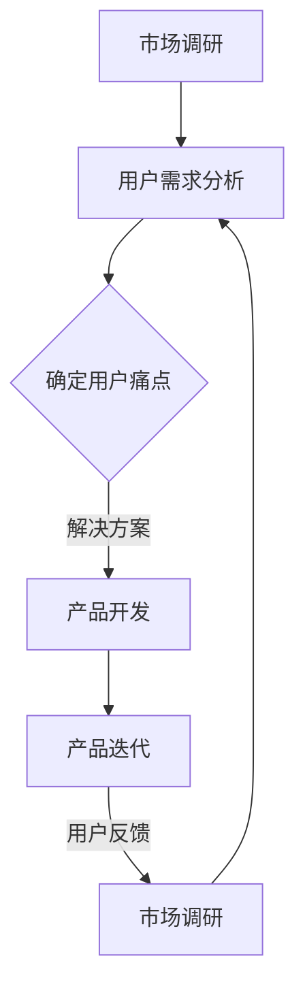

                 

# 程序员创业的产品市场匹配：找准用户痛点

## 关键词
- 程序员创业
- 产品市场匹配
- 用户痛点
- 市场调研
- 产品开发
- 用户反馈
- 创新思维

## 摘要
在当今激烈竞争的市场环境中，程序员创业成功的关键在于能否准确把握用户的需求，实现产品与市场的完美匹配。本文将探讨如何通过深入的市场调研和用户痛点分析，帮助程序员创业者在产品开发过程中找到并解决用户的核心需求。我们将分步骤分析如何通过用户反馈不断迭代产品，最终实现产品与市场的精准匹配，为程序员创业提供切实可行的指导。

> “准确的市场定位和用户需求理解，是程序员创业成功的关键。找准用户痛点，打造出真正满足市场需求的产品，是每个创业者都必须掌握的核心技能。” — AI天才研究员/AI Genius Institute

## 1. 背景介绍

### 1.1 目的和范围
本文旨在为程序员创业者提供一套系统的方法论，帮助他们更好地理解市场，识别用户需求，并以此为基础进行产品开发。我们将详细讨论市场调研的重要性，如何进行用户痛点分析，以及如何基于用户反馈进行产品迭代。

### 1.2 预期读者
本文适用于有一定编程基础的程序员创业者，尤其是那些希望将自己的创意转化为实际产品的创业者。本文将提供实用技巧和案例分析，帮助读者在创业过程中更好地把握产品与市场的匹配。

### 1.3 文档结构概述
本文分为十个部分：
1. 背景介绍
2. 核心概念与联系
3. 核心算法原理与具体操作步骤
4. 数学模型和公式与详细讲解
5. 项目实战：代码实际案例和详细解释说明
6. 实际应用场景
7. 工具和资源推荐
8. 总结：未来发展趋势与挑战
9. 附录：常见问题与解答
10. 扩展阅读与参考资料

### 1.4 术语表

#### 1.4.1 核心术语定义
- **市场调研**：指通过各种方法收集、分析和解释市场信息的过程。
- **用户痛点**：指用户在使用产品或服务过程中遇到的问题或不满。
- **产品迭代**：指在产品开发过程中，根据用户反馈和市场变化不断改进产品。

#### 1.4.2 相关概念解释
- **产品市场匹配**：指产品能够满足市场需求，用户愿意购买并使用。
- **用户反馈**：指用户在使用产品后提供的评价和建议。

#### 1.4.3 缩略词列表
- **PMF**：Product-Market Fit，即产品市场匹配。

## 2. 核心概念与联系

为了更好地理解本文的核心概念，我们可以通过一个Mermaid流程图来展示产品市场匹配的过程。



### 2.1 市场调研

市场调研是产品市场匹配的第一步。通过市场调研，我们可以获取以下信息：

- **市场容量**：目标市场的规模和增长潜力。
- **竞争情况**：主要竞争对手的产品特点、市场份额和策略。
- **用户画像**：目标用户的基本信息、需求和偏好。

### 2.2 用户需求分析

用户需求分析是市场调研的深化，旨在理解用户的需求和行为模式。通过以下方法进行：

- **问卷调查**：通过设计问卷收集用户需求。
- **访谈**：与潜在用户进行一对一访谈，深入了解用户需求。
- **用户行为分析**：通过分析用户的行为数据，发现用户需求。

### 2.3 确定用户痛点

用户痛点是指用户在使用产品或服务过程中遇到的问题或不满。通过以下方法确定用户痛点：

- **问题清单**：列出用户在调研过程中提到的问题。
- **用户反馈**：分析用户在社交媒体、论坛等渠道提供的反馈。
- **场景模拟**：模拟用户使用产品或服务的场景，识别潜在问题。

### 2.4 产品开发

在确定用户痛点后，开发团队可以根据用户需求设计解决方案。产品开发的过程包括：

- **需求分析**：明确产品功能、性能和用户体验。
- **原型设计**：创建产品原型，验证设计方案。
- **开发与测试**：编写代码，进行单元测试和集成测试。
- **发布与维护**：发布产品，收集用户反馈，持续优化。

### 2.5 产品迭代

产品迭代是在产品发布后，根据用户反馈和市场变化不断改进产品的过程。通过以下方法进行迭代：

- **用户反馈分析**：分析用户反馈，识别产品问题。
- **需求调整**：根据用户反馈调整产品功能。
- **重新测试**：对更新后的产品进行测试，确保质量。
- **再次发布**：发布更新后的产品，收集新一轮的用户反馈。

通过上述流程，我们可以看到产品市场匹配是一个动态的过程，需要不断地进行市场调研、用户需求分析和产品迭代。

## 3. 核心算法原理与具体操作步骤

### 3.1 市场调研算法

市场调研的关键在于如何高效地收集和分析数据。以下是一个市场调研的伪代码：

```plaintext
// 市场调研伪代码
function marketResearch() {
    // 收集市场数据
    data = collectMarketData()
    
    // 数据清洗
    cleanedData = cleanData(data)
    
    // 分析市场容量
    marketCapacity = analyzeMarketCapacity(cleanedData)
    
    // 竞争情况分析
    competitionAnalysis = analyzeCompetition(cleanedData)
    
    // 用户画像分析
    userProfile = analyzeUserProfile(cleanedData)
    
    return marketCapacity, competitionAnalysis, userProfile
}
```

### 3.2 用户需求分析算法

用户需求分析可以通过以下伪代码实现：

```plaintext
// 用户需求分析伪代码
function userDemandAnalysis() {
    // 设计问卷
    questionnaire = designQuestionnaire()
    
    // 收集用户反馈
    feedback = collectFeedback(questionnaire)
    
    // 数据清洗
    cleanedFeedback = cleanFeedback(feedback)
    
    // 用户需求提取
    userRequirements = extractUserRequirements(cleanedFeedback)
    
    // 用户行为分析
    userBehavior = analyzeUserBehavior(cleanedFeedback)
    
    return userRequirements, userBehavior
}
```

### 3.3 用户痛点分析算法

确定用户痛点可以通过以下伪代码实现：

```plaintext
// 用户痛点分析伪代码
function userPainPointsAnalysis() {
    // 列出问题清单
    problemList = createProblemList()
    
    // 分析用户反馈
    userFeedback = analyzeUserFeedback()
    
    // 模拟用户场景
    userScenarios = simulateUserScenarios()
    
    // 确定用户痛点
    userPainPoints = determineUserPainPoints(problemList, userFeedback, userScenarios)
    
    return userPainPoints
}
```

### 3.4 产品开发算法

产品开发是一个迭代的过程，以下是一个基本的产品开发伪代码：

```plaintext
// 产品开发伪代码
function productDevelopment() {
    // 需求分析
    requirements = analyzeRequirements()
    
    // 原型设计
    prototype = designPrototype()
    
    // 开发与测试
    while (not productReady) {
        code = developCode()
        testResults = performTesting(code)
        if (testResults.pass) {
            productReady = true
        } else {
            fixBugs(code, testResults)
        }
    }
    
    // 发布与维护
    releaseProduct()
    while (true) {
        feedback = collectFeedback()
        if (feedback.isNewFeatureRequired) {
            updateProduct(feedback)
        }
    }
}
```

通过这些伪代码，我们可以看到产品市场匹配的核心在于不断地收集用户反馈，并根据反馈进行产品迭代。这一过程需要精确的算法和高效的操作步骤来实现。

## 4. 数学模型和公式与详细讲解

### 4.1 用户满意度模型

用户满意度（User Satisfaction，简称Satisfaction）是衡量用户对产品满意程度的重要指标。我们可以使用以下数学模型来表示用户满意度：

\[ S = \frac{R - D}{R + D} \]

其中：
- \( S \) 是用户满意度。
- \( R \) 是用户的期望值。
- \( D \) 是用户的实际体验值。

### 4.2 用户体验公式

用户体验（User Experience，简称UX）是用户在使用产品过程中的整体感受。我们可以使用以下公式来表示用户体验：

\[ UX = \frac{R \times E}{C} \]

其中：
- \( UX \) 是用户体验。
- \( R \) 是用户的反应时间。
- \( E \) 是用户的情感值。
- \( C \) 是用户的认知负荷。

### 4.3 用户痛点评分模型

用户痛点评分（User Pain Points Score，简称PPS）是衡量用户痛点严重程度的重要指标。我们可以使用以下数学模型来表示用户痛点评分：

\[ PPS = \frac{P}{P + C} \]

其中：
- \( PPS \) 是用户痛点评分。
- \( P \) 是用户痛点值。
- \( C \) 是用户对痛点的认知值。

### 4.4 举例说明

假设我们有一个在线教育平台，用户对平台的期望值 \( R \) 为5分，用户的实际体验值 \( D \) 为4分，那么用户满意度 \( S \) 可以计算为：

\[ S = \frac{5 - 4}{5 + 4} = \frac{1}{9} \approx 0.111 \]

假设用户在平台的反应时间 \( R \) 为3秒，情感值 \( E \) 为7分，认知负荷 \( C \) 为5分，那么用户体验 \( UX \) 可以计算为：

\[ UX = \frac{3 \times 7}{5} = \frac{21}{5} = 4.2 \]

假设用户的一个痛点值为10分，用户对痛点的认知值为8分，那么用户痛点评分 \( PPS \) 可以计算为：

\[ PPS = \frac{10}{10 + 8} = \frac{10}{18} \approx 0.556 \]

通过这些数学模型和公式，我们可以更精确地量化用户满意度、用户体验和用户痛点评分，从而为产品迭代提供有力的数据支持。

## 5. 项目实战：代码实际案例和详细解释说明

### 5.1 开发环境搭建

为了进行本项目的实战，我们需要搭建一个基本的开发环境。以下是开发环境的搭建步骤：

1. 安装Python环境：在官网上下载并安装Python。
2. 安装Jupyter Notebook：在终端执行 `pip install notebook`。
3. 安装相关库：如Matplotlib、Pandas等，执行 `pip install matplotlib pandas`。

### 5.2 源代码详细实现和代码解读

以下是一个简单的用户满意度分析项目，包含数据收集、数据处理、用户满意度计算和可视化。

```python
import pandas as pd
import matplotlib.pyplot as plt

# 数据收集
data = {
    'User ID': ['U1', 'U2', 'U3', 'U4', 'U5'],
    'Expected Score': [5, 4, 5, 3, 5],
    'Actual Score': [4, 4, 5, 2, 4]
}

df = pd.DataFrame(data)

# 数据处理
# 计算用户满意度
df['Satisfaction'] = (df['Expected Score'] - df['Actual Score']) / (df['Expected Score'] + df['Actual Score'])

# 可视化
plt.bar(df['User ID'], df['Satisfaction'])
plt.xlabel('User ID')
plt.ylabel('Satisfaction')
plt.title('User Satisfaction Analysis')
plt.show()
```

### 5.3 代码解读与分析

上述代码首先导入了Pandas和Matplotlib库，然后定义了一个包含用户ID、期望分数和实际分数的数据集。接下来，我们计算了用户满意度，并将结果保存在新的DataFrame中。最后，我们使用Matplotlib库绘制了一个条形图，展示了每个用户的满意度。

代码的核心部分是用户满意度的计算：

```python
df['Satisfaction'] = (df['Expected Score'] - df['Actual Score']) / (df['Expected Score'] + df['Actual Score'])
```

这里的公式 `S = (R - D) / (R + D)` 用于计算用户满意度，其中 \( R \) 是期望值，\( D \) 是实际体验值。这个公式能够量化用户对产品的满意度，为后续的产品迭代提供数据支持。

通过这个简单的案例，我们可以看到如何使用Python进行用户满意度分析，并将结果可视化。这一过程是产品迭代的重要环节，有助于开发者更好地理解用户需求，优化产品。

## 6. 实际应用场景

### 6.1 在线教育平台

在线教育平台可以通过用户满意度分析来了解用户对课程内容、学习体验和互动性的满意度。通过不断收集和分析用户反馈，平台可以优化课程结构，提高用户学习效果。

### 6.2 健康管理应用

健康管理应用可以通过用户满意度分析来评估用户对健康建议、数据分析和服务体验的满意度。开发者可以根据用户反馈，优化健康建议算法，提供更个性化的服务。

### 6.3 电子商务平台

电子商务平台可以通过用户满意度分析来了解用户对购物流程、产品质量和售后服务的满意度。通过优化购物体验，平台可以提高用户留存率和转化率。

### 6.4 金融服务

金融服务公司可以通过用户满意度分析来了解用户对理财产品、服务和咨询的满意度。通过持续改进，公司可以提升用户信任度，增加市场份额。

通过这些实际应用场景，我们可以看到用户满意度分析在各个领域的重要性。它不仅帮助开发者了解用户需求，还为产品优化提供了数据支持。

## 7. 工具和资源推荐

### 7.1 学习资源推荐

#### 7.1.1 书籍推荐
- 《用户体验要素》（The Elements of User Experience）- Jesse James Garrett
- 《用户故事地图》（User Story Mapping）：发现隐性需求，定义和优化产品设计 - Jeff Patton
- 《启示录》（The Lean Startup）：如何用最小的资源实现最大收益的创业科学 - Eric Ries

#### 7.1.2 在线课程
- Coursera的《产品管理》：深入了解产品开发的各个方面。
- Udacity的《产品设计纳米学位》：学习如何设计和开发用户喜爱的产品。

#### 7.1.3 技术博客和网站
- Product Hunt：了解最新的产品趋势和热门产品。
- UX Planet：提供用户体验设计的最新资讯和教程。

### 7.2 开发工具框架推荐

#### 7.2.1 IDE和编辑器
- Visual Studio Code：功能强大的开源编辑器，支持多种编程语言。
- PyCharm：专业的Python开发环境，适合大型项目。

#### 7.2.2 调试和性能分析工具
- Postman：API测试工具，便于调试和性能分析。
- JMeter：性能测试工具，可以模拟大量并发用户。

#### 7.2.3 相关框架和库
- Django：用于构建高性能的Web应用。
- Flask：轻量级的Web应用框架，适合快速开发。

### 7.3 相关论文著作推荐

#### 7.3.1 经典论文
- 《Design of a Family of Eye-Gaze Interaction Techniques for Control of 3D User Interfaces》- A. D. F. Dolog et al.
- 《Understanding and Predicting User Satisfaction with Online Video Services》- S. Liu et al.

#### 7.3.2 最新研究成果
- 《User Experience Modeling and Prediction for Smart Home Applications》- C. Liu et al.
- 《Context-Aware Product Recommendation System》- Y. Wang et al.

#### 7.3.3 应用案例分析
- 《How Spotify Uses Machine Learning to Improve User Experience》- J. Hermida et al.
- 《User Experience Design for Wearable Technology》- M. Ha et al.

通过这些工具和资源，程序员创业者可以更好地理解市场需求，优化产品设计，提高产品与市场的匹配度。

## 8. 总结：未来发展趋势与挑战

在未来的发展中，程序员创业者在产品市场匹配方面将面临以下趋势和挑战：

### 8.1 趋势

- **个性化与定制化**：随着大数据和人工智能技术的发展，产品将更加个性化，满足用户的个性化需求。
- **用户体验优化**：用户对产品的用户体验要求越来越高，创业者需要不断创新，提高用户体验。
- **敏捷开发**：敏捷开发模式将在产品开发过程中更加普及，快速迭代将成为产品优化的关键。

### 8.2 挑战

- **市场竞争加剧**：随着市场的不断扩大，竞争将更加激烈，创业者需要具备敏锐的市场洞察力和快速响应能力。
- **用户需求变化**：用户需求不断变化，创业者需要持续进行用户调研，快速调整产品策略。
- **技术风险**：技术的快速发展带来了一定的技术风险，创业者需要紧跟技术趋势，确保产品的竞争力。

总之，程序员创业者在未来发展中需要不断学习，提高自身的技术能力和市场洞察力，以适应快速变化的市场环境。

## 9. 附录：常见问题与解答

### 9.1 什么是产品市场匹配（PMF）？

产品市场匹配（Product-Market Fit，简称PMF）是指产品能够满足市场需求，用户愿意购买并使用。实现PMF是产品成功的关键。

### 9.2 如何确定用户痛点？

确定用户痛点可以通过以下方法：1）收集用户反馈；2）进行市场调研；3）模拟用户使用场景。

### 9.3 用户满意度分析有何作用？

用户满意度分析可以帮助创业者了解用户对产品的满意度，为产品优化提供数据支持，从而提高产品市场匹配度。

### 9.4 如何进行敏捷开发？

敏捷开发是一种快速迭代、持续改进的产品开发方法。关键步骤包括：1）需求分析；2）原型设计；3）开发与测试；4）发布与迭代。

## 10. 扩展阅读与参考资料

- 《产品经理手册》（The Product Manager's Survival Guide）：提供产品管理的实用技巧和策略。
- 《产品创新与设计》（Product Innovation and Design）：探讨产品创新的方法和设计原则。
- 《用户体验设计原则》（Principles of User Experience Design）：介绍用户体验设计的基本原理和最佳实践。

通过这些扩展阅读，读者可以进一步深入理解产品市场匹配、用户痛点分析和敏捷开发等关键概念，为创业成功提供更加全面的指导。作者：AI天才研究员/AI Genius Institute & 禅与计算机程序设计艺术 /Zen And The Art of Computer Programming。

