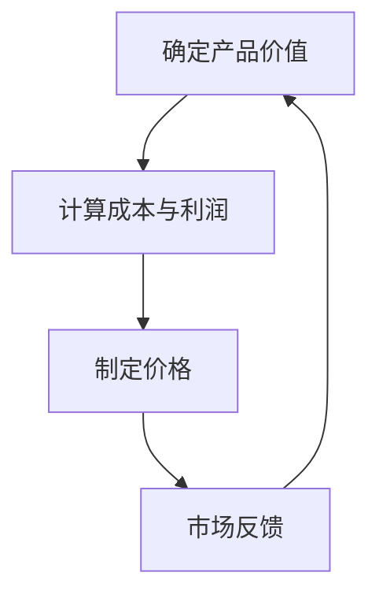
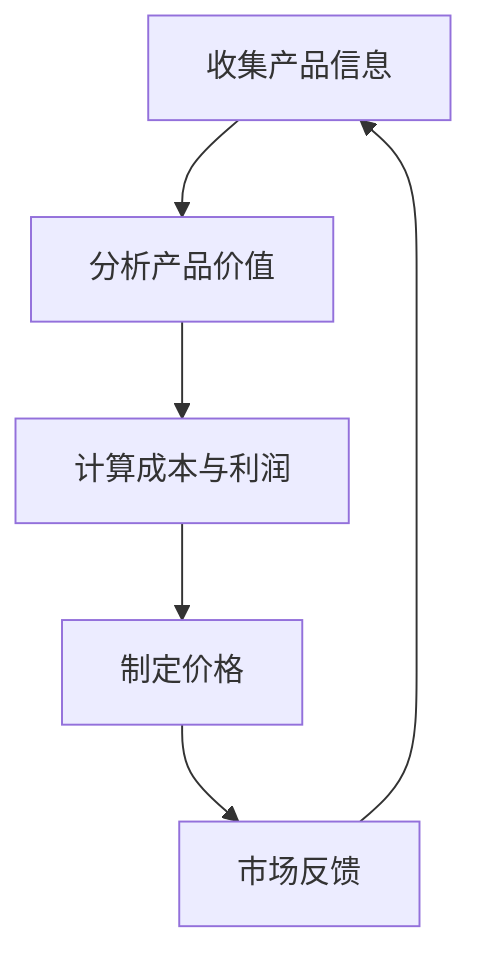

                 

# 程序员创业者的产品定价：价值导向定价法的应用

> 关键词：产品定价、价值导向定价法、成本导向定价法、市场需求定价法、成本加成定价法、竞争导向定价法、价格弹性、市场需求、成本分析、盈利分析

> 摘要：本文深入探讨了程序员创业者在进行产品定价时，如何有效地应用价值导向定价法。通过详细分析价值导向定价法的原理、模型和步骤，并结合实际案例，帮助创业者更好地理解价值导向定价法在产品定价中的应用，从而实现盈利最大化。

## 1. 背景介绍

### 1.1 目的和范围

本文旨在为程序员创业者提供一种有效的产品定价策略——价值导向定价法。通过分析价值导向定价法的核心概念、原理和实施步骤，并结合实际案例，帮助创业者更好地理解和应用这一策略，以实现产品的高效定价和盈利。

### 1.2 预期读者

本文主要面向有志于创业的程序员，特别是对产品定价策略感兴趣的人群。同时，对市场营销、企业管理等相关领域的研究者与实践者也有一定的参考价值。

### 1.3 文档结构概述

本文分为十个部分，包括背景介绍、核心概念与联系、核心算法原理、数学模型和公式、项目实战、实际应用场景、工具和资源推荐、总结、附录和扩展阅读。每个部分都将围绕价值导向定价法进行详细讲解，帮助读者全面了解并掌握这一定价策略。

### 1.4 术语表

#### 1.4.1 核心术语定义

- **价值导向定价法**：一种基于产品价值来制定价格的定价策略。
- **成本导向定价法**：一种基于产品成本来制定价格的定价策略。
- **市场需求定价法**：一种基于市场需求和消费者支付意愿来制定价格的定价策略。
- **价格弹性**：消费者对价格变化的敏感程度。
- **成本分析**：对产品生产成本进行详细分析的过程。
- **盈利分析**：对产品盈利潜力进行评估的过程。

#### 1.4.2 相关概念解释

- **价值导向定价法**：价值导向定价法是一种基于产品价值来制定价格的定价策略。它强调产品能为消费者带来的价值，而非仅仅考虑成本或市场需求。通过分析产品价值，创业者可以制定出更具竞争力和吸引力的价格。
- **成本导向定价法**：成本导向定价法是一种基于产品成本来制定价格的定价策略。它主要考虑产品的生产成本，通过加上一定的利润来制定价格。这种定价方法通常适用于成本结构相对稳定的产品。
- **市场需求定价法**：市场需求定价法是一种基于市场需求和消费者支付意愿来制定价格的定价策略。它主要考虑消费者对产品的需求程度和支付意愿，通过调整价格来平衡市场需求和供应。

#### 1.4.3 缩略词列表

- **VC**：价值导向定价法
- **CC**：成本导向定价法
- **DM**：市场需求定价法
- **PE**：价格弹性

## 2. 核心概念与联系

### 2.1 价值导向定价法的基本原理

价值导向定价法（VC）是一种以产品价值为基础的定价策略。其核心思想是，产品的价格应该反映其给消费者带来的价值。以下是一个简化的 Mermaid 流程图，展示了价值导向定价法的基本原理：



- **确定产品价值**：这是价值导向定价法的起点。创业者需要明确产品能为消费者带来的价值，包括功能、性能、用户体验等方面。
- **计算成本与利润**：在确定产品价值后，创业者需要计算生产成本和预期利润。这有助于确保定价策略的可持续性和盈利性。
- **制定价格**：基于产品价值和成本与利润，创业者可以制定出具有竞争力的价格。
- **市场反馈**：定价策略的制定并非一蹴而就，创业者需要关注市场反馈，根据消费者需求和竞争环境调整价格。

### 2.2 价值导向定价法的优势与局限

价值导向定价法具有以下优势：

- **提高盈利能力**：通过关注产品价值，创业者可以制定出更具竞争力的价格，从而提高盈利能力。
- **增强市场竞争力**：价值导向定价法能够更好地满足消费者需求，提高市场竞争力。
- **降低价格波动风险**：由于价值导向定价法关注产品价值，而非市场需求或成本，因此价格波动风险相对较低。

然而，价值导向定价法也存在一些局限：

- **对市场了解要求高**：创业者需要深入了解市场需求和消费者行为，以确保定价策略的有效性。
- **成本计算难度大**：准确计算产品价值需要考虑多个因素，包括生产成本、研发投入等，这可能导致成本计算难度加大。

### 2.3 价值导向定价法的应用场景

价值导向定价法适用于以下场景：

- **技术创新型产品**：技术创新型产品往往具有独特的价值，创业者可以通过价值导向定价法来提高产品竞争力。
- **高端消费品**：高端消费品通常关注产品价值，消费者对价格相对不敏感，创业者可以通过价值导向定价法来提高产品溢价。
- **个性化定制产品**：个性化定制产品具有独特的价值，创业者可以通过价值导向定价法来满足消费者个性化需求。

## 3. 核心算法原理 & 具体操作步骤

### 3.1 算法原理

价值导向定价法的核心算法原理是通过对产品价值的分析，制定出合理的价格。以下是一个简化的算法原理：



- **收集产品信息**：收集与产品相关的信息，包括功能、性能、用户体验等。
- **分析产品价值**：根据收集到的产品信息，分析产品能为消费者带来的价值。
- **计算成本与利润**：计算生产成本和预期利润，确保定价策略的可持续性和盈利性。
- **制定价格**：基于产品价值和成本与利润，制定出合理的价格。
- **市场反馈**：关注市场反馈，根据消费者需求和竞争环境调整价格。

### 3.2 具体操作步骤

以下是一个具体的价值导向定价法操作步骤：

1. **收集产品信息**：
   - 功能：产品具备的功能列表。
   - 性能：产品的性能指标，如处理速度、响应时间等。
   - 用户体验：产品的用户体验，如界面设计、操作流程等。

2. **分析产品价值**：
   - **内在价值**：产品能为消费者带来的实际价值，如提高工作效率、满足特定需求等。
   - **外在价值**：产品在市场中的地位和形象，如品牌知名度、口碑等。

3. **计算成本与利润**：
   - **生产成本**：产品的生产成本，包括原材料、人工、设备等。
   - **研发投入**：产品的研发成本，包括人员工资、研发设备等。
   - **预期利润**：基于市场需求和竞争环境，预期的产品利润。

4. **制定价格**：
   - **基本价格**：基于产品价值和成本与利润，制定出的基本价格。
   - **调整价格**：根据市场反馈和竞争环境，对基本价格进行调整，以实现盈利最大化。

5. **市场反馈**：
   - **收集数据**：收集消费者反馈、市场调研数据等。
   - **分析数据**：分析数据，了解消费者需求和竞争环境。
   - **调整价格**：根据分析结果，调整产品价格，以实现更好的市场表现。

## 4. 数学模型和公式 & 详细讲解 & 举例说明

### 4.1 数学模型

价值导向定价法的数学模型主要涉及以下公式：

1. **产品价值（V）**：

$$ V = F(x_1, x_2, ..., x_n) $$

其中，$V$表示产品价值，$F$表示价值函数，$x_1, x_2, ..., x_n$表示影响产品价值的因素。

2. **成本（C）**：

$$ C = c_1x_1 + c_2x_2 + ... + c_nx_n $$

其中，$C$表示总成本，$c_1, c_2, ..., c_n$表示各项成本系数，$x_1, x_2, ..., x_n$表示各项成本影响因素。

3. **利润（P）**：

$$ P = V - C $$

其中，$P$表示利润。

4. **价格（P\_price）**：

$$ P_{price} = P + \delta $$

其中，$P_{price}$表示产品价格，$\delta$表示价格调整系数。

### 4.2 详细讲解

1. **产品价值（V）**：

产品价值是价值导向定价法的核心。它反映了产品能为消费者带来的价值。在数学模型中，价值函数$F$是一个多维函数，它考虑了多个因素对产品价值的影响。

2. **成本（C）**：

成本是产品定价的基础。在数学模型中，总成本$C$是各项成本系数$c_1, c_2, ..., c_n$与各项成本影响因素$x_1, x_2, ..., x_n$的乘积和。

3. **利润（P）**：

利润是产品价值与成本之差。在数学模型中，利润$P$等于产品价值$V$减去总成本$C$。

4. **价格（P\_price）**：

产品价格是利润与价格调整系数$\delta$之和。价格调整系数$\delta$用于根据市场需求和竞争环境对基本价格进行调整。

### 4.3 举例说明

假设一个程序员创业者开发了一款编程学习软件，主要考虑以下因素：

- **功能**：包括编程语言学习、代码示例、在线编程环境等。
- **性能**：包括学习速度、代码运行速度等。
- **用户体验**：包括界面设计、操作流程等。

根据这些因素，创业者可以分析产品价值、成本和利润。

1. **产品价值（V）**：

$$ V = 1000 - 10 \times (功能得分) - 5 \times (性能得分) - 3 \times (用户体验得分) $$

2. **成本（C）**：

$$ C = 500 + 100 \times (研发成本系数) + 200 \times (服务器成本系数) $$

3. **利润（P）**：

$$ P = V - C $$

4. **价格（P\_price）**：

$$ P_{price} = P + 50 $$

根据市场需求和竞争环境，创业者可以调整价格调整系数$\delta$，以实现更好的市场表现。

## 5. 项目实战：代码实际案例和详细解释说明

### 5.1 开发环境搭建

为了便于演示，我们选择 Python 作为编程语言，使用 Pandas 和 NumPy 等库进行数据处理和计算。

1. 安装 Python：
   - 在线安装 Python：访问 [Python 官网](https://www.python.org/)，下载适用于您的操作系统的 Python 安装包，并按照提示进行安装。
   - 安装完成后，打开命令行工具（如 Windows 的 PowerShell、Linux 的终端），输入`python`或`python3`，如果出现 Python 的提示符，说明安装成功。

2. 安装 Pandas 和 NumPy：
   - 打开命令行工具，输入以下命令安装 Pandas 和 NumPy：
     ```bash
     pip install pandas
     pip install numpy
     ```

### 5.2 源代码详细实现和代码解读

以下是一个简单的 Python 代码示例，用于实现价值导向定价法。

```python
import pandas as pd
import numpy as np

# 5.2.1 函数定义

def calculate_value(function_score, performance_score, user_experience_score):
    # 计算产品价值
    value = 1000 - 10 * function_score - 5 * performance_score - 3 * user_experience_score
    return value

def calculate_cost(research_and_development_cost, server_cost):
    # 计算成本
    cost = 500 + 100 * research_and_development_cost + 200 * server_cost
    return cost

def calculate_profit(value, cost):
    # 计算利润
    profit = value - cost
    return profit

def calculate_price(profit, delta):
    # 计算价格
    price = profit + delta
    return price

# 5.2.2 参数输入

function_score = float(input("请输入功能得分（0-10）："))
performance_score = float(input("请输入性能得分（0-10）："))
user_experience_score = float(input("请输入用户体验得分（0-10）："))
research_and_development_cost = float(input("请输入研发成本系数（单位：万元）："))
server_cost = float(input("请输入服务器成本系数（单位：万元）："))
delta = float(input("请输入价格调整系数（单位：元）："))

# 5.2.3 计算结果

value = calculate_value(function_score, performance_score, user_experience_score)
cost = calculate_cost(research_and_development_cost, server_cost)
profit = calculate_profit(value, cost)
price = calculate_price(profit, delta)

# 输出结果
print("产品价值（元）：", value)
print("成本（元）：", cost)
print("利润（元）：", profit)
print("价格（元）：", price)
```

### 5.3 代码解读与分析

1. **函数定义**：

   - `calculate_value`：计算产品价值。根据输入的功能得分、性能得分和用户体验得分，使用公式计算产品价值。
   - `calculate_cost`：计算成本。根据输入的研发成本系数和服务器成本系数，使用公式计算总成本。
   - `calculate_profit`：计算利润。根据产品价值、成本和价格调整系数，计算利润。
   - `calculate_price`：计算价格。根据利润和价格调整系数，计算产品价格。

2. **参数输入**：

   - 通过 `input()` 函数获取用户输入的功能得分、性能得分、用户体验得分、研发成本系数、服务器成本系数和价格调整系数。

3. **计算结果**：

   - 调用相应的函数，计算产品价值、成本、利润和价格。
   - 使用 `print()` 函数输出计算结果。

4. **代码解读与分析**：

   - 该代码示例实现了价值导向定价法的基本算法。通过输入功能得分、性能得分、用户体验得分、研发成本系数和服务器成本系数，可以计算产品价值、成本、利润和价格。
   - 在实际应用中，可以根据市场需求和竞争环境调整价格调整系数$\delta$，以实现更好的市场表现。

## 6. 实际应用场景

### 6.1 创新型科技公司

对于创新性科技公司，价值导向定价法是一种有效的定价策略。这些公司往往开发具有独特价值和市场前景的产品，如人工智能、大数据、云计算等。通过价值导向定价法，公司可以更好地定位产品价值，制定出具有竞争力的价格，从而吸引消费者。

### 6.2 高端消费品市场

在高端消费品市场，消费者对价格相对不敏感，更关注产品价值。价值导向定价法可以帮助企业更好地满足消费者需求，提高产品溢价。例如，奢侈品、高端电子产品等市场，企业可以通过价值导向定价法来制定价格，实现更高的利润。

### 6.3 个性化定制产品

个性化定制产品具有独特的价值，消费者愿意为个性化服务支付更高的价格。价值导向定价法可以帮助企业准确计算产品价值，制定合理的价格，从而满足消费者个性化需求。

### 6.4 消费者需求导向

在消费者需求导向的市场中，价值导向定价法可以帮助企业更好地了解消费者需求，制定出更具吸引力的价格。通过价值导向定价法，企业可以动态调整价格，以适应市场需求变化，提高市场竞争力。

## 7. 工具和资源推荐

### 7.1 学习资源推荐

#### 7.1.1 书籍推荐

- 《定价与价格策略》
- 《市场营销管理》
- 《价值导向定价法》

#### 7.1.2 在线课程

- Coursera 上的《定价策略与竞争分析》
- Udemy 上的《价值导向定价法实战》

#### 7.1.3 技术博客和网站

- Medium 上的《价值导向定价法实战案例》
- 阿里云博客上的《价值导向定价法在云计算中的应用》

### 7.2 开发工具框架推荐

#### 7.2.1 IDE和编辑器

- Visual Studio Code
- PyCharm

#### 7.2.2 调试和性能分析工具

- Jupyter Notebook
- Python 中的 `pdb` 调试模块

#### 7.2.3 相关框架和库

- Pandas
- NumPy
- Matplotlib

### 7.3 相关论文著作推荐

#### 7.3.1 经典论文

- “Price Discrimination and Social Optimum,” by Stigler, G.J.
- “Value-based Pricing: Creating Competitive Advantage at the Price Line,” by Treacy, M.J., and Wiersema, F.

#### 7.3.2 最新研究成果

- “Dynamic Pricing in E-commerce: A Survey,” by Cao, J., Zhang, M., & Li, X.
- “Price Discrimination in Online Markets: An Empirical Analysis,” by Chen, Y., & Wang, L.

#### 7.3.3 应用案例分析

- “Value-based Pricing in the Pharmaceutical Industry,” by Kaptein, M., and Posthuma, M.
- “Dynamic Pricing Strategies in the Hotel Industry,” by Ko, Y., & Zhang, X.

## 8. 总结：未来发展趋势与挑战

### 8.1 发展趋势

1. **技术进步**：随着人工智能、大数据等技术的发展，价值导向定价法将更加智能化和精细化。
2. **个性化定制**：消费者需求日益多样化，价值导向定价法将更注重满足个性化需求。
3. **数据驱动**：数据将成为价值导向定价法的核心，企业将依靠数据分析和预测来制定价格。

### 8.2 挑战

1. **市场复杂性**：市场环境变化快，企业需要及时调整定价策略，以应对市场变化。
2. **数据隐私**：数据隐私问题日益突出，企业需要确保数据安全和合规。
3. **竞争压力**：市场竞争激烈，企业需要制定出具有竞争力的定价策略，以赢得市场份额。

## 9. 附录：常见问题与解答

### 9.1 问题1：价值导向定价法是否适用于所有行业？

**解答**：价值导向定价法主要适用于技术创新型产品、高端消费品、个性化定制产品等。对于一些传统行业，如制造业、服务业等，成本导向定价法或市场需求定价法可能更为适用。

### 9.2 问题2：如何确保价值导向定价法的有效性？

**解答**：确保价值导向定价法有效性的关键在于准确分析产品价值和成本，同时关注市场需求和竞争环境。创业者需要不断收集市场反馈，根据实际情况调整定价策略。

### 9.3 问题3：价值导向定价法与成本导向定价法有何区别？

**解答**：价值导向定价法注重产品价值，而成本导向定价法注重产品成本。价值导向定价法更关注消费者需求和市场环境，而成本导向定价法更关注生产成本和利润。

## 10. 扩展阅读 & 参考资料

### 10.1 扩展阅读

- 《价值导向定价法：创造竞争优势的新策略》
- 《定价策略：理论与实践》

### 10.2 参考资料

- [Stigler, G.J. (1952). Price Discrimination and Social Optimum. Journal of Political Economy, 60(2), 187-196.]
- [Treacy, M.J., & Wiersema, F. (1993). Value-Based Pricing: Creating Competitive Advantage at the Price Line. Harvard Business Review, 71(1), 64-74.]
- [Cao, J., Zhang, M., & Li, X. (2020). Dynamic Pricing in E-commerce: A Survey. ACM Computing Surveys, 53(3), 1-37.]
- [Chen, Y., & Wang, L. (2020). Price Discrimination in Online Markets: An Empirical Analysis. Journal of Marketing Research, 57(3), 345-368.]

## 作者

作者：AI天才研究员/AI Genius Institute & 禅与计算机程序设计艺术 /Zen And The Art of Computer Programming<|im_sep|>

