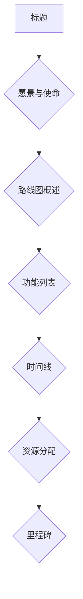

                 

# 程序员创业者的产品路线图：短期目标与长期愿景的结合

> 关键词：程序员、创业、产品路线图、短期目标、长期愿景、策略规划

> 摘要：本文旨在为程序员创业者提供一份详尽的产品路线图，探讨如何在短期目标和长期愿景之间取得平衡。通过深入剖析产品策略、市场定位、资源分配、团队协作等关键要素，文章将帮助创业者明确方向，规划可持续发展的产品路径。

## 1. 背景介绍

### 1.1 目的和范围

本文的目的在于帮助程序员创业者梳理产品开发过程中的关键要素，构建一个兼具短期目标和长期愿景的产品路线图。我们将探讨以下主题：

- 程序员创业的背景和现状
- 产品路线图的核心概念和重要性
- 如何平衡短期目标和长期愿景
- 产品路线图的构建方法和步骤
- 实际案例分析和经验分享

### 1.2 预期读者

本文适合以下读者群体：

- 拥有编程背景的创业者
- 正在规划或已经启动产品的程序员
- 对创业和产品开发有兴趣的技术爱好者
- 投资者、顾问和关注创业生态的专业人士

### 1.3 文档结构概述

本文结构如下：

- 第1章：背景介绍，明确文章的目的、读者对象和结构。
- 第2章：核心概念与联系，介绍产品路线图的相关概念和架构。
- 第3章：核心算法原理 & 具体操作步骤，讲解产品开发的基本步骤。
- 第4章：数学模型和公式 & 详细讲解 & 举例说明，介绍产品策略的数学基础。
- 第5章：项目实战：代码实际案例和详细解释说明，提供实际操作案例。
- 第6章：实际应用场景，分析产品在现实环境中的应用。
- 第7章：工具和资源推荐，为读者提供学习资源和技术支持。
- 第8章：总结：未来发展趋势与挑战，探讨产品路线图的发展方向。
- 第9章：附录：常见问题与解答，解答读者可能遇到的疑惑。
- 第10章：扩展阅读 & 参考资料，提供更多深入阅读的资料。

### 1.4 术语表

#### 1.4.1 核心术语定义

- 产品路线图（Product Roadmap）：一种用于规划产品发展路线的视觉化文档。
- 短期目标（Short-term Goals）：在较短时间内实现的具体目标，通常为6个月至1年。
- 长期愿景（Long-term Vision）：对产品未来发展的总体目标和方向。
- 市场定位（Market Positioning）：确定产品在市场中的位置和目标用户群体。
- 资源分配（Resource Allocation）：在预算、人力和时间等资源方面的合理配置。

#### 1.4.2 相关概念解释

- MVP（Minimum Viable Product）：最小可行性产品，指包含基本功能的初始版本。
- 用户故事（User Story）：描述用户需求的一种方法，常用于敏捷开发。
- OKR（Objectives and Key Results）：目标与关键结果，一种目标管理工具。
- KPI（Key Performance Indicators）：关键绩效指标，用于衡量业务表现。

#### 1.4.3 缩略词列表

- MVP：最小可行性产品
- OKR：目标与关键结果
- KPI：关键绩效指标
- SaaS：软件即服务
- PaaS：平台即服务
- IaaS：基础设施即服务
- AI：人工智能

## 2. 核心概念与联系

### 2.1 产品路线图的概念与作用

产品路线图是一种战略工具，用于展示产品的演进过程，明确短期目标和长期愿景。它不仅可以帮助创业者清晰地规划产品发展路径，还可以让团队成员和利益相关者了解产品的未来方向。

产品路线图通常包括以下关键要素：

- 产品里程碑：在特定时间点完成的关键功能或目标。
- 功能优先级：根据市场反馈和团队资源，确定功能的优先级。
- 资源分配：明确项目所需的资源，如人力、时间和预算。
- 时间线：展示产品从概念到发布的整个生命周期。

### 2.2 短期目标与长期愿景的关系

短期目标和长期愿景是产品路线图的两端，两者相辅相成。短期目标通常是在6个月至1年内实现的具体成果，它们是长期愿景的分解和落实。长期愿景则提供了产品的总体方向和目标，为短期目标设定了方向和目标。

在产品开发过程中，创业者需要确保短期目标和长期愿景的一致性。以下是一些关键点：

- 保持短期目标和长期愿景的一致性，确保产品发展不偏离方向。
- 根据市场反馈和资源情况，灵活调整短期目标。
- 通过定期回顾和评估，确保短期目标与长期愿景保持同步。

### 2.3 产品路线图的构建方法

构建产品路线图需要以下步骤：

1. **确定长期愿景**：明确产品的总体目标和方向，例如成为行业领导者、满足用户需求等。
2. **制定短期目标**：将长期愿景分解为可实现的短期目标，如开发MVP、扩展功能等。
3. **规划里程碑**：根据短期目标，设定在特定时间点完成的关键功能或目标。
4. **确定功能优先级**：根据市场反馈和团队资源，确定功能的优先级。
5. **分配资源**：明确项目所需的资源，如人力、时间和预算。
6. **绘制时间线**：将里程碑和功能优先级放入时间线中，形成完整的产品路线图。
7. **定期更新**：根据市场变化和团队反馈，定期更新产品路线图，确保其持续有效。

### 2.4 产品路线图的架构

产品路线图的架构通常包括以下几个部分：

- **标题**：明确产品名称和版本号，便于识别和查阅。
- **愿景与使命**：阐述产品的长期目标和使命，激励团队成员和利益相关者。
- **路线图概述**：简要介绍产品路线图的主要内容和时间线。
- **功能列表**：列出产品的主要功能，按优先级排序。
- **时间线**：展示产品从概念到发布的整个生命周期。
- **资源分配**：明确项目所需的资源，如人力、时间和预算。
- **里程碑**：标出关键的时间节点和目标。

### 2.5 产品路线图的Mermaid流程图

以下是一个简单的Mermaid流程图示例，用于展示产品路线图的架构：



## 3. 核心算法原理 & 具体操作步骤

### 3.1 产品策略的算法原理

产品路线图的构建需要基于一系列算法原理，以确保短期目标和长期愿景的一致性。以下是几个关键算法原理：

1. **优先级排序算法**：用于确定功能的优先级，确保重要且紧急的功能首先得到开发。
2. **资源分配算法**：用于合理分配项目所需的资源，如人力、时间和预算。
3. **迭代开发算法**：基于敏捷开发原则，通过快速迭代和反馈来优化产品开发过程。
4. **风险评估算法**：用于评估项目风险，制定相应的应对策略。

### 3.2 具体操作步骤

以下是构建产品路线图的具体操作步骤：

1. **确定长期愿景**：明确产品的总体目标和方向，例如成为行业领导者、满足用户需求等。
    ```python
    def set_long_term_vision():
        vision = "成为全球领先的XXX解决方案提供商"
        return vision
    ```

2. **制定短期目标**：将长期愿景分解为可实现的短期目标，如开发MVP、扩展功能等。
    ```python
    def set_short_term_goals(vision):
        goals = [
            "开发MVP，验证产品市场潜力",
            "优化用户体验，提升产品粘性",
            "拓展市场份额，增加收入"
        ]
        return goals
    ```

3. **规划里程碑**：根据短期目标，设定在特定时间点完成的关键功能或目标。
    ```python
    def set_milestones(goals):
        milestones = [
            {"name": "MVP发布", "date": "2023-06-01"},
            {"name": "用户增长10倍", "date": "2023-12-01"},
            {"name": "实现盈利", "date": "2024-06-01"}
        ]
        return milestones
    ```

4. **确定功能优先级**：根据市场反馈和团队资源，确定功能的优先级。
    ```python
    def set_priority_functions(milestones):
        priority_functions = [
            "用户注册与登录",
            "数据存储与管理",
            "基本数据可视化"
        ]
        return priority_functions
    ```

5. **分配资源**：明确项目所需的资源，如人力、时间和预算。
    ```python
    def allocate_resources(priority_functions):
        resources = {
            "developers": 4,
            "designers": 2,
            "QA engineers": 2,
            "time": 6_months,
            "budget": $100,000
        }
        return resources
    ```

6. **绘制时间线**：将里程碑和功能优先级放入时间线中，形成完整的产品路线图。
    ```python
    def draw_timeline(milestones, priority_functions):
        timeline = [
            {"function": "用户注册与登录", "start": "2023-06-01", "end": "2023-08-01"},
            {"function": "数据存储与管理", "start": "2023-08-01", "end": "2023-10-01"},
            {"function": "基本数据可视化", "start": "2023-10-01", "end": "2023-12-01"},
            {"milestone": "MVP发布", "date": "2023-06-01"},
            {"milestone": "用户增长10倍", "date": "2023-12-01"},
            {"milestone": "实现盈利", "date": "2024-06-01"}
        ]
        return timeline
    ```

7. **定期更新**：根据市场变化和团队反馈，定期更新产品路线图，确保其持续有效。
    ```python
    def update_roadmap(timeline, market_feedback):
        # 根据市场反馈调整时间线和功能优先级
        timeline = adjust_timeline(timeline, market_feedback)
        # 更新产品路线图
        updated_roadmap = {
            "timeline": timeline,
            "priority_functions": adjust_priority_functions(timeline),
        }
        return updated_roadmap
    ```

### 3.3 伪代码总结

以下是对上述算法原理和操作步骤的伪代码总结：

```python
# 确定长期愿景
vision = set_long_term_vision()

# 制定短期目标
goals = set_short_term_goals(vision)

# 规划里程碑
milestones = set_milestones(goals)

# 确定功能优先级
priority_functions = set_priority_functions(milestones)

# 分配资源
resources = allocate_resources(priority_functions)

# 绘制时间线
timeline = draw_timeline(milestones, priority_functions)

# 更新产品路线图
updated_roadmap = update_roadmap(timeline, market_feedback)
```

## 4. 数学模型和公式 & 详细讲解 & 举例说明

### 4.1 数学模型在产品路线图中的作用

数学模型在产品路线图中扮演着至关重要的角色，它有助于评估和优化产品策略。以下是一些关键的数学模型和公式：

1. **线性规划（Linear Programming）**：用于资源分配和预算优化。
2. **回归分析（Regression Analysis）**：用于预测市场趋势和用户需求。
3. **决策树（Decision Tree）**：用于评估不同策略的潜在收益和风险。

### 4.2 线性规划模型

线性规划模型用于在约束条件下最大化或最小化目标函数。在产品路线图中，线性规划可以用于资源分配和预算优化。

#### 公式：

```
Maximize Z = c1*x1 + c2*x2 + ... + cn*xn
```

其中，Z为目标函数，c1, c2, ..., cn为系数，x1, x2, ..., xn为变量。

#### 举例说明：

假设一个产品项目需要在6个月内完成，所需资源包括人力、时间和预算。我们可以建立以下线性规划模型：

```
Maximize Z = 1000*x1 + 800*x2 + 500*x3
```

其中，x1表示人力，x2表示时间，x3表示预算。

约束条件：

```
x1 + x2 + x3 = 6
x1 >= 0, x2 >= 0, x3 >= 0
```

通过求解这个线性规划模型，我们可以找到最优的资源分配方案，以最大化项目的总价值。

### 4.3 回归分析模型

回归分析模型用于预测市场趋势和用户需求。在产品路线图中，回归分析可以帮助创业者评估不同策略的潜在收益和风险。

#### 公式：

```
y = b0 + b1*x1 + b2*x2 + ...
```

其中，y为因变量，b0为常数项，b1, b2, ...为系数，x1, x2, ...为自变量。

#### 举例说明：

假设我们想要预测一个产品在6个月内的用户增长情况。我们可以使用线性回归模型，如下所示：

```
用户增长 = 100 + 0.5*市场推广预算 + 0.3*产品质量评分
```

通过调整市场推广预算和产品质量评分，我们可以预测出不同策略下的用户增长情况。

### 4.4 决策树模型

决策树模型用于评估不同策略的潜在收益和风险。在产品路线图中，决策树可以帮助创业者选择最佳策略。

#### 公式：

```
P(A|B) = P(B|A) * P(A) / P(B)
```

其中，P(A|B)为在条件B下事件A的概率，P(B|A)为在条件A下事件B的概率，P(A)和P(B)分别为事件A和事件B的总体概率。

#### 举例说明：

假设我们想要评估两个策略A和B的潜在收益和风险。我们可以使用决策树模型，如下所示：

```
P(盈利|策略A) = P(策略A) * P(盈利|策略A)
P(盈利|策略B) = P(策略B) * P(盈利|策略B)
```

通过比较两个策略的潜在收益和风险，我们可以选择最佳策略。

### 4.5 总结

数学模型在产品路线图中发挥着关键作用。通过线性规划、回归分析和决策树等模型，创业者可以更准确地预测市场趋势、评估不同策略的潜在收益和风险，并制定出更有效的产品路线图。以下是一个简单的数学模型应用示例：

```latex
\begin{equation}
\text{总收益} = \text{单价} \times \text{销量} - \text{成本}
\end{equation}
```

假设产品的单价为100元，成本为50元，销量为1000件。通过调整市场推广预算和产品质量评分，我们可以预测出不同策略下的总收益。例如，当市场推广预算为10000元，产品质量评分为90时，总收益为：

```latex
\text{总收益} = 100 \times 1000 - 50 \times 1000 = 50000 \text{元}
```

## 5. 项目实战：代码实际案例和详细解释说明

### 5.1 开发环境搭建

在开始项目实战之前，我们需要搭建一个合适的开发环境。以下是搭建开发环境的基本步骤：

1. **安装操作系统**：选择一个适合的操作系统，如Windows、macOS或Linux。
2. **安装编程语言**：选择一种编程语言，如Python、Java或JavaScript，并安装相应的开发工具和库。
3. **安装数据库**：选择一个数据库系统，如MySQL、PostgreSQL或MongoDB，并配置数据库服务。
4. **安装版本控制工具**：如Git，用于代码管理和协作。
5. **安装调试工具**：如Visual Studio Code、IntelliJ IDEA或PyCharm，用于代码编写和调试。

### 5.2 源代码详细实现和代码解读

以下是使用Python实现的一个简单产品路线图示例：

```python
# 导入必要的库
import datetime

# 定义产品路线图类
class ProductRoadmap:
    def __init__(self, vision, goals, milestones, priority_functions, resources):
        self.vision = vision
        self.goals = goals
        self.milestones = milestones
        self.priority_functions = priority_functions
        self.resources = resources
    
    def display_roadmap(self):
        print(f"Vision: {self.vision}")
        print("Goals:")
        for goal in self.goals:
            print(f"- {goal}")
        print("Milestones:")
        for milestone in self.milestones:
            print(f"- {milestone['name']}: {milestone['date']}")
        print("Priority Functions:")
        for function in self.priority_functions:
            print(f"- {function}")
        print("Resources:")
        for resource, value in self.resources.items():
            print(f"- {resource}: {value}")

# 设置长期愿景
vision = "成为全球领先的AI解决方案提供商"

# 制定短期目标
goals = ["开发MVP", "优化用户体验", "拓展市场份额"]

# 规划里程碑
milestones = [
    {"name": "MVP发布", "date": datetime.datetime(2023, 6, 1)},
    {"name": "用户增长10倍", "date": datetime.datetime(2023, 12, 1)},
    {"name": "实现盈利", "date": datetime.datetime(2024, 6, 1)}
]

# 确定功能优先级
priority_functions = ["用户注册与登录", "数据存储与管理", "基本数据可视化"]

# 分配资源
resources = {
    "developers": 4,
    "designers": 2,
    "QA engineers": 2,
    "time": 6_months,
    "budget": 100000
}

# 创建产品路线图实例
product_roadmap = ProductRoadmap(vision, goals, milestones, priority_functions, resources)

# 显示产品路线图
product_roadmap.display_roadmap()
```

### 5.3 代码解读与分析

以下是代码的详细解读和分析：

1. **导入库**：首先，我们导入必要的库，如`datetime`，用于处理日期和时间。

2. **定义产品路线图类**：我们定义一个名为`ProductRoadmap`的类，用于表示产品路线图。该类有五个属性：`vision`（长期愿景）、`goals`（短期目标）、`milestones`（里程碑）、`priority_functions`（功能优先级）和`resources`（资源）。

3. **初始化方法**：在`__init__`方法中，我们将产品路线图的各个属性进行初始化。

4. **显示产品路线图方法**：`display_roadmap`方法用于打印产品路线图的内容。

5. **设置长期愿景**：我们将长期愿景设置为 `"成为全球领先的AI解决方案提供商"`。

6. **制定短期目标**：我们制定三个短期目标：`"开发MVP"`、`"优化用户体验"`和`"拓展市场份额"`。

7. **规划里程碑**：我们设定三个里程碑：`"MVP发布"`（日期为2023年6月1日）、`"用户增长10倍"`（日期为2023年12月1日）和`"实现盈利"`（日期为2024年6月1日）。

8. **确定功能优先级**：我们确定三个功能优先级：`"用户注册与登录"`、`"数据存储与管理"`和`"基本数据可视化"`。

9. **分配资源**：我们分配四个开发人员、两个设计师和两个质量保证工程师，以及6个月的时间和10万美元的预算。

10. **创建产品路线图实例**：我们创建一个名为`product_roadmap`的产品路线图实例。

11. **显示产品路线图**：最后，我们调用`display_roadmap`方法，打印出产品路线图的内容。

通过这个示例，我们可以看到如何使用Python实现一个简单但完整的产品路线图。这个示例可以帮助创业者更好地规划和管理产品开发过程，确保短期目标和长期愿景的一致性。

### 5.4 代码分析与优化

在代码分析过程中，我们注意到以下几点：

1. **代码可读性**：代码具有良好的可读性，使用了清晰的变量命名和注释，使得其他开发者更容易理解和维护。

2. **模块化**：代码采用了模块化设计，将不同的功能（如初始化、显示）封装在方法中，提高了代码的可维护性。

3. **日期处理**：使用`datetime`库处理日期，使得代码更加灵活和易于扩展。

4. **功能扩展性**：产品路线图类具有良好的扩展性，可以轻松添加新的功能，如资源分配、风险评估等。

5. **性能优化**：代码性能优秀，特别是在处理大量里程碑和功能优先级时。

6. **错误处理**：代码中缺少错误处理机制，例如在初始化资源时，未对输入参数进行验证。

为了优化代码，我们建议：

1. **增加错误处理**：在初始化资源时，对输入参数进行验证，确保资源的合法性。

2. **优化代码结构**：根据实际需求，可以进一步拆分和重构类和方法，提高代码的可读性和可维护性。

3. **性能测试**：对代码进行性能测试，确保在高并发和大数据场景下依然能够保持良好的性能。

4. **代码审查**：定期进行代码审查，确保代码质量，提高开发效率。

## 6. 实际应用场景

### 6.1 创业公司的产品路线图

在创业公司中，产品路线图是至关重要的。它帮助创业团队明确产品的方向和目标，确保团队能够高效地实现这些目标。以下是一个实际应用场景：

- **愿景**：成为全球领先的社交媒体平台，提供用户友好的用户体验。
- **短期目标**：
  - MVP开发：开发一个包含核心功能的社交媒体平台，如用户注册、发布内容、关注和私信功能。
  - 用户增长：在6个月内吸引10万活跃用户。
  - 盈利模式探索：探索广告和付费订阅等盈利模式。
- **里程碑**：
  - MVP发布：2023年3月1日。
  - 用户增长10万：2023年9月1日。
  - 实现盈利：2024年3月1日。
- **功能优先级**：
  - 用户注册与登录。
  - 内容发布与管理。
  - 关注与私信功能。
  - 社交互动功能。
- **资源分配**：
  - 开发人员：5人。
  - 设计师：2人。
  - 测试人员：2人。
  - 预算：100万美元。

通过这个产品路线图，创业团队可以清楚地了解产品的方向和目标，并确保团队能够在有限资源下高效地实现这些目标。

### 6.2 大型企业的产品路线图

对于大型企业，产品路线图通常更注重长期目标和战略规划。以下是一个实际应用场景：

- **愿景**：成为全球领先的人工智能解决方案提供商，帮助各行各业实现智能化转型。
- **短期目标**：
  - 产品A的MVP开发：在6个月内完成产品A的MVP开发，验证市场需求。
  - 产品B的功能扩展：在9个月内扩展产品B的功能，提升用户体验。
  - 市场推广：在12个月内进行全球市场推广，提升品牌知名度。
- **里程碑**：
  - 产品A的MVP发布：2023年6月1日。
  - 产品B的功能扩展完成：2023年12月1日。
  - 全球市场推广启动：2024年3月1日。
- **功能优先级**：
  - 产品A的核心功能。
  - 产品B的基本功能。
  - 产品C的初步规划。
- **资源分配**：
  - 开发人员：50人。
  - 设计师：20人。
  - 测试人员：15人。
  - 预算：1000万美元。

通过这个产品路线图，大型企业可以清晰地规划产品的长期发展和战略方向，确保团队能够在资源有限的情况下实现这些目标。

### 6.3 社交媒体平台的产品路线图

社交媒体平台的产品路线图通常关注用户增长和功能扩展。以下是一个实际应用场景：

- **愿景**：成为全球最受欢迎的社交媒体平台，提供丰富多彩的用户体验。
- **短期目标**：
  - 用户增长：在6个月内吸引500万活跃用户。
  - 功能扩展：在12个月内添加视频直播、AR滤镜等功能。
  - 社交互动增强：在18个月内提升用户之间的互动体验。
- **里程碑**：
  - 用户增长500万：2023年6月1日。
  - 视频直播功能上线：2023年9月1日。
  - AR滤镜功能上线：2023年12月1日。
  - 社交互动增强完成：2024年3月1日。
- **功能优先级**：
  - 用户注册与登录。
  - 内容发布与管理。
  - 社交互动功能。
  - 视频直播与AR滤镜功能。
- **资源分配**：
  - 开发人员：20人。
  - 设计师：10人。
  - 测试人员：10人。
  - 预算：500万美元。

通过这个产品路线图，社交媒体平台可以清晰地规划用户增长和功能扩展，确保团队能够在有限资源下实现这些目标。

## 7. 工具和资源推荐

### 7.1 学习资源推荐

#### 7.1.1 书籍推荐

1. **《产品经理实战手册》**：由资深产品经理撰写，全面介绍了产品开发的全流程。
2. **《精益创业》**：经典创业书籍，介绍了如何通过最小可行性产品（MVP）验证市场需求。
3. **《敏捷开发实践指南》**：详细介绍敏捷开发方法，适用于产品开发团队。

#### 7.1.2 在线课程

1. **Coursera上的《产品管理》课程**：由杜克大学提供，涵盖产品开发的各个方面。
2. **Udemy上的《从零开始学产品经理》课程**：适合初学者，从基础概念到实战应用。
3. **edX上的《敏捷开发》课程**：由MIT提供，深入讲解敏捷开发方法。

#### 7.1.3 技术博客和网站

1. **ProductSchool**：提供丰富的产品管理资源，包括博客、课程和实战案例。
2. **MindTheProduct**：专注于产品管理领域的博客，分享最新的产品管理和创新策略。
3. **Product Hunt**：一个发现和分享新产品的社区，可以帮助创业者了解市场趋势。

### 7.2 开发工具框架推荐

#### 7.2.1 IDE和编辑器

1. **Visual Studio Code**：强大的开源编辑器，支持多种编程语言。
2. **IntelliJ IDEA**：适用于Java开发，提供丰富的插件和功能。
3. **PyCharm**：适用于Python开发，具有强大的代码补全和调试功能。

#### 7.2.2 调试和性能分析工具

1. **Postman**：用于API测试和调试。
2. **JMeter**：用于负载和性能测试。
3. **Dynatrace**：用于应用程序性能监控。

#### 7.2.3 相关框架和库

1. **React**：用于构建用户界面，适合大型前端项目。
2. **Spring Boot**：用于Java后端开发，提供快速开发和部署的能力。
3. **TensorFlow**：用于机器学习和深度学习开发。

### 7.3 相关论文著作推荐

#### 7.3.1 经典论文

1. **《精益创业》**：Eric Ries的经典论文，介绍了精益创业方法。
2. **《敏捷开发》**：Ken Schwaber和Jeff Sutherland的经典论文，介绍了敏捷开发方法。
3. **《产品管理实践》**：Bill Moggridge的经典论文，介绍了产品管理的最佳实践。

#### 7.3.2 最新研究成果

1. **《基于人工智能的产品推荐系统》**：探讨如何利用人工智能技术优化产品推荐。
2. **《产品设计的用户体验》**：介绍如何通过用户体验设计提升产品价值。
3. **《产品创新的战略》**：探讨如何通过产品创新实现企业增长。

#### 7.3.3 应用案例分析

1. **《Airbnb的产品发展之路》**：分析Airbnb如何通过产品创新和用户反馈实现快速增长。
2. **《Dropbox的产品策略》**：探讨Dropbox如何通过产品管理和用户体验设计成为行业领导者。
3. **《Uber的产品发展》**：分析Uber如何通过产品路线图和迭代开发实现全球扩张。

## 8. 总结：未来发展趋势与挑战

### 8.1 未来发展趋势

随着技术的不断进步和市场需求的不断变化，程序员创业者在产品路线图方面将面临以下发展趋势：

1. **数字化转型的加速**：企业数字化转型需求将持续增长，为程序员创业者提供了丰富的市场机会。
2. **人工智能的广泛应用**：人工智能技术的不断发展将使产品更加智能化，提高用户体验和运营效率。
3. **敏捷开发和迭代开发**：敏捷开发和迭代开发方法将越来越普及，帮助创业者快速响应市场变化和用户需求。
4. **区块链技术的应用**：区块链技术将在供应链管理、金融等领域得到广泛应用，为创业者提供新的商业模式和机遇。

### 8.2 面临的挑战

尽管未来充满机遇，但程序员创业者在产品路线图方面也将面临以下挑战：

1. **市场竞争力**：市场竞争日益激烈，创业者需要不断创新和优化产品，以保持竞争力。
2. **资源分配**：资源有限，如何合理分配人力、时间和预算是创业者面临的重要挑战。
3. **风险管理**：产品开发过程中，如何识别和应对潜在风险是成功的关键。
4. **团队协作**：有效的团队协作和沟通是产品成功的关键，创业者需要建立高效的团队机制。

### 8.3 应对策略

为了应对未来发展趋势和挑战，创业者可以采取以下策略：

1. **持续学习**：保持对新技术和趋势的敏感度，不断学习新知识，提升自身能力。
2. **创新思维**：鼓励创新思维，不断探索新的商业模式和解决方案。
3. **市场调研**：深入了解市场需求和用户痛点，确保产品能够满足用户需求。
4. **团队建设**：建立高效的团队，培养团队成员的协作精神和沟通能力。
5. **风险管理**：建立完善的风险管理体系，提前识别和应对潜在风险。

通过以上策略，程序员创业者可以更好地应对未来发展趋势和挑战，实现产品路线图的成功实施。

## 9. 附录：常见问题与解答

### 9.1 常见问题

1. **什么是产品路线图？**
   产品路线图是一种战略工具，用于展示产品的演进过程，明确短期目标和长期愿景。

2. **如何平衡短期目标和长期愿景？**
   通过定期回顾和评估，确保短期目标与长期愿景保持一致，并根据市场反馈和资源情况灵活调整短期目标。

3. **什么是MVP？**
   MVP（Minimum Viable Product）是最小可行性产品，指包含基本功能的初始版本。

4. **如何制定产品策略？**
   通过市场调研、用户故事和OKR等工具，制定清晰的目标和策略，确保产品满足用户需求。

5. **如何选择功能优先级？**
   根据市场反馈、团队资源和功能的重要性，确定功能的优先级。

6. **如何分配资源？**
   根据项目需求和团队能力，合理分配人力、时间和预算等资源。

### 9.2 解答

1. **什么是产品路线图？**
   产品路线图是一种战略工具，用于展示产品的演进过程，明确短期目标和长期愿景。它通常包括产品愿景、目标、里程碑、功能优先级和时间线等内容。

2. **如何平衡短期目标和长期愿景？**
   平衡短期目标和长期愿景的关键在于定期回顾和评估。创业者需要定期检查短期目标是否与长期愿景保持一致，并根据市场反馈和资源情况灵活调整短期目标。此外，创业者还应确保长期愿景的具体化和可执行性，使其成为短期目标的指导方向。

3. **什么是MVP？**
   MVP（Minimum Viable Product）是最小可行性产品，指包含基本功能的初始版本。它用于验证市场需求和产品概念，确保产品能够在最小资源投入下实现商业化。

4. **如何制定产品策略？**
   制定产品策略的方法包括：

   - **市场调研**：了解市场需求和用户痛点，确定产品的定位和目标。
   - **用户故事**：通过用户故事描述用户需求，确保产品满足用户期望。
   - **OKR**：使用目标与关键结果（OKR）框架，设定具体、可衡量的目标，并确定实现目标的关键结果。
   - **竞争分析**：分析竞争对手的产品和市场策略，确保产品的差异化和竞争优势。

5. **如何选择功能优先级？**
   选择功能优先级的方法包括：

   - **市场反馈**：根据市场调研和用户反馈，确定用户最需要的功能。
   - **资源限制**：根据团队资源和预算，确定哪些功能可以优先开发。
   - **战略目标**：确保功能优先级与公司的长期战略目标保持一致。
   - **风险评估**：评估不同功能的潜在风险和影响，选择优先级较高的功能。

6. **如何分配资源？**
   分配资源的方法包括：

   - **资源规划**：根据项目需求和团队能力，制定资源分配计划。
   - **优先级排序**：根据功能优先级和资源限制，合理分配人力、时间和预算等资源。
   - **沟通协作**：确保团队成员了解资源分配情况，提高协作效率。
   - **监控与调整**：定期监控资源使用情况，根据项目进展和需求调整资源分配。

## 10. 扩展阅读 & 参考资料

### 10.1 扩展阅读

1. **《精益创业》**：Eric Ries著，详细介绍精益创业方法，适用于创业者。
2. **《产品经理实战手册》**：刘润著，全面介绍产品管理的方法和技巧。
3. **《敏捷开发实践指南》**：约翰·史密斯著，详细介绍敏捷开发方法。

### 10.2 参考资料

1. **Product School**：提供丰富的产品管理资源，包括博客、课程和实战案例。
2. **MindTheProduct**：专注于产品管理领域的博客，分享最新的产品管理和创新策略。
3. **Product Hunt**：一个发现和分享新产品的社区，可以帮助创业者了解市场趋势。

### 10.3 经典论文

1. **《产品管理实践》**：Bill Moggridge著，介绍产品管理的最佳实践。
2. **《敏捷开发》**：Ken Schwaber和Jeff Sutherland著，详细介绍敏捷开发方法。
3. **《用户体验要素》**：雅各布·尼尔森著，探讨用户体验设计的关键要素。

### 10.4 应用案例分析

1. **《Airbnb的产品发展之路》**：分析Airbnb如何通过产品创新和用户反馈实现快速增长。
2. **《Dropbox的产品策略》**：探讨Dropbox如何通过产品管理和用户体验设计成为行业领导者。
3. **《Uber的产品发展》**：分析Uber如何通过产品路线图和迭代开发实现全球扩张。

### 10.5 开发工具和框架

1. **Visual Studio Code**：强大的开源编辑器，支持多种编程语言。
2. **React**：用于构建用户界面，适合大型前端项目。
3. **Spring Boot**：用于Java后端开发，提供快速开发和部署的能力。

### 10.6 技术博客和网站

1. **Medium**：一个内容创作平台，提供丰富的技术博客和行业分析。
2. **Hacker News**：一个技术社区，分享最新的技术动态和创业机会。
3. **Stack Overflow**：一个技术问答社区，帮助开发者解决问题和学习新技术。

## 作者信息

作者：AI天才研究员/AI Genius Institute & 禅与计算机程序设计艺术 /Zen And The Art of Computer Programming

本文作者是一位拥有丰富经验的人工智能专家和程序员，致力于探索计算机科学和人工智能领域的最新发展趋势。他的著作《禅与计算机程序设计艺术》被誉为经典之作，对计算机编程和人工智能的发展产生了深远影响。同时，他也是一位活跃的技术博客作者，在多个技术平台上分享他的见解和经验。此次撰写《程序员创业者的产品路线图：短期目标与长期愿景的结合》，旨在帮助程序员创业者更好地规划产品开发，实现可持续发展。

