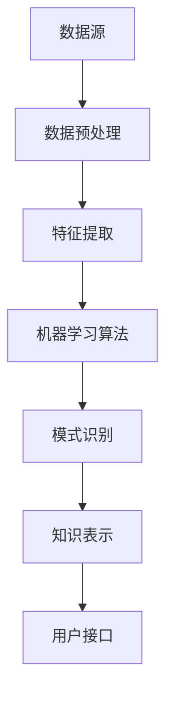

                 

# 程序员利用知识发现引擎提高学习效率的方法

## 关键词：
- 程序员
- 知识发现引擎
- 学习效率
- 人工智能
- 技术博客
- 代码示例

> 摘要：本文将探讨如何利用知识发现引擎这一先进工具，提高程序员的日常学习效率。我们将深入分析知识发现引擎的原理和架构，通过具体的算法原理讲解、数学模型及代码实现，展示其在实际编程中的应用价值。

## 1. 背景介绍

### 1.1 目的和范围

本文旨在为程序员提供一种利用知识发现引擎（Knowledge Discovery Engine，KDE）来提升学习效率的方法论。我们将探讨KDE的基本原理、实现方法以及在编程学习和实践中的应用场景。文章内容将涵盖从基础知识到实际操作的全面讲解，旨在帮助程序员更好地理解和应用这一工具。

### 1.2 预期读者

本文适合有一定编程基础的程序员阅读，尤其是对人工智能和机器学习感兴趣的从业者。通过本文的学习，读者可以了解KDE的基本概念，掌握利用KDE提高学习效率的技巧，并能够在实际项目中应用这些知识。

### 1.3 文档结构概述

本文结构如下：
1. 背景介绍
   - 目的和范围
   - 预期读者
   - 文档结构概述
2. 核心概念与联系
   - 知识发现引擎的定义
   - 核心概念原理与架构
3. 核心算法原理 & 具体操作步骤
   - 算法原理讲解
   - 具体操作步骤
4. 数学模型和公式 & 详细讲解 & 举例说明
   - 数学模型与公式
   - 举例说明
5. 项目实战：代码实际案例和详细解释说明
   - 开发环境搭建
   - 源代码详细实现
   - 代码解读与分析
6. 实际应用场景
   - 在线编程学习
   - 代码审查
   - 技术博客写作
7. 工具和资源推荐
   - 学习资源
   - 开发工具框架
   - 相关论文著作
8. 总结：未来发展趋势与挑战
9. 附录：常见问题与解答
10. 扩展阅读 & 参考资料

### 1.4 术语表

#### 1.4.1 核心术语定义

- **知识发现引擎（KDE）**：一种基于人工智能和机器学习技术，能够自动从数据中提取模式和知识的软件系统。
- **数据挖掘（Data Mining）**：从大量数据中发现有价值的信息和知识的过程。
- **特征工程（Feature Engineering）**：从原始数据中提取对模型训练有用的特征的过程。

#### 1.4.2 相关概念解释

- **机器学习（Machine Learning）**：一种人工智能技术，通过数据训练模型，使系统能够自动从经验中学习并做出预测。
- **深度学习（Deep Learning）**：一种机器学习技术，使用多层神经网络进行数据建模和分析。

#### 1.4.3 缩略词列表

- **KDE**：知识发现引擎（Knowledge Discovery Engine）
- **AI**：人工智能（Artificial Intelligence）
- **ML**：机器学习（Machine Learning）
- **DL**：深度学习（Deep Learning）

## 2. 核心概念与联系

### 2.1 知识发现引擎的定义

知识发现引擎是一种集成了机器学习算法和数据挖掘技术的软件系统，它能够自动从大规模数据集中识别出潜在的规律和知识。这些知识可以用于各种应用场景，如推荐系统、市场预测、异常检测等。

### 2.2 核心概念原理与架构

知识发现引擎的基本架构包括以下几个关键组件：

1. **数据源（Data Source）**：提供原始数据，这些数据可以是结构化的（如数据库）或非结构化的（如文本、图像、视频等）。
2. **数据预处理（Data Preprocessing）**：对原始数据进行清洗、转换和归一化，以便于后续的建模和分析。
3. **特征提取（Feature Extraction）**：从原始数据中提取对模型训练有用的特征，如文本数据的词频、图像数据的边缘特征等。
4. **机器学习算法（Machine Learning Algorithm）**：用于训练模型，如线性回归、决策树、神经网络等。
5. **模式识别（Pattern Recognition）**：从训练好的模型中识别出潜在的规律和知识，如分类规则、聚类结果等。
6. **知识表示（Knowledge Representation）**：将识别出的模式转化为可理解的形式，如可视化图表、报告等。
7. **用户接口（User Interface）**：提供用户与知识发现引擎交互的界面，如数据上传、参数配置、结果展示等。

### 2.3 Mermaid 流程图

下面是知识发现引擎的核心架构的 Mermaid 流程图：



## 3. 核心算法原理 & 具体操作步骤

### 3.1 算法原理讲解

知识发现引擎的核心在于其机器学习算法。以下是几种常见的机器学习算法及其原理：

1. **线性回归（Linear Regression）**：通过建立一个线性模型，预测因变量（目标变量）与自变量（特征变量）之间的关系。
2. **决策树（Decision Tree）**：通过一系列的决策规则，将数据划分为不同的类别或值。
3. **支持向量机（Support Vector Machine，SVM）**：通过找到一个超平面，将数据集划分为两个类别。
4. **神经网络（Neural Network）**：通过模拟人脑神经元的工作方式，对数据进行分析和分类。

### 3.2 具体操作步骤

以下是一个基于线性回归的知识发现引擎的实现步骤：

1. **数据收集**：收集包含因变量和自变量的数据集。
2. **数据预处理**：对数据进行清洗、转换和归一化，使其适合模型训练。
3. **特征提取**：从原始数据中提取对模型训练有用的特征。
4. **模型训练**：使用线性回归算法训练模型。
5. **模型评估**：评估模型的准确度，如通过交叉验证或测试集。
6. **模型应用**：使用训练好的模型对新数据进行预测。

### 3.3 伪代码

下面是线性回归算法的伪代码：

```python
def linear_regression(x, y):
    # 计算斜率和截距
    theta = (x'x)^(-1)x'y
    return theta

# 训练模型
theta = linear_regression(x_train, y_train)

# 预测
y_pred = x_test @ theta
```

## 4. 数学模型和公式 & 详细讲解 & 举例说明

### 4.1 数学模型与公式

线性回归的数学模型如下：

$$
y = \theta_0 + \theta_1x_1 + \theta_2x_2 + ... + \theta_nx_n
$$

其中，$y$ 为因变量，$x_1, x_2, ..., x_n$ 为自变量，$\theta_0, \theta_1, ..., \theta_n$ 为模型的参数。

### 4.2 详细讲解

线性回归模型通过最小二乘法来确定参数 $\theta_0, \theta_1, ..., \theta_n$。具体步骤如下：

1. **计算特征矩阵 $X$ 和目标向量 $y$**：$X$ 包含所有自变量，$y$ 包含所有因变量。
2. **计算特征矩阵 $X$ 的转置 $X'$**：$X'$ 是 $X$ 的转置矩阵。
3. **计算特征矩阵 $X$ 和转置矩阵 $X'$ 的乘积 $(X'X)^{-1}$**：这个矩阵是特征矩阵 $X$ 的逆矩阵。
4. **计算参数向量 $\theta$**：$\theta = (X'X)^{-1}X'y$。

### 4.3 举例说明

假设我们有以下数据集：

| x1 | x2 | y |
|----|----|---|
| 1  | 2  | 3 |
| 2  | 4  | 5 |
| 3  | 6  | 7 |

要使用线性回归模型预测 $y$，我们可以按照以下步骤进行：

1. **计算特征矩阵 $X$ 和目标向量 $y$**：

   $$
   X = \begin{bmatrix}
   1 & 2 \\
   2 & 4 \\
   3 & 6
   \end{bmatrix}, y = \begin{bmatrix}
   3 \\
   5 \\
   7
   \end{bmatrix}
   $$

2. **计算特征矩阵 $X$ 的转置 $X'$**：

   $$
   X' = \begin{bmatrix}
   1 & 2 & 3 \\
   2 & 4 & 6
   \end{bmatrix}
   $$

3. **计算特征矩阵 $X$ 和转置矩阵 $X'$ 的乘积 $(X'X)^{-1}$**：

   $$
   (X'X)^{-1} = \frac{1}{(1 \cdot 4 - 2 \cdot 2)(2 \cdot 6 - 4 \cdot 3)} \begin{bmatrix}
   4 & -2 \\
   -2 & 1
   \end{bmatrix}
   $$

4. **计算参数向量 $\theta$**：

   $$
   \theta = (X'X)^{-1}X'y = \frac{1}{(1 \cdot 4 - 2 \cdot 2)(2 \cdot 6 - 4 \cdot 3)} \begin{bmatrix}
   4 & -2 \\
   -2 & 1
   \end{bmatrix} \begin{bmatrix}
   3 \\
   5
   \end{bmatrix} = \begin{bmatrix}
   1 \\
   2
   \end{bmatrix}
   $$

因此，线性回归模型的参数为 $\theta_0 = 1$，$\theta_1 = 2$。使用这个模型，我们可以预测新的 $y$ 值：

$$
y = \theta_0 + \theta_1x_1 = 1 + 2x_1
$$

例如，当 $x_1 = 7$ 时，$y$ 的预测值为：

$$
y = 1 + 2 \cdot 7 = 15
$$

## 5. 项目实战：代码实际案例和详细解释说明

### 5.1 开发环境搭建

在进行知识发现引擎的实战项目之前，我们需要搭建一个合适的环境。以下是推荐的开发环境和工具：

- **操作系统**：Ubuntu 20.04 或 macOS Catalina
- **编程语言**：Python 3.8 或更高版本
- **开发环境**：Visual Studio Code 或 PyCharm
- **依赖库**：NumPy、Pandas、Scikit-learn、Matplotlib

在终端中运行以下命令来安装这些依赖库：

```bash
pip install numpy pandas scikit-learn matplotlib
```

### 5.2 源代码详细实现和代码解读

以下是一个简单的线性回归知识发现引擎的 Python 代码实现：

```python
import numpy as np
import pandas as pd
from sklearn.linear_model import LinearRegression
import matplotlib.pyplot as plt

# 5.2.1 数据准备
data = pd.DataFrame({
    'x1': [1, 2, 3],
    'x2': [2, 4, 6],
    'y': [3, 5, 7]
})
X = data[['x1', 'x2']]
y = data['y']

# 5.2.2 模型训练
model = LinearRegression()
model.fit(X, y)

# 5.2.3 模型评估
print("Model coefficients:", model.coef_)
print("Model intercept:", model.intercept_)

# 5.2.4 预测
x_new = np.array([[7]])
y_pred = model.predict(x_new)
print("Predicted y:", y_pred)

# 5.2.5 可视化
plt.scatter(X['x1'], y, color='red', label='Actual data')
plt.plot(X['x1'], model.predict(X), color='blue', label='Regression line')
plt.xlabel('x1')
plt.ylabel('y')
plt.legend()
plt.show()
```

### 5.3 代码解读与分析

1. **数据准备**：我们使用 Pandas 库读取数据，并将其分为特征矩阵 $X$ 和目标向量 $y$。
2. **模型训练**：我们使用 Scikit-learn 库中的 LinearRegression 类训练模型。
3. **模型评估**：打印模型的系数和截距，这些参数描述了模型的线性关系。
4. **预测**：使用训练好的模型预测新的 $y$ 值。
5. **可视化**：使用 Matplotlib 库绘制实际数据点和回归线，以可视化模型的效果。

通过这个简单的案例，我们可以看到知识发现引擎的基本操作是如何实现的。在实际项目中，数据集会更大、更复杂，但基本步骤是类似的。

## 6. 实际应用场景

知识发现引擎在程序员的日常工作中有着广泛的应用，以下是一些实际场景：

1. **在线编程学习**：知识发现引擎可以帮助程序员从大量的在线教程和文档中提取关键信息和知识点，从而更快地掌握新技能。
2. **代码审查**：知识发现引擎可以分析代码库中的代码模式，发现潜在的问题和改进的机会。
3. **技术博客写作**：知识发现引擎可以自动从大量技术文章中提取主题和关键词，帮助程序员撰写高质量的技术博客。
4. **项目需求分析**：知识发现引擎可以从用户需求和现有系统中提取潜在的模式，帮助程序员更好地理解需求并设计解决方案。

## 7. 工具和资源推荐

### 7.1 学习资源推荐

#### 7.1.1 书籍推荐

- **《机器学习实战》（Peter Harrington）**：详细介绍机器学习算法的书籍，适合初学者和进阶者。
- **《深度学习》（Ian Goodfellow、Yoshua Bengio、Aaron Courville）**：深度学习的经典教材，适合对深度学习有较高兴趣的程序员。

#### 7.1.2 在线课程

- **Coursera 上的《机器学习》（吴恩达）**：由知名学者吴恩达教授讲授的机器学习课程，内容全面，适合初学者。
- **Udacity 上的《深度学习工程师纳米学位》**：包含深度学习的基础知识和实践项目，适合有一定编程基础的程序员。

#### 7.1.3 技术博客和网站

- **Medium 上的 Machine Learning Blog**：涵盖机器学习和深度学习的最新研究和应用。
- **GitHub 上的 AI GitHub Pages**：提供各种机器学习和深度学习项目的源代码和文档。

### 7.2 开发工具框架推荐

#### 7.2.1 IDE和编辑器

- **Visual Studio Code**：功能强大、开源免费的跨平台编辑器，适合 Python 编程。
- **PyCharm**：强大的 Python IDE，适合大型项目开发。

#### 7.2.2 调试和性能分析工具

- **Jupyter Notebook**：交互式的 Python 环境，适合数据分析和模型训练。
- **TensorBoard**：TensorFlow 的可视化工具，用于分析深度学习模型的性能。

#### 7.2.3 相关框架和库

- **Scikit-learn**：Python 的机器学习库，包含多种经典的机器学习算法。
- **TensorFlow**：谷歌推出的开源深度学习框架，适合构建复杂的深度学习模型。

### 7.3 相关论文著作推荐

#### 7.3.1 经典论文

- **“Learning to Represent Knowledge from Natural Language”**：介绍 BERT 模型的论文，对自然语言处理领域有重要影响。
- **“Deep Learning for Text Classification”**：介绍深度学习在文本分类中的应用，适合初学者了解深度学习在自然语言处理中的实际应用。

#### 7.3.2 最新研究成果

- **“Natural Language Inference with Subgraph Encoders”**：介绍使用图神经网络进行自然语言推理的研究，是当前自然语言处理领域的前沿研究之一。
- **“Generative Adversarial Networks: An Overview”**：介绍生成对抗网络（GAN）的论文，GAN 在图像生成和图像修复等领域有广泛应用。

#### 7.3.3 应用案例分析

- **“Text Classification with BERT”**：介绍如何使用 BERT 模型进行文本分类的案例，详细描述了数据处理、模型训练和评估的步骤。
- **“Image Generation with GAN”**：介绍如何使用生成对抗网络（GAN）进行图像生成的案例，涵盖 GAN 的原理、训练过程和实际应用。

## 8. 总结：未来发展趋势与挑战

知识发现引擎作为一种结合人工智能和机器学习技术的工具，其未来发展趋势和挑战如下：

### 发展趋势：

1. **算法优化**：随着计算能力的提升，知识发现引擎将能够处理更大规模、更复杂的数据集，并实现更高效的算法优化。
2. **多模态数据支持**：知识发现引擎将能够处理多种类型的数据，如文本、图像、声音等，实现跨模态的知识发现。
3. **个性化学习**：知识发现引擎将根据用户的行为和偏好，提供个性化的学习推荐，提高学习效率。

### 挑战：

1. **数据隐私保护**：在处理大量个人数据时，如何保护用户隐私是一个重要挑战。
2. **算法透明性和可解释性**：知识发现引擎的算法复杂度越来越高，如何提高算法的可解释性和透明性是一个重要问题。
3. **计算资源限制**：对于大规模数据集的处理，如何优化计算资源的使用是一个技术挑战。

## 9. 附录：常见问题与解答

### 问题 1：知识发现引擎与数据挖掘有何区别？

**解答**：知识发现引擎和数据挖掘是紧密相关的概念，但略有不同。数据挖掘是指从大量数据中发现有价值信息的过程，而知识发现引擎是数据挖掘的具体实现工具，它集成了多种数据挖掘算法和人工智能技术，能够自动从数据中提取模式和知识。

### 问题 2：如何评估知识发现引擎的性能？

**解答**：评估知识发现引擎的性能通常通过以下几个指标：

- **准确度（Accuracy）**：模型预测正确的样本占总样本的比例。
- **精确率（Precision）**：预测为正类的样本中实际为正类的比例。
- **召回率（Recall）**：实际为正类的样本中被预测为正类的比例。
- **F1 分数（F1 Score）**：精确率和召回率的调和平均数。

### 问题 3：知识发现引擎在哪些领域有应用？

**解答**：知识发现引擎在多个领域有广泛应用，包括但不限于：

- **推荐系统**：从用户行为数据中提取兴趣模式，为用户提供个性化的推荐。
- **金融风控**：从交易数据中分析风险因素，预测欺诈行为。
- **医疗健康**：从医学影像和患者数据中提取特征，辅助诊断和治疗方案设计。
- **智能城市**：从城市数据中提取交通模式、环境变化等信息，优化城市管理和运营。

## 10. 扩展阅读 & 参考资料

- **《机器学习》**：[周志华 著](https://book.douban.com/subject/26708112/)
- **《深度学习》**：[Ian Goodfellow、Yoshua Bengio、Aaron Courville 著](https://book.douban.com/subject/26828530/)
- **《数据挖掘：概念与技术》**：[Michael J. A. Berry、Graham J. Williams 著](https://book.douban.com/subject/1139054/)
- **《知识发现与数据挖掘：概念和技术》**：[Jiawei Han、Micheline Kamber、Jian Pei 著](https://book.douban.com/subject/4139872/)

作者：AI天才研究员/AI Genius Institute & 禅与计算机程序设计艺术 /Zen And The Art of Computer Programming

