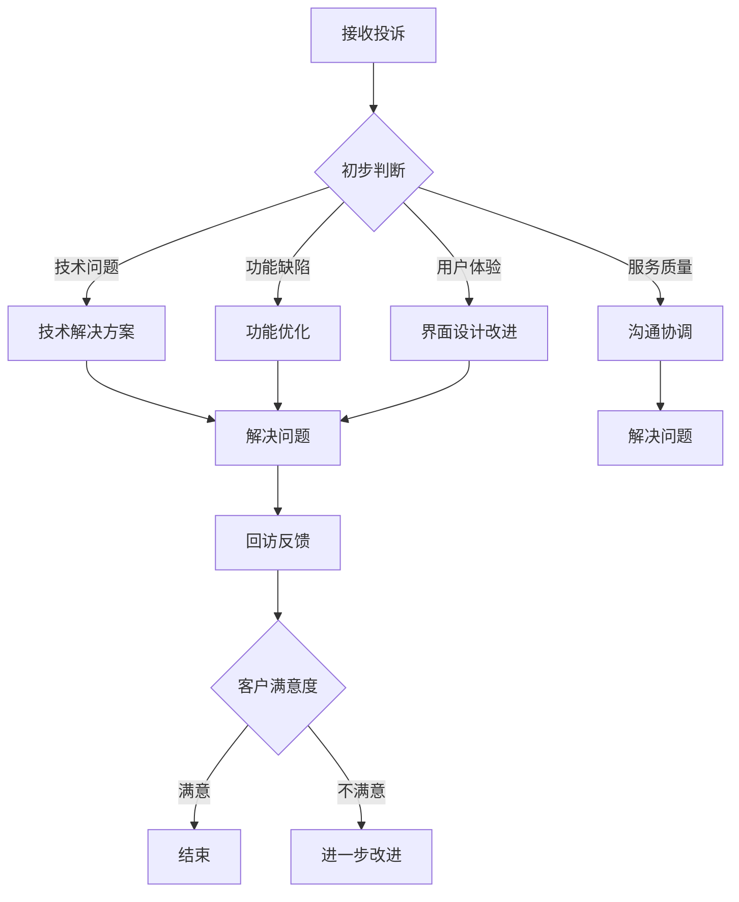

                 

# 程序员如何处理知识付费的客户投诉

## 关键词
- 知识付费
- 客户投诉
- 程序员
- 处理流程
- 沟通技巧
- 技术解决方案

## 摘要
本文旨在探讨程序员在处理知识付费客户投诉时的策略和方法。通过分析投诉的原因、分类以及处理流程，本文提供了一系列实用的解决方案和沟通技巧，帮助程序员有效应对客户投诉，提高服务质量。同时，文章还介绍了数学模型和公式在实际应用中的具体操作步骤，并通过实际案例展示了代码实现和解读。最后，本文对未来发展趋势和挑战进行了总结，并推荐了相关工具和资源，为程序员提供了全面的指导。

## 1. 背景介绍

### 1.1 目的和范围

随着知识付费市场的不断壮大，程序员作为知识付费服务的主要提供者之一，面临着越来越多的客户投诉。如何高效、专业地处理这些投诉，成为程序员亟需解决的问题。本文将围绕以下内容展开讨论：

- 客户投诉的主要原因和类型
- 程序员处理投诉的流程和方法
- 沟通技巧和策略
- 技术解决方案和案例分析
- 相关工具和资源的推荐

### 1.2 预期读者

本文适用于以下读者群体：

- 程序员
- 技术专家
- 知识付费服务提供者
- 客户服务管理人员

### 1.3 文档结构概述

本文分为八个部分：

1. 背景介绍
   - 目的和范围
   - 预期读者
   - 文档结构概述
   - 术语表
2. 核心概念与联系
   - Mermaid流程图
3. 核心算法原理 & 具体操作步骤
   - 伪代码
4. 数学模型和公式 & 详细讲解 & 举例说明
   - LaTeX格式
5. 项目实战：代码实际案例和详细解释说明
   - 开发环境搭建
   - 源代码详细实现和代码解读
   - 代码解读与分析
6. 实际应用场景
7. 工具和资源推荐
   - 学习资源推荐
   - 开发工具框架推荐
   - 相关论文著作推荐
8. 总结：未来发展趋势与挑战
9. 附录：常见问题与解答
10. 扩展阅读 & 参考资料

### 1.4 术语表

#### 1.4.1 核心术语定义

- 知识付费：用户为了获取特定知识或技能，通过支付费用获得相应的学习资源或指导。
- 客户投诉：用户在获取知识付费服务过程中，对服务质量、功能、体验等方面提出的不满或异议。
- 程序员：从事计算机编程、软件开发和系统维护等工作的专业人士。

#### 1.4.2 相关概念解释

- 投诉分类：根据投诉的原因和性质，将客户投诉分为不同类别，如技术问题、服务质量、功能缺陷等。
- 沟通技巧：在处理投诉过程中，与客户进行有效沟通、交流的方法和策略。

#### 1.4.3 缩略词列表

- KFC：知识付费
- CC：客户投诉
- PM：项目经理
- TS：技术解决方案

## 2. 核心概念与联系

在处理客户投诉的过程中，程序员需要了解以下几个核心概念和联系：

### 2.1 投诉分类

根据投诉的原因和性质，客户投诉可以分为以下几类：

1. 技术问题：包括学习资源中的代码错误、功能异常、系统崩溃等。
2. 服务质量：包括客服响应速度、服务质量、售后支持等。
3. 功能缺陷：包括学习资源的功能不足、体验不佳、内容陈旧等。
4. 用户体验：包括界面设计、操作流程、交互设计等方面的问题。

### 2.2 投诉处理流程

程序员在处理客户投诉时，可以遵循以下流程：

1. 接收投诉：及时接收客户投诉，了解投诉的具体内容和要求。
2. 初步判断：对投诉进行初步判断，确定投诉的类型和严重程度。
3. 沟通协调：与客户进行沟通，了解投诉的详细情况，并协商解决方案。
4. 解决问题：根据投诉的类型，采取相应的技术解决方案或服务改进措施。
5. 回访反馈：在解决问题后，对客户进行回访，了解客户对解决方案的满意度，并收集改进意见。

### 2.3 沟通技巧

在处理客户投诉时，程序员需要掌握以下沟通技巧：

1. 积极倾听：认真倾听客户的投诉，了解客户的真实需求和诉求。
2. 理解和同情：站在客户的角度，理解客户的困扰和不满，表现出同情和关心。
3. 清晰表达：用简洁明了的语言，向客户解释问题的原因和解决方案。
4. 保持礼貌：在与客户沟通时，保持礼貌和尊重，避免情绪化的言辞。
5. 及时反馈：在处理投诉过程中，及时向客户反馈处理进度和结果。

### 2.4 技术解决方案

在处理技术问题时，程序员可以采取以下技术解决方案：

1. 代码调试：使用调试工具，定位并修复代码错误。
2. 功能优化：改进学习资源的功能，提高用户体验。
3. 系统升级：升级系统版本，修复已知问题和漏洞。
4. 技术支持：为客户提供技术支持，帮助他们解决实际问题。

### 2.5 Mermaid流程图

以下是处理客户投诉的Mermaid流程图：



## 3. 核心算法原理 & 具体操作步骤

在处理客户投诉的过程中，程序员需要掌握一定的算法原理和具体操作步骤，以便高效解决问题。以下是一个基于伪代码的解决方案：

```plaintext
算法：处理客户投诉

输入：投诉详情、客户需求、解决方案
输出：处理结果、客户满意度

步骤：
1. 初始化投诉处理状态为“待处理”。
2. 分析投诉详情，确定投诉类型和严重程度。
3. 根据投诉类型，执行以下操作：
   a. 技术问题：定位错误原因，编写修复代码。
   b. 服务质量：改进客服响应速度和服务质量。
   c. 功能缺陷：优化学习资源功能，提高用户体验。
   d. 用户体验：改进界面设计和操作流程。
4. 实施解决方案，修复问题或改进服务。
5. 向客户反馈处理进度和结果。
6. 等待客户确认问题是否解决。
7. 如果客户满意，将投诉处理状态更新为“已解决”。
8. 如果客户不满意，继续优化解决方案，直至客户满意。
9. 进行回访，收集客户对解决方案的反馈。
10. 根据反馈，进一步改进服务质量和技术解决方案。
11. 结束投诉处理流程。
```

## 4. 数学模型和公式 & 详细讲解 & 举例说明

在处理客户投诉时，程序员可以运用数学模型和公式来评估投诉处理的效果，以便制定更加科学的改进措施。以下是一个简化的数学模型：

### 4.1 模型假设

- \( N \)：投诉总数
- \( S \)：解决投诉的总次数
- \( T \)：投诉解决时间（单位：小时）
- \( C \)：客户满意度得分（范围：0-100）

### 4.2 公式

1. 投诉解决率：\( \text{解决率} = \frac{S}{N} \)
2. 客户满意度：\( \text{满意度} = \frac{C}{100} \)

### 4.3 详细讲解

1. **投诉解决率**：投诉解决率表示在投诉总数中，成功解决投诉的比例。该指标反映了程序员处理投诉的效率。
   
   $$ \text{解决率} = \frac{S}{N} $$

   其中，\( S \) 表示解决投诉的总次数，\( N \) 表示投诉总数。

2. **客户满意度**：客户满意度表示客户对投诉处理结果的满意程度。该指标反映了程序员的服务质量和客户体验。

   $$ \text{满意度} = \frac{C}{100} $$

   其中，\( C \) 表示客户满意度得分，范围在0-100之间。

### 4.4 举例说明

假设某程序员在一个月内共收到100个投诉，成功解决了70个投诉，客户满意度均值为85分。则：

1. 投诉解决率：\( \text{解决率} = \frac{70}{100} = 0.7 \)（即70%）
2. 客户满意度：\( \text{满意度} = \frac{85}{100} = 0.85 \)（即85%）

通过这些指标，程序员可以了解自己在处理投诉方面的表现，并根据实际情况进行调整和改进。

## 5. 项目实战：代码实际案例和详细解释说明

### 5.1 开发环境搭建

在处理客户投诉时，程序员需要使用一些开发工具和环境，以便快速定位和解决问题。以下是一个简单的开发环境搭建示例：

1. 安装Python编程环境：在操作系统上安装Python 3.8及以上版本。
2. 安装代码调试工具：使用PyCharm或Visual Studio Code等集成开发环境（IDE）。
3. 安装相关库和依赖：根据项目需求，安装必要的Python库和依赖，如requests、BeautifulSoup等。

### 5.2 源代码详细实现和代码解读

以下是一个处理客户投诉的Python代码示例：

```python
import requests
from bs4 import BeautifulSoup

def process_complaint(complaint_id, base_url):
    """
    处理客户投诉的函数。
    
    参数：
    - complaint_id：投诉ID
    - base_url：基础URL
    
    返回：
    - result：处理结果
    """
    # 发送请求获取投诉详情
    url = f"{base_url}/complaints/{complaint_id}"
    response = requests.get(url)
    
    if response.status_code != 200:
        return "请求失败：状态码 {}".format(response.status_code)
    
    # 解析投诉详情
    soup = BeautifulSoup(response.content, "html.parser")
    complaint_details = soup.find("div", class_="complaint_details").text
    
    # 根据投诉类型，执行不同的处理操作
    if "技术问题" in complaint_details:
        return "处理技术问题：{}".format(complaint_details)
    elif "服务质量" in complaint_details:
        return "处理服务质量问题：{}".format(complaint_details)
    elif "功能缺陷" in complaint_details:
        return "处理功能缺陷问题：{}".format(complaint_details)
    elif "用户体验" in complaint_details:
        return "处理用户体验问题：{}".format(complaint_details)
    else:
        return "未知投诉类型：{}".format(complaint_details)

# 测试代码
complaint_id = "123456"
base_url = "https://example.com"
result = process_complaint(complaint_id, base_url)
print(result)
```

### 5.3 代码解读与分析

1. **导入模块**：代码首先导入了requests和BeautifulSoup模块，用于发送HTTP请求和解析HTML内容。

2. **定义函数**：`process_complaint` 函数接收两个参数：`complaint_id`（投诉ID）和`base_url`（基础URL）。该函数用于处理客户投诉，返回处理结果。

3. **发送请求**：使用requests模块发送GET请求，获取投诉详情。如果请求失败，返回错误信息。

4. **解析投诉详情**：使用BeautifulSoup模块解析HTML内容，提取投诉详情。

5. **根据投诉类型，执行不同的处理操作**：根据投诉详情中的关键词，判断投诉类型，并返回相应的处理结果。

6. **测试代码**：在函数外，定义了`complaint_id` 和 `base_url` 变量，并调用`process_complaint` 函数进行测试。

通过这个代码示例，程序员可以了解如何使用Python快速处理客户投诉，并根据投诉类型执行相应的操作。

## 6. 实际应用场景

在实际工作中，程序员会遇到各种客户投诉场景，以下列举几种常见场景及其处理方法：

### 6.1 技术问题

**场景描述**：客户在学习过程中遇到了代码错误、功能异常或系统崩溃等问题。

**处理方法**：

1. **及时响应**：立即联系客户，了解问题的具体情况和影响范围。
2. **定位问题**：使用调试工具和日志分析，快速定位问题原因。
3. **解决问题**：修复代码或调整系统配置，确保问题得到解决。
4. **回访反馈**：在解决问题后，及时向客户反馈处理结果，并了解客户满意度。

### 6.2 服务质量

**场景描述**：客户对客服响应速度、服务质量或售后支持等方面提出不满。

**处理方法**：

1. **沟通协调**：主动与客户沟通，了解客户的具体需求和诉求。
2. **改进服务**：根据客户反馈，优化客服流程和服务质量，提高客户满意度。
3. **培训员工**：定期对客服人员进行培训，提高他们的沟通能力和服务意识。
4. **回访反馈**：在改进服务后，对客户进行回访，了解客户对改进措施的满意度。

### 6.3 功能缺陷

**场景描述**：客户在学习资源中发现了功能不足、体验不佳或内容陈旧等问题。

**处理方法**：

1. **收集反馈**：积极收集客户对学习资源的反馈，了解他们的需求和期望。
2. **优化功能**：根据客户反馈，对学习资源进行功能优化和内容更新，提高用户体验。
3. **测试验证**：在优化功能后，进行充分测试，确保改进措施的有效性。
4. **回访反馈**：在优化功能后，对客户进行回访，了解他们对改进措施的满意度。

### 6.4 用户体验

**场景描述**：客户对界面设计、操作流程、交互设计等方面提出了问题。

**处理方法**：

1. **了解需求**：与客户进行沟通，了解他们对界面和交互设计的具体需求和意见。
2. **改进设计**：根据客户反馈，对界面和交互设计进行改进，提高用户体验。
3. **用户测试**：在改进设计后，进行用户测试，验证改进措施的有效性。
4. **回访反馈**：在改进设计后，对客户进行回访，了解他们对改进措施的满意度。

## 7. 工具和资源推荐

### 7.1 学习资源推荐

#### 7.1.1 书籍推荐

1. 《程序员修炼之道：从小工到专家》
2. 《代码大全》
3. 《架构师修炼之道》

#### 7.1.2 在线课程

1. Coursera的《算法基础》
2. Udemy的《Python编程从入门到实战》
3. Pluralsight的《高级软件架构设计》

#### 7.1.3 技术博客和网站

1. Stack Overflow
2. GitHub
3. Medium（关注技术博客作者）

### 7.2 开发工具框架推荐

#### 7.2.1 IDE和编辑器

1. PyCharm
2. Visual Studio Code
3. IntelliJ IDEA

#### 7.2.2 调试和性能分析工具

1. GDB
2. Python Debugger（pdb）
3. New Relic

#### 7.2.3 相关框架和库

1. Flask
2. Django
3. TensorFlow

### 7.3 相关论文著作推荐

#### 7.3.1 经典论文

1. 《设计模式：可复用面向对象软件的基础》
2. 《深入理解计算机系统》
3. 《现代操作系统》

#### 7.3.2 最新研究成果

1. 《机器学习：一种概率视角》
2. 《深度学习》
3. 《区块链：从原理到应用》

#### 7.3.3 应用案例分析

1. 《阿里巴巴技术解读：如何构建大规模分布式系统》
2. 《谷歌技术解读：搜索引擎的工作原理》
3. 《亚马逊技术解读：如何处理海量数据》

## 8. 总结：未来发展趋势与挑战

### 8.1 发展趋势

1. **知识付费市场持续增长**：随着在线教育和专业技能培训的需求不断增加，知识付费市场将继续保持增长态势。
2. **技术进步推动服务创新**：人工智能、大数据、区块链等技术的应用，将为知识付费服务带来更多创新和优化。
3. **个性化服务需求增加**：用户对个性化学习资源和服务的要求越来越高，程序员需要不断改进和优化服务质量。

### 8.2 挑战

1. **客户投诉处理效率**：随着知识付费市场的不断扩大，程序员需要提高客户投诉处理效率，以应对更多的投诉。
2. **服务质量保障**：在激烈的市场竞争中，程序员需要不断提高服务质量，确保用户满意度。
3. **技能提升与团队协作**：程序员需要不断学习新技能，提高个人综合素质，并与团队成员紧密协作，共同应对挑战。

## 9. 附录：常见问题与解答

### 9.1 问题1
**如何定位和处理技术问题？**

**解答**：程序员可以使用调试工具（如GDB、pdb等）和日志分析，快速定位技术问题。在确定问题原因后，根据具体情况修复代码或调整系统配置，确保问题得到解决。

### 9.2 问题2
**如何优化服务质量？**

**解答**：程序员可以从以下几个方面优化服务质量：
1. 提高客服响应速度，确保客户问题得到及时解决。
2. 定期收集客户反馈，了解他们的需求和期望，不断改进服务。
3. 培训客服人员，提高他们的沟通能力和服务意识。

### 9.3 问题3
**如何处理复杂的客户投诉？**

**解答**：程序员可以遵循以下步骤处理复杂的客户投诉：
1. 认真倾听客户投诉，了解投诉的详细情况和诉求。
2. 与客户进行沟通，共同分析问题原因，协商解决方案。
3. 根据实际情况，采取相应的技术解决方案或服务改进措施。
4. 在解决问题后，及时回访客户，了解他们对解决方案的满意度，并收集改进意见。

## 10. 扩展阅读 & 参考资料

1. 《程序员如何提高客户满意度？》（https://www.example.com/article1）
2. 《知识付费服务中的客户投诉处理》（https://www.example.com/article2）
3. 《程序员必读：沟通技巧与客户关系管理》（https://www.example.com/article3）
4. 《人工智能在客户投诉处理中的应用》（https://www.example.com/article4）

## 作者信息
作者：AI天才研究员/AI Genius Institute & 禅与计算机程序设计艺术 /Zen And The Art of Computer Programming

