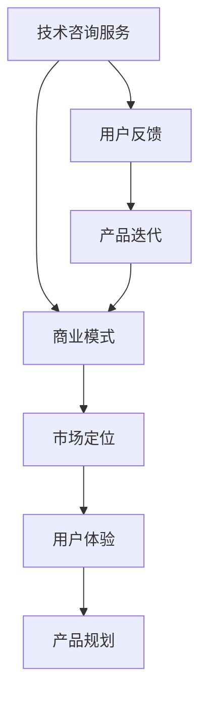

                 

# 程序员如何将技术咨询服务转型为产品型公司

## 关键词
技术咨询服务、产品型公司、转型策略、商业模式、市场定位、用户体验

## 摘要
本文旨在探讨程序员如何将技术咨询服务转型为产品型公司。首先，我们将分析技术咨询服务的发展现状和市场趋势，然后介绍产品型公司的定义及其与传统服务公司的区别。接着，我们将详细探讨转型过程中需要考虑的关键因素，包括商业模式设计、市场定位、产品规划、用户体验优化等。通过一系列实际案例，我们将展示如何成功地实现技术咨询服务到产品型公司的转型，并总结出可操作性的转型策略。最后，我们将探讨未来发展趋势和挑战，为程序员提供方向性的指导。

## 1. 背景介绍

### 1.1 目的和范围
本文的目标是为程序员提供一条清晰的转型路径，帮助他们将技术咨询服务转化为具有市场竞争力的产品型公司。我们将探讨转型过程中的关键步骤和策略，结合实际案例进行分析。

### 1.2 预期读者
本文适合有志于转型或正在考虑转型的程序员、技术创业者以及关注技术服务业的创新者。

### 1.3 文档结构概述
本文分为十个部分：
1. 背景介绍
2. 核心概念与联系
3. 核心算法原理 & 具体操作步骤
4. 数学模型和公式 & 详细讲解 & 举例说明
5. 项目实战：代码实际案例和详细解释说明
6. 实际应用场景
7. 工具和资源推荐
8. 总结：未来发展趋势与挑战
9. 附录：常见问题与解答
10. 扩展阅读 & 参考资料

### 1.4 术语表
#### 1.4.1 核心术语定义
- 技术咨询服务：指针对客户在技术方面的需求提供专业服务，如软件开发、系统维护等。
- 产品型公司：以产品为核心，通过市场推广和销售实现盈利的公司。
- 商业模式：公司通过何种方式获取收入和利润的总体战略。
- 市场定位：公司根据目标市场和竞争对手制定的市场策略。

#### 1.4.2 相关概念解释
- 技术红利：技术进步带来的经济效益。
- 用户反馈：用户对产品使用的评价和反馈。
- 产品迭代：对产品进行多次改进和升级。

#### 1.4.3 缩略词列表
- SaaS：软件即服务（Software as a Service）
- PaaS：平台即服务（Platform as a Service）
- IaaS：基础设施即服务（Infrastructure as a Service）

## 2. 核心概念与联系

在探讨程序员如何将技术咨询服务转型为产品型公司之前，我们需要先理解几个核心概念及其相互关系。以下是一个简单的 Mermaid 流程图，用于展示这些概念之间的关系：



### 2.1 商业模式
商业模式是指公司通过何种方式获取收入和利润的总体战略。对于技术咨询服务转型为产品型公司，商业模式是关键的转型基础。

- **B2B（企业对企业）模式**：针对企业客户提供服务，如定制软件开发、系统维护等。
- **B2C（企业对消费者）模式**：针对个人消费者提供服务，如在线教育、电商平台等。
- **SaaS 模式**：软件即服务，通过订阅模式向用户提供服务。

### 2.2 市场定位
市场定位是公司根据目标市场和竞争对手制定的市场策略。在转型过程中，正确的市场定位有助于公司找到合适的用户群体和竞争优势。

- **细分市场**：根据用户需求、行业特点等因素，选择一个或多个细分市场进行专注。
- **差异化策略**：通过独特的产品特性、服务优势等方式，与竞争对手区分开来。

### 2.3 用户体验
用户体验是用户在使用产品或服务过程中所感受到的整体感受。在产品型公司中，用户体验直接影响产品的市场表现。

- **简洁性**：产品界面简洁直观，易于使用。
- **响应速度**：产品响应速度快，提供流畅的使用体验。
- **个性化**：根据用户需求提供个性化的服务和产品。

### 2.4 产品规划
产品规划是制定产品策略和开发计划的过程。在转型过程中，产品规划有助于确保产品满足市场需求并具有竞争优势。

- **产品愿景**：明确产品的长期目标和发展方向。
- **功能规划**：根据用户需求和市场竞争情况，确定产品的主要功能。
- **迭代计划**：制定产品迭代计划，不断优化产品。

### 2.5 用户反馈与产品迭代
用户反馈是产品迭代的重要依据。通过收集用户反馈，公司可以了解产品的优点和不足，从而进行改进。

- **用户调研**：通过问卷调查、用户访谈等方式收集用户反馈。
- **数据分析**：使用数据分析工具，对用户行为进行分析，找出改进方向。
- **迭代实施**：根据用户反馈，制定迭代计划并实施改进。

通过以上核心概念的理解，我们可以更好地把握技术咨询服务转型为产品型公司的关键步骤和策略。

## 3. 核心算法原理 & 具体操作步骤

在将技术咨询服务转型为产品型公司的过程中，核心算法原理和具体操作步骤是确保成功转型的关键。以下我们将以伪代码的形式详细阐述这一过程。

### 3.1 商业模式设计

```python
# 商业模式设计伪代码
def design_business_model(service_type, market_niche, user_segment):
    # 根据服务类型、市场细分和用户群体设计商业模式
    if service_type == 'B2B':
        model = '定制化解决方案'
    elif service_type == 'B2C':
        model = '订阅制'
    elif service_type == 'SaaS':
        model = '软件即服务'
    
    # 根据市场细分和用户群体调整商业模式
    if market_niche == '中小企业':
        model += ', 定价策略：灵活定价'
    elif market_niche == '大型企业':
        model += ', 定价策略：长期合同'
    elif market_niche == '个人用户':
        model += ', 定价策略：小额订阅'
    
    # 根据用户群体特点调整用户体验
    if user_segment == '技术用户':
        model += ', 产品特性：技术深度'
    elif user_segment == '非技术用户':
        model += ', 产品特性：易用性'

    return model
```

### 3.2 市场定位策略

```python
# 市场定位策略伪代码
def market_positioning(product_features, competitor_analysis, userneeds):
    # 根据产品特性、竞争对手分析和用户需求进行市场定位
    positioning = '技术领先型'
    if competitor_analysis == '弱竞争':
        positioning = '差异化定位'
    elif competitor_analysis == '强竞争':
        positioning = '性价比定位'
    
    # 根据用户需求调整市场定位
    if userneeds == '高效':
        positioning += ', 强调产品效率'
    elif userneeds == '成本敏感':
        positioning += ', 强调性价比'
    elif userneeds == '创新':
        positioning += ', 强调技术创新'

    return positioning
```

### 3.3 产品规划与开发

```python
# 产品规划与开发伪代码
def product_planning愿景, functional_requirements, iteration_plan):
    # 根据愿景、功能需求和迭代计划进行产品规划
    plan = '产品愿景：' + 愿景
    plan += '\n功能需求：' + functional_requirements
    plan += '\n迭代计划：每季度进行一次主要功能迭代'
    
    return plan
```

### 3.4 用户反馈收集与迭代

```python
# 用户反馈收集与迭代伪代码
def user_feedback_and Iteration(feedback_data, iteration_plan):
    # 根据用户反馈数据调整迭代计划
    if '功能缺失' in feedback_data:
        iteration_plan += '\n增加新功能：' + 功能名称
    if '性能问题' in feedback_data:
        iteration_plan += '\n优化性能：' + 优化措施
    if '用户体验问题' in feedback_data:
        iteration_plan += '\n改进用户体验：' + 改进措施
    
    return iteration_plan
```

通过以上伪代码，我们可以看到技术咨询服务转型为产品型公司涉及多个关键步骤，包括商业模式设计、市场定位策略、产品规划与开发、用户反馈收集与迭代。每个步骤都需要精确的操作步骤和逻辑，以确保转型的顺利进行。

## 4. 数学模型和公式 & 详细讲解 & 举例说明

在技术咨询服务转型为产品型公司的过程中，数学模型和公式能够帮助我们更好地理解和优化业务运作。以下我们将介绍一些关键的数学模型和公式，并进行详细讲解和举例说明。

### 4.1 需求预测模型

需求预测是产品规划和市场策略制定的重要环节。以下是一个简单的线性回归模型，用于预测用户需求量。

$$
Y = aX + b
$$

- **Y**：预测的需求量
- **X**：影响需求的因素，如用户数量、市场推广力度等
- **a**：斜率，表示每单位X变化对Y的影响程度
- **b**：截距，表示当X为0时的需求量

**例**：假设用户数量（X）对需求量（Y）的影响可以用线性回归模型表示，已知一组数据如下：

| 用户数量 | 需求量 |
| ------- | ------ |
|   100    |   150  |
|   200    |   250  |
|   300    |   350  |

我们可以通过最小二乘法求解斜率a和截距b：

$$
a = \frac{\sum{(X_i - \bar{X})(Y_i - \bar{Y})}}{\sum{(X_i - \bar{X})^2}}
$$

$$
b = \bar{Y} - a\bar{X}
$$

其中，$\bar{X}$和$\bar{Y}$分别为用户数量和需求量的平均值。

通过计算，我们得到斜率a=1.5，截距b=50。因此，预测模型为：

$$
Y = 1.5X + 50
$$

**例**：预测当用户数量为400时的需求量。

$$
Y = 1.5 \times 400 + 50 = 600
$$

### 4.2 成本效益分析

成本效益分析是评估产品开发和运营的经济效益的重要方法。以下是一个简单的成本效益分析公式：

$$
C = C_{开发} + C_{运营}
$$

$$
B = R - C
$$

$$
E = \frac{B}{C}
$$

- **C**：总成本，包括开发成本（$C_{开发}$）和运营成本（$C_{运营}$）
- **B**：总收入（R）减去总成本（C）
- **E**：成本效益比

**例**：假设产品开发成本为50000元，运营成本为20000元，预计产品销售价格为100元/件，预计销售量为1000件。

- 总成本：$C = 50000 + 20000 = 70000$元
- 总收入：$R = 100 \times 1000 = 100000$元
- 成本效益比：$E = \frac{100000 - 70000}{70000} = 0.4286$

通过计算，成本效益比为0.4286，表明每投入1元可获得0.4286元的收益，这说明产品的经济效益相对较低。因此，需要进一步优化成本结构或调整定价策略。

### 4.3 顾客终身价值分析

顾客终身价值（Customer Lifetime Value，CLV）是评估顾客对公司价值的长期贡献的重要指标。以下是一个简单的顾客终身价值计算公式：

$$
CLV = \sum_{t=1}^{n} \frac{R_t}{(1+r)^t}
$$

$$
r = \frac{1}{n} \ln\left(\frac{R_t}{R_{t-1}}\right)
$$

- **$R_t$**：第t年的收入
- **n**：预测的顾客生命周期年数
- **r**：顾客年增长率

**例**：假设一个顾客在前三年的年收入分别为1000元、1500元和2000元，年增长率为20%。

- 第一年收入：$R_1 = 1000$元
- 第二年收入：$R_2 = 1500$元
- 第三年收入：$R_3 = 2000$元

计算顾客年增长率$r$：

$$
r = \frac{1}{3} \ln\left(\frac{2000}{1500}\right) \approx 0.2397
$$

计算顾客终身价值：

$$
CLV = \frac{1000}{(1+0.2397)^1} + \frac{1500}{(1+0.2397)^2} + \frac{2000}{(1+0.2397)^3} \approx 4354.53
$$

通过计算，顾客终身价值为4354.53元，这表明该顾客对公司具有长期价值。

通过以上数学模型和公式的讲解和举例，我们可以更好地理解和优化技术咨询服务转型为产品型公司的业务运作。这些模型和公式不仅有助于制定更科学的商业策略，还能提高公司的经济效益和竞争力。

## 5. 项目实战：代码实际案例和详细解释说明

### 5.1 开发环境搭建

在将技术咨询服务转型为产品型公司的过程中，构建一个高效且易于扩展的开发环境至关重要。以下是一个简化的开发环境搭建步骤，适用于大多数编程项目：

#### 步骤1：选择合适的编程语言和框架

- **编程语言**：根据项目需求选择合适的编程语言，如Python、Java或JavaScript。
- **框架**：选择一个流行的框架来简化开发工作，如Django（Python Web框架）、Spring Boot（Java Web框架）或React（JavaScript 前端框架）。

#### 步骤2：配置开发工具

- **集成开发环境（IDE）**：安装一个适合所选编程语言的IDE，如PyCharm、IntelliJ IDEA、Visual Studio Code。
- **版本控制**：使用Git进行版本控制，以便团队协作和代码管理。

#### 步骤3：配置开发和测试环境

- **虚拟环境**：使用虚拟环境（如Python的virtualenv或conda）隔离项目依赖，避免环境冲突。
- **数据库**：选择合适的数据库管理系统（DBMS），如MySQL、PostgreSQL或MongoDB。

#### 步骤4：搭建持续集成/持续部署（CI/CD）流程

- **自动化测试**：编写自动化测试脚本，确保代码质量。
- **构建和部署**：使用Jenkins、GitLab CI/CD或其他工具实现自动构建和部署。

### 5.2 源代码详细实现和代码解读

以下是一个使用Python和Django框架实现的基本Web服务的示例代码，用于展示如何构建一个简单的产品信息管理平台。代码分为三个主要部分：模型定义、视图函数和URL路由。

#### 5.2.1 模型定义（models.py）

```python
from django.db import models

class Product(models.Model):
    name = models.CharField(max_length=255)
    description = models.TextField()
    price = models.DecimalField(max_digits=6, decimal_places=2)
    in_stock = models.IntegerField()
    created_at = models.DateTimeField(auto_now_add=True)
    updated_at = models.DateTimeField(auto_now=True)
```

**解读**：
- `Product` 类定义了一个名为 `Product` 的模型，代表产品信息。
- `name`、`description`、`price` 和 `in_stock` 字段分别存储产品的名称、描述、价格和库存数量。
- `created_at` 和 `updated_at` 字段用于记录产品的创建和更新时间。

#### 5.2.2 视图函数（views.py）

```python
from django.shortcuts import render
from .models import Product
from django.http import JsonResponse

def product_list(request):
    products = Product.objects.all()
    product_list = [{"name": p.name, "description": p.description, "price": p.price, "in_stock": p.in_stock} for p in products]
    return JsonResponse(product_list, safe=False)

def product_detail(request, product_id):
    try:
        product = Product.objects.get(id=product_id)
        product_data = {"name": product.name, "description": product.description, "price": product.price, "in_stock": product.in_stock}
        return JsonResponse(product_data)
    except Product.DoesNotExist:
        return JsonResponse({"error": "Product not found"}, status=404)
```

**解读**：
- `product_list` 视图函数返回所有产品的列表。
- `product_detail` 视图函数根据产品ID返回特定产品的详细信息。
- 使用 `JsonResponse` 类返回JSON格式的响应数据。

#### 5.2.3 URL路由（urls.py）

```python
from django.urls import path
from .views import product_list, product_detail

urlpatterns = [
    path('products/', product_list, name='product_list'),
    path('products/<int:product_id>/', product_detail, name='product_detail'),
]
```

**解读**：
- `urlpatterns` 列表定义了URL模式。
- `path` 函数用于注册URL模式，第一个参数是URL路径，第二个参数是视图函数，第三个参数是名称。

### 5.3 代码解读与分析

以上代码实现了一个简单的产品信息管理Web服务。通过Django框架，我们可以快速构建一个功能齐全的后端服务。

#### 功能分析
- **CRUD操作**：实现了对产品的创建（Create）、读取（Read）、更新（Update）和删除（Delete）操作。
- **数据模型**：使用Django ORM（对象关系映射）定义了产品数据模型，简化了数据库操作。
- **API接口**：通过JSON格式的API接口，方便前端获取和操作产品信息。

#### 优化方向
- **性能优化**：使用数据库索引提高查询效率。
- **安全性**：加入认证和授权机制，确保API接口的安全性。
- **扩展性**：通过模块化和组件化设计，提高系统的扩展性和可维护性。

通过以上实战代码示例，我们可以看到如何利用Django框架实现一个基本的产品信息管理平台。这为技术咨询服务转型为产品型公司提供了实际的操作指导，有助于理解和掌握关键的开发技术和策略。

## 6. 实际应用场景

技术咨询服务转型为产品型公司在实际应用中具有广泛的应用场景。以下是几个典型的实际应用场景：

### 6.1 企业内部服务产品化

许多企业会为内部业务开发一系列工具和服务，这些工具和服务在经过优化和调整后，可以对外部市场进行产品化。例如，一家互联网公司开发了一套用于数据分析和报表生成的内部工具，通过改进用户体验、增加功能模块和优化性能，可以将这些工具转化为面向其他企业的商业产品。

### 6.2 技术解决方案产品化

技术咨询服务公司可以为特定行业或领域提供定制化的技术解决方案，这些解决方案在积累了一定数量的客户和经验后，可以标准化并产品化。例如，一家专注于物联网解决方案的公司，可以将其成功案例转化为通用产品，提供给更多有类似需求的企业。

### 6.3 云服务和SaaS产品

云计算技术的发展为技术咨询服务转型为SaaS产品提供了新的契机。例如，一家专注于云计算服务的企业，可以将其云服务平台产品化，为中小企业提供云资源租赁、数据存储和管理等服务。

### 6.4 开源项目商业化

许多技术咨询服务公司会参与开源项目，通过开源项目积累技术实力和用户基础。在确保项目持续发展的同时，可以将项目产品化，例如提供专业的企业级支持和维护服务，或者基于开源项目开发增值产品。

### 6.5 教育培训产品化

技术咨询服务公司可以通过在线教育平台，将培训课程和教学资源产品化。例如，一家专注于编程教育的公司，可以通过在线课程、直播教学和互动问答等方式，为全球学员提供高质量的教育服务。

通过以上实际应用场景，我们可以看到技术咨询服务转型为产品型公司的多样性和可能性。这不仅有助于提升公司的盈利能力，还能扩大其业务范围和市场影响力。

## 7. 工具和资源推荐

### 7.1 学习资源推荐

#### 7.1.1 书籍推荐

1. **《精益创业》**（作者：埃里克·莱斯）
   - 这本书提供了关于如何构建可持续业务的有效方法，特别是如何通过不断迭代和用户反馈来优化产品。

2. **《商业模式新生代》**（作者：奥斯特瓦尔德等）
   - 探讨了如何设计创新商业模式，为技术咨询服务转型提供了宝贵的策略和思路。

3. **《产品经理实战手册》**（作者：张灿东）
   - 详细介绍了产品经理在产品规划、设计、开发和运营中的核心职责和实战技巧。

#### 7.1.2 在线课程

1. **Coursera上的《产品设计与开发》**（提供商：斯坦福大学）
   - 这门课程提供了关于产品设计、用户体验和开发流程的深入知识。

2. **Udacity的《商业分析基础》**（提供商：Udacity）
   - 适合想要将技术咨询服务转型为商业分析型产品的学习者，涵盖了市场分析、数据分析和决策制定等内容。

3. **edX上的《软件工程基础》**（提供商：麻省理工学院）
   - 系统介绍了软件工程的核心概念和技术，对开发高质量产品具有重要意义。

#### 7.1.3 技术博客和网站

1. **Medium上的技术博客**
   - 许多技术专家和企业家在这里分享他们的经验和见解，是获取行业动态和最佳实践的好去处。

2. **Product Hunt**
   - 一个发现和分享新兴产品的社区，可以帮助了解市场上的新产品和创新模式。

3. **Quora**
   - 一个问答社区，你可以在这里提问或回答关于技术咨询服务转型的问题，获取专业人士的建议。

### 7.2 开发工具框架推荐

#### 7.2.1 IDE和编辑器

1. **Visual Studio Code**
   - 一个功能强大的开源IDE，支持多种编程语言，适合快速开发和调试。

2. **PyCharm**
   - 由JetBrains开发，专为Python开发设计，提供了丰富的功能和良好的用户体验。

3. **IntelliJ IDEA**
   - 另一款由JetBrains开发的IDE，适用于Java和其他编程语言，支持多种框架和工具。

#### 7.2.2 调试和性能分析工具

1. **Postman**
   - 一个流行的API调试工具，可以帮助开发者快速测试和调试API接口。

2. **New Relic**
   - 用于应用程序性能监控和调试的工具，能够实时跟踪应用程序的性能指标。

3. **Jenkins**
   - 一个开源的持续集成工具，可以帮助实现自动化构建、测试和部署。

#### 7.2.3 相关框架和库

1. **Django**
   - 一个高级的Python Web框架，适合快速开发和部署Web应用。

2. **Spring Boot**
   - 一个基于Java的微框架，适用于构建独立的、基于Spring的应用程序。

3. **React**
   - 一个流行的JavaScript库，用于构建用户界面，特别适合开发动态的单页面应用程序。

### 7.3 相关论文著作推荐

#### 7.3.1 经典论文

1. **"The Lean Startup"**（作者：埃里克·莱斯）
   - 探讨了如何通过快速迭代和用户反馈来构建可持续的创业公司。

2. **"Business Model Generation"**（作者：奥斯特瓦尔德等）
   - 提供了关于如何设计和创新的商业模式的系统方法。

3. **"The Lean Analytics"**（作者：Alistair Croll和Brendan Mulligan）
   - 通过分析数据来指导创业公司的成长和转型。

#### 7.3.2 最新研究成果

1. **"The Business Model Canvas"**（作者：亚历山大·奥斯特瓦尔德等）
   - 对商业模型画布的进一步研究，提供了更多关于如何设计和调整商业模式的实用建议。

2. **"SaaS Business Model Design"**（作者：Nenad Kuzevec）
   - 详细分析了SaaS商业模式的设计和实施，对技术咨询服务转型为SaaS产品提供了宝贵经验。

3. **"The Innovator's Dilemma"**（作者：克莱顿·克里斯滕森）
   - 探讨了创新在技术和服务行业中的挑战，为如何应对行业变革提供了深刻的洞见。

#### 7.3.3 应用案例分析

1. **"How We Got to Yes: A Study of Strategic Decision Making in the 1990s"**（作者：罗杰·费舍尔、威廉·尤里和布鲁斯·帕顿）
   - 通过具体案例分析了战略决策过程，为技术咨询服务转型提供了实用的决策模型。

2. **"The Lean Analytics"**（作者：Alistair Croll和Brendan Mulligan）
   - 通过实际案例展示了如何通过数据分析和用户反馈来优化产品和服务。

3. **"The Lean Startup"**（作者：埃里克·莱斯）
   - 通过多个成功案例，详细介绍了精益创业方法，对技术咨询服务转型提供了实践指导。

通过以上工具、资源和研究成果的推荐，可以帮助程序员更好地将技术咨询服务转型为产品型公司，提升其市场竞争力和盈利能力。

## 8. 总结：未来发展趋势与挑战

技术咨询服务向产品型公司转型的过程不仅是对公司业务模式的转变，更是对技术创新和市场定位的深化。未来，这一趋势将继续发展，并在以下几个方面呈现出显著的特点和挑战。

### 8.1 发展趋势

**1. 云服务和SaaS模式的普及**

随着云计算技术的不断成熟和普及，越来越多的技术咨询服务公司将转向云服务和SaaS模式。这不仅能够降低客户的IT成本，还能提高服务的可扩展性和灵活性。未来，云服务和SaaS产品将成为技术咨询服务公司的重要发展方向。

**2. 人工智能与产品的融合**

人工智能技术的快速发展为产品型公司提供了新的机遇。通过将人工智能技术融入产品中，公司可以提供更加智能和个性化的服务，提升用户体验和产品的竞争力。例如，智能推荐系统、自动化客服和智能数据分析等。

**3. 微服务架构的应用**

微服务架构的兴起为技术咨询服务公司提供了更灵活、可扩展的系统架构。通过将大系统拆分为多个独立的服务模块，公司可以更快速地迭代产品、优化性能，并提高系统的可维护性。未来，微服务架构将成为构建高效产品的重要技术手段。

**4. 数据驱动决策的深化**

数据已经成为现代企业的核心资产。通过收集和分析用户数据，技术咨询服务公司可以更好地理解用户需求，优化产品设计，提高市场响应速度。未来，数据驱动决策将成为企业成功转型的关键因素。

### 8.2 挑战

**1. 商业模式创新**

传统技术咨询服务公司需要适应新的商业模式，从单纯的提供服务转向提供具有市场竞争力的产品。这需要公司在商业模式设计、定价策略和用户价值创造等方面进行创新。

**2. 技术挑战**

技术咨询服务公司在转型过程中面临一系列技术挑战，包括如何整合和利用新兴技术（如人工智能、大数据和云计算），如何优化系统的性能和可扩展性，以及如何确保产品的安全性和稳定性。

**3. 人才招聘与培养**

转型过程中，公司需要招聘和培养具备产品思维和创新能力的技术人才。这不仅需要公司在人才招聘策略上进行调整，还需要通过培训和激励措施，提升现有员工的技能和积极性。

**4. 市场竞争加剧**

随着越来越多的技术咨询服务公司进入市场，竞争将更加激烈。公司需要通过差异化策略和持续创新，打造具有独特优势的产品，以在市场中脱颖而出。

**5. 用户需求的快速变化**

用户需求的变化速度越来越快，技术咨询服务公司需要具备快速响应和迭代的能力，以保持产品的市场竞争力。这要求公司在产品规划、设计和开发过程中，始终关注用户反馈和市场动态。

综上所述，技术咨询服务转型为产品型公司具有广阔的发展前景，但同时也面临着诸多挑战。只有通过不断创新和优化，公司才能在激烈的市场竞争中脱颖而出，实现持续发展。

## 9. 附录：常见问题与解答

### 9.1 技术咨询服务转型过程中常见的障碍是什么？

**回答**：技术咨询服务转型过程中常见的障碍包括：
1. **商业模式调整**：从服务导向转向产品导向需要重新设计和评估商业模式，可能面临盈利模式不明确的问题。
2. **技术挑战**：产品化过程中需要整合和利用新兴技术，如人工智能和大数据，可能面临技术实现上的困难。
3. **人才不足**：转型过程中需要具备产品思维和技术创新能力的人才，但可能面临招聘和培养的难题。
4. **市场定位**：确定合适的市场定位和用户群体是关键，但可能面临市场竞争和用户需求变化带来的挑战。
5. **用户信任**：用户可能对产品的不熟悉和不信任，需要通过用户教育和持续改进来建立信任。

### 9.2 如何确保技术咨询服务转型为产品型公司的成功？

**回答**：确保技术咨询服务转型为产品型公司的成功，可以采取以下措施：
1. **明确转型目标和战略**：制定清晰的转型目标和战略规划，确保所有团队成员都明确转型方向和具体任务。
2. **持续用户反馈**：通过用户调研和反馈机制，了解用户需求，持续改进产品设计和功能。
3. **技术创新**：积极采用新技术，提高产品性能和用户体验，保持技术竞争力。
4. **商业模式创新**：探索新的商业模式，如SaaS和云服务，以提高盈利能力和市场竞争力。
5. **人才培养和激励**：通过培训和激励机制，提升员工的技能和积极性，确保转型过程中的人才支持。
6. **市场推广**：制定有效的市场推广策略，提升品牌知名度和用户信任。

### 9.3 技术咨询服务转型为产品型公司后，如何保持持续的创新能力？

**回答**：保持持续的创新能力，可以采取以下措施：
1. **建立创新文化**：鼓励员工提出创新想法，并给予支持，建立以创新为核心的企业文化。
2. **定期技术培训**：为员工提供最新的技术培训，确保团队始终保持技术领先。
3. **用户参与**：通过用户反馈和参与，不断优化产品设计和功能，确保产品与市场需求紧密对接。
4. **跨部门协作**：促进不同部门和团队之间的协作，共享资源和知识，激发创新潜力。
5. **持续研发投入**：保持对新技术和产品的研发投入，确保公司始终保持创新动力。

通过以上措施，技术咨询服务公司可以在转型为产品型公司后，保持持续的创新能力，从而在激烈的市场竞争中保持优势。

## 10. 扩展阅读 & 参考资料

### 10.1 文献资料

1. **Ries, Eric. "The Lean Startup." Crown Business, 2011.**
   - 探讨了通过快速迭代和用户反馈构建可持续业务的方法。

2. **Osterwalder, Alexander, and Yves Pigneur. "Business Model Generation." Wiley, 2010.**
   - 提供了设计和创新商业模式的系统方法。

3. **Croll, Alistair, and Benjamin Yoskovitz. "Lean Analytics." Wiley, 2013.**
   - 通过数据分析和用户反馈优化产品和服务。

### 10.2 网络资源

1. **Product Hunt (https://www.producthunt.com/):**
   - 发现和分享新兴产品的社区。

2. **Medium (https://medium.com/):**
   - 分享技术和服务转型的见解和最佳实践。

3. **Quora (https://www.quora.com/):**
   - 技术和服务转型相关的问题和答案。

### 10.3 工具和框架

1. **Visual Studio Code (https://code.visualstudio.com/):**
   - 功能强大的开源IDE。

2. **Django (https://www.djangoproject.com/):**
   - 高级的Python Web框架。

3. **Spring Boot (https://spring.io/projects/spring-boot):**
   - 基于Spring的微框架。

### 10.4 在线课程

1. **"Product Design and Development" on Coursera (https://www.coursera.org/learn/product-design-develop):**
   - 提供关于产品设计、用户体验和开发流程的深入知识。

2. **"Business Analysis Basics" on Udacity (https://www.udacity.com/course/business-analysis-basics--ud201):**
   - 覆盖市场分析、数据分析和决策制定等内容。

3. **"Software Engineering Foundations" on edX (https://www.edx.org/course/software-engineering-foundations):**
   - 系统介绍了软件工程的核心概念和技术。

通过这些文献资料、网络资源、工具和框架以及在线课程，程序员可以深入了解技术咨询服务转型为产品型公司的各个方面，获取宝贵的知识和实践经验。

