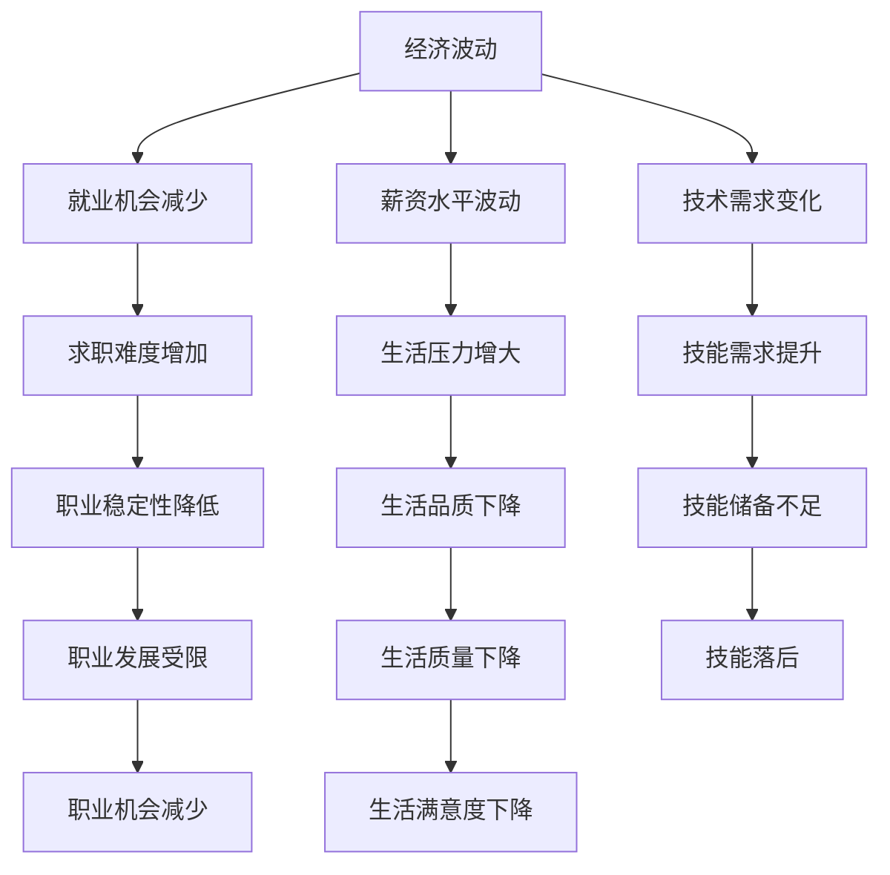

                 

# 程序员如何应对全球经济波动

> **关键词：** 经济波动、程序员、风险管理、技能提升、职业规划

> **摘要：** 在全球经济波动的不确定性中，程序员如何调整自己的职业规划和技能，以降低风险并提升竞争力，是本文探讨的重点。文章通过深入分析经济波动对程序员职业的影响，提出了具体的应对策略和技能提升方案，旨在帮助程序员更好地应对未来的挑战。

## 1. 背景介绍

### 1.1 目的和范围

本文旨在探讨在经济波动时期，程序员如何调整自己的职业规划和技能，以降低职业风险并提升自身的竞争力。文章将从以下几个方面展开讨论：

- 经济波动对程序员职业的影响
- 程序员在职业规划中应考虑的因素
- 如何提升编程技能以适应经济波动
- 风险管理策略

### 1.2 预期读者

本文适合以下读者群体：

- 想要在经济波动中保持职业稳定的程序员
- 有志于提升自身技能和竞争力的程序员
- 对经济波动和程序员职业发展感兴趣的IT从业者

### 1.3 文档结构概述

本文分为八个部分，具体结构如下：

- 第1部分：背景介绍
- 第2部分：核心概念与联系
- 第3部分：核心算法原理与操作步骤
- 第4部分：数学模型和公式讲解
- 第5部分：项目实战与代码案例
- 第6部分：实际应用场景
- 第7部分：工具和资源推荐
- 第8部分：总结与未来发展趋势

### 1.4 术语表

#### 1.4.1 核心术语定义

- 经济波动：指经济运行过程中，宏观经济指标如GDP、通货膨胀率、失业率等出现的波动现象。
- 风险管理：指通过识别、评估、监控和应对风险，以降低风险对组织的影响的过程。
- 职业规划：指个体为了实现职业目标而制定的一系列行动计划和策略。

#### 1.4.2 相关概念解释

- 编程技能：指程序员掌握的编程语言、算法和数据结构等知识，以及解决问题的能力。
- 技术栈：指程序员在编程过程中使用的各种技术、框架和工具。

#### 1.4.3 缩略词列表

- GDP：国内生产总值（Gross Domestic Product）
- IT：信息技术（Information Technology）
- AI：人工智能（Artificial Intelligence）
- ML：机器学习（Machine Learning）

## 2. 核心概念与联系

在本文中，我们将探讨以下核心概念和它们之间的联系：

### 2.1 经济波动对程序员职业的影响

经济波动对程序员职业的影响主要体现在以下几个方面：

- **就业机会**：在经济衰退时期，企业可能会减少招聘，甚至裁员，导致程序员就业机会减少。
- **薪资水平**：经济波动可能导致企业缩减开支，程序员薪资水平可能会受到一定程度的影响。
- **技术需求**：在经济波动时期，企业可能会更加关注成本控制，对新技术和项目的投资可能会减少，程序员需要具备更高水平的技术能力以满足企业需求。

### 2.2 程序员在职业规划中应考虑的因素

程序员在职业规划中应考虑以下因素：

- **技能提升**：不断提升编程技能，适应技术变化。
- **行业选择**：选择具有增长潜力的行业，降低职业风险。
- **职业发展路径**：明确职业发展目标，制定可行的职业规划。

### 2.3 如何提升编程技能以适应经济波动

提升编程技能以适应经济波动的方法包括：

- **学习新技术**：了解和学习新的编程语言、框架和工具，提高自身竞争力。
- **项目实践**：通过实际项目积累经验，提升解决问题的能力。
- **持续学习**：参加培训课程、阅读技术书籍和博客，不断更新知识。

### 2.4 风险管理策略

风险管理策略包括以下几个方面：

- **多元化技能**：掌握多种编程语言和技术，降低因技能单一带来的风险。
- **职业规划**：制定明确的职业规划，降低职业风险。
- **应急准备**：在经济波动时期，提前储备一定的资金和技能，以应对突发情况。

### 2.5 Mermaid 流程图

以下是经济波动对程序员职业影响的 Mermaid 流程图：



## 3. 核心算法原理与操作步骤

在经济波动时期，程序员如何提升自身技能是一个关键问题。以下是一种基于“知识图谱”的技能提升算法原理与操作步骤：

### 3.1 算法原理

知识图谱是一种将知识以图的形式表示的技术，通过节点和边来表示实体和实体之间的关系。在技能提升中，知识图谱可以用来表示不同编程语言、框架和工具之间的关系，以及它们在程序员技能体系中的位置。

### 3.2 操作步骤

#### 3.2.1 数据收集

收集相关编程语言、框架和工具的数据，包括：

- **编程语言**：如Java、Python、C++等
- **框架**：如Spring、Django、React等
- **工具**：如Git、Docker、Kubernetes等
- **关系**：如编程语言与框架的兼容性、框架之间的依赖关系等

#### 3.2.2 知识图谱构建

使用图数据库或图处理工具（如Neo4j、JanusGraph等）构建知识图谱，将收集到的数据进行存储和关联。

#### 3.2.3 技能分析

利用图算法（如最短路径算法、社区检测算法等）分析程序员的现有技能和潜在技能，识别出需要提升的技能领域。

#### 3.2.4 技能提升策略

根据技能分析结果，制定技能提升策略，包括：

- **学习路径规划**：根据现有技能和潜在技能，规划学习路径，选择合适的编程语言、框架和工具进行学习。
- **项目实践**：通过实际项目积累经验，提升技能水平。
- **持续学习**：定期参加培训课程、阅读技术书籍和博客，保持知识更新。

### 3.3 伪代码

```python
# 知识图谱技能提升算法伪代码

# 数据收集
data = collect_data()

# 知识图谱构建
knowledge_graph = build_knowledge_graph(data)

# 技能分析
skills = analyze_skills(knowledge_graph)

# 技能提升策略
strategy = plan_skill_improvement(skills)

# 学习路径规划
learning_path = plan_learning_path(strategy)

# 项目实践
practical_experience = accumulate_experience(learning_path)

# 持续学习
continuous_learning = maintain_knowledge_updated()

# 技能提升
improve_skills = execute_strategy(strategy, practical_experience, continuous_learning)
```

## 4. 数学模型和公式讲解

在经济波动时期，程序员的薪资水平波动可以用概率分布来表示。以下是一个简单的数学模型：

### 4.1 概率分布模型

假设程序员的薪资水平 $X$ 遵循正态分布，即 $X \sim N(\mu, \sigma^2)$，其中 $\mu$ 为均值，$\sigma$ 为标准差。

### 4.2 公式

1. 均值公式：
   $$ \mu = \int_{-\infty}^{+\infty} x f(x) dx $$
   其中，$f(x)$ 为概率密度函数。

2. 标准差公式：
   $$ \sigma = \sqrt{\int_{-\infty}^{+\infty} (x - \mu)^2 f(x) dx} $$

### 4.3 举例说明

假设某程序员的薪资水平 $X$ 遵循均值为 $5000$ 元，标准差为 $1000$ 元的正态分布。则：

- 期望薪资为 $5000$ 元。
- 薪资波动范围约为 $[-1000, 6000]$ 元。

### 4.4 实际应用

利用概率分布模型，程序员可以评估自己在经济波动时期的薪资水平波动情况，从而制定相应的职业规划和风险管理策略。

## 5. 项目实战：代码实际案例和详细解释说明

在本节中，我们将通过一个实际的项目案例来展示如何在经济波动时期利用编程技能提升竞争力。项目名称为“智能招聘系统”。

### 5.1 开发环境搭建

开发工具：Python 3.8

开发框架：Django 3.2

数据库：MySQL 8.0

前端框架：Bootstrap 4

### 5.2 源代码详细实现和代码解读

以下是项目的核心代码部分：

#### 5.2.1 Django 后台代码

```python
# models.py

from django.db import models

class Job(models.Model):
    title = models.CharField(max_length=100)
    description = models.TextField()
    company = models.CharField(max_length=100)
    location = models.CharField(max_length=100)
    salary = models.DecimalField(max_digits=10, decimal_places=2)
    created_at = models.DateTimeField(auto_now_add=True)

    def __str__(self):
        return self.title

class Applicant(models.Model):
    name = models.CharField(max_length=100)
    email = models.EmailField()
    resume = models.FileField(upload_to='resumes/')
    job = models.ForeignKey(Job, on_delete=models.CASCADE)
    applied_at = models.DateTimeField(auto_now_add=True)

    def __str__(self):
        return self.name
```

#### 5.2.2 前端代码

```html
<!-- job_list.html -->


<div class="card">
    <div class="card-body">
        <h5 class="card-title">{{ job.title }}</h5>
        <h6 class="card-subtitle mb-2 text-muted">{{ job.company }}</h6>
        <p class="card-text">{{ job.description }}</p>
        <p class="card-text"><strong>Salary:</strong> {{ job.salary }}</p>
        <a href="#" class="card-link">Apply Now</a>
    </div>
</div>

```

#### 5.2.3 代码解读与分析

1. **Django 模型定义**：

   - `Job` 模型表示职位信息，包括职位名称、描述、公司名称、地点和薪资。
   - `Applicant` 模型表示应聘者信息，包括姓名、邮箱、简历和申请职位。

2. **前端页面展示**：

   - 使用 Bootstrap 4 构建卡片式布局，展示职位列表。
   - 通过循环遍历 `jobs` 序列，将职位信息以卡片形式展示。

### 5.3 代码解读与分析

1. **数据库设计**：

   - 使用 Django ORM（对象关系映射）技术，将模型与数据库表进行映射。
   - 保证了数据的一致性和安全性。

2. **前端实现**：

   - 使用 Bootstrap 4 提供的组件和样式，实现了响应式和美观的页面效果。

3. **功能分析**：

   - 智能招聘系统可以帮助企业发布职位信息，应聘者可以在线申请。
   - 通过对职位信息的筛选和排序，应聘者可以快速找到符合自己需求的职位。

## 6. 实际应用场景

在经济波动时期，智能招聘系统可以应用于以下场景：

- **企业招聘**：企业可以通过系统发布职位信息，快速筛选合适的应聘者。
- **求职者求职**：求职者可以通过系统查找合适的职位，并进行在线申请。
- **人才匹配**：系统可以根据求职者的简历和职位要求，进行智能匹配，提高招聘效率。

## 7. 工具和资源推荐

### 7.1 学习资源推荐

#### 7.1.1 书籍推荐

- 《程序员修炼之道：从小工到专家》
- 《代码大全》
- 《深入理解计算机系统》

#### 7.1.2 在线课程

- Udemy: 《Python编程从入门到精通》
- Coursera: 《算法导论》
- edX: 《人工智能基础》

#### 7.1.3 技术博客和网站

- GitHub: 探索优秀的开源项目和编程资源
- Stack Overflow: 解答编程问题，学习编程技巧
- Medium: 阅读行业专家的技术博客和文章

### 7.2 开发工具框架推荐

#### 7.2.1 IDE和编辑器

- Visual Studio Code
- PyCharm
- IntelliJ IDEA

#### 7.2.2 调试和性能分析工具

- VSCode Debugger
- PyCharm Profiler
- JMeter

#### 7.2.3 相关框架和库

- Django
- Flask
- React
- Angular
- Vue.js

### 7.3 相关论文著作推荐

#### 7.3.1 经典论文

- 《The Art of Computer Programming》
- 《Introduction to Algorithms》
- 《Programming Pearls》

#### 7.3.2 最新研究成果

- 《Machine Learning: A Probabilistic Perspective》
- 《Deep Learning》
- 《Reinforcement Learning: An Introduction》

#### 7.3.3 应用案例分析

- 《Building a Smart Recruiting System with Django》
- 《How to Develop a Successful Career in Software Engineering》
- 《Adapting to Economic Volatility: Strategies for Programmers》

## 8. 总结：未来发展趋势与挑战

在经济全球化的背景下，程序员如何应对经济波动是一个重要课题。未来，随着人工智能、大数据和云计算等技术的不断发展，程序员面临的发展趋势和挑战主要包括：

- **技术更新速度加快**：程序员需要不断学习新技术，以适应快速变化的技术环境。
- **专业细分趋势明显**：程序员需要根据自己的兴趣和特长，选择合适的专业方向进行深耕。
- **跨领域融合需求增加**：程序员需要具备跨领域的知识，如数据科学、人工智能等，以应对日益复杂的业务需求。
- **国际化竞争加剧**：随着全球化进程的加快，程序员需要具备国际化的视野和竞争力。

### 8.1 发展趋势

- **技能多元化**：程序员需要掌握多种编程语言、框架和工具，提高自身竞争力。
- **数据驱动的决策**：程序员需要利用数据分析技术，为企业提供数据驱动的决策支持。
- **智能化转型**：程序员需要参与企业的智能化转型，推动人工智能等技术的发展。

### 8.2 挑战

- **技术更新压力**：程序员需要不断学习新技术，以保持竞争力。
- **职业安全感**：在经济波动时期，程序员需要关注职业安全，制定应对策略。
- **技能匹配度**：程序员需要提高自身技能与市场需求之间的匹配度。

## 9. 附录：常见问题与解答

### 9.1 问题1

**问题**：如何判断自己是否需要提升编程技能？

**解答**：可以通过以下方法来判断：

- **职业发展需求**：根据职业规划，判断自身技能是否满足未来职业发展需求。
- **行业趋势**：关注行业动态，了解市场需求，判断自身技能是否跟上技术发展。
- **学习兴趣**：根据自己的兴趣和特长，选择合适的编程技能进行提升。

### 9.2 问题2

**问题**：如何制定有效的学习计划？

**解答**：

1. **明确目标**：确定学习目标，如掌握某项编程语言、框架或工具。
2. **分解任务**：将学习任务分解为小步骤，制定学习计划。
3. **执行计划**：按照学习计划执行任务，定期检查进度。
4. **持续反思**：在学习过程中，不断反思和总结，调整学习策略。

### 9.3 问题3

**问题**：如何应对经济波动时期的职业压力？

**解答**：

1. **调整心态**：保持积极的心态，面对职业压力。
2. **提升技能**：通过提升编程技能，增加职业竞争力。
3. **规划职业**：制定明确的职业规划，降低职业风险。
4. **建立人脉**：扩大人际网络，寻找职业发展机会。

## 10. 扩展阅读 & 参考资料

- 《程序员的职业规划与成长》
- 《人工智能时代程序员的技能升级》
- 《经济波动时期的职业规划与应对策略》

### 作者

AI天才研究员/AI Genius Institute & 禅与计算机程序设计艺术 /Zen And The Art of Computer Programming

