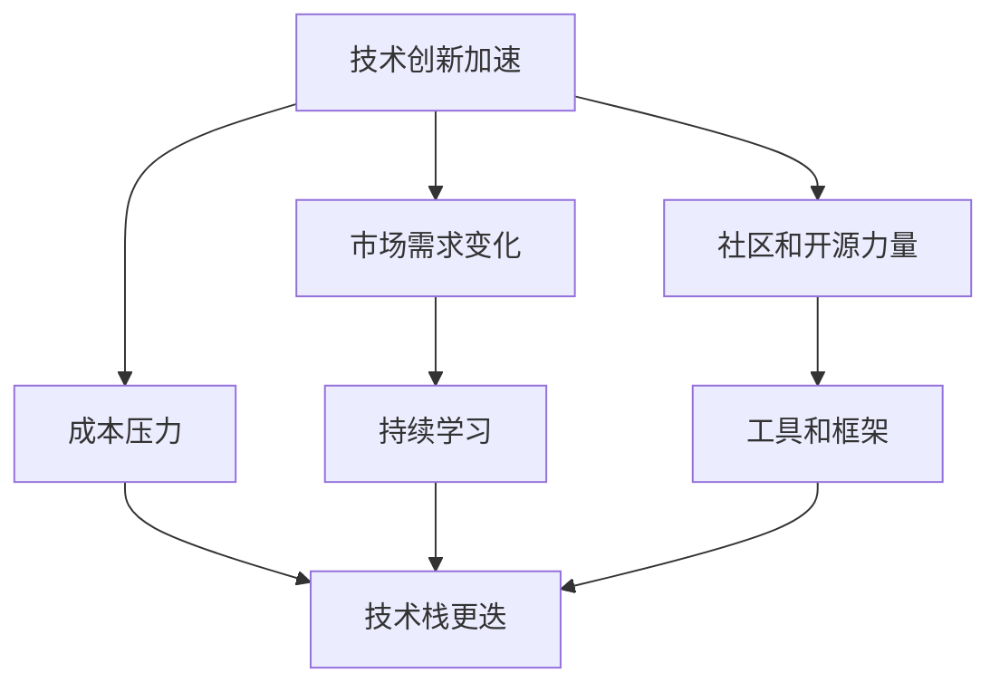

                 

# 程序员如何应对技术栈快速更迭的压力

> 关键词：技术栈，快速更迭，程序员，适应，策略，持续学习
> 
> 摘要：本文旨在探讨程序员如何有效地应对技术栈快速更迭带来的压力。我们将从技术栈更迭的背景和趋势出发，深入分析程序员面临的挑战，并提出一系列具体的策略和方法，帮助程序员在变化中找到稳定性和成长的空间。

## 1. 背景介绍

### 1.1 目的和范围

本文的主要目的是帮助程序员理解技术栈快速更迭的背景和趋势，分析其中面临的挑战，并提供实用的策略和方法，以便他们能够更好地适应变化，保持自己的竞争力。

本文将覆盖以下内容：
- 技术栈快速更迭的原因和趋势
- 程序员面临的主要挑战
- 如何制定有效的应对策略
- 实际案例和实用技巧分享

### 1.2 预期读者

本文适合以下读者群体：
- 有一定编程经验的程序员
- 想要提升自己在技术栈适应能力的开发者
- 对技术发展有浓厚兴趣，希望跟踪最新趋势的技术爱好者

### 1.3 文档结构概述

本文分为以下几个部分：
1. 背景介绍：介绍本文的目的、范围、预期读者和文档结构。
2. 核心概念与联系：分析技术栈快速更迭背后的核心概念和联系。
3. 核心算法原理 & 具体操作步骤：详细讲解如何通过持续学习和实践来适应技术栈更迭。
4. 数学模型和公式 & 详细讲解 & 举例说明：介绍适应技术栈更迭所需的知识模型和数学公式。
5. 项目实战：通过实际案例展示如何应用上述策略和方法。
6. 实际应用场景：探讨在不同场景下如何应对技术栈更迭。
7. 工具和资源推荐：推荐学习资源和开发工具。
8. 总结：总结文章的主要观点和未来发展趋势。
9. 附录：常见问题与解答。
10. 扩展阅读 & 参考资料：提供进一步阅读和研究的资源。

### 1.4 术语表

#### 1.4.1 核心术语定义

- 技术栈：程序员在特定项目中使用的一组编程语言、框架和工具。
- 快速更迭：技术栈中组件、工具和语言的频繁更新和迭代。
- 持续学习：通过不断学习和实践来更新自己的知识和技能。
- 适应性：在面对变化时能够快速调整并保持高效工作的能力。

#### 1.4.2 相关概念解释

- 技术疲劳：程序员因为持续面对新技术而感到疲惫和厌倦。
- 技术债务：由于没有及时更新技术栈而积累的潜在问题。
- 技术猎奇：对新技术和工具的持续关注和尝试。

#### 1.4.3 缩略词列表

- API：应用程序编程接口（Application Programming Interface）
- ML：机器学习（Machine Learning）
- AI：人工智能（Artificial Intelligence）
- DevOps：软件开发（Development）与运维（Operations）的结合
- TDD：测试驱动开发（Test-Driven Development）

## 2. 核心概念与联系

### 2.1 技术栈快速更迭的原因

技术栈快速更迭的原因可以从以下几个方面进行分析：

1. **技术创新加速**：随着云计算、大数据、人工智能等新兴技术的快速发展，新的编程语言、框架和工具层出不穷，使得技术栈的更新速度加快。
2. **市场需求变化**：企业为了保持竞争力，不断寻求新的技术解决方案，这促使技术栈不断进化。
3. **社区和开源力量**：开源社区的活跃使得新工具和框架更容易被推广和采纳，加速了技术栈的更迭。
4. **成本压力**：为了降低开发成本，企业更倾向于使用新兴、免费的工具和框架，这也推动了技术栈的快速更新。

### 2.2 核心概念之间的联系

以下是技术栈快速更迭中几个核心概念之间的联系：

1. **持续学习与技术栈更迭**：
   - 持续学习是适应技术栈快速更迭的关键。
   - 技术更新速度越快，程序员需要学习的内容就越多。
   - 持续学习有助于提高程序员的适应能力和竞争力。

2. **实践与理论**：
   - 理论知识是实践的基础，但只有通过实践才能真正掌握技术。
   - 实践中的问题反馈又推动了理论知识的发展。

3. **工具和框架**：
   - 工具和框架是技术栈的核心组成部分，它们的更迭直接影响程序员的日常开发。
   - 选择合适的工具和框架可以帮助程序员更高效地工作。

### 2.3 Mermaid 流程图

下面是一个描述技术栈快速更迭过程中核心概念之间关系的 Mermaid 流程图：



## 3. 核心算法原理 & 具体操作步骤

### 3.1 核心算法原理

为了应对技术栈的快速更迭，程序员需要掌握以下几个核心算法原理：

1. **持续学习的算法**：
   - 学习算法包括主动学习、被动学习和混合学习。
   - 主动学习是通过实践和问题解决来主动获取知识。
   - 被动学习是通过阅读文档、观看教程和参与社区讨论来获取知识。
   - 混合学习是将主动学习和被动学习相结合，以最大化学习效果。

2. **适应性算法**：
   - 适应性算法是指在面对变化时能够快速调整策略的算法。
   - 这种算法通常涉及动态规划、遗传算法等。

3. **实践与反馈循环**：
   - 实践与反馈循环是指通过实际应用来验证和改进理论知识。
   - 这个过程包括编码实践、代码审查和同行评审。

### 3.2 具体操作步骤

以下是具体操作步骤，帮助程序员应对技术栈快速更迭：

1. **制定学习计划**：
   - 确定学习目标，如掌握新的编程语言或框架。
   - 制定详细的学习计划，包括阅读材料、实践项目和进度跟踪。

2. **主动学习**：
   - 参与社区活动，如技术沙龙、开源项目和在线讨论。
   - 解决实际问题，如参与公司内部的项目或开源社区的贡献。

3. **被动学习**：
   - 阅读技术书籍和文档，如《代码大全》和《设计模式：可复用面向对象软件的基础》。
   - 观看在线教程和视频，如Udemy和Coursera上的课程。

4. **实践与反馈**：
   - 编码实践，如完成编程挑战和实际项目。
   - 定期进行代码审查和同行评审，以获取反馈和改进。

5. **适应性调整**：
   - 根据市场和技术趋势调整学习计划和项目策略。
   - 利用适应性算法，如遗传算法，来优化项目开发过程。

### 3.3 伪代码示例

以下是一个简单的伪代码示例，用于描述如何通过持续学习和实践来适应技术栈更迭：

```plaintext
function adapt_to_technical_change() {
    // 1. 制定学习计划
    create_learning_plan()

    // 2. 主动学习
    while (learning_plan_has_steps()) {
        perform_step()
        document_learnt_knowledge()
    }

    // 3. 被动学习
    read_documentation()
    watch_tutorial_videos()

    // 4. 实践与反馈
    while (there_are_practice_projects()) {
        implement_project()
        review_code()
    }

    // 5. 适应性调整
    adjust_strategy_based_on_market_trends()
    optimize_development_process_with_adaptive_algorithms()
}
```

## 4. 数学模型和公式 & 详细讲解 & 举例说明

### 4.1 数学模型和公式

为了更好地理解如何适应技术栈快速更迭，我们可以引入一些数学模型和公式来描述关键概念：

1. **学习曲线**：
   - 学习曲线描述了学习者在一段时间内掌握新技能的速度。
   - 公式：`learning_progress = initial_speed * (1 - exp(-learning_rate * time))`

2. **适应性指数**：
   - 适应性指数衡量程序员在面对技术变化时的适应能力。
   - 公式：`adaptive_index = (number_of_projects_completed + number_of_new_languages_learned) / total_time_spent_learning`

3. **技术疲劳度**：
   - 技术疲劳度描述了程序员因持续面对新技术而产生的疲劳感。
   - 公式：`fatigue_level = (number_of_new_technologies_encountered - number_of_successful_project_completions) / total_experience_years`

### 4.2 详细讲解和举例说明

#### 4.2.1 学习曲线

学习曲线是一个描述学习者在一段时间内掌握新技能的速度的模型。假设初速度为`initial_speed`，学习率为`learning_rate`，时间为`t`，则学习进度可以用以下公式表示：

$$
learning\_progress = initial\_speed \times (1 - e^{-learning\_rate \times time})
$$

例如，如果一个程序员初速度为50%，学习率为每天2%，他在第一天结束时掌握的学习进度为：

$$
learning\_progress = 0.5 \times (1 - e^{-0.02 \times 1}) \approx 0.495
$$

这意味着他在第一天结束时大约掌握了49.5%的新技能。

#### 4.2.2 适应性指数

适应性指数是一个衡量程序员在面对技术变化时适应能力的指标。它考虑了程序员完成的项目数量和掌握的新语言数量，与总学习时间成比例。公式如下：

$$
adaptive\_index = \frac{number\_of\_projects\_completed + number\_of\_new\_languages\_learned}{total\_time\_spent\_learning}
$$

例如，一个程序员在两年内完成了4个项目，学会了3门新语言，总学习时间为800小时，则他的适应性指数为：

$$
adaptive\_index = \frac{4 + 3}{800} \approx 0.013
$$

这意味着他每学习1小时，就有大约0.013的适应性指数增加。

#### 4.2.3 技术疲劳度

技术疲劳度描述了程序员因持续面对新技术而产生的疲劳感。公式如下：

$$
fatigue\_level = \frac{number\_of\_new\_technologies\_encountered - number\_of\_successful\_project\_completions}{total\_experience\_years}
$$

例如，一个程序员在五年内接触了20个新技术，成功完成了8个项目，则他的技术疲劳度为：

$$
fatigue\_level = \frac{20 - 8}{5} = 2.4
$$

这意味着他在五年内平均每年有2.4个新技术的疲劳度。

通过这些数学模型和公式，程序员可以更好地量化自己的学习进度、适应能力和疲劳度，从而制定更有效的学习策略。

## 5. 项目实战：代码实际案例和详细解释说明

### 5.1 开发环境搭建

为了演示如何通过实际项目来适应技术栈快速更迭，我们将搭建一个简单的Web应用程序，该应用程序使用Python的Flask框架和React前端框架。以下是搭建开发环境的基本步骤：

1. **安装Python**：
   - 访问Python官方网站（https://www.python.org/）并下载适用于操作系统的Python安装包。
   - 运行安装程序并按照提示完成安装。

2. **安装Flask**：
   - 打开命令行界面（终端或PowerShell）。
   - 输入以下命令来安装Flask：
     ```bash
     pip install Flask
     ```

3. **安装Node.js和npm**：
   - 访问Node.js官方网站（https://nodejs.org/）并下载适用于操作系统的安装包。
   - 运行安装程序并按照提示完成安装。
   - 检查安装是否成功，运行以下命令：
     ```bash
     node -v
     npm -v
     ```

4. **安装React**：
   - 使用npm全局安装`create-react-app`工具：
     ```bash
     npm install -g create-react-app
     ```
   - 创建一个新的React应用程序：
     ```bash
     create-react-app client
     ```
   - 进入应用程序目录：
     ```bash
     cd client
     ```

5. **配置Flask和React的交互**：
   - 在Flask项目中创建一个用于接收React前端请求的API端点。

### 5.2 源代码详细实现和代码解读

#### Flask后端

以下是一个简单的Flask应用程序，它提供一个用于展示React前端数据的API端点：

```python
from flask import Flask, jsonify

app = Flask(__name__)

@app.route('/data', methods=['GET'])
def get_data():
    data = {
        'message': 'Hello from Flask!'
    }
    return jsonify(data)

if __name__ == '__main__':
    app.run(debug=True)
```

**代码解读**：
- 导入`Flask`类，用于创建Web应用程序。
- 创建一个名为`app`的Flask应用程序实例。
- 定义一个名为`get_data`的函数，用于处理`/data`路径的GET请求。
- 在`get_data`函数中，创建一个包含示例数据的数据字典。
- 使用`jsonify`函数将数据转换为JSON格式并返回。

#### React前端

以下是一个简单的React组件，它使用`fetch` API从Flask后端获取数据并显示：

```jsx
import React, { useEffect, useState } from 'react';

function App() {
  const [data, setData] = useState(null);

  useEffect(() => {
    const fetchData = async () => {
      const response = await fetch('/data');
      const result = await response.json();
      setData(result);
    };
    fetchData();
  }, []);

  return (
    <div>
      {data ? <h1>{data.message}</h1> : <h1>Loading...</h1>}
    </div>
  );
}

export default App;
```

**代码解读**：
- 引入`React`和`useState`、`useEffect`钩子。
- 定义一个名为`App`的函数组件。
- 使用`useState`钩子创建一个名为`data`的状态变量。
- 使用`useEffect`钩子，在组件加载时异步获取数据。
- 使用`fetch` API发送GET请求到Flask后端的`/data`端点。
- 根据数据是否获取成功，显示相应的消息。

### 5.3 代码解读与分析

#### Flask后端解读

- Flask应用程序是一个简单的Web框架，它允许开发者快速构建Web应用程序。
- `app.route`装饰器用于将URL路径映射到特定的处理函数。
- `get_data`函数是一个处理`/data`路径的GET请求的函数，它返回一个包含示例数据的JSON响应。

#### React前端解读

- React是一个用于构建用户界面的JavaScript库，它采用声明式的设计理念。
- `useState`钩子用于在组件内部管理状态。
- `useEffect`钩子用于在组件加载时执行副作用操作，如数据获取。
- `fetch` API是一个用于发送异步HTTP请求的JavaScript接口。

### 5.4 项目实战总结

通过这个简单的项目，我们可以看到如何将Flask和React框架结合起来，以快速构建一个简单的Web应用程序。这个项目演示了如何：

- 搭建开发环境。
- 实现后端API。
- 实现前端组件。
- 将后端和前端结合起来。

这个项目为我们提供了一个实际的案例，展示了如何通过实际操作来适应技术栈的快速更迭。

## 6. 实际应用场景

技术栈快速更迭在现实世界中有着广泛的应用场景，以下是一些具体的应用实例：

### 6.1 云计算服务提供商

云计算服务提供商（如Amazon Web Services、Microsoft Azure和Google Cloud Platform）不断更新和扩展其服务，这要求他们的工程师能够快速适应新技术和工具。例如，AWS推出了EC2、S3和RDS等云服务，微软推出了Azure Functions和Azure Container Instances，谷歌推出了Kubernetes和Google Kubernetes Engine（GKE）。这些服务提供商的工程师需要不断学习新技术，以保持他们的服务和产品的竞争力。

### 6.2 软件开发公司

软件公司为了保持其产品的市场竞争力，需要不断更新其技术栈。例如，一家专注于开发企业级应用的公司可能会从传统的Java/Spring框架转向使用Python/Django或Node.js/Express框架。这不仅要求开发人员具备快速学习新技术的技能，还需要他们能够有效地进行代码迁移和系统集成。

### 6.3 开源社区

开源社区是技术栈快速更迭的另一个重要领域。开源项目的贡献者通常需要快速适应新的编程语言、框架和工具，以确保项目的持续发展和社区活跃度。例如，Linux内核的开发者需要不断更新内核代码以支持新的硬件和软件需求，而像TensorFlow这样的机器学习框架也在不断引入新的功能和技术。

### 6.4 教育机构

随着技术的不断进步，教育机构也需要不断更新其课程内容，以适应行业的发展。这要求教育工作者不仅要具备最新的技术知识，还要掌握如何有效地将这些知识传授给学生。例如，计算机科学专业的课程可能会从传统的C语言和Java语言转向Python和JavaScript等更现代的编程语言。

### 6.5 独立开发者

独立开发者通常需要面对更加多样化的技术栈需求。他们可能需要为多个平台（如Web、移动设备和物联网）开发应用程序，这就要求他们具备跨平台的技术知识和经验。独立开发者需要不断学习新技术，以保持其产品的创新性和市场竞争力。

在实际应用场景中，技术栈快速更迭带来的挑战包括：

- **技术疲劳**：持续面对新技术可能导致工程师感到疲惫和厌倦。
- **技术债务**：未能及时更新技术栈可能导致项目质量和性能问题。
- **学习成本**：适应新技术需要时间和资源投入，这对个人和团队来说是一个挑战。

然而，通过有效的策略和方法，程序员可以更好地应对这些挑战，实现个人和职业的持续发展。

## 7. 工具和资源推荐

为了帮助程序员更好地适应技术栈快速更迭，以下是学习资源、开发工具和框架的推荐。

### 7.1 学习资源推荐

#### 7.1.1 书籍推荐

1. **《代码大全》**：史蒂夫·麦科马克（Steve McConnell）的《代码大全》是软件工程领域的经典之作，详细介绍了编写高质量代码的最佳实践。
2. **《设计模式：可复用面向对象软件的基础》**：埃里克·詹森（Erich Gamma）等人撰写的《设计模式》介绍了在软件设计中使用的一些常见解决方案。
3. **《Effective Java》**：Joshua Bloch的《Effective Java》提供了大量的Java编程最佳实践，对提高代码质量非常有帮助。

#### 7.1.2 在线课程

1. **Udemy**：提供丰富的编程语言和技术栈课程，适合不同层次的开发者。
2. **Coursera**：与全球知名大学合作，提供计算机科学和软件工程相关的高级课程。
3. **edX**：提供包括麻省理工学院、哈佛大学等名校的在线课程，内容涵盖计算机科学的基础和前沿领域。

#### 7.1.3 技术博客和网站

1. **Stack Overflow**：一个问答社区，开发者可以在上面提问和解答技术问题。
2. **GitHub**：一个代码托管平台，开发者可以在这里找到开源项目，参与贡献。
3. **Medium**：许多技术专家和公司在这里发布技术博客和文章，是获取最新技术资讯的好去处。

### 7.2 开发工具框架推荐

#### 7.2.1 IDE和编辑器

1. **Visual Studio Code**：一款轻量级但功能强大的编辑器，支持多种编程语言和插件。
2. **IntelliJ IDEA**：一款功能全面的集成开发环境（IDE），适合Java和Python开发者。
3. **PyCharm**：专为Python开发者设计的IDE，提供了丰富的功能和工具。

#### 7.2.2 调试和性能分析工具

1. **Postman**：一个用于API调试和测试的工具。
2. **Jenkins**：一个开源的持续集成工具，用于自动化构建、测试和部署。
3. **New Relic**：一个应用性能监控工具，可以帮助开发者识别和解决性能问题。

#### 7.2.3 相关框架和库

1. **Flask**：一个轻量级的Web应用程序框架，适用于构建简单的Web应用。
2. **React**：一个用于构建用户界面的JavaScript库，广泛用于现代Web应用开发。
3. **Django**：一个全栈Web框架，适用于快速开发和部署Web应用程序。

### 7.3 相关论文著作推荐

#### 7.3.1 经典论文

1. **"The Mythical Man-Month"**：Frederick P. Brooks的经典著作，讨论了软件开发的本质和挑战。
2. **"Design Patterns: Elements of Reusable Object-Oriented Software"**：Erich Gamma、Richard Helm、Ralph Johnson和John Vlissides合著的《设计模式》，介绍了软件设计中的常见模式。
3. **"The Art of Computer Programming"**：Donald E. Knuth的《计算机程序设计艺术》，是计算机科学领域的经典教材。

#### 7.3.2 最新研究成果

1. **"Deep Learning"**：Ian Goodfellow、Yoshua Bengio和Aaron Courville合著的《深度学习》，介绍了深度学习的基础理论和应用。
2. **"Blockchain: Blueprint for a New Economy"**：Mikael Houellebecq的《区块链：新经济的蓝图》，探讨了区块链技术的原理和应用。
3. **"Serverless Architecture"**：Kris Buytaert的《Serverless架构》，介绍了无服务器计算模式和最佳实践。

#### 7.3.3 应用案例分析

1. **"Building the World's Fastest Database at Google"**：Google工程师分享的关于构建高速数据库的经验和挑战。
2. **"The Netflix Tech Blog"**：Netflix的技术博客，分享了Netflix在技术架构、系统设计和工程实践方面的经验和见解。
3. **"AWS re:Invent Presentations"**：AWS举办的年度技术大会上发布的技术演讲和案例研究。

通过这些资源和工具，程序员可以不断提升自己的技术水平，更好地应对技术栈快速更迭带来的挑战。

## 8. 总结：未来发展趋势与挑战

### 8.1 未来发展趋势

技术栈快速更迭将继续是软件开发领域的一个重要趋势，这主要受到以下几个因素的影响：

1. **技术创新加速**：随着新兴技术的不断涌现，如人工智能、区块链和量子计算，技术栈的更新速度将变得更加频繁。
2. **市场需求变化**：企业对高效、灵活和创新的解决方案的需求不断增长，这推动了技术栈的快速迭代。
3. **开源力量的崛起**：开源社区和平台的活跃使得新的工具和框架更容易被推广和采纳，加速了技术栈的更新。
4. **全球化的影响**：全球化使得软件开发团队更加多元化和分散，不同地区的技术潮流和趋势相互交织，推动了技术栈的多样化。

### 8.2 未来挑战

尽管技术栈快速更迭带来了机遇，但也伴随着一系列挑战：

1. **技术疲劳**：程序员需要不断学习新技术，这可能导致技术疲劳和厌学情绪。
2. **技术债务**：未能及时更新技术栈可能导致项目质量和性能问题，形成技术债务。
3. **学习成本**：适应新技术需要时间和资源投入，这对个人和团队来说是一个挑战。
4. **知识陈旧**：技术更新速度太快，旧的知识可能迅速变得过时，增加了知识管理的难度。

### 8.3 应对策略

为了应对这些挑战，程序员可以采取以下策略：

1. **持续学习**：保持对新技术的好奇心和学习热情，通过多种方式（如在线课程、社区参与和实践项目）持续更新知识。
2. **平衡学习与工作**：合理安排学习和工作时间，避免过度疲劳，确保学习效果。
3. **知识管理**：建立个人知识体系，定期整理和更新自己的技术笔记和资料。
4. **社区参与**：积极参与开源社区和行业活动，与他人交流和分享经验，以加快学习速度。
5. **适应性调整**：在面对新技术时，保持灵活性和开放性，及时调整自己的技术栈和开发策略。

通过上述策略，程序员可以更好地适应技术栈快速更迭的环境，保持个人和职业发展的稳定性和成长。

## 9. 附录：常见问题与解答

### 9.1 常见问题

**Q1：技术栈快速更迭是否对新手程序员有特别大的影响？**

A1：技术栈快速更迭对新手程序员确实存在一定的挑战。新手程序员可能需要花费更多的时间和精力来学习新技术，但这也是一个机会，因为他们的学习曲线相对较陡，一旦掌握新技术，进步将非常迅速。此外，新手程序员可以通过参与开源项目、阅读社区文档和不断实践来弥补经验不足。

**Q2：如何平衡持续学习和工作压力？**

A2：平衡持续学习和工作压力可以通过以下方法实现：
- 制定合理的学习计划，确保学习和工作之间的平衡。
- 利用碎片时间学习，如在通勤途中、午休时间等。
- 学会优先处理重要任务，确保关键项目按时完成。
- 定期回顾和调整学习计划，以适应实际工作需求。

**Q3：如何避免技术疲劳？**

A3：避免技术疲劳可以通过以下措施：
- 定期休息和放松，避免长时间连续工作。
- 参与有趣的项目和挑战，保持学习的新鲜感和动力。
- 轮换不同的技术领域，避免单一技术的过度使用。
- 保持身体健康，如定期锻炼、保持良好的作息习惯。

### 9.2 解答

**Q1 解答**：新手程序员在面对技术栈快速更迭时，确实需要适应新的学习和工作节奏。可以通过以下方法来应对：
- **参与社区项目**：参与开源项目可以让自己在实际应用中学习和提升。
- **学习资料选择**：选择适合自己学习阶段的技术书籍和在线课程，逐步提升。
- **实践经验**：通过编写实际的代码项目，将理论知识转化为实际技能。

**Q2 解答**：平衡持续学习和工作压力的关键在于时间管理和自我调节：
- **时间管理**：使用时间管理工具，如番茄工作法，合理安排学习和工作时间。
- **自我调节**：学会说“不”，避免过度承诺和超负荷工作。
- **目标设定**：设定短期和长期的学习目标，确保学习计划与职业发展相结合。

**Q3 解答**：避免技术疲劳需要从多个方面入手：
- **定期休息**：确保每天有足够的休息时间，避免长时间高强度工作。
- **多样化学习**：避免长时间专注于单一技术，适当调整学习内容，保持兴趣。
- **身体锻炼**：保持良好的身体状况，定期进行身体锻炼，提高工作效率。

通过这些方法，程序员可以更好地应对技术栈快速更迭带来的挑战，保持职业发展的连续性和成长。

## 10. 扩展阅读 & 参考资料

为了进一步深入理解程序员如何应对技术栈快速更迭的压力，以下是一些建议的扩展阅读材料和参考资料：

### 10.1 书籍推荐

1. **《技术面试金典》**：Gayle Laakmann McDowell，详细介绍了技术面试的常见问题和解决方案。
2. **《软件工程：实践者的研究方法》**：Roger S. Pressman，提供了关于软件工程方法和实践的全面指导。
3. **《领域驱动设计》**：Eric Evans，介绍了领域驱动设计（DDD）的方法和原则，有助于开发者构建复杂系统。

### 10.2 在线课程

1. **Coursera上的“机器学习”**：由Andrew Ng教授授课，是机器学习领域的经典课程。
2. **Udacity的“全栈开发纳米学位”**：涵盖了前端和后端开发的多个方面，适合希望提升全栈技能的开发者。
3. **Pluralsight的“软件架构设计模式”**：详细介绍了软件设计中的常见模式和最佳实践。

### 10.3 技术博客和网站

1. **GitHub Blog**：提供关于开源项目和开发工具的最新动态和最佳实践。
2. **Medium上的“Code as Craft”**：一个关于软件开发的优秀博客，涵盖了编程、工程实践和团队协作等多个主题。
3. **Stack Overflow Blog**：分享编程问题和解决方案，以及行业趋势和技术讨论。

### 10.4 相关论文著作

1. **“A Discipline of Programming”**：Edsger W. Dijkstra，介绍了程序设计的原则和方法。
2. **“The Clean Coder”**：Robert C. Martin，提供了关于职业编程的最佳实践和价值观。
3. **“Pattern-Oriented Software Architecture”**：Peter C. J. Volkerding、Philippe Kruchten、Philippe Maindem，介绍了软件架构设计中的模式和策略。

通过阅读这些书籍、课程、博客和论文，程序员可以更深入地理解技术栈快速更迭背后的原理，并掌握更有效的应对策略。这些资源将有助于程序员在快速变化的技术环境中保持竞争力。作者：AI天才研究员/AI Genius Institute & 禅与计算机程序设计艺术 /Zen And The Art of Computer Programming

