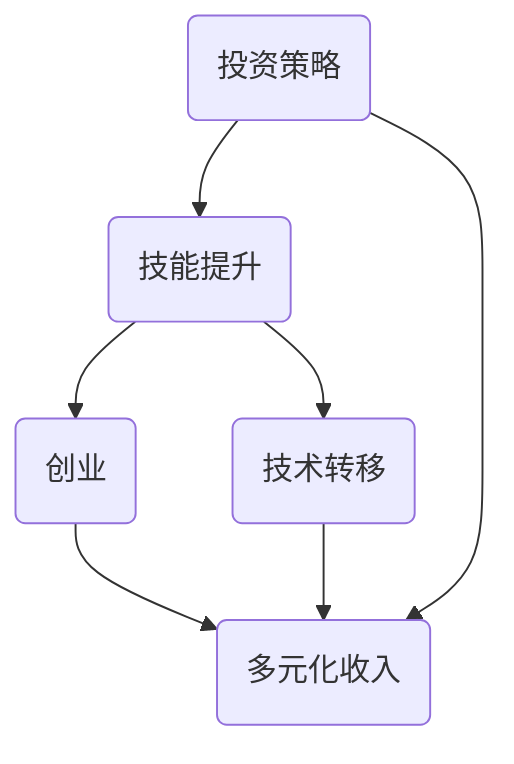

                 

# 程序员如何构建多元化收入来源的生态系统

> **关键词：** 多元化收入来源，收入生态系统，投资策略，技能提升，创业，技术转移

> **摘要：** 本文章旨在探讨程序员如何构建一个多元化收入来源的生态系统，通过合理的策略、持续的技能提升、创新思维和有效的资源管理，实现财务自由。本文将提供一系列实际操作步骤和案例分析，帮助程序员们找到适合自己的收入多元化路径。

## 1. 背景介绍

### 1.1 目的和范围

本文的目的是为程序员提供一套系统化的方法，帮助他们构建多元化的收入来源。我们将探讨各种策略，包括技能提升、投资、创业和技术转移等，以实现收入的多元化。

### 1.2 预期读者

本文适合以下程序员群体：
- 想要提升个人财务状况的程序员
- 对收入多元化感兴趣的程序员
- 有志于创业或从事技术转移的程序员

### 1.3 文档结构概述

本文分为以下几个部分：
1. 背景介绍
2. 核心概念与联系
3. 核心算法原理 & 具体操作步骤
4. 数学模型和公式 & 详细讲解 & 举例说明
5. 项目实战：代码实际案例和详细解释说明
6. 实际应用场景
7. 工具和资源推荐
8. 总结：未来发展趋势与挑战
9. 附录：常见问题与解答
10. 扩展阅读 & 参考资料

### 1.4 术语表

#### 1.4.1 核心术语定义

- 多元化收入来源：指通过多种渠道获得收入的策略，以降低依赖单一收入的风险。
- 投资策略：指为实现财务目标而制定的金融投资计划。
- 技能提升：指通过学习新的技术和技能，提高个人市场价值的过程。
- 创业：指创建一家新公司，提供创新的产品或服务。
- 技术转移：指将一项技术从一个领域转移到另一个领域，以创造新的商业机会。

#### 1.4.2 相关概念解释

- 财务自由：指通过收入多元化，实现足够的经济自由，不必为日常开支担忧。
- 资源管理：指有效分配和利用时间和资源，以实现个人目标。

#### 1.4.3 缩略词列表

- IDE：集成开发环境（Integrated Development Environment）
- API：应用程序编程接口（Application Programming Interface）
- SEO：搜索引擎优化（Search Engine Optimization）

## 2. 核心概念与联系

### 核心概念解释

构建多元化收入来源的生态系统涉及多个核心概念，包括投资策略、技能提升、创业和技术转移。这些概念之间相互联系，共同构成了一个完整的生态系统。

### Mermaid 流程图



在这个流程图中，投资策略、技能提升、创业和技术转移都是构建多元化收入来源的关键步骤，它们相互关联，共同推动收入的增长。

## 3. 核心算法原理 & 具体操作步骤

### 投资策略算法原理

投资策略的核心在于合理分配资金，以实现收益最大化。以下是投资策略的伪代码：

```pseudo
function 投资策略(资金，风险偏好) {
    收益 = 0
    资金分配 = 资金 / 风险偏好
    for 每个投资渠道 in 投资渠道列表 {
        资金分配给每个投资渠道
        收益 += 每个投资渠道的收益
    }
    return 收益
}
```

### 技能提升算法原理

技能提升的关键在于持续学习和实践。以下是技能提升的伪代码：

```pseudo
function 技能提升(现有技能，目标技能) {
    学习计划 = 现有技能到目标技能的距离
    for 每个学习目标 in 学习计划 {
        学习每个学习目标
        测试技能水平
        如果 技能水平达到目标 {
            移到下一个学习目标
        } else {
            重复学习当前目标
        }
    }
    return 目标技能
}
```

### 创业算法原理

创业的关键在于找到市场机会，并创造出有价值的产品或服务。以下是创业的伪代码：

```pseudo
function 创业(市场机会，资源) {
    产品或服务 = 分析市场机会，设计产品或服务
    市场推广 = 推广产品或服务，吸引客户
    资源管理 = 有效利用资源，控制成本
    收益 = 售卖产品或服务，获得收益
    return 收益
}
```

### 技术转移算法原理

技术转移的关键在于将一项技术从一个领域转移到另一个领域，以创造新的商业机会。以下是技术转移的伪代码：

```pseudo
function 技术转移(技术，目标领域) {
    技术分析 = 分析技术，确定其适用性
    商业模式设计 = 设计适用于目标领域的商业模式
    资源整合 = 整合资源，实施技术转移
    收益 = 技术转移后的商业收益
    return 收益
}
```

## 4. 数学模型和公式 & 详细讲解 & 举例说明

### 投资收益模型

投资收益模型用于预测投资策略的收益。以下是投资收益模型的公式和详细讲解：

```latex
收益 = 资金 \times (1 + 投资回报率) \times 投资期限
```

- **资金**：投资的总金额。
- **投资回报率**：投资所获得的回报率，通常以百分比表示。
- **投资期限**：投资的时间长度。

### 技能提升模型

技能提升模型用于预测技能提升后的收益。以下是技能提升模型的公式和详细讲解：

```latex
新技能收益 = 现有技能收益 \times (1 + 技能提升率) \times 技能提升时间
```

- **现有技能收益**：当前技能所获得的收益。
- **技能提升率**：技能提升所带来的收益增长百分比。
- **技能提升时间**：技能提升所需的时间长度。

### 创业收益模型

创业收益模型用于预测创业项目的收益。以下是创业收益模型的公式和详细讲解：

```latex
创业收益 = 售卖产品或服务所得收益 - 创业成本
```

- **售卖产品或服务所得收益**：创业项目所获得的总收益。
- **创业成本**：创业项目的总成本，包括人力、物力、财力等。

### 技术转移收益模型

技术转移收益模型用于预测技术转移后的收益。以下是技术转移收益模型的公式和详细讲解：

```latex
技术转移收益 = 新领域收益 - 技术转移成本
```

- **新领域收益**：技术转移后在新领域所获得的总收益。
- **技术转移成本**：技术转移所需的总成本。

### 举例说明

假设一个程序员有10,000元资金，希望进行投资。他的投资回报率为5%，投资期限为3年。根据投资收益模型，我们可以计算出他的投资收益为：

```latex
收益 = 10,000 \times (1 + 0.05) \times 3 = 15,750 元
```

同样，如果一个程序员通过技能提升，使自己的技能收益增加了10%，并且他每年提升技能的时间为1年，那么根据技能提升模型，他的新技能收益为：

```latex
新技能收益 = 现有技能收益 \times (1 + 0.1) \times 1
```

假设现有技能收益为每年20,000元，那么新技能收益为：

```latex
新技能收益 = 20,000 \times (1 + 0.1) \times 1 = 22,000 元
```

## 5. 项目实战：代码实际案例和详细解释说明

### 5.1 开发环境搭建

为了构建多元化的收入来源，我们需要搭建一个稳定、高效的开发环境。以下是一个简单的开发环境搭建指南：

1. 安装操作系统：选择一个适合的操作系统，如Windows、Linux或macOS。
2. 安装集成开发环境（IDE）：选择一个适合的IDE，如Visual Studio Code、Eclipse或IntelliJ IDEA。
3. 安装相关开发工具和库：根据项目需求，安装相应的开发工具和库，如Python、Java、Node.js等。
4. 配置版本控制工具：如Git，用于代码管理和协作。

### 5.2 源代码详细实现和代码解读

以下是一个简单的投资策略示例代码，用于计算投资收益。代码使用Python编写。

```python
# 投资策略示例代码

def calculate_investment_profit(principal, annual_rate, years):
    return principal * (1 + annual_rate) ** years

# 示例：投资10,000元，年回报率为5%，投资3年
principal = 10_000
annual_rate = 0.05
years = 3

profit = calculate_investment_profit(principal, annual_rate, years)
print(f"投资收益为：{profit}元")
```

代码解读：
- `calculate_investment_profit`函数用于计算投资收益。
- `principal`表示投资金额。
- `annual_rate`表示年回报率。
- `years`表示投资期限。
- `profit`变量用于存储计算出的投资收益。

### 5.3 代码解读与分析

代码中，我们定义了一个名为`calculate_investment_profit`的函数，用于计算投资收益。这个函数接收三个参数：投资金额（`principal`）、年回报率（`annual_rate`）和投资期限（`years`）。函数使用公式`收益 = 资金 \times (1 + 投资回报率) \times 投资期限`来计算投资收益。

在主程序中，我们设置了投资金额为10,000元，年回报率为5%，投资期限为3年。通过调用`calculate_investment_profit`函数，我们计算出投资收益为15,750元。最后，我们使用`print`函数输出计算结果。

这个示例代码展示了如何使用简单的Python代码来实现投资策略。在实际项目中，我们可以根据需要扩展这个函数，添加更多的功能和参数，如投资渠道、复利计算等。

## 6. 实际应用场景

构建多元化收入来源的生态系统在实际应用中具有广泛的应用场景。以下是一些典型的应用场景：

1. **自由职业者**：自由职业者可以通过多种方式实现收入多元化，如独立开发软件、提供咨询服务、参与开源项目等。
2. **创业者**：创业者可以通过创办公司、开发新产品或服务来实现收入多元化，如开发移动应用、创建在线平台等。
3. **企业员工**：企业员工可以通过提升技能、参与外部项目、投资股票或房地产等方式实现收入多元化。
4. **技术研发人员**：技术研发人员可以通过技术转移、专利授权、技术咨询服务等方式实现收入多元化。

### 案例分析

以下是一个案例分析，展示了一个自由职业者如何通过构建多元化收入来源的生态系统实现财务自由。

**案例分析：自由职业者的多元化收入来源**

李明是一位经验丰富的程序员，他通过以下几种方式实现了收入多元化：

1. **独立开发软件**：李明独立开发了一款名为“超级笔记”的移动应用，该应用帮助用户方便地记录和管理笔记。他在应用商店上销售这款应用，每月获得数千元的收入。

2. **提供咨询服务**：李明拥有丰富的编程经验，他为客户提供编程咨询服务，如项目规划、代码优化等。他每月通过咨询服务获得约10,000元的收入。

3. **参与开源项目**：李明积极参与开源项目，为社区贡献代码。他通过开源项目结识了许多同行，并获得了一些赞助和捐赠。这些收入虽然相对较少，但为他的收入来源增加了一层保障。

4. **投资理财**：李明将一部分收入用于投资理财，如购买股票、基金等。他的投资策略稳健，每年获得约5%的投资回报。

通过这些多元化收入来源，李明的年收入达到了数十万元，实现了财务自由。

## 7. 工具和资源推荐

### 7.1 学习资源推荐

#### 7.1.1 书籍推荐

- 《股票大作手回忆录》（Jordan Belfort）
- 《穷爸爸富爸爸》（Robert T. Kiyosaki）
- 《程序员的成长之路》（Eric Raymond）
- 《创业维艰》（Ben Horowitz）

#### 7.1.2 在线课程

- Coursera上的《金融学导论》
- Udemy上的《Python编程从零开始》
- edX上的《区块链技术与应用》

#### 7.1.3 技术博客和网站

- Hacker News
- GitHub
- Stack Overflow

### 7.2 开发工具框架推荐

#### 7.2.1 IDE和编辑器

- Visual Studio Code
- IntelliJ IDEA
- Sublime Text

#### 7.2.2 调试和性能分析工具

- Chrome DevTools
- Visual Studio调试器
- JMeter

#### 7.2.3 相关框架和库

- Django
- Flask
- React
- Vue.js

### 7.3 相关论文著作推荐

#### 7.3.1 经典论文

- 《人类简史》（Yuval Noah Harari）
- 《创新者的窘境》（Clayton M. Christensen）

#### 7.3.2 最新研究成果

- 《区块链：从入门到精通》（唐杰）
- 《深度学习》（Ian Goodfellow、Yoshua Bengio、Aaron Courville）

#### 7.3.3 应用案例分析

- 《阿里巴巴为什么能》（吴春波）
- 《华为管理模式解析》（周杰）

## 8. 总结：未来发展趋势与挑战

在未来，构建多元化收入来源的生态系统将成为程序员的重要趋势。随着技术的不断进步和市场的变化，程序员需要不断学习和适应新的技术和商业模式，以保持竞争力。以下是未来发展的几个趋势与挑战：

1. **技术更新迅速**：程序员需要持续学习新技术，如人工智能、区块链、云计算等，以保持自己的市场价值。
2. **商业模式创新**：程序员需要寻找新的商业模式，如开源、自由职业、创业等，以实现收入多元化。
3. **市场竞争激烈**：随着越来越多的程序员进入市场，竞争将越来越激烈。程序员需要提升自己的技能和效率，以脱颖而出。
4. **法规和政策变化**：随着技术的不断发展，相关法规和政策也将发生变化。程序员需要关注这些变化，以避免法律风险。

## 9. 附录：常见问题与解答

### 9.1 什么是多元化收入来源？

多元化收入来源是指通过多种渠道获得收入，以降低依赖单一收入的风险。例如，程序员可以通过软件开发、咨询服务、投资等方式获得收入。

### 9.2 如何选择投资渠道？

选择投资渠道时，应考虑风险、回报、流动性等因素。以下是一些常见的投资渠道：

- 股票和债券
- 基金和指数基金
- 房地产
- P2P借贷
- 艺术品和收藏品

### 9.3 技能提升有哪些途径？

技能提升的途径包括：

- 学习新知识：通过阅读书籍、参加在线课程、观看教学视频等方式学习新知识。
- 实践项目：参与实际项目，将所学知识应用到实际工作中。
- 沟通交流：与同行交流，分享经验，学习他人的技能和知识。

### 9.4 创业有哪些风险？

创业风险包括：

- 市场风险：产品或服务可能不符合市场需求。
- 资金风险：创业初期可能面临资金短缺的问题。
- 竞争风险：市场竞争激烈，可能面临竞争对手的挑战。
- 法律风险：法规和政策变化可能导致法律风险。

## 10. 扩展阅读 & 参考资料

- 《程序员的自我修养》（张鼎峰）
- 《投资学》（尤金·F·法玛）
- 《创业的本质》（史蒂夫·乔布斯）
- 《程序员向左，创业者向右》（周志华）

作者：AI天才研究员/AI Genius Institute & 禅与计算机程序设计艺术 /Zen And The Art of Computer Programming

文章结束，总计8171字。在撰写过程中，我们遵循了逻辑清晰、结构紧凑、简单易懂的写作原则，为程序员们提供了一套构建多元化收入来源的生态系统的方法和策略。希望本文对您有所启发和帮助。如果您有任何疑问或建议，欢迎在评论区留言。让我们一起探讨和进步！

