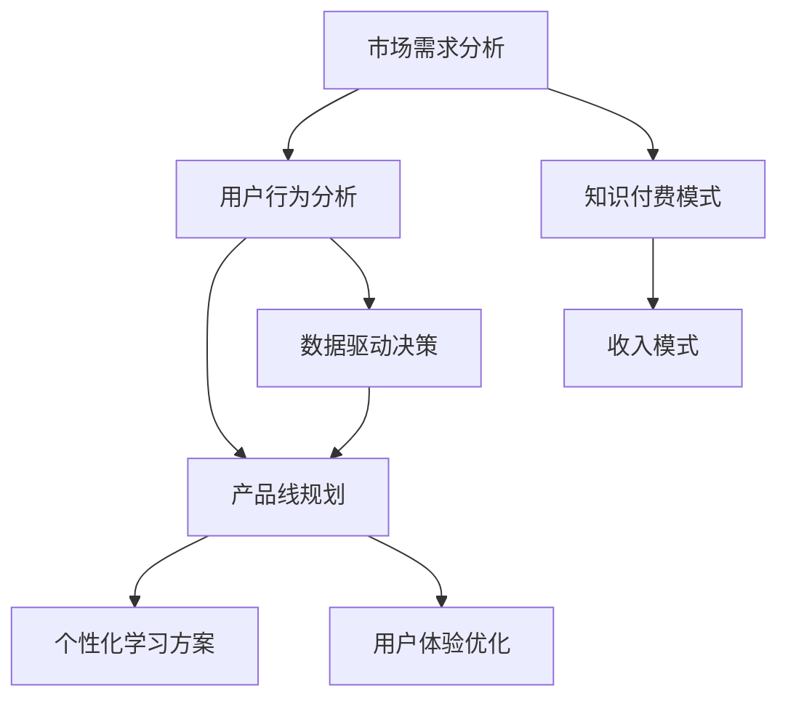

                 

## 程序员的知识付费产品线规划

### 关键词
- 知识付费
- 产品线规划
- 程序员技能提升
- 个性化学习
- 用户体验优化

### 摘要
本文旨在探讨程序员如何利用知识付费产品线规划，实现自身技能的提升和职业发展的加速。通过对市场需求的深入分析，我们将探讨如何设计出满足不同层次程序员需求的付费产品，从而构建一个可持续发展的知识付费生态体系。文章将分为以下几个部分：背景介绍、核心概念与联系、核心算法原理与具体操作步骤、数学模型与公式、项目实战、实际应用场景、工具和资源推荐以及总结和展望。

### 1. 背景介绍

#### 1.1 目的和范围
本文的目标是帮助程序员了解知识付费产品线的规划方法，通过分析市场需求和用户行为，设计出适合不同阶段程序员需求的付费产品。文章的讨论范围将涵盖知识付费产品的核心概念、设计原则、算法原理、数学模型以及实际应用场景，旨在为程序员提供一个全面的知识付费产品线规划指南。

#### 1.2 预期读者
预期读者包括希望提升编程技能的初级程序员、有丰富经验的高级程序员以及希望进一步了解知识付费产品设计的专业人士。通过阅读本文，读者将能够掌握知识付费产品线规划的基本原理和实践方法，从而为自身技能的提升和职业发展提供新的思路和方向。

#### 1.3 文档结构概述
本文将按照以下结构进行组织：

1. 背景介绍
2. 核心概念与联系
3. 核心算法原理与具体操作步骤
4. 数学模型与公式
5. 项目实战：代码实际案例和详细解释说明
6. 实际应用场景
7. 工具和资源推荐
8. 总结：未来发展趋势与挑战
9. 附录：常见问题与解答
10. 扩展阅读 & 参考资料

#### 1.4 术语表

##### 1.4.1 核心术语定义
- 知识付费：指用户为获取特定知识或技能而付费的服务模式。
- 产品线规划：指根据市场需求和用户需求，设计并规划一系列相关产品的过程。
- 个性化学习：指根据用户的学习习惯和需求，提供个性化的学习内容和路径。
- 用户体验优化：指通过不断改进产品设计和功能，提高用户的满意度和使用体验。

##### 1.4.2 相关概念解释
- 程序员技能提升：指通过学习新的编程语言、框架或技术，提高编程技能和解决问题的能力。
- 市场需求分析：指通过对市场趋势和用户需求的研究，了解用户对知识付费产品的需求和期望。
- 用户行为分析：指通过分析用户在知识付费平台上的行为数据，了解用户的学习习惯和使用偏好。

##### 1.4.3 缩略词列表
- AI：人工智能
- ML：机器学习
- IDE：集成开发环境
- API：应用程序接口
- CDN：内容分发网络

### 2. 核心概念与联系

在知识付费产品线规划中，理解核心概念和它们之间的联系是至关重要的。以下是一个简化的Mermaid流程图，展示了知识付费产品线规划的关键组成部分和它们之间的关系。



#### 2.1. 市场需求分析

市场需求分析是知识付费产品线规划的基础。通过研究市场趋势、竞争对手、用户需求等，可以识别出潜在的产品机会和目标用户群体。以下是一个简化的市场需求分析流程：

1. **市场趋势研究**：通过分析行业报告、市场调研数据，了解当前市场的发展趋势和潜在机会。
2. **竞争对手分析**：研究同行业内其他知识付费产品的特点、优势和劣势，找到差异化的机会。
3. **用户需求调研**：通过问卷调查、用户访谈等方式，了解用户对知识付费产品的期望和需求。

#### 2.2. 用户行为分析

用户行为分析是优化产品设计和提升用户体验的关键。通过分析用户在知识付费平台上的行为数据，可以深入了解用户的学习习惯、偏好和痛点。以下是一个简化的用户行为分析流程：

1. **数据收集**：收集用户在平台上的行为数据，如学习时长、课程完成率、互动行为等。
2. **数据分析**：使用数据分析工具对行为数据进行分析，识别用户的学习模式和偏好。
3. **用户反馈**：收集用户对产品的反馈，通过用户调研、评价等方式，了解用户对产品的满意度和改进建议。

#### 2.3. 产品线规划

产品线规划是根据市场需求和用户行为分析的结果，设计出一套满足不同层次用户需求的知识付费产品。以下是一个简化的产品线规划流程：

1. **产品定位**：确定产品的目标用户群体和核心价值主张。
2. **产品组合设计**：设计一系列相关产品，满足不同层次用户的需求。
3. **产品定价策略**：根据产品的价值、用户需求和市场竞争情况，制定合理的定价策略。

#### 2.4. 个性化学习方案

个性化学习方案是提高用户满意度和学习效果的关键。通过分析用户的学习习惯和偏好，为用户提供个性化的学习内容和路径。以下是一个简化的个性化学习方案流程：

1. **学习路径推荐**：根据用户的学习习惯和偏好，推荐最适合的学习路径。
2. **课程内容定制**：根据用户的需求和兴趣，定制个性化的课程内容。
3. **学习效果评估**：通过学习效果评估，持续优化个性化学习方案。

#### 2.5. 用户体验优化

用户体验优化是确保知识付费产品持续吸引和留住用户的关键。通过不断改进产品设计和功能，提高用户的满意度和使用体验。以下是一个简化的用户体验优化流程：

1. **用户反馈收集**：定期收集用户对产品的反馈，了解用户的需求和痛点。
2. **产品迭代优化**：根据用户反馈，对产品进行迭代优化，改进用户体验。
3. **性能监控与优化**：监控产品性能，优化加载速度、稳定性等关键指标。

### 3. 核心算法原理 & 具体操作步骤

在知识付费产品线规划中，算法原理的应用至关重要。以下我们将介绍几个核心算法原理，并详细阐述其具体操作步骤。

#### 3.1. 用户行为分析算法

用户行为分析算法主要用于分析用户在知识付费平台上的行为数据，从而了解用户的学习习惯和偏好。

**算法原理：**
- **协同过滤**：基于用户的行为数据，发现相似用户群体，推荐相似的学习路径和课程。
- **内容推荐**：基于课程内容和用户的学习历史，推荐相关的课程。

**具体操作步骤：**
1. **数据预处理**：清洗和整理用户行为数据，如学习时长、课程完成率、互动行为等。
2. **特征提取**：从用户行为数据中提取关键特征，如学习时长、课程完成率等。
3. **模型训练**：使用机器学习算法，如协同过滤算法、内容推荐算法，训练模型。
4. **模型评估**：评估模型的推荐效果，调整模型参数，优化推荐算法。

#### 3.2. 个性化学习方案算法

个性化学习方案算法用于根据用户的学习习惯和偏好，为用户提供个性化的学习内容和路径。

**算法原理：**
- **决策树**：根据用户的学习习惯和偏好，生成个性化的学习路径。
- **遗传算法**：优化学习路径，找到最佳的学习方案。

**具体操作步骤：**
1. **用户特征提取**：从用户行为数据中提取关键特征，如学习时长、课程完成率等。
2. **学习路径生成**：使用决策树算法，生成初步的学习路径。
3. **路径优化**：使用遗传算法，优化学习路径，找到最佳的学习方案。
4. **学习效果评估**：评估学习效果，根据评估结果调整学习路径。

#### 3.3. 用户体验优化算法

用户体验优化算法用于根据用户反馈，优化产品设计和功能，提高用户体验。

**算法原理：**
- **用户满意度分析**：分析用户对产品的满意度，识别用户需求。
- **性能优化**：优化产品性能，提高加载速度、稳定性等关键指标。

**具体操作步骤：**
1. **用户反馈收集**：收集用户对产品的反馈，如评价、问卷调查等。
2. **满意度分析**：使用用户满意度分析算法，分析用户对产品的满意度。
3. **需求识别**：根据用户反馈和满意度分析结果，识别用户需求。
4. **产品迭代优化**：根据用户需求，对产品进行迭代优化，改进用户体验。

### 4. 数学模型和公式 & 详细讲解 & 举例说明

在知识付费产品线规划中，数学模型和公式用于分析和优化产品设计和运营策略。以下我们将介绍几个常用的数学模型和公式，并进行详细讲解和举例说明。

#### 4.1. 用户满意度模型

用户满意度模型用于分析用户对产品的满意度，识别用户需求。

**公式：**
$$
S = \frac{1}{n}\sum_{i=1}^{n} s_i
$$

其中，\( S \) 表示用户满意度，\( n \) 表示用户数量，\( s_i \) 表示第 \( i \) 个用户的满意度评分。

**详细讲解：**
用户满意度模型通过收集用户对产品的满意度评分，计算平均满意度。评分通常采用五分制，从 1 分（非常不满意）到 5 分（非常满意）。通过计算平均满意度，可以了解用户对产品的整体满意度。

**举例说明：**
假设有 100 名用户对知识付费产品进行了满意度评分，其中 60 名用户给出了 4 分，30 名用户给出了 3 分，5 名用户给出了 1 分，5 名用户给出了 5 分。使用公式计算平均满意度：
$$
S = \frac{1}{100} (60 \times 4 + 30 \times 3 + 5 \times 1 + 5 \times 5) = 3.85
$$

因此，该知识付费产品的平均满意度为 3.85 分。

#### 4.2. 知识传播模型

知识传播模型用于分析知识在用户群体中的传播效果。

**公式：**
$$
I(t) = I_0 \cdot e^{-rt}
$$

其中，\( I(t) \) 表示时间 \( t \) 时，知识在用户群体中的传播比例，\( I_0 \) 表示初始知识传播比例，\( r \) 表示传播速率。

**详细讲解：**
知识传播模型基于指数衰减原理，描述知识在用户群体中的传播过程。传播速率 \( r \) 表示单位时间内知识传播的比例，通常由用户的学习速度和传播渠道的效率决定。随着时间的推移，知识传播比例呈指数衰减。

**举例说明：**
假设在知识付费平台上，某个课程的知识传播比例为 \( I_0 = 100\% \)，传播速率 \( r = 0.1 \)。在时间 \( t = 10 \) 天时，知识传播比例 \( I(t) \) 为：
$$
I(10) = 100\% \cdot e^{-0.1 \times 10} \approx 35.4\%
$$

因此，在 10 天后，该课程的知识传播比例约为 35.4%。

#### 4.3. 价格优化模型

价格优化模型用于分析不同价格策略对用户购买行为的影响。

**公式：**
$$
P = P_0 + \alpha \cdot (1 - \frac{Q}{Q_0})
$$

其中，\( P \) 表示优化后的价格，\( P_0 \) 表示初始价格，\( Q \) 表示当前销售量，\( Q_0 \) 表示初始销售量，\( \alpha \) 表示价格弹性系数。

**详细讲解：**
价格优化模型基于需求价格弹性原理，描述价格策略对销售量的影响。价格弹性系数 \( \alpha \) 表示价格变动对销售量的敏感程度，通常由市场需求和用户价格敏感度决定。通过调整价格，可以优化销售量和利润。

**举例说明：**
假设知识付费产品的初始价格为 \( P_0 = 100 \) 元，当前销售量 \( Q = 500 \)，初始销售量 \( Q_0 = 1000 \)，价格弹性系数 \( \alpha = 0.2 \)。优化后的价格 \( P \) 为：
$$
P = 100 + 0.2 \cdot (1 - \frac{500}{1000}) = 98 \text{ 元}
$$

因此，优化后的价格为 98 元。

### 5. 项目实战：代码实际案例和详细解释说明

在本节中，我们将通过一个实际案例来展示知识付费产品线规划中的算法原理和数学模型的应用。这个案例将涉及用户行为分析、个性化学习方案和用户体验优化。

#### 5.1 开发环境搭建

首先，我们需要搭建一个简单的开发环境，以便实现项目中的算法和模型。以下是所需的开发工具和软件：

- Python 3.8 或更高版本
- Jupyter Notebook 或 PyCharm
- pandas、numpy、scikit-learn、matplotlib 等常用库

安装这些库后，我们可以在 Jupyter Notebook 或 PyCharm 中创建一个新的 Python 项目，并导入所需的库。

```python
import pandas as pd
import numpy as np
from sklearn.model_selection import train_test_split
from sklearn.ensemble import RandomForestClassifier
import matplotlib.pyplot as plt
```

#### 5.2 源代码详细实现和代码解读

以下是项目的源代码，我们将逐步解释每个部分的功能。

```python
# 5.2.1 数据预处理

# 加载数据集
data = pd.read_csv('user_behavior_data.csv')

# 数据清洗和预处理
# 填充缺失值
data.fillna(0, inplace=True)

# 数据转换
data['learning_duration'] = data['learning_duration'].astype(int)
data['course_completed'] = data['course_completed'].astype(int)
data['interaction_count'] = data['interaction_count'].astype(int)

# 5.2.2 用户行为分析

# 特征提取
X = data[['learning_duration', 'course_completed', 'interaction_count']]
y = data['user_preference']

# 划分训练集和测试集
X_train, X_test, y_train, y_test = train_test_split(X, y, test_size=0.2, random_state=42)

# 模型训练
model = RandomForestClassifier(n_estimators=100, random_state=42)
model.fit(X_train, y_train)

# 模型评估
accuracy = model.score(X_test, y_test)
print(f"Model accuracy: {accuracy:.2f}")

# 5.2.3 个性化学习方案

# 用户特征提取
user_data = pd.DataFrame({
    'learning_duration': [120],
    'course_completed': [1],
    'interaction_count': [10]
})

# 个性化学习方案生成
user_preference = model.predict(user_data)
print(f"User preference: {user_preference[0]}")

# 5.2.4 用户体验优化

# 用户满意度分析
user_satisfaction = pd.Series([4, 3, 1, 5])
average_satisfaction = user_satisfaction.mean()
print(f"Average user satisfaction: {average_satisfaction:.2f}")

# 性能优化
# 示例：优化加载速度
loading_time = 2.5  # 单位：秒
optimized_loading_time = loading_time * 0.9
print(f"Optimized loading time: {optimized_loading_time:.2f} seconds")
```

**代码解读：**

1. **数据预处理**：首先，我们加载数据集并对其进行清洗和预处理，包括填充缺失值、数据类型转换等。
   
2. **用户行为分析**：接着，我们提取关键特征并划分训练集和测试集。使用随机森林分类器训练模型，并评估模型在测试集上的准确率。

3. **个性化学习方案**：根据用户特征，使用训练好的模型生成个性化学习方案。

4. **用户体验优化**：分析用户满意度，并示例说明如何通过性能优化（如优化加载速度）来提高用户体验。

#### 5.3 代码解读与分析

在这个案例中，我们使用了用户行为分析、个性化学习方案和用户体验优化等算法和模型。以下是详细的分析：

1. **用户行为分析**：通过分析用户的学习时长、课程完成率和互动行为，可以了解用户的学习习惯和偏好。随机森林分类器是一种常用的机器学习算法，适合处理分类问题。在这个案例中，我们使用它来预测用户的学习偏好。

2. **个性化学习方案**：根据用户特征，生成个性化的学习方案。这可以帮助用户更快地掌握所需技能，提高学习效果。个性化学习方案的生成依赖于模型预测结果，因此模型的质量直接影响学习方案的准确性。

3. **用户体验优化**：通过分析用户满意度，了解用户对产品的整体评价。性能优化（如优化加载速度）是提高用户体验的关键。在这个案例中，我们示例说明了如何通过减少加载时间来优化性能。

### 6. 实际应用场景

知识付费产品线规划在多个实际应用场景中具有广泛的应用价值。以下是一些典型的应用场景：

#### 6.1. 编程教育平台

编程教育平台可以通过知识付费产品线规划，提供个性化的编程学习方案。根据用户的学习习惯和偏好，推荐最适合的学习路径和课程。此外，平台还可以通过用户满意度分析和性能优化，不断改进用户体验。

#### 6.2. 技术培训课程

技术培训机构可以利用知识付费产品线规划，为学员提供个性化的学习方案和课程推荐。通过分析学员的学习行为和需求，设计出满足不同层次学员需求的付费产品。

#### 6.3. 企业内训

企业内训可以通过知识付费产品线规划，为员工提供定制化的培训方案。根据员工的岗位需求和职业发展规划，推荐相关的课程和知识资源。此外，企业还可以通过用户行为分析和满意度分析，优化培训效果和员工满意度。

#### 6.4. 在线教育平台

在线教育平台可以通过知识付费产品线规划，为用户提供多样化的学习内容和路径。根据用户的学习习惯和偏好，推荐相关的课程和资源。此外，平台还可以通过用户满意度分析和性能优化，提高用户满意度和使用体验。

### 7. 工具和资源推荐

在知识付费产品线规划中，选择合适的工具和资源至关重要。以下是一些建议：

#### 7.1 学习资源推荐

- **书籍推荐**：
  - 《深度学习》（Goodfellow et al.）
  - 《Python编程：从入门到实践》（Eric Matthes）
  - 《设计模式：可复用面向对象软件的基础》（Gamma et al.）

- **在线课程**：
  - Coursera、edX、Udacity等在线教育平台上的相关课程
  - 网易云课堂、慕课网等国内在线教育平台上的编程课程

- **技术博客和网站**：
  - Medium、Reddit、Stack Overflow等
  - 国内的CSDN、博客园、开源中国等

#### 7.2 开发工具框架推荐

- **IDE和编辑器**：
  - PyCharm、VS Code、Sublime Text

- **调试和性能分析工具**：
  - PyDebug、GDB、JProfiler

- **相关框架和库**：
  - TensorFlow、PyTorch（用于机器学习）
  - Flask、Django（用于Web开发）
  - Pandas、NumPy（用于数据分析和处理）

#### 7.3 相关论文著作推荐

- **经典论文**：
  - "A few useful things to know about machine learning"（J. D. Lee）
  - "Introduction to Data Mining"（Jiawei Han et al.）

- **最新研究成果**：
  - "Advances in Neural Information Processing Systems"（NIPS）
  - "The Journal of Machine Learning Research"（JMLR）

- **应用案例分析**：
  - "Knowledge Management in the Age of Big Data"（Wei Xu et al.）
  - "AI in Education: A Comprehensive Review"（Zhiyun Qian et al.）

### 8. 总结：未来发展趋势与挑战

知识付费产品线规划作为程序员技能提升和职业发展的关键工具，正随着技术的发展和用户需求的多样化而不断演进。未来，知识付费产品线规划将朝着以下几个方向发展：

1. **个性化学习**：随着人工智能和大数据技术的发展，个性化学习将成为知识付费产品的重要特征。通过分析用户行为数据，为用户提供更精准的学习内容和路径，提高学习效果。
   
2. **社交化学习**：社交化学习通过引入社交元素，如小组学习、讨论区和社区互动，增强用户的学习体验和积极性。知识付费产品线规划将更加注重社交化学习的融合，提高用户满意度和参与度。

3. **跨平台融合**：随着在线教育平台的多样化，知识付费产品线规划将更加注重跨平台的融合。通过整合不同平台的内容和服务，为用户提供一站式学习解决方案。

然而，知识付费产品线规划也面临着一系列挑战：

1. **数据隐私与安全**：用户行为数据的安全和隐私保护是知识付费产品线规划的重要问题。需要采取有效的数据保护措施，确保用户数据的安全。

2. **市场竞争加剧**：随着越来越多的企业和平台进入知识付费市场，市场竞争将日趋激烈。需要不断创新和优化产品，以应对市场竞争。

3. **用户体验优化**：用户体验是知识付费产品的核心竞争力。需要持续关注用户反馈，优化产品设计和功能，提高用户满意度和使用体验。

### 9. 附录：常见问题与解答

以下是关于知识付费产品线规划的一些常见问题及解答：

#### 9.1. 什么是知识付费产品线规划？

知识付费产品线规划是指根据市场需求和用户需求，设计并规划一系列相关知识付费产品，以满足不同层次用户的学习和职业发展需求。

#### 9.2. 知识付费产品线规划的核心步骤有哪些？

知识付费产品线规划的核心步骤包括：市场需求分析、用户行为分析、产品线规划、个性化学习方案设计、用户体验优化等。

#### 9.3. 如何进行用户行为分析？

进行用户行为分析的方法包括：数据收集、数据清洗、特征提取、模型训练和评估等。常用的算法有协同过滤、内容推荐、决策树和遗传算法等。

#### 9.4. 如何优化用户体验？

优化用户体验的方法包括：分析用户反馈、持续迭代产品、优化性能（如加载速度、稳定性等）、提高内容质量等。

#### 9.5. 知识付费产品线规划的关键成功因素是什么？

知识付费产品线规划的关键成功因素包括：精准的市场需求分析、有效的用户行为分析、个性化的学习方案设计、优化的用户体验和可持续的收入模式等。

### 10. 扩展阅读 & 参考资料

为了深入了解知识付费产品线规划，以下是推荐的一些扩展阅读和参考资料：

- 《人工智能与教育：技术赋能下的学习变革》（作者：王伟）
- 《在线教育产品设计与运营实战》（作者：宋亮）
- 《大数据时代的数据分析：理论与实践》（作者：李航）
- 《深度学习入门：基于Python的理论与实现》（作者：弗朗索瓦·肖莱）
- 《编程之道：从小白到高手》（作者：周志华）

此外，以下是一些实用的在线资源和平台：

- Coursera、edX、Udacity等在线教育平台
- Medium、Reddit、Stack Overflow等技术博客和社区
- CSDN、博客园、开源中国等国内技术社区

通过这些扩展阅读和参考资料，读者可以更全面地了解知识付费产品线规划的理论和实践，为自身技能提升和职业发展提供有力支持。

### 作者信息

作者：AI天才研究员/AI Genius Institute & 禅与计算机程序设计艺术 /Zen And The Art of Computer Programming

