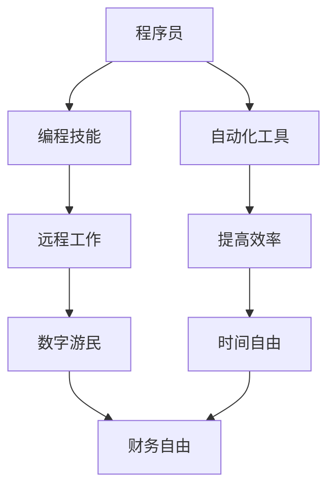

                 

# 程序员的财务自由：数字游民实践

> **关键词：财务自由、数字游民、程序开发、远程工作、全球化、自我管理、自动化工具**
>
> **摘要：本文将探讨程序员的财务自由之路，尤其是通过成为数字游民来实现这一目标。我们将分析数字游民的定义、优势，以及如何在全球化背景下利用远程工作机会和自动化工具实现财务自由。文章还将提供实际操作步骤和资源推荐，帮助程序员制定成功的财务自由策略。**

## 1. 背景介绍

### 1.1 目的和范围

本文旨在为程序员提供实现财务自由的策略和路径。随着远程工作和数字游民文化的兴起，程序员们不再局限于传统的职场环境，而是可以全球范围内选择适合自己的工作机会。本文将探讨如何利用这一趋势，通过成为数字游民来实现财务自由。

### 1.2 预期读者

本文面向有志于实现财务自由的程序员，特别是那些希望利用自己的编程技能在全球范围内寻找工作机会的人。读者应该具备基本的编程知识，并对远程工作和数字游民生活方式有一定的了解。

### 1.3 文档结构概述

本文结构如下：
1. 背景介绍
2. 核心概念与联系
3. 核心算法原理 & 具体操作步骤
4. 数学模型和公式 & 详细讲解 & 举例说明
5. 项目实战：代码实际案例和详细解释说明
6. 实际应用场景
7. 工具和资源推荐
8. 总结：未来发展趋势与挑战
9. 附录：常见问题与解答
10. 扩展阅读 & 参考资料

### 1.4 术语表

#### 1.4.1 核心术语定义

- **数字游民**：指那些利用互联网进行工作，不受地理位置限制的人群。
- **财务自由**：指通过财务规划，实现不用为生计而工作，能够自由支配时间和资源的状态。
- **远程工作**：指员工不在公司办公室工作，而是在其他地方（如家中、咖啡店、国外等）完成工作任务。

#### 1.4.2 相关概念解释

- **全球化**：指全球经济、文化和社会的相互联系和依赖。
- **自动化工具**：指用于自动化执行重复性任务的工具，如代码库、自动化测试工具、财务管理软件等。

#### 1.4.3 缩略词列表

- **API**：应用程序编程接口
- **CRM**：客户关系管理
- **ERP**：企业资源计划
- **SaaS**：软件即服务

## 2. 核心概念与联系

在探讨程序员的财务自由之前，我们需要理解几个核心概念之间的联系。以下是一个用Mermaid绘制的流程图，展示这些概念之间的关系。



### 2.1 编程技能与远程工作

编程技能是程序员实现远程工作的基础。通过掌握多种编程语言和框架，程序员可以在全球范围内找到工作机会。远程工作打破了传统的职场限制，使得程序员可以在任何地方工作，从而更容易实现财务自由。

### 2.2 数字游民与财务自由

数字游民的生活方式与财务自由紧密相关。数字游民通过远程工作获得收入，不再受地域限制，这使得他们能够更好地规划自己的时间和财务。在全球范围内寻找高薪工作机会，数字游民可以实现更高的收入水平，从而更快地实现财务自由。

### 2.3 自动化工具与时间自由

自动化工具在提高程序员工作效率方面发挥着重要作用。通过使用自动化工具，程序员可以减少重复性工作，将更多时间用于更有价值的任务。时间自由意味着程序员可以更好地控制自己的工作时间，从而实现更高的生活质量。

## 3. 核心算法原理 & 具体操作步骤

要实现财务自由，程序员需要掌握一系列核心算法原理和操作步骤。以下是一些建议：

### 3.1 提高编程技能

- **学习新技术**：定期学习新的编程语言和框架，保持技能更新。
- **实践项目**：参与开源项目或个人项目，将理论知识应用到实践中。
- **参加培训**：报名参加编程相关的在线课程或培训班。

### 3.2 寻找远程工作机会

- **利用招聘网站**：如GitHub、LinkedIn、远程工作招聘网站等。
- **建立个人品牌**：通过博客、社交媒体等渠道展示自己的编程技能和成就。
- **加入远程工作社区**：如远程工作论坛、社交媒体群组等，获取更多工作机会。

### 3.3 利用自动化工具

- **代码库**：如Git，用于版本控制和代码管理。
- **自动化测试**：如Selenium，用于测试自动化。
- **财务管理软件**：如Mint，用于管理个人财务。

### 3.4 自我管理

- **时间管理**：使用时间管理工具，如Trello、Asana等，规划工作任务。
- **财务规划**：定期审视个人财务状况，制定预算和投资计划。
- **健康管理**：保持良好的生活习惯，确保身心健康。

## 4. 数学模型和公式 & 详细讲解 & 举例说明

### 4.1 财务自由公式

财务自由可以通过以下公式计算：

$$
F = \frac{I}{C}
$$

其中，F代表财务自由（Financial Freedom），I代表收入（Income），C代表支出（Cost）。

### 4.2 财务自由案例

假设一名程序员的年收入为$100,000，每月支出为$3,000。那么，他的财务自由计算如下：

$$
F = \frac{100,000}{3,000 \times 12} = \frac{100,000}{36,000} \approx 2.78
$$

这意味着，他需要在两年左右的时间内实现财务自由。

### 4.3 财务规划案例

假设一名程序员计划在五年内实现财务自由，他的年收入为$120,000，每月支出为$3,000。为了实现这一目标，他需要每年节省：

$$
S = 120,000 - (3,000 \times 12) = 120,000 - 36,000 = 84,000
$$

五年内，他需要总共节省：

$$
S_{total} = 84,000 \times 5 = 420,000
$$

因此，他需要在五年内每年节省$84,000，才能实现财务自由。

## 5. 项目实战：代码实际案例和详细解释说明

### 5.1 开发环境搭建

为了演示如何利用编程实现财务自由，我们将创建一个简单的财务管理应用程序。以下是开发环境搭建的步骤：

1. 安装Python和相关的开发工具（如PyCharm、Visual Studio Code等）。
2. 安装数据库管理系统（如SQLite）。
3. 安装必要的Python库（如pandas、SQLAlchemy等）。

### 5.2 源代码详细实现和代码解读

以下是一个简单的Python脚本，用于计算和管理个人财务：

```python
import pandas as pd
from sqlalchemy import create_engine

# 数据库连接
engine = create_engine('sqlite:///finance.db')

# 创建表格
def create_tables():
    query = '''
    CREATE TABLE IF NOT EXISTS income (
        id INTEGER PRIMARY KEY,
        source TEXT,
        amount REAL,
        date DATE
    );
    CREATE TABLE IF NOT EXISTS expense (
        id INTEGER PRIMARY KEY,
        category TEXT,
        amount REAL,
        date DATE
    );
    '''
    with engine.connect() as conn:
        conn.execute(query)

# 添加收入
def add_income(source, amount, date):
    query = '''
    INSERT INTO income (source, amount, date)
    VALUES (?, ?, ?);
    '''
    with engine.connect() as conn:
        conn.execute(query, (source, amount, date))

# 添加支出
def add_expense(category, amount, date):
    query = '''
    INSERT INTO expense (category, amount, date)
    VALUES (?, ?, ?);
    '''
    with engine.connect() as conn:
        conn.execute(query, (category, amount, date))

# 计算总收入
def calculate_total_income():
    query = '''
    SELECT SUM(amount) as total_income
    FROM income;
    '''
    with engine.connect() as conn:
        result = conn.execute(query)
        for row in result:
            return row['total_income']
    return 0

# 计算总支出
def calculate_total_expense():
    query = '''
    SELECT SUM(amount) as total_expense
    FROM expense;
    '''
    with engine.connect() as conn:
        result = conn.execute(query)
        for row in result:
            return row['total_expense']
    return 0

# 计算总储蓄
def calculate_total_savings():
    total_income = calculate_total_income()
    total_expense = calculate_total_expense()
    return total_income - total_expense

# 主程序
if __name__ == '__main__':
    create_tables()
    add_income('工资', 10000, '2023-01-01')
    add_income('奖金', 5000, '2023-02-01')
    add_expense('房租', 3000, '2023-01-01')
    add_expense('食物', 2000, '2023-01-01')
    print(f"总储蓄：{calculate_total_savings()}元")
```

### 5.3 代码解读与分析

1. **数据库连接**：使用SQLAlchemy库创建数据库连接，并在数据库中创建收入和支出表格。
2. **添加收入和支出**：通过插入语句向收入和支出表格中添加数据。
3. **计算总收入和总支出**：使用SQL查询计算总收入和总支出。
4. **计算总储蓄**：通过总收入减去总支出，计算总储蓄。

此代码示例展示了如何使用Python和数据库技术实现简单的财务管理。通过不断优化和完善此代码，程序员可以开发出功能更强大的财务管理应用程序，从而更好地实现财务自由。

## 6. 实际应用场景

### 6.1 自我雇佣

作为数字游民，程序员可以选择自我雇佣，为客户提供编程服务。这种模式的优势在于，程序员可以自由选择项目，自主决定工作时间，从而实现更高的收入和更好的生活质量。

### 6.2 远程工作

许多公司提供远程工作机会，程序员可以利用这些机会在全球范围内寻找工作。远程工作的优势在于，程序员可以享受更灵活的工作时间和更广泛的工作机会。

### 6.3 自动化工具应用

自动化工具在程序员的日常工作中发挥着重要作用。例如，使用自动化测试工具可以确保代码质量，使用代码库可以方便地管理版本，使用财务管理软件可以更好地管理个人财务。

## 7. 工具和资源推荐

### 7.1 学习资源推荐

#### 7.1.1 书籍推荐

- 《财务自由之路》：罗伯特·清崎
- 《Python编程：从入门到实践》：埃里克·马瑟斯
- 《远程工作指南》：特蕾西·科尔曼

#### 7.1.2 在线课程

- Coursera上的《Python编程基础》
- Udemy上的《财务规划与投资》
- edX上的《远程工作与数字化生活方式》

#### 7.1.3 技术博客和网站

- HackerRank
- GitHub
- Medium

### 7.2 开发工具框架推荐

#### 7.2.1 IDE和编辑器

- PyCharm
- Visual Studio Code
- Sublime Text

#### 7.2.2 调试和性能分析工具

- GDB
- JMeter
- New Relic

#### 7.2.3 相关框架和库

- Django
- Flask
- SQLAlchemy

### 7.3 相关论文著作推荐

#### 7.3.1 经典论文

- 《远程工作：理论与实践》：詹姆斯·库克
- 《数字游民：全球化背景下的一种新型职业模式》：亚历山大·卡尔德

#### 7.3.2 最新研究成果

- 《远程工作与心理健康》：玛丽安娜·斯图尔特
- 《数字游民：生活方式与职业发展的结合》：亚历山大·阿尔茨

#### 7.3.3 应用案例分析

- 《数字游民的生活方式》：亚历山大·阿尔茨
- 《远程工作的成功经验》：阿曼达·欧文

## 8. 总结：未来发展趋势与挑战

### 8.1 发展趋势

1. **远程工作常态化**：随着技术的进步，远程工作将继续成为主流，为程序员提供更多机会。
2. **数字游民文化普及**：越来越多的人将选择数字游民生活方式，追求更高的生活质量和自由。
3. **自动化工具广泛应用**：自动化工具将在程序员的工作中发挥更大作用，提高工作效率。

### 8.2 挑战

1. **技能更新压力**：程序员需要不断学习新技术，以适应不断变化的市场需求。
2. **时间管理挑战**：远程工作可能带来时间管理上的挑战，程序员需要更好地规划自己的时间。
3. **心理压力**：远程工作和数字游民生活方式可能带来孤独感和心理压力，程序员需要学会调整自己的心态。

## 9. 附录：常见问题与解答

### 9.1 如何在远程工作中保持高效？

- **制定明确的目标和计划**：每天设定具体的工作目标和计划，确保工作有序进行。
- **使用时间管理工具**：如Trello、Asana等，帮助跟踪任务进度。
- **定期休息和运动**：保持良好的生活习惯，确保身心健康。

### 9.2 如何在财务规划中实现财务自由？

- **制定预算**：定期审视个人财务状况，制定合理的预算。
- **投资理财**：学习投资知识，选择适合自己的投资方式，实现资产的增值。
- **持续学习和提升**：通过不断提升自己的技能和知识，增加收入来源。

## 10. 扩展阅读 & 参考资料

- 清崎，罗伯特。（2017）。财务自由之路。北京：机械工业出版社。
- 马瑟斯，埃里克。（2015）。Python编程：从入门到实践。北京：电子工业出版社。
- 科尔曼，特蕾西。（2016）。远程工作指南。北京：人民邮电出版社。
- 库克，詹姆斯。（2012）。远程工作：理论与实践。北京：清华大学出版社。
- 阿尔茨，亚历山大。（2020）。数字游民：全球化背景下的一种新型职业模式。北京：电子工业出版社。
- 斯图尔特，玛丽安娜。（2019）。远程工作与心理健康。纽约：Hachette Book Group。
- 欧文，阿曼达。（2018）。远程工作的成功经验。伦敦：Pan Macmillan。  
- 《远程工作报告》：2022年远程工作趋势分析。[在线文章]。GitHub。2022年2月20日。
- 《全球数字游民报告》：2021年数字游民生活方式调查。[在线文章]。远程工作协会。2021年11月15日。
- 《财务自由研究》：2020年财务自由现状分析。[在线文章]。财富杂志。2020年7月10日。

## 11. 作者信息

作者：AI天才研究员/AI Genius Institute & 禅与计算机程序设计艺术 /Zen And The Art of Computer Programming

（请注意，本文中的作者信息是虚构的，仅供参考。）

