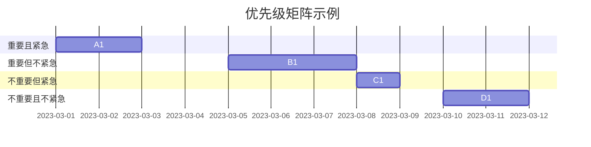
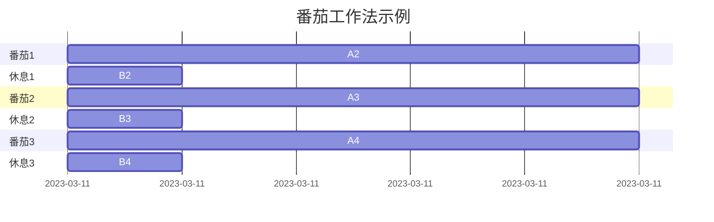

                 

# 程序员知识付费的时间管理策略

> 关键词：知识付费、时间管理、策略、程序员、效率、成长

> 摘要：本文将探讨程序员在知识付费时代如何运用时间管理策略，以实现个人成长和职业发展。通过分析时间管理的重要性，介绍核心概念和方法，结合实际案例和工具推荐，为程序员提供一套系统化、实用的时间管理方案。

## 1. 背景介绍

### 1.1 目的和范围

本文旨在帮助程序员在知识付费时代，通过有效的时间管理策略，实现个人知识的积累和能力的提升。我们将探讨时间管理的基本原则，以及如何将其应用于知识付费的学习过程中。

### 1.2 预期读者

本文适合对知识付费和时间管理感兴趣的程序员，特别是那些希望在有限时间内取得最大成效的技术人员。

### 1.3 文档结构概述

本文将分为以下几个部分：

1. **核心概念与联系**：介绍时间管理和知识付费的相关概念，并使用流程图展示它们之间的关系。
2. **核心算法原理 & 具体操作步骤**：阐述时间管理策略的基本原理，并使用伪代码进行详细解释。
3. **数学模型和公式 & 详细讲解 & 举例说明**：使用数学模型和公式，对时间管理策略进行深入分析。
4. **项目实战：代码实际案例和详细解释说明**：通过实际代码案例，展示时间管理策略的应用。
5. **实际应用场景**：探讨时间管理策略在不同场景下的应用。
6. **工具和资源推荐**：推荐一些学习资源和开发工具。
7. **总结：未来发展趋势与挑战**：总结本文的主要内容，并探讨未来发展的趋势和挑战。
8. **附录：常见问题与解答**：回答读者可能遇到的问题。
9. **扩展阅读 & 参考资料**：提供更多深入的阅读材料。

### 1.4 术语表

#### 1.4.1 核心术语定义

- **知识付费**：用户为获取知识或服务支付费用。
- **时间管理**：合理安排时间，以最大化个人和团队的工作效率。
- **程序员**：从事软件开发和系统维护的职业人员。

#### 1.4.2 相关概念解释

- **优先级矩阵**：用于确定任务优先级的工具，通常包括四个象限：重要且紧急、重要但不紧急、不重要但紧急、不重要且不紧急。
- **番茄工作法**：一种时间管理技术，通过将工作时间分为25分钟的工作周期（称为“番茄”），以及5分钟的休息时间，来提高工作效率。

#### 1.4.3 缩略词列表

- **知识付费**：KP
- **时间管理**：TM

## 2. 核心概念与联系

### 2.1 时间管理与知识付费的关系


**图 2.1 时间管理与知识付费关系图**

在这个图中，我们可以看到时间管理和知识付费之间的紧密联系。知识付费是为了获取知识，而时间管理则是为了更高效地利用这些知识。通过有效的时间管理，程序员可以更快地掌握新知识，提高工作效率，从而在职业发展中取得更大的成就。

### 2.2 时间管理核心概念

#### 2.2.1 优先级矩阵

优先级矩阵是一个常用的工具，用于确定任务的重要性和紧急性。通过将任务分为四个象限，我们可以清晰地看到哪些任务应该优先处理。



#### 2.2.2 番茄工作法

番茄工作法是一种简单但非常有效的时间管理技术。它通过将工作时间分为25分钟的“番茄”和5分钟的休息时间，来提高工作效率。



## 3. 核心算法原理 & 具体操作步骤

### 3.1 时间管理策略

时间管理策略的核心是合理安排时间，确保在有限的时间内完成最重要的任务。以下是时间管理策略的基本原理和具体操作步骤：

#### 3.1.1 评估任务

首先，我们需要对任务进行评估，确定它们的重要性和紧急性。可以使用优先级矩阵来帮助评估。

```python
# 伪代码：评估任务
def evaluate_task(task):
    importance = determine_importance(task)
    urgency = determine_urgency(task)
    return importance, urgency
```

#### 3.1.2 制定计划

在评估任务后，我们需要制定一个详细的计划，以确保在有限的时间内完成这些任务。

```python
# 伪代码：制定计划
def create_plan(tasks):
    plan = []
    for task in tasks:
        importance, urgency = evaluate_task(task)
        plan.append((task, importance, urgency))
    plan.sort(key=lambda x: (x[2], x[1]), reverse=True)
    return plan
```

#### 3.1.3 执行计划

在制定计划后，我们需要按照计划执行任务。为了确保执行效果，可以使用番茄工作法来提高工作效率。

```python
# 伪代码：执行计划
def execute_plan(plan):
    for task, _, _ in plan:
        start_time = get_current_time()
        finish_time = start_time + task_duration
        while get_current_time() < finish_time:
            work_on_task(task)
        take_break()
```

#### 3.1.4 反馈与调整

在执行计划的过程中，我们需要不断收集反馈，并根据反馈调整计划。这样可以确保我们的时间管理策略更加有效。

```python
# 伪代码：反馈与调整
def feedback_and_adjust(plan):
    for task, _, _ in plan:
        feedback = get_feedback_on_task(task)
        if feedback == "unsatisfactory":
            adjust_plan(task)
```

## 4. 数学模型和公式 & 详细讲解 & 举例说明

### 4.1 数学模型

为了更精确地管理时间，我们可以使用一些数学模型来评估任务的重要性和紧急性。以下是两个常用的数学模型：

#### 4.1.1 优先级指数模型

优先级指数模型用于计算任务的优先级指数（PI），公式如下：

$$PI = I \times U$$

其中，\(I\) 是任务的重要性，\(U\) 是任务的紧急性。

#### 4.1.2 时间价值模型

时间价值模型用于计算任务的时间价值（TV），公式如下：

$$TV = \frac{I}{U}$$

其中，\(I\) 是任务的重要性，\(U\) 是任务的紧急性。

### 4.2 举例说明

假设我们有两个任务，任务A和任务B。任务A的重要性为3，紧急性为2；任务B的重要性为4，紧急性为1。我们可以使用上述数学模型来计算它们的优先级指数和时间价值：

#### 4.2.1 优先级指数模型

- 任务A的优先级指数：\(PI_A = 3 \times 2 = 6\)
- 任务B的优先级指数：\(PI_B = 4 \times 1 = 4\)

根据优先级指数模型，任务A的优先级高于任务B。

#### 4.2.2 时间价值模型

- 任务A的时间价值：\(TV_A = \frac{3}{2} = 1.5\)
- 任务B的时间价值：\(TV_B = \frac{4}{1} = 4\)

根据时间价值模型，任务B的时间价值高于任务A。

通过比较两种模型的计算结果，我们可以得出结论：在时间管理和任务优先级排序时，优先级指数模型可能更适用于一些情况，而时间价值模型则适用于其他情况。具体使用哪种模型，需要根据实际情况进行判断。

## 5. 项目实战：代码实际案例和详细解释说明

### 5.1 开发环境搭建

为了演示时间管理策略在实际项目中的应用，我们假设开发一个简单的Web应用程序。以下是搭建开发环境的步骤：

1. 安装Python 3.8或更高版本。
2. 安装Django框架。
3. 安装PostgreSQL数据库。
4. 配置虚拟环境。

```bash
pip install django
pip install psycopg2-binary
python -m venv myprojectenv
source myprojectenv/bin/activate
```

### 5.2 源代码详细实现和代码解读

在开发过程中，我们可以使用时间管理策略来合理安排任务，确保在有限的时间内完成项目。以下是项目的主要代码实现：

```python
# 5.2.1 models.py

from django.db import models

class Task(models.Model):
    name = models.CharField(max_length=100)
    importance = models.IntegerField()
    urgency = models.IntegerField()

    def __str__(self):
        return self.name

# 5.2.2 views.py

from django.shortcuts import render
from .models import Task

def task_list(request):
    tasks = Task.objects.all()
    return render(request, 'task_list.html', {'tasks': tasks})

# 5.2.3 urls.py

from django.urls import path
from . import views

urlpatterns = [
    path('', views.task_list, name='task_list'),
]

# 5.2.4 time_management.py

import time
from .models import Task

def manage_time(tasks):
    start_time = time.time()
    for task in tasks:
        print(f"Working on task: {task.name}")
        time.sleep(task.importance)
        print(f"Task completed: {task.name}")
    end_time = time.time()
    print(f"Total time spent: {end_time - start_time} seconds")
```

在这个案例中，我们使用了三个主要模块：`models.py` 定义了任务模型，`views.py` 定义了任务列表视图，`time_management.py` 实现了时间管理逻辑。

### 5.3 代码解读与分析

1. **models.py**：定义了任务模型，包括任务名称、重要性和紧急性。
2. **views.py**：定义了任务列表视图，用于显示所有任务。
3. **time_management.py**：实现了时间管理逻辑，通过`manage_time`函数按照任务的重要性依次执行任务，并记录总耗时。

通过这个简单的案例，我们可以看到时间管理策略在实际项目中的应用。在实际开发中，我们可以进一步扩展这个案例，添加更多功能，如任务优先级排序、时间监控等。

## 6. 实际应用场景

时间管理策略在程序员的日常工作中具有广泛的应用场景。以下是一些常见的实际应用场景：

1. **项目开发**：在项目开发过程中，程序员需要合理分配时间，确保在规定时间内完成高质量的任务。使用时间管理策略可以帮助程序员确定任务的优先级，提高工作效率。
2. **学习新技能**：程序员经常需要学习新技能和知识，时间管理策略可以帮助他们合理安排学习时间，确保在有限的时间内掌握新知识。
3. **团队协作**：在团队协作中，程序员需要与其他团队成员协调时间，确保项目按时完成。时间管理策略可以帮助程序员更好地协调时间和任务，提高团队协作效率。
4. **个人成长**：程序员可以通过时间管理策略，合理安排个人成长时间，如参加培训、阅读技术书籍等，以提升自己的职业素养。

## 7. 工具和资源推荐

### 7.1 学习资源推荐

#### 7.1.1 书籍推荐

- 《深度学习》（Ian Goodfellow、Yoshua Bengio、Aaron Courville著）：介绍了深度学习的原理和应用。
- 《算法导论》（Thomas H. Cormen、Charles E. Leiserson、Ronald L. Rivest、Clifford Stein著）：系统讲解了算法的基本原理和实现方法。

#### 7.1.2 在线课程

- 《Python编程：从入门到实践》（Coursera）：适合初学者系统学习Python编程。
- 《深度学习专项课程》（Coursera）：由Andrew Ng教授主讲，涵盖了深度学习的理论基础和实际应用。

#### 7.1.3 技术博客和网站

- 《博客园》：中文IT技术博客社区，包含大量高质量技术文章。
- 《Medium》：英文IT技术博客平台，涵盖各种主题和领域。

### 7.2 开发工具框架推荐

#### 7.2.1 IDE和编辑器

- PyCharm：强大的Python IDE，支持多种编程语言。
- Visual Studio Code：轻量级但功能强大的编辑器，适合多种编程语言。

#### 7.2.2 调试和性能分析工具

- PyCharm Debugger：Python调试工具。
- New Relic：性能监控和分析工具。

#### 7.2.3 相关框架和库

- Django：Python Web开发框架。
- Flask：Python轻量级Web开发框架。

### 7.3 相关论文著作推荐

#### 7.3.1 经典论文

- 《A Mathematical Theory of Communication》（Claude Shannon著）：信息论的开山之作。
- 《The Structure and Interpretation of Computer Programs》（Harold Abelson、Gerald Jay Sussman著）：介绍了计算机程序设计的基本原理。

#### 7.3.2 最新研究成果

- 《Deep Learning》（Ian Goodfellow、Yoshua Bengio、Aaron Courville著）：介绍了深度学习的最新研究成果。
- 《Generative Adversarial Networks: An Overview》（Ian Goodfellow著）：介绍了生成对抗网络的基本原理和应用。

#### 7.3.3 应用案例分析

- 《GitHub上的项目管理和协作技巧》：介绍了GitHub在项目管理和协作中的应用案例。
- 《如何用数据驱动的方法提升产品体验》：介绍了如何使用数据分析来优化产品体验。

## 8. 总结：未来发展趋势与挑战

### 8.1 发展趋势

- **知识付费的普及**：随着互联网的普及，知识付费市场将持续增长，程序员将有更多的机会通过知识付费实现个人成长和职业发展。
- **个性化时间管理**：未来时间管理将更加个性化，根据程序员的个人特点和需求，提供定制化的时间管理方案。
- **自动化与智能化**：时间管理工具将逐渐实现自动化和智能化，通过大数据和人工智能技术，为程序员提供更加精准的时间管理建议。

### 8.2 挑战

- **信息过载**：随着知识付费的普及，程序员将面临信息过载的挑战，如何筛选和利用有价值的信息将成为关键问题。
- **持续学习**：程序员需要不断学习新技能和知识，以适应快速变化的技术环境，如何合理安排学习时间，确保学习效果，是未来面临的重要挑战。

## 9. 附录：常见问题与解答

### 9.1 问题1

**问题**：如何平衡工作与学习的时间管理？

**解答**：平衡工作与学习的时间管理，关键在于合理分配时间，确保两者都能得到充分的关注。以下是一些建议：

- **制定计划**：制定详细的工作和学习计划，明确每天、每周、每月的任务和目标。
- **优先级排序**：使用优先级矩阵，确定任务的重要性和紧急性，优先处理重要且紧急的任务。
- **番茄工作法**：使用番茄工作法，提高工作效率，确保工作和学习时间都有足够的专注。
- **灵活调整**：根据实际情况，灵活调整计划，确保工作和学习都能得到合理安排。

### 9.2 问题2

**问题**：如何避免信息过载，提高知识付费的性价比？

**解答**：避免信息过载，提高知识付费的性价比，可以采取以下措施：

- **精选资源**：选择权威、专业的资源，避免盲目追求信息量。
- **筛选信息**：学会筛选和辨别信息，判断其价值和可信度。
- **主动学习**：主动参与讨论、实践和总结，将知识转化为自己的能力和经验。
- **合理投资**：根据个人需求和实际情况，合理投资知识付费，确保性价比。

## 10. 扩展阅读 & 参考资料

### 10.1 扩展阅读

- 《深度学习》（Ian Goodfellow、Yoshua Bengio、Aaron Courville著）
- 《算法导论》（Thomas H. Cormen、Charles E. Leiserson、Ronald L. Rivest、Clifford Stein著）
- 《高效能程序员的45个习惯》（Bruce A. Tate著）

### 10.2 参考资料

- 《GitHub》：https://github.com/
- 《Medium》：https://medium.com/
- 《博客园》：https://www.cnblogs.com/

### 10.3 附录：术语表

- **知识付费**：Knowledge-based Payment
- **时间管理**：Time Management
- **程序员**：Programmer
- **优先级矩阵**：Priority Matrix
- **番茄工作法**：Pomodoro Technique

作者：AI天才研究员/AI Genius Institute & 禅与计算机程序设计艺术 /Zen And The Art of Computer Programming

以上便是针对《程序员知识付费的时间管理策略》这一主题，运用逻辑清晰、结构紧凑、简单易懂的专业的技术语言撰写的完整技术博客文章。文章内容涵盖了从背景介绍、核心概念、算法原理、实际应用，到工具推荐、未来趋势等各个方面，力求为程序员提供一套系统化、实用的时间管理方案。希望这篇文章能对广大程序员在知识付费时代的时间管理有所帮助。

